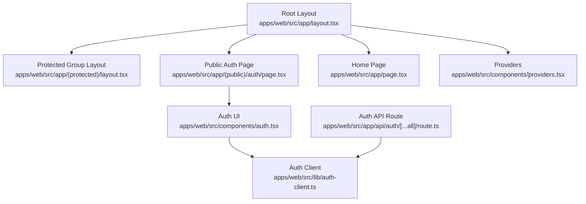
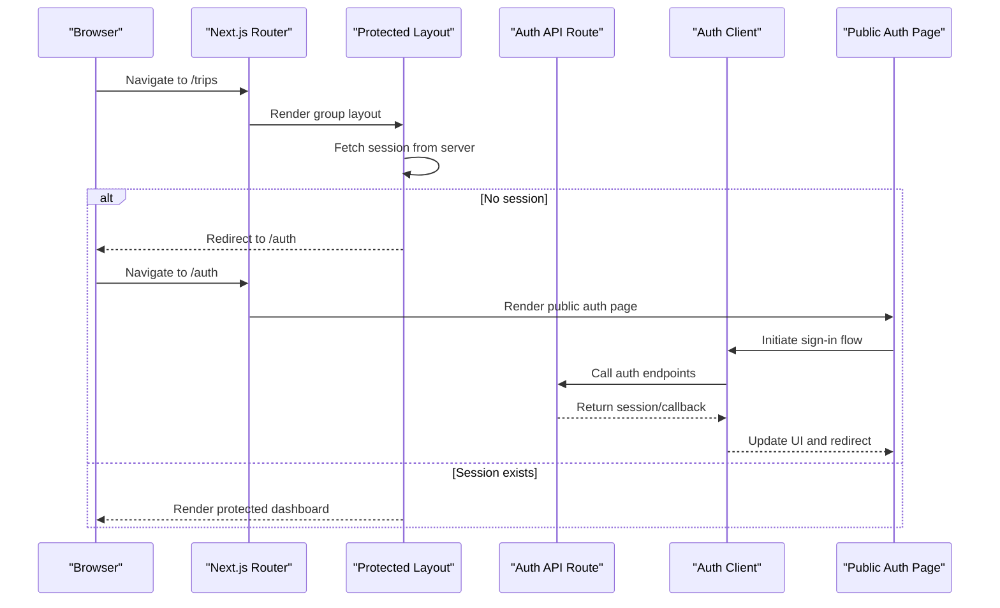
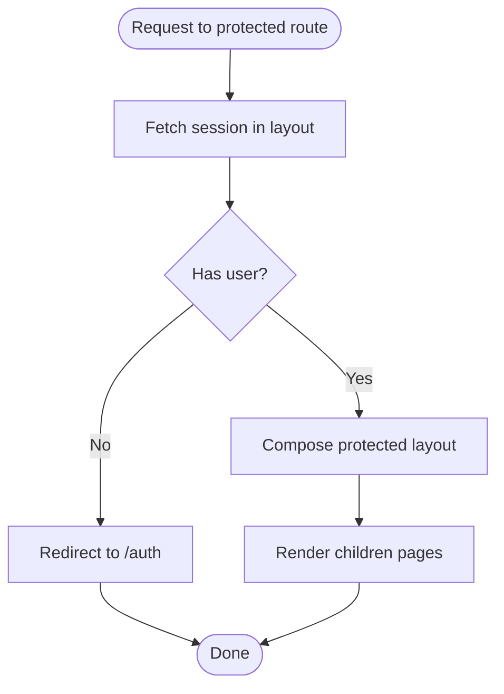
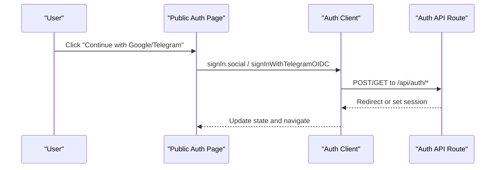
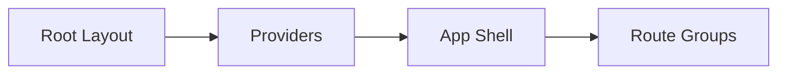
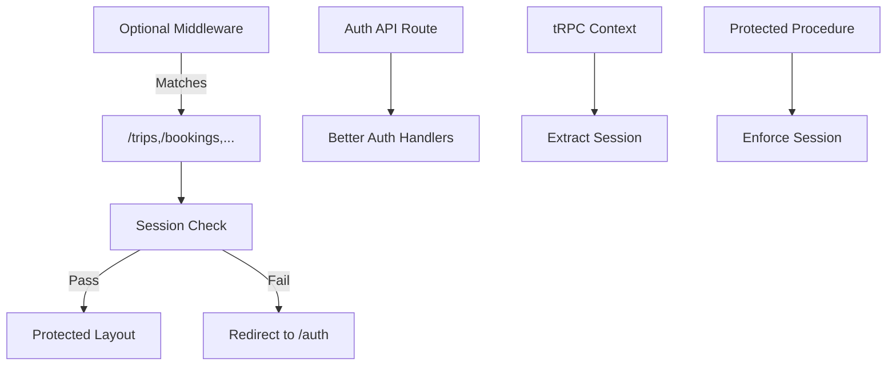
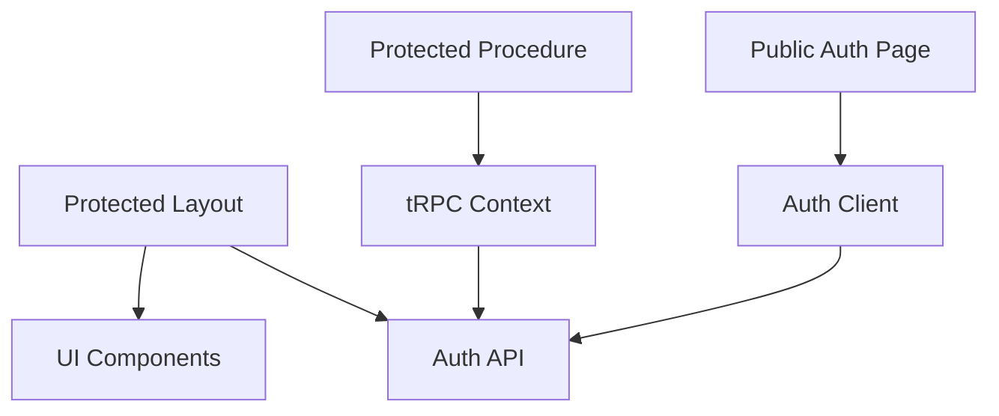

# Route Groups and Organization

<cite>
**Referenced Files in This Document**
- [layout.tsx](file://apps/web/src/app/(protected)/layout.tsx)
- [page.tsx](file://apps/web/src/app/(public)/auth/page.tsx)
- [layout.tsx](file://apps/web/src/app/layout.tsx)
- [page.tsx](file://apps/web/src/app/page.tsx)
- [route.ts](file://apps/web/src/app/api/auth/[...all]/route.ts)
- [auth-client.ts](file://apps/web/src/lib/auth-client.ts)
- [auth.tsx](file://apps/web/src/components/auth.tsx)
- [providers.tsx](file://apps/web/src/components/providers.tsx)
- [next.config.ts](file://apps/web/src/next.config.ts)
- [context.ts](file://packages/api/src/context.ts)
- [index.ts](file://packages/api/src/index.ts)
</cite>

## Table of Contents

1. [Introduction](#introduction)
2. [Project Structure](#project-structure)
3. [Core Components](#core-components)
4. [Architecture Overview](#architecture-overview)
5. [Detailed Component Analysis](#detailed-component-analysis)
6. [Dependency Analysis](#dependency-analysis)
7. [Performance Considerations](#performance-considerations)
8. [Troubleshooting Guide](#troubleshooting-guide)
9. [Conclusion](#conclusion)

## Introduction

This document explains how the Atlas web application uses Next.js route groups to organize protected and public routes, with a focus on authentication guards at the group level, layout composition, shared UI structure, middleware integration patterns, and performance considerations. The protected group enforces authentication via its layout, while the public group exposes login flows without requiring a session.

## Project Structure

The app directory is organized into:

- Root layout that provides global providers and base HTML structure.
- A protected route group that wraps authenticated pages behind a layout-level guard.
- A public route group for unauthenticated flows such as sign-in.
- API routes for authentication endpoints and tRPC.

**Diagram sources**

- [layout.tsx:1-47](file://apps/web/src/app/layout.tsx#L1-L47)
- [layout.tsx](<file://apps/web/src/app/(protected)/layout.tsx#L1-L66>)
- [page.tsx](<file://apps/web/src/app/(public)/auth/page.tsx#L1-L8>)
- [page.tsx:1-39](file://apps/web/src/app/page.tsx#L1-L39)
- [route.ts:1-4](file://apps/web/src/app/api/auth/[...all]/route.ts#L1-L4)
- [auth-client.ts:1-8](file://apps/web/src/lib/auth-client.ts#L1-L8)
- [auth.tsx:1-69](file://apps/web/src/components/auth.tsx#L1-L69)
- [providers.tsx:1-27](file://apps/web/src/components/providers.tsx#L1-L27)

**Section sources**

- [layout.tsx:1-47](file://apps/web/src/app/layout.tsx#L1-L47)
- [layout.tsx](<file://apps/web/src/app/(protected)/layout.tsx#L1-L66>)
- [page.tsx](<file://apps/web/src/app/(public)/auth/page.tsx#L1-L8>)
- [page.tsx:1-39](file://apps/web/src/app/page.tsx#L1-L39)

## Core Components

- Protected group layout: Performs server-side session check and redirects unauthenticated users to the public auth page. It also composes the dashboard shell (sidebar, header, content area).
- Public auth page: Renders the sign-in UI using the client-side auth client.
- Root layout: Wraps the app with global providers and fonts.
- Auth API route: Bridges Better Auth to Next.js handlers for OAuth and session management.
- Auth client: Configures the Better Auth client with plugins for Telegram and last-login method tracking.
- Providers: Supplies theme and data fetching context globally.

**Section sources**

- [layout.tsx](<file://apps/web/src/app/(protected)/layout.tsx#L1-L66>)
- [page.tsx](<file://apps/web/src/app/(public)/auth/page.tsx#L1-L8>)
- [layout.tsx:1-47](file://apps/web/src/app/layout.tsx#L1-L47)
- [route.ts:1-4](file://apps/web/src/app/api/auth/[...all]/route.ts#L1-L4)
- [auth-client.ts:1-8](file://apps/web/src/lib/auth-client.ts#L1-L8)
- [providers.tsx:1-27](file://apps/web/src/components/providers.tsx#L1-L27)

## Architecture Overview

The protected vs public strategy relies on Next.js route groups:

- Public routes are accessible without a session.
- Protected routes enforce authentication in their group layout before rendering any child pages.

**Diagram sources**

- [layout.tsx](<file://apps/web/src/app/(protected)/layout.tsx#L1-L66>)
- [page.tsx](<file://apps/web/src/app/(public)/auth/page.tsx#L1-L8>)
- [route.ts:1-4](file://apps/web/src/app/api/auth/[...all]/route.ts#L1-L4)
- [auth-client.ts:1-8](file://apps/web/src/lib/auth-client.ts#L1-L8)

## Detailed Component Analysis

### Protected Route Group Strategy

- Authentication guard: The protected group layout fetches the session on the server and redirects to the public auth page if no user is present.
- Shared UI composition: The layout composes the sidebar provider, assistant panel provider, dashboard content, header, and main content area.
- Benefits:
  - Centralized security: One place to enforce access control for all protected routes.
  - Consistent UX: All protected pages share the same shell and behavior.
  - Maintainability: Adding new protected pages requires no additional auth logic.

**Diagram sources**

- [layout.tsx](<file://apps/web/src/app/(protected)/layout.tsx#L1-L66>)

**Section sources**

- [layout.tsx](<file://apps/web/src/app/(protected)/layout.tsx#L1-L66>)

### Public Route Group Strategy

- Purpose: Hosts unauthenticated flows like sign-in.
- Implementation: The public auth page renders a client component that triggers sign-in via the auth client.
- Integration: Sign-in calls the auth API route which handles OAuth flows and sets sessions.

**Diagram sources**

- [page.tsx](<file://apps/web/src/app/(public)/auth/page.tsx#L1-L8>)
- [auth.tsx:1-69](file://apps/web/src/components/auth.tsx#L1-L69)
- [auth-client.ts:1-8](file://apps/web/src/lib/auth-client.ts#L1-L8)
- [route.ts:1-4](file://apps/web/src/app/api/auth/[...all]/route.ts#L1-L4)

**Section sources**

- [page.tsx](<file://apps/web/src/app/(public)/auth/page.tsx#L1-L8>)
- [auth.tsx:1-69](file://apps/web/src/components/auth.tsx#L1-L69)
- [auth-client.ts:1-8](file://apps/web/src/lib/auth-client.ts#L1-L8)
- [route.ts:1-4](file://apps/web/src/app/api/auth/[...all]/route.ts#L1-L4)

### Root Layout and Global Providers

- Root layout defines metadata, fonts, and a minimal shell that hosts the rest of the app.
- Providers wrap the app with theme and query client contexts used across routes.

**Diagram sources**

- [layout.tsx:1-47](file://apps/web/src/app/layout.tsx#L1-L47)
- [providers.tsx:1-27](file://apps/web/src/components/providers.tsx#L1-L27)

**Section sources**

- [layout.tsx:1-47](file://apps/web/src/app/layout.tsx#L1-L47)
- [providers.tsx:1-27](file://apps/web/src/components/providers.tsx#L1-L27)

### Middleware Integration Notes

- The current implementation uses a layout-based guard for protected routes rather than a global middleware file.
- For broader protection or cross-cutting concerns, consider adding a Next.js middleware that matches protected paths and performs session checks before rendering layouts.
- API routes and tRPC procedures already include session handling:
  - Auth API route delegates to Better Auth handlers.
  - tRPC context extracts session from request headers.
  - tRPC protected procedure enforces session presence.

**Diagram sources**

- [route.ts:1-4](file://apps/web/src/app/api/auth/[...all]/route.ts#L1-L4)
- [context.ts:1-14](file://packages/api/src/context.ts#L1-L14)
- [index.ts:1-25](file://packages/api/src/index.ts#L1-L25)

**Section sources**

- [route.ts:1-4](file://apps/web/src/app/api/auth/[...all]/route.ts#L1-L4)
- [context.ts:1-14](file://packages/api/src/context.ts#L1-L14)
- [index.ts:1-25](file://packages/api/src/index.ts#L1-L25)

### Performance Considerations for Grouped Routes

- Server-side session check in the protected layout avoids unnecessary client hydration for unauthenticated users.
- Partial prefetching and component caching are enabled in configuration to improve navigation speed.
- Suspense boundaries in protected pages provide responsive loading states.
- Optimize package imports for large icon libraries to reduce bundle size.

**Section sources**

- [layout.tsx](<file://apps/web/src/app/(protected)/layout.tsx#L1-L66>)
- [page.tsx](<file://apps/web/src/app/(protected)/trips/page.tsx#L1-L30>)
- [page.tsx](<file://apps/web/src/app/(protected)/activity/page.tsx#L1-L30>)
- [page.tsx](<file://apps/web/src/app/(protected)/bookings/page.tsx#L1-L30>)
- [next.config.ts:1-31](file://apps/web/src/next.config.ts#L1-L31)

## Dependency Analysis

- Protected layout depends on:
  - Auth API to retrieve session.
  - UI components for sidebar, header, and content.
  - Navigation utilities for redirection.
- Public auth page depends on:
  - Auth client for initiating sign-in.
  - Auth UI for buttons and feedback.
- API layer depends on:
  - Better Auth handlers for OAuth and session management.
  - tRPC context for extracting sessions and enforcing protected procedures.

**Diagram sources**

- [layout.tsx](<file://apps/web/src/app/(protected)/layout.tsx#L1-L66>)
- [page.tsx](<file://apps/web/src/app/(public)/auth/page.tsx#L1-L8>)
- [auth-client.ts:1-8](file://apps/web/src/lib/auth-client.ts#L1-L8)
- [route.ts:1-4](file://apps/web/src/app/api/auth/[...all]/route.ts#L1-L4)
- [context.ts:1-14](file://packages/api/src/context.ts#L1-L14)
- [index.ts:1-25](file://packages/api/src/index.ts#L1-L25)

**Section sources**

- [layout.tsx](<file://apps/web/src/app/(protected)/layout.tsx#L1-L66>)
- [page.tsx](<file://apps/web/src/app/(public)/auth/page.tsx#L1-L8>)
- [auth-client.ts:1-8](file://apps/web/src/lib/auth-client.ts#L1-L8)
- [route.ts:1-4](file://apps/web/src/app/api/auth/[...all]/route.ts#L1-L4)
- [context.ts:1-14](file://packages/api/src/context.ts#L1-L14)
- [index.ts:1-25](file://packages/api/src/index.ts#L1-L25)

## Performance Considerations

- Prefer server-side session checks in layouts to minimize client work for unauthenticated users.
- Use Suspense boundaries around heavy or async content to keep the UI responsive.
- Enable partial prefetching and component caching to speed up navigation between grouped routes.
- Optimize third-party dependencies (e.g., icon libraries) to reduce initial bundle size.

[No sources needed since this section provides general guidance]

## Troubleshooting Guide

- If protected routes redirect unexpectedly:
  - Verify that the session is being fetched correctly in the protected layout.
  - Ensure cookies are properly set by the auth API route during sign-in.
- If sign-in does not redirect after login:
  - Confirm the auth client is configured with correct plugins and callback URLs.
  - Check that the auth API route is reachable and returns expected responses.
- If tRPC calls fail with unauthorized:
  - Ensure the tRPC context extracts the session from request headers.
  - Confirm protected procedures require a session.

**Section sources**

- [layout.tsx](<file://apps/web/src/app/(protected)/layout.tsx#L1-L66>)
- [route.ts:1-4](file://apps/web/src/app/api/auth/[...all]/route.ts#L1-L4)
- [auth-client.ts:1-8](file://apps/web/src/lib/auth-client.ts#L1-L8)
- [context.ts:1-14](file://packages/api/src/context.ts#L1-L14)
- [index.ts:1-25](file://packages/api/src/index.ts#L1-L25)

## Conclusion

Atlas leverages Next.js route groups to cleanly separate protected and public experiences. The protected group’s layout acts as a centralized authentication guard and shared UI shell, improving maintainability and consistency. Public routes host sign-in flows that integrate with a robust auth API and client. With server-side session checks, Suspense boundaries, and optimized configuration, the app balances security and performance effectively.

[No sources needed since this section summarizes without analyzing specific files]
