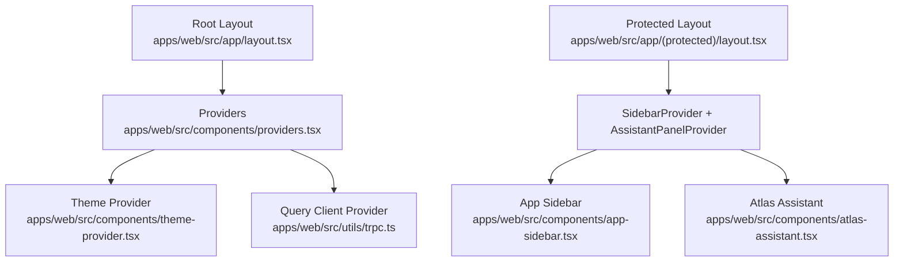
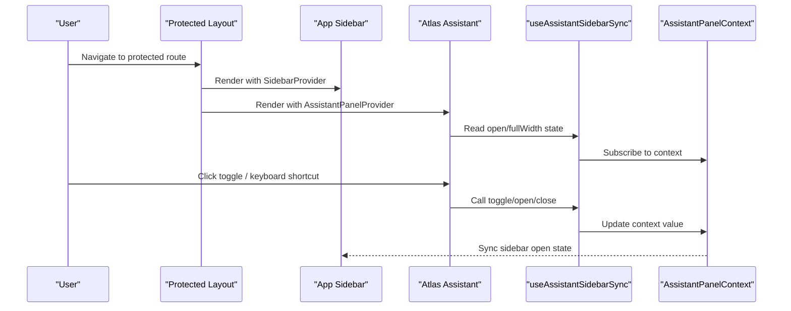
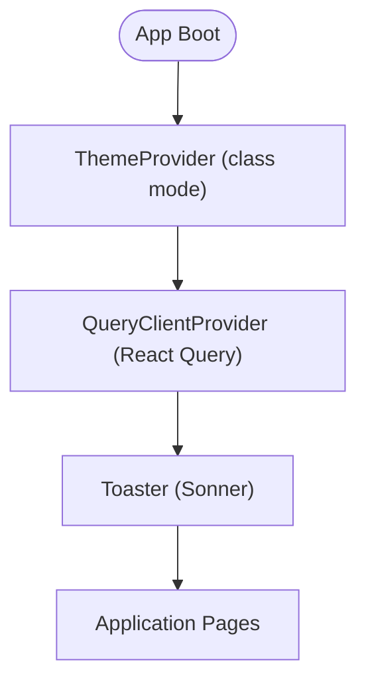
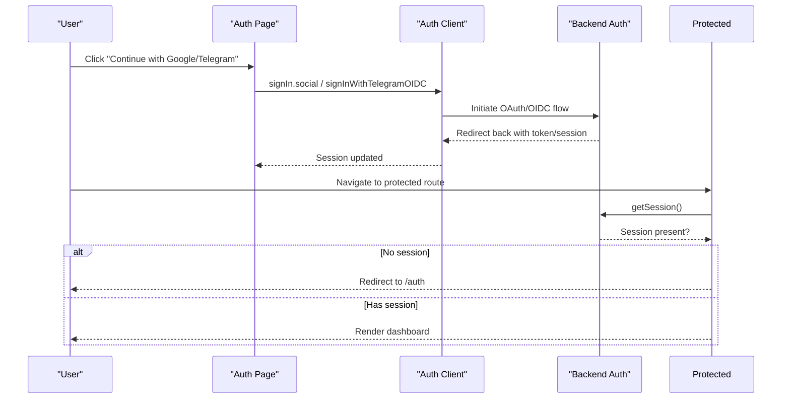
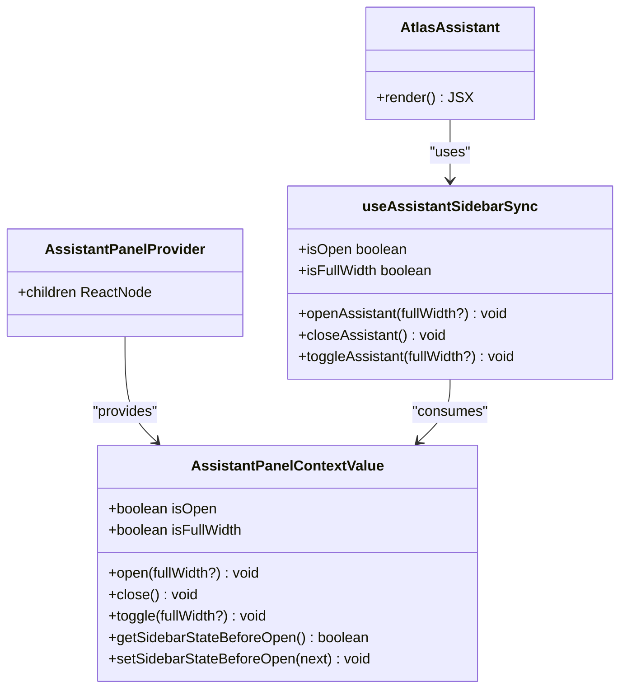
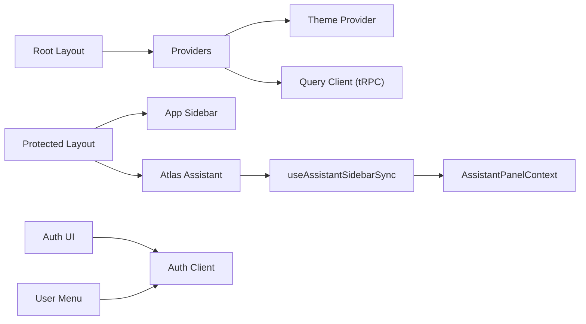

# Component Architecture and Patterns

<cite>
**Referenced Files in This Document**
- [providers.tsx](file://apps/web/src/components/providers.tsx)
- [theme-provider.tsx](file://apps/web/src/components/theme-provider.tsx)
- [auth.tsx](file://apps/web/src/components/auth.tsx)
- [auth-client.ts](file://apps/web/src/lib/auth-client.ts)
- [use-assistant-panel.tsx](file://apps/web/src/hooks/use-assistant-panel.tsx)
- [atlas-assistant.tsx](file://apps/web/src/components/atlas-assistant.tsx)
- [mode-toggle.tsx](file://apps/web/src/components/mode-toggle.tsx)
- [header.tsx](file://apps/web/src/components/header.tsx)
- [app-sidebar.tsx](file://apps/web/src/components/app-sidebar.tsx)
- [trpc.ts](file://apps/web/src/utils/trpc.ts)
- [layout.tsx](file://apps/web/src/app/layout.tsx)
- [protected-layout.tsx](file://apps/web/src/app/(protected)/layout.tsx)
- [loader.tsx](file://apps/web/src/components/loader.tsx)
- [user-menu.tsx](file://apps/web/src/components/user-menu.tsx)
</cite>

## Table of Contents

1. Introduction
2. Project Structure
3. Core Components
4. Architecture Overview
5. Detailed Component Analysis
6. Dependency Analysis
7. Performance Considerations
8. Troubleshooting Guide
9. Conclusion

## Introduction

This document explains the React component architecture with a focus on modern patterns and best practices used in the application. It covers:

- Component composition strategy and prop drilling alternatives
- Context usage patterns and provider pattern for global state, theme, and authentication
- Separation between presentational and container components
- Reusable UI components from the shared library
- Custom hooks organization
- Testing strategies, performance optimization (memoization, lazy loading), and accessibility compliance

## Project Structure

The app is organized around a Next.js App Router layout that wraps all pages with providers for theming, data fetching, and notifications. Protected routes add sidebar and assistant context providers. Shared UI components come from a local design system package.

**Diagram sources**

- [layout.tsx:26-46](file://apps/web/src/app/layout.tsx#L26-L46)
- [providers.tsx:11-26](file://apps/web/src/components/providers.tsx#L11-L26)
- [theme-provider.tsx:6-11](file://apps/web/src/components/theme-provider.tsx#L6-L11)
- [trpc.ts:7-20](file://apps/web/src/utils/trpc.ts#L7-L20)
- [protected-layout.tsx:35-63](<file://apps/web/src/app/(protected)/layout.tsx#L35-L63>)
- [app-sidebar.tsx:13-24](file://apps/web/src/components/app-sidebar.tsx#L13-L24)
- [atlas-assistant.tsx:122-174](file://apps/web/src/components/atlas-assistant.tsx#L122-L174)

**Section sources**

- [layout.tsx:26-46](file://apps/web/src/app/layout.tsx#L26-L46)
- [providers.tsx:11-26](file://apps/web/src/components/providers.tsx#L11-L26)
- [protected-layout.tsx:35-63](<file://apps/web/src/app/(protected)/layout.tsx#L35-L63>)

## Core Components

- Providers: Root-level wrapper that composes ThemeProvider, QueryClientProvider, and Toaster.
- Theme Provider: Thin wrapper around next-themes to apply theme via class attribute.
- Authentication UI: Sign-in page using Better Auth client with social providers and last-used method badge.
- Assistant Panel: Context-driven side panel with persistence and sidebar synchronization.
- Header and Mode Toggle: Presentational header with navigation and theme switching.
- App Sidebar: Composition of sidebar content and user nav.
- Data Layer: tRPC client configured with React Query and error handling via toast.

Key responsibilities:

- Global concerns (theme, data cache, toasts) are centralized in Providers.
- Feature-specific contexts (assistant panel) live near their feature area.
- Presentational components remain pure and consume context or props without side effects.

**Section sources**

- [providers.tsx:11-26](file://apps/web/src/components/providers.tsx#L11-L26)
- [theme-provider.tsx:6-11](file://apps/web/src/components/theme-provider.tsx#L6-L11)
- [auth.tsx:22-68](file://apps/web/src/components/auth.tsx#L22-L68)
- [use-assistant-panel.tsx:67-151](file://apps/web/src/hooks/use-assistant-panel.tsx#L67-L151)
- [header.tsx:7-31](file://apps/web/src/components/header.tsx#L7-L31)
- [mode-toggle.tsx:13-36](file://apps/web/src/components/mode-toggle.tsx#L13-L36)
- [app-sidebar.tsx:13-24](file://apps/web/src/components/app-sidebar.tsx#L13-L24)
- [trpc.ts:7-40](file://apps/web/src/utils/trpc.ts#L7-L40)

## Architecture Overview

The application uses a layered provider model:

- Root layout injects global providers (theme, query client, toasts).
- Protected layout adds domain-specific providers (sidebar, assistant panel).
- Feature components consume contexts via custom hooks.
- Data fetching is centralized through tRPC + React Query.

**Diagram sources**

- [protected-layout.tsx:35-63](<file://apps/web/src/app/(protected)/layout.tsx#L35-L63>)
- [atlas-assistant.tsx:122-174](file://apps/web/src/components/atlas-assistant.tsx#L122-L174)
- [use-assistant-panel.tsx:169-234](file://apps/web/src/hooks/use-assistant-panel.tsx#L169-L234)

## Detailed Component Analysis

### Provider Pattern: Theme and Data

- ThemeProvider wraps children and delegates to next-themes with class-based theme toggling.
- QueryClientProvider configures React Query with a shared QueryCache that surfaces errors via toast and offers retry actions.

**Diagram sources**

- [providers.tsx:11-26](file://apps/web/src/components/providers.tsx#L11-L26)
- [theme-provider.tsx:6-11](file://apps/web/src/components/theme-provider.tsx#L6-L11)
- [trpc.ts:7-20](file://apps/web/src/utils/trpc.ts#L7-L20)

**Section sources**

- [providers.tsx:11-26](file://apps/web/src/components/providers.tsx#L11-L26)
- [theme-provider.tsx:6-11](file://apps/web/src/components/theme-provider.tsx#L6-L11)
- [trpc.ts:7-20](file://apps/web/src/utils/trpc.ts#L7-L20)

### Authentication Context and Flow

- The auth client is created with plugins for Telegram OIDC and last login method tracking.
- The sign-in page shows provider buttons and a “Last used” badge based on the last login method.
- Protected routes enforce server-side session checks and redirect unauthenticated users.

**Diagram sources**

- [auth-client.ts:5-7](file://apps/web/src/lib/auth-client.ts#L5-L7)
- [auth.tsx:9-20](file://apps/web/src/components/auth.tsx#L9-L20)
- [protected-layout.tsx:27-33](<file://apps/web/src/app/(protected)/layout.tsx#L27-L33>)

**Section sources**

- [auth-client.ts:5-7](file://apps/web/src/lib/auth-client.ts#L5-L7)
- [auth.tsx:22-68](file://apps/web/src/components/auth.tsx#L22-L68)
- [protected-layout.tsx:27-33](<file://apps/web/src/app/(protected)/layout.tsx#L27-L33>)

### Assistant Panel: Context, Persistence, and Sidebar Sync

- AssistantPanelProvider exposes open/close/toggle and full-width state, persisted to localStorage.
- useAssistantSidebarSync coordinates opening/closing the assistant with the app sidebar’s open state and mobile behavior.
- AtlasAssistant consumes the sync hook, renders header, empty state, and composer, and handles keyboard shortcuts.

**Diagram sources**

- [use-assistant-panel.tsx:20-28](file://apps/web/src/hooks/use-assistant-panel.tsx#L20-L28)
- [use-assistant-panel.tsx:67-151](file://apps/web/src/hooks/use-assistant-panel.tsx#L67-L151)
- [use-assistant-panel.tsx:169-234](file://apps/web/src/hooks/use-assistant-panel.tsx#L169-L234)
- [atlas-assistant.tsx:122-174](file://apps/web/src/components/atlas-assistant.tsx#L122-L174)

**Section sources**

- [use-assistant-panel.tsx:67-151](file://apps/web/src/hooks/use-assistant-panel.tsx#L67-L151)
- [use-assistant-panel.tsx:169-234](file://apps/web/src/hooks/use-assistant-panel.tsx#L169-L234)
- [atlas-assistant.tsx:122-174](file://apps/web/src/components/atlas-assistant.tsx#L122-L174)

### Presentational vs Container Components

- Presentational: ModeToggle, Header, Loader, UserMenu (focus on rendering and user interactions).
- Container/Orchestration: Providers, Protected Layout, AssistantPanelProvider (manage global state and side effects).
- Composition: AppSidebar composes NavMain and NavUser; AtlasAssistant composes header, empty state, and composer.

**Section sources**

- [mode-toggle.tsx:13-36](file://apps/web/src/components/mode-toggle.tsx#L13-L36)
- [header.tsx:7-31](file://apps/web/src/components/header.tsx#L7-L31)
- [loader.tsx:3-8](file://apps/web/src/components/loader.tsx#L3-L8)
- [user-menu.tsx:17-61](file://apps/web/src/components/user-menu.tsx#L17-L61)
- [app-sidebar.tsx:13-24](file://apps/web/src/components/app-sidebar.tsx#L13-L24)
- [atlas-assistant.tsx:122-174](file://apps/web/src/components/atlas-assistant.tsx#L122-L174)

### Reusable UI Components

- The codebase leverages a shared UI library for primitives such as Button, DropdownMenu, Sidebar, Badge, Skeleton, Separator, and icons.
- These components are composed to build higher-level features like the header, user menu, and assistant panel.

**Section sources**

- [mode-toggle.tsx:3-9](file://apps/web/src/components/mode-toggle.tsx#L3-L9)
- [user-menu.tsx:1-11](file://apps/web/src/components/user-menu.tsx#L1-L11)
- [app-sidebar.tsx:3-7](file://apps/web/src/components/app-sidebar.tsx#L3-L7)
- [auth.tsx:1-3](file://apps/web/src/components/auth.tsx#L1-L3)

### Custom Hooks Organization

- useAssistantPanel: encapsulates assistant panel state, persistence, and context API.
- useAssistantSidebarSync: orchestrates assistant panel with sidebar state and mobile behavior.
- Both hooks promote reuse and separation of concerns across components.

**Section sources**

- [use-assistant-panel.tsx:67-151](file://apps/web/src/hooks/use-assistant-panel.tsx#L67-L151)
- [use-assistant-panel.tsx:169-234](file://apps/web/src/hooks/use-assistant-panel.tsx#L169-L234)

## Dependency Analysis

High-level dependencies among key files:

**Diagram sources**

- [layout.tsx:26-46](file://apps/web/src/app/layout.tsx#L26-L46)
- [providers.tsx:11-26](file://apps/web/src/components/providers.tsx#L11-L26)
- [theme-provider.tsx:6-11](file://apps/web/src/components/theme-provider.tsx#L6-L11)
- [trpc.ts:22-40](file://apps/web/src/utils/trpc.ts#L22-L40)
- [protected-layout.tsx:35-63](<file://apps/web/src/app/(protected)/layout.tsx#L35-L63>)
- [app-sidebar.tsx:13-24](file://apps/web/src/components/app-sidebar.tsx#L13-L24)
- [atlas-assistant.tsx:122-174](file://apps/web/src/components/atlas-assistant.tsx#L122-L174)
- [use-assistant-panel.tsx:169-234](file://apps/web/src/hooks/use-assistant-panel.tsx#L169-L234)
- [auth.tsx:22-68](file://apps/web/src/components/auth.tsx#L22-L68)
- [auth-client.ts:5-7](file://apps/web/src/lib/auth-client.ts#L5-L7)
- [user-menu.tsx:17-61](file://apps/web/src/components/user-menu.tsx#L17-L61)

**Section sources**

- [layout.tsx:26-46](file://apps/web/src/app/layout.tsx#L26-L46)
- [providers.tsx:11-26](file://apps/web/src/components/providers.tsx#L11-L26)
- [protected-layout.tsx:35-63](<file://apps/web/src/app/(protected)/layout.tsx#L35-L63>)
- [atlas-assistant.tsx:122-174](file://apps/web/src/components/atlas-assistant.tsx#L122-L174)
- [use-assistant-panel.tsx:169-234](file://apps/web/src/hooks/use-assistant-panel.tsx#L169-L234)
- [auth.tsx:22-68](file://apps/web/src/components/auth.tsx#L22-L68)
- [auth-client.ts:5-7](file://apps/web/src/lib/auth-client.ts#L5-L7)
- [user-menu.tsx:17-61](file://apps/web/src/components/user-menu.tsx#L17-L61)

## Performance Considerations

- Memoization:
  - Use memoized components for expensive sub-trees when needed.
  - Prefer simple expressions over unnecessary useMemo for primitive results.
- Lazy Initialization:
  - Use function form for useState when initial values are expensive or read from storage.
- Conditional Module Loading:
  - Load heavy modules only when features activate to reduce bundle size.
- Rendering Optimizations:
  - Hoist static JSX where possible.
  - Avoid inline components in render paths to enable stable references.
- Hydration and Transitions:
  - Suppress hydration warnings where appropriate and use transitions for smooth UI updates.

[No sources needed since this section provides general guidance]

## Troubleshooting Guide

- Authentication:
  - If protected routes redirect unexpectedly, verify server-side session retrieval and redirect logic.
  - Ensure auth client plugins are correctly initialized and callbacks are set.
- Data Fetching Errors:
  - React Query error handler displays toast with retry action; inspect network requests and credentials configuration.
- Assistant Panel State:
  - If panel state does not persist, check localStorage availability and error handling in persistence helpers.
  - Verify sidebar synchronization logic respects mobile overlay behavior.
- Theme Toggling:
  - Confirm theme provider is mounted at root and class attribute mode is enabled.

**Section sources**

- [protected-layout.tsx:27-33](<file://apps/web/src/app/(protected)/layout.tsx#L27-L33>)
- [auth-client.ts:5-7](file://apps/web/src/lib/auth-client.ts#L5-L7)
- [trpc.ts:7-20](file://apps/web/src/utils/trpc.ts#L7-L20)
- [use-assistant-panel.tsx:34-61](file://apps/web/src/hooks/use-assistant-panel.tsx#L34-L61)
- [theme-provider.tsx:6-11](file://apps/web/src/components/theme-provider.tsx#L6-L11)

## Conclusion

The application follows a clear provider-based architecture with strong separation of concerns:

- Global concerns (theme, data, toasts) are centralized at the root.
- Domain-specific contexts (assistant panel) are scoped near their features.
- Presentational components remain focused on rendering and user interactions.
- Custom hooks encapsulate complex behaviors and state synchronization. These patterns improve maintainability, testability, and performance while supporting accessibility and scalable composition.

[No sources needed since this section summarizes without analyzing specific files]
