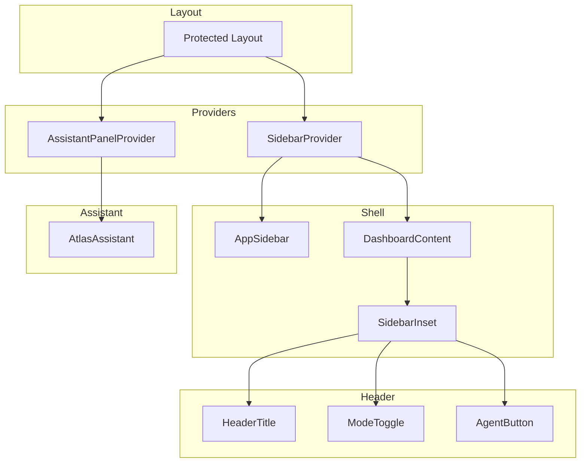
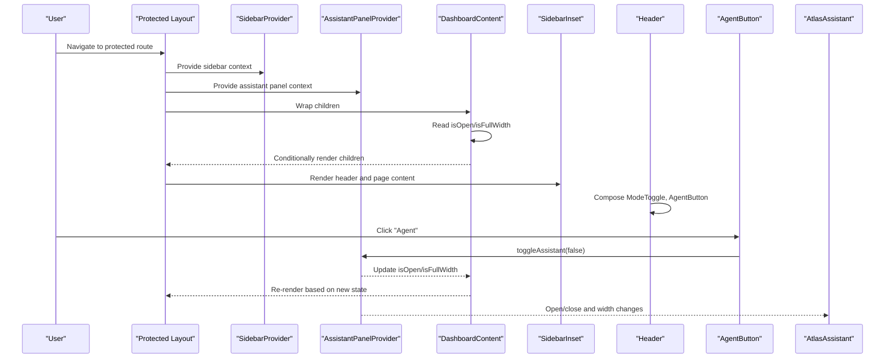
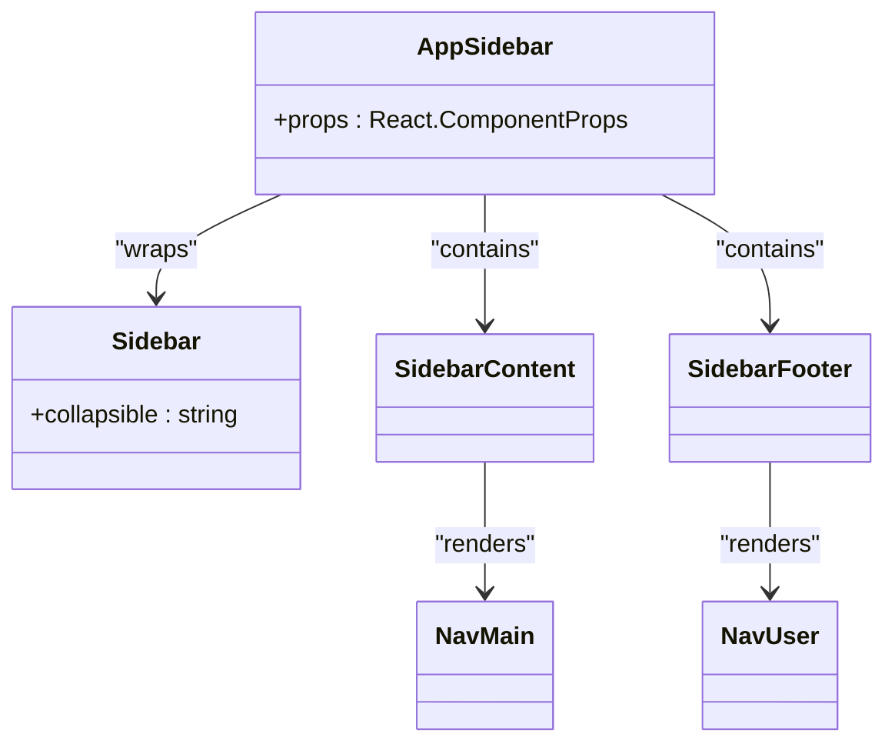
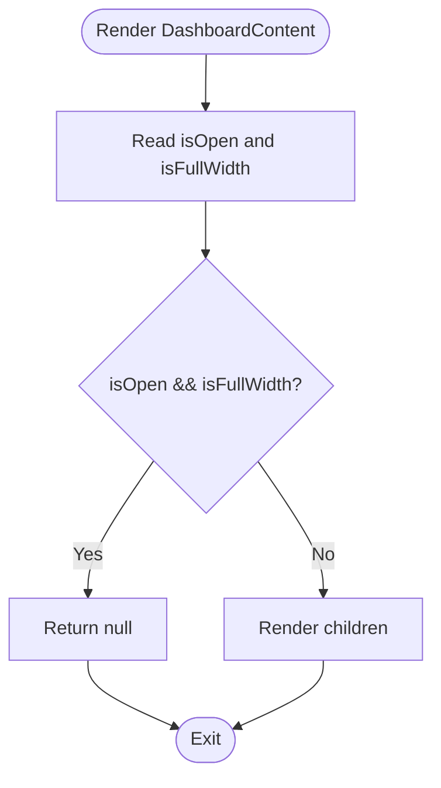
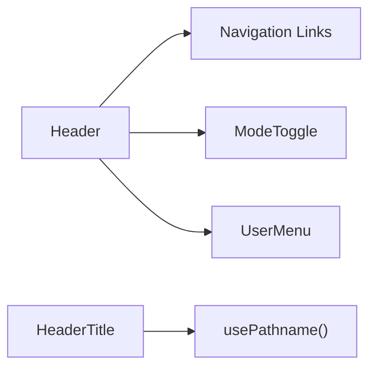
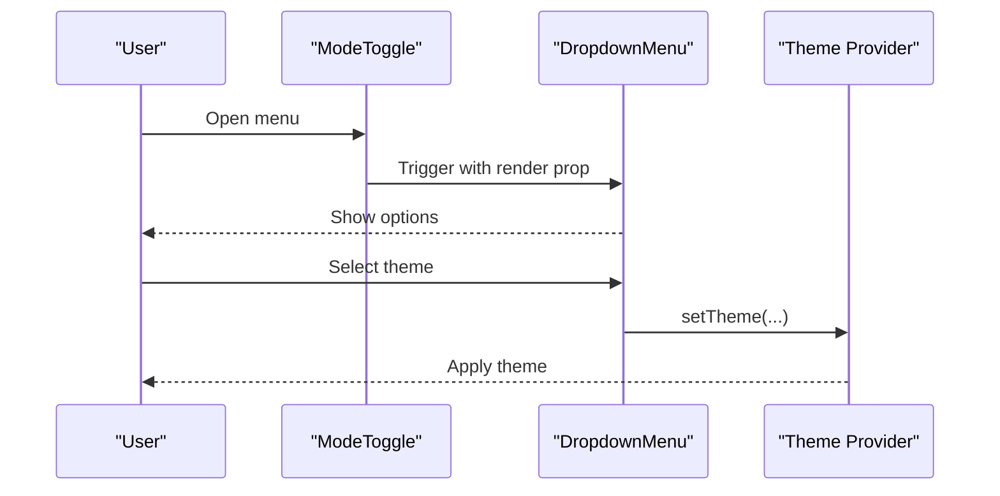
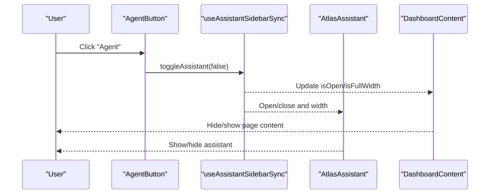
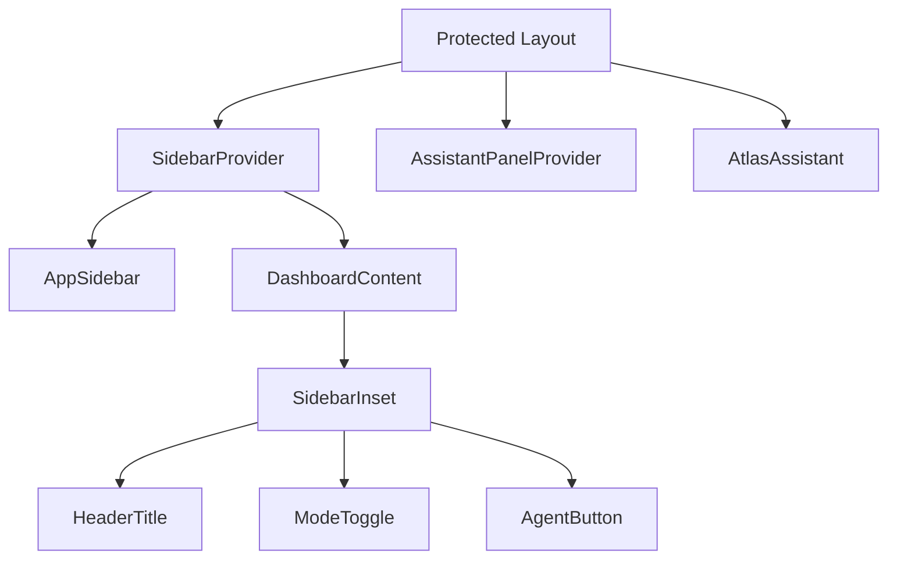
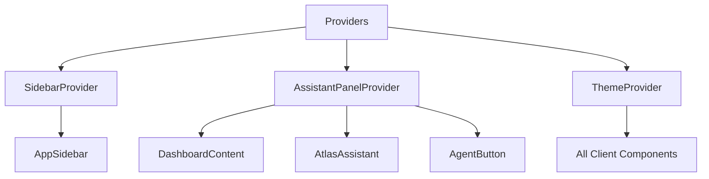

# Component Composition and Reusability

<cite>
**Referenced Files in This Document**
- [layout.tsx](file://apps/web/src/app/(protected)/layout.tsx)
- [app-sidebar.tsx](file://apps/web/src/components/app-sidebar.tsx)
- [nav-main.tsx](file://apps/web/src/components/nav-main.tsx)
- [nav-user.tsx](file://apps/web/src/components/nav-user.tsx)
- [header.tsx](file://apps/web/src/components/header.tsx)
- [header-title.tsx](file://apps/web/src/components/header-title.tsx)
- [dashboard-content.tsx](file://apps/web/src/components/dashboard-content.tsx)
- [atlas-assistant.tsx](file://apps/web/src/components/atlas-assistant.tsx)
- [agent-button.tsx](file://apps/web/src/components/agent-button.tsx)
- [mode-toggle.tsx](file://apps/web/src/components/mode-toggle.tsx)
- [user-menu.tsx](file://apps/web/src/components/user-menu.tsx)
- [use-assistant-panel.tsx](file://apps/web/src/hooks/use-assistant-panel.tsx)
- [providers.tsx](file://apps/web/src/components/providers.tsx)
- [theme-provider.tsx](file://apps/web/src/components/theme-provider.tsx)
</cite>

## Table of Contents

1. Introduction
2. Project Structure
3. Core Components
4. Architecture Overview
5. Detailed Component Analysis
6. Dependency Analysis
7. Performance Considerations
8. Troubleshooting Guide
9. Conclusion

## Introduction

This document explains how the Atlas application composes complex UI from smaller, reusable parts. It focuses on presentational versus container responsibilities, prop interfaces, composition patterns (children-based composition, compound components, render props), and cross-cutting concerns such as accessibility and performance. The goal is to help developers understand how Header, DashboardContent, and AppSidebar are built from primitives and how they collaborate with shared state and layout providers.

## Project Structure

The web app organizes UI around a protected layout that wires together:

- A sidebar provider and inset content area
- An assistant panel provider for global open/full-width state
- Presentational building blocks for navigation, header, and user controls
- A dashboard content wrapper that coordinates visibility with the assistant panel

**Diagram sources**

- [layout.tsx:35-63](<file://apps/web/src/app/(protected)/layout.tsx#L35-L63>)
- [app-sidebar.tsx:13-24](file://apps/web/src/components/app-sidebar.tsx#L13-L24)
- [dashboard-content.tsx:5-17](file://apps/web/src/components/dashboard-content.tsx#L5-L17)
- [atlas-assistant.tsx:122-174](file://apps/web/src/components/atlas-assistant.tsx#L122-L174)

**Section sources**

- [layout.tsx:22-66](<file://apps/web/src/app/(protected)/layout.tsx#L22-L66>)

## Core Components

- AppSidebar: A compound component that composes Sidebar, SidebarContent, SidebarFooter, NavMain, and NavUser. It forwards props to the base Sidebar and provides consistent structure.
- DashboardContent: A children-based wrapper that conditionally renders its children based on assistant panel state.
- Header and HeaderTitle: Presentational pieces that display navigation links and derive a page title from the current route.
- ModeToggle and UserMenu: Small presentational components that manage theme switching and user actions via dropdowns.
- AtlasAssistant and AgentButton: Collaborate through shared context to open/close/toggle the assistant panel and coordinate with the sidebar.

Key composition patterns used:

- Children-based composition: DashboardContent wraps page content and decides rendering based on context.
- Compound components: AppSidebar composes multiple subcomponents into a cohesive shell.
- Render props: Some UI primitives accept a render prop to customize trigger/content while preserving semantics.
- Context-driven coordination: Assistant panel state drives layout behavior across components.

**Section sources**

- [app-sidebar.tsx:13-24](file://apps/web/src/components/app-sidebar.tsx#L13-L24)
- [dashboard-content.tsx:5-17](file://apps/web/src/components/dashboard-content.tsx#L5-L17)
- [header.tsx:7-30](file://apps/web/src/components/header.tsx#L7-L30)
- [header-title.tsx:5-12](file://apps/web/src/components/header-title.tsx#L5-L12)
- [mode-toggle.tsx:13-35](file://apps/web/src/components/mode-toggle.tsx#L13-L35)
- [user-menu.tsx:17-60](file://apps/web/src/components/user-menu.tsx#L17-L60)
- [atlas-assistant.tsx:122-174](file://apps/web/src/components/atlas-assistant.tsx#L122-L174)
- [agent-button.tsx:9-26](file://apps/web/src/components/agent-button.tsx#L9-L26)

## Architecture Overview

The protected layout establishes the application shell using providers and composes the sidebar, dashboard content, header, and assistant panel. Shared state for the assistant panel is provided by a context hook, enabling decoupled communication between the agent button, assistant panel, and dashboard content.

**Diagram sources**

- [layout.tsx:35-63](<file://apps/web/src/app/(protected)/layout.tsx#L35-L63>)
- [dashboard-content.tsx:5-17](file://apps/web/src/components/dashboard-content.tsx#L5-L17)
- [agent-button.tsx:9-26](file://apps/web/src/components/agent-button.tsx#L9-L26)
- [atlas-assistant.tsx:122-174](file://apps/web/src/components/atlas-assistant.tsx#L122-L174)
- [use-assistant-panel.tsx:169-234](file://apps/web/src/hooks/use-assistant-panel.tsx#L169-L234)

## Detailed Component Analysis

### AppSidebar: Compound Component Pattern

AppSidebar composes a structured sidebar with main navigation and user section. It forwards props to the underlying Sidebar primitive and ensures consistent grouping and footer placement.

**Diagram sources**

- [app-sidebar.tsx:13-24](file://apps/web/src/components/app-sidebar.tsx#L13-L24)
- [nav-main.tsx:39-63](file://apps/web/src/components/nav-main.tsx#L39-L63)
- [nav-user.tsx:26-110](file://apps/web/src/components/nav-user.tsx#L26-L110)

**Section sources**

- [app-sidebar.tsx:13-24](file://apps/web/src/components/app-sidebar.tsx#L13-L24)
- [nav-main.tsx:14-63](file://apps/web/src/components/nav-main.tsx#L14-L63)
- [nav-user.tsx:26-110](file://apps/web/src/components/nav-user.tsx#L26-L110)

### DashboardContent: Children-Based Composition and State Coordination

DashboardContent acts as a gatekeeper for page content based on the assistant panel’s open and full-width states. When the assistant is open and set to full width, it returns null to avoid overlapping content; otherwise, it renders children.

**Diagram sources**

- [dashboard-content.tsx:5-17](file://apps/web/src/components/dashboard-content.tsx#L5-L17)
- [use-assistant-panel.tsx:169-234](file://apps/web/src/hooks/use-assistant-panel.tsx#L169-L234)

**Section sources**

- [dashboard-content.tsx:5-17](file://apps/web/src/components/dashboard-content.tsx#L5-L17)
- [use-assistant-panel.tsx:169-234](file://apps/web/src/hooks/use-assistant-panel.tsx#L169-L234)

### Header and HeaderTitle: Presentational Composition

Header composes navigation links and utility controls (theme toggle and user menu). HeaderTitle derives a human-readable title from the current pathname. Both are presentational and rely on routing hooks for data.

**Diagram sources**

- [header.tsx:7-30](file://apps/web/src/components/header.tsx#L7-L30)
- [header-title.tsx:5-12](file://apps/web/src/components/header-title.tsx#L5-L12)

**Section sources**

- [header.tsx:7-30](file://apps/web/src/components/header.tsx#L7-L30)
- [header-title.tsx:5-12](file://apps/web/src/components/header-title.tsx#L5-L12)

### ModeToggle and UserMenu: Render Props and Controlled UI

Both components use dropdown primitives with a render prop pattern to customize triggers while maintaining accessible menus. They integrate with theme and session contexts to reflect state and perform actions.

**Diagram sources**

- [mode-toggle.tsx:13-35](file://apps/web/src/components/mode-toggle.tsx#L13-L35)
- [user-menu.tsx:17-60](file://apps/web/src/components/user-menu.tsx#L17-L60)

**Section sources**

- [mode-toggle.tsx:13-35](file://apps/web/src/components/mode-toggle.tsx#L13-L35)
- [user-menu.tsx:17-60](file://apps/web/src/components/user-menu.tsx#L17-L60)

### AtlasAssistant and AgentButton: Context-Driven Interaction

The assistant panel and agent button share state via a custom hook backed by context. Opening or toggling the panel updates both the panel and the dashboard content visibility. Keyboard shortcuts and aria attributes ensure accessibility.

**Diagram sources**

- [agent-button.tsx:9-26](file://apps/web/src/components/agent-button.tsx#L9-L26)
- [atlas-assistant.tsx:122-174](file://apps/web/src/components/atlas-assistant.tsx#L122-L174)
- [use-assistant-panel.tsx:169-234](file://apps/web/src/hooks/use-assistant-panel.tsx#L169-L234)

**Section sources**

- [agent-button.tsx:9-26](file://apps/web/src/components/agent-button.tsx#L9-L26)
- [atlas-assistant.tsx:122-174](file://apps/web/src/components/atlas-assistant.tsx#L122-L174)
- [use-assistant-panel.tsx:169-234](file://apps/web/src/hooks/use-assistant-panel.tsx#L169-L234)

### Protected Layout: Composition Orchestration

The protected layout orchestrates providers, sidebar, dashboard content, header, and assistant panel. It enforces authentication, sets up the sidebar context, and wraps page content within DashboardContent and SidebarInset.

**Diagram sources**

- [layout.tsx:35-63](<file://apps/web/src/app/(protected)/layout.tsx#L35-L63>)

**Section sources**

- [layout.tsx:22-66](<file://apps/web/src/app/(protected)/layout.tsx#L22-L66>)

## Dependency Analysis

- Providers establish global state and capabilities:
  - SidebarProvider supplies sidebar state and mobile detection.
  - AssistantPanelProvider exposes open/full-width state and actions.
  - ThemeProvider and QueryClientProvider wrap the app for theming and data fetching.
- Components depend on these providers via hooks and context:
  - AppSidebar consumes Sidebar primitives and composes NavMain and NavUser.
  - DashboardContent reads assistant panel state to control rendering.
  - AtlasAssistant and AgentButton coordinate via the assistant panel hook.
  - HeaderTitle uses Next.js navigation to derive titles.

**Diagram sources**

- [providers.tsx:11-24](file://apps/web/src/components/providers.tsx#L11-L24)
- [theme-provider.tsx:6-11](file://apps/web/src/components/theme-provider.tsx#L6-L11)
- [layout.tsx:35-63](<file://apps/web/src/app/(protected)/layout.tsx#L35-L63>)

**Section sources**

- [providers.tsx:11-24](file://apps/web/src/components/providers.tsx#L11-L24)
- [theme-provider.tsx:6-11](file://apps/web/src/components/theme-provider.tsx#L6-L11)
- [layout.tsx:35-63](<file://apps/web/src/app/(protected)/layout.tsx#L35-L63>)

## Performance Considerations

- Prefer children-based composition to minimize re-renders: DashboardContent only computes visibility once per state change and passes children through unchanged when visible.
- Use memoization where appropriate: The assistant panel context memoizes derived values and callbacks to avoid unnecessary re-renders in consumers.
- Avoid heavy work in presentational components: HeaderTitle derives title from pathname without additional side effects.
- Leverage provider boundaries: Keep stateful logic in providers/hooks and keep UI components focused on presentation.
- Optimize interactions: Dropdown triggers use render props to keep lightweight triggers and delegate rendering to primitives.

[No sources needed since this section provides general guidance]

## Troubleshooting Guide

- Assistant panel not opening/closing:
  - Ensure AssistantPanelProvider wraps the layout and that useAssistantSidebarSync is called within its scope.
  - Verify that AgentButton calls toggleAssistant and that DashboardContent checks isOpen/isFullWidth.
- Dashboard content hidden unexpectedly:
  - If the assistant is open and set to full width, DashboardContent intentionally returns null. Adjust panel mode or close the panel.
- Sidebar conflicts:
  - Opening the assistant collapses the sidebar on non-mobile screens. Closing restores the previous sidebar state. Confirm mobile vs desktop behavior expectations.
- Accessibility issues:
  - Ensure aria-labels and roles are preserved on custom triggers.
  - For keyboard shortcuts, confirm event listeners are attached and prevent default behavior when necessary.

**Section sources**

- [use-assistant-panel.tsx:67-151](file://apps/web/src/hooks/use-assistant-panel.tsx#L67-L151)
- [dashboard-content.tsx:5-17](file://apps/web/src/components/dashboard-content.tsx#L5-L17)
- [atlas-assistant.tsx:122-174](file://apps/web/src/components/atlas-assistant.tsx#L122-L174)
- [agent-button.tsx:9-26](file://apps/web/src/components/agent-button.tsx#L9-L26)

## Conclusion

Atlas demonstrates clear separation of concerns through composition:

- Presentational components focus on rendering and small interactions.
- Container-like wrappers like DashboardContent coordinate state-driven rendering.
- Compound components like AppSidebar provide consistent structure and reuse.
- Context and hooks enable decoupled communication across the app. These patterns improve maintainability, testability, accessibility, and performance by keeping components small, predictable, and composable.

[No sources needed since this section summarizes without analyzing specific files]
