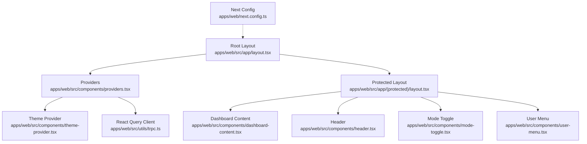
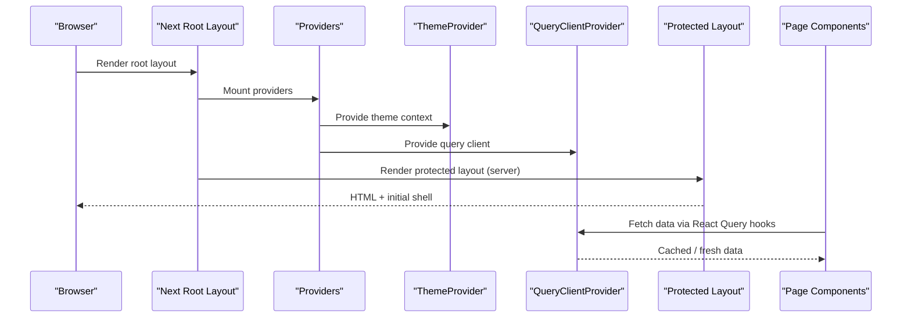
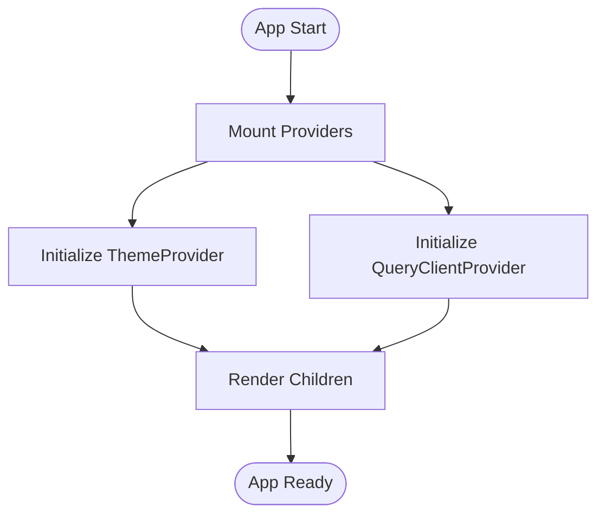
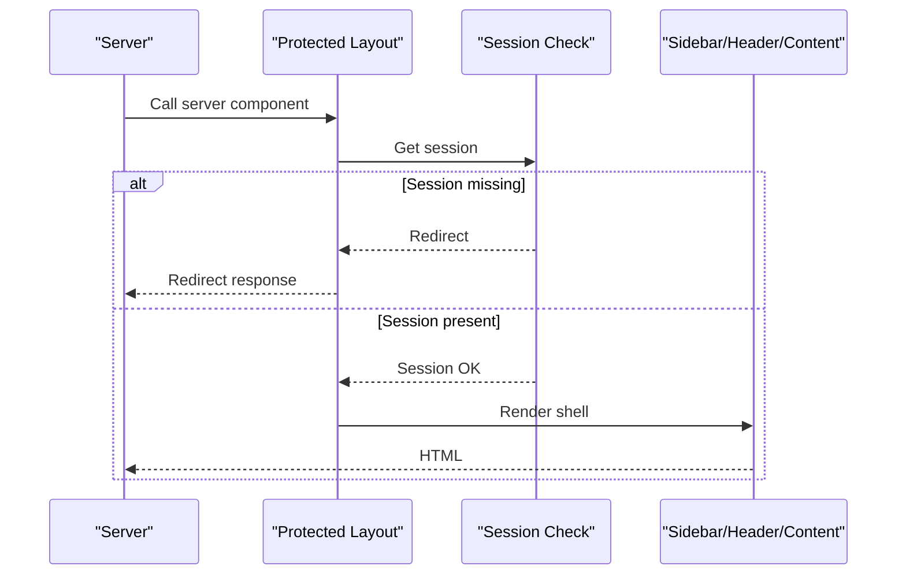
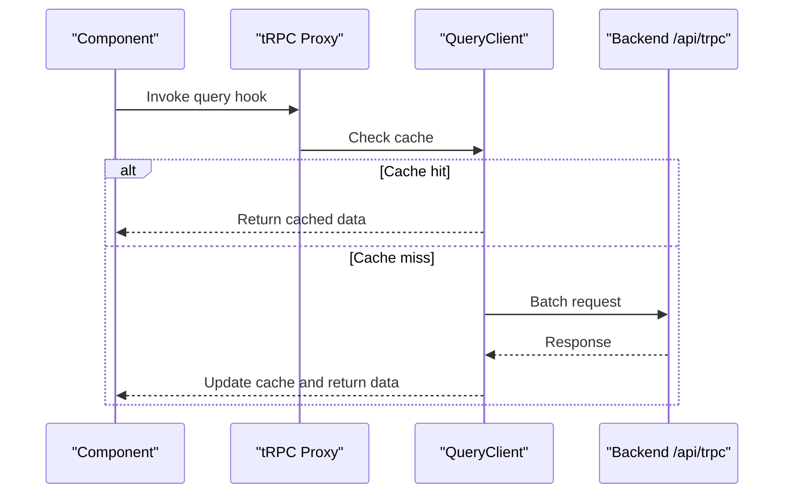
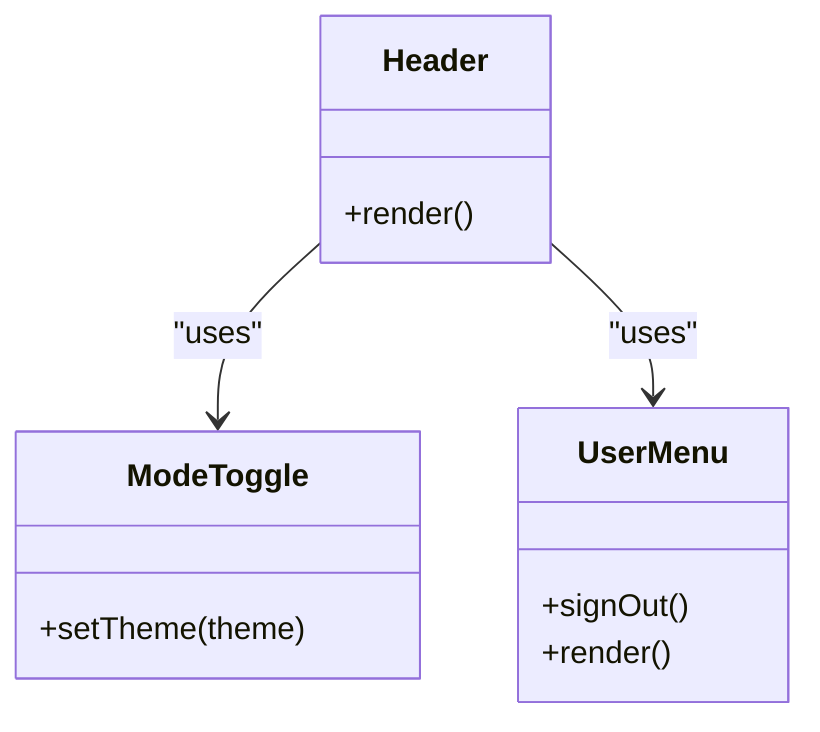
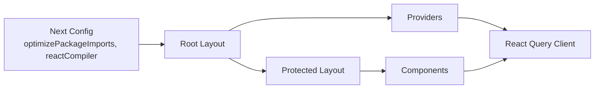

# Component Performance Optimization

<cite>
**Referenced Files in This Document**
- [providers.tsx](file://apps/web/src/components/providers.tsx)
- [theme-provider.tsx](file://apps/web/src/components/theme-provider.tsx)
- [layout.tsx](file://apps/web/src/app/layout.tsx)
- [next.config.ts](file://apps/web/next.config.ts)
- [trpc.ts](file://apps/web/src/utils/trpc.ts)
- [dashboard-content.tsx](file://apps/web/src/components/dashboard-content.tsx)
- [header.tsx](file://apps/web/src/components/header.tsx)
- [protected-layout.tsx](file://apps/web/src/app/(protected)/layout.tsx)
- [mode-toggle.tsx](file://apps/web/src/components/mode-toggle.tsx)
- [user-menu.tsx](file://apps/web/src/components/user-menu.tsx)
- [rerender-memo.md](file://.agents/skills/vercel-react-best-practices/rules/rerender-memo.md)
- [rerender-simple-expression-in-memo.md](file://.agents/skills/vercel-react-best-practices/rules/rerender-simple-expression-in-memo.md)
- [rerender-functional-setstate.md](file://.agents/skills/vercel-react-best-practices/rules/rerender-functional-setstate.md)
- [bundle-dynamic-imports.md](file://.agents/skills/vercel-react-best-practices/rules/bundle-dynamic-imports.md)
- [bundle-defer-third-party.md](file://.agents/skills/vercel-react-best-practices/rules/bundle-defer-third-party.md)
- [bundle-preload.md](file://.agents/skills/vercel-react-best-practices/rules/bundle-preload.md)
- [server-cache-react.md](file://.agents/skills/vercel-react-best-practices/rules/server-cache-react.md)
</cite>

## Table of Contents

1. Introduction
2. Project Structure
3. Core Components
4. Architecture Overview
5. Detailed Component Analysis
6. Dependency Analysis
7. Performance Considerations
8. Troubleshooting Guide
9. Conclusion
10. Appendices

## Introduction

This document explains how the Atlas application is structured to support React component performance optimization, focusing on memoization patterns, lazy loading and code splitting, bundle optimization, efficient client-side data fetching with React Query, and strategies to avoid unnecessary re-renders. It also outlines profiling and monitoring practices suitable for large-scale applications.

## Project Structure

Atlas uses a Next.js App Router layout with a top-level Providers wrapper that injects global services such as theme and data caching. The protected layout composes UI shell components and guards access via server-side session checks. Configuration enables compiler and bundler optimizations.

**Diagram sources**

- [layout.tsx:26-46](file://apps/web/src/app/layout.tsx#L26-L46)
- [providers.tsx:11-25](file://apps/web/src/components/providers.tsx#L11-L25)
- [theme-provider.tsx:6-11](file://apps/web/src/components/theme-provider.tsx#L6-L11)
- [trpc.ts:7-20](file://apps/web/src/utils/trpc.ts#L7-L20)
- [protected-layout.tsx:22-65](<file://apps/web/src/app/(protected)/layout.tsx#L22-L65>)
- [dashboard-content.tsx:5-17](file://apps/web/src/components/dashboard-content.tsx#L5-L17)
- [header.tsx:7-31](file://apps/web/src/components/header.tsx#L7-L31)
- [mode-toggle.tsx:13-36](file://apps/web/src/components/mode-toggle.tsx#L13-L36)
- [user-menu.tsx:17-61](file://apps/web/src/components/user-menu.tsx#L17-L61)
- [next.config.ts:4-19](file://apps/web/next.config.ts#L4-L19)

**Section sources**

- [layout.tsx:26-46](file://apps/web/src/app/layout.tsx#L26-L46)
- [providers.tsx:11-25](file://apps/web/src/components/providers.tsx#L11-L25)
- [next.config.ts:4-19](file://apps/web/next.config.ts#L4-L19)

## Core Components

- Providers: Wraps the app with ThemeProvider and React Query’s QueryClientProvider to enable global theme state and query caching.
- Protected Layout: Server-rendered layout that validates sessions and renders the application shell (sidebar, header, content area).
- Dashboard Content: Conditional wrapper that can hide or adjust content based on assistant panel state.
- Header, Mode Toggle, User Menu: Small interactive components that consume global context and navigation utilities.

These components form the foundation for applying performance techniques like memoization, lazy loading, and efficient data fetching.

**Section sources**

- [providers.tsx:11-25](file://apps/web/src/components/providers.tsx#L11-L25)
- [protected-layout.tsx:22-65](<file://apps/web/src/app/(protected)/layout.tsx#L22-L65>)
- [dashboard-content.tsx:5-17](file://apps/web/src/components/dashboard-content.tsx#L5-L17)
- [header.tsx:7-31](file://apps/web/src/components/header.tsx#L7-L31)
- [mode-toggle.tsx:13-36](file://apps/web/src/components/mode-toggle.tsx#L13-L36)
- [user-menu.tsx:17-61](file://apps/web/src/components/user-menu.tsx#L17-L61)

## Architecture Overview

The runtime architecture centers around a root layout that mounts providers, followed by a protected layout that enforces authentication and composes UI regions. Data fetching is centralized through React Query configured via tRPC, while theme state is provided globally.

**Diagram sources**

- [layout.tsx:26-46](file://apps/web/src/app/layout.tsx#L26-L46)
- [providers.tsx:11-25](file://apps/web/src/components/providers.tsx#L11-L25)
- [protected-layout.tsx:22-65](<file://apps/web/src/app/(protected)/layout.tsx#L22-L65>)
- [trpc.ts:7-20](file://apps/web/src/utils/trpc.ts#L7-L20)

## Detailed Component Analysis

### Providers and Global State

- Purpose: Inject theme and query client into the component tree.
- Performance notes:
  - Keep provider instances stable across renders to avoid unnecessary re-renders.
  - Use minimal configuration in providers to reduce overhead.

**Diagram sources**

- [providers.tsx:11-25](file://apps/web/src/components/providers.tsx#L11-L25)
- [theme-provider.tsx:6-11](file://apps/web/src/components/theme-provider.tsx#L6-L11)

**Section sources**

- [providers.tsx:11-25](file://apps/web/src/components/providers.tsx#L11-L25)
- [theme-provider.tsx:6-11](file://apps/web/src/components/theme-provider.tsx#L6-L11)

### Protected Layout and Rendering Flow

- Purpose: Enforce authentication and compose the application shell.
- Performance notes:
  - Perform server-side session checks to avoid client-side redirects and extra renders.
  - Compose lightweight shell components; defer heavy features.

**Diagram sources**

- [protected-layout.tsx:22-65](<file://apps/web/src/app/(protected)/layout.tsx#L22-L65>)

**Section sources**

- [protected-layout.tsx:22-65](<file://apps/web/src/app/(protected)/layout.tsx#L22-L65>)

### Data Fetching with React Query

- Purpose: Centralized query client and error handling via tRPC integration.
- Performance notes:
  - Leverage automatic deduplication and caching to avoid redundant network requests.
  - Configure error handling to provide retry actions without full page reloads.

**Diagram sources**

- [trpc.ts:7-20](file://apps/web/src/utils/trpc.ts#L7-L20)
- [trpc.ts:22-39](file://apps/web/src/utils/trpc.ts#L22-L39)

**Section sources**

- [trpc.ts:7-20](file://apps/web/src/utils/trpc.ts#L7-L20)
- [trpc.ts:22-39](file://apps/web/src/utils/trpc.ts#L22-L39)

### Interactive Components (Header, Mode Toggle, User Menu)

- Purpose: Navigation, theme switching, and user account actions.
- Performance notes:
  - Keep handlers stable using functional setState where applicable.
  - Avoid inline object creation in frequently rendered paths.

**Diagram sources**

- [header.tsx:7-31](file://apps/web/src/components/header.tsx#L7-L31)
- [mode-toggle.tsx:13-36](file://apps/web/src/components/mode-toggle.tsx#L13-L36)
- [user-menu.tsx:17-61](file://apps/web/src/components/user-menu.tsx#L17-L61)

**Section sources**

- [header.tsx:7-31](file://apps/web/src/components/header.tsx#L7-L31)
- [mode-toggle.tsx:13-36](file://apps/web/src/components/mode-toggle.tsx#L13-L36)
- [user-menu.tsx:17-61](file://apps/web/src/components/user-menu.tsx#L17-L61)

## Dependency Analysis

Atlas’s performance depends on the interaction between Next.js configuration, provider setup, and component composition. Key dependencies include:

- Next.js compiler and bundler settings that influence rendering and bundle size.
- React Query client configuration for caching and request deduplication.
- UI composition in layouts and pages that determines render boundaries.

**Diagram sources**

- [next.config.ts:4-19](file://apps/web/next.config.ts#L4-L19)
- [layout.tsx:26-46](file://apps/web/src/app/layout.tsx#L26-L46)
- [providers.tsx:11-25](file://apps/web/src/components/providers.tsx#L11-L25)
- [protected-layout.tsx:22-65](<file://apps/web/src/app/(protected)/layout.tsx#L22-L65>)

**Section sources**

- [next.config.ts:4-19](file://apps/web/next.config.ts#L4-L19)
- [layout.tsx:26-46](file://apps/web/src/app/layout.tsx#L26-L46)
- [providers.tsx:11-25](file://apps/web/src/components/providers.tsx#L11-L25)
- [protected-layout.tsx:22-65](<file://apps/web/src/app/(protected)/layout.tsx#L22-L65>)

## Performance Considerations

### Memoization Techniques

- Use memoized components to enable early returns and skip expensive computations when props are unchanged.
- Prefer extracting expensive logic into memoized subcomponents rather than wrapping simple expressions in useMemo.
- For state updates derived from previous state, use functional setState to create stable callbacks and avoid stale closures.

References:

- Extract to memoized components to enable early returns before computation.
- Do not wrap simple expressions with primitive results in useMemo.
- Use functional setState updates to prevent stale closures and unnecessary callback recreations.

**Section sources**

- [rerender-memo.md:1-45](file://.agents/skills/vercel-react-best-practices/rules/rerender-memo.md#L1-L45)
- [rerender-simple-expression-in-memo.md:1-35](file://.agents/skills/vercel-react-best-practices/rules/rerender-simple-expression-in-memo.md#L1-L35)
- [rerender-functional-setstate.md:1-55](file://.agents/skills/vercel-react-best-practices/rules/rerender-functional-setstate.md#L1-L55)

### Lazy Loading and Code Splitting

- Defer non-critical third-party libraries after hydration to avoid blocking initial interactions.
- Use dynamic imports for heavy components not needed on initial render to improve Time to Interactive and Largest Contentful Paint.
- Preload bundles based on user intent (e.g., hover/focus) to reduce perceived latency.

References:

- Defer non-critical third-party libraries after hydration.
- Dynamic imports for heavy components to split bundles.
- Preload based on user intent to minimize perceived delays.

**Section sources**

- [bundle-defer-third-party.md:1-52](file://.agents/skills/vercel-react-best-practices/rules/bundle-defer-third-party.md#L1-L52)
- [bundle-dynamic-imports.md:1-38](file://.agents/skills/vercel-react-best-practices/rules/bundle-dynamic-imports.md#L1-L38)
- [bundle-preload.md:1-47](file://.agents/skills/vercel-react-best-practices/rules/bundle-preload.md#L1-L47)

### Bundle Optimization Techniques

- Enable package import optimizations and compiler features to reduce bundle size and improve build/runtime performance.
- Prefer statically analyzable paths to help bundlers trace narrow sets of modules and avoid accidental broad bundles.

References:

- Next.js config enabling compiler and package import optimizations.
- Guidance to prefer explicit maps or literal paths for dynamic imports.

**Section sources**

- [next.config.ts:4-19](file://apps/web/next.config.ts#L4-L19)
- [AGENTS.md:593-631](file://.agents/skills/vercel-react-best-practices/AGENTS.md#L593-L631)

### Efficient State Management with React Query

- Centralize query client configuration to leverage caching and automatic request deduplication.
- Configure error handling to provide actionable feedback (e.g., retry) without full page reloads.

References:

- Query client setup with error handling and toast notifications.

**Section sources**

- [trpc.ts:7-20](file://apps/web/src/utils/trpc.ts#L7-L20)
- [trpc.ts:22-39](file://apps/web/src/utils/trpc.ts#L22-L39)

### Avoiding Unnecessary Re-renders

- Keep provider configurations minimal and stable.
- Use conditional rendering to avoid mounting heavy components when not needed.
- Apply memoization selectively to components with expensive computations or deep trees.

References:

- Conditional rendering in dashboard content to hide sections based on assistant panel state.

**Section sources**

- [dashboard-content.tsx:5-17](file://apps/web/src/components/dashboard-content.tsx#L5-L17)

### Profiling Tools and Monitoring

- Use React DevTools Profiler to identify expensive re-renders and measure commit times.
- Monitor bundle sizes with tools like webpack-bundle-analyzer or Next.js built-in analysis to detect oversized dependencies.
- Track runtime metrics (FCP, LCP, TTI) via browser devtools and performance APIs to validate improvements.

[No sources needed since this section provides general guidance]

## Troubleshooting Guide

- Excessive re-renders:
  - Inspect component trees with React DevTools Profiler.
  - Apply memoization to expensive subcomponents and avoid wrapping simple expressions in useMemo.
- Large initial bundle:
  - Identify heavy dependencies and defer them after hydration.
  - Use dynamic imports for rarely used features and preload based on user intent.
- Stale closures and unstable callbacks:
  - Use functional setState updates to eliminate unnecessary dependencies and stabilize callbacks.
- Query errors and retries:
  - Ensure error handling in the query client provides actionable feedback and supports retry actions.

**Section sources**

- [rerender-memo.md:1-45](file://.agents/skills/vercel-react-best-practices/rules/rerender-memo.md#L1-L45)
- [bundle-defer-third-party.md:1-52](file://.agents/skills/vercel-react-best-practices/rules/bundle-defer-third-party.md#L1-L52)
- [bundle-dynamic-imports.md:1-38](file://.agents/skills/vercel-react-best-practices/rules/bundle-dynamic-imports.md#L1-L38)
- [bundle-preload.md:1-47](file://.agents/skills/vercel-react-best-practices/rules/bundle-preload.md#L1-L47)
- [rerender-functional-setstate.md:1-55](file://.agents/skills/vercel-react-best-practices/rules/rerender-functional-setstate.md#L1-L55)
- [trpc.ts:7-20](file://apps/web/src/utils/trpc.ts#L7-L20)

## Conclusion

Atlas’s architecture supports scalable performance through strategic provider setup, server-side authentication, and centralized data fetching with React Query. By applying memoization, lazy loading, code splitting, and bundle optimizations—alongside consistent profiling and monitoring—the application can maintain responsiveness and efficiency at scale.

[No sources needed since this section summarizes without analyzing specific files]

## Appendices

### Best Practices Checklist

- Wrap expensive computations in memoized components; avoid overuse of useMemo for simple expressions.
- Defer non-critical libraries and heavy components until needed; preload based on user intent.
- Configure React Query for caching, deduplication, and robust error handling.
- Enable Next.js compiler and package import optimizations; prefer static import paths.
- Profile regularly with React DevTools and monitor core web vitals.

[No sources needed since this section provides general guidance]
