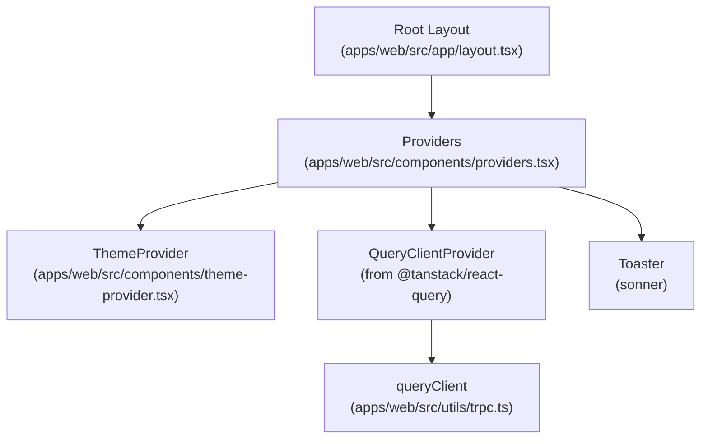
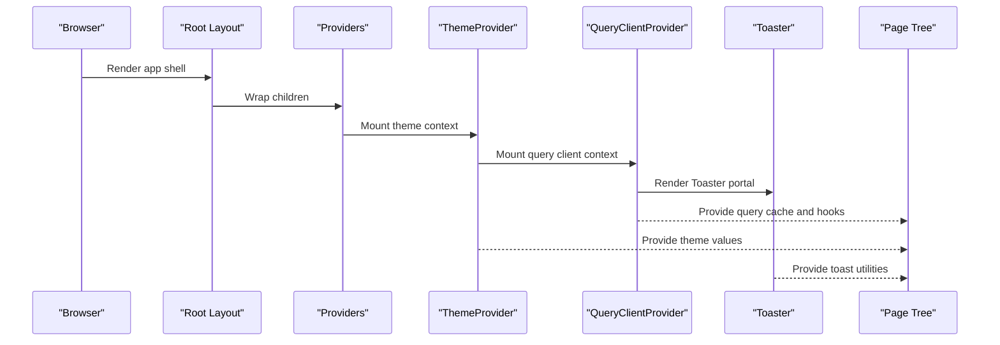
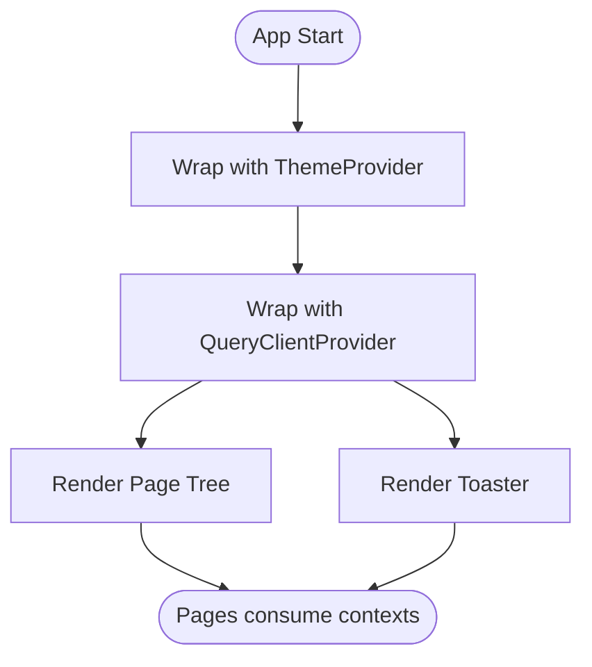
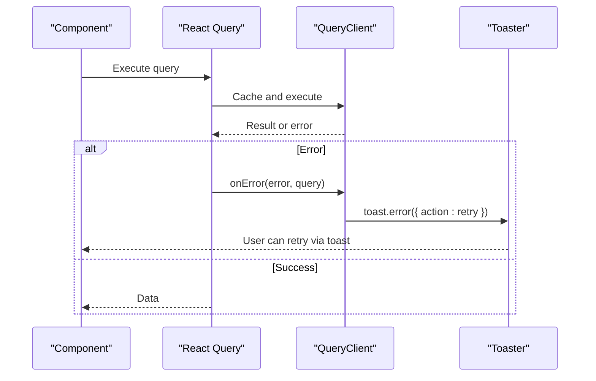
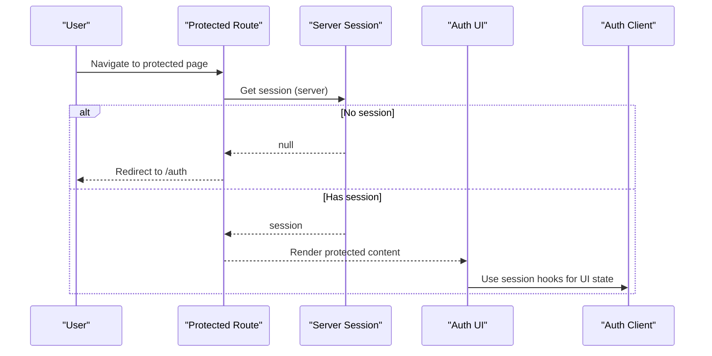
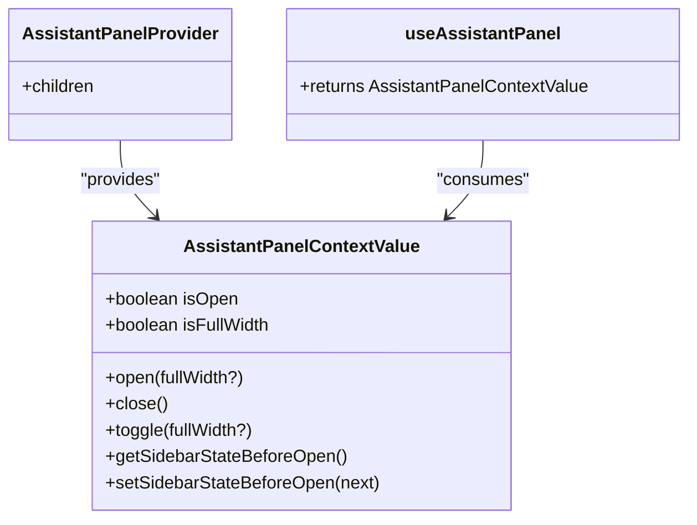
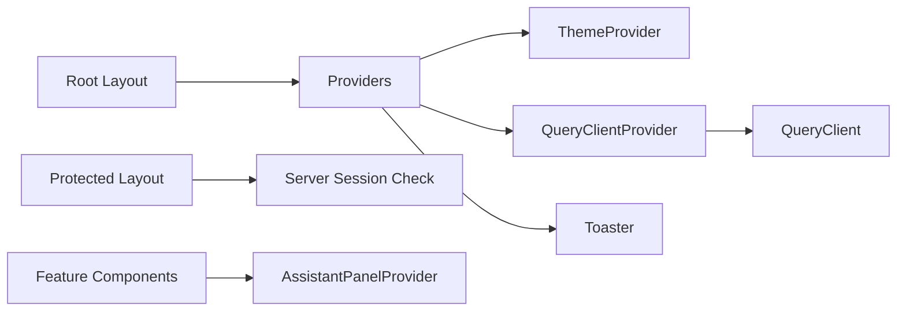

# Provider Pattern and Context Management

<cite>
**Referenced Files in This Document**
- [providers.tsx](file://apps/web/src/components/providers.tsx)
- [theme-provider.tsx](file://apps/web/src/components/theme-provider.tsx)
- [layout.tsx](file://apps/web/src/app/layout.tsx)
- [trpc.ts](file://apps/web/src/utils/trpc.ts)
- [auth-client.ts](file://apps/web/src/lib/auth-client.ts)
- [auth.tsx](file://apps/web/src/components/auth.tsx)
- [protected layout.tsx](file://apps/web/src/app/(protected)/layout.tsx)
- [use-assistant-panel.tsx](file://apps/web/src/hooks/use-assistant-panel.tsx)
</cite>

## Table of Contents

1. Introduction
2. Project Structure
3. Core Components
4. Architecture Overview
5. Detailed Component Analysis
6. Dependency Analysis
7. Performance Considerations
8. Troubleshooting Guide
9. Conclusion

## Introduction

This document explains how the Atlas web application composes providers to deliver cross-cutting concerns such as theming, data fetching state, notifications, and feature-specific UI state. It focuses on:

- How Providers orchestrates ThemeProvider and QueryClientProvider at the app root
- Where authentication is handled (client-side hooks via a dedicated auth client)
- How a custom AssistantPanelProvider demonstrates context organization for feature state
- Best practices for provider composition, avoiding prop drilling, and optimizing re-renders

## Project Structure

At the root of the Next.js app, the root layout wraps all pages with a single Providers component. Providers composes:

- ThemeProvider from next-themes for theme management
- QueryClientProvider from React Query for global query state
- A Toaster for user-facing notifications

**Diagram sources**

- [layout.tsx:26-46](file://apps/web/src/app/layout.tsx#L26-L46)
- [providers.tsx:11-26](file://apps/web/src/components/providers.tsx#L11-L26)
- [theme-provider.tsx:6-11](file://apps/web/src/components/theme-provider.tsx#L6-L11)
- [trpc.ts:7-20](file://apps/web/src/utils/trpc.ts#L7-L20)

**Section sources**

- [layout.tsx:26-46](file://apps/web/src/app/layout.tsx#L26-L46)
- [providers.tsx:11-26](file://apps/web/src/components/providers.tsx#L11-L26)

## Core Components

- Providers: The central composition point that mounts theme, data-fetching, and notification contexts around the entire app tree.
- ThemeProvider: A thin wrapper around next-themes to standardize theme configuration across the app.
- QueryClientProvider: Wraps the app with a shared React Query client configured with error handling and toast integration.
- Authentication: Handled via a client-side auth client; protected routes enforce server-side session checks before rendering.
- AssistantPanelProvider: A feature-scoped context that manages open/close/full-width state and persists it to localStorage.

Key responsibilities:

- Provide global services (theme, queries, toasts) once at the root
- Keep feature-specific state close to its domain (e.g., assistant panel)
- Enforce authentication boundaries at route level while using client hooks for UI interactions

**Section sources**

- [providers.tsx:11-26](file://apps/web/src/components/providers.tsx#L11-L26)
- [theme-provider.tsx:6-11](file://apps/web/src/components/theme-provider.tsx#L6-L11)
- [trpc.ts:7-20](file://apps/web/src/utils/trpc.ts#L7-L20)
- [auth-client.ts:5-7](file://apps/web/src/lib/auth-client.ts#L5-L7)
- [auth.tsx:22-68](file://apps/web/src/components/auth.tsx#L22-L68)
- [protected layout.tsx:22-65](<file://apps/web/src/app/(protected)/layout.tsx#L22-L65>)
- [use-assistant-panel.tsx:20-161](file://apps/web/src/hooks/use-assistant-panel.tsx#L20-L161)

## Architecture Overview

The app uses a layered provider strategy:

- App-level providers (root): theme, queries, toasts
- Feature-level providers (scoped): assistant panel, sidebar, etc.
- Route-level guards: server-side session checks redirect unauthenticated users

**Diagram sources**

- [layout.tsx:26-46](file://apps/web/src/app/layout.tsx#L26-L46)
- [providers.tsx:11-26](file://apps/web/src/components/providers.tsx#L11-L26)

## Detailed Component Analysis

### Providers Composition

Providers composes multiple contexts in a stable order:

- ThemeProvider wraps everything so theme changes propagate globally
- QueryClientProvider provides React Query state and integrates with toast errors
- Toaster is rendered outside the query provider but inside theme provider to inherit theme styling

**Diagram sources**

- [providers.tsx:11-26](file://apps/web/src/components/providers.tsx#L11-L26)

**Section sources**

- [providers.tsx:11-26](file://apps/web/src/components/providers.tsx#L11-L26)

### ThemeProvider Wrapper

A minimal wrapper around next-themes standardizes theme behavior across the app. Configuration is centralized here, making it easy to adjust defaults or add plugins later.

**Section sources**

- [theme-provider.tsx:6-11](file://apps/web/src/components/theme-provider.tsx#L6-L11)

### Query Client and Error Handling

The shared QueryClient is created once and passed into QueryClientProvider. It includes a QueryCache onError handler that shows a toast with a retry action, improving UX when queries fail.

**Diagram sources**

- [trpc.ts:7-20](file://apps/web/src/utils/trpc.ts#L7-L20)

**Section sources**

- [trpc.ts:7-20](file://apps/web/src/utils/trpc.ts#L7-L20)

### Authentication Context Strategy

Authentication is not provided via a top-level context. Instead:

- Protected routes perform server-side session checks and redirect if needed
- UI components use a client-side auth client hook to read session state and trigger sign-in flows

**Diagram sources**

- [protected layout.tsx:22-33](<file://apps/web/src/app/(protected)/layout.tsx#L22-L33>)
- [auth.tsx:22-68](file://apps/web/src/components/auth.tsx#L22-L68)
- [auth-client.ts:5-7](file://apps/web/src/lib/auth-client.ts#L5-L7)

**Section sources**

- [protected layout.tsx:22-33](<file://apps/web/src/app/(protected)/layout.tsx#L22-L33>)
- [auth.tsx:22-68](file://apps/web/src/components/auth.tsx#L22-L68)
- [auth-client.ts:5-7](file://apps/web/src/lib/auth-client.ts#L5-L7)

### Custom Provider: AssistantPanelProvider

AssistantPanelProvider demonstrates a focused, feature-scoped context:

- State: isOpen, isFullWidth, sidebar snapshot
- Actions: open, close, toggle, getters/setters for sidebar state
- Persistence: Reads/writes to localStorage to survive navigation
- Optimization: Memoized value object and stable callbacks to minimize re-renders

**Diagram sources**

- [use-assistant-panel.tsx:20-161](file://apps/web/src/hooks/use-assistant-panel.tsx#L20-L161)

**Section sources**

- [use-assistant-panel.tsx:20-161](file://apps/web/src/hooks/use-assistant-panel.tsx#L20-L161)

## Dependency Analysis

Providers establishes the dependency graph for global services:

- Root layout depends on Providers
- Providers depends on ThemeProvider, QueryClientProvider, and Toaster
- QueryClientProvider depends on a shared QueryClient instance
- Protected layouts depend on server-side session checks
- Feature components depend on their scoped providers (e.g., AssistantPanelProvider)

**Diagram sources**

- [layout.tsx:26-46](file://apps/web/src/app/layout.tsx#L26-L46)
- [providers.tsx:11-26](file://apps/web/src/components/providers.tsx#L11-L26)
- [trpc.ts:7-20](file://apps/web/src/utils/trpc.ts#L7-L20)
- [protected layout.tsx:22-33](<file://apps/web/src/app/(protected)/layout.tsx#L22-L33>)
- [use-assistant-panel.tsx:67-151](file://apps/web/src/hooks/use-assistant-panel.tsx#L67-L151)

**Section sources**

- [layout.tsx:26-46](file://apps/web/src/app/layout.tsx#L26-L46)
- [providers.tsx:11-26](file://apps/web/src/components/providers.tsx#L11-L26)
- [trpc.ts:7-20](file://apps/web/src/utils/trpc.ts#L7-L20)
- [protected layout.tsx:22-33](<file://apps/web/src/app/(protected)/layout.tsx#L22-L33>)
- [use-assistant-panel.tsx:67-151](file://apps/web/src/hooks/use-assistant-panel.tsx#L67-L151)

## Performance Considerations

- Stable context values: AssistantPanelProvider memoizes its context value and uses stable callbacks to avoid unnecessary descendant re-renders.
- Scoped providers: Keep feature state in narrow providers (e.g., AssistantPanelProvider) to limit re-render scope.
- Avoid heavy work in high-up providers: Theme and Query clients are lightweight; keep business logic out of Providers.
- Minimize provider churn: Configure providers once at the root; avoid recreating clients or configs on each render.
- Optimize consumers: Prefer reading only what you need from contexts; split contexts by concern to reduce update cascades.
- Persisted state: AssistantPanelProvider persists UI state to localStorage to avoid redundant UI resets on navigation.

[No sources needed since this section provides general guidance]

## Troubleshooting Guide

- Missing provider usage: If a hook throws an error indicating it must be used within a provider, ensure the corresponding provider wraps the consuming component tree. For example, AssistantPanelProvider must wrap any component using useAssistantPanel.
- Query errors: When queries fail, the integrated toast displays an error with a retry action. Use the toast’s retry to re-run the query without navigating away.
- Authentication redirects: If protected routes redirect unexpectedly, verify server-side session retrieval and headers. Ensure cookies or credentials are included for API calls.

**Section sources**

- [use-assistant-panel.tsx:153-161](file://apps/web/src/hooks/use-assistant-panel.tsx#L153-L161)
- [trpc.ts:7-20](file://apps/web/src/utils/trpc.ts#L7-L20)
- [protected layout.tsx:22-33](<file://apps/web/src/app/(protected)/layout.tsx#L22-L33>)

## Conclusion

Atlas composes providers to cleanly separate concerns:

- Root-level providers deliver global services (theme, queries, toasts)
- Feature-level providers encapsulate domain state (assistant panel)
- Route-level guards enforce security and access control

This approach avoids prop drilling, keeps contexts small and focused, and optimizes performance through memoization and persistence. As the app grows, continue to:

- Add new providers near their domain
- Split large contexts into smaller ones
- Keep provider configurations stable and centralized
- Measure and optimize consumer re-renders where needed

[No sources needed since this section summarizes without analyzing specific files]
