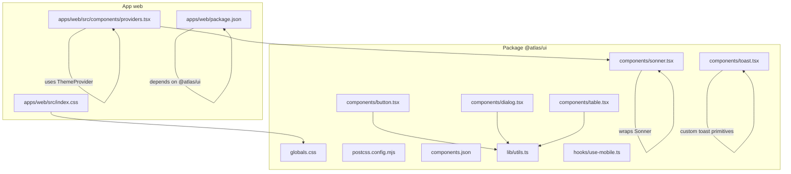
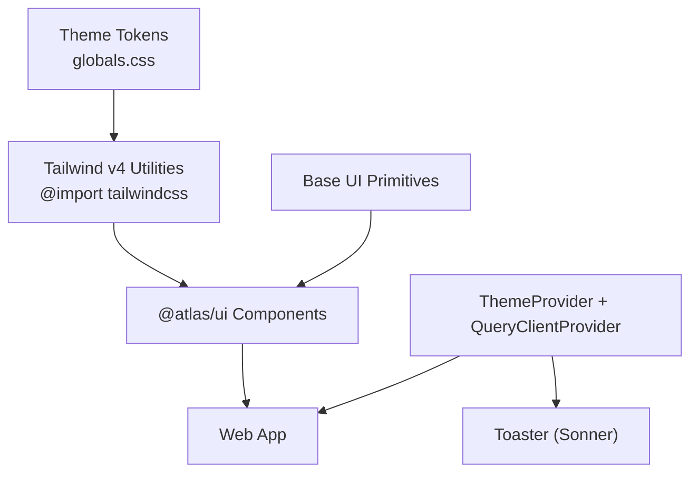
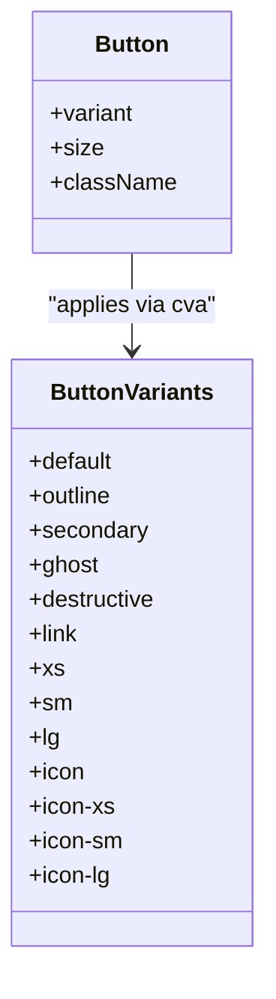
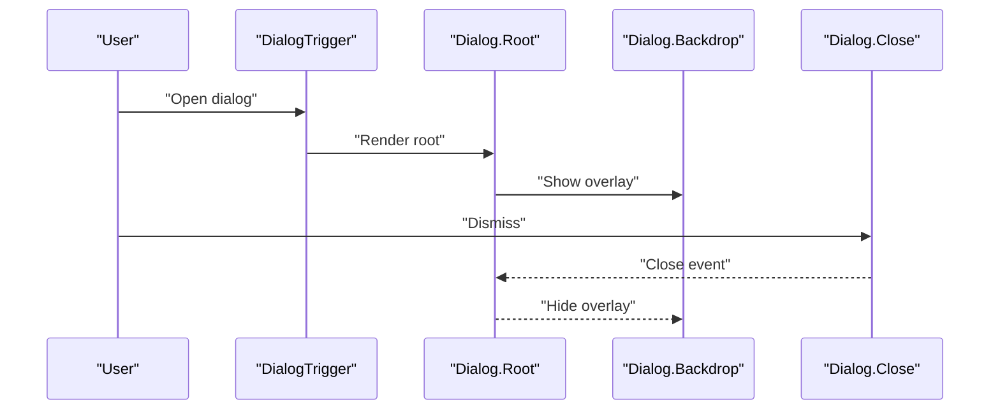
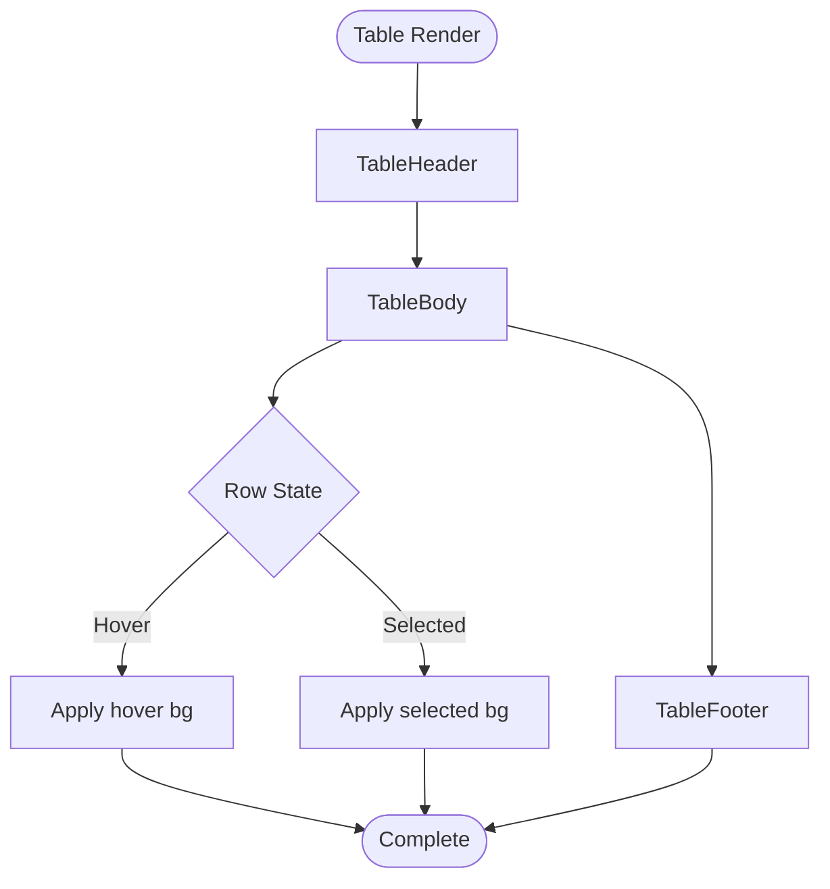
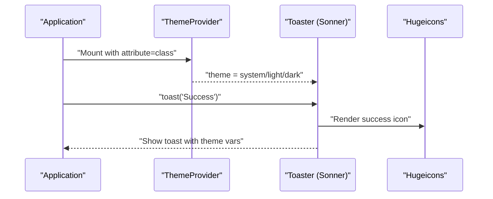
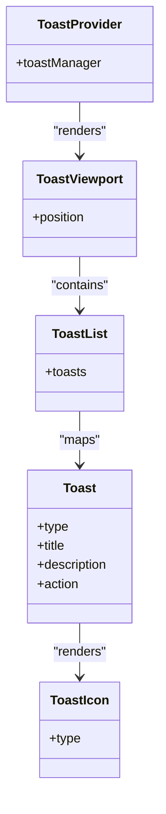
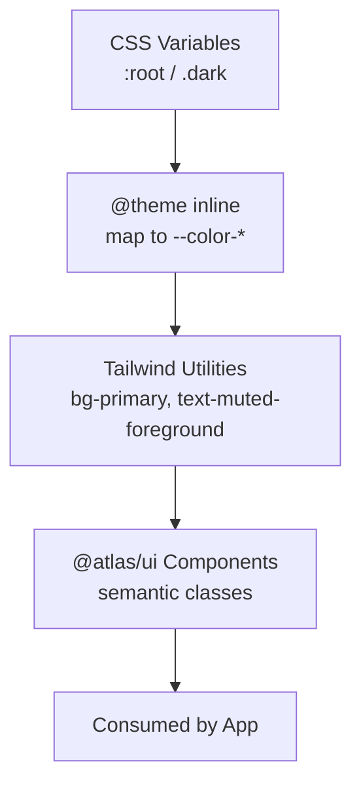
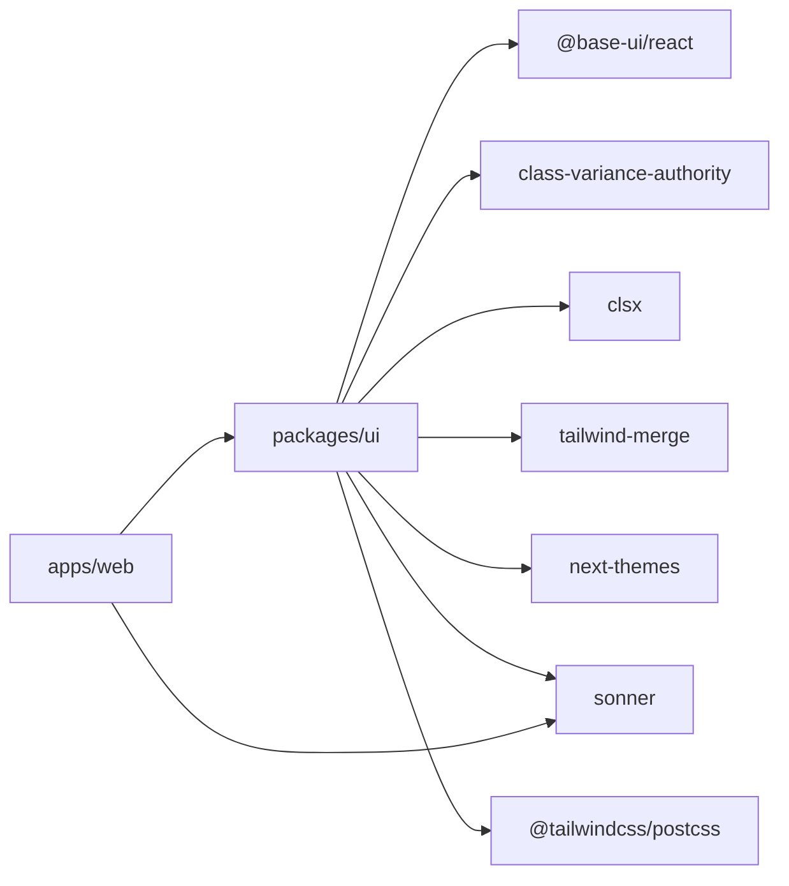

# Shared UI Components and Design System

<cite>
**Referenced Files in This Document**
- [package.json](file://packages/ui/package.json)
- [globals.css](file://packages/ui/src/styles/globals.css)
- [postcss.config.mjs](file://packages/ui/postcss.config.mjs)
- [components.json](file://packages/ui/components.json)
- [utils.ts](file://packages/ui/src/lib/utils.ts)
- [button.tsx](file://packages/ui/src/components/button.tsx)
- [dialog.tsx](file://packages/ui/src/components/dialog.tsx)
- [table.tsx](file://packages/ui/src/components/table.tsx)
- [sonner.tsx](file://packages/ui/src/components/sonner.tsx)
- [toast.tsx](file://packages/ui/src/components/toast.tsx)
- [use-mobile.ts](file://packages/ui/src/hooks/use-mobile.ts)
- [index.css](file://apps/web/src/index.css)
- [providers.tsx](file://apps/web/src/components/providers.tsx)
- [package.json](file://apps/web/package.json)
</cite>

## Table of Contents

1. Introduction
2. Project Structure
3. Core Components
4. Architecture Overview
5. Detailed Component Analysis
6. Dependency Analysis
7. Performance Considerations
8. Troubleshooting Guide
9. Conclusion
10. Appendices

## Introduction

This document explains the shared UI component library and design system integration used across the application. It focuses on how components from the @atlas/ui package are consumed, how Sonner is integrated for notifications, and how theming and styling are implemented with Tailwind CSS v4. It also covers customization patterns, accessibility, responsive design, and performance considerations to maintain consistency and quality across the app.

## Project Structure

The design system lives in a dedicated package that exports:

- Global styles and theme tokens
- Reusable UI components
- Utilities and hooks
- PostCSS configuration for Tailwind CSS v4

The web application imports the global styles and uses the providers to enable theming and notifications.

**Diagram sources**

- [globals.css:1-140](file://packages/ui/src/styles/globals.css#L1-L140)
- [postcss.config.mjs:1-6](file://packages/ui/postcss.config.mjs#L1-L6)
- [components.json:1-26](file://packages/ui/components.json#L1-L26)
- [utils.ts:1-6](file://packages/ui/src/lib/utils.ts#L1-L6)
- [use-mobile.ts:1-20](file://packages/ui/src/hooks/use-mobile.ts#L1-L20)
- [button.tsx:1-58](file://packages/ui/src/components/button.tsx#L1-L58)
- [dialog.tsx:1-38](file://packages/ui/src/components/dialog.tsx#L1-L38)
- [table.tsx:1-58](file://packages/ui/src/components/table.tsx#L1-L58)
- [sonner.tsx:1-77](file://packages/ui/src/components/sonner.tsx#L1-L77)
- [toast.tsx:178-253](file://packages/ui/src/components/toast.tsx#L178-L253)
- [index.css:1-1](file://apps/web/src/index.css#L1-L1)
- [providers.tsx:1-27](file://apps/web/src/components/providers.tsx#L1-L27)
- [package.json:1-47](file://apps/web/package.json#L1-L47)

**Section sources**

- [package.json:1-47](file://packages/ui/package.json#L1-L47)
- [globals.css:1-140](file://packages/ui/src/styles/globals.css#L1-L140)
- [postcss.config.mjs:1-6](file://packages/ui/postcss.config.mjs#L1-L6)
- [components.json:1-26](file://packages/ui/components.json#L1-L26)
- [index.css:1-1](file://apps/web/src/index.css#L1-L1)
- [providers.tsx:1-27](file://apps/web/src/components/providers.tsx#L1-L27)
- [package.json:1-47](file://apps/web/package.json#L1-L47)

## Core Components

- Button: A variant-driven primitive built on Base UI, styled with class-variance-authority and semantic tokens via Tailwind utilities. Supports multiple sizes and variants while maintaining consistent focus, disabled, and icon behaviors.
- Dialog: A composition of Base UI dialog primitives with data-slot markers and accessible overlay behavior.
- Table: Semantic table structure with header, body, footer, and row states, using data-slot attributes for stable styling hooks.
- Notifications (Sonner): A themed Toaster wrapper that integrates with next-themes and applies custom icons and CSS variables for consistent appearance.
- Toast primitives: A full toast system built on Base UI with provider, viewport, list, and actions, including an icon renderer and manager utilities.

Key styling utility:

- cn(): Merges classes deterministically using clsx and tailwind-merge to avoid conflicts and ensure predictable output.

Responsive hook:

- useIsMobile(): Provides a boolean indicating mobile breakpoints based on matchMedia, enabling responsive logic in components or pages.

**Section sources**

- [button.tsx:1-58](file://packages/ui/src/components/button.tsx#L1-L58)
- [dialog.tsx:1-38](file://packages/ui/src/components/dialog.tsx#L1-L38)
- [table.tsx:1-58](file://packages/ui/src/components/table.tsx#L1-L58)
- [sonner.tsx:1-77](file://packages/ui/src/components/sonner.tsx#L1-L77)
- [toast.tsx:178-253](file://packages/ui/src/components/toast.tsx#L178-L253)
- [utils.ts:1-6](file://packages/ui/src/lib/utils.ts#L1-L6)
- [use-mobile.ts:1-20](file://packages/ui/src/hooks/use-mobile.ts#L1-L20)

## Architecture Overview

The design system follows a layered architecture:

- Theme layer: CSS variables define light/dark palettes and tokens; Tailwind v4 maps these to semantic utilities.
- Primitive layer: Base UI provides unstyled, accessible primitives.
- Component layer: @atlas/ui wraps primitives with consistent styling, data-slot attributes, and composition patterns.
- Application layer: The web app consumes components and providers to render UI with consistent themes and notifications.

**Diagram sources**

- [globals.css:1-140](file://packages/ui/src/styles/globals.css#L1-L140)
- [button.tsx:1-58](file://packages/ui/src/components/button.tsx#L1-L58)
- [dialog.tsx:1-38](file://packages/ui/src/components/dialog.tsx#L1-L38)
- [sonner.tsx:1-77](file://packages/ui/src/components/sonner.tsx#L1-L77)
- [providers.tsx:1-27](file://apps/web/src/components/providers.tsx#L1-L27)

## Detailed Component Analysis

### Button

- Uses Base UI Button as the foundation.
- Variants and sizes are defined with class-variance-authority for clear, type-safe options.
- Styling leverages semantic tokens (primary, secondary, destructive, etc.) and Tailwind utilities for focus rings, hover states, and icon sizing.
- Exposes a reusable variant function for advanced customization.

**Diagram sources**

- [button.tsx:1-58](file://packages/ui/src/components/button.tsx#L1-L58)

**Section sources**

- [button.tsx:1-58](file://packages/ui/src/components/button.tsx#L1-L58)

### Dialog

- Composed from Base UI dialog primitives with data-slot attributes for stable styling.
- Overlay uses backdrop with fade transitions and z-index management.
- Accessible trigger and close semantics are preserved through primitives.

**Diagram sources**

- [dialog.tsx:1-38](file://packages/ui/src/components/dialog.tsx#L1-L38)

**Section sources**

- [dialog.tsx:1-38](file://packages/ui/src/components/dialog.tsx#L1-L38)

### Table

- Semantic structure with header, body, footer, and rows.
- Rows support hover and selection states; footer has distinct background styling.
- Data-slot attributes provide stable hooks for tests and styling.

**Diagram sources**

- [table.tsx:1-58](file://packages/ui/src/components/table.tsx#L1-L58)

**Section sources**

- [table.tsx:1-58](file://packages/ui/src/components/table.tsx#L1-L58)

### Notifications (Sonner Toaster)

- Wraps Sonner’s Toaster with next-themes integration for automatic theme switching.
- Custom icons per toast type using Hugeicons.
- Applies CSS variables for border radius and colors to align with the design system.

**Diagram sources**

- [sonner.tsx:1-77](file://packages/ui/src/components/sonner.tsx#L1-L77)
- [providers.tsx:1-27](file://apps/web/src/components/providers.tsx#L1-L27)

**Section sources**

- [sonner.tsx:1-77](file://packages/ui/src/components/sonner.tsx#L1-L77)
- [providers.tsx:1-27](file://apps/web/src/components/providers.tsx#L1-L27)

### Toast Primitives

- Full toast system built on Base UI with provider, portal, viewport, and list.
- Icon renderer adapts to toast type (loading spinner, success, warning, error).
- Manager utilities allow creating custom managers and accessing toast state.

**Diagram sources**

- [toast.tsx:178-253](file://packages/ui/src/components/toast.tsx#L178-L253)

**Section sources**

- [toast.tsx:178-253](file://packages/ui/src/components/toast.tsx#L178-L253)

### Theming and Styling Conventions

- Theme tokens are defined as CSS variables in light and dark modes.
- Tailwind v4 maps these variables to semantic color utilities via inline theme registration.
- Components use semantic tokens and utilities rather than hardcoded colors.
- Class merging utility ensures deterministic class resolution.

**Diagram sources**

- [globals.css:1-140](file://packages/ui/src/styles/globals.css#L1-L140)
- [utils.ts:1-6](file://packages/ui/src/lib/utils.ts#L1-L6)

**Section sources**

- [globals.css:1-140](file://packages/ui/src/styles/globals.css#L1-L140)
- [utils.ts:1-6](file://packages/ui/src/lib/utils.ts#L1-L6)

### Accessibility Patterns

- Use Base UI primitives to preserve keyboard navigation and ARIA semantics.
- Ensure dialogs include titles and descriptions for screen readers.
- Toast icons should be decorative where appropriate; rely on aria attributes provided by primitives.
- Focus management is handled by primitives; avoid overriding focus styles without care.

**Section sources**

- [dialog.tsx:1-38](file://packages/ui/src/components/dialog.tsx#L1-L38)
- [toast.tsx:178-253](file://packages/ui/src/components/toast.tsx#L178-L253)

### Responsive Design Patterns

- useIsMobile hook enables conditional rendering or layout changes at a defined breakpoint.
- Components can leverage Tailwind responsive utilities alongside the hook for fine-grained control.
- Avoid hardcoding widths; prefer fluid layouts and spacing utilities.

**Section sources**

- [use-mobile.ts:1-20](file://packages/ui/src/hooks/use-mobile.ts#L1-L20)

## Dependency Analysis

- @atlas/ui depends on Base UI primitives, class-variance-authority, clsx, tailwind-merge, next-themes, and Sonner.
- The web app depends on @atlas/ui and includes Sonner directly for additional usage if needed.
- PostCSS configuration uses @tailwindcss/postcss for Tailwind v4 processing.
- Global styles import Tailwind, animations, and ShadCN base styles, then register theme tokens.

**Diagram sources**

- [package.json:1-47](file://packages/ui/package.json#L1-L47)
- [package.json:1-47](file://apps/web/package.json#L1-L47)
- [postcss.config.mjs:1-6](file://packages/ui/postcss.config.mjs#L1-L6)

**Section sources**

- [package.json:1-47](file://packages/ui/package.json#L1-L47)
- [package.json:1-47](file://apps/web/package.json#L1-L47)
- [postcss.config.mjs:1-6](file://packages/ui/postcss.config.mjs#L1-L6)

## Performance Considerations

- Prefer Base UI primitives for lightweight, accessible interactions.
- Use class-variance-authority to compute minimal class sets per variant/size.
- Leverage tailwind-merge to avoid redundant class generation and ensure optimal output.
- Keep global styles scoped and avoid heavy runtime computations in components.
- Use the mobile hook judiciously; avoid re-renders by memoizing derived values when necessary.
- For charts and complex lists, consider virtualization or pagination strategies outside the shared library.

[No sources needed since this section provides general guidance]

## Troubleshooting Guide

- Theme not applying:
  - Ensure the app mounts ThemeProvider with attribute="class" and defaultTheme set appropriately.
  - Verify globals.css is imported at the app entry point.
- Toast icons missing or incorrect:
  - Confirm the Toaster wrapper is mounted and icons are mapped correctly.
  - Check that next-themes theme resolves to a supported value.
- Conflicting classes:
  - Use the cn utility to merge classes deterministically.
  - Avoid manual overrides that conflict with semantic tokens.
- Dialog accessibility issues:
  - Ensure title and description are present within the dialog content.
  - Do not remove focus traps or override ARIA roles without justification.

**Section sources**

- [providers.tsx:1-27](file://apps/web/src/components/providers.tsx#L1-L27)
- [index.css:1-1](file://apps/web/src/index.css#L1-L1)
- [sonner.tsx:1-77](file://packages/ui/src/components/sonner.tsx#L1-L77)
- [utils.ts:1-6](file://packages/ui/src/lib/utils.ts#L1-L6)
- [dialog.tsx:1-38](file://packages/ui/src/components/dialog.tsx#L1-L38)

## Conclusion

The shared UI component library provides a robust, accessible, and themeable foundation built on Base UI primitives and styled with Tailwind CSS v4. By centralizing theme tokens, enforcing semantic styling, and offering composable components, the system ensures consistency, maintainability, and scalability across the application. Notifications via Sonner are seamlessly integrated with the theme, and responsive patterns are supported through hooks and utilities. Following the outlined conventions will help teams extend components confidently while preserving design integrity.

[No sources needed since this section summarizes without analyzing specific files]

## Appendices

### Extending Base Components

- Create new variants using class-variance-authority and map them to semantic tokens.
- Wrap Base UI primitives with data-slot attributes for stable styling hooks.
- Export both the component and its variant function to enable downstream customization.

**Section sources**

- [button.tsx:1-58](file://packages/ui/src/components/button.tsx#L1-L58)

### Creating Themed Variants

- Define CSS variables for new semantic tokens in light and dark modes.
- Register tokens in the inline theme mapping so Tailwind utilities can consume them.
- Apply tokens in components via semantic utilities rather than raw colors.

**Section sources**

- [globals.css:1-140](file://packages/ui/src/styles/globals.css#L1-L140)

### Maintaining Design Consistency

- Use semantic tokens exclusively for colors and status indicators.
- Prefer built-in component variants over ad-hoc className overrides.
- Keep spacing and typography consistent by leveraging Tailwind utilities and theme tokens.

**Section sources**

- [globals.css:1-140](file://packages/ui/src/styles/globals.css#L1-L140)
- [button.tsx:1-58](file://packages/ui/src/components/button.tsx#L1-L58)
