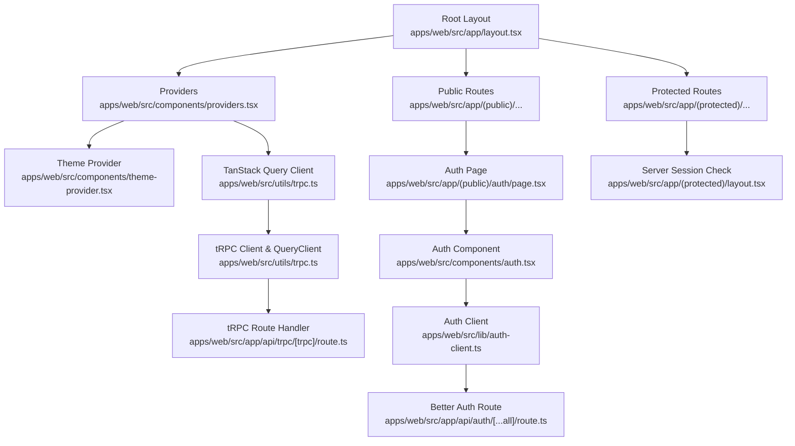
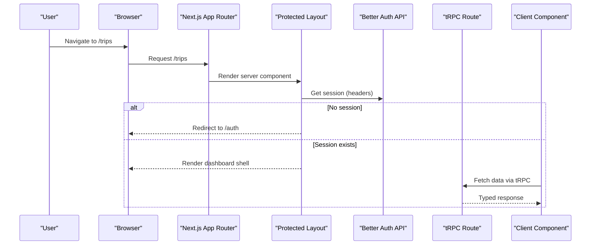
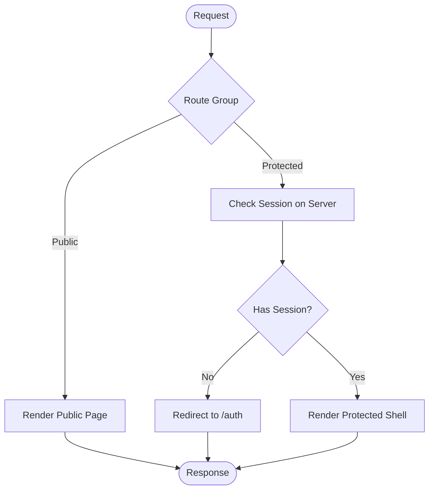
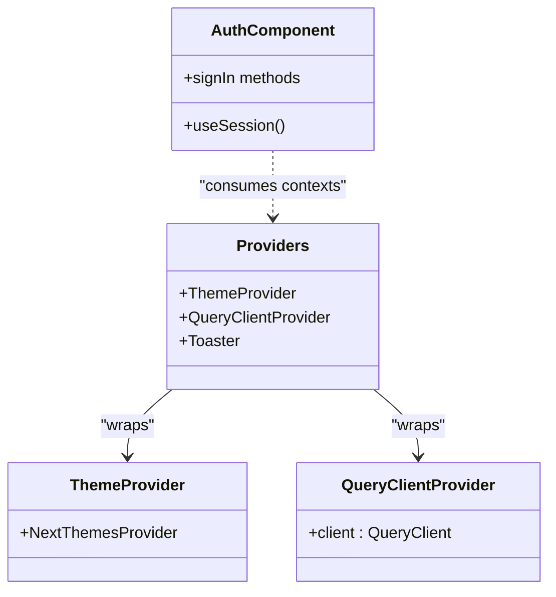
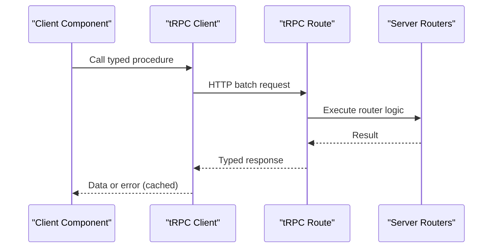
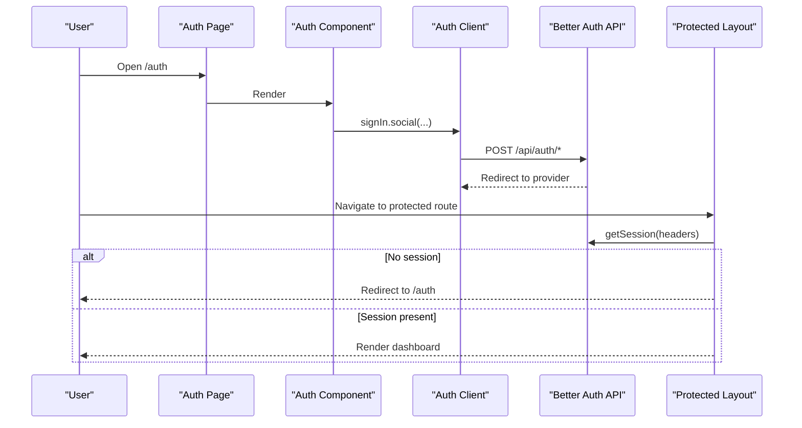
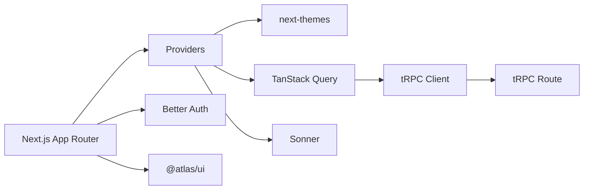

# Frontend Architecture

<cite>
**Referenced Files in This Document**
- [layout.tsx](file://apps/web/src/app/layout.tsx)
- [page.tsx](file://apps/web/src/app/page.tsx)
- [providers.tsx](file://apps/web/src/components/providers.tsx)
- [theme-provider.tsx](file://apps/web/src/components/theme-provider.tsx)
- [next.config.ts](file://apps/web/next.config.ts)
- [protected layout.tsx](file://apps/web/src/app/(protected)/layout.tsx)
- [auth page.tsx](file://apps/web/src/app/(public)/auth/page.tsx)
- [trpc client utils.ts](file://apps/web/src/utils/trpc.ts)
- [auth client lib.ts](file://apps/web/src/lib/auth-client.ts)
- [auth component.tsx](file://apps/web/src/components/auth.tsx)
- [tRPC route.ts](file://apps/web/src/app/api/trpc/[trpc]/route.ts)
- [Auth route.ts](file://apps/web/src/app/api/auth/[...all]/route.ts)
</cite>

## Table of Contents

1. [Introduction](#introduction)
2. [Project Structure](#project-structure)
3. [Core Components](#core-components)
4. [Architecture Overview](#architecture-overview)
5. [Detailed Component Analysis](#detailed-component-analysis)
6. [Dependency Analysis](#dependency-analysis)
7. [Performance Considerations](#performance-considerations)
8. [Troubleshooting Guide](#troubleshooting-guide)
9. [Conclusion](#conclusion)

## Introduction

This document describes the modern React architecture of the Next.js frontend application. It explains the App Router structure, server vs client components strategy, provider-based state and theme management, routing with protected and public segments, type-safe API integration via tRPC and TanStack Query, styling with Tailwind CSS v4, and performance optimizations including code splitting, image optimization, and bundle analysis guidance. It also documents how shared UI components from the @atlas/ui package are used and customized.

## Project Structure

The application follows Next.js App Router conventions:

- Root layout defines global providers, fonts, and base styles.
- Feature routes are grouped under (protected) and (public) route groups for clear separation of concerns.
- Shared UI is consumed from a local packages/ui library.
- Data fetching uses tRPC with TanStack Query for caching and error handling.
- Authentication integrates Better Auth with client-side hooks and server-side session checks.

**Diagram sources**

- [layout.tsx:26-46](file://apps/web/src/app/layout.tsx#L26-L46)
- [providers.tsx:11-25](file://apps/web/src/components/providers.tsx#L11-L25)
- [theme-provider.tsx:6-11](file://apps/web/src/components/theme-provider.tsx#L6-L11)
- [trpc client utils.ts:7-39](file://apps/web/src/utils/trpc.ts#L7-L39)
- [protected layout.tsx:22-65](<file://apps/web/src/app/(protected)/layout.tsx#L22-L65>)
- [auth page.tsx:5-7](<file://apps/web/src/app/(public)/auth/page.tsx#L5-L7>)
- [auth component.tsx:22-68](file://apps/web/src/components/auth.tsx#L22-L68)
- [auth client lib.ts:5-7](file://apps/web/src/lib/auth-client.ts#L5-L7)
- [tRPC route.ts:6-13](file://apps/web/src/app/api/trpc/[trpc]/route.ts#L6-L13)
- [Auth route.ts:4-4](file://apps/web/src/app/api/auth/[...all]/route.ts#L4-L4)

**Section sources**

- [layout.tsx:26-46](file://apps/web/src/app/layout.tsx#L26-L46)
- [next.config.ts:4-28](file://apps/web/next.config.ts#L4-L28)

## Core Components

- Providers orchestrate ThemeProvider and TanStack Query’s QueryClientProvider at the root of the app.
- ThemeProvider wraps the app to manage light/dark mode using next-themes.
- The root layout injects global fonts and applies base classes.
- Protected layout enforces authentication by checking the server-side session and redirects unauthenticated users.
- Public auth page renders the sign-in UI and delegates to the auth client.

Key responsibilities:

- Global state and side effects are provided through context (theme, query cache).
- Routing boundaries separate authenticated and unauthenticated experiences.
- tRPC client is configured once and reused across features.

**Section sources**

- [providers.tsx:11-25](file://apps/web/src/components/providers.tsx#L11-L25)
- [theme-provider.tsx:6-11](file://apps/web/src/components/theme-provider.tsx#L6-L11)
- [layout.tsx:26-46](file://apps/web/src/app/layout.tsx#L26-L46)
- [protected layout.tsx:22-65](<file://apps/web/src/app/(protected)/layout.tsx#L22-L65>)
- [auth page.tsx:5-7](<file://apps/web/src/app/(public)/auth/page.tsx#L5-L7>)

## Architecture Overview

The application combines server-rendered layouts with client components for interactivity:

- Server components handle data access and layout composition.
- Client components manage user interactions and UI state.
- tRPC provides end-to-end type safety between client and server routers.
- TanStack Query centralizes caching, retries, and error handling.
- Better Auth secures routes and manages sessions on both server and client.

**Diagram sources**

- [protected layout.tsx:22-33](<file://apps/web/src/app/(protected)/layout.tsx#L22-L33>)
- [tRPC route.ts:6-13](file://apps/web/src/app/api/trpc/[trpc]/route.ts#L6-L13)
- [Auth route.ts:4-4](file://apps/web/src/app/api/auth/[...all]/route.ts#L4-L4)

## Detailed Component Analysis

### App Router and Routing Strategy

- Root layout sets up global providers and base styles.
- Route groups:
  - (protected): Requires valid session; otherwise redirects to /auth.
  - (public): Contains the auth page and any non-protected content.
- Dynamic segments can be added within these groups following Next.js conventions.

**Diagram sources**

- [protected layout.tsx:22-33](<file://apps/web/src/app/(protected)/layout.tsx#L22-L33>)
- [auth page.tsx:5-7](<file://apps/web/src/app/(public)/auth/page.tsx#L5-L7>)

**Section sources**

- [layout.tsx:26-46](file://apps/web/src/app/layout.tsx#L26-L46)
- [protected layout.tsx:22-65](<file://apps/web/src/app/(protected)/layout.tsx#L22-L65>)
- [auth page.tsx:5-7](<file://apps/web/src/app/(public)/auth/page.tsx#L5-L7>)

### Server Components vs Client Components Strategy

- Server components are used for layouts and pages that perform server-side logic (e.g., session checks).
- Client components are marked with "use client" for interactivity (e.g., home page status indicator, auth UI).
- This split minimizes client bundle size and improves initial load performance.

**Section sources**

- [page.tsx:1-39](file://apps/web/src/app/page.tsx#L1-L39)
- [protected layout.tsx:22-65](<file://apps/web/src/app/(protected)/layout.tsx#L22-L65>)

### Provider Pattern: State Management, Authentication Context, Theme Handling

- Providers wrap the app to supply:
  - Theme context via next-themes.
  - QueryClient for TanStack Query caching and error handling.
  - Toast notifications via Sonner.
- Authentication context is handled by Better Auth:
  - Server-side session check in protected layout.
  - Client-side hooks in auth component for login flows.

**Diagram sources**

- [providers.tsx:11-25](file://apps/web/src/components/providers.tsx#L11-L25)
- [theme-provider.tsx:6-11](file://apps/web/src/components/theme-provider.tsx#L6-L11)
- [auth component.tsx:22-68](file://apps/web/src/components/auth.tsx#L22-L68)

**Section sources**

- [providers.tsx:11-25](file://apps/web/src/components/providers.tsx#L11-L25)
- [theme-provider.tsx:6-11](file://apps/web/src/components/theme-provider.tsx#L6-L11)
- [auth component.tsx:22-68](file://apps/web/src/components/auth.tsx#L22-L68)
- [auth client lib.ts:5-7](file://apps/web/src/lib/auth-client.ts#L5-L7)

### tRPC Integration with TanStack Query

- tRPC client is created with httpBatchLink pointing to /api/trpc.
- QueryClient is configured with a custom error handler that shows toast notifications and offers retry actions.
- The tRPC route handler wires the server-side router and request context.

**Diagram sources**

- [trpc client utils.ts:7-39](file://apps/web/src/utils/trpc.ts#L7-L39)
- [tRPC route.ts:6-13](file://apps/web/src/app/api/trpc/[trpc]/route.ts#L6-L13)

**Section sources**

- [trpc client utils.ts:7-39](file://apps/web/src/utils/trpc.ts#L7-L39)
- [tRPC route.ts:6-13](file://apps/web/src/app/api/trpc/[trpc]/route.ts#L6-L13)

### Authentication Flow

- Public auth page renders the sign-in UI.
- Auth component uses Better Auth client plugins and triggers social sign-ins.
- Protected layout validates session server-side and redirects if missing.

**Diagram sources**

- [auth page.tsx:5-7](<file://apps/web/src/app/(public)/auth/page.tsx#L5-L7>)
- [auth component.tsx:9-20](file://apps/web/src/components/auth.tsx#L9-L20)
- [auth client lib.ts:5-7](file://apps/web/src/lib/auth-client.ts#L5-L7)
- [Auth route.ts:4-4](file://apps/web/src/app/api/auth/[...all]/route.ts#L4-L4)
- [protected layout.tsx:22-33](<file://apps/web/src/app/(protected)/layout.tsx#L22-L33>)

**Section sources**

- [auth component.tsx:9-20](file://apps/web/src/components/auth.tsx#L9-L20)
- [auth client lib.ts:5-7](file://apps/web/src/lib/auth-client.ts#L5-L7)
- [Auth route.ts:4-4](file://apps/web/src/app/api/auth/[...all]/route.ts#L4-L4)
- [protected layout.tsx:22-33](<file://apps/web/src/app/(protected)/layout.tsx#L22-L33>)

### Styling with Tailwind CSS v4

- Global styles are imported in the root layout.
- Utility-first classes are used throughout components.
- Fonts are loaded via next/font and applied via CSS variables.

**Section sources**

- [layout.tsx:1-24](file://apps/web/src/app/layout.tsx#L1-L24)
- [layout.tsx:31-46](file://apps/web/src/app/layout.tsx#L31-L46)

### Component Library Usage and Customization

- Shared UI components are imported from @atlas/ui (e.g., Button, Badge, Sidebar, Separator, Toaster).
- Custom wrappers like ThemeProvider encapsulate third-party behavior while keeping consistent props.
- Composition patterns favor small, focused components that compose larger shells (sidebar, header, dashboard content).

**Section sources**

- [providers.tsx:3-23](file://apps/web/src/components/providers.tsx#L3-L23)
- [protected layout.tsx:2-18](<file://apps/web/src/app/(protected)/layout.tsx#L2-L18>)
- [auth component.tsx:1-6](file://apps/web/src/components/auth.tsx#L1-L6)

## Dependency Analysis

The frontend depends on:

- Next.js App Router for routing and server components.
- TanStack Query for data caching and lifecycle management.
- tRPC for type-safe API calls and batching.
- Better Auth for authentication flows and session handling.
- next-themes for theme management.
- Sonner for toast notifications.
- @atlas/ui for shared UI primitives and layout components.

**Diagram sources**

- [providers.tsx:3-23](file://apps/web/src/components/providers.tsx#L3-L23)
- [trpc client utils.ts:23-39](file://apps/web/src/utils/trpc.ts#L23-L39)
- [tRPC route.ts:6-13](file://apps/web/src/app/api/trpc/[trpc]/route.ts#L6-L13)
- [Auth route.ts:4-4](file://apps/web/src/app/api/auth/[...all]/route.ts#L4-L4)

**Section sources**

- [providers.tsx:3-23](file://apps/web/src/components/providers.tsx#L3-L23)
- [trpc client utils.ts:23-39](file://apps/web/src/utils/trpc.ts#L23-L39)
- [tRPC route.ts:6-13](file://apps/web/src/app/api/trpc/[trpc]/route.ts#L6-L13)
- [Auth route.ts:4-4](file://apps/web/src/app/api/auth/[...all]/route.ts#L4-L4)

## Performance Considerations

- Code splitting:
  - Use "use client" only where necessary to keep server components lightweight.
  - Prefer dynamic imports for heavy client-only features.
- Image optimization:
  - Configure remotePatterns to allow optimized loading of external images.
- Bundle analysis:
  - Analyze bundles to identify large dependencies and consider lazy loading.
- Caching:
  - TanStack Query caches responses and supports retries and error handling.
- Compiler and optimizations:
  - Enable React Compiler and experimental optimizations for faster builds and runtime performance.
- Partial prefetching:
  - Use partialPrefetching to improve perceived performance.

**Section sources**

- [next.config.ts:4-28](file://apps/web/next.config.ts#L4-L28)
- [trpc client utils.ts:7-19](file://apps/web/src/utils/trpc.ts#L7-L19)

## Troubleshooting Guide

- Authentication issues:
  - Ensure protected routes check session server-side and redirect appropriately.
  - Verify Better Auth handlers are mounted at /api/auth/* and credentials are included in fetch requests.
- tRPC errors:
  - Errors are caught by QueryCache.onError and surfaced via toast with a retry action.
  - Confirm tRPC endpoint URL and batch link configuration.
- Theme hydration:
  - Suppress hydration warnings when applying theme attributes and ensure consistent class names.

**Section sources**

- [protected layout.tsx:22-33](<file://apps/web/src/app/(protected)/layout.tsx#L22-L33>)
- [trpc client utils.ts:7-19](file://apps/web/src/utils/trpc.ts#L7-L19)
- [layout.tsx:31-46](file://apps/web/src/app/layout.tsx#L31-L46)

## Conclusion

The application leverages Next.js App Router with a clear separation between server and client components, robust provider-based context for theme and data caching, and type-safe API integration via tRPC and TanStack Query. Authentication is enforced server-side for protected routes and facilitated client-side for user interactions. Styling is utility-first with Tailwind CSS, and performance is optimized through compiler settings, image optimization, and caching strategies. Shared UI components from @atlas/ui promote consistency and reusability across the app.
