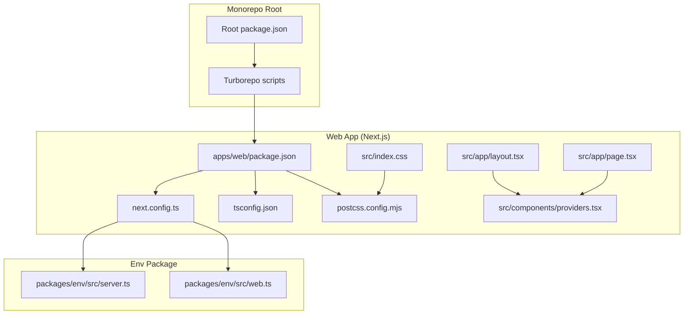
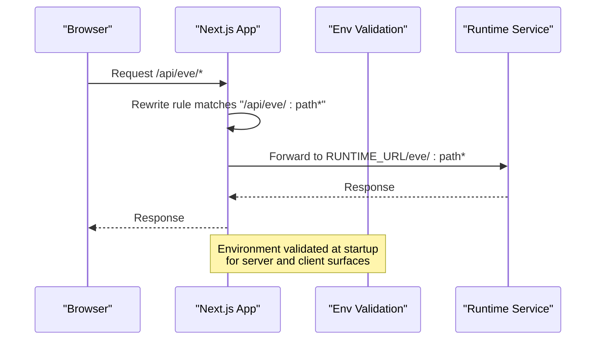
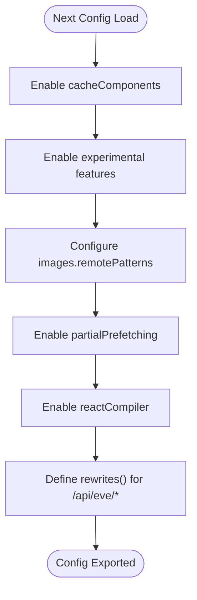
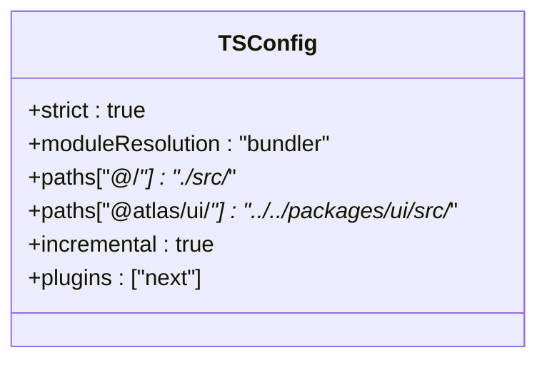
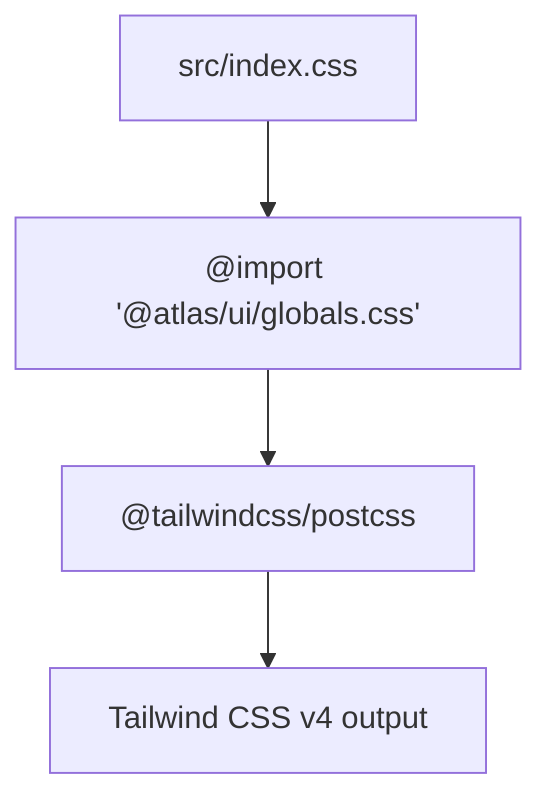
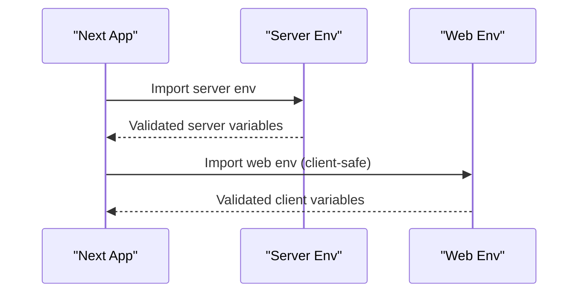
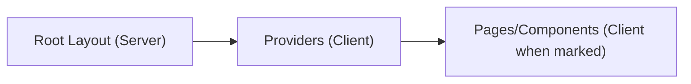
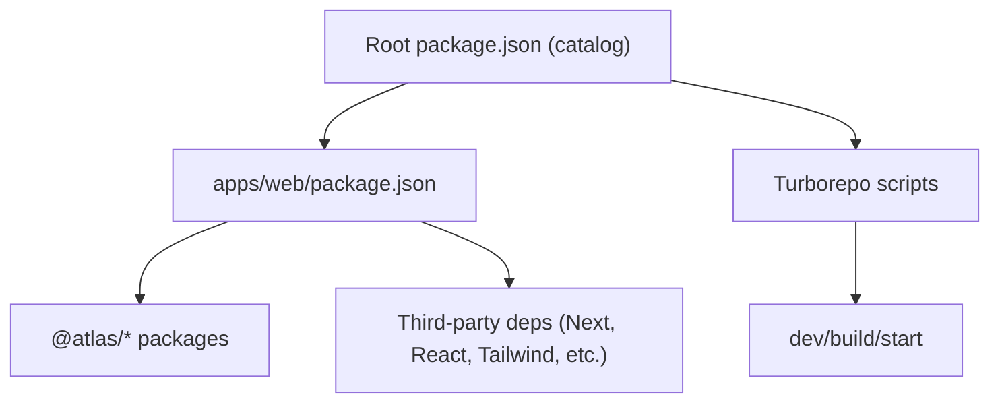

# Next.js Setup and Configuration

<cite>
**Referenced Files in This Document**
- [next.config.ts](file://apps/web/next.config.ts)
- [tsconfig.json](file://apps/web/tsconfig.json)
- [postcss.config.mjs](file://apps/web/postcss.config.mjs)
- [package.json](file://apps/web/package.json)
- [root package.json](file://package.json)
- [server env](file://packages/env/src/server.ts)
- [web env](file://packages/env/src/web.ts)
- [root layout](file://apps/web/src/app/layout.tsx)
- [providers](file://apps/web/src/components/providers.tsx)
- [home page](file://apps/web/src/app/page.tsx)
- [index.css](file://apps/web/src/index.css)
</cite>

## Table of Contents

1. Introduction
2. Project Structure
3. Core Components
4. Architecture Overview
5. Detailed Component Analysis
6. Dependency Analysis
7. Performance Considerations
8. Troubleshooting Guide
9. Conclusion

## Introduction

This document explains the Next.js application setup and configuration for the web app within a Turborepo workspace. It covers Next.js 16 configuration (including server/client components and middleware), TypeScript settings with path aliases and strict mode, PostCSS with Tailwind CSS v4 integration, environment variable handling, security headers, and performance optimizations such as image optimization and font loading strategies.

## Project Structure

The Next.js application lives under apps/web and is part of a monorepo managed by Turborepo. The root package.json defines workspaces and shared dependency catalogs. The web app uses:

- Next.js 16 via catalog-managed versions
- TypeScript with bundler module resolution and strict mode
- PostCSS with @tailwindcss/postcss for Tailwind CSS v4
- Environment validation via @t3-oss/env packages
- React Server Components and Client Components coexisting in the same app

**Diagram sources**

- [root package.json:1-66](file://package.json#L1-L66)
- [package.json:1-47](file://apps/web/package.json#L1-L47)
- [next.config.ts:1-31](file://apps/web/next.config.ts#L1-L31)
- [tsconfig.json:1-36](file://apps/web/tsconfig.json#L1-L36)
- [postcss.config.mjs:1-6](file://apps/web/postcss.config.mjs#L1-L6)
- [server env:1-29](file://packages/env/src/server.ts#L1-L29)
- [web env:1-14](file://packages/env/src/web.ts#L1-L14)
- [root layout:1-47](file://apps/web/src/app/layout.tsx#L1-L47)
- [providers:1-27](file://apps/web/src/components/providers.tsx#L1-L27)
- [home page:1-39](file://apps/web/src/app/page.tsx#L1-L39)
- [index.css:1-2](file://apps/web/src/index.css#L1-L2)

**Section sources**

- [root package.json:1-66](file://package.json#L1-L66)
- [package.json:1-47](file://apps/web/package.json#L1-L47)

## Core Components

- Next.js configuration: Enables component caching, experimental features, image remote patterns, partial prefetching, React Compiler, and URL rewrites to a runtime service.
- TypeScript configuration: Strict mode enabled, bundler module resolution, path aliases for local source and shared UI package, incremental builds, and Next.js plugin.
- PostCSS configuration: Uses @tailwindcss/postcss for Tailwind CSS v4 processing.
- Environment variables: Centralized validation for server-side and client-side env using @t3-oss/env packages.
- Root layout and providers: Sets up fonts, theme provider, and React Query client.
- Client components: Demonstrated by explicit "use client" directives in components/pages.

**Section sources**

- [next.config.ts:1-31](file://apps/web/next.config.ts#L1-L31)
- [tsconfig.json:1-36](file://apps/web/tsconfig.json#L1-L36)
- [postcss.config.mjs:1-6](file://apps/web/postcss.config.mjs#L1-L6)
- [server env:1-29](file://packages/env/src/server.ts#L1-L29)
- [web env:1-14](file://packages/env/src/web.ts#L1-L14)
- [root layout:1-47](file://apps/web/src/app/layout.tsx#L1-L47)
- [providers:1-27](file://apps/web/src/components/providers.tsx#L1-L27)
- [home page:1-39](file://apps/web/src/app/page.tsx#L1-L39)

## Architecture Overview

The web app integrates with a runtime service through a rewrite rule, validates environment variables at build/runtime, and renders both server and client components. Fonts are optimized via next/font, and styles are processed through PostCSS with Tailwind CSS v4.

**Diagram sources**

- [next.config.ts:20-27](file://apps/web/next.config.ts#L20-L27)
- [server env:1-29](file://packages/env/src/server.ts#L1-L29)
- [web env:1-14](file://packages/env/src/web.ts#L1-L14)

## Detailed Component Analysis

### Next.js Configuration (next.config.ts)

- Component caching: Enabled to improve rendering performance.
- Experimental features: Optimizes specific package imports and enables Turbopack Rust React Compiler.
- Images: Remote patterns allow images from a specified host.
- Partial prefetching: Enabled for faster navigation.
- React Compiler: Enabled to optimize React code during build.
- Rewrites: Proxies /api/eve/* to an external runtime service using an environment variable.

**Diagram sources**

- [next.config.ts:4-27](file://apps/web/next.config.ts#L4-L27)

**Section sources**

- [next.config.ts:1-31](file://apps/web/next.config.ts#L1-L31)

### TypeScript Configuration (tsconfig.json)

- Strict mode: Enforced for type safety.
- Module resolution: Bundler strategy for compatibility with modern toolchains.
- Path aliases:
  - "@/_" maps to "./src/_"
  - "@atlas/ui/_" maps to "../../packages/ui/src/_"
- Incremental compilation: Enabled for faster rebuilds.
- Next.js plugin: Included for framework-specific type support.

**Diagram sources**

- [tsconfig.json:1-36](file://apps/web/tsconfig.json#L1-L36)

**Section sources**

- [tsconfig.json:1-36](file://apps/web/tsconfig.json#L1-L36)

### PostCSS and Tailwind CSS v4 Integration

- PostCSS plugin: Uses @tailwindcss/postcss to process Tailwind CSS v4.
- Global styles: Imported via index.css which includes the shared UI globals.

**Diagram sources**

- [postcss.config.mjs:1-6](file://apps/web/postcss.config.mjs#L1-L6)
- [index.css:1-2](file://apps/web/src/index.css#L1-L2)

**Section sources**

- [postcss.config.mjs:1-6](file://apps/web/postcss.config.mjs#L1-L6)
- [index.css:1-2](file://apps/web/src/index.css#L1-L2)

### Environment Variables Handling

- Server environment: Validated with Zod schemas for required keys like API URLs, secrets, and runtime endpoints.
- Web environment: Exposes only allowed client-side variables with validation.
- Usage: Next config reads server env for runtime URL rewriting; other modules import from the env package.

**Diagram sources**

- [server env:1-29](file://packages/env/src/server.ts#L1-L29)
- [web env:1-14](file://packages/env/src/web.ts#L1-L14)
- [next.config.ts:1-2](file://apps/web/next.config.ts#L1-L2)

**Section sources**

- [server env:1-29](file://packages/env/src/server.ts#L1-L29)
- [web env:1-14](file://packages/env/src/web.ts#L1-L14)
- [next.config.ts:1-2](file://apps/web/next.config.ts#L1-L2)

### Server Components and Client Components

- Server components: Default behavior in Next.js; used for layout and metadata.
- Client components: Explicitly marked with "use client" where interactivity or browser APIs are needed.
- Providers: A client component wrapping the app with theme and query client.

**Diagram sources**

- [root layout:1-47](file://apps/web/src/app/layout.tsx#L1-L47)
- [providers:1-27](file://apps/web/src/components/providers.tsx#L1-L27)
- [home page:1-39](file://apps/web/src/app/page.tsx#L1-L39)

**Section sources**

- [root layout:1-47](file://apps/web/src/app/layout.tsx#L1-L47)
- [providers:1-27](file://apps/web/src/components/providers.tsx#L1-L27)
- [home page:1-39](file://apps/web/src/app/page.tsx#L1-L39)

### Middleware Setup

- No middleware file was found in the project structure. If authentication or request transformation is required, create a middleware file in the app directory following Next.js conventions.

[No sources needed since this section describes absence of middleware]

### Security Headers

- No explicit security headers were configured in the provided files. To add them, consider implementing middleware that sets standard headers (e.g., CSP, X-Frame-Options, Referrer-Policy).

[No sources needed since this section provides general guidance]

### Performance Optimizations

- Image Optimization: Remote patterns configured for a specific host to allow Next.js image optimization for those domains.
- Font Loading Strategies: Google fonts loaded via next/font with subsets and CSS variables for efficient rendering.
- Component Caching: Enabled to reduce recomputation.
- Partial Prefetching: Enabled to speed up navigation.
- React Compiler: Enabled to optimize React rendering.

**Section sources**

- [next.config.ts:10-19](file://apps/web/next.config.ts#L10-L19)
- [root layout:5-19](file://apps/web/src/app/layout.tsx#L5-L19)

## Dependency Analysis

- Workspace dependencies: The web app depends on internal packages (@atlas/api, @atlas/auth, @atlas/env, @atlas/ui) resolved via workspace protocol.
- Catalog management: Shared versions for key libraries (Next.js, React, Tailwind, etc.) are defined in the root package.json catalog.
- Scripts: Development, build, type checking, and start commands are defined per-app and orchestrated via Turborepo at the root.

**Diagram sources**

- [root package.json:1-66](file://package.json#L1-L66)
- [package.json:1-47](file://apps/web/package.json#L1-L47)

**Section sources**

- [root package.json:1-66](file://package.json#L1-L66)
- [package.json:1-47](file://apps/web/package.json#L1-L47)

## Performance Considerations

- Use next/font for preloading subsets and minimizing layout shifts.
- Keep client boundaries minimal; prefer server components for data-heavy rendering.
- Leverage component caching and partial prefetching already enabled.
- Optimize images by restricting remote patterns to trusted hosts.
- Avoid unnecessary client-side state; use React Query for server state.

[No sources needed since this section provides general guidance]

## Troubleshooting Guide

- Environment validation failures: Ensure all required server variables are present; client-only variables must be prefixed appropriately if exposed.
- Image loading errors: Verify remote patterns include the correct host and protocol.
- Type errors: Run the type check script to catch issues early.
- Build issues: Confirm Node version and package manager match the root configuration.

**Section sources**

- [server env:1-29](file://packages/env/src/server.ts#L1-L29)
- [web env:1-14](file://packages/env/src/web.ts#L1-L14)
- [package.json:5-9](file://apps/web/package.json#L5-L9)
- [root package.json:61-65](file://package.json#L61-L65)

## Conclusion

The Next.js application is configured with modern best practices: strict TypeScript, Tailwind CSS v4 via PostCSS, centralized environment validation, and performance-oriented features like component caching, partial prefetching, and optimized font/image handling. The monorepo setup centralizes dependency versions and scripts, enabling consistent development and builds across the workspace.

[No sources needed since this section summarizes without analyzing specific files]
