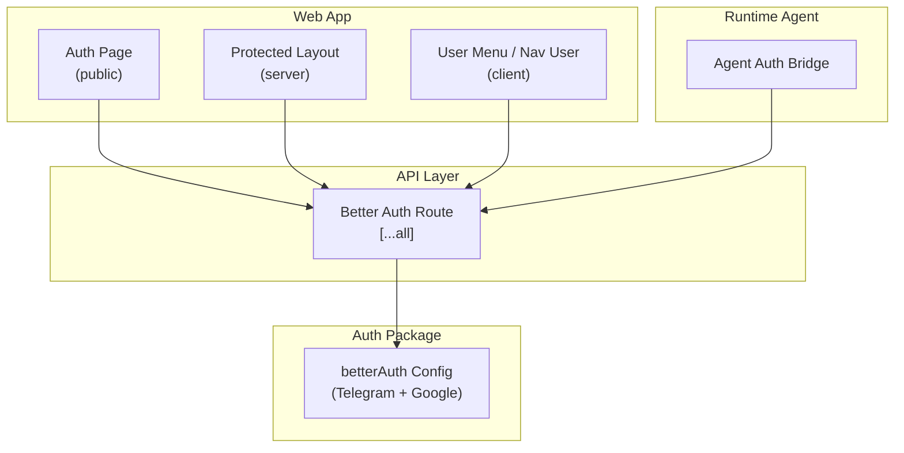
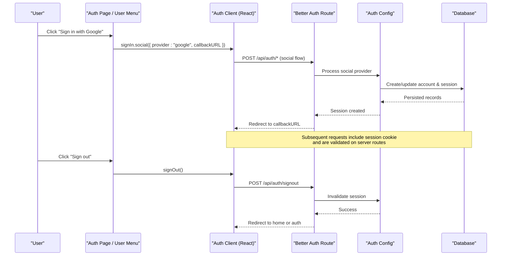
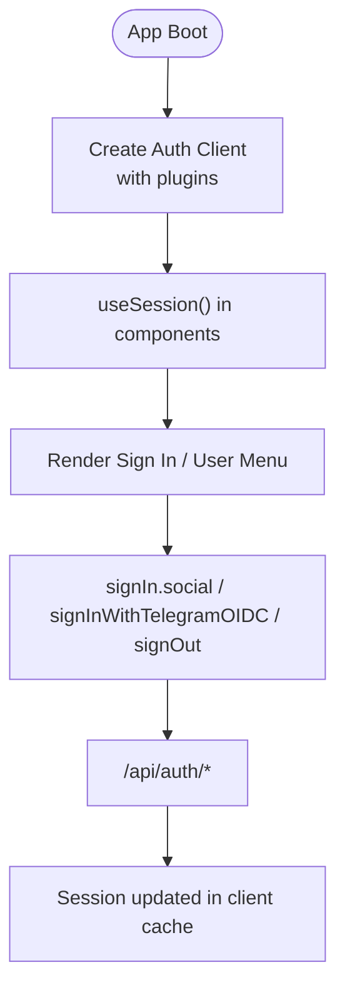
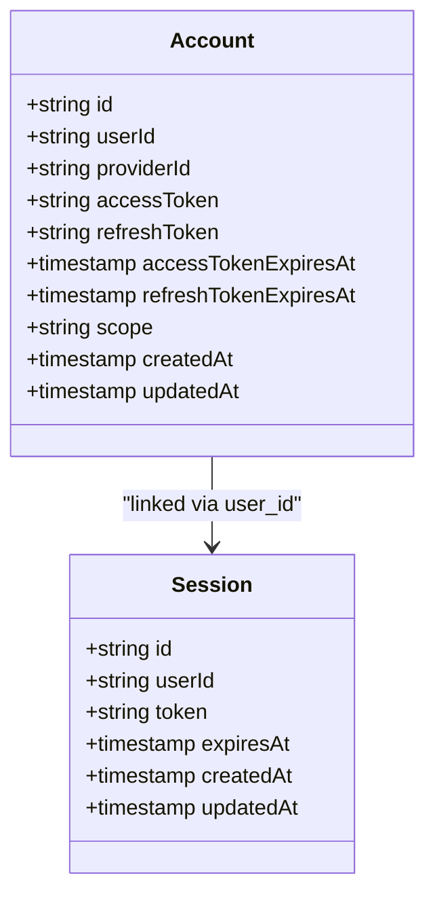
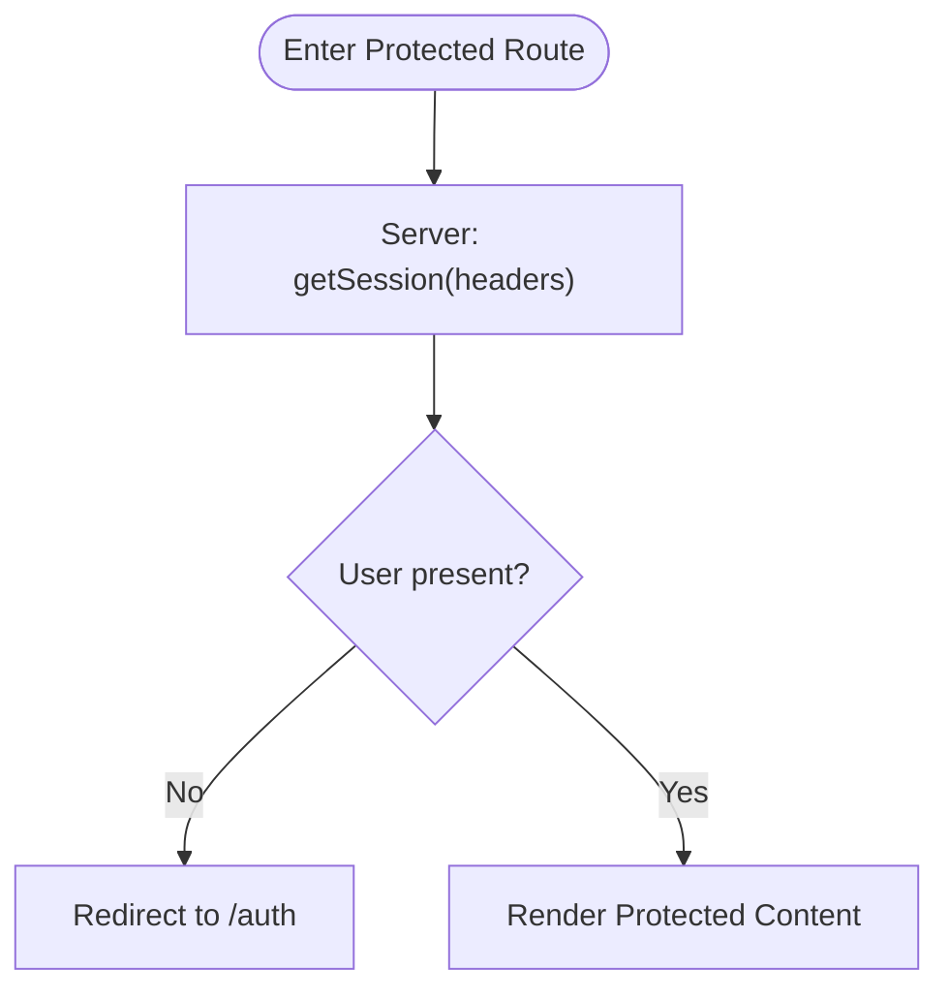
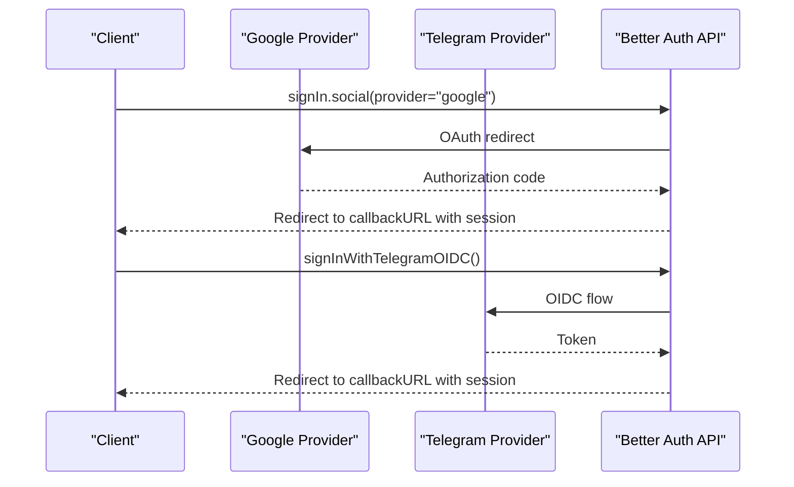
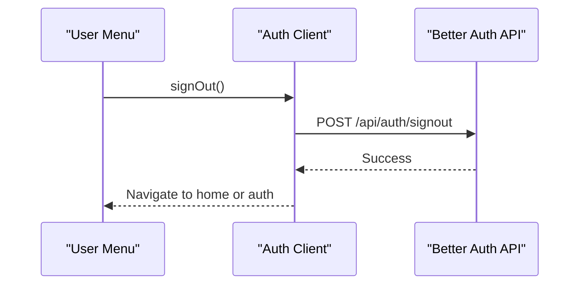
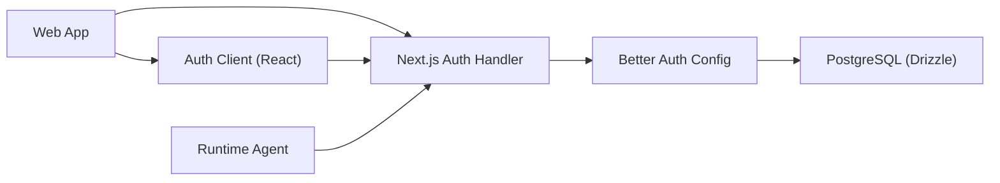

# Authentication State Management

<cite>
**Referenced Files in This Document**
- [auth-client.ts](file://apps/web/src/lib/auth-client.ts)
- [auth.tsx](file://apps/web/src/components/auth.tsx)
- [route.ts](file://apps/web/src/app/api/auth/[...all]/route.ts)
- [layout.tsx](file://apps/web/src/app/(protected)/layout.tsx)
- [index.ts](file://packages/auth/src/index.ts)
- [providers.tsx](file://apps/web/src/components/providers.tsx)
- [page.tsx](file://apps/web/src/app/(public)/auth/page.tsx)
- [nav-user.tsx](file://apps/web/src/components/nav-user.tsx)
- [user-menu.tsx](file://apps/web/src/components/user-menu.tsx)
- [auth.ts (runtime)](file://apps/runtime/agent/lib/auth.ts)
- [schema/auth.ts](file://packages/db/src/schema/auth.ts)
- [SKILL.md](file://.agents/skills/better-auth-best-practices/SKILL.md)
</cite>

## Table of Contents

1. [Introduction](#introduction)
2. [Project Structure](#project-structure)
3. [Core Components](#core-components)
4. [Architecture Overview](#architecture-overview)
5. [Detailed Component Analysis](#detailed-component-analysis)
6. [Dependency Analysis](#dependency-analysis)
7. [Performance Considerations](#performance-considerations)
8. [Troubleshooting Guide](#troubleshooting-guide)
9. [Conclusion](#conclusion)

## Introduction

This document explains how authentication state is managed across the application using Better Auth. It covers client integration, session handling, protected routes, role-based access patterns, token refresh behavior, third-party provider flows (Google and Telegram), security considerations, persistence strategies, error handling, and patterns for accessing authenticated user data and preferences.

## Project Structure

Authentication spans a few key areas:

- Server-side configuration and API route that expose Better Auth endpoints
- Client-side auth client with plugins for Telegram and last login method tracking
- Protected layout that enforces server-side session checks and redirects unauthenticated users
- UI components for sign-in, sign-out, and displaying current user context
- Runtime agent integration that reuses the same session to authenticate external channels

**Diagram sources**

- [route.ts:1-5](file://apps/web/src/app/api/auth/[...all]/route.ts#L1-L5)
- [index.ts:10-42](file://packages/auth/src/index.ts#L10-L42)
- [layout.tsx:22-33](<file://apps/web/src/app/(protected)/layout.tsx#L22-L33>)
- [auth.tsx:9-20](file://apps/web/src/components/auth.tsx#L9-L20)
- [nav-user.tsx:91-100](file://apps/web/src/components/nav-user.tsx#L91-L100)
- [auth.ts (runtime):4-24](file://apps/runtime/agent/lib/auth.ts#L4-L24)

**Section sources**

- [route.ts:1-5](file://apps/web/src/app/api/auth/[...all]/route.ts#L1-L5)
- [index.ts:10-42](file://packages/auth/src/index.ts#L10-L42)
- [layout.tsx:22-33](<file://apps/web/src/app/(protected)/layout.tsx#L22-L33>)

## Core Components

- Better Auth server configuration: centralizes database adapter, social providers (Google), Telegram OIDC, cookies, and plugins.
- Next.js API route: exposes Better Auth endpoints via a catch-all handler.
- Client auth client: React hooks and methods for session management, social sign-in, and Telegram OIDC; includes plugins for Telegram and last login method.
- Protected layout: server-side session check that redirects unauthenticated users to the public auth page.
- UI components: sign-in buttons, user menu, and navigation user item that read session state and trigger sign-out.
- Runtime agent bridge: reads session from requests to authenticate agent interactions using the same session store.

**Section sources**

- [index.ts:10-42](file://packages/auth/src/index.ts#L10-L42)
- [route.ts:1-5](file://apps/web/src/app/api/auth/[...all]/route.ts#L1-L5)
- [auth-client.ts:1-7](file://apps/web/src/lib/auth-client.ts#L1-L7)
- [layout.tsx:22-33](<file://apps/web/src/app/(protected)/layout.tsx#L22-L33>)
- [auth.tsx:9-20](file://apps/web/src/components/auth.tsx#L9-L20)
- [nav-user.tsx:91-100](file://apps/web/src/components/nav-user.tsx#L91-L100)
- [user-menu.tsx:43-55](file://apps/web/src/components/user-menu.tsx#L43-L55)
- [auth.ts (runtime):4-24](file://apps/runtime/agent/lib/auth.ts#L4-L24)

## Architecture Overview

The app uses Better Auth as the single source of truth for sessions. The client calls the shared API route to perform sign-in/sign-out and to fetch or refresh sessions. Server-side layouts enforce access by validating sessions before rendering protected content. Third-party providers are configured centrally and invoked from the client.

**Diagram sources**

- [auth.tsx:9-20](file://apps/web/src/components/auth.tsx#L9-L20)
- [route.ts:1-5](file://apps/web/src/app/api/auth/[...all]/route.ts#L1-L5)
- [index.ts:10-42](file://packages/auth/src/index.ts#L10-L42)
- [schema/auth.ts:41-64](file://packages/db/src/schema/auth.ts#L41-L64)

## Detailed Component Analysis

### Better Auth Client Integration

- The React client is created with plugins for Telegram and last login method tracking. This enables:
  - Social sign-in via Google
  - Telegram OIDC sign-in
  - Displaying the last used login method in the UI
- Hooks like useSession provide reactive session state across components.

**Diagram sources**

- [auth-client.ts:1-7](file://apps/web/src/lib/auth-client.ts#L1-L7)
- [auth.tsx:9-20](file://apps/web/src/components/auth.tsx#L9-L20)
- [nav-user.tsx:91-100](file://apps/web/src/components/nav-user.tsx#L91-L100)

**Section sources**

- [auth-client.ts:1-7](file://apps/web/src/lib/auth-client.ts#L1-L7)
- [auth.tsx:9-20](file://apps/web/src/components/auth.tsx#L9-L20)

### Session Handling and Persistence

- Sessions are handled by Better Auth with Drizzle adapter backed by PostgreSQL.
- Accounts table stores OAuth tokens and refresh metadata; sessions are persisted and can be invalidated on sign-out.
- Cookies are enabled via the Next.js plugin to persist sessions across requests.

**Diagram sources**

- [schema/auth.ts:41-64](file://packages/db/src/schema/auth.ts#L41-L64)

**Section sources**

- [index.ts:10-42](file://packages/auth/src/index.ts#L10-L42)
- [schema/auth.ts:41-64](file://packages/db/src/schema/auth.ts#L41-L64)

### Protected Routes and Access Control

- The protected layout performs a server-side session check using the auth API and redirects to the public auth page if no user is present.
- For fine-grained authorization (e.g., roles), extend this pattern by checking session.user attributes after retrieval.

**Diagram sources**

- [layout.tsx:22-33](<file://apps/web/src/app/(protected)/layout.tsx#L22-L33>)

**Section sources**

- [layout.tsx:22-33](<file://apps/web/src/app/(protected)/layout.tsx#L22-L33>)

### Login Flows (Google and Telegram)

- Google: client triggers social sign-in with a callback URL; Better Auth handles OAuth exchange and sets session.
- Telegram: client uses Telegram OIDC via the Telegram plugin; Better Auth validates and sets session.
- Last login method is tracked and displayed in the UI to improve UX.

**Diagram sources**

- [auth.tsx:9-20](file://apps/web/src/components/auth.tsx#L9-L20)
- [index.ts:23-37](file://packages/auth/src/index.ts#L23-L37)

**Section sources**

- [auth.tsx:9-20](file://apps/web/src/components/auth.tsx#L9-L20)
- [index.ts:23-37](file://packages/auth/src/index.ts#L23-L37)

### Logout Flow

- Both the navigation user menu and the top user menu call signOut, which invalidates the session on the server and clears client state. On success, they navigate away from protected routes.

**Diagram sources**

- [nav-user.tsx:91-100](file://apps/web/src/components/nav-user.tsx#L91-L100)
- [user-menu.tsx:43-55](file://apps/web/src/components/user-menu.tsx#L43-L55)

**Section sources**

- [nav-user.tsx:91-100](file://apps/web/src/components/nav-user.tsx#L91-L100)
- [user-menu.tsx:43-55](file://apps/web/src/components/user-menu.tsx#L43-L55)

### Accessing Authenticated User Data and Preferences

- Components read session via useSession to display user name, email, and avatar.
- To manage user preferences tied to the authenticated user, store them in your database and associate them with the user ID obtained from the session.
- For server actions or tRPC procedures, validate the session at the entry point and then read user attributes to enforce permissions or load preferences.

**Section sources**

- [nav-user.tsx:26-58](file://apps/web/src/components/nav-user.tsx#L26-L58)
- [user-menu.tsx:17-31](file://apps/web/src/components/user-menu.tsx#L17-L31)

### Role-Based Access Control (RBAC) Patterns

- While explicit role fields are not shown in the current schema, you can implement RBAC by:
  - Adding a role field to the user model and ensuring it is included in the session payload.
  - Checking session.user.role in protected layouts or procedure middleware before allowing access.
  - Using the existing protected layout pattern to gate routes and extending it with role checks.

[No sources needed since this section provides general guidance based on existing patterns]

### Automatic Token Refresh Mechanisms

- Better Auth manages session lifecycle and cookie caching. For provider-specific tokens stored in accounts, Better Auth’s internals handle expiration and refresh where supported by the provider.
- Configure session options such as expiresIn and updateAge to control refresh cadence and cookie cache behavior.

**Section sources**

- [SKILL.md:78-93](file://.agents/skills/better-auth-best-practices/SKILL.md#L78-L93)

## Dependency Analysis

- The web app depends on the centralized auth package for configuration and the Next.js handler to expose endpoints.
- Client components depend on the React auth client for session hooks and actions.
- The runtime agent reuses the same session mechanism to authenticate external requests.

**Diagram sources**

- [route.ts:1-5](file://apps/web/src/app/api/auth/[...all]/route.ts#L1-L5)
- [index.ts:10-42](file://packages/auth/src/index.ts#L10-L42)
- [auth.ts (runtime):4-24](file://apps/runtime/agent/lib/auth.ts#L4-L24)

**Section sources**

- [route.ts:1-5](file://apps/web/src/app/api/auth/[...all]/route.ts#L1-L5)
- [index.ts:10-42](file://packages/auth/src/index.ts#L10-L42)
- [auth.ts (runtime):4-24](file://apps/runtime/agent/lib/auth.ts#L4-L24)

## Performance Considerations

- Prefer server-side session checks in layouts for protected routes to avoid unnecessary client round-trips.
- Use client-side hooks (useSession) to minimize re-renders and leverage built-in caching.
- Keep session payloads minimal; avoid storing large objects in cookies.
- Leverage cookie cache strategies provided by Better Auth to balance security and performance.

[No sources needed since this section provides general guidance]

## Troubleshooting Guide

- Unauthenticated redirects: If protected routes redirect unexpectedly, verify that the session exists and that cookies are being sent with requests (especially in cross-origin scenarios).
- Provider errors: Ensure environment variables for Google and Telegram are set correctly and that callback URLs match configured origins.
- Sign-out issues: Confirm that signOut calls reach the server and that navigation occurs after successful logout.
- Session not refreshing: Check session expiry and updateAge settings; ensure cookies are not blocked or scoped incorrectly.

**Section sources**

- [layout.tsx:22-33](<file://apps/web/src/app/(protected)/layout.tsx#L22-L33>)
- [index.ts:10-42](file://packages/auth/src/index.ts#L10-L42)
- [nav-user.tsx:91-100](file://apps/web/src/components/nav-user.tsx#L91-L100)
- [user-menu.tsx:43-55](file://apps/web/src/components/user-menu.tsx#L43-L55)

## Conclusion

The application uses Better Auth to centralize authentication, session management, and provider integrations. Protected routes enforce server-side session validation, while the React client provides reactive session state and convenient methods for login/logout flows. Security is reinforced through cookie handling, trusted origins, and server-side checks. Extending the system with role-based access control and user preference storage follows naturally from the established patterns.
