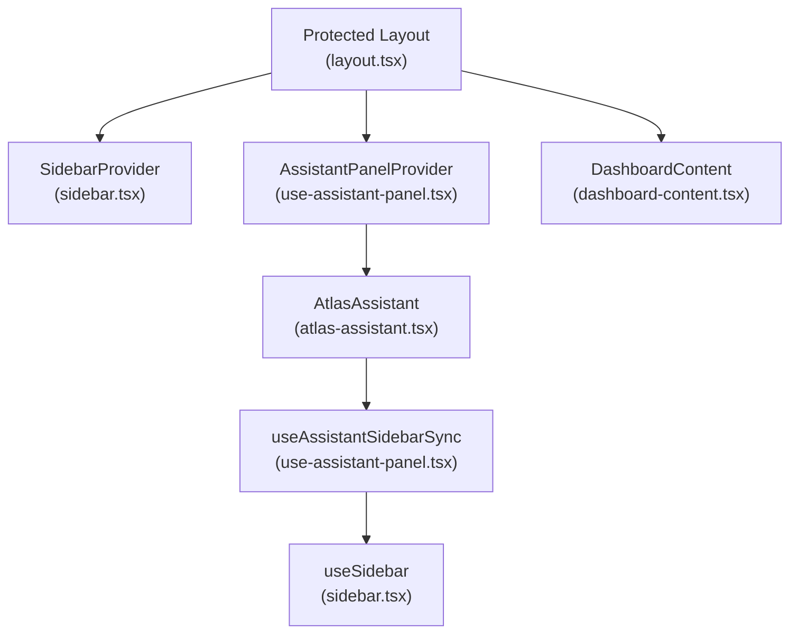
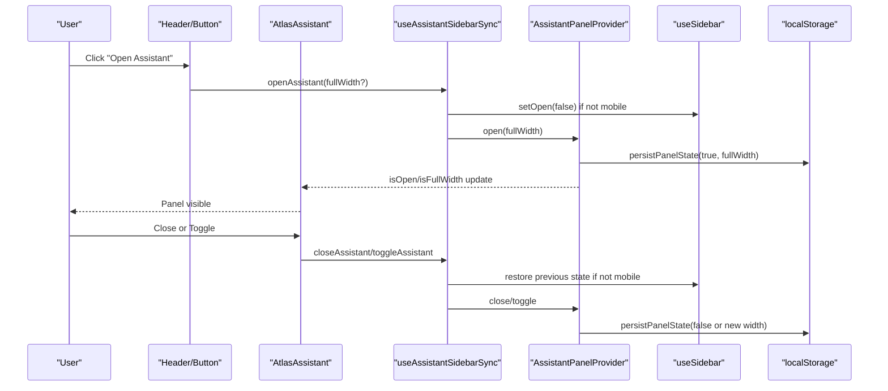
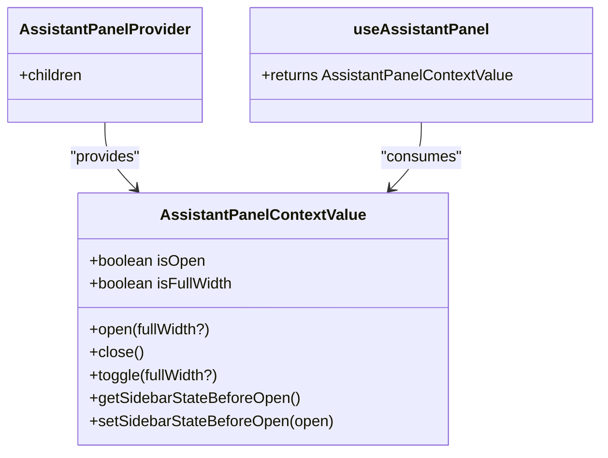
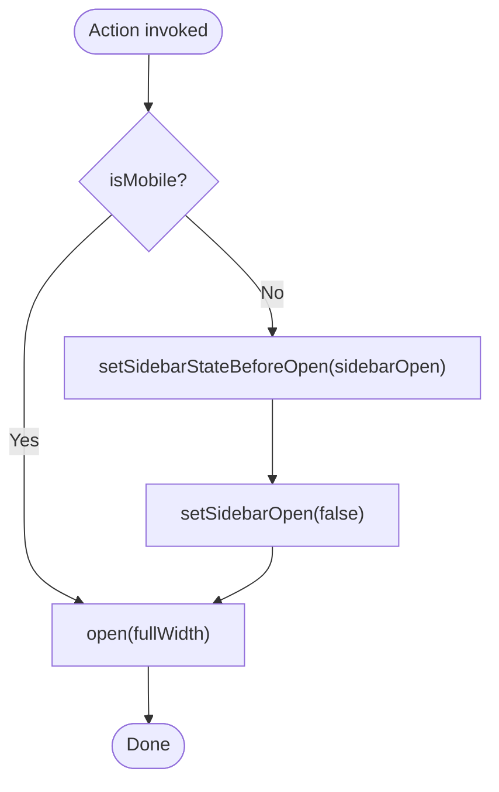
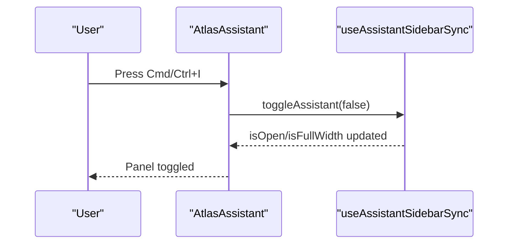
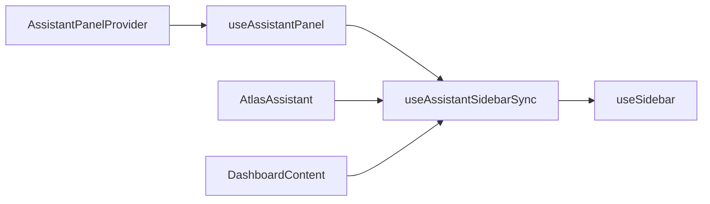

# Client State Management

<cite>
**Referenced Files in This Document**
- [use-assistant-panel.tsx](file://apps/web/src/hooks/use-assistant-panel.tsx)
- [atlas-assistant.tsx](file://apps/web/src/components/atlas-assistant.tsx)
- [dashboard-content.tsx](file://apps/web/src/components/dashboard-content.tsx)
- [layout.tsx](file://apps/web/src/app/(protected)/layout.tsx)
- [providers.tsx](file://apps/web/src/components/providers.tsx)
- [sidebar.tsx](file://packages/ui/src/components/sidebar.tsx)
</cite>

## Table of Contents

1. [Introduction](#introduction)
2. [Project Structure](#project-structure)
3. [Core Components](#core-components)
4. [Architecture Overview](#architecture-overview)
5. [Detailed Component Analysis](#detailed-component-analysis)
6. [Dependency Analysis](#dependency-analysis)
7. [Performance Considerations](#performance-considerations)
8. [Troubleshooting Guide](#troubleshooting-guide)
9. [Conclusion](#conclusion)
10. [Appendices](#appendices)

## Introduction

This document explains the client-side state management patterns used by the Atlas web application, focusing on global UI state for the assistant panel, custom hooks for component-specific behavior, and persistence with localStorage. It covers the AssistantPanelProvider implementation, context value structure, synchronization with the sidebar, error handling for storage operations, performance optimizations using useMemo and useCallback, and strategies for testing stateful components.

## Project Structure

The assistant panel feature is implemented as a small set of focused modules:

- A provider and hook that own global assistant panel state and persist it to localStorage
- A coordinator hook that synchronizes the assistant panel with the app sidebar
- UI components that consume the coordinator hook to render the panel and adjust layout
- Layout wiring that mounts the providers and composes the UI

**Diagram sources**

- [layout.tsx:35-63](<file://apps/web/src/app/(protected)/layout.tsx#L35-L63>)
- [sidebar.tsx:45-148](file://packages/ui/src/components/sidebar.tsx#L45-L148)
- [use-assistant-panel.tsx:67-150](file://apps/web/src/hooks/use-assistant-panel.tsx#L67-L150)
- [atlas-assistant.tsx:122-174](file://apps/web/src/components/atlas-assistant.tsx#L122-L174)
- [dashboard-content.tsx:5-17](file://apps/web/src/components/dashboard-content.tsx#L5-L17)

**Section sources**

- [layout.tsx:35-63](<file://apps/web/src/app/(protected)/layout.tsx#L35-L63>)
- [providers.tsx:11-26](file://apps/web/src/components/providers.tsx#L11-L26)

## Core Components

- AssistantPanelProvider: Owns open/full-width state, persists to localStorage, exposes actions via React Context.
- useAssistantPanel: Custom hook to read/write the assistant panel context safely.
- useAssistantSidebarSync: Custom hook that coordinates the assistant panel with the app sidebar (collapses sidebar when opening, restores previous state when closing; no-op on mobile).
- AtlasAssistant: Renders the assistant panel UI and wires keyboard shortcuts and header controls to the coordinator hook.
- DashboardContent: Conditionally hides dashboard content when the assistant panel is full-width.

Key responsibilities:

- Global UI state ownership and persistence
- Cross-component coordination without prop drilling
- Safe storage access with graceful fallbacks
- Performance-conscious memoization and callbacks

**Section sources**

- [use-assistant-panel.tsx:20-161](file://apps/web/src/hooks/use-assistant-panel.tsx#L20-L161)
- [atlas-assistant.tsx:122-174](file://apps/web/src/components/atlas-assistant.tsx#L122-L174)
- [dashboard-content.tsx:5-17](file://apps/web/src/components/dashboard-content.tsx#L5-L17)

## Architecture Overview

The assistant panel state flows from a single source of truth (the provider) through a custom hook to multiple consumers. Persistence ensures state survives navigation. Sidebar coordination ensures a consistent UX across desktop and mobile.

**Diagram sources**

- [use-assistant-panel.tsx:92-125](file://apps/web/src/hooks/use-assistant-panel.tsx#L92-L125)
- [use-assistant-panel.tsx:169-234](file://apps/web/src/hooks/use-assistant-panel.tsx#L169-L234)
- [atlas-assistant.tsx:122-174](file://apps/web/src/components/atlas-assistant.tsx#L122-L174)
- [sidebar.tsx:72-127](file://packages/ui/src/components/sidebar.tsx#L72-L127)

## Detailed Component Analysis

### AssistantPanelProvider and Context Value

- State:
  - isOpen: boolean controlling visibility
  - isFullWidth: boolean controlling panel width mode
  - sidebarStateBeforeOpenValue: snapshot of sidebar open state before opening the panel
- Actions:
  - open(fullWidth?): opens panel and sets width mode
  - close(): closes panel while preserving width mode
  - toggle(fullWidth?): toggles visibility and updates width mode
  - getSidebarStateBeforeOpen(): reads the saved sidebar snapshot
  - setSidebarStateBeforeOpen(next): saves sidebar snapshot
- Persistence:
  - Uses localStorage keys with versioned prefixes to store panel open state, width mode, and sidebar snapshot
  - Reads persisted values during initialization inside requestAnimationFrame to avoid hydration issues
  - Wrrites are wrapped in try/catch to handle private browsing or quota errors gracefully
- Memoization:
  - Exposes a stable context value object created with useMemo
  - All action functions are wrapped in useCallback to minimize re-renders

**Diagram sources**

- [use-assistant-panel.tsx:20-28](file://apps/web/src/hooks/use-assistant-panel.tsx#L20-L28)
- [use-assistant-panel.tsx:67-150](file://apps/web/src/hooks/use-assistant-panel.tsx#L67-L150)
- [use-assistant-panel.tsx:153-161](file://apps/web/src/hooks/use-assistant-panel.tsx#L153-L161)

**Section sources**

- [use-assistant-panel.tsx:30-61](file://apps/web/src/hooks/use-assistant-panel.tsx#L30-L61)
- [use-assistant-panel.tsx:67-150](file://apps/web/src/hooks/use-assistant-panel.tsx#L67-L150)
- [use-assistant-panel.tsx:153-161](file://apps/web/src/hooks/use-assistant-panel.tsx#L153-L161)

### useAssistantSidebarSync: Sidebar Coordination

- Purpose: Coordinate the assistant panel with the app sidebar so they do not overlap and user preferences are preserved.
- Behavior:
  - On open:
    - If not mobile, save current sidebar open state and collapse the sidebar
    - Open the assistant panel with optional full-width mode
  - On close:
    - If not mobile, restore the previously saved sidebar state
    - Close the assistant panel
  - On toggle:
    - If already open and same width mode, close
    - Otherwise, open or switch width mode
- Mobile handling:
  - Skips sidebar changes because the sidebar is an overlay on mobile

**Diagram sources**

- [use-assistant-panel.tsx:169-234](file://apps/web/src/hooks/use-assistant-panel.tsx#L169-L234)

**Section sources**

- [use-assistant-panel.tsx:169-234](file://apps/web/src/hooks/use-assistant-panel.tsx#L169-L234)

### AtlasAssistant: UI and Keyboard Shortcuts

- Renders the assistant panel with header controls to close or toggle full-width
- Wires keyboard shortcut (Cmd/Ctrl+I) to toggle the panel
- Consumes useAssistantSidebarSync to control visibility and width

**Diagram sources**

- [atlas-assistant.tsx:122-174](file://apps/web/src/components/atlas-assistant.tsx#L122-L174)
- [use-assistant-panel.tsx:169-234](file://apps/web/src/hooks/use-assistant-panel.tsx#L169-L234)

**Section sources**

- [atlas-assistant.tsx:122-174](file://apps/web/src/components/atlas-assistant.tsx#L122-L174)

### DashboardContent: Conditional Rendering

- Hides dashboard content when the assistant panel is full-width to avoid overlapping layouts
- Uses the coordinator hook to react to panel state

**Section sources**

- [dashboard-content.tsx:5-17](file://apps/web/src/components/dashboard-content.tsx#L5-L17)

### Providers and Layout Wiring

- Protected layout wraps the app with SidebarProvider and AssistantPanelProvider
- AtlasAssistant is rendered alongside the main content area
- Global providers (theme, query client) are mounted at the root level

**Section sources**

- [layout.tsx:35-63](<file://apps/web/src/app/(protected)/layout.tsx#L35-L63>)
- [providers.tsx:11-26](file://apps/web/src/components/providers.tsx#L11-L26)

## Dependency Analysis

- AssistantPanelProvider depends on:
  - React Context API for global state distribution
  - localStorage for persistence
  - requestAnimationFrame for safe hydration reads
- useAssistantSidebarSync depends on:
  - AssistantPanelProvider context
  - useSidebar from the shared UI library to coordinate with the app sidebar
- AtlasAssistant depends on:
  - useAssistantSidebarSync for behavior
  - UI primitives for rendering
- DashboardContent depends on:
  - useAssistantSidebarSync for conditional rendering

**Diagram sources**

- [use-assistant-panel.tsx:67-161](file://apps/web/src/hooks/use-assistant-panel.tsx#L67-L161)
- [use-assistant-panel.tsx:169-234](file://apps/web/src/hooks/use-assistant-panel.tsx#L169-L234)
- [sidebar.tsx:45-127](file://packages/ui/src/components/sidebar.tsx#L45-L127)
- [atlas-assistant.tsx:122-174](file://apps/web/src/components/atlas-assistant.tsx#L122-L174)
- [dashboard-content.tsx:5-17](file://apps/web/src/components/dashboard-content.tsx#L5-L17)

**Section sources**

- [use-assistant-panel.tsx:67-234](file://apps/web/src/hooks/use-assistant-panel.tsx#L67-L234)
- [sidebar.tsx:45-127](file://packages/ui/src/components/sidebar.tsx#L45-L127)

## Performance Considerations

- Memoization:
  - Context value is wrapped in useMemo to prevent unnecessary subscriber re-renders
  - Action functions are wrapped in useCallback to keep references stable
- Storage I/O:
  - Reads occur once during initialization within requestAnimationFrame to avoid blocking initial paint
  - Writes are wrapped in try/catch to fail silently in restricted environments
- Functional setState:
  - Toggle uses functional updates to avoid stale closures and reduce dependencies
- Sidebar coordination:
  - Avoids redundant operations by checking current state before acting

[No sources needed since this section provides general guidance]

## Troubleshooting Guide

Common issues and resolutions:

- Storage unavailable (private/incognito mode or quota exceeded):
  - The code catches exceptions during localStorage reads/writes and continues with in-memory state only
  - Symptoms: panel state resets on reload; check browser privacy settings or storage limits
- Hydration mismatch:
  - Initial state is read inside requestAnimationFrame to ensure window is available and avoid SSR mismatches
- Sidebar not restoring:
  - Ensure the sidebar provider is active and that the coordinator hook runs outside mobile-only paths
- Unexpected re-renders:
  - Verify that consumers are using the coordinator hook rather than reading raw context directly where possible
  - Confirm that callback dependencies are minimal and correct

**Section sources**

- [use-assistant-panel.tsx:34-61](file://apps/web/src/hooks/use-assistant-panel.tsx#L34-L61)
- [use-assistant-panel.tsx:78-90](file://apps/web/src/hooks/use-assistant-panel.tsx#L78-L90)

## Conclusion

The Atlas assistant panel demonstrates a clean separation of concerns:

- A provider owns global state and persistence
- A coordinator hook encapsulates complex interactions with the sidebar
- UI components remain simple and declarative
- Robust error handling and performance optimizations ensure reliability and responsiveness

This pattern scales well to additional panels or features requiring shared state and cross-component coordination.

[No sources needed since this section summarizes without analyzing specific files]

## Appendices

### Creating a Custom Hook for Local State Management

- Pattern:
  - Encapsulate useState and side effects in a hook
  - Expose a stable interface (state + actions)
  - Persist to localStorage with versioned keys and try/catch
  - Use functional setState and memoized callbacks for stability

Example reference path:

- [use-assistant-panel.tsx:92-125](file://apps/web/src/hooks/use-assistant-panel.tsx#L92-L125)

### Handling State Persistence Across Navigations

- Strategy:
  - Read persisted values on mount (after first frame)
  - Write on every relevant state change
  - Version keys to support schema evolution
  - Gracefully handle storage errors

Example reference path:

- [use-assistant-panel.tsx:30-61](file://apps/web/src/hooks/use-assistant-panel.tsx#L30-L61)
- [use-assistant-panel.tsx:78-90](file://apps/web/src/hooks/use-assistant-panel.tsx#L78-L90)

### Managing Complex Interactions: Sidebar Coordination

- Approach:
  - Snapshot dependent state before changing it
  - Apply changes conditionally based on device type
  - Restore previous state on revert actions

Example reference path:

- [use-assistant-panel.tsx:169-234](file://apps/web/src/hooks/use-assistant-panel.tsx#L169-L234)

### Error Handling for Storage Operations

- Practices:
  - Wrap all localStorage calls in try/catch
  - Provide sensible defaults on failure
  - Keep UI responsive even when storage is unavailable

Example reference path:

- [use-assistant-panel.tsx:34-61](file://apps/web/src/hooks/use-assistant-panel.tsx#L34-L61)

### Testing Strategies for Stateful Components

- Recommendations:
  - Render components under their required providers (e.g., AssistantPanelProvider)
  - Mock localStorage to assert persistence behavior
  - Simulate user interactions (clicks, keyboard events) and verify state transitions
  - For sidebar coordination, mock useSidebar to control isMobile and sidebar state

[No sources needed since this section provides general guidance]
