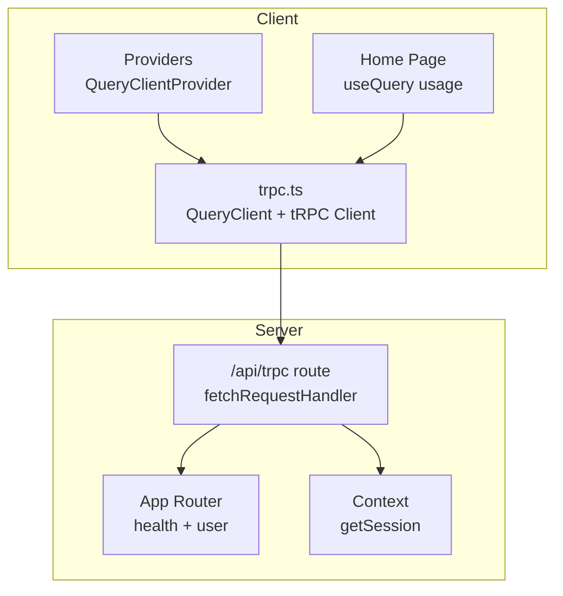
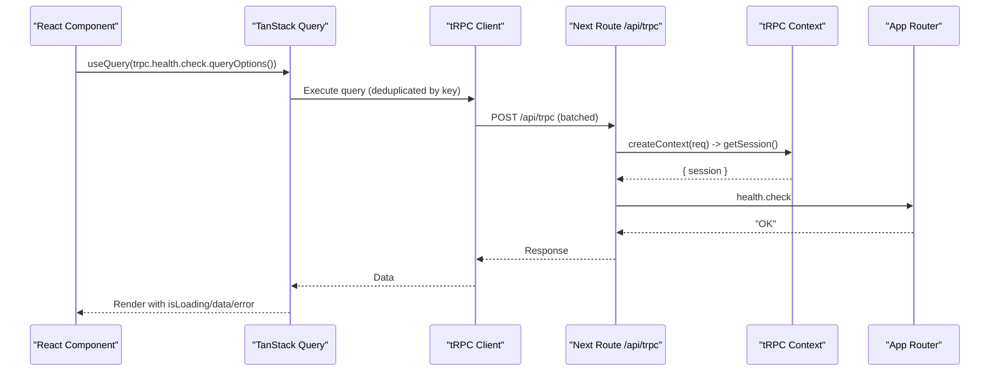
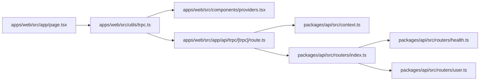

# Server State with TanStack Query

<cite>
**Referenced Files in This Document**
- [trpc.ts](file://apps/web/src/utils/trpc.ts)
- [providers.tsx](file://apps/web/src/components/providers.tsx)
- [route.ts](file://apps/web/src/app/api/trpc/[trpc]/route.ts)
- [index.ts (routers)](file://packages/api/src/routers/index.ts)
- [health.ts](file://packages/api/src/routers/health.ts)
- [user.ts](file://packages/api/src/routers/user.ts)
- [index.ts (api core)](file://packages/api/src/index.ts)
- [context.ts](file://packages/api/src/context.ts)
- [page.tsx (home)](file://apps/web/src/app/page.tsx)
- [auth.tsx](file://apps/web/src/components/auth.tsx)
</cite>

## Table of Contents

1. Introduction
2. Project Structure
3. Core Components
4. Architecture Overview
5. Detailed Component Analysis
6. Dependency Analysis
7. Performance Considerations
8. Troubleshooting Guide
9. Conclusion

## Introduction

This document explains how server state is managed in the application using TanStack Query integrated with tRPC. It covers query configuration, caching strategies, data fetching patterns, optimistic updates, cache invalidation, background refetching, type-safe API calls, error handling, loading states, and performance optimizations such as request deduplication. It also documents mutation patterns for data modifications, real-time synchronization approaches, authentication integration, and common patterns like infinite queries, pagination, and conditional fetching based on user permissions.

## Project Structure

The client-side setup centers around a shared TanStack Query client and a tRPC client that are provided to the React tree. The server exposes a tRPC endpoint that wires into an app router composed from feature routers. Protected procedures enforce authentication via middleware.

**Diagram sources**

- [providers.tsx:11-24](file://apps/web/src/components/providers.tsx#L11-L24)
- [trpc.ts:7-39](file://apps/web/src/utils/trpc.ts#L7-L39)
- [route.ts:6-12](file://apps/web/src/app/api/trpc/[trpc]/route.ts#L6-L12)
- [index.ts (routers):5-8](file://packages/api/src/routers/index.ts#L5-L8)
- [context.ts:4-11](file://packages/api/src/context.ts#L4-L11)

**Section sources**

- [providers.tsx:11-24](file://apps/web/src/components/providers.tsx#L11-L24)
- [trpc.ts:7-39](file://apps/web/src/utils/trpc.ts#L7-L39)
- [route.ts:6-12](file://apps/web/src/app/api/trpc/[trpc]/route.ts#L6-L12)
- [index.ts (routers):5-8](file://packages/api/src/routers/index.ts#L5-L8)
- [context.ts:4-11](file://packages/api/src/context.ts#L4-L11)

## Core Components

- QueryClient and QueryCache: Centralized caching and global error handling with retry actions.
- tRPC client: HTTP batch link configured to include credentials for session-based auth.
- Providers: Wraps the app with QueryClientProvider so all components can use TanStack Query hooks.
- App Router: Composed routers exposing public and protected endpoints.
- Context: Resolves the current session per request for authorization.

Key responsibilities:

- Global error notifications and retry UX via QueryCache onError.
- Type-safe client accessors generated from the server router types.
- Session propagation from Next.js request to tRPC context for protected routes.

**Section sources**

- [trpc.ts:7-39](file://apps/web/src/utils/trpc.ts#L7-L39)
- [providers.tsx:11-24](file://apps/web/src/components/providers.tsx#L11-L24)
- [index.ts (routers):5-8](file://packages/api/src/routers/index.ts#L5-L8)
- [index.ts (api core):11-25](file://packages/api/src/index.ts#L11-L25)
- [context.ts:4-11](file://packages/api/src/context.ts#L4-L11)

## Architecture Overview

End-to-end flow from component to server and back, including authentication and caching.

**Diagram sources**

- [page.tsx (home):8-10](file://apps/web/src/app/page.tsx#L8-L10)
- [trpc.ts:22-34](file://apps/web/src/utils/trpc.ts#L22-L34)
- [route.ts:6-12](file://apps/web/src/app/api/trpc/[trpc]/route.ts#L6-L12)
- [context.ts:4-11](file://packages/api/src/context.ts#L4-L11)
- [health.ts:3-5](file://packages/api/src/routers/health.ts#L3-L5)

## Detailed Component Analysis

### QueryClient and Error Handling

- A single QueryClient instance is created with a custom QueryCache that surfaces errors via toast notifications and offers a retry action that invalidates the failing query.
- This provides consistent UX for transient network or server errors without manual try/catch in every component.

Practical implications:

- Errors bubble up to the global handler; components remain simple.
- Users can retry failed queries directly from the notification.

**Section sources**

- [trpc.ts:7-20](file://apps/web/src/utils/trpc.ts#L7-L20)

### tRPC Client Configuration

- Uses httpBatchLink to group multiple requests into a single HTTP call, reducing overhead.
- Credentials are included to support session cookies across requests.
- The client is typed against the server’s AppRouter for full end-to-end type safety.

Performance notes:

- Batching reduces round trips when multiple queries/mutations run together.
- Deduplication is handled by TanStack Query based on query keys.

**Section sources**

- [trpc.ts:22-34](file://apps/web/src/utils/trpc.ts#L22-L34)

### Providers and Application Bootstrap

- QueryClientProvider wraps the app with the shared QueryClient instance.
- Ensures all components have access to TanStack Query hooks and global cache.

**Section sources**

- [providers.tsx:11-24](file://apps/web/src/components/providers.tsx#L11-L24)

### Server-Side tRPC Endpoint and Context

- The Next.js route handles GET/POST at /api/trpc and delegates to fetchRequestHandler.
- Context resolves the session from the incoming request headers, enabling protected procedures to read ctx.session.

Security note:

- All mutations should be guarded by protectedProcedure to ensure authentication.

**Section sources**

- [route.ts:6-12](file://apps/web/src/app/api/trpc/[trpc]/route.ts#L6-L12)
- [context.ts:4-11](file://packages/api/src/context.ts#L4-L11)

### App Router Composition and Procedures

- The app router composes feature routers (health, user).
- Public procedures allow unauthenticated reads; protected procedures enforce authentication via middleware.

Example endpoints:

- Health check: public, returns a status string.
- User private data: protected, returns message and user info from session.

**Section sources**

- [index.ts (routers):5-8](file://packages/api/src/routers/index.ts#L5-L8)
- [health.ts:3-5](file://packages/api/src/routers/health.ts#L3-L5)
- [user.ts:3-7](file://packages/api/src/routers/user.ts#L3-L7)
- [index.ts (api core):11-25](file://packages/api/src/index.ts#L11-L25)

### Client-Side Query Usage and Loading States

- The home page demonstrates a type-safe query using trpc.health.check.queryOptions().
- Loading and success states are rendered conditionally based on query result flags.

Patterns shown:

- Use queryOptions to integrate seamlessly with TanStack Query.
- Leverage isLoading and data to drive UI states.

**Section sources**

- [page.tsx (home):8-10](file://apps/web/src/app/page.tsx#L8-L10)
- [page.tsx (home):18-31](file://apps/web/src/app/page.tsx#L18-L31)

### Authentication Integration

- Protected procedures rely on ctx.session resolved in context.
- The client uses credentials: include to send cookies with each request, enabling session-based auth.
- The login UI integrates with an auth client to sign in users and redirect after successful authentication.

Best practices:

- Always gate sensitive operations behind protectedProcedure.
- Ensure credentials are sent with requests to maintain sessions.

**Section sources**

- [context.ts:4-11](file://packages/api/src/context.ts#L4-L11)
- [trpc.ts:24-31](file://apps/web/src/utils/trpc.ts#L24-L31)
- [auth.tsx:9-20](file://apps/web/src/components/auth.tsx#L9-L20)

## Dependency Analysis

High-level dependencies between client and server modules:

**Diagram sources**

- [page.tsx (home):8-10](file://apps/web/src/app/page.tsx#L8-L10)
- [trpc.ts:22-39](file://apps/web/src/utils/trpc.ts#L22-L39)
- [providers.tsx:11-24](file://apps/web/src/components/providers.tsx#L11-L24)
- [route.ts:6-12](file://apps/web/src/app/api/trpc/[trpc]/route.ts#L6-L12)
- [context.ts:4-11](file://packages/api/src/context.ts#L4-L11)
- [index.ts (routers):5-8](file://packages/api/src/routers/index.ts#L5-L8)
- [health.ts:3-5](file://packages/api/src/routers/health.ts#L3-L5)
- [user.ts:3-7](file://packages/api/src/routers/user.ts#L3-L7)

**Section sources**

- [trpc.ts:22-39](file://apps/web/src/utils/trpc.ts#L22-L39)
- [route.ts:6-12](file://apps/web/src/app/api/trpc/[trpc]/route.ts#L6-L12)
- [index.ts (routers):5-8](file://packages/api/src/routers/index.ts#L5-L8)

## Performance Considerations

- Request deduplication: TanStack Query deduplicates identical queries by key within the same client instance, preventing duplicate network calls.
- Batching: httpBatchLink groups multiple tRPC calls into one HTTP request, reducing latency and overhead.
- Background refetching: Configure staleTime and refetchInterval on queries to keep data fresh without blocking UI.
- Conditional fetching: Disable queries when required inputs are missing to avoid unnecessary requests.
- Optimistic updates: Update local cache immediately on mutation triggers and revert on error to improve perceived performance.
- Cache invalidation: Invalidate affected queries after successful mutations to keep UI in sync with server state.

[No sources needed since this section provides general guidance]

## Troubleshooting Guide

Common issues and resolutions:

- Network or server errors: Global QueryCache onError shows a toast with a retry action that invalidates the failing query.
- Missing credentials: Ensure credentials: include is set on the fetch wrapper to persist sessions across requests.
- Unauthorized access: Verify that protectedProcedure enforces authentication and that ctx.session is available in context.
- Stale data: Use invalidateQueries or invalidateTag after mutations to refresh dependent queries.

Actionable references:

- Global error handling and retry action are implemented in the QueryCache configuration.
- Credentials inclusion is configured in the tRPC client link.
- Protected procedure enforcement is defined in the tRPC core setup.

**Section sources**

- [trpc.ts:7-20](file://apps/web/src/utils/trpc.ts#L7-L20)
- [trpc.ts:24-31](file://apps/web/src/utils/trpc.ts#L24-L31)
- [index.ts (api core):11-25](file://packages/api/src/index.ts#L11-L25)

## Conclusion

This codebase establishes a robust foundation for server state management using TanStack Query and tRPC. The centralized QueryClient and tRPC client provide type-safe, cached, and batched data access. Protected procedures ensure secure access to sensitive data, while global error handling improves resilience. By leveraging caching strategies, background refetching, optimistic updates, and cache invalidation, the application delivers responsive and reliable user experiences. Extend these patterns to implement infinite queries, pagination, and real-time synchronization as your needs evolve.
