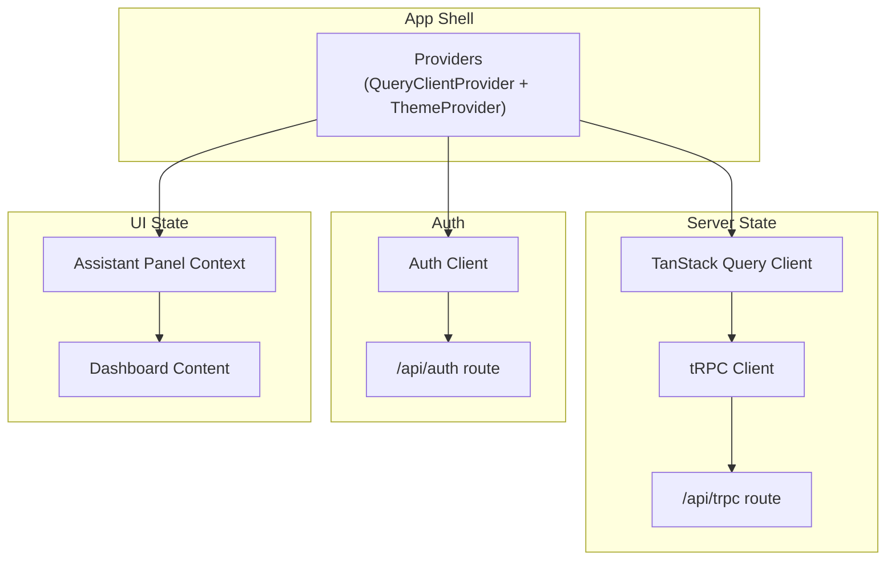
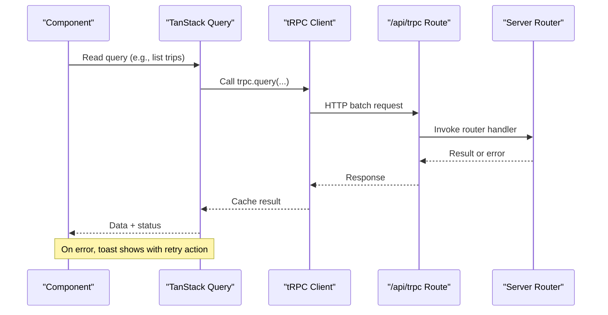
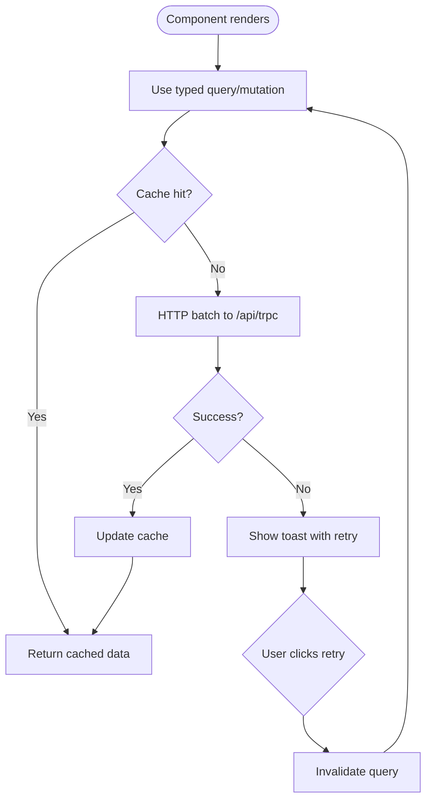
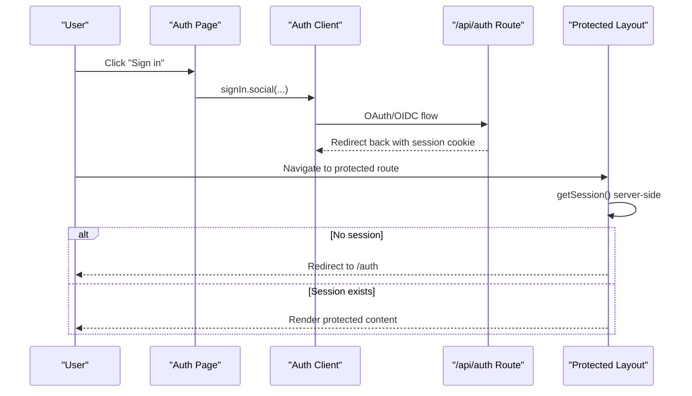
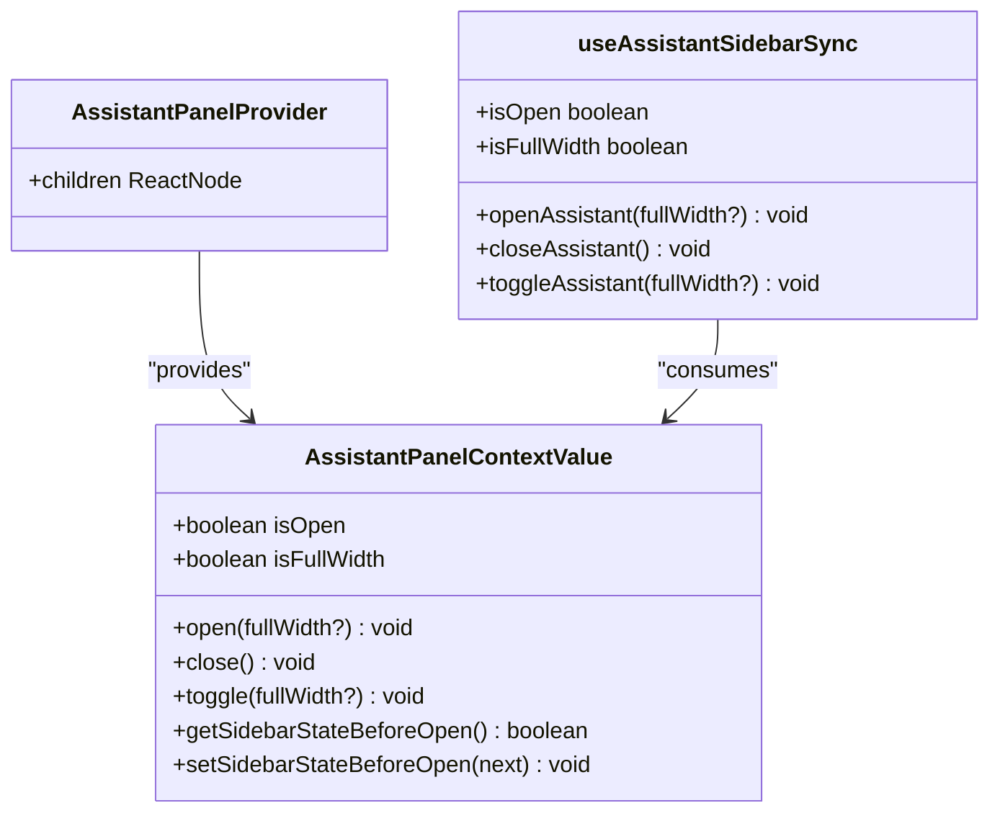
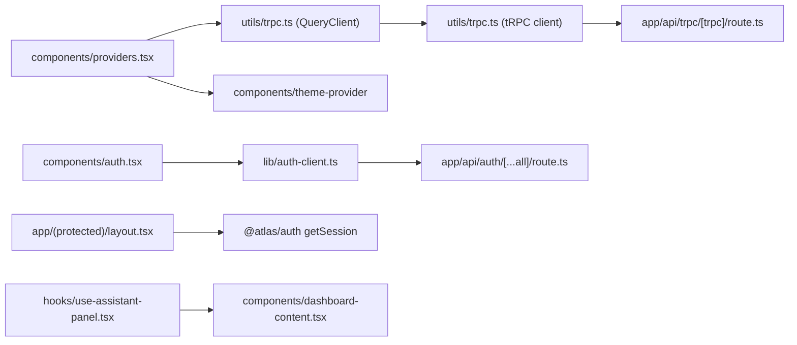

# State Management and Data Flow

<cite>
**Referenced Files in This Document**
- [providers.tsx](file://apps/web/src/components/providers.tsx)
- [trpc.ts](file://apps/web/src/utils/trpc.ts)
- [auth-client.ts](file://apps/web/src/lib/auth-client.ts)
- [route.ts (tRPC)](file://apps/web/src/app/api/trpc/[trpc]/route.ts)
- [route.ts (Auth)](file://apps/web/src/app/api/auth/[...all]/route.ts)
- [auth.tsx](file://apps/web/src/components/auth.tsx)
- [layout.tsx (Protected)](file://apps/web/src/app/(protected)/layout.tsx)
- [use-assistant-panel.tsx](file://apps/web/src/hooks/use-assistant-panel.tsx)
- [dashboard-content.tsx](file://apps/web/src/components/dashboard-content.tsx)
</cite>

## Table of Contents

1. [Introduction](#introduction)
2. [Project Structure](#project-structure)
3. [Core Components](#core-components)
4. [Architecture Overview](#architecture-overview)
5. [Detailed Component Analysis](#detailed-component-analysis)
6. [Dependency Analysis](#dependency-analysis)
7. [Performance Considerations](#performance-considerations)
8. [Troubleshooting Guide](#troubleshooting-guide)
9. [Conclusion](#conclusion)

## Introduction

This document explains the client-side state management and data fetching architecture in the web application. It covers:

- Global UI state via React Context
- Local component state via custom hooks
- Server state management with TanStack Query
- Type-safe API calls using tRPC
- Authentication state and session handling
- Error handling, loading states, and performance optimizations such as query deduplication and background refetching

The goal is to provide a clear mental model for how state flows through the app and how server data is fetched, cached, and updated.

## Project Structure

At a high level:

- Providers wrap the app with TanStack Query and theme context.
- tRPC client and QueryClient are configured centrally and shared across components.
- Authentication uses a dedicated client that integrates with Better Auth and Telegram OIDC.
- Protected routes enforce server-side session checks before rendering.
- A React Context-based assistant panel manages local UI state and persists it to localStorage.

**Diagram sources**

- [providers.tsx:11-24](file://apps/web/src/components/providers.tsx#L11-L24)
- [trpc.ts:7-39](file://apps/web/src/utils/trpc.ts#L7-L39)
- [route.ts (tRPC):6-13](file://apps/web/src/app/api/trpc/[trpc]/route.ts#L6-L13)
- [route.ts (Auth):4-5](file://apps/web/src/app/api/auth/[...all]/route.ts#L4-L5)
- [use-assistant-panel.tsx:63-150](file://apps/web/src/hooks/use-assistant-panel.tsx#L63-L150)
- [dashboard-content.tsx:5-17](file://apps/web/src/components/dashboard-content.tsx#L5-L17)

**Section sources**

- [providers.tsx:11-24](file://apps/web/src/components/providers.tsx#L11-L24)
- [trpc.ts:7-39](file://apps/web/src/utils/trpc.ts#L7-L39)
- [auth-client.ts:5-7](file://apps/web/src/lib/auth-client.ts#L5-L7)
- [route.ts (tRPC):6-13](file://apps/web/src/app/api/trpc/[trpc]/route.ts#L6-L13)
- [route.ts (Auth):4-5](file://apps/web/src/app/api/auth/[...all]/route.ts#L4-L5)
- [use-assistant-panel.tsx:63-150](file://apps/web/src/hooks/use-assistant-panel.tsx#L63-L150)
- [dashboard-content.tsx:5-17](file://apps/web/src/components/dashboard-content.tsx#L5-L17)

## Core Components

- Providers: Wraps the app with TanStack Query’s QueryClientProvider and theme provider, enabling global caching and UI theming.
- tRPC setup: Centralized creation of QueryClient, tRPC client, and options proxy; includes error toast and retry action.
- Auth client: Configures Better Auth with Telegram plugin and last login method tracking.
- Protected layout: Enforces authentication by checking the server session and redirecting unauthenticated users.
- Assistant panel: React Context managing open/close/full-width state with localStorage persistence and sidebar coordination.

Key responsibilities:

- Global server state caching and error handling via TanStack Query.
- Type-safe API access via tRPC.
- Session enforcement on protected routes.
- Local UI state persistence and cross-component coordination.

**Section sources**

- [providers.tsx:11-24](file://apps/web/src/components/providers.tsx#L11-L24)
- [trpc.ts:7-39](file://apps/web/src/utils/trpc.ts#L7-L39)
- [auth-client.ts:5-7](file://apps/web/src/lib/auth-client.ts#L5-L7)
- [layout.tsx (Protected):22-33](<file://apps/web/src/app/(protected)/layout.tsx#L22-L33>)
- [use-assistant-panel.tsx:63-150](file://apps/web/src/hooks/use-assistant-panel.tsx#L63-L150)

## Architecture Overview

The data flow combines server state caching with type-safe API calls and robust error handling:

**Diagram sources**

- [trpc.ts:7-39](file://apps/web/src/utils/trpc.ts#L7-L39)
- [route.ts (tRPC):6-13](file://apps/web/src/app/api/trpc/[trpc]/route.ts#L6-L13)

**Section sources**

- [trpc.ts:7-39](file://apps/web/src/utils/trpc.ts#L7-L39)
- [route.ts (tRPC):6-13](file://apps/web/src/app/api/trpc/[trpc]/route.ts#L6-L13)

## Detailed Component Analysis

### TanStack Query and tRPC Integration

- QueryClient is created with a custom QueryCache that displays an error toast with a “retry” action that invalidates the failing query.
- tRPC client uses httpBatchLink to /api/trpc with credentials included for session cookies.
- An options proxy binds the tRPC client to the QueryClient, enabling typed queries/mutations with automatic cache integration.

**Diagram sources**

- [trpc.ts:7-39](file://apps/web/src/utils/trpc.ts#L7-L39)

**Section sources**

- [trpc.ts:7-39](file://apps/web/src/utils/trpc.ts#L7-L39)

### Authentication State and Session Handling

- The auth client initializes Better Auth with plugins for Telegram and last login method tracking.
- The public auth page uses the client to sign in via social providers and redirects after successful login.
- The protected layout performs a server-side session check and redirects unauthenticated users to the auth page.

**Diagram sources**

- [auth.tsx:9-20](file://apps/web/src/components/auth.tsx#L9-L20)
- [auth-client.ts:5-7](file://apps/web/src/lib/auth-client.ts#L5-L7)
- [route.ts (Auth):4-5](file://apps/web/src/app/api/auth/[...all]/route.ts#L4-L5)
- [layout.tsx (Protected):22-33](<file://apps/web/src/app/(protected)/layout.tsx#L22-L33>)

**Section sources**

- [auth.tsx:9-20](file://apps/web/src/components/auth.tsx#L9-L20)
- [auth-client.ts:5-7](file://apps/web/src/lib/auth-client.ts#L5-L7)
- [route.ts (Auth):4-5](file://apps/web/src/app/api/auth/[...all]/route.ts#L4-L5)
- [layout.tsx (Protected):22-33](<file://apps/web/src/app/(protected)/layout.tsx#L22-L33>)

### Local UI State with React Context

- The assistant panel provides a Context with open/close/toggle methods and full-width mode.
- State is persisted to localStorage so it survives navigation.
- A helper hook coordinates the panel with the app sidebar, collapsing/expanding as needed and restoring previous sidebar state.

**Diagram sources**

- [use-assistant-panel.tsx:20-28](file://apps/web/src/hooks/use-assistant-panel.tsx#L20-L28)
- [use-assistant-panel.tsx:63-150](file://apps/web/src/hooks/use-assistant-panel.tsx#L63-L150)
- [use-assistant-panel.tsx:169-234](file://apps/web/src/hooks/use-assistant-panel.tsx#L169-L234)

**Section sources**

- [use-assistant-panel.tsx:63-150](file://apps/web/src/hooks/use-assistant-panel.tsx#L63-L150)
- [use-assistant-panel.tsx:169-234](file://apps/web/src/hooks/use-assistant-panel.tsx#L169-L234)
- [dashboard-content.tsx:5-17](file://apps/web/src/components/dashboard-content.tsx#L5-L17)

### Loading States and Suspense

- Pages wrap their content in Suspense with a fallback to indicate loading while async boundaries resolve.
- This complements TanStack Query’s built-in loading states for data fetching.

**Section sources**

- [page.tsx (Trips):11-29](<file://apps/web/src/app/(protected)/trips/page.tsx#L11-L29>)
- [page.tsx (Bookings):11-29](<file://apps/web/src/app/(protected)/bookings/page.tsx#L11-L29>)
- [page.tsx (Activity):11-29](<file://apps/web/src/app/(protected)/activity/page.tsx#L11-L29>)

## Dependency Analysis

The following diagram maps key runtime dependencies between modules:

**Diagram sources**

- [providers.tsx:11-24](file://apps/web/src/components/providers.tsx#L11-L24)
- [trpc.ts:7-39](file://apps/web/src/utils/trpc.ts#L7-L39)
- [route.ts (tRPC):6-13](file://apps/web/src/app/api/trpc/[trpc]/route.ts#L6-L13)
- [auth.tsx:9-20](file://apps/web/src/components/auth.tsx#L9-L20)
- [auth-client.ts:5-7](file://apps/web/src/lib/auth-client.ts#L5-L7)
- [route.ts (Auth):4-5](file://apps/web/src/app/api/auth/[...all]/route.ts#L4-L5)
- [layout.tsx (Protected):22-33](<file://apps/web/src/app/(protected)/layout.tsx#L22-L33>)
- [use-assistant-panel.tsx:63-150](file://apps/web/src/hooks/use-assistant-panel.tsx#L63-L150)
- [dashboard-content.tsx:5-17](file://apps/web/src/components/dashboard-content.tsx#L5-L17)

**Section sources**

- [providers.tsx:11-24](file://apps/web/src/components/providers.tsx#L11-L24)
- [trpc.ts:7-39](file://apps/web/src/utils/trpc.ts#L7-L39)
- [route.ts (tRPC):6-13](file://apps/web/src/app/api/trpc/[trpc]/route.ts#L6-L13)
- [auth.tsx:9-20](file://apps/web/src/components/auth.tsx#L9-L20)
- [auth-client.ts:5-7](file://apps/web/src/lib/auth-client.ts#L5-L7)
- [route.ts (Auth):4-5](file://apps/web/src/app/api/auth/[...all]/route.ts#L4-L5)
- [layout.tsx (Protected):22-33](<file://apps/web/src/app/(protected)/layout.tsx#L22-L33>)
- [use-assistant-panel.tsx:63-150](file://apps/web/src/hooks/use-assistant-panel.tsx#L63-L150)
- [dashboard-content.tsx:5-17](file://apps/web/src/components/dashboard-content.tsx#L5-L17)

## Performance Considerations

- Query deduplication: TanStack Query automatically deduplicates identical concurrent requests, reducing network load.
- Background refetching: Queries can be configured to refetch in the background when they become stale, keeping UI fresh without manual intervention.
- Batched requests: tRPC’s httpBatchLink groups multiple calls into a single HTTP request, lowering overhead.
- Credentials handling: Including credentials ensures session cookies are sent with each request, avoiding repeated auth handshakes.
- UI responsiveness: Local UI state (assistant panel) is kept in memory and persisted only when necessary, minimizing re-renders and storage writes.

[No sources needed since this section provides general guidance]

## Troubleshooting Guide

- Network or server errors: When a query fails, a toast appears with a “retry” action that invalidates the failed query, allowing the user to re-run the operation.
- Authentication issues: If a protected route cannot find a session, the user is redirected to the auth page. Ensure cookies are enabled and the session endpoint is reachable.
- Storage limitations: Assistant panel state persists to localStorage; if unavailable (e.g., private browsing), state remains in-memory only and will not survive navigation.

**Section sources**

- [trpc.ts:7-19](file://apps/web/src/utils/trpc.ts#L7-L19)
- [layout.tsx (Protected):22-33](<file://apps/web/src/app/(protected)/layout.tsx#L22-L33>)
- [use-assistant-panel.tsx:34-61](file://apps/web/src/hooks/use-assistant-panel.tsx#L34-L61)

## Conclusion

The application combines:

- TanStack Query for robust server state caching, deduplication, and background updates
- tRPC for type-safe API calls integrated with the query cache
- Better Auth for session management with server-side protection on routes
- React Context for cohesive local UI state with persistence and cross-component coordination

This architecture delivers a responsive, reliable user experience with clear separation between global UI state, local component state, and server state.

[No sources needed since this section summarizes without analyzing specific files]
