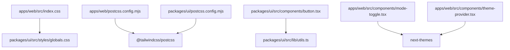
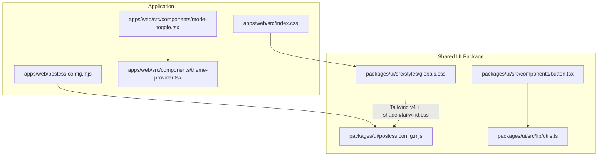
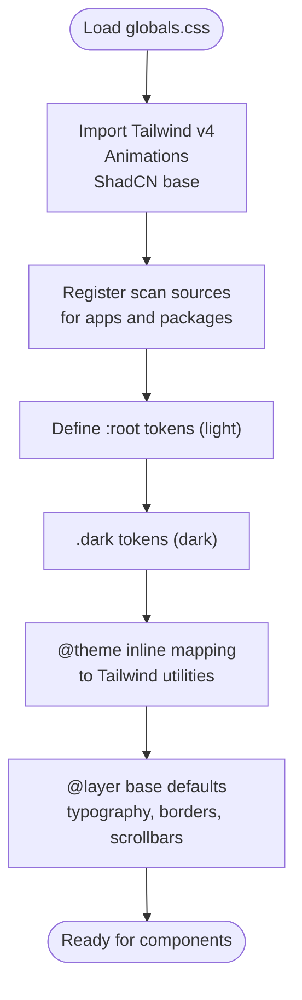
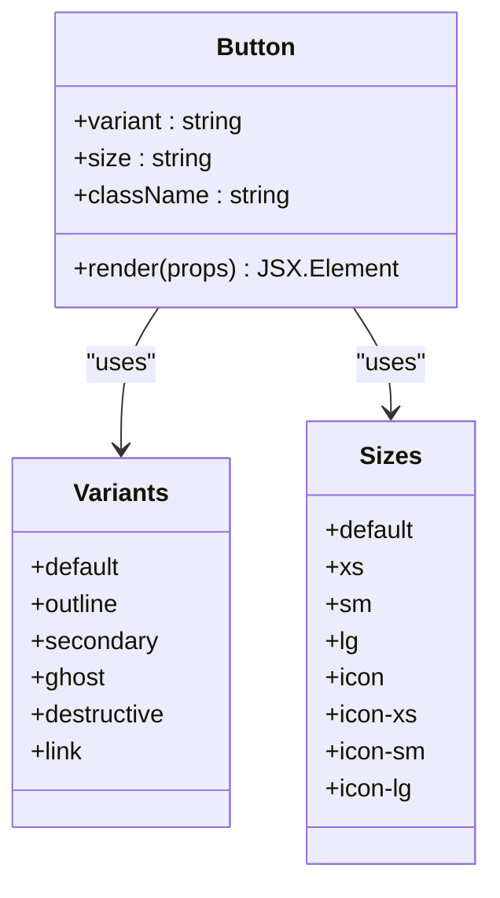
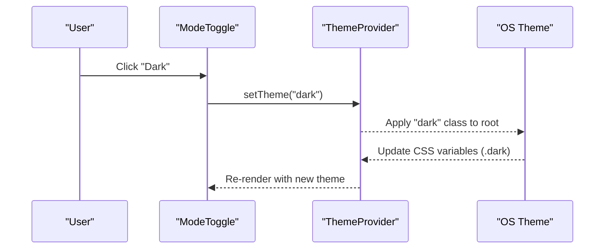
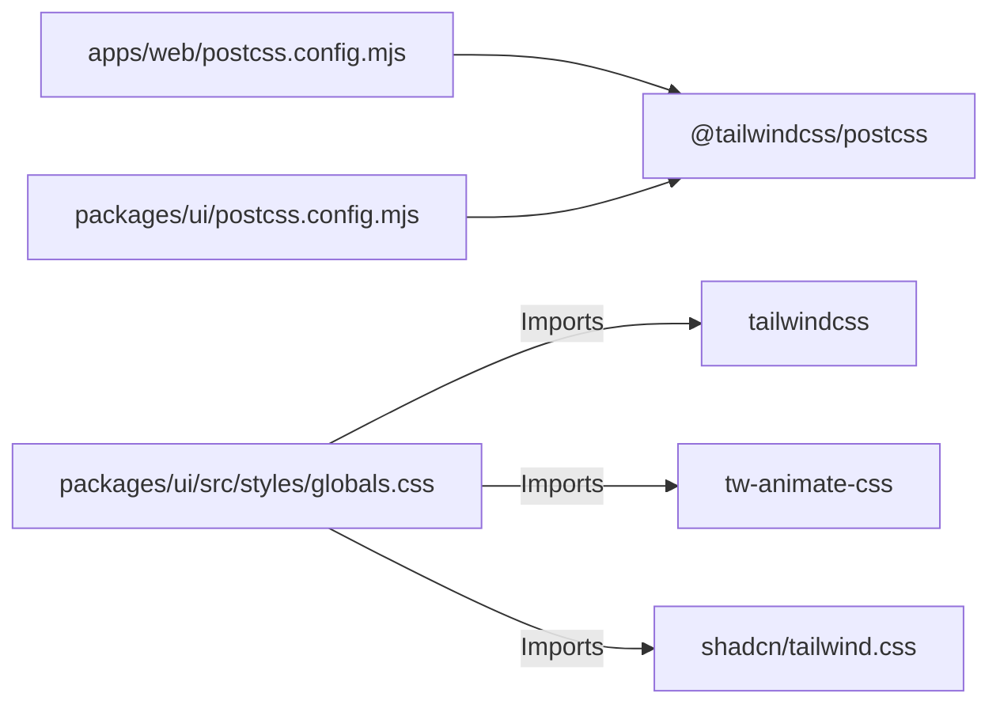

# Styling System and Design Tokens

<cite>
**Referenced Files in This Document**
- [apps/web/src/index.css](file://apps/web/src/index.css)
- [apps/web/postcss.config.mjs](file://apps/web/postcss.config.mjs)
- [apps/web/components.json](file://apps/web/components.json)
- [packages/ui/src/styles/globals.css](file://packages/ui/src/styles/globals.css)
- [packages/ui/package.json](file://packages/ui/package.json)
- [packages/ui/postcss.config.mjs](file://packages/ui/postcss.config.mjs)
- [packages/ui/src/lib/utils.ts](file://packages/ui/src/lib/utils.ts)
- [packages/ui/src/components/button.tsx](file://packages/ui/src/components/button.tsx)
- [apps/web/src/components/theme-provider.tsx](file://apps/web/src/components/theme-provider.tsx)
- [apps/web/src/components/mode-toggle.tsx](file://apps/web/src/components/mode-toggle.tsx)
</cite>

## Table of Contents

1. Introduction
2. Project Structure
3. Core Components
4. Architecture Overview
5. Detailed Component Analysis
6. Dependency Analysis
7. Performance Considerations
8. Troubleshooting Guide
9. Conclusion

## Introduction

This document explains the styling system centered on Tailwind CSS v4 integration and a design system implementation using semantic tokens, utility-first CSS, and a shared UI component library. It covers theme configuration via CSS variables, responsive patterns, dark mode, animations, accessibility, and performance considerations such as purging and bundle size optimization.

## Project Structure

The styling system is split across two layers:

- Application layer (apps/web): imports global styles from the shared UI package and configures PostCSS to use Tailwind v4.
- Shared UI package (packages/ui): centralizes Tailwind v4 setup, design tokens, base styles, dark mode, and reusable components that consume semantic tokens.

**Diagram sources**

- [apps/web/src/index.css:1-2](file://apps/web/src/index.css#L1-L2)
- [apps/web/postcss.config.mjs:1-5](file://apps/web/postcss.config.mjs#L1-L5)
- [packages/ui/postcss.config.mjs:1-6](file://packages/ui/postcss.config.mjs#L1-L6)
- [packages/ui/src/styles/globals.css:1-6](file://packages/ui/src/styles/globals.css#L1-L6)
- [packages/ui/src/components/button.tsx:1-5](file://packages/ui/src/components/button.tsx#L1-L5)
- [packages/ui/src/lib/utils.ts:1-6](file://packages/ui/src/lib/utils.ts#L1-L6)
- [apps/web/src/components/mode-toggle.tsx:1-12](file://apps/web/src/components/mode-toggle.tsx#L1-L12)
- [apps/web/src/components/theme-provider.tsx:1-11](file://apps/web/src/components/theme-provider.tsx#L1-L11)

**Section sources**

- [apps/web/src/index.css:1-2](file://apps/web/src/index.css#L1-L2)
- [apps/web/postcss.config.mjs:1-5](file://apps/web/postcss.config.mjs#L1-L5)
- [packages/ui/postcss.config.mjs:1-6](file://packages/ui/postcss.config.mjs#L1-L6)
- [packages/ui/src/styles/globals.css:1-6](file://packages/ui/src/styles/globals.css#L1-L6)

## Core Components

- Global styles entry point: The application imports the shared globals to bootstrap Tailwind v4, animations, and ShadCN base styles.
- Shared globals: Define light/dark tokens via CSS variables, map them into Tailwind’s theme with @theme inline, set base typography and border defaults, and register custom variants and source scanning for utilities.
- Utility composition helper: A small utility merges class names deterministically to avoid conflicts when composing variants and conditional classes.
- Button component: Demonstrates variant/size composition using class-variance-authority and semantic tokens; integrates focus rings, disabled states, and icon sizing rules.
- Theme provider and toggle: Provide runtime theme switching (light/dark/system) using next-themes, driving the .dark class and token overrides.

Key responsibilities:

- Centralize tokens and base styles in packages/ui/src/styles/globals.css.
- Keep app-level imports minimal by delegating to the shared package.
- Compose component styles through semantic tokens and utility-first patterns.

**Section sources**

- [apps/web/src/index.css:1-2](file://apps/web/src/index.css#L1-L2)
- [packages/ui/src/styles/globals.css:1-140](file://packages/ui/src/styles/globals.css#L1-L140)
- [packages/ui/src/lib/utils.ts:1-6](file://packages/ui/src/lib/utils.ts#L1-L6)
- [packages/ui/src/components/button.tsx:1-58](file://packages/ui/src/components/button.tsx#L1-L58)
- [apps/web/src/components/theme-provider.tsx:1-11](file://apps/web/src/components/theme-provider.tsx#L1-L11)
- [apps/web/src/components/mode-toggle.tsx:1-37](file://apps/web/src/components/mode-toggle.tsx#L1-L37)

## Architecture Overview

The architecture follows a layered approach:

- App layer imports shared globals and uses PostCSS with Tailwind v4 plugin.
- Shared UI package defines tokens, base styles, and components that consume those tokens.
- Runtime theme switching toggles CSS variables via next-themes, which applies the .dark class to drive alternate token values.

**Diagram sources**

- [apps/web/src/index.css:1-2](file://apps/web/src/index.css#L1-L2)
- [apps/web/postcss.config.mjs:1-5](file://apps/web/postcss.config.mjs#L1-L5)
- [packages/ui/postcss.config.mjs:1-6](file://packages/ui/postcss.config.mjs#L1-L6)
- [packages/ui/src/styles/globals.css:1-6](file://packages/ui/src/styles/globals.css#L1-L6)
- [packages/ui/src/components/button.tsx:1-5](file://packages/ui/src/components/button.tsx#L1-L5)
- [packages/ui/src/lib/utils.ts:1-6](file://packages/ui/src/lib/utils.ts#L1-L6)
- [apps/web/src/components/mode-toggle.tsx:1-12](file://apps/web/src/components/mode-toggle.tsx#L1-L12)
- [apps/web/src/components/theme-provider.tsx:1-11](file://apps/web/src/components/theme-provider.tsx#L1-L11)

## Detailed Component Analysis

### Global Styles and Design Tokens

- Imports Tailwind v4, animation utilities, and ShadCN base styles.
- Declares source paths so Tailwind scans both apps and packages for class usage.
- Defines a custom dark variant scoped to descendants of .dark.
- Provides comprehensive light and dark tokens using OKLCH color space for consistent contrast and perceptual uniformity.
- Maps tokens to Tailwind theme via @theme inline for direct utility access (e.g., bg-primary, text-muted-foreground).
- Sets base layer defaults for borders, scrollbars, and typography.

**Diagram sources**

- [packages/ui/src/styles/globals.css:1-6](file://packages/ui/src/styles/globals.css#L1-L6)
- [packages/ui/src/styles/globals.css:7-7](file://packages/ui/src/styles/globals.css#L7-L7)
- [packages/ui/src/styles/globals.css:9-76](file://packages/ui/src/styles/globals.css#L9-L76)
- [packages/ui/src/styles/globals.css:78-119](file://packages/ui/src/styles/globals.css#L78-L119)
- [packages/ui/src/styles/globals.css:121-140](file://packages/ui/src/styles/globals.css#L121-L140)

**Section sources**

- [packages/ui/src/styles/globals.css:1-140](file://packages/ui/src/styles/globals.css#L1-L140)

### Button Component and Variant Composition

- Uses class-variance-authority to define variants (default, outline, secondary, ghost, destructive, link) and sizes (default, xs, sm, lg, icon variants).
- Leverages semantic tokens for colors, borders, and focus rings; includes accessible states like aria-invalid and disabled.
- Integrates icons with consistent sizing and pointer behavior.
- Merges user-provided className with generated variants via cn() to prevent conflicts.

**Diagram sources**

- [packages/ui/src/components/button.tsx:5-40](file://packages/ui/src/components/button.tsx#L5-L40)
- [packages/ui/src/components/button.tsx:42-55](file://packages/ui/src/components/button.tsx#L42-L55)

**Section sources**

- [packages/ui/src/components/button.tsx:1-58](file://packages/ui/src/components/button.tsx#L1-L58)
- [packages/ui/src/lib/utils.ts:1-6](file://packages/ui/src/lib/utils.ts#L1-L6)

### Theme Provider and Mode Toggle

- ThemeProvider wraps the app with next-themes to manage theme state and persist preferences.
- ModeToggle provides UI to switch between light, dark, and system themes, using semantic tokens and transitions for icons.

**Diagram sources**

- [apps/web/src/components/mode-toggle.tsx:13-35](file://apps/web/src/components/mode-toggle.tsx#L13-L35)
- [apps/web/src/components/theme-provider.tsx:6-11](file://apps/web/src/components/theme-provider.tsx#L6-L11)

**Section sources**

- [apps/web/src/components/mode-toggle.tsx:1-37](file://apps/web/src/components/mode-toggle.tsx#L1-L37)
- [apps/web/src/components/theme-provider.tsx:1-11](file://apps/web/src/components/theme-provider.tsx#L1-L11)

### Responsive Design Patterns

- Use Tailwind’s built-in responsive prefixes to adapt layouts across breakpoints.
- Prefer semantic tokens for spacing and sizing to maintain consistency.
- Combine with container queries or media-aware utilities where appropriate.

[No sources needed since this section provides general guidance]

### Custom CSS Utilities and Animations

- Animation utilities are imported via tw-animate-css for consistent motion primitives.
- Base layer sets default border and scrollbar behaviors for a clean baseline.
- Custom variant registration enables dark-mode scoping without manual selectors.

**Section sources**

- [packages/ui/src/styles/globals.css:1-8](file://packages/ui/src/styles/globals.css#L1-L8)
- [packages/ui/src/styles/globals.css:121-140](file://packages/ui/src/styles/globals.css#L121-L140)

### Integration with Shared UI Component Library

- The app imports the shared globals and relies on the package’s components for consistent styling.
- ShadCN configuration points to the shared CSS file and aliases for components and utils.

**Section sources**

- [apps/web/src/index.css:1-2](file://apps/web/src/index.css#L1-L2)
- [apps/web/components.json:1-26](file://apps/web/components.json#L1-L26)

## Dependency Analysis

Tailwind v4 is configured at both the app and package levels using the PostCSS plugin. The shared package centralizes tokens and base styles, while the app composes components that consume these tokens.

**Diagram sources**

- [apps/web/postcss.config.mjs:1-5](file://apps/web/postcss.config.mjs#L1-L5)
- [packages/ui/postcss.config.mjs:1-6](file://packages/ui/postcss.config.mjs#L1-L6)
- [packages/ui/src/styles/globals.css:1-3](file://packages/ui/src/styles/globals.css#L1-L3)

**Section sources**

- [apps/web/postcss.config.mjs:1-5](file://apps/web/postcss.config.mjs#L1-L5)
- [packages/ui/postcss.config.mjs:1-6](file://packages/ui/postcss.config.mjs#L1-L6)
- [packages/ui/src/styles/globals.css:1-6](file://packages/ui/src/styles/globals.css#L1-L6)

## Performance Considerations

- Purging and tree-shaking: Tailwind v4 automatically analyzes source files registered via @source to generate only used utilities. Ensure all relevant directories are scanned to avoid missing classes.
- Bundle size: Keep global imports minimal; rely on the shared package to centralize styles. Avoid adding ad-hoc CSS that duplicates utilities.
- Cross-browser compatibility: Use modern color spaces (OKLCH) supported by current browsers; provide fallbacks if targeting legacy environments.
- Animations: Prefer lightweight animation utilities from tw-animate-css to reduce custom CSS overhead.
- Class merging: Use cn() to merge classes deterministically and avoid redundant or conflicting utilities.

[No sources needed since this section provides general guidance]

## Troubleshooting Guide

- Missing utilities: Verify that @source paths include all directories containing class names. If a class is not generated, ensure it appears in scanned files.
- Dark mode not applying: Confirm that next-themes is wrapping the app and that the .dark class is applied to the root element. Check that tokens are defined under both :root and .dark.
- Conflicting classes: Use cn() to merge classes and resolve conflicts. Prefer semantic tokens over hard-coded colors to maintain consistency.
- Focus and accessibility: Ensure focus-visible rings are visible and that interactive elements have appropriate roles and labels.

**Section sources**

- [packages/ui/src/styles/globals.css:7-7](file://packages/ui/src/styles/globals.css#L7-L7)
- [packages/ui/src/styles/globals.css:9-76](file://packages/ui/src/styles/globals.css#L9-L76)
- [packages/ui/src/styles/globals.css:121-140](file://packages/ui/src/styles/globals.css#L121-L140)
- [apps/web/src/components/mode-toggle.tsx:13-35](file://apps/web/src/components/mode-toggle.tsx#L13-L35)
- [apps/web/src/components/theme-provider.tsx:6-11](file://apps/web/src/components/theme-provider.tsx#L6-L11)

## Conclusion

The styling system leverages Tailwind v4’s utility-first approach, centralized design tokens via CSS variables, and a shared UI component library to deliver a consistent, accessible, and performant interface. Semantic tokens enable easy theming and dark mode, while animations and base styles provide a solid foundation. Following the guidelines here ensures maintainability, scalability, and cross-browser compatibility.
