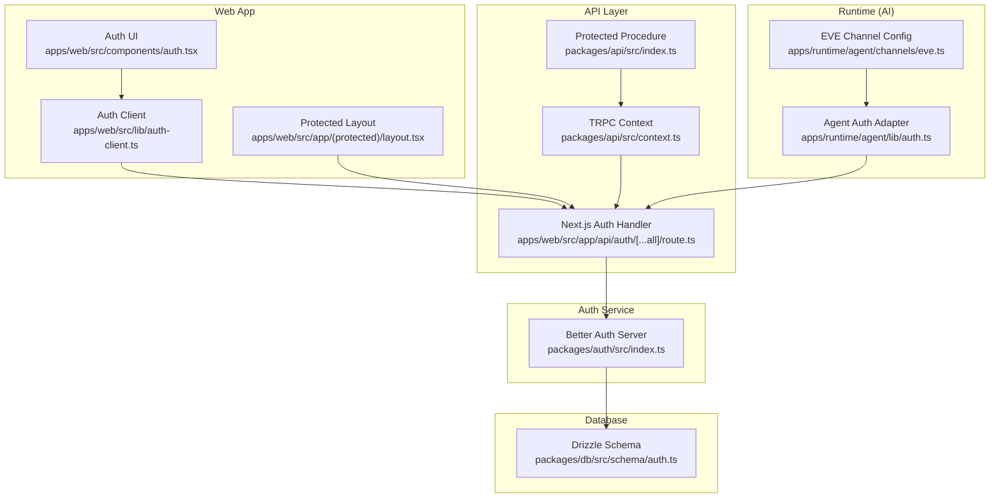
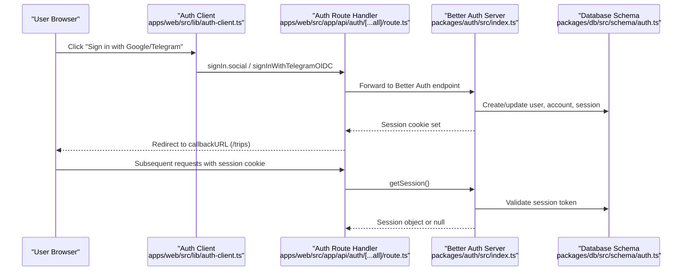
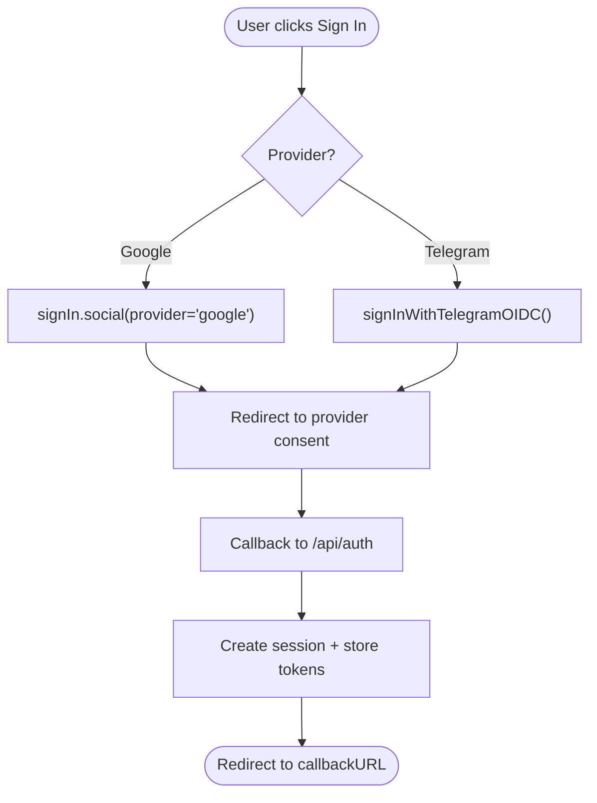
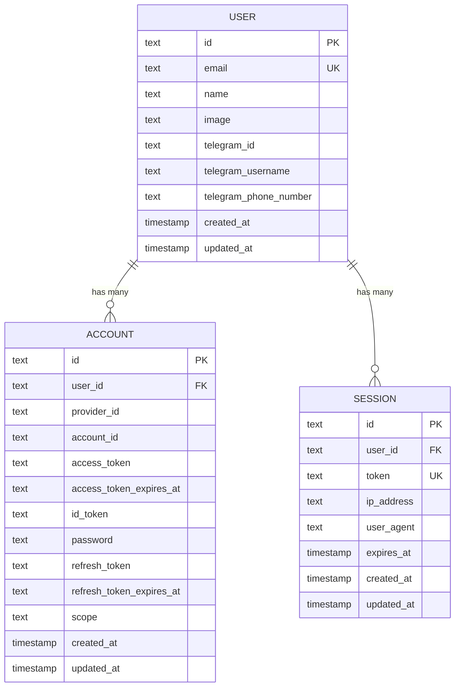
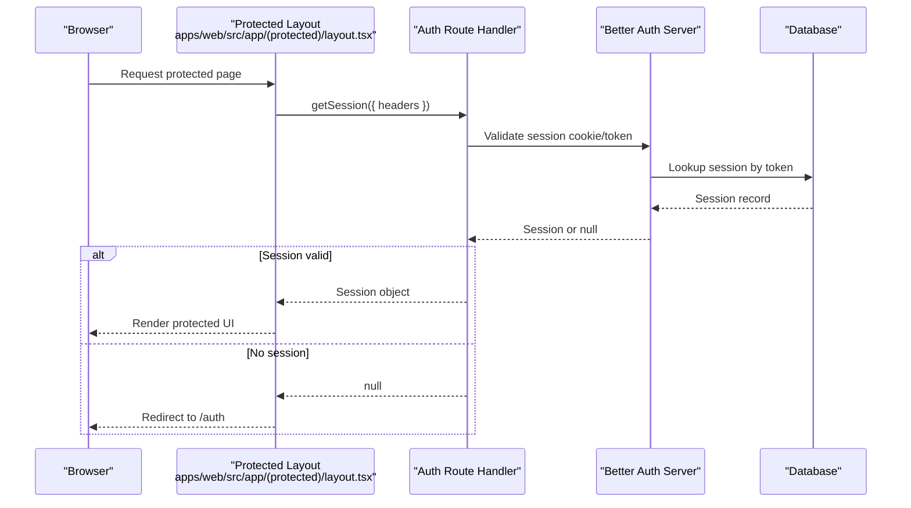
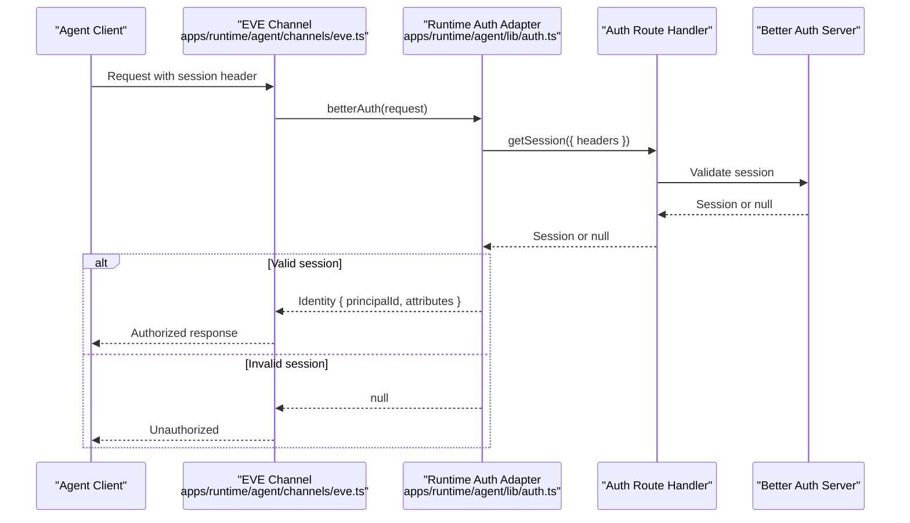
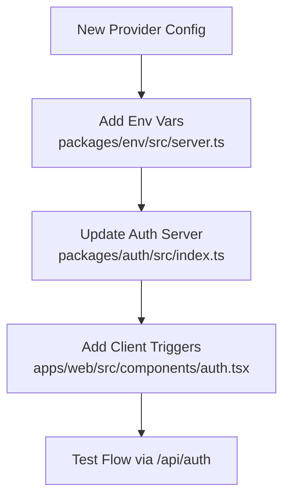
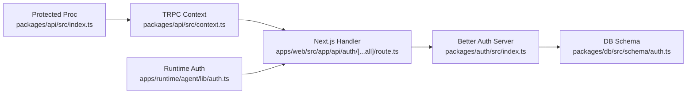

# Authentication Flows

<cite>
**Referenced Files in This Document**
- [packages/auth/src/index.ts](file://packages/auth/src/index.ts)
- [apps/web/src/app/api/auth/[...all]/route.ts](file://apps/web/src/app/api/auth/[...all]/route.ts)
- [apps/web/src/lib/auth-client.ts](file://apps/web/src/lib/auth-client.ts)
- [apps/web/src/components/auth.tsx](file://apps/web/src/components/auth.tsx)
- [apps/web/src/app/(protected)/layout.tsx](file://apps/web/src/app/(protected)/layout.tsx)
- [packages/db/src/schema/auth.ts](file://packages/db/src/schema/auth.ts)
- [packages/env/src/server.ts](file://packages/env/src/server.ts)
- [apps/runtime/agent/lib/auth.ts](file://apps/runtime/agent/lib/auth.ts)
- [apps/runtime/agent/channels/eve.ts](file://apps/runtime/agent/channels/eve.ts)
- [packages/api/src/context.ts](file://packages/api/src/context.ts)
- [packages/api/src/index.ts](file://packages/api/src/index.ts)
- [packages/api/src/routers/user.ts](file://packages/api/src/routers/user.ts)
</cite>

## Table of Contents

1. Introduction
2. Project Structure
3. Core Components
4. Architecture Overview
5. Detailed Component Analysis
6. Dependency Analysis
7. Performance Considerations
8. Troubleshooting Guide
9. Conclusion

## Introduction

This document explains the authentication flows in the Atlas system across multiple providers (Google, Telegram, and a custom provider via Better Auth). It covers OAuth2 flows, token management, session persistence, middleware for API routes and AI agent contexts, and guidance for adding new providers, refreshing tokens, and handling multi-provider scenarios with security best practices.

## Project Structure

Atlas implements authentication using Better Auth with:

- A server-side auth configuration that wires database schema, social providers, and plugins.
- A Next.js route handler exposing the standard Better Auth endpoints.
- A React client configured with Telegram OIDC and last login method tracking.
- Protected layouts and API procedures that validate sessions on each request.
- An AI runtime channel that validates sessions to authorize agent actions.

**Diagram sources**

- [packages/auth/src/index.ts:10-39](file://packages/auth/src/index.ts#L10-L39)
- [apps/web/src/app/api/auth/[...all]/route.ts:1-5](file://apps/web/src/app/api/auth/[...all]/route.ts#L1-L5)
- [apps/web/src/lib/auth-client.ts:1-7](file://apps/web/src/lib/auth-client.ts#L1-L7)
- [apps/web/src/components/auth.tsx:9-20](file://apps/web/src/components/auth.tsx#L9-L20)
- [apps/web/src/app/(protected)/layout.tsx:27-33](<file://apps/web/src/app/(protected)/layout.tsx#L27-L33>)
- [packages/db/src/schema/auth.ts:4-64](file://packages/db/src/schema/auth.ts#L4-L64)
- [apps/runtime/agent/lib/auth.ts:4-25](file://apps/runtime/agent/lib/auth.ts#L4-L25)
- [apps/runtime/agent/channels/eve.ts:6-9](file://apps/runtime/agent/channels/eve.ts#L6-L9)

**Section sources**

- [packages/auth/src/index.ts:10-39](file://packages/auth/src/index.ts#L10-L39)
- [apps/web/src/app/api/auth/[...all]/route.ts:1-5](file://apps/web/src/app/api/auth/[...all]/route.ts#L1-L5)
- [apps/web/src/lib/auth-client.ts:1-7](file://apps/web/src/lib/auth-client.ts#L1-L7)
- [apps/web/src/components/auth.tsx:9-20](file://apps/web/src/components/auth.tsx#L9-L20)
- [apps/web/src/app/(protected)/layout.tsx:27-33](<file://apps/web/src/app/(protected)/layout.tsx#L27-L33>)
- [packages/db/src/schema/auth.ts:4-64](file://packages/db/src/schema/auth.ts#L4-L64)
- [apps/runtime/agent/lib/auth.ts:4-25](file://apps/runtime/agent/lib/auth.ts#L4-L25)
- [apps/runtime/agent/channels/eve.ts:6-9](file://apps/runtime/agent/channels/eve.ts#L6-L9)

## Core Components

- Better Auth server configuration:
  - Initializes DB adapter with Drizzle schema.
  - Enables email/password, Google OAuth, and Telegram OIDC.
  - Uses nextCookies plugin for session cookies and lastLoginMethod plugin for UX.
- Next.js auth route handler:
  - Exposes all Better Auth endpoints under /api/auth.
- Web client:
  - Creates a Better Auth client with Telegram OIDC and last login method plugin.
  - Provides signIn methods for Google and Telegram.
- Protected layout:
  - Validates session server-side; redirects unauthenticated users to /auth.
- API context and protected procedures:
  - Extracts session from incoming requests and enforces authorization at procedure level.
- Runtime agent auth:
  - Validates session from agent requests and maps it to an EVE-compatible identity.

**Section sources**

- [packages/auth/src/index.ts:10-39](file://packages/auth/src/index.ts#L10-L39)
- [apps/web/src/app/api/auth/[...all]/route.ts:1-5](file://apps/web/src/app/api/auth/[...all]/route.ts#L1-L5)
- [apps/web/src/lib/auth-client.ts:1-7](file://apps/web/src/lib/auth-client.ts#L1-L7)
- [apps/web/src/components/auth.tsx:9-20](file://apps/web/src/components/auth.tsx#L9-L20)
- [apps/web/src/app/(protected)/layout.tsx:27-33](<file://apps/web/src/app/(protected)/layout.tsx#L27-L33>)
- [packages/api/src/context.ts:4-11](file://packages/api/src/context.ts#L4-L11)
- [packages/api/src/index.ts:11-25](file://packages/api/src/index.ts#L11-L25)
- [apps/runtime/agent/lib/auth.ts:4-25](file://apps/runtime/agent/lib/auth.ts#L4-L25)

## Architecture Overview

The flow spans browser-initiated sign-in, server-side validation, session storage, and subsequent protected access across web and runtime contexts.

**Diagram sources**

- [apps/web/src/lib/auth-client.ts:1-7](file://apps/web/src/lib/auth-client.ts#L1-L7)
- [apps/web/src/components/auth.tsx:9-20](file://apps/web/src/components/auth.tsx#L9-L20)
- [apps/web/src/app/api/auth/[...all]/route.ts:1-5](file://apps/web/src/app/api/auth/[...all]/route.ts#L1-L5)
- [packages/auth/src/index.ts:10-39](file://packages/auth/src/index.ts#L10-L39)
- [packages/db/src/schema/auth.ts:21-64](file://packages/db/src/schema/auth.ts#L21-L64)

## Detailed Component Analysis

### OAuth2/OIDC Providers: Google and Telegram

- Google OAuth:
  - Enabled via socialProviders.google with client credentials from environment variables.
  - Triggered from the UI by calling signIn.social with provider "google".
- Telegram OIDC:
  - Enabled via the telegram plugin with bot token and username.
  - Triggered from the UI by calling signInWithTelegramOIDC.
- Environment configuration:
  - Provider credentials and secrets are validated at startup via env schema.

**Diagram sources**

- [apps/web/src/components/auth.tsx:9-20](file://apps/web/src/components/auth.tsx#L9-L20)
- [packages/auth/src/index.ts:23-37](file://packages/auth/src/index.ts#L23-L37)
- [packages/env/src/server.ts:13-25](file://packages/env/src/server.ts#L13-L25)

**Section sources**

- [apps/web/src/components/auth.tsx:9-20](file://apps/web/src/components/auth.tsx#L9-L20)
- [packages/auth/src/index.ts:23-37](file://packages/auth/src/index.ts#L23-L37)
- [packages/env/src/server.ts:13-25](file://packages/env/src/server.ts#L13-L25)

### Token Management and Storage

- Account tokens:
  - Access tokens, refresh tokens, scopes, and expiry times are stored per provider in the account table.
- Session tokens:
  - Sessions are persisted with unique tokens, expiration timestamps, and user linkage.
- Cookie strategy:
  - nextCookies plugin manages session cookies; strategies include compact, JWT, and JWE for encryption.

**Diagram sources**

- [packages/db/src/schema/auth.ts:4-64](file://packages/db/src/schema/auth.ts#L4-L64)

**Section sources**

- [packages/db/src/schema/auth.ts:21-64](file://packages/db/src/schema/auth.ts#L21-L64)

### Session Persistence and Validation

- Server-side session validation:
  - Protected layout calls getSession with request headers to enforce authentication before rendering protected content.
- API-level validation:
  - TRPC context extracts session from incoming requests.
  - Protected procedures throw unauthorized errors when no session is present.

**Diagram sources**

- [apps/web/src/app/(protected)/layout.tsx:27-33](<file://apps/web/src/app/(protected)/layout.tsx#L27-L33>)
- [packages/api/src/context.ts:4-11](file://packages/api/src/context.ts#L4-L11)
- [packages/api/src/index.ts:11-25](file://packages/api/src/index.ts#L11-L25)

**Section sources**

- [apps/web/src/app/(protected)/layout.tsx:27-33](<file://apps/web/src/app/(protected)/layout.tsx#L27-L33>)
- [packages/api/src/context.ts:4-11](file://packages/api/src/context.ts#L4-L11)
- [packages/api/src/index.ts:11-25](file://packages/api/src/index.ts#L11-L25)

### Middleware Across API Routes and AI Agent Contexts

- API routes:
  - TRPC context reads session from request headers; protected procedures enforce presence of session.
- AI agent channels:
  - The EVE channel config includes multiple auth adapters, including a custom Better Auth adapter that validates sessions from agent requests and returns a standardized identity.

**Diagram sources**

- [apps/runtime/agent/channels/eve.ts:6-9](file://apps/runtime/agent/channels/eve.ts#L6-L9)
- [apps/runtime/agent/lib/auth.ts:4-25](file://apps/runtime/agent/lib/auth.ts#L4-L25)
- [apps/web/src/app/api/auth/[...all]/route.ts:1-5](file://apps/web/src/app/api/auth/[...all]/route.ts#L1-L5)

**Section sources**

- [apps/runtime/agent/channels/eve.ts:6-9](file://apps/runtime/agent/channels/eve.ts#L6-L9)
- [apps/runtime/agent/lib/auth.ts:4-25](file://apps/runtime/agent/lib/auth.ts#L4-L25)
- [packages/api/src/context.ts:4-11](file://packages/api/src/context.ts#L4-L11)
- [packages/api/src/index.ts:11-25](file://packages/api/src/index.ts#L11-L25)

### Implementing New Authentication Providers

- Add provider configuration:
  - Extend socialProviders or add a plugin in the Better Auth server configuration.
- Configure environment variables:
  - Ensure provider-specific credentials are defined and validated in the server env schema.
- Wire up client-side triggers:
  - Use signIn.social or provider-specific methods from the auth client.
- Update UI:
  - Add buttons and handlers similar to existing Google/Telegram flows.

**Diagram sources**

- [packages/auth/src/index.ts:23-37](file://packages/auth/src/index.ts#L23-L37)
- [packages/env/src/server.ts:13-25](file://packages/env/src/server.ts#L13-L25)
- [apps/web/src/components/auth.tsx:9-20](file://apps/web/src/components/auth.tsx#L9-L20)

**Section sources**

- [packages/auth/src/index.ts:23-37](file://packages/auth/src/index.ts#L23-L37)
- [packages/env/src/server.ts:13-25](file://packages/env/src/server.ts#L13-L25)
- [apps/web/src/components/auth.tsx:9-20](file://apps/web/src/components/auth.tsx#L9-L20)

### Handling Token Refresh and Multi-Provider Scenarios

- Token refresh:
  - Stored in account table with refresh tokens and expiry; rely on provider SDKs to refresh when needed.
- Multi-provider:
  - Users can link multiple accounts; sessions remain consistent while accounts track provider-specific tokens.
- Best practices:
  - Store tokens securely in the database; use encrypted session cookies if required by policy.

[No sources needed since this section provides general guidance]

### Security Considerations

- Secrets and origins:
  - Use strong secrets and configure trusted origins to prevent CSRF and origin attacks.
- Cookie strategy:
  - Prefer encrypted cookies (JWE) for maximum security where supported.
- Rate limiting:
  - Enable rate limiting to mitigate brute-force attempts.
- Secure cookies:
  - Enforce secure cookies in production environments.

**Section sources**

- [packages/auth/src/index.ts:31-38](file://packages/auth/src/index.ts#L31-L38)
- [packages/env/src/server.ts:13-25](file://packages/env/src/server.ts#L13-L25)

## Dependency Analysis

The authentication subsystem depends on:

- Better Auth server for unified auth flows and session management.
- Drizzle schema for persistent storage of users, sessions, and accounts.
- Next.js route handler to expose auth endpoints.
- TRPC context/procedures to enforce authorization on API routes.
- Runtime auth adapter to integrate with EVE channels.

**Diagram sources**

- [packages/auth/src/index.ts:10-39](file://packages/auth/src/index.ts#L10-L39)
- [packages/db/src/schema/auth.ts:4-64](file://packages/db/src/schema/auth.ts#L4-L64)
- [apps/web/src/app/api/auth/[...all]/route.ts:1-5](file://apps/web/src/app/api/auth/[...all]/route.ts#L1-L5)
- [packages/api/src/context.ts:4-11](file://packages/api/src/context.ts#L4-L11)
- [packages/api/src/index.ts:11-25](file://packages/api/src/index.ts#L11-L25)
- [apps/runtime/agent/lib/auth.ts:4-25](file://apps/runtime/agent/lib/auth.ts#L4-L25)

**Section sources**

- [packages/auth/src/index.ts:10-39](file://packages/auth/src/index.ts#L10-L39)
- [packages/db/src/schema/auth.ts:4-64](file://packages/db/src/schema/auth.ts#L4-L64)
- [apps/web/src/app/api/auth/[...all]/route.ts:1-5](file://apps/web/src/app/api/auth/[...all]/route.ts#L1-L5)
- [packages/api/src/context.ts:4-11](file://packages/api/src/context.ts#L4-L11)
- [packages/api/src/index.ts:11-25](file://packages/api/src/index.ts#L11-L25)
- [apps/runtime/agent/lib/auth.ts:4-25](file://apps/runtime/agent/lib/auth.ts#L4-L25)

## Performance Considerations

- Session lookup performance:
  - Indexes on session.user_id improve query performance for session retrieval.
- Cookie size:
  - Compact cookie strategy reduces payload size; choose based on security vs. size trade-offs.
- Database connections:
  - Ensure connection pooling is tuned for high-throughput auth operations.

[No sources needed since this section provides general guidance]

## Troubleshooting Guide

- Unauthenticated redirects:
  - If protected pages redirect to /auth, verify that the session exists and is not expired.
- Unauthorized API responses:
  - Check that protected procedures receive a valid session from request headers.
- Provider sign-in failures:
  - Confirm environment variables for provider credentials and base URL are correct.
- Agent authorization issues:
  - Ensure the runtime auth adapter receives proper headers and that the session is valid.

**Section sources**

- [apps/web/src/app/(protected)/layout.tsx:27-33](<file://apps/web/src/app/(protected)/layout.tsx#L27-L33>)
- [packages/api/src/index.ts:11-25](file://packages/api/src/index.ts#L11-L25)
- [packages/auth/src/index.ts:13-38](file://packages/auth/src/index.ts#L13-L38)
- [apps/runtime/agent/lib/auth.ts:4-25](file://apps/runtime/agent/lib/auth.ts#L4-L25)

## Conclusion

Atlas uses Better Auth to unify authentication across Google, Telegram, and custom providers. Sessions are persisted in the database and enforced consistently across web routes, API procedures, and AI agent contexts. Token storage follows standard patterns with clear separation between sessions and provider accounts. Adding new providers involves configuring server-side settings, environment variables, and client-side triggers. Security is reinforced through secret management, trusted origins, and optional encrypted session cookies.
