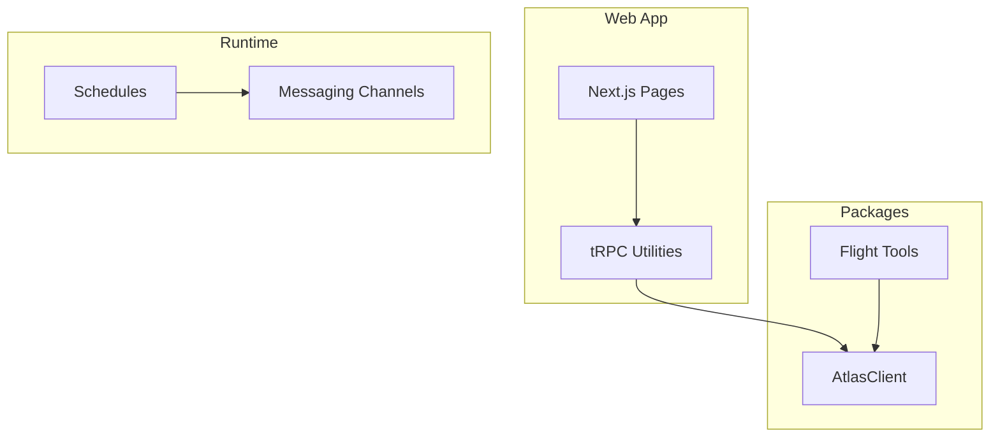
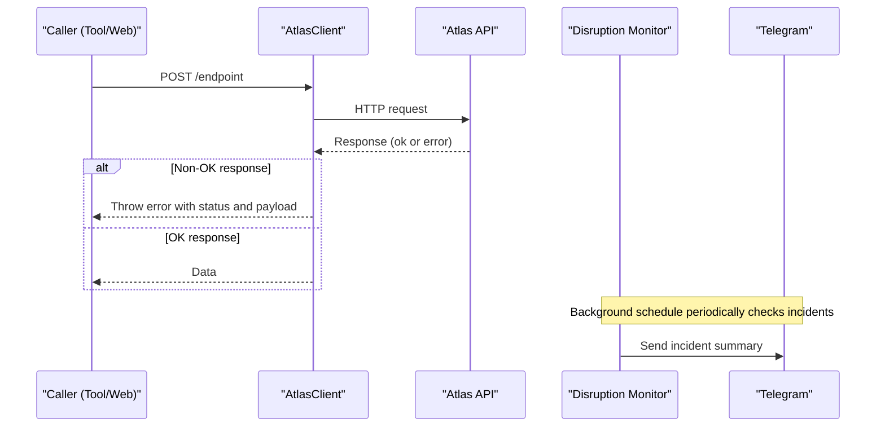
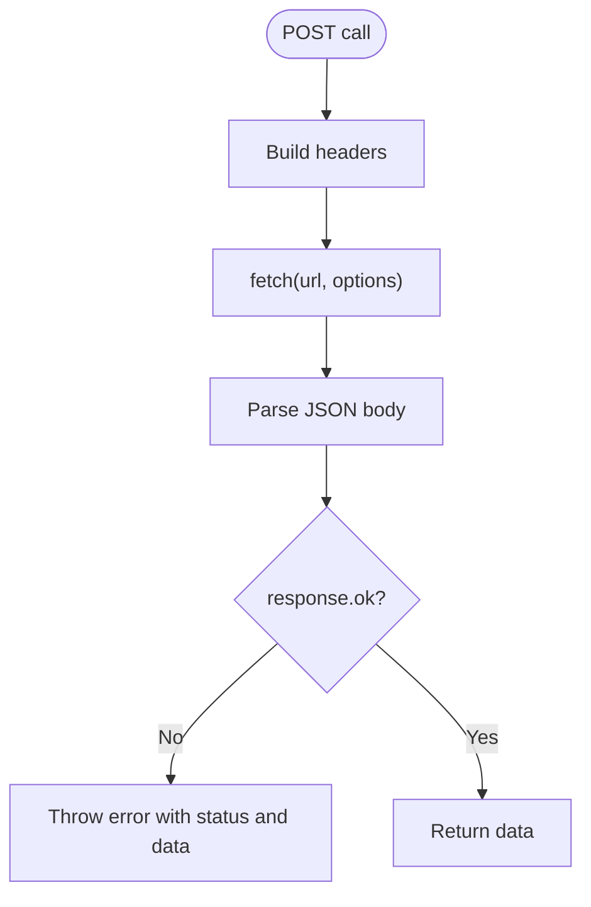
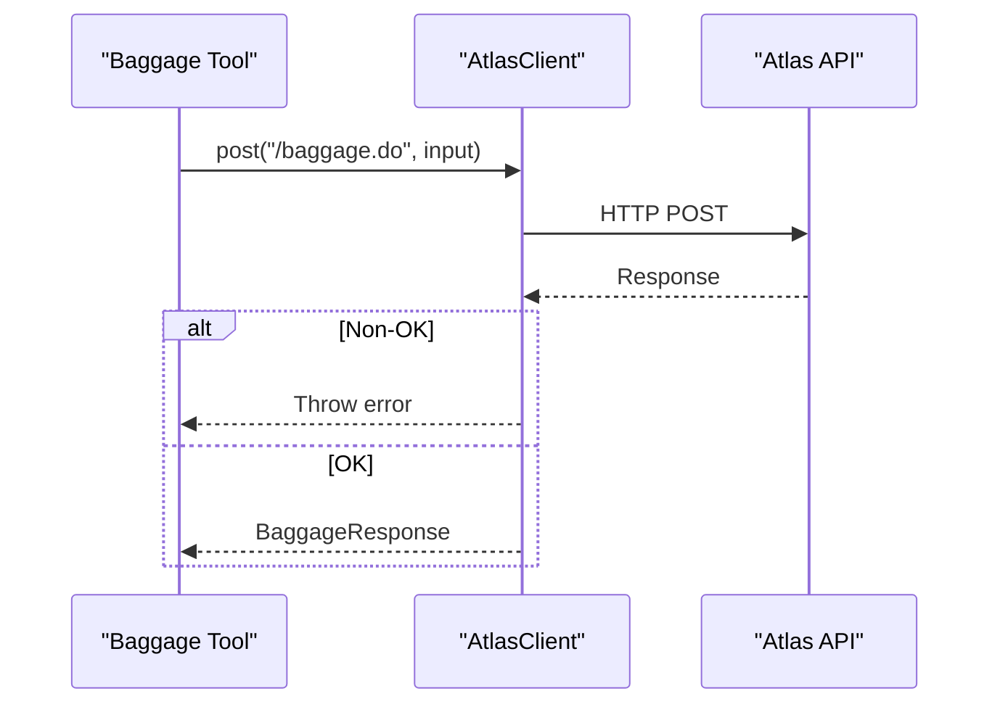
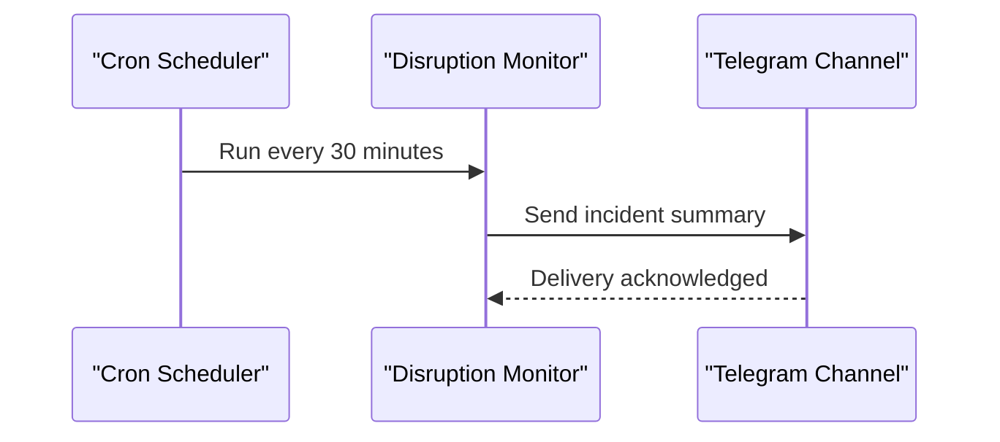
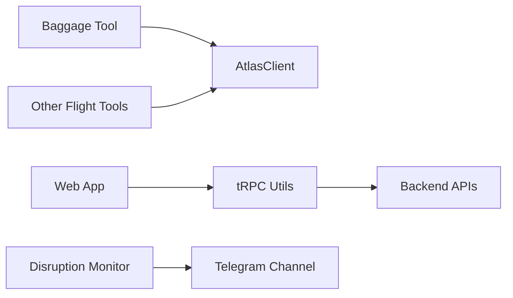

# Error Handling Strategies

<cite>
**Referenced Files in This Document**
- [client.ts](file://packages/atlas/src/client.ts)
- [baggage.ts](file://packages/atlas/src/flights/baggage.ts)
- [error-handling.md](file://.agents/skills/atlas-flight-booking/references/error-handling.md)
- [disruption-monitor.ts](file://apps/runtime/agent/schedules/disruption-monitor.ts)
- [telegram.ts](file://apps/runtime/agent/channels/telegram.ts)
- [trpc.ts](file://apps/web/src/utils/trpc.ts)
</cite>

## Table of Contents

1. [Introduction](#introduction)
2. [Project Structure](#project-structure)
3. [Core Components](#core-components)
4. [Architecture Overview](#architecture-overview)
5. [Detailed Component Analysis](#detailed-component-analysis)
6. [Dependency Analysis](#dependency-analysis)
7. [Performance Considerations](#performance-considerations)
8. [Troubleshooting Guide](#troubleshooting-guide)
9. [Conclusion](#conclusion)
10. [Appendices](#appendices)

## Introduction

This document explains error handling strategies for external service integration failures in the Atlas system. It focuses on how network errors, rate limiting, and service unavailability are handled at the client layer, how errors are categorized and surfaced to users, and how operational monitoring is integrated into the runtime. The guidance also outlines recommended patterns such as retry with exponential backoff, timeouts, circuit breaking, and graceful degradation to improve resilience and user experience.

## Project Structure

Atlas is a monorepo with:

- A Next.js web app (apps/web)
- An AI agent runtime (apps/runtime) that orchestrates tools and channels
- Shared packages including an Atlas API client (packages/atlas) used by tools and subagents
- Operational schedules that monitor incidents and notify via messaging channels

**Diagram sources**

- [client.ts:7-39](file://packages/atlas/src/client.ts#L7-L39)
- [baggage.ts:10-13](file://packages/atlas/src/flights/baggage.ts#L10-L13)
- [disruption-monitor.ts:5-19](file://apps/runtime/agent/schedules/disruption-monitor.ts#L5-L19)
- [trpc.ts:1-200](file://apps/web/src/utils/trpc.ts)

**Section sources**

- [README.md:79-94](file://README.md#L79-L94)

## Core Components

- AtlasClient: Central HTTP client for outbound calls to the Atlas API. It sets headers and throws on non-OK responses.
- Flight tooling: Thin wrappers around Atlas endpoints (e.g., baggage) that delegate to AtlasClient.
- Runtime schedules: Periodic jobs that poll for incidents and notify operations via Telegram.
- Web utilities: tRPC helpers used by the frontend to call backend APIs.

Key responsibilities:

- Network I/O and basic error signaling from AtlasClient
- Domain-specific tooling delegating to the client
- Operational monitoring and alerting through scheduled tasks
- Frontend integration via tRPC utilities

**Section sources**

- [client.ts:7-39](file://packages/atlas/src/client.ts#L7-L39)
- [baggage.ts:10-13](file://packages/atlas/src/flights/baggage.ts#L10-L13)
- [disruption-monitor.ts:5-19](file://apps/runtime/agent/schedules/disruption-monitor.ts#L5-L19)
- [trpc.ts:1-200](file://apps/web/src/utils/trpc.ts)

## Architecture Overview

The Atlas system integrates with external services primarily through the AtlasClient. Errors from these services propagate up to callers (tools, agents, or web routes). Operational health and incidents are monitored by runtime schedules that send alerts to Telegram.

**Diagram sources**

- [client.ts:23-39](file://packages/atlas/src/client.ts#L23-L39)
- [disruption-monitor.ts:5-19](file://apps/runtime/agent/schedules/disruption-monitor.ts#L5-L19)
- [telegram.ts:1-200](file://apps/runtime/agent/channels/telegram.ts)

## Detailed Component Analysis

### AtlasClient error behavior

- Sets standard JSON headers and client credentials.
- Performs a POST request and parses JSON.
- Throws an error when the response is not OK, including status and parsed body.

Implications:

- Callers must handle thrown errors to implement retries, fallbacks, or user-facing messages.
- No built-in retry, timeout, or circuit breaker; these should be added at higher layers or via middleware.

**Diagram sources**

- [client.ts:14-39](file://packages/atlas/src/client.ts#L14-L39)

**Section sources**

- [client.ts:7-39](file://packages/atlas/src/client.ts#L7-L39)

### Flight tooling delegation (example: baggage)

- The baggage tool exposes a get method that delegates to AtlasClient.post("/baggage.do", input).
- Any network or API error will bubble up from AtlasClient to the caller.

**Diagram sources**

- [baggage.ts:10-13](file://packages/atlas/src/flights/baggage.ts#L10-L13)
- [client.ts:23-39](file://packages/atlas/src/client.ts#L23-L39)

**Section sources**

- [baggage.ts:1-14](file://packages/atlas/src/flights/baggage.ts#L1-14)
- [client.ts:7-39](file://packages/atlas/src/client.ts#L7-L39)

### Error categorization and user-facing behavior

The flight booking reference defines normalized error codes and expected behaviors for authorization, search, optional services, order/payment/ticketing, and general failures. These rules guide how to present messages and whether to retry read-only operations.

Highlights:

- Branch on stable codes; never parse free-form messages.
- For temporary service issues, repeat identical read-only commands at most once when marked retryable.
- Never repeat side-effecting actions like order creation or payment unless explicitly allowed.
- Normalize upstream numeric statuses into stable codes before surfacing to users.

Operational guidance:

- Present neutral, actionable messages to users.
- Keep internal causes out of user-facing output.
- Use returned links (e.g., order links) when provided.

**Section sources**

- [error-handling.md:1-74](file://.agents/skills/atlas-flight-booking/references/error-handling.md#L1-L74)

### Monitoring and alerting for integration failures

A background schedule runs every 30 minutes to check for new flight incidents and sends a summarized report to an operations Telegram chat. This provides early visibility into disruptions affecting bookings.

**Diagram sources**

- [disruption-monitor.ts:5-19](file://apps/runtime/agent/schedules/disruption-monitor.ts#L5-L19)
- [telegram.ts:1-200](file://apps/runtime/agent/channels/telegram.ts)

**Section sources**

- [disruption-monitor.ts:5-19](file://apps/runtime/agent/schedules/disruption-monitor.ts#L5-L19)

### Web integration via tRPC utilities

The web app uses tRPC utilities to call backend APIs. While specific implementation details are not shown here, typical error handling includes:

- Catching network errors and mapping them to user-friendly messages.
- Retrying idempotent reads with backoff if appropriate.
- Showing partial UI or fallback content when downstream services are degraded.

[No sources needed since this section describes general integration patterns without analyzing specific files]

## Dependency Analysis

AtlasClient is the central dependency for outbound calls. Flight tools depend on it, and runtime schedules depend on messaging channels. The web app depends on tRPC utilities to reach backend services.

**Diagram sources**

- [baggage.ts:10-13](file://packages/atlas/src/flights/baggage.ts#L10-L13)
- [client.ts:7-39](file://packages/atlas/src/client.ts#L7-L39)
- [disruption-monitor.ts:5-19](file://apps/runtime/agent/schedules/disruption-monitor.ts#L5-L19)
- [trpc.ts:1-200](file://apps/web/src/utils/trpc.ts)

**Section sources**

- [baggage.ts:1-14](file://packages/atlas/src/flights/baggage.ts#L1-14)
- [client.ts:7-39](file://packages/atlas/src/client.ts#L7-L39)
- [disruption-monitor.ts:5-19](file://apps/runtime/agent/schedules/disruption-monitor.ts#L5-L19)
- [trpc.ts:1-200](file://apps/web/src/utils/trpc.ts)

## Performance Considerations

- Avoid unnecessary retries for non-idempotent operations (e.g., payments, order creation).
- Prefer bounded retries for read-only queries when marked retryable.
- Defer expensive async work until needed to reduce blocking paths.
- Use parallel fetching where operations are independent to reduce latency.
- Cache stable results where appropriate to reduce load on external services.

[No sources needed since this section provides general guidance]

## Troubleshooting Guide

Common scenarios and steps:

- Network errors or non-OK responses:
  - Inspect the thrown error from AtlasClient for status and payload.
  - Determine if the operation is idempotent before retrying.
  - Apply retry only for safe read-only operations when indicated.
- Rate limiting:
  - Observe repeated 429-like conditions and back off with exponential delays.
  - Throttle concurrent requests per tenant or endpoint.
- Service unavailability:
  - Implement circuit breaking to fail fast during outages.
  - Provide graceful degradation (e.g., show cached data or instructive messages).
- Authorization flows:
  - Follow the normalized codes to prompt login or re-authentication.
  - Do not expose internal codes; present clear next steps.
- Monitoring:
  - Verify disruption monitor schedule execution and Telegram delivery.
  - Alert on spikes in failure rates or sustained outages.

**Section sources**

- [client.ts:23-39](file://packages/atlas/src/client.ts#L23-L39)
- [error-handling.md:1-74](file://.agents/skills/atlas-flight-booking/references/error-handling.md#L1-L74)
- [disruption-monitor.ts:5-19](file://apps/runtime/agent/schedules/disruption-monitor.ts#L5-L19)

## Conclusion

Atlas’s current client layer surfaces external service errors clearly but does not include built-in retry, timeout, or circuit-breaking logic. To build resilient integrations:

- Add retry with exponential backoff for safe, idempotent operations.
- Enforce timeouts and circuit breakers around external calls.
- Follow normalized error codes to craft consistent, user-friendly messages.
- Strengthen monitoring and alerting to detect and respond to failures quickly.

[No sources needed since this section summarizes without analyzing specific files]

## Appendices

### Recommended Retry Strategy (conceptual)

- Identify safe operations (read-only, idempotent).
- Use exponential backoff with jitter and a maximum attempt cap.
- Stop retrying on client errors (e.g., invalid arguments) and escalate server errors after thresholds.

[No sources needed since this diagram shows conceptual workflow, not actual code structure]

### Graceful Degradation Patterns (conceptual)

- Serve cached or stale data when upstream is down.
- Show informative messages guiding users to retry later or take alternative actions.
- Disable non-critical features temporarily to preserve core functionality.

[No sources needed since this diagram shows conceptual workflow, not actual code structure]
