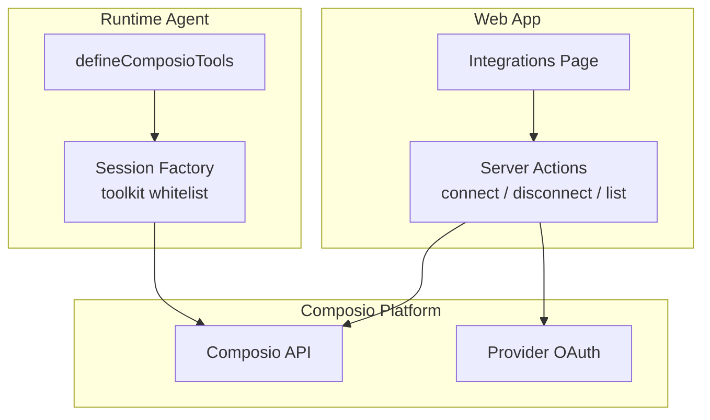
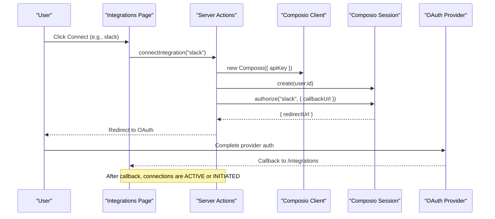
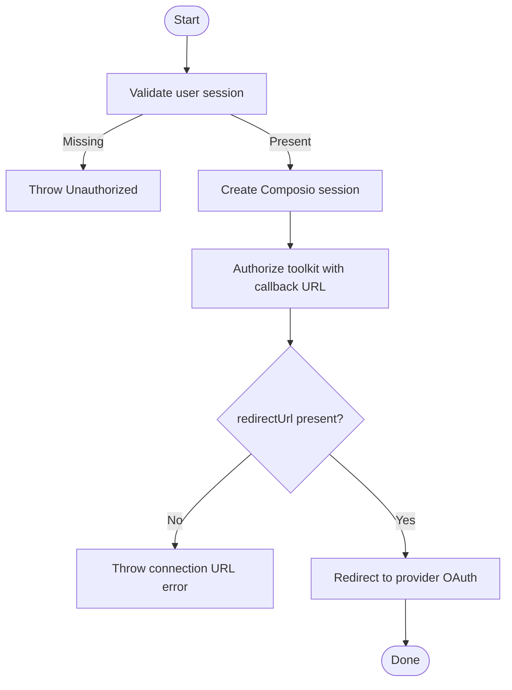
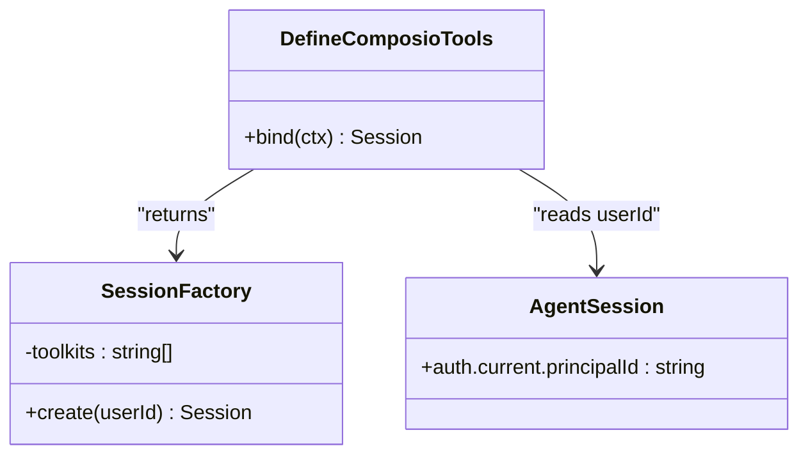
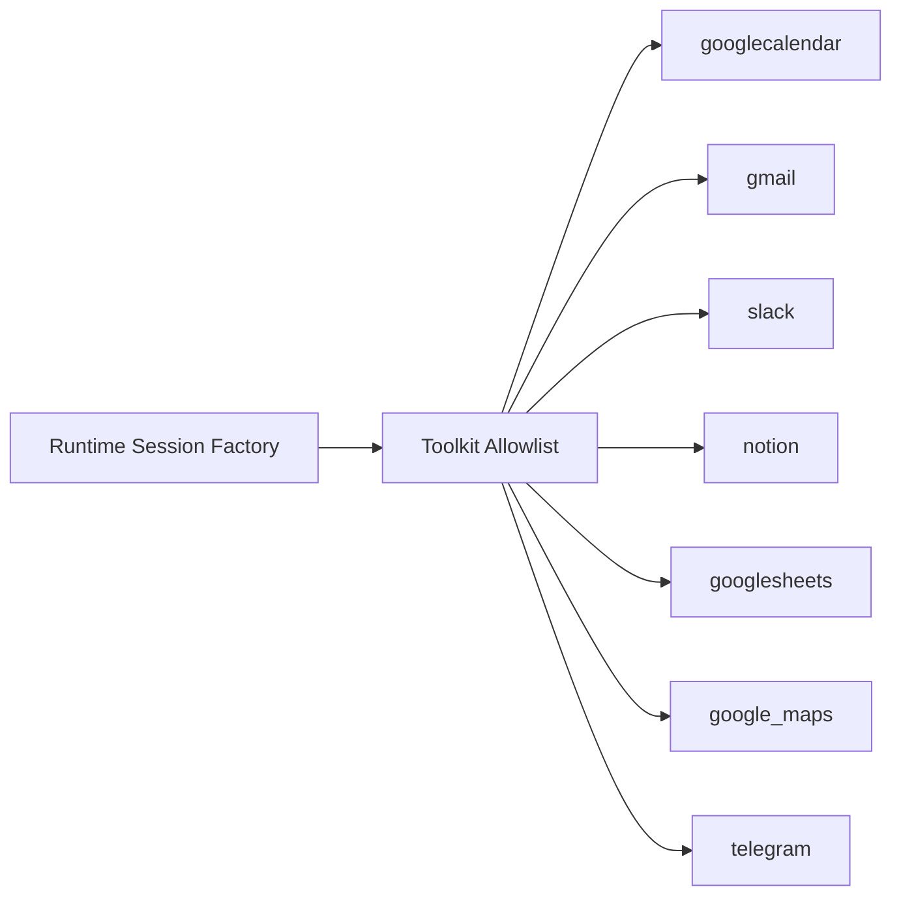
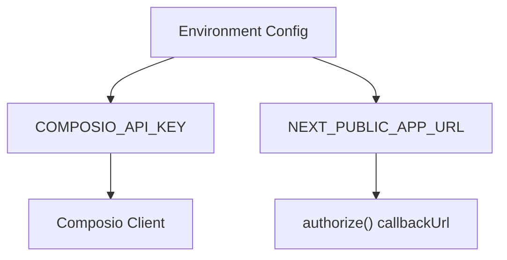
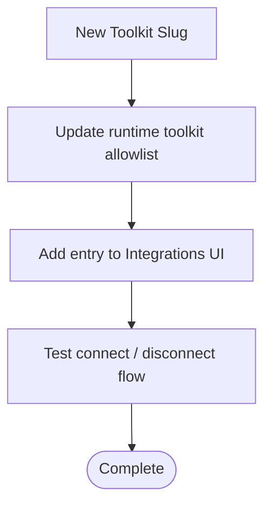
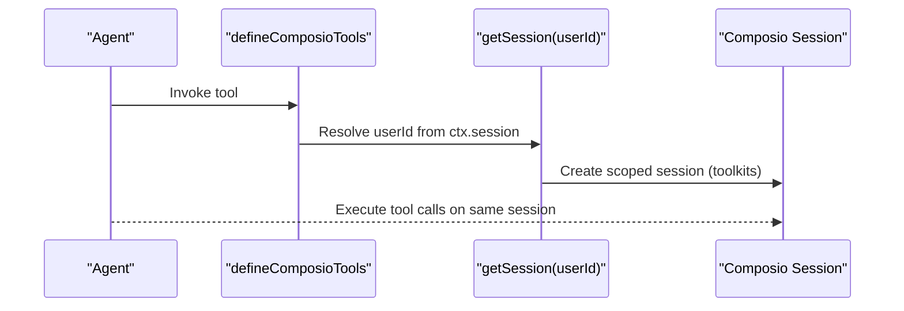
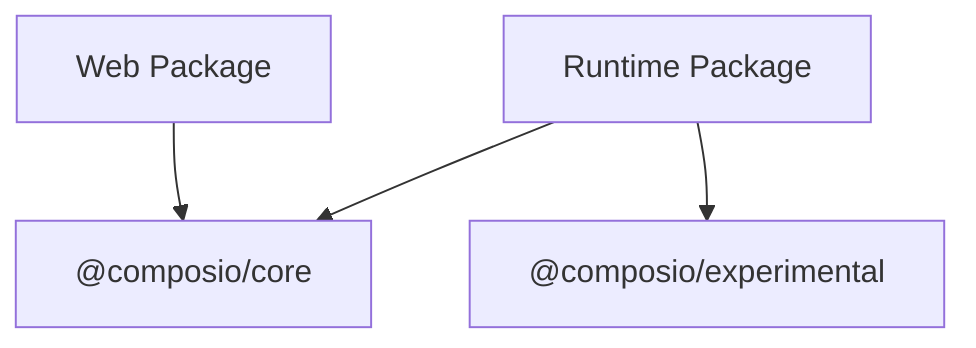

# External Service Connectivity

<cite>
**Referenced Files in This Document**
- [composio.ts](file://apps/runtime/agent/tools/composio.ts)
- [session.ts](file://apps/runtime/agent/session.ts)
- [composio.ts](file://apps/web/src/app/actions/composio.ts)
- [integrations/page.tsx](file://apps/web/src/app/(protected)/integrations/page.tsx)
- [environment server config](file://packages/env/src/server.ts)
- [runtime package.json](file://apps/runtime/package.json)
- [web package.json](file://apps/web/package.json)
- [health router](file://packages/api/src/routers/health.ts)
</cite>

## Table of Contents

1. Introduction
2. Project Structure
3. Core Components
4. Architecture Overview
5. Detailed Component Analysis
6. Dependency Analysis
7. Performance Considerations
8. Troubleshooting Guide
9. Conclusion

## Introduction

This document explains how Atlas connects to third-party services (Google Calendar, Gmail, Slack, Notion, and others) through the Composio platform. It covers:

- Tool definition via defineComposioTools for runtime agent tool access
- Session management that binds user context to a scoped set of toolkits
- Service discovery and connection lifecycle from the web UI
- Configuration of service endpoints and authentication flows
- Patterns for request routing, connection reuse, and health monitoring

## Project Structure

Atlas implements external connectivity across two main areas:

- Web layer: Server actions handle user authorization flows with Composio and list/disconnect integrations
- Runtime layer: Agent tools are defined using defineComposioTools and resolve per-user sessions with a curated toolkit list

**Diagram sources**

- [composio.ts:1-85](file://apps/web/src/app/actions/composio.ts#L1-L85)
- [composio.ts:1-12](file://apps/runtime/agent/tools/composio.ts#L1-L12)
- [session.ts:1-19](file://apps/runtime/agent/session.ts#L1-L19)

**Section sources**

- [composio.ts:1-85](file://apps/web/src/app/actions/composio.ts#L1-L85)
- [composio.ts:1-12](file://apps/runtime/agent/tools/composio.ts#L1-L12)
- [session.ts:1-19](file://apps/runtime/agent/session.ts#L1-L19)

## Core Components

- Web server actions initialize a Composio client with a project key, create per-user sessions, and orchestrate provider authorization redirects and account listing/disconnection.
- Runtime tool definitions wrap session creation behind defineComposioTools, extracting the current user ID from the agent session and returning a scoped session with an explicit toolkit allowlist.
- The Integrations page exposes connect/disconnect/list operations bound to known toolkit slugs.

Key responsibilities:

- Authentication gating and user identity resolution
- Authorization redirect generation and callback handling
- Per-user session scoping and toolkit selection
- Connection state enumeration and cleanup

**Section sources**

- [composio.ts:1-85](file://apps/web/src/app/actions/composio.ts#L1-L85)
- [composio.ts:1-12](file://apps/runtime/agent/tools/composio.ts#L1-L12)
- [session.ts:1-19](file://apps/runtime/agent/session.ts#L1-L19)
- [integrations/page.tsx](<file://apps/web/src/app/(protected)/integrations/page.tsx#L1-L151>)

## Architecture Overview

The system uses a clear separation between user-facing connection management and agent-side tool execution.

**Diagram sources**

- [composio.ts:13-33](file://apps/web/src/app/actions/composio.ts#L13-L33)
- [integrations/page.tsx](<file://apps/web/src/app/(protected)/integrations/page.tsx#L104-L139>)

## Detailed Component Analysis

### Web Integration Flows

- Connect integration: Validates user session, creates a Composio session, requests authorization for a specific toolkit slug, and redirects to the provider’s OAuth flow.
- Disconnect integration: Lists connected accounts for the current user, filters by toolkit slug and status, and deletes matching accounts.
- List integrations: Returns active or initiated connections for the current user to drive UI state.

**Diagram sources**

- [composio.ts:13-33](file://apps/web/src/app/actions/composio.ts#L13-L33)

**Section sources**

- [composio.ts:13-85](file://apps/web/src/app/actions/composio.ts#L13-L85)

### Runtime Tool Definition and Session Management

- Tool definition: Uses defineComposioTools to bind the agent’s session context to a function that extracts the user ID and returns a per-user Composio session.
- Session factory: Creates a Composio session configured with a curated toolkit allowlist (e.g., Google Calendar, Gmail, Slack, Notion). This ensures agents only see relevant tools.

**Diagram sources**

- [composio.ts:1-12](file://apps/runtime/agent/tools/composio.ts#L1-L12)
- [session.ts:1-19](file://apps/runtime/agent/session.ts#L1-L19)

**Section sources**

- [composio.ts:1-12](file://apps/runtime/agent/tools/composio.ts#L1-L12)
- [session.ts:1-19](file://apps/runtime/agent/session.ts#L1-L19)

### Service Discovery and Toolkit Selection

- The runtime session is created with an explicit toolkit list, which acts as a discovery allowlist for available tools.
- The web UI enumerates supported integrations and maps them to toolkit slugs used during authorization and disconnection.

**Diagram sources**

- [session.ts:6-18](file://apps/runtime/agent/session.ts#L6-L18)
- [integrations/page.tsx](<file://apps/web/src/app/(protected)/integrations/page.tsx#L36-L72>)

**Section sources**

- [session.ts:1-19](file://apps/runtime/agent/session.ts#L1-L19)
- [integrations/page.tsx](<file://apps/web/src/app/(protected)/integrations/page.tsx#L36-L72>)

### Configuration and Environment

- Project-level API key for Composio is loaded from environment configuration and passed into the client initialization in server actions.
- Public app URL is used to construct the OAuth callback endpoint.

**Diagram sources**

- [environment server config:1-28](file://packages/env/src/server.ts#L1-L28)
- [composio.ts:1-12](file://apps/web/src/app/actions/composio.ts#L1-L12)

**Section sources**

- [environment server config:1-28](file://packages/env/src/server.ts#L1-L28)
- [composio.ts:1-12](file://apps/web/src/app/actions/composio.ts#L1-L12)

### Implementing a New Service Connection

To add a new service:

- Add the toolkit slug to the runtime session allowlist so the agent can discover it.
- Add the integration to the web UI list if you want users to connect it from the dashboard.
- Ensure the toolkit slug matches what Composio expects for authorization.

**Diagram sources**

- [session.ts:6-18](file://apps/runtime/agent/session.ts#L6-L18)
- [integrations/page.tsx](<file://apps/web/src/app/(protected)/integrations/page.tsx#L36-L72>)

**Section sources**

- [session.ts:6-18](file://apps/runtime/agent/session.ts#L6-L18)
- [integrations/page.tsx](<file://apps/web/src/app/(protected)/integrations/page.tsx#L36-L72>)

### Request Routing and Connection Reuse

- Authorization routing: Server actions route connect/disconnect/list calls to the appropriate Composio SDK methods and handle redirects.
- Connection reuse: The runtime session is created per user with a fixed toolkit scope; subsequent tool calls within that session reuse the established connection context.

**Diagram sources**

- [composio.ts:1-12](file://apps/runtime/agent/tools/composio.ts#L1-L12)
- [session.ts:1-19](file://apps/runtime/agent/session.ts#L1-L19)

**Section sources**

- [composio.ts:1-12](file://apps/runtime/agent/tools/composio.ts#L1-L12)
- [session.ts:1-19](file://apps/runtime/agent/session.ts#L1-L19)

### Health Monitoring

- A minimal health endpoint exists at the API layer to verify service availability. While not Composio-specific, it can be extended to include downstream checks for Composio connectivity.

**Diagram sources**

- [health router:1-5](file://packages/api/src/routers/health.ts#L1-L5)

**Section sources**

- [health router:1-5](file://packages/api/src/routers/health.ts#L1-L5)

## Dependency Analysis

Atlas depends on the following packages for Composio integration:

- @composio/core: Provides the core SDK for creating sessions, authorizing toolkits, and managing connections
- @composio/experimental: Enables experimental features and integration with the Eve runtime

**Diagram sources**

- [runtime package.json:15-23](file://apps/runtime/package.json#L15-L23)
- [web package.json:11-17](file://apps/web/package.json#L11-L17)

**Section sources**

- [runtime package.json:15-23](file://apps/runtime/package.json#L15-L23)
- [web package.json:11-17](file://apps/web/package.json#L11-L17)

## Performance Considerations

- Connection reuse: Prefer reusing a per-user Composio session for multiple tool calls to avoid repeated setup overhead.
- Minimal toolkit scope: Keep the toolkit allowlist tight to reduce tool discovery cost and limit attack surface.
- Avoid redundant network calls: Cache UI state for connected integrations where appropriate and invalidate only when necessary.
- Error retries: For transient failures, implement bounded retries for read-only operations; avoid retrying side-effecting operations.

[No sources needed since this section provides general guidance]

## Troubleshooting Guide

Common issues and resolutions:

- Unauthorized errors: Ensure the user session is valid before calling server actions.
- Missing redirect URL: If authorization fails to return a redirect URL, check environment variables and toolkit slug validity.
- Stale connections: Use the disconnect flow to remove duplicate or inactive accounts for a given toolkit.
- Health checks: Use the health endpoint to confirm backend availability; extend it to probe Composio connectivity if needed.

**Section sources**

- [composio.ts:13-33](file://apps/web/src/app/actions/composio.ts#L13-L33)
- [composio.ts:35-61](file://apps/web/src/app/actions/composio.ts#L35-L61)
- [health router:1-5](file://packages/api/src/routers/health.ts#L1-L5)

## Conclusion

Atlas integrates with third-party services through a clean separation of concerns:

- Web server actions manage user-driven authorization and connection lifecycle
- Runtime tools expose a scoped, per-user session with a curated toolkit allowlist
- Configuration is centralized in environment settings
- Health endpoints provide basic service verification

This pattern enables adding new services by updating the toolkit allowlist and UI mappings while leveraging Composio’s standardized authorization and session model.

[No sources needed since this section summarizes without analyzing specific files]
