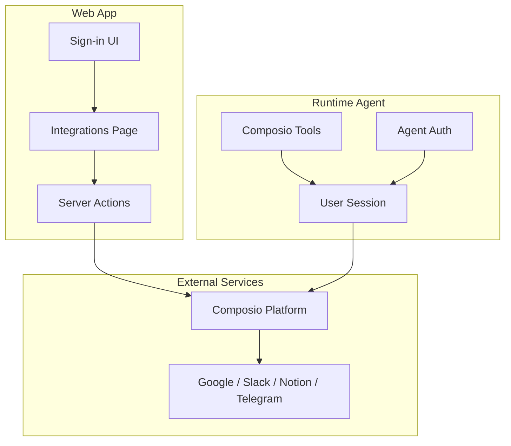
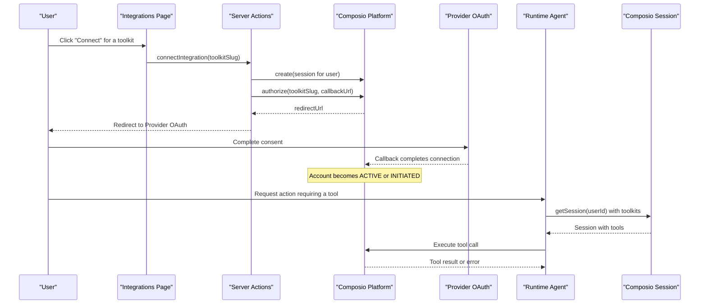
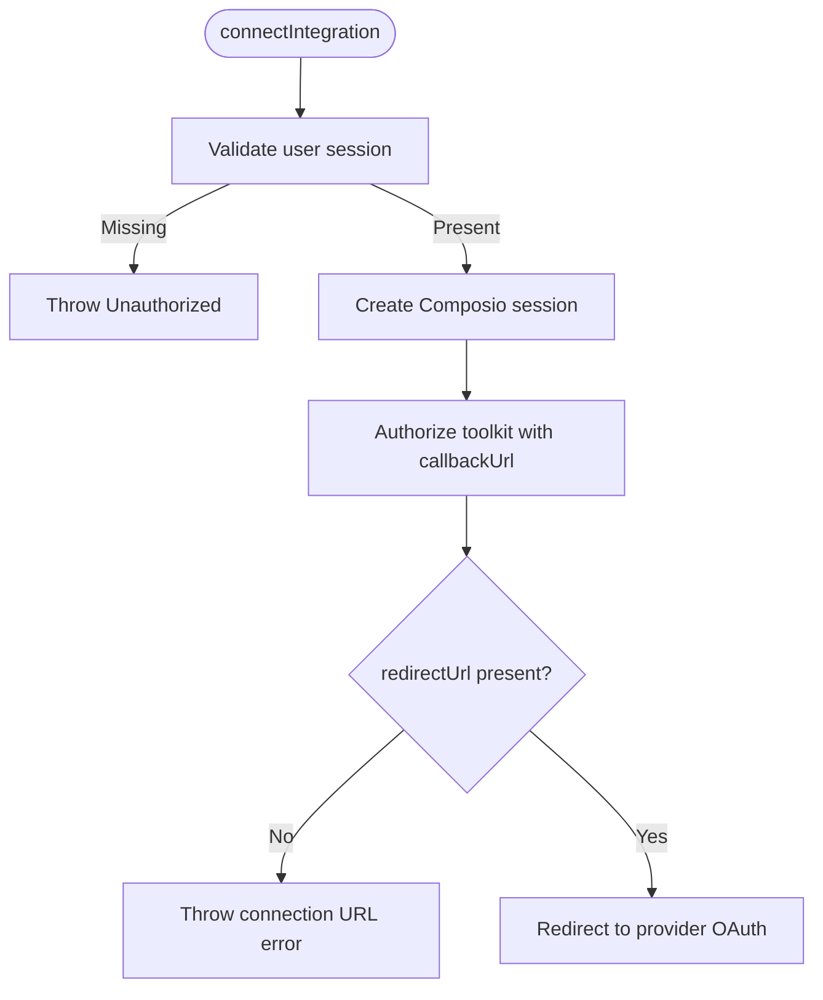
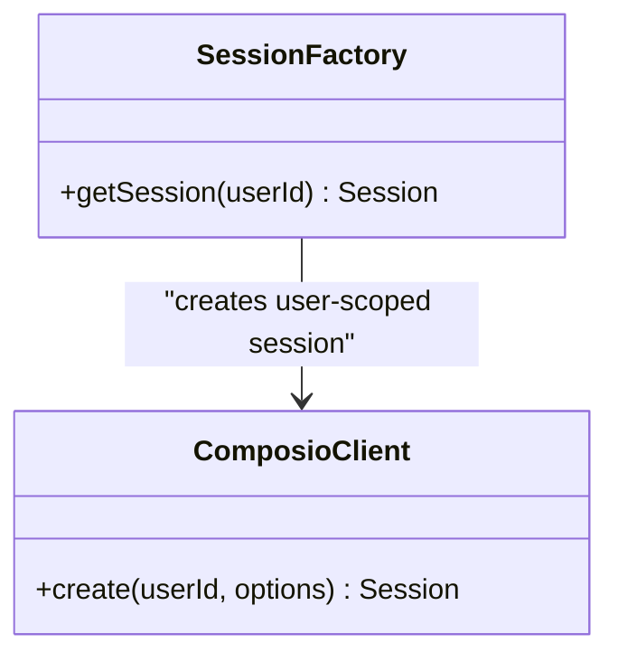
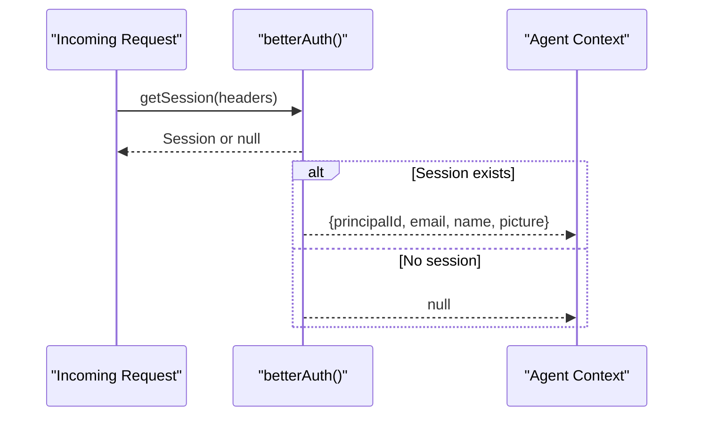
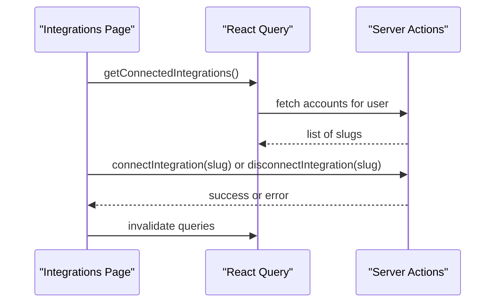
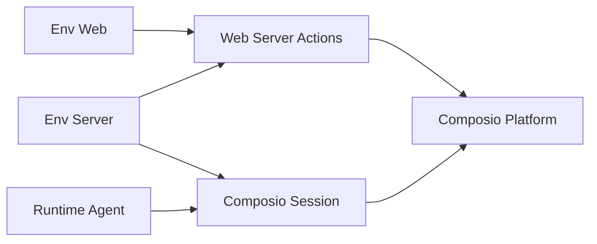

# Integration Patterns

<cite>
**Referenced Files in This Document**
- [composio.ts](file://apps/runtime/agent/tools/composio.ts)
- [session.ts](file://apps/runtime/agent/session.ts)
- [auth.ts](file://apps/runtime/agent/lib/auth.ts)
- [composio.ts](file://apps/web/src/app/actions/composio.ts)
- [page.tsx](file://apps/web/src/app/(protected)/integrations/page.tsx)
- [auth.tsx](file://apps/web/src/components/auth.tsx)
- [server.ts](file://packages/env/src/server.ts)
- [web.ts](file://packages/env/src/web.ts)
- [platform.md](file://.agents/skills/composio/references/platform.md)
- [errors.md](file://.agents/skills/composio/references/errors.md)
- [SKILL.md](file://.agents/skills/composio/SKILL.md)
</cite>

## Table of Contents

1. [Introduction](#introduction)
2. [Project Structure](#project-structure)
3. [Core Components](#core-components)
4. [Architecture Overview](#architecture-overview)
5. [Detailed Component Analysis](#detailed-component-analysis)
6. [Dependency Analysis](#dependency-analysis)
7. [Performance Considerations](#performance-considerations)
8. [Troubleshooting Guide](#troubleshooting-guide)
9. [Conclusion](#conclusion)
10. [Appendices](#appendices)

## Introduction

This document explains the integration patterns used by Atlas to connect to external services through Composio. It focuses on how user authentication, session management, and third-party tool execution are orchestrated across the web app and runtime agent. It also covers error handling strategies for network failures, rate limiting, and service unavailability, along with guidance for adding new integrations, configuring connections, implementing retry logic, and securing credentials.

## Project Structure

Atlas is a multi-app repository:

- Web app (Next.js): Provides UI for sign-in and managing integrations, and server actions that initiate OAuth flows via Composio.
- Runtime agent (Eve-based): Executes tools using Composio sessions scoped per user.
- Environment packages: Define and validate environment variables for both server and client.
- Skills references: Provide canonical guidance for Composio Platform usage and troubleshooting.

**Diagram sources**

- [composio.ts:13-33](file://apps/web/src/app/actions/composio.ts#L13-L33)
- [session.ts:6-18](file://apps/runtime/agent/session.ts#L6-L18)
- [auth.ts:4-24](file://apps/runtime/agent/lib/auth.ts#L4-L24)
- [page.tsx:74-149](<file://apps/web/src/app/(protected)/integrations/page.tsx#L74-L149>)

**Section sources**

- [composio.ts:13-33](file://apps/web/src/app/actions/composio.ts#L13-L33)
- [session.ts:6-18](file://apps/runtime/agent/session.ts#L6-L18)
- [auth.ts:4-24](file://apps/runtime/agent/lib/auth.ts#L4-L24)
- [page.tsx:74-149](<file://apps/web/src/app/(protected)/integrations/page.tsx#L74-L149>)

## Core Components

- Server-side integration actions: Create a Composio session for the current user, authorize a specific toolkit, and redirect to the provider’s OAuth flow. Also list and disconnect accounts.
- Runtime session factory: Build a Composio session for the agent with a curated set of toolkits enabled.
- Agent authentication: Extracts the authenticated user from Better Auth and exposes principal identity to the agent context.
- Integrations UI: Displays available integrations, shows connection status, and triggers connect/disconnect flows.
- Environment configuration: Validates required secrets such as the Composio API key and application URLs.

**Section sources**

- [composio.ts:13-84](file://apps/web/src/app/actions/composio.ts#L13-L84)
- [session.ts:6-18](file://apps/runtime/agent/session.ts#L6-L18)
- [auth.ts:4-24](file://apps/runtime/agent/lib/auth.ts#L4-L24)
- [page.tsx:74-149](<file://apps/web/src/app/(protected)/integrations/page.tsx#L74-L149>)
- [server.ts:5-27](file://packages/env/src/server.ts#L5-L27)
- [web.ts:4-13](file://packages/env/src/web.ts#L4-L13)

## Architecture Overview

The system uses Composio Platform to abstract provider-specific OAuth and tool execution:

- The web app authenticates users via Better Auth providers (e.g., Google, Telegram).
- When a user connects an integration, the web app creates a Composio session and obtains a Connect Link for the requested toolkit.
- After authorization, the runtime agent builds a per-user session with allowed toolkits and executes tools through Composio.
- Connection state is managed via Composio connected accounts; the UI reflects active or initiated states.

**Diagram sources**

- [composio.ts:13-33](file://apps/web/src/app/actions/composio.ts#L13-L33)
- [session.ts:6-18](file://apps/runtime/agent/session.ts#L6-L18)
- [page.tsx:92-141](<file://apps/web/src/app/(protected)/integrations/page.tsx#L92-L141>)

## Detailed Component Analysis

### Web Server Actions for Integrations

Responsibilities:

- Validate the current user session.
- Create a Composio session scoped to the user.
- Generate a Connect Link for the requested toolkit and redirect the browser.
- List and disconnect connected accounts for cleanup.

Key behaviors:

- Uses server-side environment variables for the project API key.
- Uses client-visible URL for the callback target.
- Filters connected accounts by status to reflect only usable connections.

**Diagram sources**

- [composio.ts:13-33](file://apps/web/src/app/actions/composio.ts#L13-L33)

**Section sources**

- [composio.ts:13-33](file://apps/web/src/app/actions/composio.ts#L13-L33)
- [composio.ts:35-61](file://apps/web/src/app/actions/composio.ts#L35-L61)
- [composio.ts:63-84](file://apps/web/src/app/actions/composio.ts#L63-L84)

### Runtime Agent Session Factory

Responsibilities:

- Build a Composio session for the agent with a predefined set of toolkits.
- Ensure the session is tied to the authenticated user’s principal ID.

Design notes:

- Toolkit list is explicit and can be extended when adding new integrations.
- Uses a provider adapter configured at initialization.

**Diagram sources**

- [session.ts:6-18](file://apps/runtime/agent/session.ts#L6-L18)

**Section sources**

- [session.ts:6-18](file://apps/runtime/agent/session.ts#L6-L18)

### Agent Authentication Bridge

Responsibilities:

- Extract session from incoming requests using Better Auth.
- Map user attributes into the agent’s principal identity.

Security note:

- Principal ID is derived from the authenticated session to ensure per-user isolation.

**Diagram sources**

- [auth.ts:4-24](file://apps/runtime/agent/lib/auth.ts#L4-L24)

**Section sources**

- [auth.ts:4-24](file://apps/runtime/agent/lib/auth.ts#L4-L24)

### Integrations UI

Responsibilities:

- Display available integrations and their connection status.
- Trigger connect/disconnect flows via server actions.
- Refresh connection state after operations.

Behavioral highlights:

- Queries connected integrations and toggles buttons based on status.
- Calls disconnect to remove ACTIVE or INITIATED accounts for a given toolkit.

**Diagram sources**

- [page.tsx:74-149](<file://apps/web/src/app/(protected)/integrations/page.tsx#L74-L149>)
- [composio.ts:63-84](file://apps/web/src/app/actions/composio.ts#L63-L84)

**Section sources**

- [page.tsx:74-149](<file://apps/web/src/app/(protected)/integrations/page.tsx#L74-L149>)

### Sign-In Flows

Responsibilities:

- Offer social sign-in providers (e.g., Google, Telegram).
- Use Better Auth client to start OAuth flows and redirect back to the app.

Notes:

- These flows authenticate users into Atlas; they are separate from provider account connections managed by Composio.

**Section sources**

- [auth.tsx:9-20](file://apps/web/src/components/auth.tsx#L9-L20)

## Dependency Analysis

Key dependencies and relationships:

- Web server actions depend on the Composio SDK and environment variables for the project API key and app URL.
- Runtime agent depends on the Composio SDK and a provider adapter to build sessions with selected toolkits.
- Environment validation ensures required keys exist before runtime.

**Diagram sources**

- [server.ts:5-27](file://packages/env/src/server.ts#L5-L27)
- [web.ts:4-13](file://packages/env/src/web.ts#L4-L13)
- [composio.ts:13-33](file://apps/web/src/app/actions/composio.ts#L13-L33)
- [session.ts:6-18](file://apps/runtime/agent/session.ts#L6-L18)

**Section sources**

- [server.ts:5-27](file://packages/env/src/server.ts#L5-L27)
- [web.ts:4-13](file://packages/env/src/web.ts#L4-L13)
- [composio.ts:13-33](file://apps/web/src/app/actions/composio.ts#L13-L33)
- [session.ts:6-18](file://apps/runtime/agent/session.ts#L6-L18)

## Performance Considerations

- Prefer reusing a single Composio session per user for multi-turn interactions to avoid repeated setup overhead.
- Cache connection status on the client side and invalidate only when necessary to reduce redundant server calls.
- Keep toolkit lists minimal and relevant to reduce discovery and permission overhead.
- Avoid logging sensitive tokens or connection details; rely on request IDs for diagnostics.

[No sources needed since this section provides general guidance]

## Troubleshooting Guide

Common issues and recommended steps:

- Project or session 401 errors: Verify the project API key and that it belongs to the correct project. Do not print or rotate keys in chat.
- Provider connected-account 401: Indicates expired or revoked provider tokens. Re-authorize via a fresh Connect Link.
- Rate limits and quotas: Some providers share quotas; consider custom apps for dedicated buckets if needed.
- Branding and production auth: For launch, move integrations to your own OAuth apps and follow white-labeling guidance.
- Triggers and webhooks: Check platform status and trigger logs before changing configurations.

Operational tips:

- Always capture the Composio log or request ID before escalating.
- Use the skills references to confirm current behavior and APIs.

**Section sources**

- [errors.md:5-60](file://.agents/skills/composio/references/errors.md#L5-L60)
- [platform.md:137-157](file://.agents/skills/composio/references/platform.md#L137-L157)

## Conclusion

Atlas integrates third-party services through Composio Platform, leveraging per-user sessions and managed OAuth flows. The web layer initiates connections and manages connection state, while the runtime agent executes tools within secure, user-scoped sessions. Robust error handling and environment validation support reliable operation. Extending integrations involves updating the toolkit list and ensuring proper environment configuration.

[No sources needed since this section summarizes without analyzing specific files]

## Appendices

### Adding a New Integration

Steps:

- Add the new toolkit slug to the runtime session’s toolkit list so the agent can discover and use its tools.
- If exposing a connect button, add the integration to the UI list and ensure the server action supports the slug.
- Confirm environment variables are set and validated.

References:

- Update toolkit list in the session factory.
- Extend the integrations page array to include the new service.

**Section sources**

- [session.ts:8-17](file://apps/runtime/agent/session.ts#L8-L17)
- [page.tsx:36-72](<file://apps/web/src/app/(protected)/integrations/page.tsx#L36-L72>)

### Configuring Service Connections

- Ensure COMPOSIO_API_KEY is present and valid in server environment.
- Set NEXT_PUBLIC_APP_URL for callbacks.
- Use the Integrations page to initiate OAuth flows for each provider.

**Section sources**

- [server.ts:5-27](file://packages/env/src/server.ts#L5-L27)
- [web.ts:4-13](file://packages/env/src/web.ts#L4-L13)
- [composio.ts:13-33](file://apps/web/src/app/actions/composio.ts#L13-L33)

### Implementing Retry Logic

Guidance:

- For transient failures, implement idempotent retries with bounded attempts and exponential backoff.
- Distinguish between retryable and non-retryable errors; do not repeat write operations unless safe.
- Capture request IDs for traceability.

**Section sources**

- [errors.md:5-60](file://.agents/skills/composio/references/errors.md#L5-L60)

### Security Considerations

- Store COMPOSIO_API_KEY and other secrets in environment variables validated at startup.
- Never log or expose tokens, keys, or connection details.
- Use per-user sessions to isolate access to provider accounts.
- Follow white-labeling and branding guidance for production deployments.

**Section sources**

- [server.ts:5-27](file://packages/env/src/server.ts#L5-L27)
- [platform.md:27-43](file://.agents/skills/composio/references/platform.md#L27-L43)
- [errors.md:52-60](file://.agents/skills/composio/references/errors.md#L52-L60)
