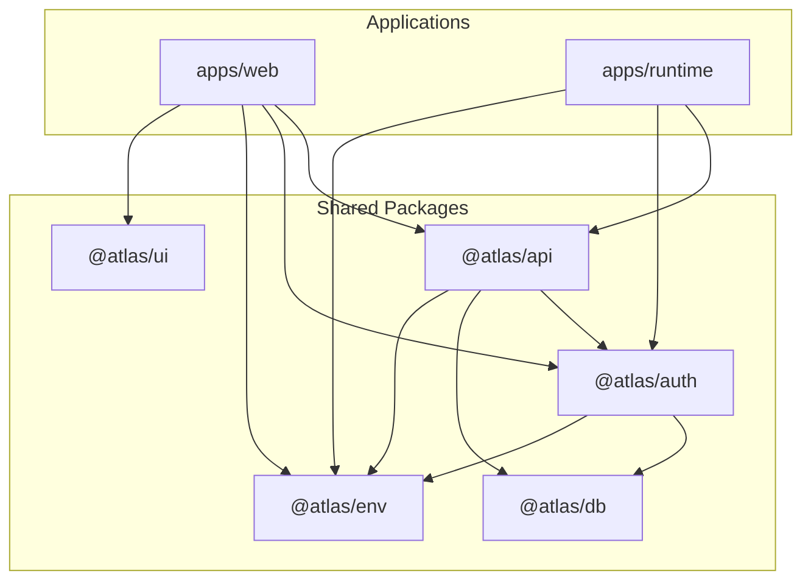
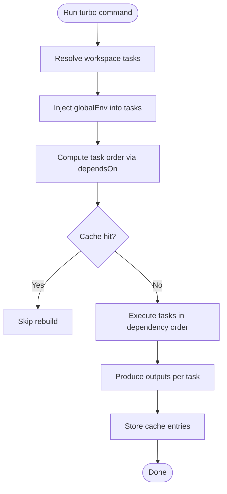
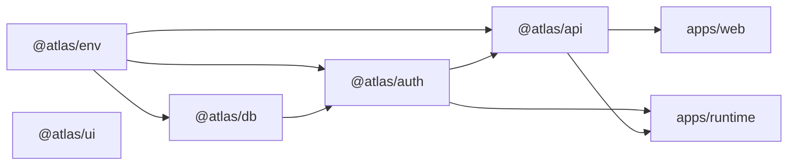
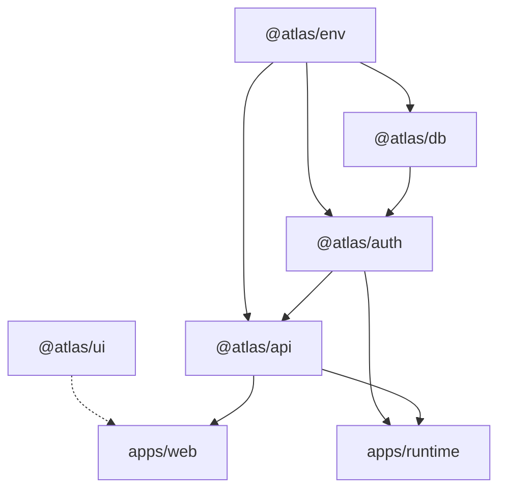

# Monorepo Structure

<cite>
**Referenced Files in This Document**
- [package.json](file://package.json)
- [turbo.json](file://turbo.json)
- [README.md](file://README.md)
- [apps/web/package.json](file://apps/web/package.json)
- [apps/runtime/package.json](file://apps/runtime/package.json)
- [packages/api/package.json](file://packages/api/package.json)
- [packages/auth/package.json](file://packages/auth/package.json)
- [packages/db/package.json](file://packages/db/package.json)
- [packages/env/package.json](file://packages/env/package.json)
- [packages/ui/package.json](file://packages/ui/package.json)
</cite>

## Table of Contents

1. [Introduction](#introduction)
2. [Project Structure](#project-structure)
3. [Core Components](#core-components)
4. [Architecture Overview](#architecture-overview)
5. [Detailed Component Analysis](#detailed-component-analysis)
6. [Dependency Analysis](#dependency-analysis)
7. [Performance Considerations](#performance-considerations)
8. [Troubleshooting Guide](#troubleshooting-guide)
9. [Conclusion](#conclusion)
10. [Appendices](#appendices)

## Introduction

This document explains the Atlas monorepo’s Turborepo-based workspace organization, focusing on how applications and shared packages are structured, how builds are orchestrated, caching strategies, task dependencies, and inter-package communication patterns. It also covers development workflows, environment variable management, and deployment considerations for the workspace.

## Project Structure

Atlas is a Turborepo workspace with two application targets and several shared packages:

- Applications:
  - apps/web: Next.js web application
  - apps/runtime: AI agent runtime
- Shared packages:
  - packages/api: API layer (tRPC routers and context)
  - packages/auth: Authentication configuration and logic
  - packages/db: Database schema, migrations, and client utilities
  - packages/env: Environment variable validation schemas for server and web contexts
  - packages/ui: Shared UI components and styles (shadcn/ui primitives)

The root package.json defines workspaces to include apps/* and packages/*. The README documents the project structure and available scripts.

**Diagram sources**

- [apps/web/package.json:11-15](file://apps/web/package.json#L11-L15)
- [apps/runtime/package.json:15-18](file://apps/runtime/package.json#L15-L18)
- [packages/api/package.json:13-16](file://packages/api/package.json#L13-L16)
- [packages/auth/package.json:13-15](file://packages/auth/package.json#L13-L15)
- [packages/db/package.json:18-19](file://packages/db/package.json#L18-L19)
- [packages/env/package.json:6-9](file://packages/env/package.json#L6-L9)
- [packages/ui/package.json:6-11](file://packages/ui/package.json#L6-L11)

**Section sources**

- [package.json:4-8](file://package.json#L4-L8)
- [README.md:79-94](file://README.md#L79-L94)

## Core Components

- apps/web: Fullstack Next.js app providing routes, pages, and API proxies; depends on @atlas/api, @atlas/auth, @atlas/env, and @atlas/ui.
- apps/runtime: Backend runtime for AI agents; depends on @atlas/atlas-client, @atlas/auth, and other runtime libraries.
- packages/api: tRPC-based API layer that composes auth, db, and env; exposes routers and context.
- packages/auth: Authentication setup using Better Auth; depends on db and env.
- packages/db: Drizzle ORM schema, migrations, and database client; depends on env for connection details.
- packages/env: Type-safe environment variables via t3 env tooling; provides server and web entry points.
- packages/ui: Shared UI library exposing components, hooks, and global styles.

These packages form a layered dependency graph where applications consume APIs and UI, while lower-level packages provide foundational capabilities.

**Section sources**

- [apps/web/package.json:11-15](file://apps/web/package.json#L11-L15)
- [apps/runtime/package.json:15-18](file://apps/runtime/package.json#L15-L18)
- [packages/api/package.json:13-16](file://packages/api/package.json#L13-L16)
- [packages/auth/package.json:13-15](file://packages/auth/package.json#L13-L15)
- [packages/db/package.json:18-19](file://packages/db/package.json#L18-L19)
- [packages/env/package.json:6-9](file://packages/env/package.json#L6-L9)
- [packages/ui/package.json:6-11](file://packages/ui/package.json#L6-L11)

## Architecture Overview

Turborepo orchestrates tasks across the workspace with caching and dependency resolution. The root turbo.json configures:

- Global environment variables propagated to tasks
- Task definitions for build, lint, check-types, dev, and database operations
- Build ordering via dependsOn to ensure upstream packages build before downstream consumers
- Caching inputs/outputs for build artifacts and excluding caches for persistent or side-effect tasks

**Diagram sources**

- [turbo.json:4-19](file://turbo.json#L4-L19)
- [turbo.json:20-49](file://turbo.json#L20-L49)

**Section sources**

- [turbo.json:4-19](file://turbo.json#L4-L19)
- [turbo.json:20-49](file://turbo.json#L20-L49)

## Detailed Component Analysis

### Workspace Commands and Task Configuration

- Root scripts delegate to Turborepo:
  - dev: starts all apps in development mode
  - build: builds all apps with dependency-aware ordering
  - check-types: type-checks across the workspace
  - db:* commands target @atlas/db with filtering
- Turbo tasks:
  - build: depends on upstream builds, caches dist/.next outputs, includes .env* as inputs
  - lint/check-types: depend on upstream tasks for consistent checks
  - dev: non-cached, persistent tasks for live development
  - db tasks: non-cached, with some persistent modes for interactive tools

Example usage:

- Run all development servers: bun run dev
- Build everything: bun run build
- Type-check only: bun run check-types
- Push schema to DB: bun run db:push
- Open DB studio: bun run db:studio

**Section sources**

- [package.json:29-40](file://package.json#L29-L40)
- [turbo.json:20-49](file://turbo.json#L20-L49)

### Package Dependency Graph and Build Order

- apps/web depends on @atlas/api, @atlas/auth, @atlas/env, @atlas/ui
- apps/runtime depends on @atlas/atlas-client, @atlas/auth
- @atlas/api depends on @atlas/auth, @atlas/db, @atlas/env
- @atlas/auth depends on @atlas/db, @atlas/env
- @atlas/db depends on @atlas/env
- @atlas/ui is a leaf package with no workspace dependencies

Build order enforced by Turborepo:

- Leaf packages (e.g., @atlas/env, @atlas/ui) build first
- Mid-layer packages (@atlas/db, @atlas/auth) build next
- Higher-layer packages (@atlas/api) build after their dependencies
- Applications (web, runtime) build last, consuming all upstream artifacts

**Diagram sources**

- [apps/web/package.json:11-15](file://apps/web/package.json#L11-L15)
- [apps/runtime/package.json:15-18](file://apps/runtime/package.json#L15-L18)
- [packages/api/package.json:13-16](file://packages/api/package.json#L13-L16)
- [packages/auth/package.json:13-15](file://packages/auth/package.json#L13-L15)
- [packages/db/package.json:18-19](file://packages/db/package.json#L18-L19)
- [packages/env/package.json:6-9](file://packages/env/package.json#L6-L9)
- [packages/ui/package.json:6-11](file://packages/ui/package.json#L6-L11)

**Section sources**

- [apps/web/package.json:11-15](file://apps/web/package.json#L11-L15)
- [apps/runtime/package.json:15-18](file://apps/runtime/package.json#L15-L18)
- [packages/api/package.json:13-16](file://packages/api/package.json#L13-L16)
- [packages/auth/package.json:13-15](file://packages/auth/package.json#L13-L15)
- [packages/db/package.json:18-19](file://packages/db/package.json#L18-L19)
- [packages/env/package.json:6-9](file://packages/env/package.json#L6-L9)
- [packages/ui/package.json:6-11](file://packages/ui/package.json#L6-L11)

### Inter-Package Communication Patterns

- Web app consumes:
  - @atlas/api for tRPC endpoints and client integration
  - @atlas/auth for authentication flows and client setup
  - @atlas/env for validated environment variables on the client/server boundary
  - @atlas/ui for shared components and styles
- Runtime consumes:
  - @atlas/atlas-client for API client access
  - @atlas/auth for authentication logic
  - @atlas/env for runtime environment validation

Environment variable boundaries:

- @atlas/env exports separate entry points for server and web contexts to enforce type safety and prevent leaking secrets to the browser.

**Section sources**

- [apps/web/package.json:11-15](file://apps/web/package.json#L11-L15)
- [apps/runtime/package.json:15-18](file://apps/runtime/package.json#L15-L18)
- [packages/env/package.json:6-9](file://packages/env/package.json#L6-L9)

### Development Workflow Considerations

- Use bun run dev to start all development servers concurrently; Turborepo marks dev tasks as persistent and non-cached for live iteration.
- Use bun run dev:web to focus on the web application only.
- Use bun run check-types to validate types across the workspace before committing changes.
- Use bun run check and bun run fix for linting and formatting via Ultracite.

Database workflow:

- Apply schema changes with bun run db:push
- Generate types/clients with bun run db:generate
- Run migrations with bun run db:migrate
- Explore data with bun run db:studio

**Section sources**

- [package.json:29-40](file://package.json#L29-L40)
- [turbo.json:32-49](file://turbo.json#L32-L49)
- [packages/db/package.json:12-16](file://packages/db/package.json#L12-L16)

### Environment Variable Management

- Global environment variables are declared in turbo.json and injected into tasks at runtime.
- Apps should define local environment files (e.g., apps/web/.env) for development; these are included as build inputs for caching purposes.
- Use @atlas/env to validate environment variables per context (server vs web), ensuring type safety and preventing accidental exposure.

Recommended practices:

- Keep secrets out of version control; rely on CI/CD environments to supply values.
- Align local .env keys with those listed in turbo.json globalEnv to avoid runtime errors.
- Validate environment variables early in application startup using @atlas/env.

**Section sources**

- [turbo.json:4-19](file://turbo.json#L4-L19)
- [turbo.json:20-25](file://turbo.json#L20-L25)
- [packages/env/package.json:6-9](file://packages/env/package.json#L6-L9)

### Deployment Strategies

- Build artifacts:
  - apps/web produces .next output cached by Turborepo
  - apps/runtime builds via its own toolchain
- Caching strategy:
  - Build tasks cache dist/** and .next/** outputs
  - Inputs include $TURBO_DEFAULT$ and .env* to capture configuration and environment changes
- CI/CD:
  - Use Turborepo remote caching to speed up CI runs
  - Ensure environment variables are provided securely in CI
  - Pin Node version via engines in root package.json

**Section sources**

- [turbo.json:20-25](file://turbo.json#L20-L25)
- [package.json:61-64](file://package.json#L61-L64)

## Dependency Analysis

The dependency graph shows clear separation of concerns:

- Leaf packages: @atlas/env, @atlas/ui
- Data layer: @atlas/db depends on @atlas/env
- Auth layer: @atlas/auth depends on @atlas/db and @atlas/env
- API layer: @atlas/api depends on @atlas/auth, @atlas/db, and @atlas/env
- Applications: apps/web and apps/runtime consume higher layers

**Diagram sources**

- [apps/web/package.json:11-15](file://apps/web/package.json#L11-L15)
- [apps/runtime/package.json:15-18](file://apps/runtime/package.json#L15-L18)
- [packages/api/package.json:13-16](file://packages/api/package.json#L13-L16)
- [packages/auth/package.json:13-15](file://packages/auth/package.json#L13-L15)
- [packages/db/package.json:18-19](file://packages/db/package.json#L18-L19)
- [packages/env/package.json:6-9](file://packages/env/package.json#L6-L9)
- [packages/ui/package.json:6-11](file://packages/ui/package.json#L6-L11)

**Section sources**

- [apps/web/package.json:11-15](file://apps/web/package.json#L11-L15)
- [apps/runtime/package.json:15-18](file://apps/runtime/package.json#L15-L18)
- [packages/api/package.json:13-16](file://packages/api/package.json#L13-L16)
- [packages/auth/package.json:13-15](file://packages/auth/package.json#L13-L15)
- [packages/db/package.json:18-19](file://packages/db/package.json#L18-L19)
- [packages/env/package.json:6-9](file://packages/env/package.json#L6-L9)
- [packages/ui/package.json:6-11](file://packages/ui/package.json#L6-L11)

## Performance Considerations

- Leverage Turborepo caching:
  - Build tasks cache outputs and use environment files as inputs to invalidate caches when configs change
  - Avoid caching tasks with side effects (e.g., database operations)
- Minimize unnecessary rebuilds:
  - Keep package boundaries clean to reduce cascade rebuilds
  - Use filtering (-F) to target specific packages during development
- Optimize dev experience:
  - Use persistent dev tasks for hot reloading
  - Run type checks incrementally across the workspace

[No sources needed since this section provides general guidance]

## Troubleshooting Guide

Common issues and resolutions:

- Missing environment variables:
  - Ensure required keys are present in your local .env and match those listed in turbo.json globalEnv
  - Validate environment variables using @atlas/env to catch misconfigurations early
- Build failures due to stale cache:
  - Clear Turborepo cache if necessary and rerun builds
  - Verify that .env* files are correctly referenced as build inputs
- Database tasks not working:
  - Confirm DATABASE_URL and other DB-related environment variables are set
  - Use bun run db:push to apply schema changes before running migrations

**Section sources**

- [turbo.json:4-19](file://turbo.json#L4-L19)
- [turbo.json:20-25](file://turbo.json#L20-L25)
- [packages/db/package.json:12-16](file://packages/db/package.json#L12-L16)

## Conclusion

Atlas uses Turborepo to orchestrate a well-structured monorepo with clear separation between applications and shared packages. The dependency graph ensures predictable build orders, while caching and task configuration optimize both development and CI performance. Environment variables are centrally managed and validated, and inter-package communication follows consistent patterns through typed APIs and shared UI.

[No sources needed since this section summarizes without analyzing specific files]

## Appendices

### Available Scripts Summary

- Development:
  - bun run dev: start all apps
  - bun run dev:web: start web app only
- Builds and Checks:
  - bun run build: build all apps
  - bun run check-types: type-check across workspace
  - bun run check: lint/format
- Database:
  - bun run db:push: push schema
  - bun run db:generate: generate types/clients
  - bun run db:migrate: run migrations
  - bun run db:studio: open DB UI

**Section sources**

- [package.json:29-40](file://package.json#L29-L40)
- [README.md:96-107](file://README.md#L96-L107)
