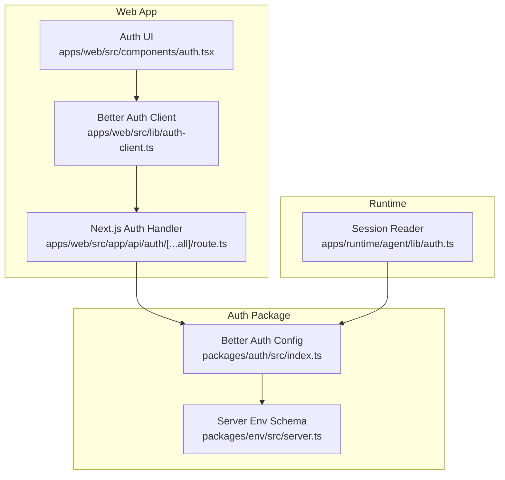
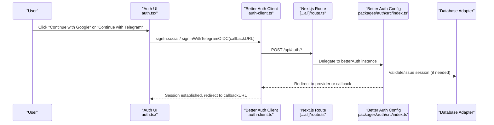
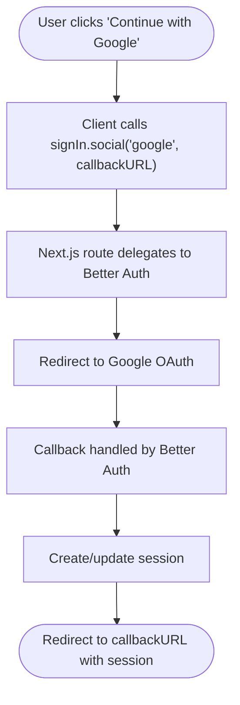
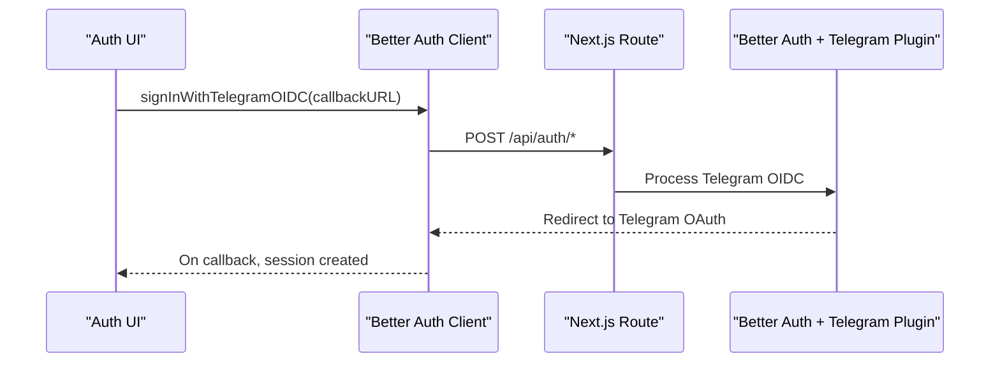
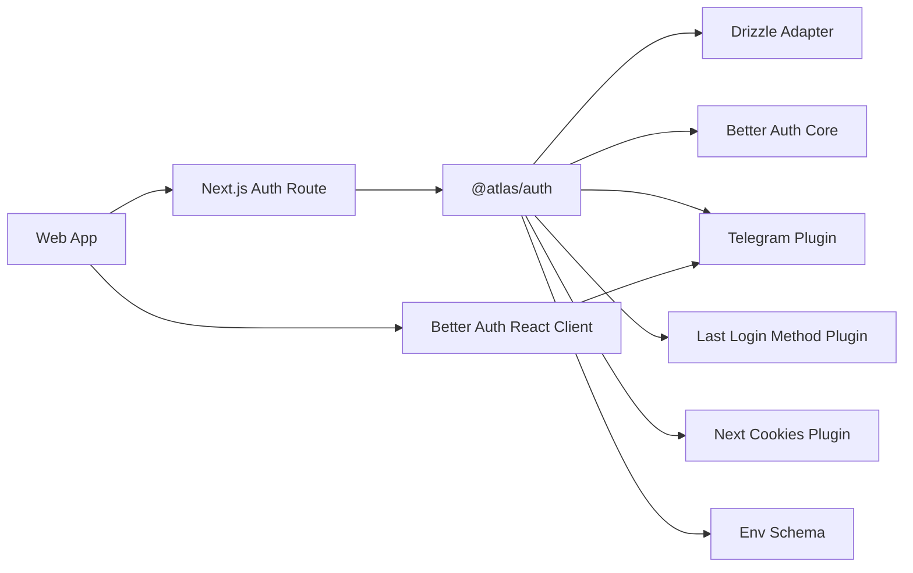

# Authentication Providers

<cite>
**Referenced Files in This Document**
- [packages/auth/src/index.ts](file://packages/auth/src/index.ts)
- [apps/web/src/app/api/auth/[...all]/route.ts](file://apps/web/src/app/api/auth/[...all]/route.ts)
- [apps/web/src/lib/auth-client.ts](file://apps/web/src/lib/auth-client.ts)
- [apps/web/src/components/auth.tsx](file://apps/web/src/components/auth.tsx)
- [packages/env/src/server.ts](file://packages/env/src/server.ts)
- [packages/auth/package.json](file://packages/auth/package.json)
- [apps/runtime/agent/lib/auth.ts](file://apps/runtime/agent/lib/auth.ts)
- [.agents/skills/better-auth-best-practices/SKILL.md](file://.agents/skills/better-auth-best-practices/SKILL.md)
</cite>

## Table of Contents

1. Introduction
2. Project Structure
3. Core Components
4. Architecture Overview
5. Detailed Component Analysis
6. Dependency Analysis
7. Performance Considerations
8. Troubleshooting Guide
9. Conclusion

## Introduction

This document explains how authentication providers are configured and used in the Atlas system, with a focus on Google OAuth and Telegram bot integration via Better Auth. It covers environment configuration, provider setup, client-side flows, runtime session usage, adding new providers, error handling, and security considerations such as secret management, CORS/trusted origins, and cookie behavior.

## Project Structure

Atlas centralizes authentication configuration in a dedicated auth package and exposes it to the Next.js app through an API route. The web client uses a Better Auth React client with plugins for Telegram OIDC and last login method tracking. Environment variables are validated centrally and consumed by both server and client code.

**Diagram sources**

- [apps/web/src/components/auth.tsx:9-20](file://apps/web/src/components/auth.tsx#L9-L20)
- [apps/web/src/lib/auth-client.ts:1-7](file://apps/web/src/lib/auth-client.ts#L1-L7)
- [apps/web/src/app/api/auth/[...all]/route.ts:1-5](file://apps/web/src/app/api/auth/[...all]/route.ts#L1-L5)
- [packages/auth/src/index.ts:10-40](file://packages/auth/src/index.ts#L10-L40)
- [packages/env/src/server.ts:5-26](file://packages/env/src/server.ts#L5-L26)
- [apps/runtime/agent/lib/auth.ts:1-25](file://apps/runtime/agent/lib/auth.ts#L1-L25)

**Section sources**

- [packages/auth/src/index.ts:10-40](file://packages/auth/src/index.ts#L10-L40)
- [apps/web/src/app/api/auth/[...all]/route.ts:1-5](file://apps/web/src/app/api/auth/[...all]/route.ts#L1-L5)
- [apps/web/src/lib/auth-client.ts:1-7](file://apps/web/src/lib/auth-client.ts#L1-L7)
- [apps/web/src/components/auth.tsx:9-20](file://apps/web/src/components/auth.tsx#L9-L20)
- [packages/env/src/server.ts:5-26](file://packages/env/src/server.ts#L5-L26)
- [apps/runtime/agent/lib/auth.ts:1-25](file://apps/runtime/agent/lib/auth.ts#L1-L25)

## Core Components

- Server-side Better Auth configuration:
  - Initializes database adapter (Drizzle), email/password, plugins (Telegram, last login method, Next.js cookies), social providers (Google), secrets, and trusted origins.
- Next.js API route:
  - Exposes Better Auth endpoints using the Next.js handler wrapper.
- Web client:
  - Creates a Better Auth React client with Telegram OIDC plugin and last login method plugin.
  - Provides UI handlers to start Google and Telegram sign-in flows.
- Environment schema:
  - Validates required environment variables for auth, Google, Telegram, CORS, and base URL.
- Runtime session reader:
  - Reads the current session from Better Auth to extract user attributes for agent channels.

**Section sources**

- [packages/auth/src/index.ts:10-40](file://packages/auth/src/index.ts#L10-L40)
- [apps/web/src/app/api/auth/[...all]/route.ts:1-5](file://apps/web/src/app/api/auth/[...all]/route.ts#L1-L5)
- [apps/web/src/lib/auth-client.ts:1-7](file://apps/web/src/lib/auth-client.ts#L1-L7)
- [apps/web/src/components/auth.tsx:9-20](file://apps/web/src/components/auth.tsx#L9-L20)
- [packages/env/src/server.ts:5-26](file://packages/env/src/server.ts#L5-L26)
- [apps/runtime/agent/lib/auth.ts:1-25](file://apps/runtime/agent/lib/auth.ts#L1-L25)

## Architecture Overview

The authentication flow spans client UI, Better Auth client, Next.js API route, and server-side config. Google and Telegram flows are initiated from the UI, routed through the shared API, and processed by Better Auth with configured providers and plugins.

**Diagram sources**

- [apps/web/src/components/auth.tsx:9-20](file://apps/web/src/components/auth.tsx#L9-L20)
- [apps/web/src/lib/auth-client.ts:1-7](file://apps/web/src/lib/auth-client.ts#L1-L7)
- [apps/web/src/app/api/auth/[...all]/route.ts:1-5](file://apps/web/src/app/api/auth/[...all]/route.ts#L1-L5)
- [packages/auth/src/index.ts:10-40](file://packages/auth/src/index.ts#L10-L40)

## Detailed Component Analysis

### Google OAuth Provider

- Configuration:
  - Enabled via socialProviders with clientId and clientSecret sourced from environment variables.
- Client-side flow:
  - UI triggers signIn.social(provider: "google") with a callback URL.
- Security notes:
  - Ensure GOOGLE_CLIENT_ID and GOOGLE_CLIENT_SECRET are set and not exposed to the client.
  - Configure trustedOrigins to include your frontend origin(s).
  - Use secure cookies in production per best practices.

**Diagram sources**

- [apps/web/src/components/auth.tsx:9-14](file://apps/web/src/components/auth.tsx#L9-L14)
- [apps/web/src/app/api/auth/[...all]/route.ts:1-5](file://apps/web/src/app/api/auth/[...all]/route.ts#L1-L5)
- [packages/auth/src/index.ts:32-37](file://packages/auth/src/index.ts#L32-L37)

**Section sources**

- [packages/auth/src/index.ts:32-37](file://packages/auth/src/index.ts#L32-L37)
- [apps/web/src/components/auth.tsx:9-14](file://apps/web/src/components/auth.tsx#L9-L14)
- [packages/env/src/server.ts:18-19](file://packages/env/src/server.ts#L18-L19)

### Telegram Bot Integration (Better Auth)

- Configuration:
  - Telegram plugin enabled with botToken and botUsername from environment variables.
- Client-side flow:
  - UI triggers signInWithTelegramOIDC with a callback URL.
- Message-based authentication:
  - Telegram OIDC typically involves initiating the flow from the client and completing it via Telegram’s OAuth mechanism; the client handles redirection and callback processing.
- Security notes:
  - Keep TELEGRAM_BOT_TOKEN and TELEGRAM_BOT_USERNAME secret and only available server-side.
  - Validate trusted origins to prevent CSRF and origin-based attacks.

**Diagram sources**

- [apps/web/src/components/auth.tsx:16-20](file://apps/web/src/components/auth.tsx#L16-L20)
- [apps/web/src/lib/auth-client.ts:1-7](file://apps/web/src/lib/auth-client.ts#L1-L7)
- [packages/auth/src/index.ts:23-28](file://packages/auth/src/index.ts#L23-L28)

**Section sources**

- [packages/auth/src/index.ts:23-28](file://packages/auth/src/index.ts#L23-L28)
- [apps/web/src/components/auth.tsx:16-20](file://apps/web/src/components/auth.tsx#L16-L20)
- [packages/env/src/server.ts:24-25](file://packages/env/src/server.ts#L24-L25)

### Adding New Authentication Providers

- Steps:
  - Add provider credentials to environment variables and validate them in the server env schema.
  - Extend socialProviders in the Better Auth config with the new provider’s clientId and clientSecret.
  - If the provider requires a custom plugin, add it to the plugins array.
  - Update the client if necessary (e.g., enable a client plugin for the provider).
  - Add UI buttons to trigger the provider’s sign-in flow with a proper callbackURL.
- Example pattern:
  - Follow the existing Google and Telegram patterns for consistency.

**Section sources**

- [packages/auth/src/index.ts:23-37](file://packages/auth/src/index.ts#L23-L37)
- [packages/env/src/server.ts:5-26](file://packages/env/src/server.ts#L5-L26)
- [apps/web/src/components/auth.tsx:9-20](file://apps/web/src/components/auth.tsx#L9-L20)

### Environment Variables and Provider Settings

- Required server variables:
  - BETTER_AUTH_URL, BETTER_AUTH_SECRET, CORS_ORIGIN, DATABASE_URL, AI_GATEWAY_API_KEY, ATLAS_API_URL, ATLAS_CLIENT_ID, ATLAS_CLIENT_SECRET, COMPOSIO_API_KEY, RUNTIME_URL.
  - Provider-specific: GOOGLE_CLIENT_ID, GOOGLE_CLIENT_SECRET, TELEGRAM_BOT_TOKEN, TELEGRAM_BOT_USERNAME.
- Validation:
  - All variables are validated at startup; missing or invalid values will fail initialization.
- Best practices:
  - Store secrets in a secure vault or platform secret manager.
  - Never expose sensitive variables to the client.

**Section sources**

- [packages/env/src/server.ts:5-26](file://packages/env/src/server.ts#L5-L26)

### Runtime Session Usage

- The runtime reads the current session via Better Auth’s API to extract user attributes (email, name, picture) and principal identifiers for agent channels.
- This enables consistent authorization across services that rely on the same session.

**Section sources**

- [apps/runtime/agent/lib/auth.ts:1-25](file://apps/runtime/agent/lib/auth.ts#L1-L25)

## Dependency Analysis

- The auth package depends on:
  - Database adapter (Drizzle) and schema.
  - Better Auth core and plugins (Telegram, last login method, Next.js cookies).
  - Environment validation module.
- The web app depends on:
  - Better Auth React client and Telegram client plugin.
  - The Next.js route that proxies to Better Auth.
- External integrations:
  - Google OAuth and Telegram OAuth are external identity providers.

**Diagram sources**

- [packages/auth/package.json:13-19](file://packages/auth/package.json#L13-L19)
- [packages/auth/src/index.ts:1-9](file://packages/auth/src/index.ts#L1-L9)
- [apps/web/src/lib/auth-client.ts:1-7](file://apps/web/src/lib/auth-client.ts#L1-L7)
- [apps/web/src/app/api/auth/[...all]/route.ts:1-5](file://apps/web/src/app/api/auth/[...all]/route.ts#L1-L5)

**Section sources**

- [packages/auth/package.json:13-19](file://packages/auth/package.json#L13-L19)
- [packages/auth/src/index.ts:1-9](file://packages/auth/src/index.ts#L1-L9)
- [apps/web/src/lib/auth-client.ts:1-7](file://apps/web/src/lib/auth-client.ts#L1-L7)
- [apps/web/src/app/api/auth/[...all]/route.ts:1-5](file://apps/web/src/app/api/auth/[...all]/route.ts#L1-L5)

## Performance Considerations

- Session storage:
  - Prefer secondary storage (e.g., Redis/KV) for sessions and rate limiting when scaling.
  - If no database is used, enable cookie cache for stateless sessions.
- Cookie strategies:
  - Choose compact (default), JWT, or JWE based on security and size needs.
- Rate limiting:
  - Enable rate limiting with appropriate window and max settings to protect against abuse.

**Section sources**

- [.agents/skills/better-auth-best-practices/SKILL.md:78-93](file://.agents/skills/better-auth-best-practices/SKILL.md#L78-L93)
- [.agents/skills/better-auth-best-practices/SKILL.md:114-126](file://.agents/skills/better-auth-best-practices/SKILL.md#L114-L126)

## Troubleshooting Guide

- Common issues:
  - Missing or invalid environment variables cause initialization failures; ensure all required keys are present and valid.
  - CORS/trusted origins misconfiguration can block cross-origin requests; verify CORS_ORIGIN matches your frontend domain.
  - Google “App is blocked” or disabled APIs require reviewing scopes and enabling required APIs in the Google Cloud project.
  - Telegram OIDC failures often stem from incorrect bot token or username; verify TELEGRAM_BOT_TOKEN and TELEGRAM_BOT_USERNAME.
- Error handling strategy:
  - Branch on stable error codes rather than parsing messages.
  - For expired or missing sessions, restart the authorization flow.
  - For service unavailability, retry once if marked retryable.
- Recovery steps:
  - Reconnect provider accounts when tokens are revoked or expired.
  - Regenerate connect links or refresh OAuth sessions as needed.

**Section sources**

- [.agents/skills/composio/references/errors.md:33-54](file://.agents/skills/composio/references/errors.md#L33-L54)
- [.agents/skills/atlas-flight-booking/references/error-handling.md:1-17](file://.agents/skills/atlas-flight-booking/references/error-handling.md#L1-L17)

## Conclusion

Atlas integrates Google OAuth and Telegram via Better Auth with a clean separation between server configuration, Next.js routing, and client interactions. Environment variables are strictly validated, and security is enforced through trusted origins and secure cookie practices. To extend authentication, follow the established patterns for provider configuration, client plugins, and UI flows while adhering to the security and performance recommendations outlined above.
