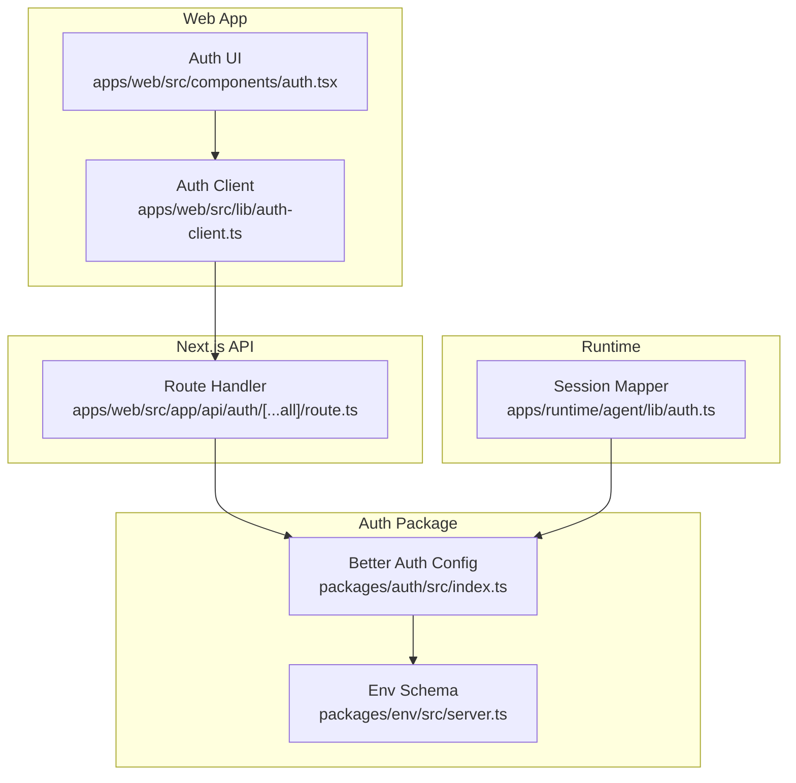
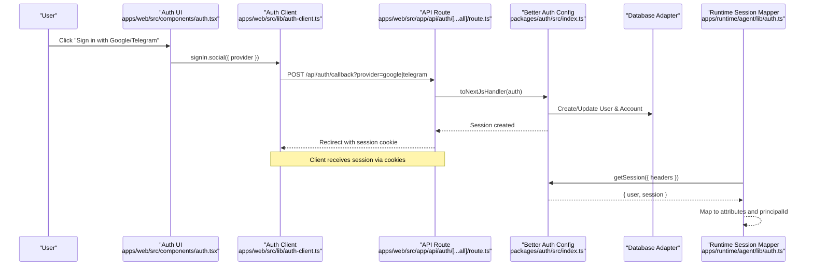
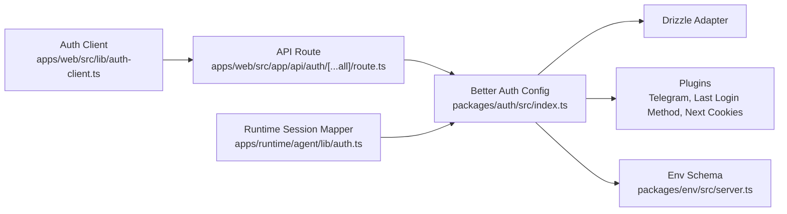
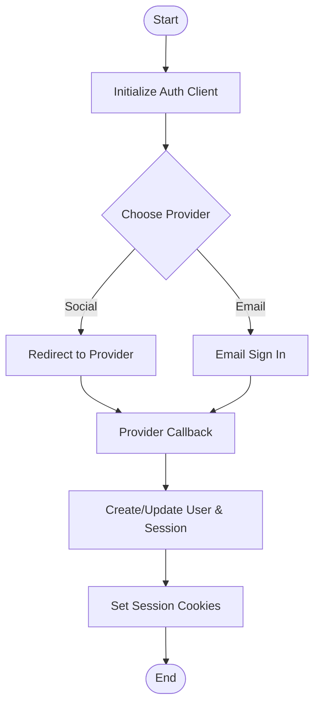

# Custom Authentication Providers

<cite>
**Referenced Files in This Document**
- [packages/auth/src/index.ts](file://packages/auth/src/index.ts)
- [apps/web/src/app/api/auth/[...all]/route.ts](file://apps/web/src/app/api/auth/[...all]/route.ts)
- [apps/web/src/lib/auth-client.ts](file://apps/web/src/lib/auth-client.ts)
- [apps/web/src/components/auth.tsx](file://apps/web/src/components/auth.tsx)
- [packages/env/src/server.ts](file://packages/env/src/server.ts)
- [apps/runtime/agent/lib/auth.ts](file://apps/runtime/agent/lib/auth.ts)
- [.agents/skills/better-auth-best-practices/SKILL.md](file://.agents/skills/better-auth-best-practices/SKILL.md)
</cite>

## Table of Contents

1. Introduction
2. Project Structure
3. Core Components
4. Architecture Overview
5. Detailed Component Analysis
6. Dependency Analysis
7. Performance Considerations
8. Troubleshooting Guide
9. Conclusion
10. Appendices

## Introduction

This document explains how to implement custom authentication providers in the Atlas system by extending Better Auth beyond Google and Telegram. It covers provider interface requirements, callback handling, user data mapping, configuration structure for socialProviders and plugins, environment variable management, error handling, session patterns, testing strategies, debugging flows, backward compatibility, security best practices, rate limiting, and graceful degradation when external identity services are unavailable.

## Project Structure

Atlas centralizes authentication configuration in a dedicated package and exposes it via Next.js API routes. The web app integrates with the server auth through a client that includes provider-specific plugins. Environment variables are validated centrally and consumed by the auth module. A runtime channel demonstrates how sessions are read and mapped into an upstream service.

**Diagram sources**

- [apps/web/src/components/auth.tsx:9-20](file://apps/web/src/components/auth.tsx#L9-L20)
- [apps/web/src/lib/auth-client.ts:1-7](file://apps/web/src/lib/auth-client.ts#L1-L7)
- [apps/web/src/app/api/auth/[...all]/route.ts:1-5](file://apps/web/src/app/api/auth/[...all]/route.ts#L1-L5)
- [packages/auth/src/index.ts:10-42](file://packages/auth/src/index.ts#L10-L42)
- [packages/env/src/server.ts:5-28](file://packages/env/src/server.ts#L5-L28)
- [apps/runtime/agent/lib/auth.ts:4-25](file://apps/runtime/agent/lib/auth.ts#L4-L25)

**Section sources**

- [packages/auth/src/index.ts:10-42](file://packages/auth/src/index.ts#L10-L42)
- [apps/web/src/app/api/auth/[...all]/route.ts:1-5](file://apps/web/src/app/api/auth/[...all]/route.ts#L1-L5)
- [apps/web/src/lib/auth-client.ts:1-7](file://apps/web/src/lib/auth-client.ts#L1-L7)
- [apps/web/src/components/auth.tsx:9-20](file://apps/web/src/components/auth.tsx#L9-L20)
- [packages/env/src/server.ts:5-28](file://packages/env/src/server.ts#L5-L28)
- [apps/runtime/agent/lib/auth.ts:4-25](file://apps/runtime/agent/lib/auth.ts#L4-L25)

## Core Components

- Better Auth configuration: Centralized in the auth package where database adapter, email/password, plugins (including Telegram), secret, baseURL, trustedOrigins, and socialProviders are defined.
- Next.js route handler: Proxies all /api/auth requests to Better Auth using the provided adapter.
- Web client: Initializes the Better Auth React client with provider-specific plugins (e.g., Telegram) and last login method tracking.
- Environment schema: Validates required keys such as BETTER_AUTH_SECRET, BETTER_AUTH_URL, CORS_ORIGIN, GOOGLE_CLIENT_ID/SECRET, TELEGRAM_BOT_TOKEN/USERNAME, and others.
- Runtime session mapper: Reads the current session from Better Auth and maps it into attributes expected by the runtime’s auth abstraction.

Key responsibilities:

- Provider registration via socialProviders or plugins.
- Secure configuration via environment variables.
- Session retrieval and normalization for downstream consumers.

**Section sources**

- [packages/auth/src/index.ts:10-42](file://packages/auth/src/index.ts#L10-L42)
- [apps/web/src/app/api/auth/[...all]/route.ts:1-5](file://apps/web/src/app/api/auth/[...all]/route.ts#L1-L5)
- [apps/web/src/lib/auth-client.ts:1-7](file://apps/web/src/lib/auth-client.ts#L1-L7)
- [packages/env/src/server.ts:5-28](file://packages/env/src/server.ts#L5-L28)
- [apps/runtime/agent/lib/auth.ts:4-25](file://apps/runtime/agent/lib/auth.ts#L4-L25)

## Architecture Overview

The authentication flow spans the web UI, the Next.js API route, and the centralized Better Auth configuration. Clients call provider-specific sign-in methods; the server validates credentials or OAuth tokens, creates or updates users and accounts, issues sessions, and returns results to the client. Downstream systems can read the session via the same API.

**Diagram sources**

- [apps/web/src/components/auth.tsx:9-20](file://apps/web/src/components/auth.tsx#L9-L20)
- [apps/web/src/lib/auth-client.ts:1-7](file://apps/web/src/lib/auth-client.ts#L1-L7)
- [apps/web/src/app/api/auth/[...all]/route.ts:1-5](file://apps/web/src/app/api/auth/[...all]/route.ts#L1-L5)
- [packages/auth/src/index.ts:10-42](file://packages/auth/src/index.ts#L10-L42)
- [apps/runtime/agent/lib/auth.ts:4-25](file://apps/runtime/agent/lib/auth.ts#L4-L25)

## Detailed Component Analysis

### Better Auth Configuration and Provider Registration

- Database adapter is configured with Drizzle and PostgreSQL provider.
- Email and password authentication is enabled.
- Plugins include Telegram OIDC, last login method tracking, and Next.js cookie support.
- Social providers are registered under socialProviders (Google example).
- Secret and baseURL are sourced from environment validation.
- Trusted origins restrict CSRF-protected endpoints.

To add a new provider:

- For built-in OAuth providers: Add entries under socialProviders with clientId and clientSecret from environment.
- For third-party OIDC/OAuth: Use the genericOAuth plugin or a provider-specific plugin and register it in the plugins array.
- Ensure environment variables are added to the env schema and referenced in configuration.

Provider interface requirements:

- Provide clientId/clientSecret or equivalent credentials.
- Define redirect URLs consistent with baseURL and basePath.
- Map provider scopes to required user profile fields.
- Handle token refresh if applicable.

Callback handlers:

- Better Auth handles OAuth callbacks automatically when providers are registered.
- For custom plugins, implement callback hooks to normalize user profiles and link accounts.

User data mapping:

- Normalize provider profile fields to standard user attributes (email, name, image).
- Persist account linkage via Better Auth’s account model.

Environment variables:

- Add new keys to the env schema and reference them in configuration.
- Validate presence and format at runtime.

Security considerations:

- Store secrets in environment only.
- Enforce HTTPS and set baseURL correctly.
- Configure trustedOrigins to limit CSRF exposure.

**Section sources**

- [packages/auth/src/index.ts:10-42](file://packages/auth/src/index.ts#L10-L42)
- [packages/env/src/server.ts:5-28](file://packages/env/src/server.ts#L5-L28)
- [.agents/skills/better-auth-best-practices/SKILL.md:49-63](file://.agents/skills/better-auth-best-practices/SKILL.md#L49-L63)

### Next.js API Route Handler

- Exposes GET and POST handlers for all /api/auth paths.
- Delegates request processing to Better Auth’s Next.js adapter.

When adding a new provider:

- No changes needed to this file unless you customize routing or middleware around auth endpoints.

**Section sources**

- [apps/web/src/app/api/auth/[...all]/route.ts:1-5](file://apps/web/src/app/api/auth/[...all]/route.ts#L1-L5)

### Web Client and Provider Integration

- Initializes the React client with provider plugins (e.g., Telegram).
- Tracks last login method for UX improvements.

To integrate a new provider on the client:

- Import and add the provider’s client plugin to createAuthClient.
- Use signIn.social or provider-specific methods in UI components.

**Section sources**

- [apps/web/src/lib/auth-client.ts:1-7](file://apps/web/src/lib/auth-client.ts#L1-L7)
- [apps/web/src/components/auth.tsx:9-20](file://apps/web/src/components/auth.tsx#L9-L20)

### Runtime Session Mapping

- Retrieves the current session via Better Auth API using request headers.
- Maps session.user fields into attributes expected by the runtime’s auth abstraction.
- Returns principalId and issuer information for downstream services.

For custom providers:

- Ensure normalized fields (email, name, image) exist in session.user.
- Extend mapping logic if additional attributes are required.

**Section sources**

- [apps/runtime/agent/lib/auth.ts:4-25](file://apps/runtime/agent/lib/auth.ts#L4-L25)

### Step-by-Step: Adding a Custom OAuth Provider

1. Register provider credentials:
   - Add environment variables to the env schema.
   - Reference them in the Better Auth config under socialProviders or plugins.
2. Configure redirect URLs:
   - Ensure baseURL and basePath align with your deployment.
3. Implement profile mapping:
   - If using a custom plugin, map provider profile fields to standard user attributes.
4. Update client integration:
   - Add provider client plugin to createAuthClient.
5. Test the flow:
   - Trigger sign-in from the UI and verify session creation.
6. Handle errors:
   - Log provider errors and surface user-friendly messages.
7. Secure and monitor:
   - Enforce HTTPS, validate origins, and monitor rate limits.

**Section sources**

- [packages/auth/src/index.ts:10-42](file://packages/auth/src/index.ts#L10-L42)
- [packages/env/src/server.ts:5-28](file://packages/env/src/server.ts#L5-L28)
- [apps/web/src/lib/auth-client.ts:1-7](file://apps/web/src/lib/auth-client.ts#L1-L7)
- [apps/web/src/components/auth.tsx:9-20](file://apps/web/src/components/auth.tsx#L9-L20)

### Step-by-Step: Extending Email-Based Authentication

- Enable email and password authentication in the config.
- Use client methods to sign up/sign in with email.
- Optionally add plugins like magicLink or emailOtp for enhanced flows.
- Normalize user data consistently across providers.

**Section sources**

- [packages/auth/src/index.ts:10-42](file://packages/auth/src/index.ts#L10-L42)
- [.agents/skills/better-auth-best-practices/SKILL.md:49-63](file://.agents/skills/better-auth-best-practices/SKILL.md#L49-L63)

### Integrating Third-Party Identity Services

- Use genericOAuth or provider-specific plugins.
- Configure client credentials and scopes.
- Map provider responses to standardized user attributes.
- Handle token refresh and revocation gracefully.

**Section sources**

- [packages/auth/src/index.ts:10-42](file://packages/auth/src/index.ts#L10-L42)
- [.agents/skills/better-auth-best-practices/SKILL.md:139-151](file://.agents/skills/better-auth-best-practices/SKILL.md#L139-L151)

### Configuration Structure for New Providers

- socialProviders object: Add provider entries with required credentials.
- plugins array: Include provider-specific plugins or generic OAuth plugins.
- Environment variables: Add and validate new keys in the env schema.
- Trusted origins: Restrict allowed origins for CSRF protection.

**Section sources**

- [packages/auth/src/index.ts:10-42](file://packages/auth/src/index.ts#L10-L42)
- [packages/env/src/server.ts:5-28](file://packages/env/src/server.ts#L5-L28)

### Environment Variable Management

- All sensitive values must be present and valid at runtime.
- Use the centralized env schema to enforce constraints.
- Avoid hardcoding secrets; rely on environment injection.

**Section sources**

- [packages/env/src/server.ts:5-28](file://packages/env/src/server.ts#L5-L28)

### Provider-Specific Error Handling

- Distinguish between transient errors (rate limits, network issues) and permanent failures (invalid credentials).
- Surface user-friendly messages while logging internal causes.
- Retry transient errors with backoff; prompt re-authentication on permanent failures.

**Section sources**

- [.agents/skills/composio/references/errors.md:33-54](file://.agents/skills/composio/references/errors.md#L33-L54)

### User Profile Normalization

- Map provider fields to email, name, and optional image.
- Ensure consistency across all providers for downstream consumption.
- Validate required fields before creating or updating users.

**Section sources**

- [apps/runtime/agent/lib/auth.ts:4-25](file://apps/runtime/agent/lib/auth.ts#L4-L25)

### Session Management Patterns

- Prefer secondary storage for sessions when available; optionally persist to DB.
- Use cookies via Next.js adapter for seamless client-server sessions.
- Read sessions securely in downstream services using headers.

**Section sources**

- [.agents/skills/better-auth-best-practices/SKILL.md:78-84](file://.agents/skills/better-auth-best-practices/SKILL.md#L78-L84)
- [apps/runtime/agent/lib/auth.ts:4-25](file://apps/runtime/agent/lib/auth.ts#L4-L25)

### Testing Custom Providers

- Mock provider APIs to simulate success and failure scenarios.
- Verify environment validation and configuration loading.
- Assert session creation and user mapping outcomes.
- Test client-side flows with provider plugins enabled.

[No sources needed since this section provides general guidance]

### Debugging Authentication Flows

- Inspect browser redirects and cookies during OAuth flows.
- Check server logs for provider callback responses and errors.
- Validate baseURL and trustedOrigins settings.
- Use last login method tracking to diagnose provider selection issues.

**Section sources**

- [apps/web/src/lib/auth-client.ts:1-7](file://apps/web/src/lib/auth-client.ts#L1-L7)
- [packages/auth/src/index.ts:10-42](file://packages/auth/src/index.ts#L10-L42)

### Backward Compatibility Guidelines

- Keep existing provider configurations intact when adding new ones.
- Avoid breaking changes to session shape or API routes.
- Introduce new features behind feature flags or optional plugins.
- Maintain stable environment variable names and types.

[No sources needed since this section provides general guidance]

### Security Best Practices

- Enforce HTTPS and correct baseURL.
- Limit trustedOrigins to known domains.
- Rotate secrets regularly and store them securely.
- Minimize scopes requested from providers.
- Implement rate limiting and account lockout policies.

**Section sources**

- [packages/auth/src/index.ts:10-42](file://packages/auth/src/index.ts#L10-L42)
- [packages/env/src/server.ts:5-28](file://packages/env/src/server.ts#L5-L28)

### Rate Limiting and Graceful Degradation

- Use secondary storage for rate limiting and session caching.
- Detect provider outages and fall back to alternative methods (e.g., email/password).
- Return informative errors and retry policies for transient failures.

**Section sources**

- [.agents/skills/better-auth-best-practices/SKILL.md:49-63](file://.agents/skills/better-auth-best-practices/SKILL.md#L49-L63)

## Dependency Analysis

Atlas’s authentication depends on:

- Better Auth core and plugins for provider support and session handling.
- Drizzle adapter for database persistence.
- Next.js adapter for API routing and cookies.
- Environment validation for secure configuration.
- Web client plugins for provider-specific integrations.

**Diagram sources**

- [packages/auth/src/index.ts:10-42](file://packages/auth/src/index.ts#L10-L42)
- [apps/web/src/app/api/auth/[...all]/route.ts:1-5](file://apps/web/src/app/api/auth/[...all]/route.ts#L1-L5)
- [apps/web/src/lib/auth-client.ts:1-7](file://apps/web/src/lib/auth-client.ts#L1-L7)
- [packages/env/src/server.ts:5-28](file://packages/env/src/server.ts#L5-L28)
- [apps/runtime/agent/lib/auth.ts:4-25](file://apps/runtime/agent/lib/auth.ts#L4-L25)

**Section sources**

- [packages/auth/src/index.ts:10-42](file://packages/auth/src/index.ts#L10-L42)
- [apps/web/src/app/api/auth/[...all]/route.ts:1-5](file://apps/web/src/app/api/auth/[...all]/route.ts#L1-L5)
- [apps/web/src/lib/auth-client.ts:1-7](file://apps/web/src/lib/auth-client.ts#L1-L7)
- [packages/env/src/server.ts:5-28](file://packages/env/src/server.ts#L5-L28)
- [apps/runtime/agent/lib/auth.ts:4-25](file://apps/runtime/agent/lib/auth.ts#L4-L25)

## Performance Considerations

- Use secondary storage for sessions and rate limits to reduce database load.
- Cache provider metadata and tokens where appropriate.
- Minimize scope requests to reduce payload size and processing time.
- Monitor database query performance and indexes for session and account tables.

[No sources needed since this section provides general guidance]

## Troubleshooting Guide

Common issues and resolutions:

- Missing environment variables: Ensure all required keys are present and valid per the env schema.
- Redirect mismatches: Verify baseURL and basePath match your deployment domain.
- Provider errors: Check provider dashboards for app status, scopes, and quotas.
- Session not found: Confirm cookies are sent with requests and trustedOrigins is configured.
- Graceful degradation: When a provider is down, fallback to email/password or another provider.

**Section sources**

- [packages/env/src/server.ts:5-28](file://packages/env/src/server.ts#L5-L28)
- [packages/auth/src/index.ts:10-42](file://packages/auth/src/index.ts#L10-L42)
- [.agents/skills/composio/references/errors.md:33-54](file://.agents/skills/composio/references/errors.md#L33-L54)

## Conclusion

Atlas’s authentication architecture centralizes provider configuration, enforces secure environment setup, and provides clear extension points for custom OAuth and third-party identity services. By following the steps outlined—registering providers, mapping user profiles, configuring environment variables, and implementing robust error handling—you can extend authentication capabilities while maintaining security, performance, and reliability.

## Appendices

### Appendix A: Adding a New Provider Checklist

- Add environment variables to the env schema.
- Register provider in socialProviders or plugins.
- Configure redirect URLs and scopes.
- Map provider profile fields to standard attributes.
- Update client plugins and UI triggers.
- Test end-to-end flows and error cases.
- Monitor and log provider interactions.

[No sources needed since this section provides general guidance]

### Appendix B: Session Flow Diagram

[No sources needed since this diagram shows conceptual workflow, not actual code structure]
