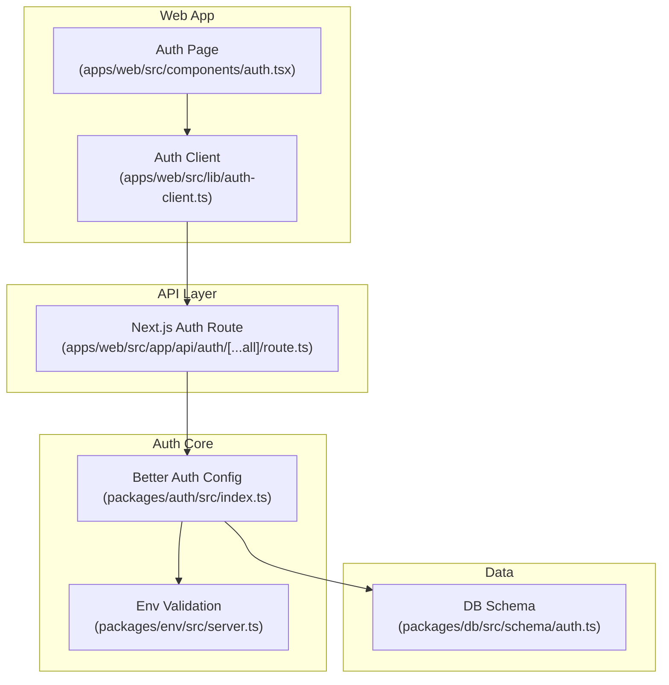
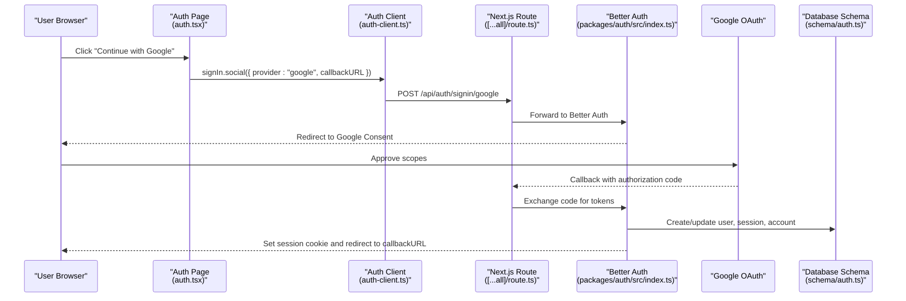
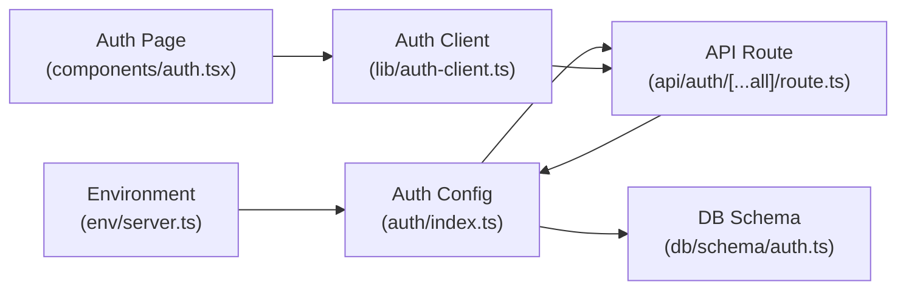

# Google OAuth Provider

<cite>
**Referenced Files in This Document**
- [packages/auth/src/index.ts](file://packages/auth/src/index.ts)
- [apps/web/src/app/api/auth/[...all]/route.ts](file://apps/web/src/app/api/auth/[...all]/route.ts)
- [packages/env/src/server.ts](file://packages/env/src/server.ts)
- [apps/web/src/components/auth.tsx](file://apps/web/src/components/auth.tsx)
- [apps/web/src/lib/auth-client.ts](file://apps/web/src/lib/auth-client.ts)
- [packages/db/src/schema/auth.ts](file://packages/db/src/schema/auth.ts)
- [.agents/skills/better-auth-best-practices/SKILL.md](file://.agents/skills/better-auth-best-practices/SKILL.md)
- [.agents/skills/composio/references/errors.md](file://.agents/skills/composio/references/errors.md)
</cite>

## Table of Contents

1. Introduction
2. Project Structure
3. Core Components
4. Architecture Overview
5. Detailed Component Analysis
6. Dependency Analysis
7. Performance Considerations
8. Troubleshooting Guide
9. Conclusion

## Introduction

This document explains how the Atlas system implements Google OAuth using Better Auth, including environment configuration, Google Cloud Console setup, authentication flow, scope and profile handling, account linking, security considerations (CORS and trusted origins), and troubleshooting for common issues such as invalid client IDs, redirect URI mismatches, and permission denials.

## Project Structure

The Google OAuth implementation spans several packages:

- Environment validation defines required variables including GOOGLE_CLIENT_ID and GOOGLE_CLIENT_SECRET.
- The auth package configures Better Auth with the Google social provider and database schema.
- The Next.js API route exposes the Better Auth endpoints to handle OAuth callbacks.
- The web app initiates Google sign-in via a client call and redirects to the server-side handler.
- Database schema stores users, sessions, and accounts (provider tokens and scopes).

**Diagram sources**

- [apps/web/src/components/auth.tsx:9-14](file://apps/web/src/components/auth.tsx#L9-L14)
- [apps/web/src/lib/auth-client.ts:1-7](file://apps/web/src/lib/auth-client.ts#L1-L7)
- [apps/web/src/app/api/auth/[...all]/route.ts:1-5](file://apps/web/src/app/api/auth/[...all]/route.ts#L1-L5)
- [packages/auth/src/index.ts:10-39](file://packages/auth/src/index.ts#L10-L39)
- [packages/env/src/server.ts:5-28](file://packages/env/src/server.ts#L5-L28)
- [packages/db/src/schema/auth.ts:4-64](file://packages/db/src/schema/auth.ts#L4-L64)

**Section sources**

- [packages/env/src/server.ts:5-28](file://packages/env/src/server.ts#L5-L28)
- [packages/auth/src/index.ts:10-39](file://packages/auth/src/index.ts#L10-L39)
- [apps/web/src/app/api/auth/[...all]/route.ts:1-5](file://apps/web/src/app/api/auth/[...all]/route.ts#L1-L5)
- [apps/web/src/components/auth.tsx:9-14](file://apps/web/src/components/auth.tsx#L9-L14)
- [apps/web/src/lib/auth-client.ts:1-7](file://apps/web/src/lib/auth-client.ts#L1-L7)
- [packages/db/src/schema/auth.ts:4-64](file://packages/db/src/schema/auth.ts#L4-L64)

## Core Components

- Environment configuration: Validates and exposes GOOGLE_CLIENT_ID and GOOGLE_CLIENT_SECRET alongside other runtime settings like BETTER_AUTH_URL and CORS_ORIGIN.
- Auth configuration: Initializes Better Auth with Drizzle adapter, email/password, Telegram plugin, last login method tracking, Next.js cookies support, Google social provider, and trusted origins.
- API route: Exposes Better Auth endpoints under /api/auth for all HTTP methods needed by OAuth flows.
- Web client: Initiates Google sign-in from the UI and sets a callback URL after successful authentication.
- Data model: Stores user profiles, sessions, and provider accounts (including access tokens, refresh tokens, scopes, and expiration times).

**Section sources**

- [packages/env/src/server.ts:5-28](file://packages/env/src/server.ts#L5-L28)
- [packages/auth/src/index.ts:10-39](file://packages/auth/src/index.ts#L10-L39)
- [apps/web/src/app/api/auth/[...all]/route.ts:1-5](file://apps/web/src/app/api/auth/[...all]/route.ts#L1-L5)
- [apps/web/src/components/auth.tsx:9-14](file://apps/web/src/components/auth.tsx#L9-L14)
- [packages/db/src/schema/auth.ts:4-64](file://packages/db/src/schema/auth.ts#L4-L64)

## Architecture Overview

The Google OAuth flow uses Better Auth’s built-in social provider integration:

- The client triggers a social sign-in request specifying the Google provider and a callback URL.
- The Next.js route proxies requests to Better Auth, which validates environment credentials and redirects the user to Google’s consent screen.
- After consent, Google redirects back to the configured callback; Better Auth exchanges the code for tokens, persists session and account data, and completes the login.

**Diagram sources**

- [apps/web/src/components/auth.tsx:9-14](file://apps/web/src/components/auth.tsx#L9-L14)
- [apps/web/src/lib/auth-client.ts:1-7](file://apps/web/src/lib/auth-client.ts#L1-L7)
- [apps/web/src/app/api/auth/[...all]/route.ts:1-5](file://apps/web/src/app/api/auth/[...all]/route.ts#L1-L5)
- [packages/auth/src/index.ts:10-39](file://packages/auth/src/index.ts#L10-L39)
- [packages/db/src/schema/auth.ts:4-64](file://packages/db/src/schema/auth.ts#L4-L64)

## Detailed Component Analysis

### Environment Configuration

- Required variables include GOOGLE_CLIENT_ID and GOOGLE_CLIENT_SECRET, validated at startup to ensure they are present and correctly typed.
- Additional relevant variables include BETTER_AUTH_URL (base URL for auth endpoints) and CORS_ORIGIN (used as a trusted origin for CSRF protection).

Security notes:

- Keep secrets out of client bundles; these are server-only variables.
- Validate URLs and enforce minimum lengths to catch misconfigurations early.

**Section sources**

- [packages/env/src/server.ts:5-28](file://packages/env/src/server.ts#L5-L28)

### Auth Configuration (Better Auth)

- Social providers: Google is enabled with clientId and clientSecret sourced from environment variables.
- Plugins: Telegram OIDC, last login method tracking, and Next.js cookie handling are included.
- Trusted origins: CORS_ORIGIN is set as a trusted origin to protect against CSRF attacks.
- Database: Drizzle adapter configured with PostgreSQL provider and the shared schema.

Best practices:

- Use strong secrets for BETTER_AUTH_SECRET.
- Ensure BETTER_AUTH_URL matches your deployment domain.
- Restrict trustedOrigins to known domains.

**Section sources**

- [packages/auth/src/index.ts:10-39](file://packages/auth/src/index.ts#L10-L39)
- [.agents/skills/better-auth-best-practices/SKILL.md:49-63](file://.agents/skills/better-auth-best-practices/SKILL.md#L49-L63)

### API Route Exposure

- The Next.js route exports GET and POST handlers that forward requests to Better Auth, enabling standard OAuth endpoints without custom logic.

Operational note:

- All OAuth-related paths are handled centrally, simplifying maintenance and ensuring consistent behavior across providers.

**Section sources**

- [apps/web/src/app/api/auth/[...all]/route.ts:1-5](file://apps/web/src/app/api/auth/[...all]/route.ts#L1-L5)

### Web Client Initiation

- The UI component calls signIn.social with provider set to "google" and specifies a callback URL where the user should be redirected after successful authentication.
- The client includes plugins for Telegram and last login method tracking.

User experience:

- The page shows a button labeled "Continue with Google" and can highlight the last used login method.

**Section sources**

- [apps/web/src/components/auth.tsx:9-14](file://apps/web/src/components/auth.tsx#L9-L14)
- [apps/web/src/lib/auth-client.ts:1-7](file://apps/web/src/lib/auth-client.ts#L1-L7)

### Data Model and Account Linking

- Users: Store identity fields such as email, name, image, and optional provider-specific identifiers.
- Sessions: Track session tokens, expiry, IP, and user agent.
- Accounts: Persist provider tokens (access_token, refresh_token), scopes, and expiration timestamps per provider.

Account linking:

- Better Auth supports account linking; enable it via configuration options to allow multiple provider accounts to be associated with a single user.

**Section sources**

- [packages/db/src/schema/auth.ts:4-64](file://packages/db/src/schema/auth.ts#L4-L64)
- [.agents/skills/better-auth-best-practices/SKILL.md:96-103](file://.agents/skills/better-auth-best-practices/SKILL.md#L96-L103)

### Scope Permissions and Profile Handling

- Scopes: Configure requested scopes in the Google OAuth app on Google Cloud Console. At runtime, Better Auth will request the scopes defined there.
- Profile data: On successful sign-in, Better Auth retrieves the user profile from Google and maps it into the user record (e.g., email, name, image).
- Token storage: Access and refresh tokens along with their expiration and requested scopes are stored in the account table for future API calls.

Implementation guidance:

- Request only necessary scopes to minimize friction during consent.
- If additional Google APIs are needed later, update scopes and prompt re-consent when required.

**Section sources**

- [packages/db/src/schema/auth.ts:41-64](file://packages/db/src/schema/auth.ts#L41-L64)
- [.agents/skills/better-auth-best-practices/SKILL.md:96-103](file://.agents/skills/better-auth-best-practices/SKILL.md#L96-L103)

### Security Considerations

- CORS and trusted origins: Set CORS_ORIGIN and configure trustedOrigins to restrict CSRF-protected operations to known domains.
- Secure cookies: Prefer secure cookie settings in production to prevent interception.
- Rate limiting: Enable rate limiting to mitigate brute-force attempts and abuse.

References:

- Trusted origins and core options are documented in the best practices guide.
- Cookie cache strategies and security toggles are available for advanced hardening.

**Section sources**

- [packages/auth/src/index.ts:32-39](file://packages/auth/src/index.ts#L32-L39)
- [.agents/skills/better-auth-best-practices/SKILL.md:49-63](file://.agents/skills/better-auth-best-practices/SKILL.md#L49-L63)
- [.agents/skills/better-auth-best-practices/SKILL.md:86-126](file://.agents/skills/better-auth-best-practices/SKILL.md#L86-L126)

## Dependency Analysis

The following diagram highlights key dependencies among components involved in Google OAuth:

**Diagram sources**

- [packages/env/src/server.ts:5-28](file://packages/env/src/server.ts#L5-L28)
- [packages/auth/src/index.ts:10-39](file://packages/auth/src/index.ts#L10-L39)
- [apps/web/src/app/api/auth/[...all]/route.ts:1-5](file://apps/web/src/app/api/auth/[...all]/route.ts#L1-L5)
- [apps/web/src/components/auth.tsx:9-14](file://apps/web/src/components/auth.tsx#L9-L14)
- [apps/web/src/lib/auth-client.ts:1-7](file://apps/web/src/lib/auth-client.ts#L1-L7)
- [packages/db/src/schema/auth.ts:4-64](file://packages/db/src/schema/auth.ts#L4-L64)

**Section sources**

- [packages/env/src/server.ts:5-28](file://packages/env/src/server.ts#L5-L28)
- [packages/auth/src/index.ts:10-39](file://packages/auth/src/index.ts#L10-L39)
- [apps/web/src/app/api/auth/[...all]/route.ts:1-5](file://apps/web/src/app/api/auth/[...all]/route.ts#L1-L5)
- [apps/web/src/components/auth.tsx:9-14](file://apps/web/src/components/auth.tsx#L9-L14)
- [apps/web/src/lib/auth-client.ts:1-7](file://apps/web/src/lib/auth-client.ts#L1-L7)
- [packages/db/src/schema/auth.ts:4-64](file://packages/db/src/schema/auth.ts#L4-L64)

## Performance Considerations

- Minimize scopes to reduce consent time and token exchange overhead.
- Use appropriate session storage (database or secondary storage) based on scale requirements.
- Leverage cookie cache strategies to balance security and performance.
- Avoid unnecessary network calls by caching non-sensitive user profile data where appropriate.

[No sources needed since this section provides general guidance]

## Troubleshooting Guide

Common Google OAuth issues and resolutions:

- Invalid client ID or secret: Verify GOOGLE_CLIENT_ID and GOOGLE_CLIENT_SECRET in environment variables match those created in Google Cloud Console.
- Redirect URI mismatch: Ensure the authorized redirect URIs in Google Cloud Console exactly match the callback URL used by Better Auth (typically under /api/auth/callback/google).
- Permission denials or blocked app: Remove unnecessary scopes or verify your Google OAuth app status. If the app is unverified, review policy constraints and consider verification for production.
- Token expiration or revocation: Reconnect the provider account if tokens are expired or revoked; Better Auth will prompt re-consent on next use.

Additional references:

- Best practices for Better Auth configuration and security toggles.
- Common provider constraints and branding guidance for production.

**Section sources**

- [.agents/skills/composio/references/errors.md:33-54](file://.agents/skills/composio/references/errors.md#L33-L54)
- [.agents/skills/better-auth-best-practices/SKILL.md:114-126](file://.agents/skills/better-auth-best-practices/SKILL.md#L114-L126)

## Conclusion

Atlas integrates Google OAuth through Better Auth with robust environment validation, clear API exposure, and persistent session and account management. By configuring Google Cloud Console correctly, setting appropriate scopes, and securing the application with trusted origins and secure cookies, you can provide a reliable and secure sign-in experience. Use the troubleshooting guidance to resolve common issues quickly and maintain a smooth user journey.

[No sources needed since this section summarizes without analyzing specific files]
