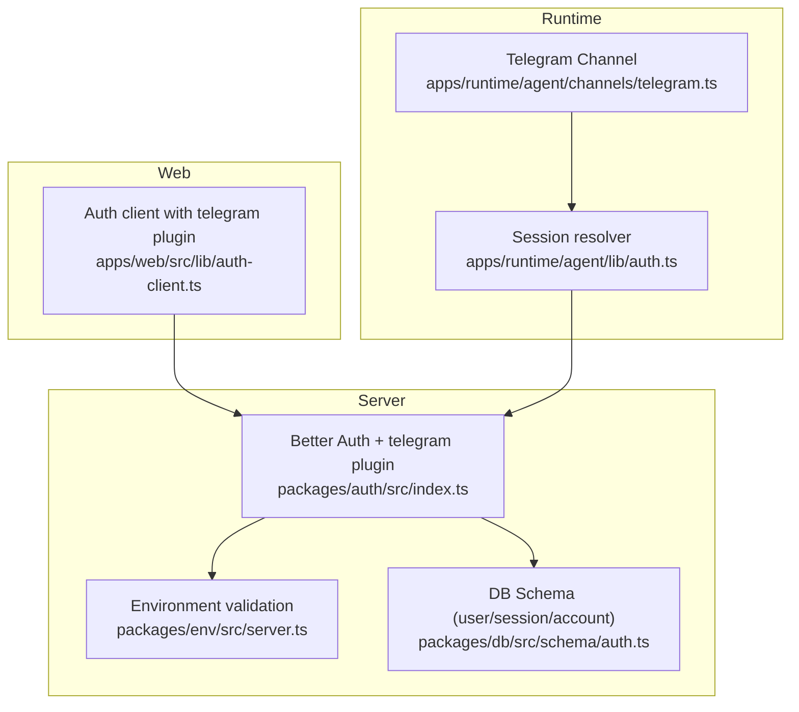
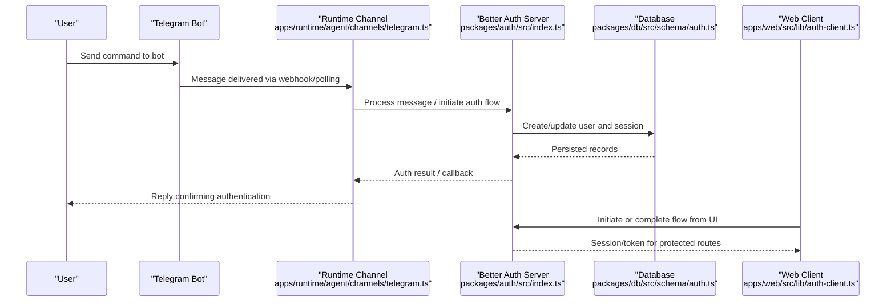
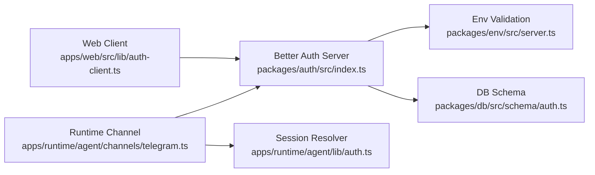

# Telegram Bot Provider

<cite>
**Referenced Files in This Document**
- [packages/auth/src/index.ts](file://packages/auth/src/index.ts)
- [apps/web/src/lib/auth-client.ts](file://apps/web/src/lib/auth-client.ts)
- [apps/runtime/agent/channels/telegram.ts](file://apps/runtime/agent/channels/telegram.ts)
- [apps/runtime/agent/lib/auth.ts](file://apps/runtime/agent/lib/auth.ts)
- [packages/env/src/server.ts](file://packages/env/src/server.ts)
- [packages/db/src/schema/auth.ts](file://packages/db/src/schema/auth.ts)
- [packages/auth/package.json](file://packages/auth/package.json)
</cite>

## Table of Contents

1. [Introduction](#introduction)
2. [Project Structure](#project-structure)
3. [Core Components](#core-components)
4. [Architecture Overview](#architecture-overview)
5. [Detailed Component Analysis](#detailed-component-analysis)
6. [Dependency Analysis](#dependency-analysis)
7. [Performance Considerations](#performance-considerations)
8. [Troubleshooting Guide](#troubleshooting-guide)
9. [Conclusion](#conclusion)

## Introduction

This document explains how the project integrates Telegram bot authentication using Better Auth’s telegram plugin. It covers environment configuration for the bot token and username, the message-based authentication flow where users authenticate by sending commands to a Telegram bot, webhook setup considerations, handling authentication callbacks, customizing messages, verifying login steps, and managing user sessions across conversations. Security guidance and troubleshooting tips for common Telegram issues are also included.

## Project Structure

The Telegram integration spans several layers:

- Server-side auth provider configuration with Better Auth and the telegram plugin
- Environment validation for required Telegram variables
- Client-side plugin enabling Telegram-based flows from the web app
- Runtime channel wiring for receiving and processing Telegram messages
- Session extraction used by runtime components to identify authenticated users
- Database schema that stores user identity fields including Telegram identifiers

**Diagram sources**

- [packages/auth/src/index.ts:10-40](file://packages/auth/src/index.ts#L10-L40)
- [packages/env/src/server.ts:5-28](file://packages/env/src/server.ts#L5-L28)
- [packages/db/src/schema/auth.ts:4-19](file://packages/db/src/schema/auth.ts#L4-L19)
- [apps/runtime/agent/channels/telegram.ts:1-5](file://apps/runtime/agent/channels/telegram.ts#L1-L5)
- [apps/runtime/agent/lib/auth.ts:4-25](file://apps/runtime/agent/lib/auth.ts#L4-L25)
- [apps/web/src/lib/auth-client.ts:1-7](file://apps/web/src/lib/auth-client.ts#L1-L7)

**Section sources**

- [packages/auth/src/index.ts:10-40](file://packages/auth/src/index.ts#L10-L40)
- [packages/env/src/server.ts:5-28](file://packages/env/src/server.ts#L5-L28)
- [packages/db/src/schema/auth.ts:4-19](file://packages/db/src/schema/auth.ts#L4-L19)
- [apps/runtime/agent/channels/telegram.ts:1-5](file://apps/runtime/agent/channels/telegram.ts#L1-L5)
- [apps/runtime/agent/lib/auth.ts:4-25](file://apps/runtime/agent/lib/auth.ts#L4-L25)
- [apps/web/src/lib/auth-client.ts:1-7](file://apps/web/src/lib/auth-client.ts#L1-L7)

## Core Components

- Better Auth server initialization with the telegram plugin configured via environment variables for bot token and bot username.
- Environment schema enforcing presence of TELEGRAM_BOT_TOKEN and TELEGRAM_BOT_USERNAME.
- Web client plugin enabling Telegram authentication flows from the frontend.
- Runtime Telegram channel that receives messages using the bot token.
- Session resolver that extracts authenticated user context for runtime operations.
- Database schema storing user identity fields including Telegram-specific attributes.

Key responsibilities:

- Configuration: Provide bot credentials and base URL to Better Auth.
- Messaging: Receive and process Telegram messages through the runtime channel.
- Authentication: Use Better Auth’s telegram plugin to handle message-based login flows.
- Sessions: Validate and propagate user sessions into runtime contexts.
- Persistence: Store user and session data in the database.

**Section sources**

- [packages/auth/src/index.ts:10-40](file://packages/auth/src/index.ts#L10-L40)
- [packages/env/src/server.ts:23-26](file://packages/env/src/server.ts#L23-L26)
- [apps/web/src/lib/auth-client.ts:1-7](file://apps/web/src/lib/auth-client.ts#L1-L7)
- [apps/runtime/agent/channels/telegram.ts:1-5](file://apps/runtime/agent/channels/telegram.ts#L1-L5)
- [apps/runtime/agent/lib/auth.ts:4-25](file://apps/runtime/agent/lib/auth.ts#L4-L25)
- [packages/db/src/schema/auth.ts:4-19](file://packages/db/src/schema/auth.ts#L4-L19)

## Architecture Overview

The system uses Better Auth as the central authentication service. The telegram plugin enables message-based authentication on Telegram. The runtime layer listens for Telegram messages and resolves sessions to authorize actions. The web client integrates the telegram plugin to initiate flows from the UI.

**Diagram sources**

- [apps/runtime/agent/channels/telegram.ts:1-5](file://apps/runtime/agent/channels/telegram.ts#L1-L5)
- [packages/auth/src/index.ts:10-40](file://packages/auth/src/index.ts#L10-L40)
- [packages/db/src/schema/auth.ts:4-19](file://packages/db/src/schema/auth.ts#L4-L19)
- [apps/web/src/lib/auth-client.ts:1-7](file://apps/web/src/lib/auth-client.ts#L1-L7)

## Detailed Component Analysis

### Better Auth Telegram Plugin Setup

- The server initializes Better Auth with the telegram plugin, passing botToken and botUsername from validated environment variables.
- Base URL is set for API endpoints used by clients and Telegram callbacks.
- Additional plugins include lastLoginMethod tracking and Next.js cookie support.

Implementation highlights:

- Plugin registration and configuration
- Environment-driven credentials
- Integration with Drizzle adapter and PostgreSQL schema

**Section sources**

- [packages/auth/src/index.ts:10-40](file://packages/auth/src/index.ts#L10-L40)
- [packages/env/src/server.ts:23-26](file://packages/env/src/server.ts#L23-L26)

### Environment Validation

- TELEGRAM_BOT_TOKEN and TELEGRAM_BOT_USERNAME are required and validated at startup.
- Other related settings like BETTER_AUTH_URL and CORS_ORIGIN ensure secure communication.

Security implications:

- Missing or invalid values will fail early during environment validation.
- Enforces non-empty strings for sensitive configuration.

**Section sources**

- [packages/env/src/server.ts:5-28](file://packages/env/src/server.ts#L5-L28)

### Web Client Integration

- The web client includes the telegram plugin to enable Telegram-based authentication flows from the browser.
- Last login method plugin helps track which provider was used for the most recent login.

Usage notes:

- Initialize once per application entrypoint.
- Use provided methods to trigger Telegram login flows and handle results.

**Section sources**

- [apps/web/src/lib/auth-client.ts:1-7](file://apps/web/src/lib/auth-client.ts#L1-L7)

### Runtime Telegram Channel

- The runtime exposes a Telegram channel configured with the bot token sourced from environment variables.
- This channel receives incoming messages and forwards them for processing within the agent runtime.

Operational notes:

- Ensure the runtime is deployed behind a publicly reachable endpoint if using webhooks.
- The channel relies on the same bot token used by Better Auth to maintain consistency.

**Section sources**

- [apps/runtime/agent/channels/telegram.ts:1-5](file://apps/runtime/agent/channels/telegram.ts#L1-L5)

### Session Resolution in Runtime

- The runtime resolves the current session from an incoming request using Better Auth’s API.
- If a valid session exists, it extracts user attributes and principal information for downstream tools and actions.

Behavior:

- Returns null when no session is present, preventing unauthorized access.
- Maps session data to runtime attributes for consistent context.

**Section sources**

- [apps/runtime/agent/lib/auth.ts:4-25](file://apps/runtime/agent/lib/auth.ts#L4-L25)

### Database Schema and Telegram Fields

- The user table includes fields for Telegram ID, username, and phone number, enabling linking Telegram identities to user accounts.
- Session and account tables follow standard patterns for tokens and provider associations.

Data model considerations:

- Unique constraints protect email uniqueness.
- Indexes optimize lookups for sessions and accounts by user.

**Section sources**

- [packages/db/src/schema/auth.ts:4-19](file://packages/db/src/schema/auth.ts#L4-L19)
- [packages/db/src/schema/auth.ts:21-39](file://packages/db/src/schema/auth.ts#L21-L39)
- [packages/db/src/schema/auth.ts:41-64](file://packages/db/src/schema/auth.ts#L41-L64)

### Dependency Graph

**Diagram sources**

- [apps/web/src/lib/auth-client.ts:1-7](file://apps/web/src/lib/auth-client.ts#L1-L7)
- [packages/auth/src/index.ts:10-40](file://packages/auth/src/index.ts#L10-L40)
- [packages/env/src/server.ts:5-28](file://packages/env/src/server.ts#L5-L28)
- [packages/db/src/schema/auth.ts:4-19](file://packages/db/src/schema/auth.ts#L4-L19)
- [apps/runtime/agent/channels/telegram.ts:1-5](file://apps/runtime/agent/channels/telegram.ts#L1-L5)
- [apps/runtime/agent/lib/auth.ts:4-25](file://apps/runtime/agent/lib/auth.ts#L4-L25)

**Section sources**

- [packages/auth/package.json:13-19](file://packages/auth/package.json#L13-L19)

## Dependency Analysis

- The auth package depends on better-auth and better-auth-telegram to provide Telegram authentication capabilities.
- The web app includes the telegram client plugin to interact with the backend auth service.
- Environment validation ensures required Telegram variables are present before starting services.

External dependencies:

- better-auth-telegram provides the telegram plugin and client utilities.
- Drizzle adapter integrates with PostgreSQL for persistence.

**Section sources**

- [packages/auth/package.json:13-19](file://packages/auth/package.json#L13-L19)
- [packages/auth/src/index.ts:1-9](file://packages/auth/src/index.ts#L1-L9)
- [apps/web/src/lib/auth-client.ts:1-7](file://apps/web/src/lib/auth-client.ts#L1-L7)

## Performance Considerations

- Prefer webhook delivery over long polling for lower latency and reduced resource usage.
- Cache frequently accessed user profiles and session metadata where appropriate.
- Avoid heavy computations in message handlers; delegate to background jobs if necessary.
- Ensure database indexes exist for frequent queries (sessions by userId, accounts by userId).

[No sources needed since this section provides general guidance]

## Troubleshooting Guide

Common issues and resolutions:

- Webhook failures:
  - Verify the public URL is reachable and correctly points to the runtime endpoint.
  - Check TLS certificates and firewall rules if applicable.
  - Confirm the bot token matches between Better Auth and the runtime channel.
- Message delivery problems:
  - Ensure the bot is registered with BotFather and has permissions to receive messages.
  - Validate that the bot username matches the configured TELEGRAM_BOT_USERNAME.
  - Inspect logs for rate limiting or throttling errors from Telegram.
- Authentication timeouts:
  - Increase timeout thresholds in client calls if network conditions are slow.
  - Retry failed requests with exponential backoff.
  - Validate that sessions are not expiring prematurely due to misconfigured expiration times.
- Unauthorized access prevention:
  - Always validate sessions in runtime handlers before executing privileged actions.
  - Restrict trusted origins to known domains.
  - Log and monitor failed authentication attempts for anomalies.

**Section sources**

- [apps/runtime/agent/channels/telegram.ts:1-5](file://apps/runtime/agent/channels/telegram.ts#L1-L5)
- [packages/auth/src/index.ts:10-40](file://packages/auth/src/index.ts#L10-L40)
- [apps/runtime/agent/lib/auth.ts:4-25](file://apps/runtime/agent/lib/auth.ts#L4-L25)
- [packages/env/src/server.ts:23-26](file://packages/env/src/server.ts#L23-L26)

## Conclusion

The project integrates Telegram bot authentication via Better Auth’s telegram plugin, leveraging environment-driven configuration, a runtime channel for message handling, and robust session management. By following the setup steps, securing credentials, and applying the troubleshooting guidance, you can implement reliable message-based authentication flows for Telegram users while maintaining strong security and performance characteristics.

[No sources needed since this section summarizes without analyzing specific files]
