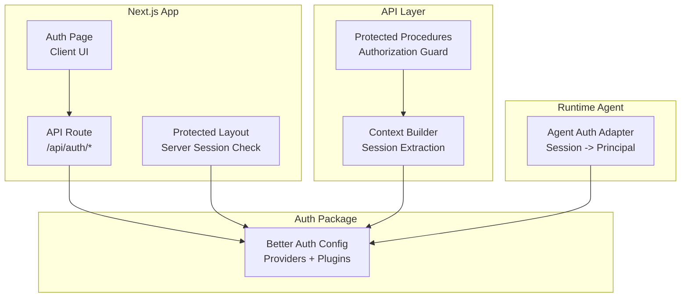
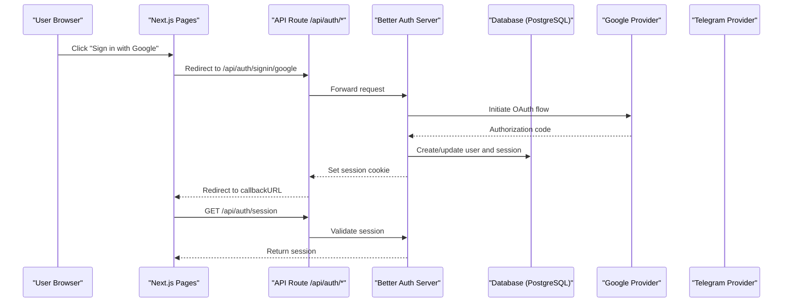
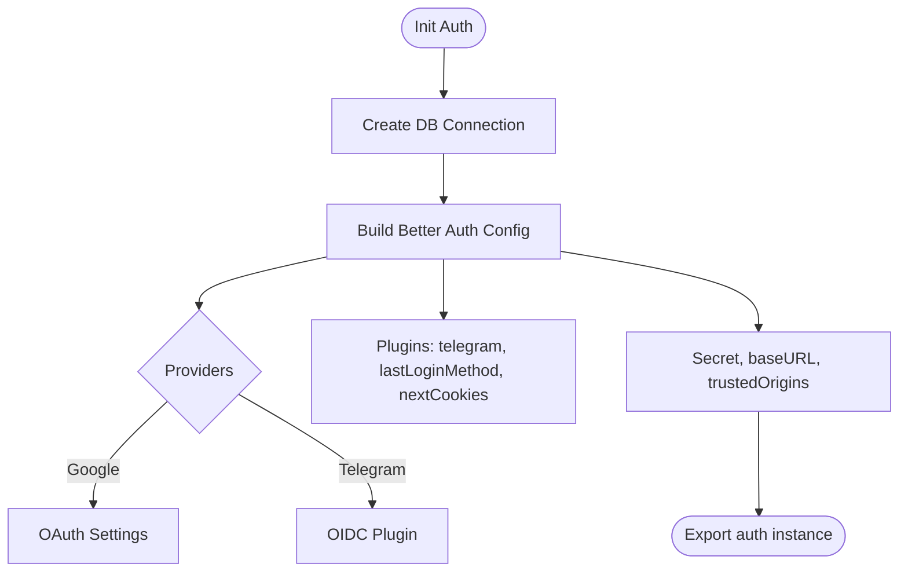
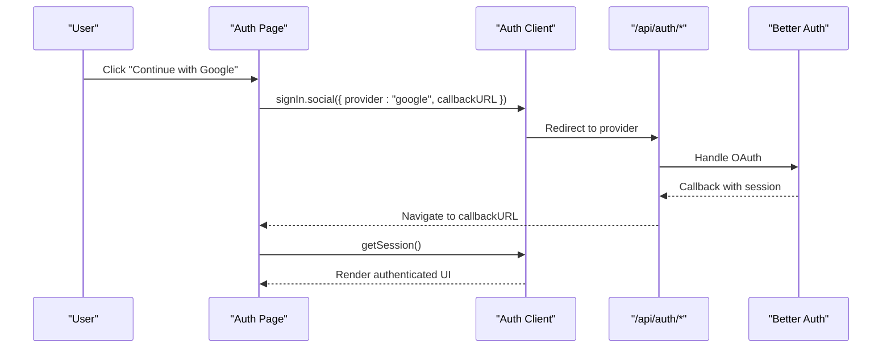
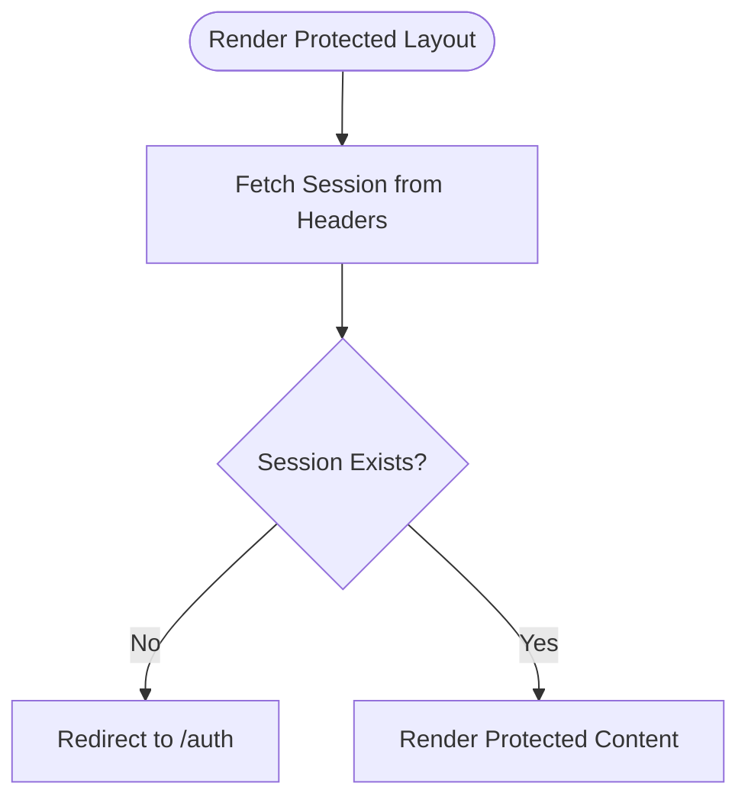
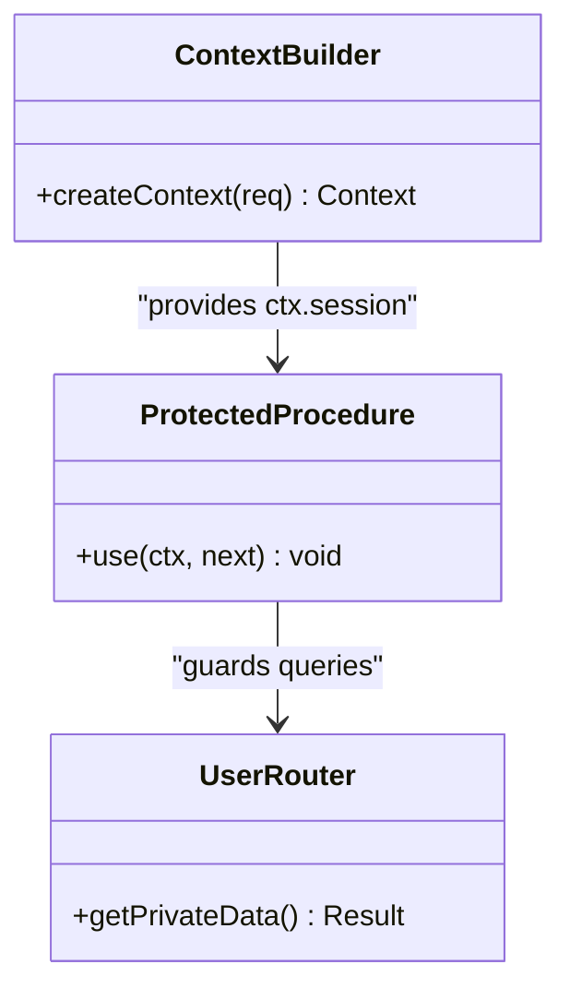
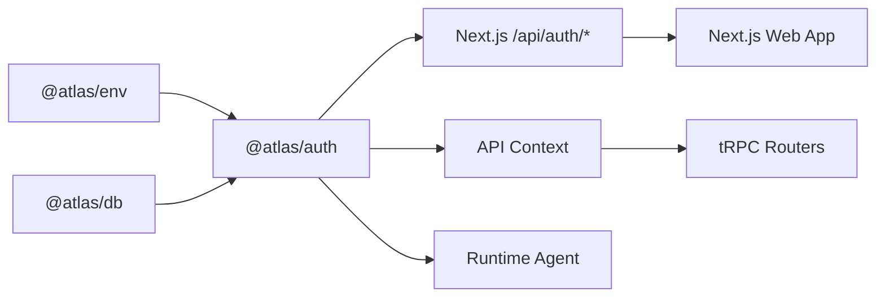

# Authentication System

<cite>
**Referenced Files in This Document**
- [index.ts](file://packages/auth/src/index.ts)
- [route.ts](file://apps/web/src/app/api/auth/[...all]/route.ts)
- [auth-client.ts](file://apps/web/src/lib/auth-client.ts)
- [auth.tsx](file://apps/web/src/components/auth.tsx)
- [page.tsx](file://apps/web/src/app/(public)/auth/page.tsx)
- [layout.tsx](file://apps/web/src/app/(protected)/layout.tsx)
- [context.ts](file://packages/api/src/context.ts)
- [index.ts](file://packages/api/src/index.ts)
- [user.ts](file://packages/api/src/routers/user.ts)
- [server.ts](file://packages/env/src/server.ts)
- [auth.ts](file://apps/runtime/agent/lib/auth.ts)
- [SKILL.md](file://.agents/skills/better-auth-best-practices/SKILL.md)
</cite>

## Table of Contents

1. [Introduction](#introduction)
2. [Project Structure](#project-structure)
3. [Core Components](#core-components)
4. [Architecture Overview](#architecture-overview)
5. [Detailed Component Analysis](#detailed-component-analysis)
6. [Dependency Analysis](#dependency-analysis)
7. [Performance Considerations](#performance-considerations)
8. [Troubleshooting Guide](#troubleshooting-guide)
9. [Conclusion](#conclusion)
10. [Appendices](#appendices)

## Introduction

This document explains the multi-provider authentication system built with Better Auth, covering server configuration for Google and Telegram, session management, client-side integration with Next.js, protected routes, user context, and security best practices. It also provides guidance on adding new providers, customizing behavior, implementing role-based access control, and handling common flows such as login/logout, password reset, and third-party account linking.

## Project Structure

The authentication system spans several packages and apps:

- Server-side auth configuration and provider setup live in the auth package.
- Next.js API routes expose Better Auth endpoints to the frontend.
- The web app integrates a React-based auth client for UI interactions and state synchronization.
- Protected layouts enforce server-side session checks before rendering sensitive content.
- API layer utilities provide typed contexts and protected procedures for backend services.
- Environment variables define secrets, URLs, and provider credentials.

**Diagram sources**

- [layout.tsx:22-33](<file://apps/web/src/app/(protected)/layout.tsx#L22-L33>)
- [route.ts:1-5](file://apps/web/src/app/api/auth/[...all]/route.ts#L1-L5)
- [index.ts:10-40](file://packages/auth/src/index.ts#L10-L40)
- [context.ts:4-11](file://packages/api/src/context.ts#L4-L11)
- [index.ts:11-25](file://packages/api/src/index.ts#L11-L25)
- [auth.ts:4-25](file://apps/runtime/agent/lib/auth.ts#L4-L25)

**Section sources**

- [index.ts:10-40](file://packages/auth/src/index.ts#L10-L40)
- [route.ts:1-5](file://apps/web/src/app/api/auth/[...all]/route.ts#L1-L5)
- [auth-client.ts:1-8](file://apps/web/src/lib/auth-client.ts#L1-L8)
- [auth.tsx:9-20](file://apps/web/src/components/auth.tsx#L9-L20)
- [page.tsx:1-8](<file://apps/web/src/app/(public)/auth/page.tsx#L1-L8>)
- [layout.tsx:22-33](<file://apps/web/src/app/(protected)/layout.tsx#L22-L33>)
- [context.ts:4-11](file://packages/api/src/context.ts#L4-L11)
- [index.ts:11-25](file://packages/api/src/index.ts#L11-L25)
- [user.ts:1-8](file://packages/api/src/routers/user.ts#L1-L8)
- [server.ts:5-28](file://packages/env/src/server.ts#L5-L28)
- [auth.ts:4-25](file://apps/runtime/agent/lib/auth.ts#L4-L25)

## Core Components

- Better Auth server configuration: Initializes database adapter (Drizzle), enables email/password, configures social providers (Google), adds plugins (Telegram OIDC, last login method, Next.js cookies), sets base URL, secret, and trusted origins.
- Next.js API route: Exposes Better Auth endpoints via a catch-all handler.
- Client SDK: React-based auth client with Telegram plugin and last login method plugin for UI state and actions.
- Protected layout: Server-side session validation that redirects unauthenticated users to the login page.
- API context and procedures: Extracts session from requests and enforces authorization on protected tRPC procedures.
- Runtime agent adapter: Converts Better Auth sessions into runtime principals for agent channels.

**Section sources**

- [index.ts:10-40](file://packages/auth/src/index.ts#L10-L40)
- [route.ts:1-5](file://apps/web/src/app/api/auth/[...all]/route.ts#L1-L5)
- [auth-client.ts:1-8](file://apps/web/src/lib/auth-client.ts#L1-L8)
- [layout.tsx:22-33](<file://apps/web/src/app/(protected)/layout.tsx#L22-L33>)
- [context.ts:4-11](file://packages/api/src/context.ts#L4-L11)
- [index.ts:11-25](file://packages/api/src/index.ts#L11-L25)
- [auth.ts:4-25](file://apps/runtime/agent/lib/auth.ts#L4-L25)

## Architecture Overview

The system uses Better Auth as the central identity provider with multiple backends:

- Providers: Google OAuth and Telegram OIDC via a dedicated plugin.
- Storage: Drizzle adapter backed by PostgreSQL.
- Sessions: Cookie-based with Next.js integration; optional secondary storage and cookie cache strategies are supported by Better Auth.
- Frontend: React client calls signIn.social or signInWithTelegramOIDC, then navigates to a callback URL.
- Protection: Next.js server components/layouts validate sessions before rendering protected routes.
- API: tRPC procedures use a shared context to enforce authentication.

**Diagram sources**

- [auth.tsx:9-14](file://apps/web/src/components/auth.tsx#L9-L14)
- [route.ts:1-5](file://apps/web/src/app/api/auth/[...all]/route.ts#L1-L5)
- [index.ts:10-40](file://packages/auth/src/index.ts#L10-L40)

## Detailed Component Analysis

### Server Configuration (Better Auth)

- Database: Drizzle adapter configured with PostgreSQL provider and schema reference.
- Email & Password: Enabled for traditional sign-in flows.
- Social Providers: Google configured with environment-driven clientId and clientSecret.
- Plugins:
  - Telegram OIDC via better-auth-telegram plugin using bot token and username.
  - Last login method plugin to track and display the most recent provider used.
  - Next.js cookies plugin for seamless session cookie handling in Next.js.
- Security: Base URL, secret, and trusted origins set via environment variables.

**Diagram sources**

- [index.ts:10-40](file://packages/auth/src/index.ts#L10-L40)
- [server.ts:5-28](file://packages/env/src/server.ts#L5-L28)

**Section sources**

- [index.ts:10-40](file://packages/auth/src/index.ts#L10-L40)
- [server.ts:5-28](file://packages/env/src/server.ts#L5-L28)

### Next.js API Route

- Exposes all Better Auth endpoints under a single catch-all route.
- Uses the framework adapter to map Better Auth handlers to Next.js GET/POST methods.

**Section sources**

- [route.ts:1-5](file://apps/web/src/app/api/auth/[...all]/route.ts#L1-L5)

### Client Integration (React)

- Creates a React auth client with Telegram and last login method plugins.
- Provides hooks and methods for signing in/out, fetching session, and tracking last used provider.

**Section sources**

- [auth-client.ts:1-8](file://apps/web/src/lib/auth-client.ts#L1-L8)

### Login UI and Flows

- Sign-in buttons trigger provider-specific flows:
  - Google: signIn.social with provider and callback URL.
  - Telegram: signInWithTelegramOIDC with callback URL.
- Displays last used provider badge using the last login method plugin.

**Diagram sources**

- [auth.tsx:9-20](file://apps/web/src/components/auth.tsx#L9-L20)
- [route.ts:1-5](file://apps/web/src/app/api/auth/[...all]/route.ts#L1-L5)
- [index.ts:10-40](file://packages/auth/src/index.ts#L10-L40)

**Section sources**

- [auth.tsx:9-20](file://apps/web/src/components/auth.tsx#L9-L20)
- [page.tsx:1-8](<file://apps/web/src/app/(public)/auth/page.tsx#L1-L8>)

### Protected Routes and Server-Side Guards

- The protected layout fetches the session server-side using headers from the current request.
- If no session is found, it redirects to the public auth page.

**Diagram sources**

- [layout.tsx:22-33](<file://apps/web/src/app/(protected)/layout.tsx#L22-L33>)

**Section sources**

- [layout.tsx:22-33](<file://apps/web/src/app/(protected)/layout.tsx#L22-L33>)

### API Context and Protected Procedures

- Context builder extracts the session from incoming requests using Better Auth’s session API.
- Protected procedures throw an unauthorized error if no session is present, ensuring secure access to backend operations.

**Diagram sources**

- [context.ts:4-11](file://packages/api/src/context.ts#L4-L11)
- [index.ts:11-25](file://packages/api/src/index.ts#L11-L25)
- [user.ts:1-8](file://packages/api/src/routers/user.ts#L1-L8)

**Section sources**

- [context.ts:4-11](file://packages/api/src/context.ts#L4-L11)
- [index.ts:11-25](file://packages/api/src/index.ts#L11-L25)
- [user.ts:1-8](file://packages/api/src/routers/user.ts#L1-L8)

### Runtime Agent Authentication

- Converts Better Auth sessions into agent principals with attributes like email, name, and picture.
- Returns a consistent principal object for downstream agent channels.

**Section sources**

- [auth.ts:4-25](file://apps/runtime/agent/lib/auth.ts#L4-L25)

## Dependency Analysis

- The auth package depends on:
  - Database abstraction and schema from the db package.
  - Environment variables from the env package.
  - Better Auth core and plugins for providers and features.
- The Next.js app depends on:
  - The auth package for server endpoints.
  - The React client SDK for UI interactions.
- The API layer depends on:
  - The auth package for session extraction.
  - tRPC for procedure composition and guards.

**Diagram sources**

- [index.ts:1-9](file://packages/auth/src/index.ts#L1-L9)
- [route.ts:1-5](file://apps/web/src/app/api/auth/[...all]/route.ts#L1-L5)
- [context.ts:1-11](file://packages/api/src/context.ts#L1-L11)
- [auth.ts:1-25](file://apps/runtime/agent/lib/auth.ts#L1-L25)

**Section sources**

- [index.ts:1-9](file://packages/auth/src/index.ts#L1-L9)
- [route.ts:1-5](file://apps/web/src/app/api/auth/[...all]/route.ts#L1-L5)
- [context.ts:1-11](file://packages/api/src/context.ts#L1-L11)
- [auth.ts:1-25](file://apps/runtime/agent/lib/auth.ts#L1-L25)

## Performance Considerations

- Use compact JWT or encrypted cookie cache strategies for sessions to balance size and security.
- Configure session expiration and update intervals to reduce unnecessary refreshes while maintaining freshness.
- Prefer server-side session checks in layouts for protected routes to avoid redundant client-side round trips.
- Keep provider configurations minimal and environment-driven to reduce startup overhead.

[No sources needed since this section provides general guidance]

## Troubleshooting Guide

- Missing environment variables: Ensure BETTER_AUTH_SECRET, BETTER_AUTH_URL, CORS_ORIGIN, GOOGLE_CLIENT_ID, GOOGLE_CLIENT_SECRET, TELEGRAM_BOT_TOKEN, and TELEGRAM_BOT_USERNAME are defined.
- CSRF and origin checks: Verify trustedOrigins includes your frontend domain; do not disable CSRF checks unless absolutely necessary.
- Session not detected: Confirm Next.js cookies plugin is enabled and that the API route forwards headers correctly when fetching sessions.
- Provider errors: Validate provider credentials and redirect URIs; check network logs for OAuth callbacks.
- Rate limiting: Adjust rate limit windows and max attempts if legitimate traffic is blocked.

**Section sources**

- [server.ts:5-28](file://packages/env/src/server.ts#L5-L28)
- [SKILL.md:114-126](file://.agents/skills/better-auth-best-practices/SKILL.md#L114-L126)

## Conclusion

The authentication system leverages Better Auth to unify multiple providers (Google, Telegram) with robust session management and Next.js integration. Server-side guards protect routes, while the React client provides a smooth user experience. The API layer enforces authorization through protected procedures. Following the provided patterns and security recommendations will help scale authentication safely and maintainably.

[No sources needed since this section summarizes without analyzing specific files]

## Appendices

### Adding a New Provider

- Add provider configuration in the Better Auth config with environment-driven credentials.
- If using a specialized plugin (e.g., Telegram), add it to the plugins array and mirror the plugin on the client side.
- Update environment variables and ensure trusted origins include your app domains.

**Section sources**

- [index.ts:23-38](file://packages/auth/src/index.ts#L23-L38)
- [auth-client.ts:1-8](file://apps/web/src/lib/auth-client.ts#L1-L8)
- [server.ts:5-28](file://packages/env/src/server.ts#L5-L28)

### Customizing Authentication Behavior

- Enable/disable email/password flows and configure verification/reset handlers as needed.
- Tune session options (expiration, update age, cookie cache strategy).
- Use hooks to intercept requests and modify behavior around authentication events.

**Section sources**

- [SKILL.md:49-93](file://.agents/skills/better-auth-best-practices/SKILL.md#L49-L93)
- [SKILL.md:106-136](file://.agents/skills/better-auth-best-practices/SKILL.md#L106-L136)

### Role-Based Access Control (RBAC)

- Extend user models to include roles and enforce them in protected procedures or middleware.
- Use protected procedures to gate access based on session.user.role.
- For fine-grained permissions, implement policy checks within routers after verifying the session.

**Section sources**

- [index.ts:11-25](file://packages/api/src/index.ts#L11-L25)
- [user.ts:1-8](file://packages/api/src/routers/user.ts#L1-L8)

### Common Patterns

- Login/Logout: Use signIn methods for providers and signOut to clear sessions.
- Password Reset: Implement sendResetPassword handler and integrate with email service.
- Account Linking: Enable account linking to associate multiple providers to a single user.

**Section sources**

- [SKILL.md:96-111](file://.agents/skills/better-auth-best-practices/SKILL.md#L96-L111)

### Security Best Practices

- Enforce HTTPS cookies and restrict trusted origins.
- Avoid disabling CSRF or origin checks.
- Apply rate limiting to prevent abuse.
- Validate and sanitize inputs at API boundaries.

**Section sources**

- [SKILL.md:114-126](file://.agents/skills/better-auth-best-practices/SKILL.md#L114-L126)
