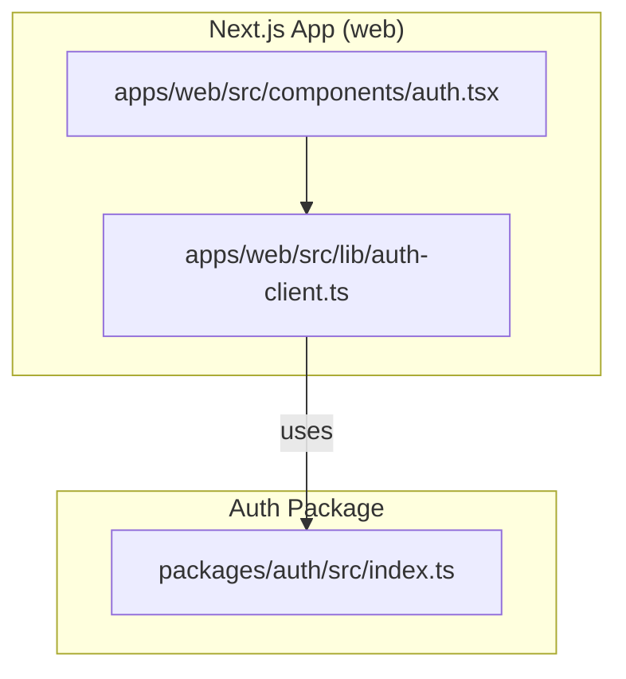
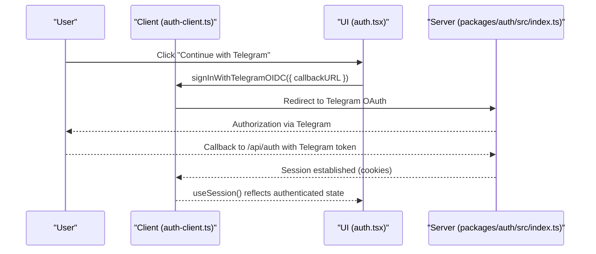
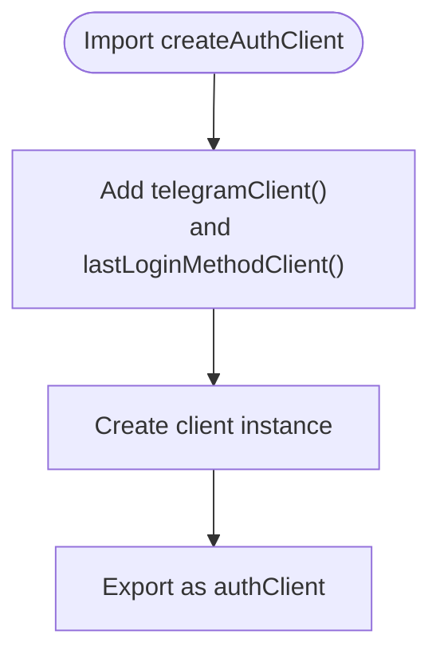
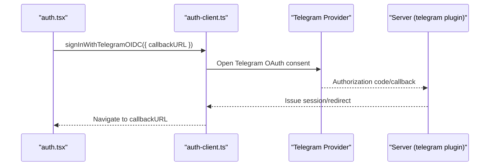
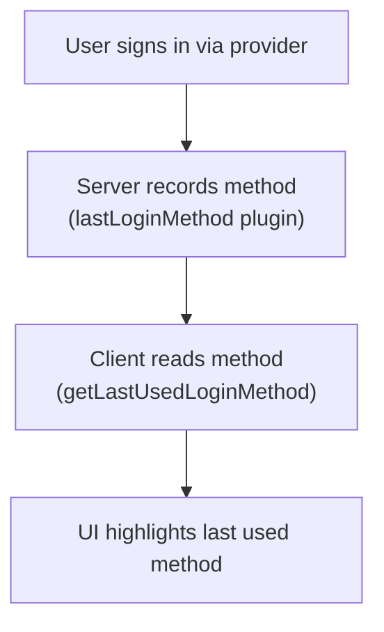
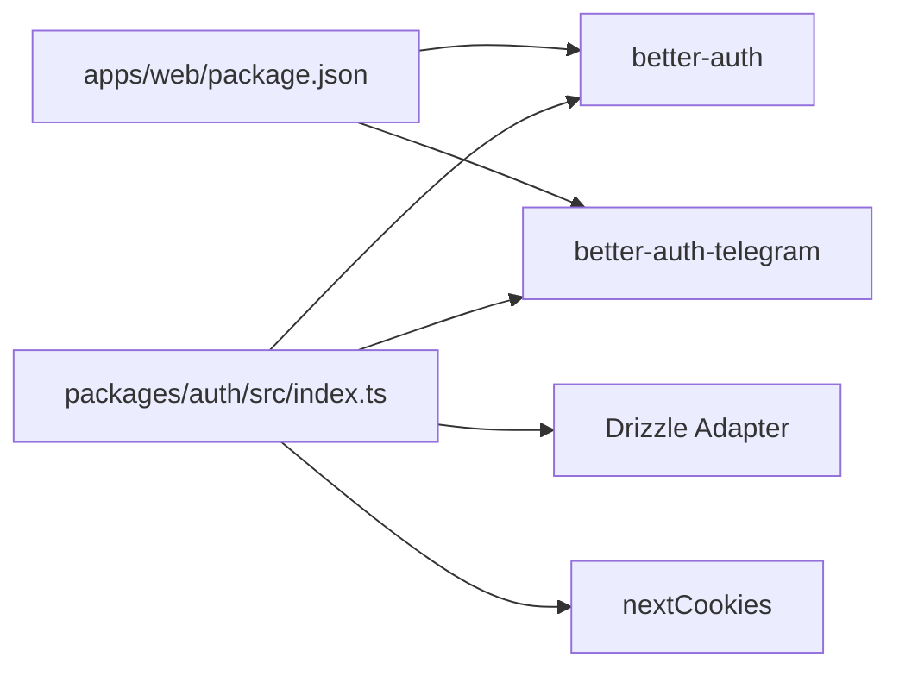

# Authentication Client Setup

<cite>
**Referenced Files in This Document**
- [auth-client.ts](file://apps/web/src/lib/auth-client.ts)
- [auth.tsx](file://apps/web/src/components/auth.tsx)
- [index.ts](file://packages/auth/src/index.ts)
- [package.json](file://apps/web/package.json)
- [SKILL.md](file://.agents/skills/better-auth-best-practices/SKILL.md)
</cite>

## Table of Contents

1. [Introduction](#introduction)
2. [Project Structure](#project-structure)
3. [Core Components](#core-components)
4. [Architecture Overview](#architecture-overview)
5. [Detailed Component Analysis](#detailed-component-analysis)
6. [Dependency Analysis](#dependency-analysis)
7. [Performance Considerations](#performance-considerations)
8. [Troubleshooting Guide](#troubleshooting-guide)
9. [Conclusion](#conclusion)
10. [Appendices](#appendices)

## Introduction

This document explains how to set up the Better Auth client in the Next.js application, focusing on initialization with createAuthClient, plugin configuration, and integration of the telegramClient and lastLoginMethodClient plugins. It also covers environment variables, usage examples, and troubleshooting common issues during client initialization and authentication flows.

## Project Structure

The authentication client is defined in a dedicated module and consumed by UI components for sign-in flows. The server-side auth configuration lives in a shared package and exposes the Telegram provider and last login method tracking.

**Diagram sources**

- [auth-client.ts:1-7](file://apps/web/src/lib/auth-client.ts#L1-L7)
- [auth.tsx:1-69](file://apps/web/src/components/auth.tsx#L1-L69)
- [index.ts:1-42](file://packages/auth/src/index.ts#L1-L42)

**Section sources**

- [auth-client.ts:1-7](file://apps/web/src/lib/auth-client.ts#L1-L7)
- [auth.tsx:1-69](file://apps/web/src/components/auth.tsx#L1-L69)
- [index.ts:1-42](file://packages/auth/src/index.ts#L1-L42)

## Core Components

- Client initialization: A single export creates the Better Auth client with plugins for Telegram OIDC and last login method tracking.
- UI integration: A React component demonstrates signing in via Google and Telegram and displays the last used login method.
- Server configuration: The auth package configures the database adapter, email/password, Telegram provider, last login method plugin, and Next.js cookies support.

Key responsibilities:

- apps/web/src/lib/auth-client.ts: Exports the configured client instance.
- apps/web/src/components/auth.tsx: Uses the client for sign-in and session state.
- packages/auth/src/index.ts: Configures server-side auth and plugins.

**Section sources**

- [auth-client.ts:1-7](file://apps/web/src/lib/auth-client.ts#L1-L7)
- [auth.tsx:1-69](file://apps/web/src/components/auth.tsx#L1-L69)
- [index.ts:1-42](file://packages/auth/src/index.ts#L1-L42)

## Architecture Overview

The client calls into the server endpoints exposed by the auth package. Plugins extend both client and server behavior:

- telegramClient enables Telegram OIDC sign-in on the client; telegram on the server handles Telegram OAuth flow.
- lastLoginMethodClient tracks the most recent login method; lastLoginMethod on the server records it.

**Diagram sources**

- [auth.tsx:16-20](file://apps/web/src/components/auth.tsx#L16-L20)
- [auth-client.ts:5-7](file://apps/web/src/lib/auth-client.ts#L5-L7)
- [index.ts:23-30](file://packages/auth/src/index.ts#L23-L30)

## Detailed Component Analysis

### Client Initialization (createAuthClient)

- Purpose: Create a typed Better Auth client instance with plugins enabled.
- Configuration:
  - plugins array includes telegramClient and lastLoginMethodClient.
- Usage: Exported as a singleton for app-wide consumption.

**Diagram sources**

- [auth-client.ts:1-7](file://apps/web/src/lib/auth-client.ts#L1-L7)

**Section sources**

- [auth-client.ts:1-7](file://apps/web/src/lib/auth-client.ts#L1-L7)

### Telegram Plugin Integration

- Client side: telegramClient adds signInWithTelegramOIDC to the client API.
- Server side: telegram plugin requires bot credentials and wires Telegram OAuth to the auth server.
- UI usage: The component triggers Telegram OIDC sign-in and sets a redirect after successful login.

**Diagram sources**

- [auth.tsx:16-20](file://apps/web/src/components/auth.tsx#L16-L20)
- [auth-client.ts:1-7](file://apps/web/src/lib/auth-client.ts#L1-L7)
- [index.ts:23-28](file://packages/auth/src/index.ts#L23-L28)

**Section sources**

- [auth.tsx:16-20](file://apps/web/src/components/auth.tsx#L16-L20)
- [auth-client.ts:1-7](file://apps/web/src/lib/auth-client.ts#L1-L7)
- [index.ts:23-28](file://packages/auth/src/index.ts#L23-L28)

### Last Login Method Tracking

- Client side: lastLoginMethodClient provides getLastUsedLoginMethod to read the most recent login method.
- Server side: lastLoginMethod plugin persists the login method metadata.
- UI usage: The component shows a badge indicating the last used method next to provider buttons.

**Diagram sources**

- [auth.tsx:22-25](file://apps/web/src/components/auth.tsx#L22-L25)
- [auth-client.ts:2-6](file://apps/web/src/lib/auth-client.ts#L2-L6)
- [index.ts:28-29](file://packages/auth/src/index.ts#L28-L29)

**Section sources**

- [auth.tsx:22-25](file://apps/web/src/components/auth.tsx#L22-L25)
- [auth-client.ts:2-6](file://apps/web/src/lib/auth-client.ts#L2-L6)
- [index.ts:28-29](file://packages/auth/src/index.ts#L28-L29)

### Environment Variables

Required server-side environment variables include:

- BETTER_AUTH_URL: Base URL for the auth server.
- BETTER_AUTH_SECRET: Secret for signing sessions and tokens.
- TELEGRAM_BOT_TOKEN and TELEGRAM_BOT_USERNAME: Credentials for Telegram OAuth.
- GOOGLE_CLIENT_ID and GOOGLE_CLIENT_SECRET: For Google social provider.
- CORS_ORIGIN: Trusted origin for CSRF protection.

These are consumed by the server configuration to initialize providers and security settings.

**Section sources**

- [index.ts:13-38](file://packages/auth/src/index.ts#L13-L38)
- [SKILL.md:28-33](file://.agents/skills/better-auth-best-practices/SKILL.md#L28-L33)

### Basic Setup Example

- Install dependencies: Ensure better-auth and better-auth-telegram are installed in the web app.
- Create the client: Use createAuthClient with plugins for Telegram and last login method.
- Wire UI: Call signIn.social for Google and signInWithTelegramOIDC for Telegram, setting a callbackURL.

References:

- Dependency declaration in the web app package.
- Client creation and plugin registration.
- UI handlers invoking sign-in methods.

**Section sources**

- [package.json:24-25](file://apps/web/package.json#L24-L25)
- [auth-client.ts:1-7](file://apps/web/src/lib/auth-client.ts#L1-L7)
- [auth.tsx:9-20](file://apps/web/src/components/auth.tsx#L9-L20)

### Extending the Client with Custom Functionality

- Add more client plugins to the plugins array in createAuthClient to extend capabilities (e.g., additional OAuth providers or analytics).
- Ensure corresponding server plugins are configured if they require server-side logic.
- Re-run migrations or schema generation when adding plugins that modify data models.

Guidance references:

- Client plugins are added via createAuthClient({ plugins: [...] }).
- Re-run CLI commands after adding/changing plugins.

**Section sources**

- [auth-client.ts:5-7](file://apps/web/src/lib/auth-client.ts#L5-L7)
- [SKILL.md:139-151](file://.agents/skills/better-auth-best-practices/SKILL.md#L139-L151)
- [SKILL.md:45-45](file://.agents/skills/better-auth-best-practices/SKILL.md#L45-L45)

## Dependency Analysis

The web app depends on better-auth and better-auth-telegram. The server package composes these with Drizzle and Next.js cookies support.

**Diagram sources**

- [package.json:24-25](file://apps/web/package.json#L24-L25)
- [index.ts:1-8](file://packages/auth/src/index.ts#L1-L8)

**Section sources**

- [package.json:24-25](file://apps/web/package.json#L24-L25)
- [index.ts:1-8](file://packages/auth/src/index.ts#L1-L8)

## Performance Considerations

- Keep client minimal: Only enable necessary plugins to reduce bundle size.
- Prefer tree-shakeable imports from dedicated paths when possible.
- Avoid heavy synchronous work in client initialization; defer non-critical setup until needed.

[No sources needed since this section provides general guidance]

## Troubleshooting Guide

Common initialization and runtime issues:

- Missing environment variables: Ensure BETTER_AUTH_URL, BETTER_AUTH_SECRET, TELEGRAM_BOT_TOKEN, TELEGRAM_BOT_USERNAME, and others are set.
- Plugin schema changes: After adding or modifying plugins, re-run migration/schema generation commands to keep DB schema in sync.
- Incorrect base URL or trusted origins: Verify baseURL and trustedOrigins match your deployment domain.
- Cookie/session problems: Confirm nextCookies plugin is enabled on the server and that cookies are allowed in your browser context.

Actionable checks:

- Validate env vars in the server package.
- Re-run CLI commands after plugin changes.
- Test endpoints like /api/auth/ok to verify server health.

**Section sources**

- [index.ts:13-38](file://packages/auth/src/index.ts#L13-L38)
- [SKILL.md:28-33](file://.agents/skills/better-auth-best-practices/SKILL.md#L28-L33)
- [SKILL.md:45-45](file://.agents/skills/better-auth-best-practices/SKILL.md#L45-L45)

## Conclusion

The Better Auth client is initialized with createAuthClient and extended via plugins for Telegram OIDC and last login method tracking. The server configuration mirrors these plugins and integrates with a database and Next.js cookies. Proper environment setup and adherence to plugin lifecycle steps ensure a smooth authentication experience.

[No sources needed since this section summarizes without analyzing specific files]

## Appendices

### Quick Reference: Client Methods Used

- signIn.social: Triggers Google OAuth sign-in.
- signInWithTelegramOIDC: Triggers Telegram OIDC sign-in.
- useSession: Reads current session state.
- getLastUsedLoginMethod: Retrieves the most recent login method.

**Section sources**

- [auth.tsx:9-20](file://apps/web/src/components/auth.tsx#L9-L20)
- [auth.tsx:22-25](file://apps/web/src/components/auth.tsx#L22-L25)
