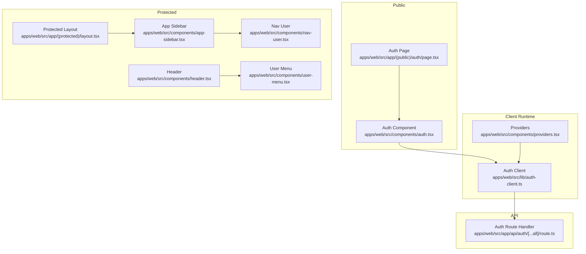
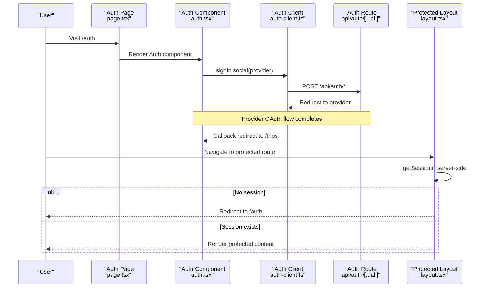
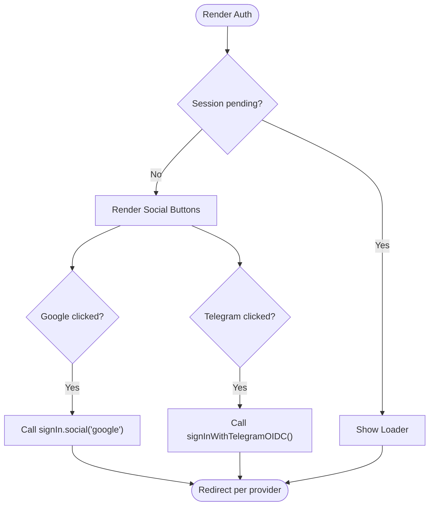
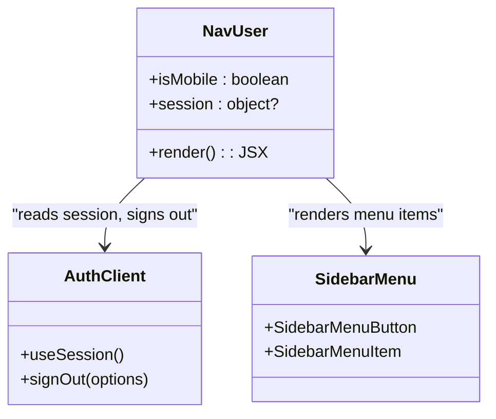
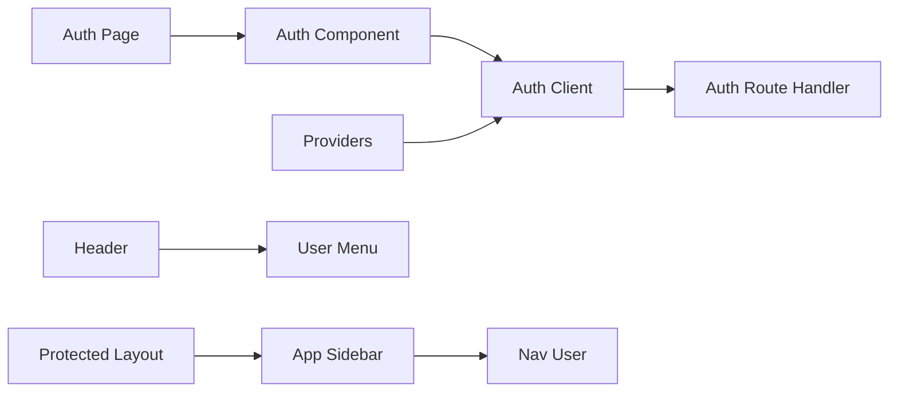

# Authentication UI Components

<cite>
**Referenced Files in This Document**
- [auth.tsx](file://apps/web/src/components/auth.tsx)
- [page.tsx](file://apps/web/src/app/(public)/auth/page.tsx)
- [auth-client.ts](file://apps/web/src/lib/auth-client.ts)
- [route.ts](file://apps/web/src/app/api/auth/[...all]/route.ts)
- [nav-user.tsx](file://apps/web/src/components/nav-user.tsx)
- [user-menu.tsx](file://apps/web/src/components/user-menu.tsx)
- [header.tsx](file://apps/web/src/components/header.tsx)
- [providers.tsx](file://apps/web/src/components/providers.tsx)
- [app-sidebar.tsx](file://apps/web/src/components/app-sidebar.tsx)
- [layout.tsx](file://apps/web/src/app/(protected)/layout.tsx)
- [button.tsx](file://packages/ui/src/components/button.tsx)
- [google.tsx](file://packages/ui/src/components/socials/google.tsx)
- [telegram.tsx](file://packages/ui/src/components/socials/telegram.tsx)
</cite>

## Table of Contents

1. [Introduction](#introduction)
2. [Project Structure](#project-structure)
3. [Core Components](#core-components)
4. [Architecture Overview](#architecture-overview)
5. [Detailed Component Analysis](#detailed-component-analysis)
6. [Dependency Analysis](#dependency-analysis)
7. [Performance Considerations](#performance-considerations)
8. [Troubleshooting Guide](#troubleshooting-guide)
9. [Conclusion](#conclusion)
10. [Appendices](#appendices)

## Introduction

This document explains how to build authentication-related UI components and patterns for a Next.js application using Better Auth. It covers login/logout flows, social authentication buttons, user profile displays, and navigation menus that respond to authentication state. You will learn component props, event handlers, styling approaches, form validation patterns, error display strategies, loading states, accessibility considerations, responsive design, mobile-specific behavior, and internationalization guidance.

## Project Structure

Authentication UI is implemented across the web app with:

- A public auth page rendering social sign-in buttons
- A protected layout enforcing session checks on the server
- Client-side session management via an auth client
- User menu and sidebar user item for logged-in experiences
- Shared UI primitives (buttons, dropdowns, avatars, skeletons) for consistent styling

**Diagram sources**

- [page.tsx:1-8](<file://apps/web/src/app/(public)/auth/page.tsx#L1-L8>)
- [auth.tsx:1-69](file://apps/web/src/components/auth.tsx#L1-L69)
- [auth-client.ts:1-8](file://apps/web/src/lib/auth-client.ts#L1-L8)
- [route.ts:1-5](file://apps/web/src/app/api/auth/[...all]/route.ts#L1-L5)
- [layout.tsx:1-66](<file://apps/web/src/app/(protected)/layout.tsx#L1-L66>)
- [app-sidebar.tsx:1-25](file://apps/web/src/components/app-sidebar.tsx#L1-L25)
- [nav-user.tsx:1-111](file://apps/web/src/components/nav-user.tsx#L1-L111)
- [user-menu.tsx:1-62](file://apps/web/src/components/user-menu.tsx#L1-L62)
- [header.tsx:1-32](file://apps/web/src/components/header.tsx#L1-L32)
- [providers.tsx:1-27](file://apps/web/src/components/providers.tsx#L1-L27)

**Section sources**

- [page.tsx:1-8](<file://apps/web/src/app/(public)/auth/page.tsx#L1-L8>)
- [auth.tsx:1-69](file://apps/web/src/components/auth.tsx#L1-L69)
- [auth-client.ts:1-8](file://apps/web/src/lib/auth-client.ts#L1-L8)
- [route.ts:1-5](file://apps/web/src/app/api/auth/[...all]/route.ts#L1-L5)
- [layout.tsx:1-66](<file://apps/web/src/app/(protected)/layout.tsx#L1-L66>)
- [app-sidebar.tsx:1-25](file://apps/web/src/components/app-sidebar.tsx#L1-L25)
- [nav-user.tsx:1-111](file://apps/web/src/components/nav-user.tsx#L1-L111)
- [user-menu.tsx:1-62](file://apps/web/src/components/user-menu.tsx#L1-L62)
- [header.tsx:1-32](file://apps/web/src/components/header.tsx#L1-L32)
- [providers.tsx:1-27](file://apps/web/src/components/providers.tsx#L1-L27)

## Core Components

- Auth page and component: Renders social sign-in buttons and handles pending session state.
- Auth client: Configures Better Auth with Telegram plugin and last login method tracking.
- Protected layout: Enforces authentication on the server; redirects unauthenticated users.
- Nav user: Displays user avatar and name in the sidebar with logout action.
- User menu: Topbar menu showing sign-in or signed-in options with logout.
- Header: Navigation links and topbar actions including user menu.
- Providers: Wraps app with theme and query client providers.

Key behaviors:

- Social sign-in triggers provider flows and redirects to a callback URL.
- Session state drives conditional UI (pending, not authenticated, authenticated).
- Logout clears session and navigates appropriately.

**Section sources**

- [auth.tsx:1-69](file://apps/web/src/components/auth.tsx#L1-L69)
- [auth-client.ts:1-8](file://apps/web/src/lib/auth-client.ts#L1-L8)
- [layout.tsx:1-66](<file://apps/web/src/app/(protected)/layout.tsx#L1-L66>)
- [nav-user.tsx:1-111](file://apps/web/src/components/nav-user.tsx#L1-L111)
- [user-menu.tsx:1-62](file://apps/web/src/components/user-menu.tsx#L1-L62)
- [header.tsx:1-32](file://apps/web/src/components/header.tsx#L1-L32)
- [providers.tsx:1-27](file://apps/web/src/components/providers.tsx#L1-L27)

## Architecture Overview

The authentication flow spans server-side protection and client-side interactions:

**Diagram sources**

- [page.tsx:1-8](<file://apps/web/src/app/(public)/auth/page.tsx#L1-L8>)
- [auth.tsx:1-69](file://apps/web/src/components/auth.tsx#L1-L69)
- [auth-client.ts:1-8](file://apps/web/src/lib/auth-client.ts#L1-L8)
- [route.ts:1-5](file://apps/web/src/app/api/auth/[...all]/route.ts#L1-L5)
- [layout.tsx:1-66](<file://apps/web/src/app/(protected)/layout.tsx#L1-L66>)

## Detailed Component Analysis

### Auth Page and Social Sign-In

- Purpose: Provide a simple entry point for social authentication.
- Behavior:
  - Shows a heading and description.
  - Offers Google and Telegram sign-in buttons.
  - Highlights the last used login method with a badge.
  - Displays a loader while session status is pending.
- Event handlers:
  - Clicking a button calls the corresponding social sign-in method with a callback URL.
- Styling:
  - Uses shared Button component with outline variant and full width.
  - Icons from socials package are embedded within buttons.
- Accessibility:
  - Buttons are keyboard accessible by default.
  - Ensure icons have appropriate sizing and do not interfere with focus styles.

**Diagram sources**

- [auth.tsx:1-69](file://apps/web/src/components/auth.tsx#L1-L69)

**Section sources**

- [auth.tsx:1-69](file://apps/web/src/components/auth.tsx#L1-L69)
- [google.tsx:1-243](file://packages/ui/src/components/socials/google.tsx#L1-L243)
- [telegram.tsx:1-34](file://packages/ui/src/components/socials/telegram.tsx#L1-L34)
- [button.tsx:1-58](file://packages/ui/src/components/button.tsx#L1-L58)

### Auth Client Configuration

- Purpose: Centralize authentication client setup with plugins.
- Features:
  - Integrates Telegram OIDC support.
  - Tracks last login method to enhance UX.
- Usage:
  - Imported by UI components to read session and trigger sign-in/sign-out.

**Section sources**

- [auth-client.ts:1-8](file://apps/web/src/lib/auth-client.ts#L1-L8)

### Protected Layout Enforcement

- Purpose: Guard protected routes server-side.
- Behavior:
  - Reads session via server API.
  - Redirects to /auth if no user session exists.
  - Renders sidebar and dashboard content when authenticated.
- Integration:
  - Works alongside client-side session checks for immediate UI updates.

**Section sources**

- [layout.tsx:1-66](<file://apps/web/src/app/(protected)/layout.tsx#L1-L66>)

### Sidebar User Item (Nav User)

- Purpose: Display user identity and provide logout in the sidebar.
- Behavior:
  - Shows skeleton placeholders while session is pending.
  - Renders avatar, name, email, and chevron indicator.
  - On logout, clears session and navigates to /auth.
- Responsive:
  - Dropdown placement adapts based on sidebar mobile mode.

**Diagram sources**

- [nav-user.tsx:1-111](file://apps/web/src/components/nav-user.tsx#L1-L111)

**Section sources**

- [nav-user.tsx:1-111](file://apps/web/src/components/nav-user.tsx#L1-L111)

### Topbar User Menu

- Purpose: Provide quick access to account info and sign-out from the header.
- Behavior:
  - Shows skeleton while session loads.
  - If not authenticated, shows a Sign In link to /auth.
  - If authenticated, shows user name and a dropdown with email and Sign Out.
- Styling:
  - Uses shared Button and DropdownMenu components.

**Section sources**

- [user-menu.tsx:1-62](file://apps/web/src/components/user-menu.tsx#L1-L62)
- [button.tsx:1-58](file://packages/ui/src/components/button.tsx#L1-L58)

### Header Composition

- Purpose: Combine navigation links and user controls.
- Behavior:
  - Renders static links and includes ModeToggle and UserMenu.
- Integration:
  - Used in pages to present consistent top-level navigation.

**Section sources**

- [header.tsx:1-32](file://apps/web/src/components/header.tsx#L1-L32)

### App Sidebar Composition

- Purpose: Assemble main navigation and user area.
- Behavior:
  - Wraps NavMain and NavUser within a collapsible sidebar.

**Section sources**

- [app-sidebar.tsx:1-25](file://apps/web/src/components/app-sidebar.tsx#L1-L25)

### Providers and Global Context

- Purpose: Wrap the application with theme and data fetching context.
- Behavior:
  - Provides theme switching and React Query client.
  - Includes toast notifications for user feedback.

**Section sources**

- [providers.tsx:1-27](file://apps/web/src/components/providers.tsx#L1-L27)

## Dependency Analysis

- UI components depend on shared primitives for consistent styling and accessibility.
- Auth flows depend on the centralized auth client and server route handler.
- Protected routes enforce server-side session checks before rendering.

**Diagram sources**

- [page.tsx:1-8](<file://apps/web/src/app/(public)/auth/page.tsx#L1-L8>)
- [auth.tsx:1-69](file://apps/web/src/components/auth.tsx#L1-L69)
- [auth-client.ts:1-8](file://apps/web/src/lib/auth-client.ts#L1-L8)
- [route.ts:1-5](file://apps/web/src/app/api/auth/[...all]/route.ts#L1-L5)
- [layout.tsx:1-66](<file://apps/web/src/app/(protected)/layout.tsx#L1-L66>)
- [app-sidebar.tsx:1-25](file://apps/web/src/components/app-sidebar.tsx#L1-L25)
- [nav-user.tsx:1-111](file://apps/web/src/components/nav-user.tsx#L1-L111)
- [header.tsx:1-32](file://apps/web/src/components/header.tsx#L1-L32)
- [user-menu.tsx:1-62](file://apps/web/src/components/user-menu.tsx#L1-L62)
- [providers.tsx:1-27](file://apps/web/src/components/providers.tsx#L1-L27)

**Section sources**

- [auth.tsx:1-69](file://apps/web/src/components/auth.tsx#L1-L69)
- [auth-client.ts:1-8](file://apps/web/src/lib/auth-client.ts#L1-L8)
- [route.ts:1-5](file://apps/web/src/app/api/auth/[...all]/route.ts#L1-L5)
- [layout.tsx:1-66](<file://apps/web/src/app/(protected)/layout.tsx#L1-L66>)
- [nav-user.tsx:1-111](file://apps/web/src/components/nav-user.tsx#L1-L111)
- [user-menu.tsx:1-62](file://apps/web/src/components/user-menu.tsx#L1-L62)
- [header.tsx:1-32](file://apps/web/src/components/header.tsx#L1-L32)
- [app-sidebar.tsx:1-25](file://apps/web/src/components/app-sidebar.tsx#L1-L25)
- [providers.tsx:1-27](file://apps/web/src/components/providers.tsx#L1-L27)

## Performance Considerations

- Minimize re-renders:
  - Use session hooks to conditionally render UI only when needed.
  - Keep heavy computations out of render paths.
- Optimize network calls:
  - Rely on server-side session checks for protected routes to avoid unnecessary client requests.
- Improve perceived performance:
  - Show skeletons during pending states for smoother transitions.
- Bundle size:
  - Import only necessary icons and components.
  - Avoid bundling large third-party libraries unless required.

[No sources needed since this section provides general guidance]

## Troubleshooting Guide

Common issues and resolutions:

- Redirect loops:
  - Ensure protected layout correctly reads session and redirects to /auth when missing.
- Social sign-in not working:
  - Verify the auth route handler is mounted at /api/auth/* and configured with the correct provider settings.
- Logout not navigating:
  - Confirm sign-out callbacks include onSuccess handlers that navigate to the intended route.
- Loading states stuck:
  - Check that session hooks resolve and that loaders are only shown during pending states.
- Accessibility problems:
  - Ensure interactive elements have proper roles and labels; test keyboard navigation and screen reader announcements.

**Section sources**

- [layout.tsx:1-66](<file://apps/web/src/app/(protected)/layout.tsx#L1-L66>)
- [route.ts:1-5](file://apps/web/src/app/api/auth/[...all]/route.ts#L1-L5)
- [nav-user.tsx:1-111](file://apps/web/src/components/nav-user.tsx#L1-L111)
- [user-menu.tsx:1-62](file://apps/web/src/components/user-menu.tsx#L1-L62)

## Conclusion

This codebase demonstrates a robust authentication UI pattern combining server-side protection with client-side interactivity. Social sign-in is streamlined through reusable buttons, while user sessions drive dynamic navigation and menus. By following the provided patterns—using shared UI primitives, handling loading and error states, and ensuring accessibility—you can build consistent, responsive authentication experiences across devices and locales.

[No sources needed since this section summarizes without analyzing specific files]

## Appendices

### Props and Events Reference

- Auth component:
  - No explicit props; uses internal state from auth client.
  - Events: onClick handlers for social buttons call sign-in methods.
- Nav user:
  - Reads session via auth client; renders user details and logout.
  - Event: onClick for logout triggers sign-out and navigation.
- User menu:
  - Conditional rendering based on session presence.
  - Event: onClick for sign-out triggers sign-out and navigation.
- Button component:
  - Variants and sizes control appearance and interaction styles.
  - Accessible by default; supports keyboard and screen readers.

**Section sources**

- [auth.tsx:1-69](file://apps/web/src/components/auth.tsx#L1-L69)
- [nav-user.tsx:1-111](file://apps/web/src/components/nav-user.tsx#L1-L111)
- [user-menu.tsx:1-62](file://apps/web/src/components/user-menu.tsx#L1-L62)
- [button.tsx:1-58](file://packages/ui/src/components/button.tsx#L1-L58)

### Styling Approach

- Use shared Button variants for consistent look and feel.
- Apply utility classes for spacing, alignment, and responsive behavior.
- Leverage theme provider for dark/light modes.

**Section sources**

- [button.tsx:1-58](file://packages/ui/src/components/button.tsx#L1-L58)
- [providers.tsx:1-27](file://apps/web/src/components/providers.tsx#L1-L27)

### Accessibility Checklist

- Keyboard navigation: All interactive elements must be reachable via Tab and Enter/Space.
- Focus indicators: Ensure visible focus rings for buttons and menu items.
- Screen readers: Provide meaningful labels and descriptions where needed.
- Color contrast: Maintain sufficient contrast for text and icons.

[No sources needed since this section provides general guidance]

### Responsive and Mobile Considerations

- Sidebar dropdown placement adapts to mobile mode for better usability.
- Full-width buttons improve touch targets on small screens.
- Skeleton placeholders prevent layout shifts during loading.

**Section sources**

- [nav-user.tsx:1-111](file://apps/web/src/components/nav-user.tsx#L1-L111)
- [auth.tsx:1-69](file://apps/web/src/components/auth.tsx#L1-L69)

### Internationalization Guidance

- Externalize strings such as headings, descriptions, and button labels into translation files.
- Use locale-aware formatting for names and emails if needed.
- Ensure directionality (LTR/RTL) is supported by CSS utilities.

[No sources needed since this section provides general guidance]
