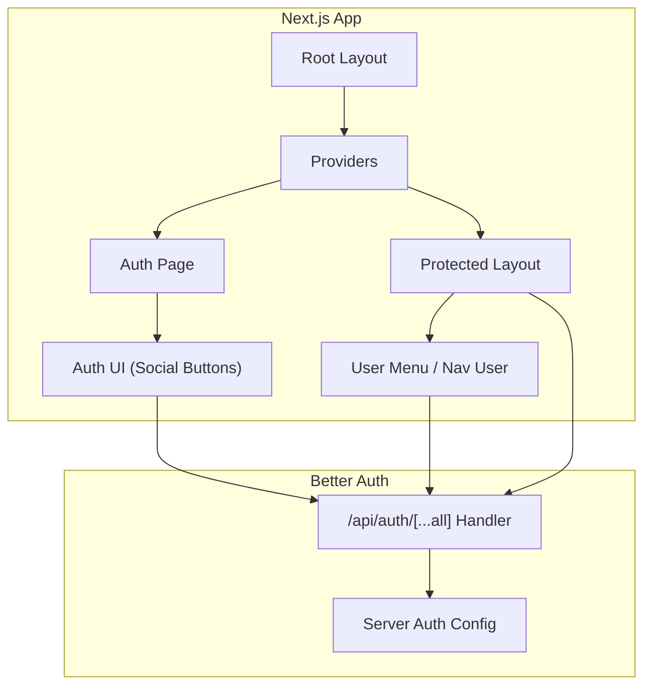
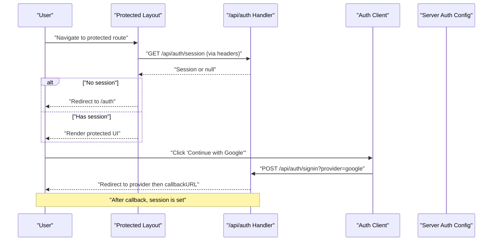
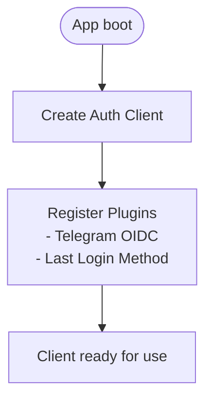
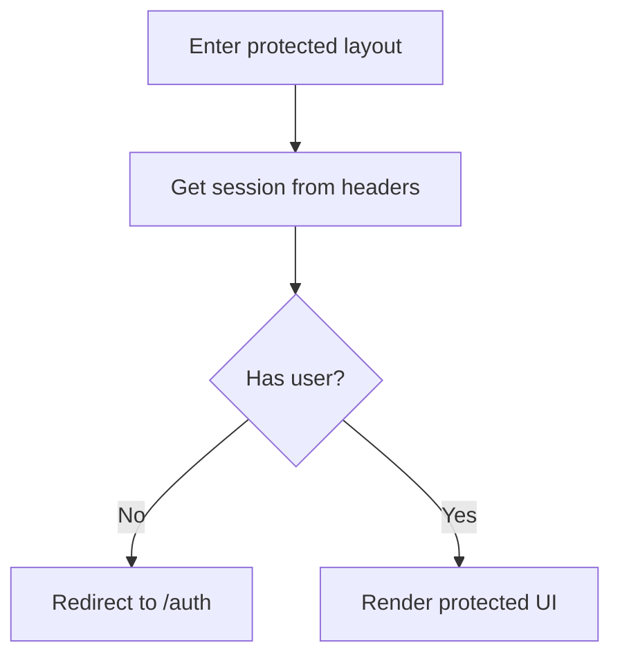
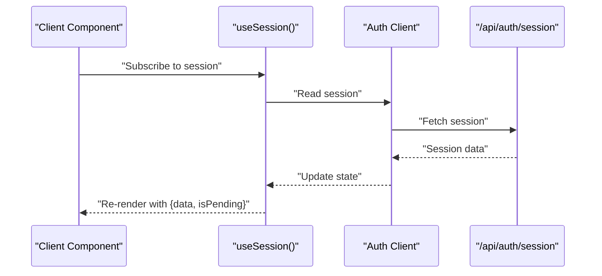
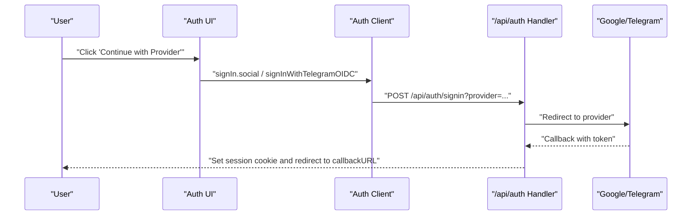
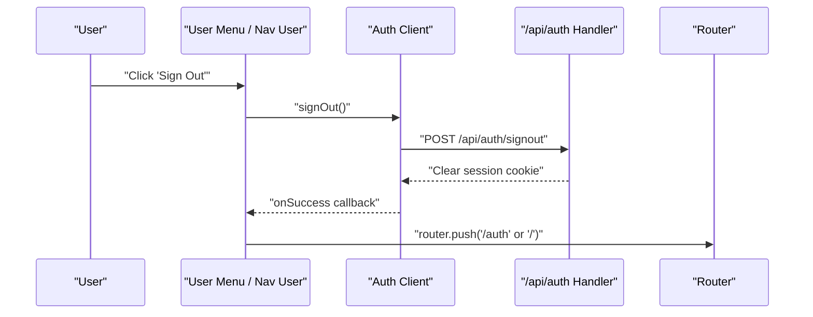
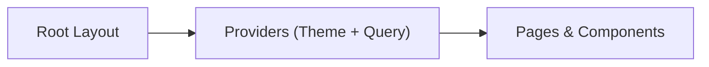
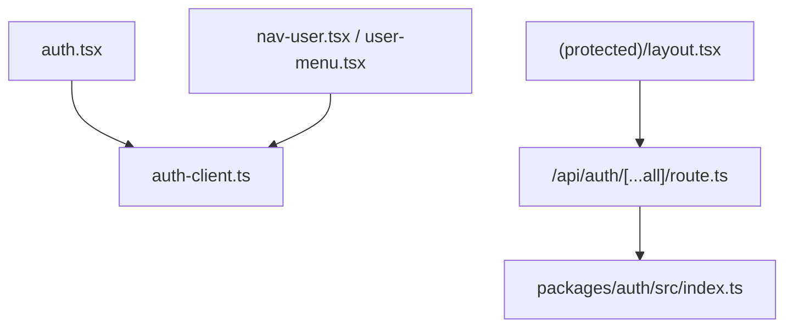

# Client-Side Integration

<cite>
**Referenced Files in This Document**
- [auth-client.ts](file://apps/web/src/lib/auth-client.ts)
- [route.ts](file://apps/web/src/app/api/auth/[...all]/route.ts)
- [index.ts](file://packages/auth/src/index.ts)
- [layout.tsx](file://apps/web/src/app/(protected)/layout.tsx)
- [page.tsx](file://apps/web/src/app/(public)/auth/page.tsx)
- [auth.tsx](file://apps/web/src/components/auth.tsx)
- [nav-user.tsx](file://apps/web/src/components/nav-user.tsx)
- [user-menu.tsx](file://apps/web/src/components/user-menu.tsx)
- [providers.tsx](file://apps/web/src/components/providers.tsx)
- [layout.tsx](file://apps/web/src/app/layout.tsx)
</cite>

## Table of Contents

1. [Introduction](#introduction)
2. [Project Structure](#project-structure)
3. [Core Components](#core-components)
4. [Architecture Overview](#architecture-overview)
5. [Detailed Component Analysis](#detailed-component-analysis)
6. [Dependency Analysis](#dependency-analysis)
7. [Performance Considerations](#performance-considerations)
8. [Troubleshooting Guide](#troubleshooting-guide)
9. [Conclusion](#conclusion)

## Introduction

This document explains how the Next.js frontend integrates client-side authentication using Better Auth. It covers:

- Initializing and configuring the Better Auth client with the Next.js adapter
- Protecting routes via server-side session verification and client-side navigation guards
- Managing user context and synchronizing authentication state between server and client
- Implementing login/logout flows, social sign-in buttons, and automatic redirects
- Handling loading states, errors, and user feedback during authentication

## Project Structure

The authentication integration spans a few key areas:

- Server-side configuration and API route for Better Auth
- Protected layout that enforces server-side session checks
- Public auth page with social sign-in UI
- Client components that read session state and trigger sign-in/sign-out actions
- App-level providers that wrap the application

**Diagram sources**

- [layout.tsx:26-46](file://apps/web/src/app/layout.tsx#L26-L46)
- [providers.tsx:11-25](file://apps/web/src/components/providers.tsx#L11-L25)
- [layout.tsx:22-33](<file://apps/web/src/app/(protected)/layout.tsx#L22-L33>)
- [page.tsx:1-8](<file://apps/web/src/app/(public)/auth/page.tsx#L1-L8>)
- [auth.tsx:9-20](file://apps/web/src/components/auth.tsx#L9-L20)
- [route.ts:1-5](file://apps/web/src/app/api/auth/[...all]/route.ts#L1-L5)
- [index.ts:10-40](file://packages/auth/src/index.ts#L10-L40)

**Section sources**

- [layout.tsx:26-46](file://apps/web/src/app/layout.tsx#L26-L46)
- [providers.tsx:11-25](file://apps/web/src/components/providers.tsx#L11-L25)
- [route.ts:1-5](file://apps/web/src/app/api/auth/[...all]/route.ts#L1-L5)
- [index.ts:10-40](file://packages/auth/src/index.ts#L10-L40)

## Core Components

- Authentication client: A single exported client instance configured with plugins for Telegram OIDC and last login method tracking.
- Server handler: A catch-all route that forwards requests to Better Auth’s Next.js handler.
- Protected layout: A server component that reads the session from headers and redirects unauthenticated users.
- Auth UI: Social sign-in buttons that call the client methods and redirect on success.
- User menu and nav user: Client components that display current session info and handle sign-out with navigation.

Key responsibilities:

- Client initialization and plugin setup
- Server-side session enforcement
- Client-side state synchronization via hooks
- Navigation after sign-in/sign-out

**Section sources**

- [auth-client.ts:1-8](file://apps/web/src/lib/auth-client.ts#L1-L8)
- [route.ts:1-5](file://apps/web/src/app/api/auth/[...all]/route.ts#L1-L5)
- [layout.tsx:22-33](<file://apps/web/src/app/(protected)/layout.tsx#L22-L33>)
- [auth.tsx:9-20](file://apps/web/src/components/auth.tsx#L9-L20)
- [nav-user.tsx:26-110](file://apps/web/src/components/nav-user.tsx#L26-L110)
- [user-menu.tsx:17-62](file://apps/web/src/components/user-menu.tsx#L17-L62)

## Architecture Overview

The flow combines server-side protection with client-side reactivity:

- The protected layout verifies sessions on the server before rendering protected content.
- The client uses Better Auth’s React hooks to subscribe to session changes and trigger sign-in/sign-out.
- Social sign-in buttons invoke provider-specific flows and redirect to a callback URL.
- Sign-out clears the session and navigates to an appropriate route.

**Diagram sources**

- [layout.tsx:22-33](<file://apps/web/src/app/(protected)/layout.tsx#L22-L33>)
- [route.ts:1-5](file://apps/web/src/app/api/auth/[...all]/route.ts#L1-L5)
- [auth.tsx:9-20](file://apps/web/src/components/auth.tsx#L9-L20)
- [index.ts:10-40](file://packages/auth/src/index.ts#L10-L40)

## Detailed Component Analysis

### Authentication Client Setup

- Purpose: Provide a typed, plugin-enabled client for all client-side auth operations.
- Plugins:
  - Telegram OIDC client for social sign-in
  - Last login method tracker to show “Last used” badges
- Usage: Exported once and consumed by UI components to call sign-in/sign-out and read session state.

**Diagram sources**

- [auth-client.ts:1-8](file://apps/web/src/lib/auth-client.ts#L1-L8)

**Section sources**

- [auth-client.ts:1-8](file://apps/web/src/lib/auth-client.ts#L1-L8)

### Server-Side Session Verification (Protected Routes)

- Mechanism: The protected layout is a server component that calls the session API with request headers. If no user is present, it redirects to the public auth page.
- Benefits: Prevents rendering sensitive UI until identity is confirmed; ensures SSR consistency.

**Diagram sources**

- [layout.tsx:22-33](<file://apps/web/src/app/(protected)/layout.tsx#L22-L33>)

**Section sources**

- [layout.tsx:22-33](<file://apps/web/src/app/(protected)/layout.tsx#L22-L33>)

### Client-Side Navigation Guards and State Sync

- Session subscription: Components use the session hook to reactively render based on authentication status.
- Loading states: While the session is being fetched, skeletons or loaders are shown to avoid flicker.
- Unauthenticated state: Show sign-in links or hide private controls.
- Authenticated state: Display user info and sign-out actions.

**Diagram sources**

- [nav-user.tsx:26-49](file://apps/web/src/components/nav-user.tsx#L26-L49)
- [user-menu.tsx:17-31](file://apps/web/src/components/user-menu.tsx#L17-L31)

**Section sources**

- [nav-user.tsx:26-49](file://apps/web/src/components/nav-user.tsx#L26-L49)
- [user-menu.tsx:17-31](file://apps/web/src/components/user-menu.tsx#L17-L31)

### Social Login Flows

- Google: Triggers OAuth flow via the client and redirects to a callback URL upon completion.
- Telegram: Uses Telegram OIDC through the client plugin and redirects to the callback URL.
- UX: Shows “Last used” badge when applicable and displays a loader while session resolves.

**Diagram sources**

- [auth.tsx:9-20](file://apps/web/src/components/auth.tsx#L9-L20)
- [route.ts:1-5](file://apps/web/src/app/api/auth/[...all]/route.ts#L1-L5)

**Section sources**

- [auth.tsx:9-20](file://apps/web/src/components/auth.tsx#L9-L20)

### Logout Flow and Automatic Redirects

- Behavior: Sign-out clears the session and navigates to a safe route (e.g., auth or home).
- Implementation: Use the client’s sign-out method with an onSuccess callback to perform navigation.

**Diagram sources**

- [nav-user.tsx:91-104](file://apps/web/src/components/nav-user.tsx#L91-L104)
- [user-menu.tsx:43-56](file://apps/web/src/components/user-menu.tsx#L43-L56)
- [route.ts:1-5](file://apps/web/src/app/api/auth/[...all]/route.ts#L1-L5)

**Section sources**

- [nav-user.tsx:91-104](file://apps/web/src/components/nav-user.tsx#L91-L104)
- [user-menu.tsx:43-56](file://apps/web/src/components/user-menu.tsx#L43-L56)

### App-Level Providers and Global Context

- Providers wrap the app to supply theme and query client contexts.
- The root layout mounts providers around the entire tree, ensuring consistent behavior across pages.

**Diagram sources**

- [layout.tsx:26-46](file://apps/web/src/app/layout.tsx#L26-L46)
- [providers.tsx:11-25](file://apps/web/src/components/providers.tsx#L11-L25)

**Section sources**

- [layout.tsx:26-46](file://apps/web/src/app/layout.tsx#L26-L46)
- [providers.tsx:11-25](file://apps/web/src/components/providers.tsx#L11-L25)

## Dependency Analysis

- Client depends on the Better Auth React client and its plugins.
- UI components depend on the client for session queries and mutations.
- Protected layout depends on the server-side auth API to enforce access.
- The API route delegates to Better Auth’s Next.js handler, which uses the server config.

**Diagram sources**

- [auth-client.ts:1-8](file://apps/web/src/lib/auth-client.ts#L1-L8)
- [auth.tsx:9-20](file://apps/web/src/components/auth.tsx#L9-L20)
- [nav-user.tsx:26-110](file://apps/web/src/components/nav-user.tsx#L26-L110)
- [user-menu.tsx:17-62](file://apps/web/src/components/user-menu.tsx#L17-L62)
- [layout.tsx:22-33](<file://apps/web/src/app/(protected)/layout.tsx#L22-L33>)
- [route.ts:1-5](file://apps/web/src/app/api/auth/[...all]/route.ts#L1-L5)
- [index.ts:10-40](file://packages/auth/src/index.ts#L10-L40)

**Section sources**

- [auth-client.ts:1-8](file://apps/web/src/lib/auth-client.ts#L1-L8)
- [route.ts:1-5](file://apps/web/src/app/api/auth/[...all]/route.ts#L1-L5)
- [index.ts:10-40](file://packages/auth/src/index.ts#L10-L40)

## Performance Considerations

- Prefer server-side session checks in layouts to avoid unnecessary client round-trips for protected routes.
- Use skeleton loaders while session is pending to improve perceived performance.
- Keep client-side session subscriptions minimal; rely on hooks to manage updates efficiently.
- Avoid redundant network calls by leveraging Better Auth’s built-in caching and cookie handling.

## Troubleshooting Guide

- Redirect loops: Ensure the protected layout only redirects when there is no authenticated user and that callbacks do not land on protected routes without a valid session.
- Missing session on first load: Verify that the root layout wraps the app with providers and that the client is initialized before any component consumes session state.
- Social login not redirecting: Confirm the provider is configured in the server auth config and that the API route is mounted at the expected path.
- Sign-out not navigating: Check that the onSuccess callback is invoked and that the router is available in the same component scope.

Common checks:

- Verify environment variables for base URL, secrets, and provider credentials in the server config.
- Confirm CORS/trusted origins if running cross-origin.
- Inspect browser cookies to ensure session cookies are set after sign-in.

**Section sources**

- [layout.tsx:22-33](<file://apps/web/src/app/(protected)/layout.tsx#L22-L33>)
- [auth.tsx:9-20](file://apps/web/src/components/auth.tsx#L9-L20)
- [nav-user.tsx:91-104](file://apps/web/src/components/nav-user.tsx#L91-L104)
- [user-menu.tsx:43-56](file://apps/web/src/components/user-menu.tsx#L43-L56)
- [index.ts:10-40](file://packages/auth/src/index.ts#L10-L40)

## Conclusion

This integration combines server-side protection with a reactive client to deliver a secure and smooth authentication experience:

- Initialize a single auth client with necessary plugins
- Enforce access in server components before rendering protected content
- Use client hooks to synchronize state and drive UI
- Implement clear sign-in/sign-out flows with proper redirects and feedback

By following these patterns, you can confidently extend authentication features such as additional providers, email/password flows, and role-based access control while maintaining a consistent user experience.
