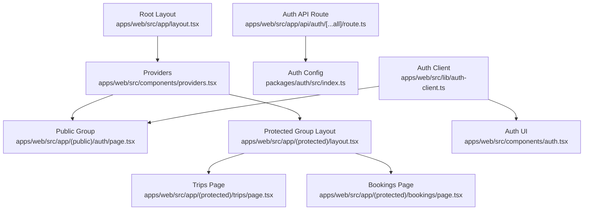
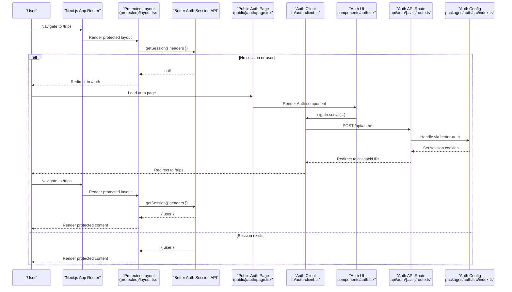
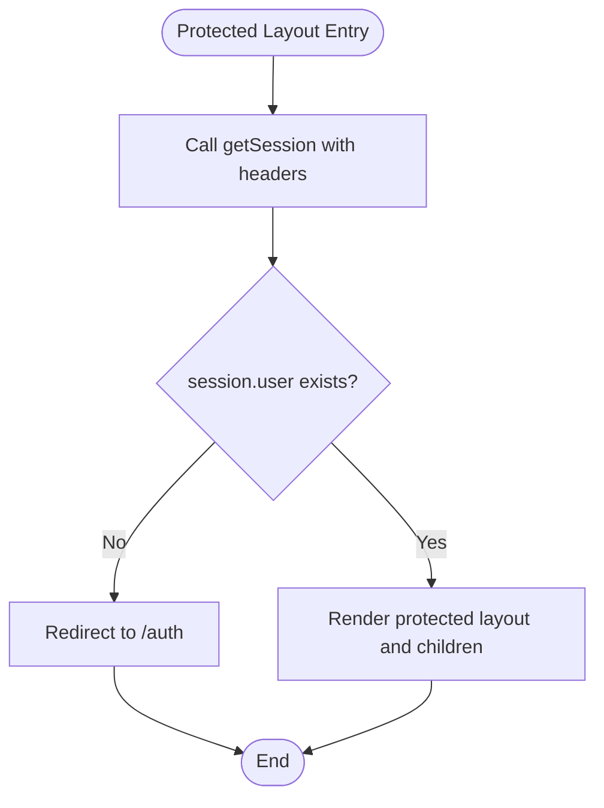
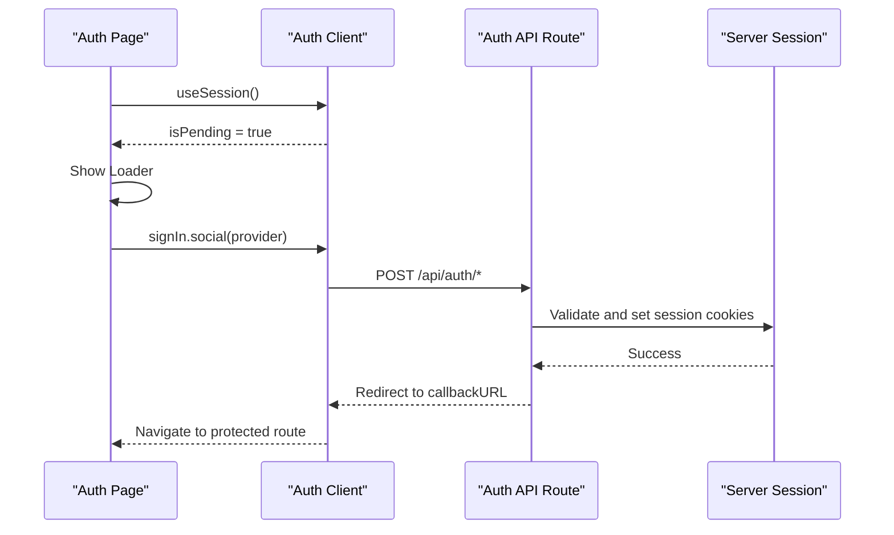
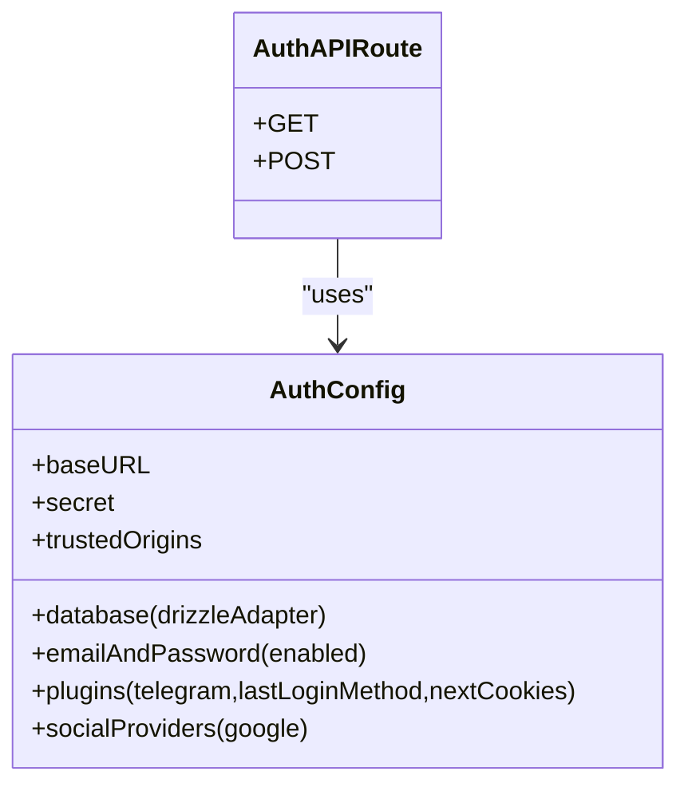
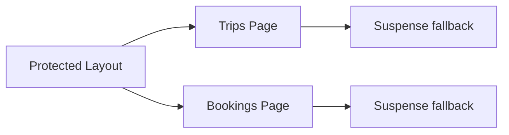
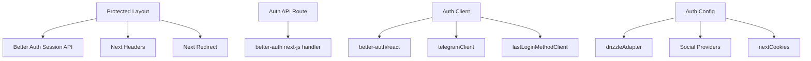

# Protected Routes Implementation

<cite>
**Referenced Files in This Document**
- [layout.tsx](file://apps/web/src/app/(protected)/layout.tsx)
- [page.tsx](file://apps/web/src/app/(public)/auth/page.tsx)
- [auth.tsx](file://apps/web/src/components/auth.tsx)
- [auth-client.ts](file://apps/web/src/lib/auth-client.ts)
- [route.ts](file://apps/web/src/app/api/auth/[...all]/route.ts)
- [index.ts](file://packages/auth/src/index.ts)
- [page.tsx](file://apps/web/src/app/(protected)/trips/page.tsx)
- [page.tsx](file://apps/web/src/app/(protected)/bookings/page.tsx)
- [layout.tsx](file://apps/web/src/app/layout.tsx)
- [providers.tsx](file://apps/web/src/components/providers.tsx)
</cite>

## Table of Contents

1. [Introduction](#introduction)
2. [Project Structure](#project-structure)
3. [Core Components](#core-components)
4. [Architecture Overview](#architecture-overview)
5. [Detailed Component Analysis](#detailed-component-analysis)
6. [Dependency Analysis](#dependency-analysis)
7. [Performance Considerations](#performance-considerations)
8. [Troubleshooting Guide](#troubleshooting-guide)
9. [Conclusion](#conclusion)

## Introduction

This document explains how protected routes are implemented in the Next.js application using server-side session verification with Better Auth. It focuses on a layout-based approach for route protection, middleware-like behavior via server components, and patterns for validating sessions, handling unauthenticated redirects, showing loading states during authentication checks, and managing errors. It also covers creating protected route groups, implementing role-based access control, and maintaining consistent authentication state across pages. Finally, it provides performance considerations and best practices for secure route protection.

## Project Structure

The application uses Next.js App Router route groups to separate public and protected areas:

- Public area: (public)/auth
- Protected area: (protected)/*
- Root layout wraps providers for client-side context
- API routes handle auth endpoints
- Shared auth configuration is centralized in a package

**Diagram sources**

- [layout.tsx:1-47](file://apps/web/src/app/layout.tsx#L1-L47)
- [providers.tsx:1-27](file://apps/web/src/components/providers.tsx#L1-L27)
- [page.tsx](<file://apps/web/src/app/(public)/auth/page.tsx#L1-L8>)
- [layout.tsx](<file://apps/web/src/app/(protected)/layout.tsx#L1-L66>)
- [page.tsx](<file://apps/web/src/app/(protected)/trips/page.tsx#L1-L30>)
- [page.tsx](<file://apps/web/src/app/(protected)/bookings/page.tsx#L1-L30>)
- [route.ts:1-5](file://apps/web/src/app/api/auth/[...all]/route.ts#L1-L5)
- [index.ts:1-43](file://packages/auth/src/index.ts#L1-L43)
- [auth-client.ts:1-8](file://apps/web/src/lib/auth-client.ts#L1-L8)
- [auth.tsx:1-69](file://apps/web/src/components/auth.tsx#L1-L69)

**Section sources**

- [layout.tsx:1-47](file://apps/web/src/app/layout.tsx#L1-L47)
- [providers.tsx:1-27](file://apps/web/src/components/providers.tsx#L1-L27)
- [page.tsx](<file://apps/web/src/app/(public)/auth/page.tsx#L1-L8>)
- [layout.tsx](<file://apps/web/src/app/(protected)/layout.tsx#L1-L66>)
- [page.tsx](<file://apps/web/src/app/(protected)/trips/page.tsx#L1-L30>)
- [page.tsx](<file://apps/web/src/app/(protected)/bookings/page.tsx#L1-L30>)
- [route.ts:1-5](file://apps/web/src/app/api/auth/[...all]/route.ts#L1-L5)
- [index.ts:1-43](file://packages/auth/src/index.ts#L1-L43)
- [auth-client.ts:1-8](file://apps/web/src/lib/auth-client.ts#L1-L8)
- [auth.tsx:1-69](file://apps/web/src/components/auth.tsx#L1-L69)

## Core Components

- Protected layout performs server-side session validation and enforces authentication before rendering any child pages.
- Public auth page renders a client component that initiates sign-in flows and shows a loading indicator while session state is pending.
- Auth client configures Better Auth plugins for Telegram and last login method tracking.
- Auth API route proxies requests to Better Auth handlers.
- Auth package centralizes provider configuration, database adapter, and cookies integration.

Key responsibilities:

- Server-side session check and redirect for unauthenticated users
- Client-side sign-in initiation and session polling
- Centralized auth configuration and cookie handling
- Consistent root-level providers for theme and data fetching

**Section sources**

- [layout.tsx](<file://apps/web/src/app/(protected)/layout.tsx#L1-L66>)
- [page.tsx](<file://apps/web/src/app/(public)/auth/page.tsx#L1-L8>)
- [auth.tsx:1-69](file://apps/web/src/components/auth.tsx#L1-L69)
- [auth-client.ts:1-8](file://apps/web/src/lib/auth-client.ts#L1-L8)
- [route.ts:1-5](file://apps/web/src/app/api/auth/[...all]/route.ts#L1-L5)
- [index.ts:1-43](file://packages/auth/src/index.ts#L1-L43)

## Architecture Overview

The protection flow combines server-side enforcement in the protected layout with client-side session management via Better Auth. The protected layout reads the current session from headers and redirects unauthenticated users to the public auth page. Protected pages render only after successful verification.

**Diagram sources**

- [layout.tsx](<file://apps/web/src/app/(protected)/layout.tsx#L1-L66>)
- [page.tsx](<file://apps/web/src/app/(public)/auth/page.tsx#L1-L8>)
- [auth.tsx:1-69](file://apps/web/src/components/auth.tsx#L1-L69)
- [auth-client.ts:1-8](file://apps/web/src/lib/auth-client.ts#L1-L8)
- [route.ts:1-5](file://apps/web/src/app/api/auth/[...all]/route.ts#L1-L5)
- [index.ts:1-43](file://packages/auth/src/index.ts#L1-L43)

## Detailed Component Analysis

### Protected Layout: Server-Side Session Enforcement

- Reads the current session using the Better Auth session API with request headers.
- If no authenticated user is present, redirects to the public auth page.
- Renders the protected shell (sidebar, header, content area) only after verification.

**Diagram sources**

- [layout.tsx](<file://apps/web/src/app/(protected)/layout.tsx#L22-L33>)

**Section sources**

- [layout.tsx](<file://apps/web/src/app/(protected)/layout.tsx#L1-L66>)

### Public Auth Page and Client Sign-In Flow

- The public auth page renders a client component that:
  - Shows a loader while the session status is pending
  - Provides buttons to initiate social sign-in flows
  - Uses the auth client to start sign-in and navigate to a callback URL

**Diagram sources**

- [page.tsx](<file://apps/web/src/app/(public)/auth/page.tsx#L1-L8>)
- [auth.tsx:9-20](file://apps/web/src/components/auth.tsx#L9-L20)
- [auth-client.ts:1-8](file://apps/web/src/lib/auth-client.ts#L1-L8)
- [route.ts:1-5](file://apps/web/src/app/api/auth/[...all]/route.ts#L1-L5)

**Section sources**

- [page.tsx](<file://apps/web/src/app/(public)/auth/page.tsx#L1-L8>)
- [auth.tsx:1-69](file://apps/web/src/components/auth.tsx#L1-L69)
- [auth-client.ts:1-8](file://apps/web/src/lib/auth-client.ts#L1-L8)
- [route.ts:1-5](file://apps/web/src/app/api/auth/[...all]/route.ts#L1-L5)

### Auth Configuration and API Route

- The auth package configures Better Auth with database adapter, email/password, Telegram social provider, last login method plugin, and Next.js cookies integration.
- The API route exposes GET/POST handlers for all auth endpoints by wrapping the auth instance.

**Diagram sources**

- [index.ts:10-40](file://packages/auth/src/index.ts#L10-L40)
- [route.ts:1-5](file://apps/web/src/app/api/auth/[...all]/route.ts#L1-L5)

**Section sources**

- [index.ts:1-43](file://packages/auth/src/index.ts#L1-L43)
- [route.ts:1-5](file://apps/web/src/app/api/auth/[...all]/route.ts#L1-L5)

### Protected Pages: Trips and Bookings

- Both pages are nested under the protected group and benefit from server-side protection enforced by the parent layout.
- They include Suspense boundaries to show loading states while async operations resolve.

**Diagram sources**

- [layout.tsx](<file://apps/web/src/app/(protected)/layout.tsx#L1-L66>)
- [page.tsx](<file://apps/web/src/app/(protected)/trips/page.tsx#L1-L30>)
- [page.tsx](<file://apps/web/src/app/(protected)/bookings/page.tsx#L1-L30>)

**Section sources**

- [page.tsx](<file://apps/web/src/app/(protected)/trips/page.tsx#L1-L30>)
- [page.tsx](<file://apps/web/src/app/(protected)/bookings/page.tsx#L1-L30>)

### Root Layout and Providers

- The root layout sets up fonts, metadata, and wraps the app with Providers.
- Providers configure theme and query client, ensuring consistent client-side context for protected and public routes.

**Section sources**

- [layout.tsx:1-47](file://apps/web/src/app/layout.tsx#L1-L47)
- [providers.tsx:1-27](file://apps/web/src/components/providers.tsx#L1-L27)

## Dependency Analysis

- Protected layout depends on:
  - Better Auth session API to read the current session
  - Next.js headers to forward cookies
  - Next.js redirect to send unauthenticated users to the auth page
- Auth client depends on:
  - Better Auth React client
  - Telegram client plugin
  - Last login method plugin
- Auth API route depends on:
  - Better Auth Next.js handler wrapper
- Auth package depends on:
  - Database adapter (Drizzle)
  - Social providers (Google, Telegram)
  - Cookies integration for Next.js

**Diagram sources**

- [layout.tsx](<file://apps/web/src/app/(protected)/layout.tsx#L1-L33>)
- [route.ts:1-5](file://apps/web/src/app/api/auth/[...all]/route.ts#L1-L5)
- [auth-client.ts:1-8](file://apps/web/src/lib/auth-client.ts#L1-L8)
- [index.ts:1-43](file://packages/auth/src/index.ts#L1-L43)

**Section sources**

- [layout.tsx](<file://apps/web/src/app/(protected)/layout.tsx#L1-L33>)
- [route.ts:1-5](file://apps/web/src/app/api/auth/[...all]/route.ts#L1-L5)
- [auth-client.ts:1-8](file://apps/web/src/lib/auth-client.ts#L1-L8)
- [index.ts:1-43](file://packages/auth/src/index.ts#L1-L43)

## Performance Considerations

- Prefer server-side session checks in layouts to avoid unnecessary client round-trips for protected routes.
- Use Suspense boundaries around data-heavy sections to provide immediate feedback during loading.
- Keep protected layouts minimal; offload heavy UI to child components to reduce layout reflows.
- Ensure cookies are correctly forwarded via headers when calling session APIs on the server.
- Avoid redundant session calls; rely on the layout’s single session check per navigation.
- Configure trusted origins and base URLs to prevent cross-origin issues that can degrade performance due to retries.

[No sources needed since this section provides general guidance]

## Troubleshooting Guide

Common issues and resolutions:

- Unauthenticated redirect loop:
  - Verify that the protected layout checks session and redirects to the correct public path.
  - Ensure the auth API route is properly mounted at the expected path.
- Session not recognized after sign-in:
  - Confirm that cookies are enabled and the base URL matches the deployment domain.
  - Check that the Next.js cookies plugin is included in the auth configuration.
- Loading state stuck:
  - Ensure the client component reads session status and displays a loader while pending.
  - Validate that the callback URL after sign-in points to a protected route guarded by the layout.
- Role-based access not enforced:
  - Extend the protected layout to inspect roles from the session and redirect unauthorized users.
  - Add fine-grained checks in server actions or API routes for additional security.

**Section sources**

- [layout.tsx](<file://apps/web/src/app/(protected)/layout.tsx#L22-L33>)
- [auth.tsx:22-28](file://apps/web/src/components/auth.tsx#L22-L28)
- [route.ts:1-5](file://apps/web/src/app/api/auth/[...all]/route.ts#L1-L5)
- [index.ts:10-40](file://packages/auth/src/index.ts#L10-L40)

## Conclusion

This implementation secures routes using a layout-based pattern that validates sessions on the server before rendering protected content. Unauthenticated users are redirected to a public auth page where they can sign in via supported providers. The client manages session state and loading indicators, while the API route delegates to Better Auth for secure session handling. By centralizing auth configuration and leveraging Next.js features like route groups and Suspense, the application achieves both security and performance. For advanced scenarios such as role-based access control, extend the protected layout and server-side checks to enforce permissions consistently across the app.
