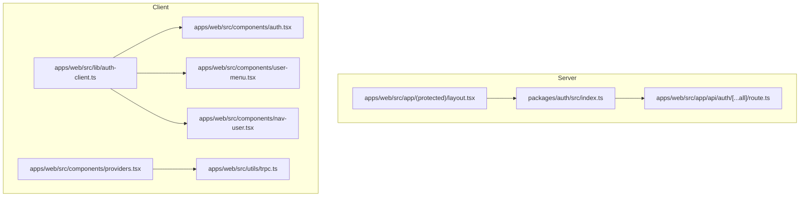
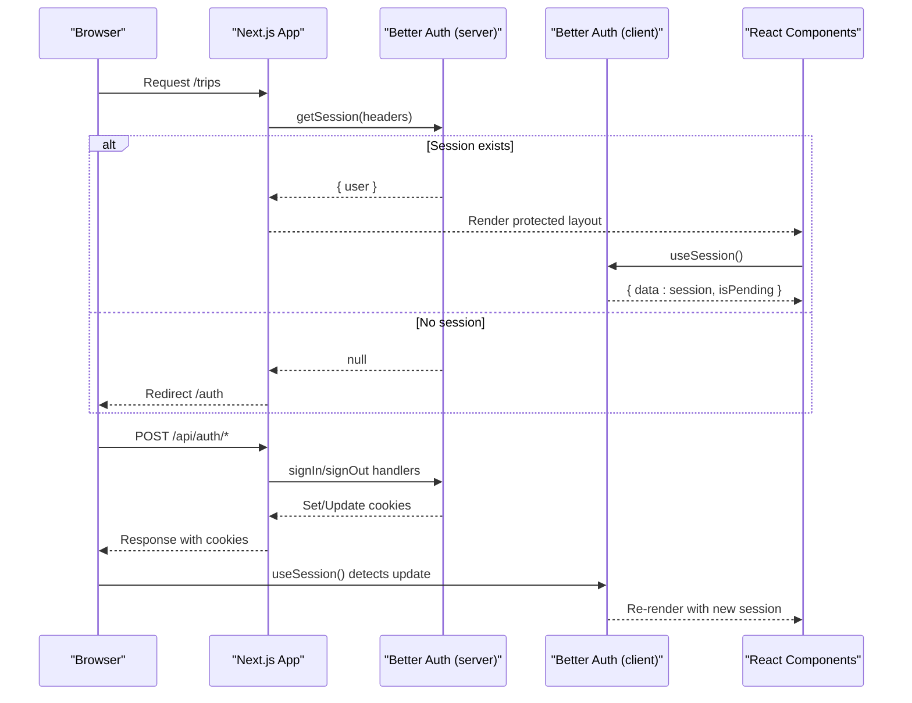
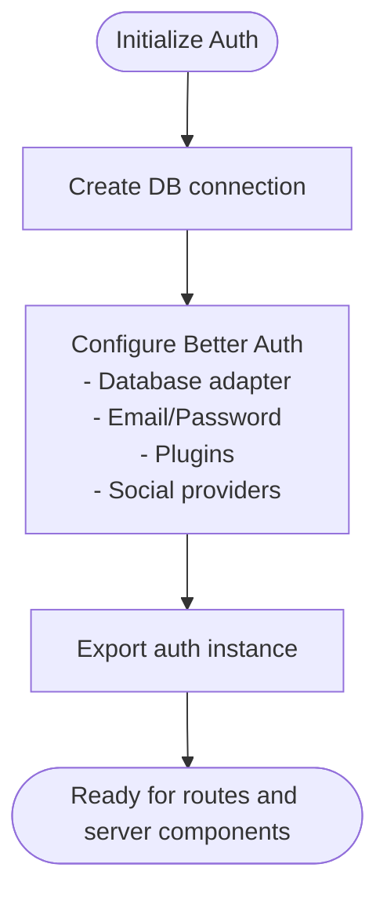
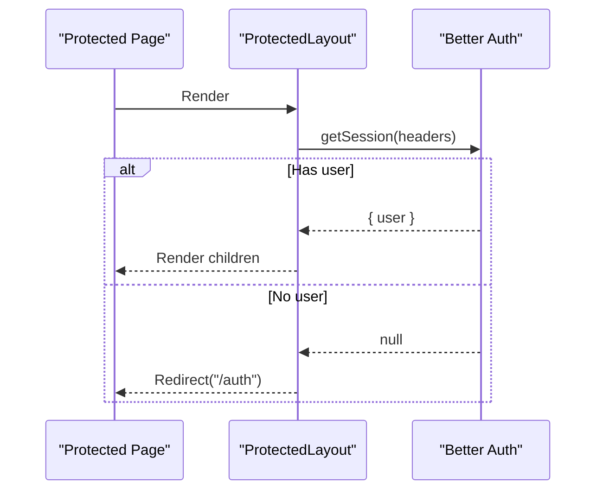
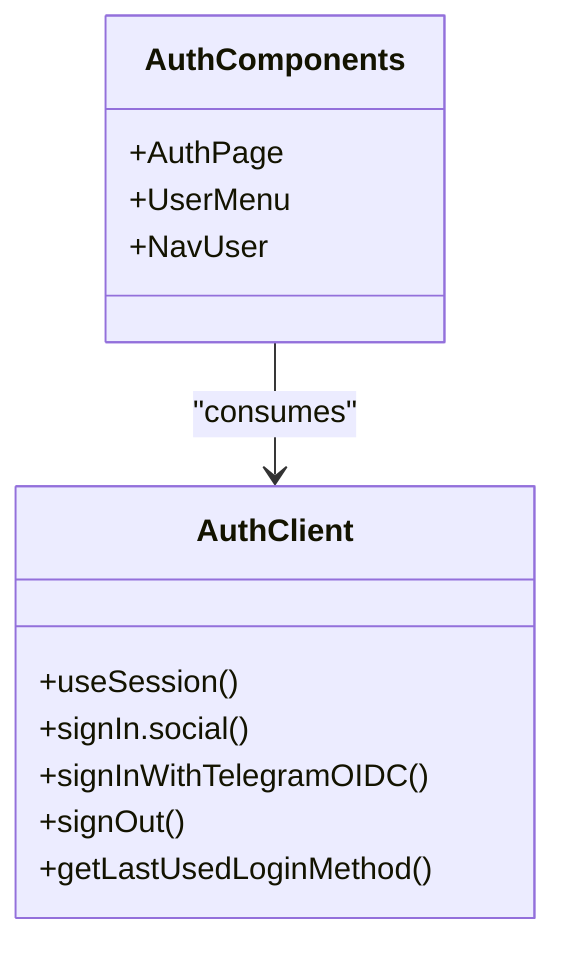
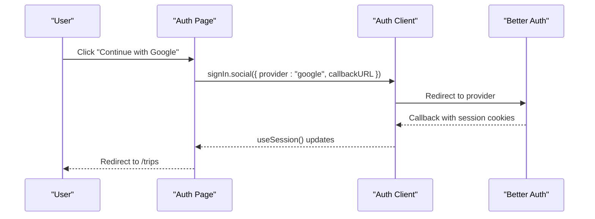
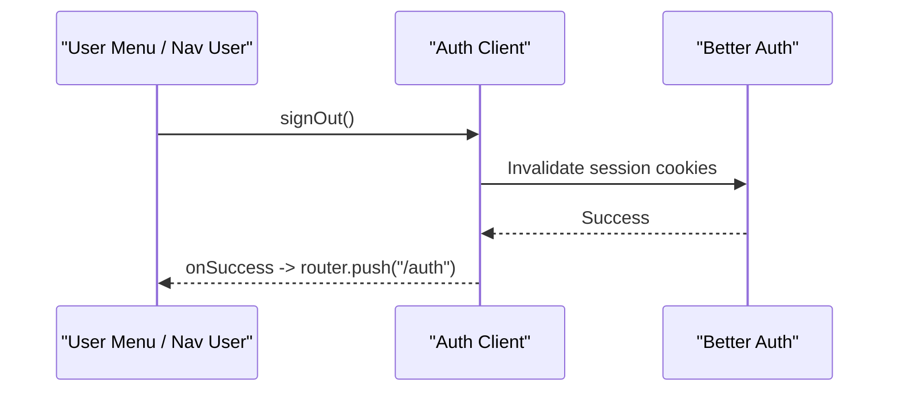
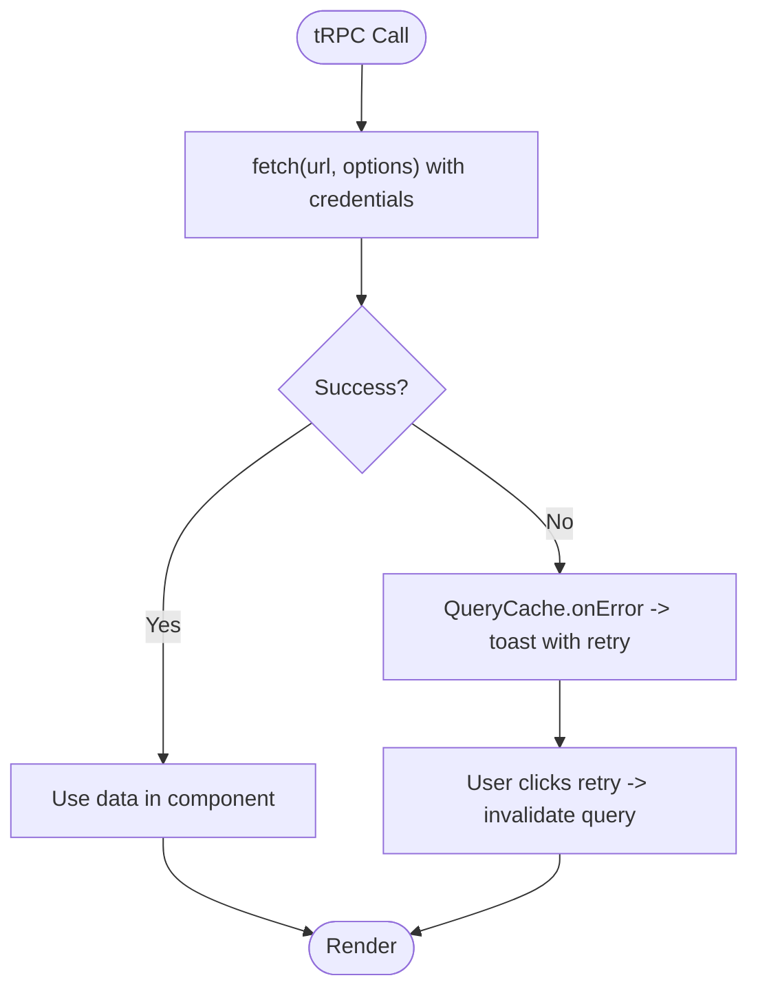
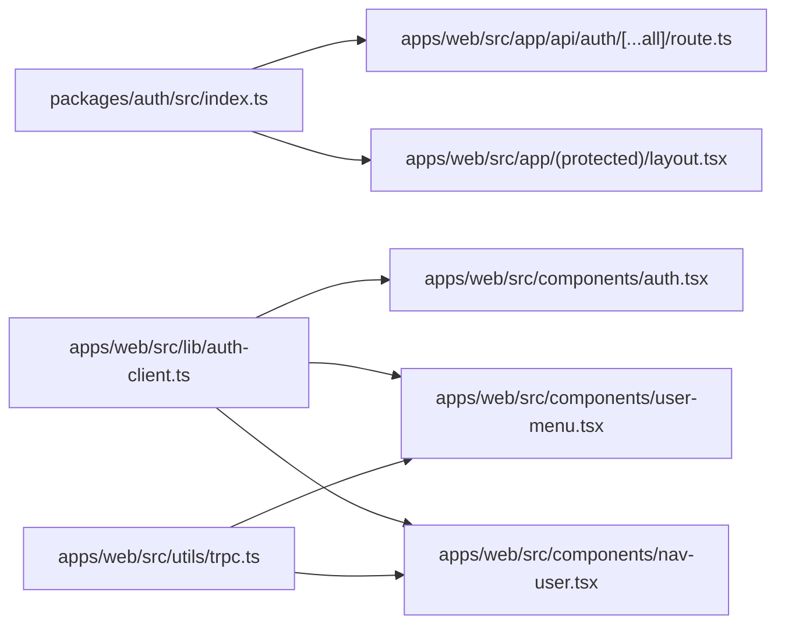

# User Context and State Management

<cite>
**Referenced Files in This Document**
- [auth-client.ts](file://apps/web/src/lib/auth-client.ts)
- [providers.tsx](file://apps/web/src/components/providers.tsx)
- [auth.tsx](file://apps/web/src/components/auth.tsx)
- [layout.tsx](file://apps/web/src/app/(protected)/layout.tsx)
- [route.ts](file://apps/web/src/app/api/auth/[...all]/route.ts)
- [trpc.ts](file://apps/web/src/utils/trpc.ts)
- [index.ts](file://packages/auth/src/index.ts)
- [user-menu.tsx](file://apps/web/src/components/user-menu.tsx)
- [nav-user.tsx](file://apps/web/src/components/nav-user.tsx)
- [page.tsx](file://apps/web/src/app/(public)/auth/page.tsx)
</cite>

## Table of Contents

1. [Introduction](#introduction)
2. [Project Structure](#project-structure)
3. [Core Components](#core-components)
4. [Architecture Overview](#architecture-overview)
5. [Detailed Component Analysis](#detailed-component-analysis)
6. [Dependency Analysis](#dependency-analysis)
7. [Performance Considerations](#performance-considerations)
8. [Troubleshooting Guide](#troubleshooting-guide)
9. [Conclusion](#conclusion)

## Introduction

This document explains how user context and authentication state are managed across the application using Better Auth, React hooks, and Next.js server components. It covers:

- Providing user data via client-side session management
- Handling real-time session updates through cookies and client hooks
- Synchronizing authentication state between server routes and client components
- Accessing user information in both server and client contexts
- Managing loading states, errors, and user preferences
- Implementing custom patterns for authentication state and UI
- Ensuring persistence and rehydration strategies with performance best practices

## Project Structure

The authentication system spans server configuration, API routing, protected layouts, and client components that consume session state.

**Diagram sources**

- [index.ts:10-42](file://packages/auth/src/index.ts#L10-L42)
- [route.ts:1-5](file://apps/web/src/app/api/auth/[...all]/route.ts#L1-L5)
- [layout.tsx:22-33](<file://apps/web/src/app/(protected)/layout.tsx#L22-L33>)
- [auth-client.ts:5-7](file://apps/web/src/lib/auth-client.ts#L5-L7)
- [auth.tsx:22-28](file://apps/web/src/components/auth.tsx#L22-L28)
- [user-menu.tsx:17-31](file://apps/web/src/components/user-menu.tsx#L17-L31)
- [nav-user.tsx:26-50](file://apps/web/src/components/nav-user.tsx#L26-L50)
- [providers.tsx:11-24](file://apps/web/src/components/providers.tsx#L11-L24)
- [trpc.ts:22-34](file://apps/web/src/utils/trpc.ts#L22-L34)

**Section sources**

- [index.ts:10-42](file://packages/auth/src/index.ts#L10-L42)
- [route.ts:1-5](file://apps/web/src/app/api/auth/[...all]/route.ts#L1-L5)
- [layout.tsx:22-33](<file://apps/web/src/app/(protected)/layout.tsx#L22-L33>)
- [auth-client.ts:5-7](file://apps/web/src/lib/auth-client.ts#L5-L7)
- [providers.tsx:11-24](file://apps/web/src/components/providers.tsx#L11-L24)
- [trpc.ts:22-34](file://apps/web/src/utils/trpc.ts#L22-L34)

## Core Components

- Server auth configuration: Initializes Better Auth with database adapter, plugins (Telegram, last login method), social providers, and cookie handling.
- API route handler: Exposes Better Auth endpoints to Next.js.
- Protected layout: Reads session on the server and redirects unauthenticated users.
- Client auth client: Creates a typed client with Telegram and last-login-method plugins.
- Auth page and buttons: Triggers sign-in flows and shows pending state.
- User menu and sidebar user: Displays session info, handles sign-out, and navigates accordingly.
- Providers and tRPC: Wraps app with QueryClient and configures authenticated fetches.

Key responsibilities:

- Server enforces access control and provides session to protected routes.
- Client maintains reactive session state and triggers auth flows.
- UI components handle loading, not-found, and error states gracefully.

**Section sources**

- [index.ts:10-42](file://packages/auth/src/index.ts#L10-L42)
- [route.ts:1-5](file://apps/web/src/app/api/auth/[...all]/route.ts#L1-L5)
- [layout.tsx:22-33](<file://apps/web/src/app/(protected)/layout.tsx#L22-L33>)
- [auth-client.ts:5-7](file://apps/web/src/lib/auth-client.ts#L5-L7)
- [auth.tsx:22-28](file://apps/web/src/components/auth.tsx#L22-L28)
- [user-menu.tsx:17-31](file://apps/web/src/components/user-menu.tsx#L17-L31)
- [nav-user.tsx:26-50](file://apps/web/src/components/nav-user.tsx#L26-L50)
- [providers.tsx:11-24](file://apps/web/src/components/providers.tsx#L11-L24)
- [trpc.ts:22-34](file://apps/web/src/utils/trpc.ts#L22-L34)

## Architecture Overview

The system uses Better Auth for server-side session management and a React client for reactive session state. Protected routes validate sessions server-side; client components subscribe to session changes via hooks.

**Diagram sources**

- [layout.tsx:22-33](<file://apps/web/src/app/(protected)/layout.tsx#L22-L33>)
- [route.ts:1-5](file://apps/web/src/app/api/auth/[...all]/route.ts#L1-L5)
- [auth-client.ts:5-7](file://apps/web/src/lib/auth-client.ts#L5-L7)
- [auth.tsx:22-28](file://apps/web/src/components/auth.tsx#L22-L28)
- [user-menu.tsx:43-56](file://apps/web/src/components/user-menu.tsx#L43-L56)
- [nav-user.tsx:91-104](file://apps/web/src/components/nav-user.tsx#L91-L104)

## Detailed Component Analysis

### Server Authentication Setup

- Initializes Better Auth with Drizzle adapter, email/password, Telegram OIDC, last login method plugin, and Next.js cookie integration.
- Configures Google OAuth and trusted origins.
- Exports a singleton auth instance used by API routes and server components.

**Diagram sources**

- [index.ts:10-42](file://packages/auth/src/index.ts#L10-L42)

**Section sources**

- [index.ts:10-42](file://packages/auth/src/index.ts#L10-L42)

### API Route Handler

- Maps Better Auth endpoints to Next.js GET/POST handlers, enabling standard auth flows under /api/auth.

**Section sources**

- [route.ts:1-5](file://apps/web/src/app/api/auth/[...all]/route.ts#L1-L5)

### Protected Layout (Server-Side Guard)

- Fetches session using server headers and redirects to /auth if no user is present.
- Provides consistent shell for protected pages.

**Diagram sources**

- [layout.tsx:22-33](<file://apps/web/src/app/(protected)/layout.tsx#L22-L33>)

**Section sources**

- [layout.tsx:22-33](<file://apps/web/src/app/(protected)/layout.tsx#L22-L33>)

### Client Auth Client and Hooks

- Creates a typed client with Telegram and last-login-method plugins.
- Components call useSession() to get reactive session data and pending state.

**Diagram sources**

- [auth-client.ts:5-7](file://apps/web/src/lib/auth-client.ts#L5-L7)
- [auth.tsx:22-28](file://apps/web/src/components/auth.tsx#L22-L28)
- [user-menu.tsx:17-31](file://apps/web/src/components/user-menu.tsx#L17-L31)
- [nav-user.tsx:26-50](file://apps/web/src/components/nav-user.tsx#L26-L50)

**Section sources**

- [auth-client.ts:5-7](file://apps/web/src/lib/auth-client.ts#L5-L7)
- [auth.tsx:22-28](file://apps/web/src/components/auth.tsx#L22-L28)
- [user-menu.tsx:17-31](file://apps/web/src/components/user-menu.tsx#L17-L31)
- [nav-user.tsx:26-50](file://apps/web/src/components/nav-user.tsx#L26-L50)

### Sign-In Flow (Google and Telegram)

- Buttons trigger provider-specific sign-in methods with callback URLs.
- Pending state is shown while session resolves.

**Diagram sources**

- [auth.tsx:9-20](file://apps/web/src/components/auth.tsx#L9-L20)
- [auth.tsx:22-28](file://apps/web/src/components/auth.tsx#L22-L28)
- [route.ts:1-5](file://apps/web/src/app/api/auth/[...all]/route.ts#L1-L5)

**Section sources**

- [auth.tsx:9-20](file://apps/web/src/components/auth.tsx#L9-L20)
- [auth.tsx:22-28](file://apps/web/src/components/auth.tsx#L22-L28)
- [route.ts:1-5](file://apps/web/src/app/api/auth/[...all]/route.ts#L1-L5)

### Sign-Out Flow

- User menu and sidebar user provide sign-out actions that clear session and navigate appropriately.

**Diagram sources**

- [user-menu.tsx:43-56](file://apps/web/src/components/user-menu.tsx#L43-L56)
- [nav-user.tsx:91-104](file://apps/web/src/components/nav-user.tsx#L91-L104)

**Section sources**

- [user-menu.tsx:43-56](file://apps/web/src/components/user-menu.tsx#L43-L56)
- [nav-user.tsx:91-104](file://apps/web/src/components/nav-user.tsx#L91-L104)

### Data Fetching and Error Handling

- tRPC client configured with credentials to include cookies for authenticated requests.
- Global query error handling displays toast notifications with retry actions.

**Diagram sources**

- [trpc.ts:7-20](file://apps/web/src/utils/trpc.ts#L7-L20)
- [trpc.ts:22-34](file://apps/web/src/utils/trpc.ts#L22-L34)

**Section sources**

- [trpc.ts:7-20](file://apps/web/src/utils/trpc.ts#L7-L20)
- [trpc.ts:22-34](file://apps/web/src/utils/trpc.ts#L22-L34)

### Provider Setup

- Wraps application with theme provider and React Query client provider.
- Ensures global state infrastructure is available to all components.

**Section sources**

- [providers.tsx:11-24](file://apps/web/src/components/providers.tsx#L11-L24)

### Public Auth Page

- Renders the auth component for sign-in flows.

**Section sources**

- [page.tsx:1-8](<file://apps/web/src/app/(public)/auth/page.tsx#L1-L8>)

## Dependency Analysis

- Server auth module depends on database, environment variables, and plugins.
- API route depends on server auth to expose endpoints.
- Protected layout depends on server auth to enforce access.
- Client components depend on the client auth SDK and hooks.
- tRPC client depends on credentials to maintain session across requests.

**Diagram sources**

- [index.ts:10-42](file://packages/auth/src/index.ts#L10-L42)
- [route.ts:1-5](file://apps/web/src/app/api/auth/[...all]/route.ts#L1-L5)
- [layout.tsx:22-33](<file://apps/web/src/app/(protected)/layout.tsx#L22-L33>)
- [auth-client.ts:5-7](file://apps/web/src/lib/auth-client.ts#L5-L7)
- [auth.tsx:22-28](file://apps/web/src/components/auth.tsx#L22-L28)
- [user-menu.tsx:17-31](file://apps/web/src/components/user-menu.tsx#L17-L31)
- [nav-user.tsx:26-50](file://apps/web/src/components/nav-user.tsx#L26-L50)
- [trpc.ts:22-34](file://apps/web/src/utils/trpc.ts#L22-L34)

**Section sources**

- [index.ts:10-42](file://packages/auth/src/index.ts#L10-L42)
- [route.ts:1-5](file://apps/web/src/app/api/auth/[...all]/route.ts#L1-L5)
- [layout.tsx:22-33](<file://apps/web/src/app/(protected)/layout.tsx#L22-L33>)
- [auth-client.ts:5-7](file://apps/web/src/lib/auth-client.ts#L5-L7)
- [trpc.ts:22-34](file://apps/web/src/utils/trpc.ts#L22-L34)

## Performance Considerations

- Use server-side session checks in protected layouts to avoid unnecessary client renders and redirects.
- Leverage client hooks for reactive session updates without polling; rely on cookie-driven synchronization.
- Configure tRPC to include credentials so subsequent calls remain authenticated without extra tokens.
- Defer expensive computations and use lazy initialization where appropriate to reduce render overhead.
- Cache storage reads when accessing local preferences or cookies frequently to minimize synchronous I/O.
- Keep stored user preference payloads minimal and versioned to prevent schema drift and reduce storage size.

[No sources needed since this section provides general guidance]

## Troubleshooting Guide

- If protected routes redirect unexpectedly, verify server session retrieval and headers propagation.
- If client components do not reflect session changes, ensure cookies are set correctly and credentials are included in fetch calls.
- For sign-in issues, check provider configuration and callback URLs.
- For network errors, use the global query error handler to display actionable feedback and allow retries.

**Section sources**

- [layout.tsx:22-33](<file://apps/web/src/app/(protected)/layout.tsx#L22-L33>)
- [trpc.ts:7-20](file://apps/web/src/utils/trpc.ts#L7-L20)
- [trpc.ts:22-34](file://apps/web/src/utils/trpc.ts#L22-L34)

## Conclusion

This codebase implements a robust authentication flow using Better Auth with server-side session enforcement and client-side reactive state. Protected routes guard access, while client components consume session data via hooks for seamless UI updates. The tRPC client ensures authenticated requests, and global error handling improves resilience. Following these patterns enables scalable, secure, and performant user context management across the application.
