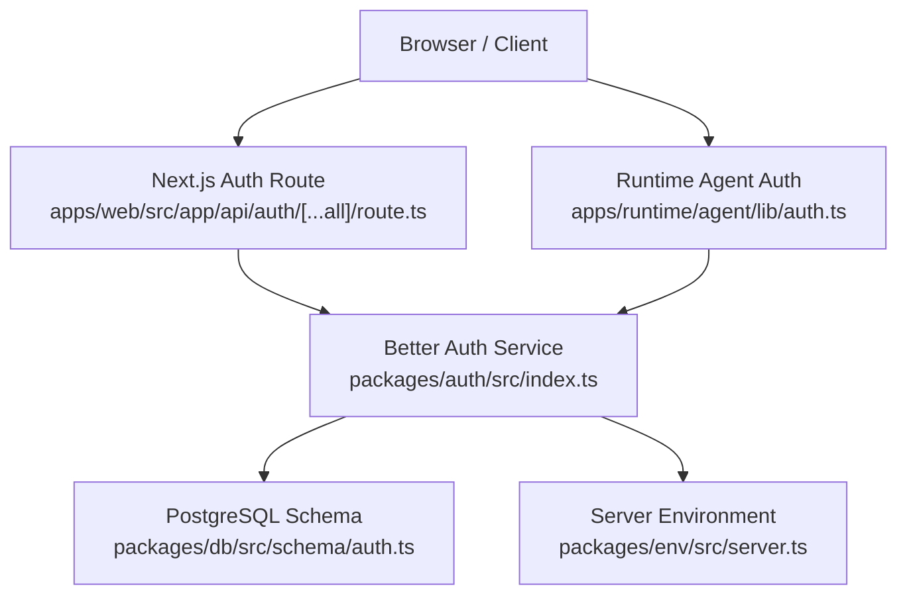
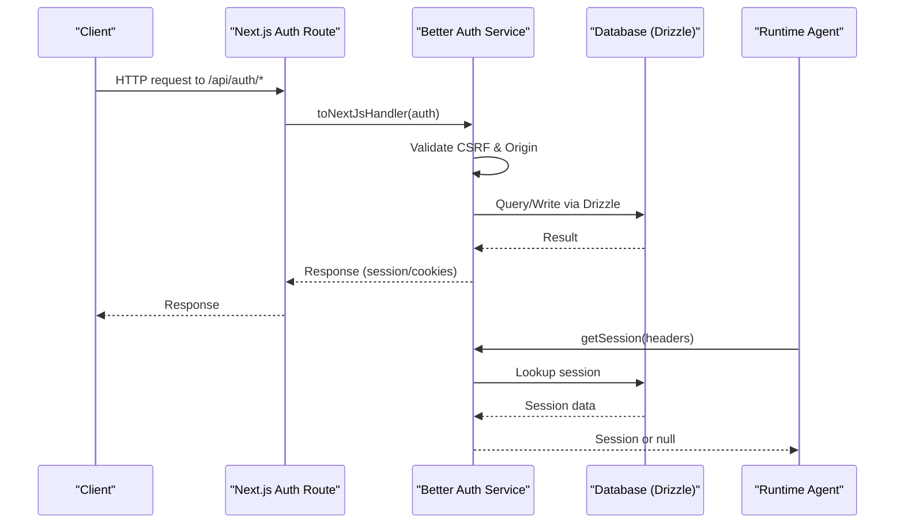
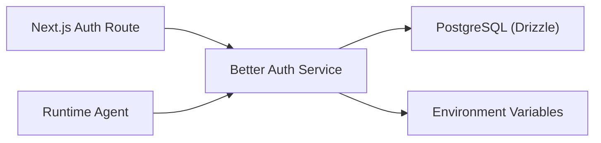

# Security Implementation

<cite>
**Referenced Files in This Document**
- [route.ts](file://apps/web/src/app/api/auth/[...all]/route.ts)
- [index.ts](file://packages/auth/src/index.ts)
- [server.ts](file://packages/env/src/server.ts)
- [auth-client.ts](file://apps/web/src/lib/auth-client.ts)
- [auth.ts](file://apps/runtime/agent/lib/auth.ts)
- [eve.ts](file://apps/runtime/agent/channels/eve.ts)
- [next.config.ts](file://apps/web/next.config.ts)
- [auth.ts](file://packages/db/src/schema/auth.ts)
- [SKILL.md](file://.agents/skills/better-auth-best-practices/SKILL.md)
</cite>

## Table of Contents

1. [Introduction](#introduction)
2. [Project Structure](#project-structure)
3. [Core Components](#core-components)
4. [Architecture Overview](#architecture-overview)
5. [Detailed Component Analysis](#detailed-component-analysis)
6. [Dependency Analysis](#dependency-analysis)
7. [Performance Considerations](#performance-considerations)
8. [Troubleshooting Guide](#troubleshooting-guide)
9. [Conclusion](#conclusion)
10. [Appendices](#appendices)

## Introduction

This document explains the security implementation for the authentication system, focusing on CSRF protection, XSS prevention, secure password handling, rate limiting and brute force mitigation, secure cookie configuration, input validation and SQL injection prevention, security headers and CORS policy, trusted origin validation, and production best practices including monitoring and incident response. It maps these concepts to the actual codebase components and configuration files.

## Project Structure

The authentication surface spans a Next.js API route that proxies requests to a centralized auth service, which is configured with database adapters, plugins, secrets, social providers, and trusted origins. The runtime agent also validates sessions using the same auth service.

**Diagram sources**

- [route.ts:1-5](file://apps/web/src/app/api/auth/[...all]/route.ts#L1-L5)
- [index.ts:1-43](file://packages/auth/src/index.ts#L1-L43)
- [auth.ts:1-101](file://packages/db/src/schema/auth.ts#L1-L101)
- [server.ts:1-29](file://packages/env/src/server.ts#L1-L29)
- [auth.ts:1-25](file://apps/runtime/agent/lib/auth.ts#L1-L25)

**Section sources**

- [route.ts:1-5](file://apps/web/src/app/api/auth/[...all]/route.ts#L1-L5)
- [index.ts:1-43](file://packages/auth/src/index.ts#L1-L43)
- [server.ts:1-29](file://packages/env/src/server.ts#L1-L29)
- [auth.ts:1-25](file://apps/runtime/agent/lib/auth.ts#L1-L25)

## Core Components

- Next.js Auth Route: Proxies all auth endpoints to Better Auth via a Next handler.
- Auth Service Configuration: Initializes Better Auth with Drizzle adapter, email/password, Telegram provider, Next cookies plugin, secret, Google OAuth, and trusted origins.
- Server Environment: Validates required environment variables (e.g., BETTER_AUTH_SECRET, BETTER_AUTH_URL, CORS_ORIGIN).
- Runtime Session Validation: Uses the auth service to validate sessions for the runtime agent.
- Database Schema: Defines user, session, account, and verification tables used by the auth system.

**Section sources**

- [route.ts:1-5](file://apps/web/src/app/api/auth/[...all]/route.ts#L1-L5)
- [index.ts:1-43](file://packages/auth/src/index.ts#L1-L43)
- [server.ts:1-29](file://packages/env/src/server.ts#L1-L29)
- [auth.ts:1-25](file://apps/runtime/agent/lib/auth.ts#L1-L25)
- [auth.ts:1-101](file://packages/db/src/schema/auth.ts#L1-L101)

## Architecture Overview

The request flow starts at the Next.js API route, which delegates to Better Auth. Better Auth enforces CSRF checks, origin validation, and rate limiting (when enabled), interacts with PostgreSQL through Drizzle, and manages sessions and cookies via the Next Cookies plugin. The runtime agent independently verifies sessions using the same auth service.

**Diagram sources**

- [route.ts:1-5](file://apps/web/src/app/api/auth/[...all]/route.ts#L1-L5)
- [index.ts:1-43](file://packages/auth/src/index.ts#L1-L43)
- [auth.ts:1-25](file://apps/runtime/agent/lib/auth.ts#L1-L25)
- [auth.ts:1-101](file://packages/db/src/schema/auth.ts#L1-L101)

## Detailed Component Analysis

### CSRF Protection Mechanisms

- Trusted Origins: Configured via trustedOrigins in the auth service to restrict cross-origin requests.
- CSRF Checks: Enabled by default in Better Auth; disabling is explicitly flagged as a security risk in best practices.
- Best Practices: Avoid disabling CSRF checks; ensure CORS_ORIGIN matches expected origins.

**Section sources**

- [index.ts:38-39](file://packages/auth/src/index.ts#L38-L39)
- [server.ts:16-16](file://packages/env/src/server.ts#L16-L16)
- [SKILL.md:114-126](file://.agents/skills/better-auth-best-practices/SKILL.md#L114-L126)

### XSS Prevention Strategies

- Input Validation: Use schema-based validation for inputs before processing to prevent injection and malformed payloads.
- Safe Rendering: Prefer server-side rendering and avoid dangerouslySetInnerHTML unless absolutely necessary; sanitize any user-generated content.
- Content Security Policy: Configure CSP headers to restrict script sources and mitigate XSS risks.

[No sources needed since this section provides general guidance]

### Secure Password Handling Practices

- Storage: Passwords are stored in the account table; ensure hashing is handled by the auth framework and never store plaintext.
- Transport: Enforce HTTPS to protect credentials in transit.
- Reset Flows: Implement secure password reset flows with time-limited tokens stored in the verification table.

**Section sources**

- [auth.ts:41-64](file://packages/db/src/schema/auth.ts#L41-L64)
- [auth.ts:66-81](file://packages/db/src/schema/auth.ts#L66-L81)
- [SKILL.md:106-111](file://.agents/skills/better-auth-best-practices/SKILL.md#L106-L111)

### Rate Limiting and Brute Force Prevention

- Rate Limiting: Better Auth supports configurable rate limits with window and max settings; storage can be memory, database, or secondary storage.
- Account Lockout: Not explicitly configured here; consider implementing lockout policies via hooks or custom middleware if required.
- Monitoring: Track failed attempts and trigger alerts for suspicious activity.

**Section sources**

- [SKILL.md:125-125](file://.agents/skills/better-auth-best-practices/SKILL.md#L125-L125)

### Secure Cookie Configuration

- Secure Flags: Use useSecureCookies to enforce HTTPS-only cookies.
- SameSite: Configure appropriate SameSite attribute based on cross-site needs.
- Domain Restrictions: Set domain to the application’s primary domain; avoid wildcard domains unless necessary.
- Session Expiry: Configure session expiration and update intervals to limit exposure.

**Section sources**

- [SKILL.md:118-123](file://.agents/skills/better-auth-best-practices/SKILL.md#L118-L123)
- [SKILL.md:86-92](file://.agents/skills/better-auth-best-practices/SKILL.md#L86-L92)

### Input Validation and Sanitization for Authentication Endpoints

- Schema Validation: Validate all inputs using strict schemas (e.g., Zod) before processing.
- Parameterized Queries: Use ORM/DRIZZLE parameter binding to prevent SQL injection.
- Sanitization: Escape or strip dangerous characters from user inputs when displaying or storing.

**Section sources**

- [server.ts:5-28](file://packages/env/src/server.ts#L5-L28)
- [index.ts:14-19](file://packages/auth/src/index.ts#L14-L19)

### SQL Injection Prevention

- ORM Usage: All queries go through Drizzle ORM, which uses parameterized queries.
- Schema Enforcement: Strict column types and constraints reduce injection surfaces.
- Avoid Raw SQL: Prefer ORM methods over raw SQL where possible.

**Section sources**

- [index.ts:14-19](file://packages/auth/src/index.ts#L14-L19)
- [auth.ts:1-101](file://packages/db/src/schema/auth.ts#L1-L101)

### Security Headers Configuration

- Recommended Headers:
  - Content-Security-Policy: Restrict script sources and inline scripts.
  - X-Content-Type-Options: Prevent MIME sniffing.
  - X-Frame-Options: Control framing.
  - Referrer-Policy: Limit referrer information.
  - Permissions-Policy: Restrict browser features.
- Implementation: Configure via Next.js headers or reverse proxy.

[No sources needed since this section provides general guidance]

### CORS Policy Setup and Trusted Origin Validation

- CORS Origin: Defined in environment and enforced via trustedOrigins in the auth service.
- Strict Matching: Ensure CORS_ORIGIN exactly matches allowed origins; avoid wildcards.
- Runtime CORS: Enable CORS only for trusted channels and restrict to specific paths.

**Section sources**

- [server.ts:16-16](file://packages/env/src/server.ts#L16-L16)
- [index.ts:38-39](file://packages/auth/src/index.ts#L38-L39)
- [eve.ts:6-9](file://apps/runtime/agent/channels/eve.ts#L6-L9)

### Session Management and Verification

- Session Retrieval: Runtime agent calls getSession with request headers to validate sessions.
- Session Storage: Sessions are persisted in the database with token, IP address, and user agent metadata.
- Expiration: Sessions have defined expiry times to limit long-lived access.

**Section sources**

- [auth.ts:1-25](file://apps/runtime/agent/lib/auth.ts#L1-L25)
- [auth.ts:21-39](file://packages/db/src/schema/auth.ts#L21-L39)

### Social Login and OAuth Security

- Providers: Google OAuth configured with client ID and secret from environment.
- Secrets Management: Ensure secrets are stored securely and not committed to version control.
- Redirect Validation: Use trustedOrigins to validate redirect URIs.

**Section sources**

- [index.ts:32-37](file://packages/auth/src/index.ts#L32-L37)
- [index.ts:38-39](file://packages/auth/src/index.ts#L38-L39)

### Client-Side Authentication Integration

- Auth Client: Initializes Better Auth client with plugins for Telegram and last login method tracking.
- Secure Requests: Ensure client sends proper headers and respects cookie attributes.

**Section sources**

- [auth-client.ts:1-8](file://apps/web/src/lib/auth-client.ts#L1-L8)

## Dependency Analysis

The authentication system depends on:

- Next.js API route delegating to Better Auth.
- Better Auth configured with Drizzle adapter and environment variables.
- PostgreSQL schema defining core entities.
- Runtime agent validating sessions via the auth service.

**Diagram sources**

- [route.ts:1-5](file://apps/web/src/app/api/auth/[...all]/route.ts#L1-L5)
- [index.ts:1-43](file://packages/auth/src/index.ts#L1-L43)
- [server.ts:1-29](file://packages/env/src/server.ts#L1-L29)
- [auth.ts:1-25](file://apps/runtime/agent/lib/auth.ts#L1-L25)
- [auth.ts:1-101](file://packages/db/src/schema/auth.ts#L1-L101)

**Section sources**

- [route.ts:1-5](file://apps/web/src/app/api/auth/[...all]/route.ts#L1-L5)
- [index.ts:1-43](file://packages/auth/src/index.ts#L1-L43)
- [server.ts:1-29](file://packages/env/src/server.ts#L1-L29)
- [auth.ts:1-25](file://apps/runtime/agent/lib/auth.ts#L1-L25)
- [auth.ts:1-101](file://packages/db/src/schema/auth.ts#L1-L101)

## Performance Considerations

- Session Cache: Use compact or JWT cache strategies to balance size and security.
- Rate Limit Storage: Choose storage backend (memory/database/secondary) based on scale and consistency needs.
- Image Optimization: Configure remote patterns to allow only trusted image hosts.

**Section sources**

- [SKILL.md:86-92](file://.agents/skills/better-auth-best-practices/SKILL.md#L86-L92)
- [SKILL.md:125-125](file://.agents/skills/better-auth-best-practices/SKILL.md#L125-L125)
- [next.config.ts:10-17](file://apps/web/next.config.ts#L10-L17)

## Troubleshooting Guide

- CSRF Errors: Verify trustedOrigins includes the correct origin; do not disable CSRF checks.
- CORS Issues: Ensure CORS_ORIGIN matches the client’s origin; check Next.js rewrites and runtime CORS settings.
- Session Failures: Confirm session headers are passed correctly; verify database connectivity and schema integrity.
- Rate Limiting: Adjust window and max values; monitor logs for repeated failures indicating potential abuse.

**Section sources**

- [index.ts:38-39](file://packages/auth/src/index.ts#L38-L39)
- [server.ts:16-16](file://packages/env/src/server.ts#L16-L16)
- [eve.ts:6-9](file://apps/runtime/agent/channels/eve.ts#L6-L9)
- [auth.ts:1-25](file://apps/runtime/agent/lib/auth.ts#L1-L25)

## Conclusion

The authentication system leverages Better Auth with robust defaults for CSRF protection, origin validation, and secure session management. Environment-driven configuration ensures secrets and origins are validated. While rate limiting and advanced lockout policies are available via Better Auth, explicit configurations should be added to meet organizational requirements. Production deployments should enforce secure cookies, configure security headers, enable CORS strictly, and implement monitoring and incident response procedures.

## Appendices

### Security Headers Checklist

- Content-Security-Policy
- X-Content-Type-Options
- X-Frame-Options
- Referrer-Policy
- Permissions-Policy

[No sources needed since this section provides general guidance]

### Production Deployment Best Practices

- Enforce HTTPS everywhere.
- Use strong secrets and rotate regularly.
- Enable rate limiting and consider account lockout policies.
- Monitor logs for anomalies and set up alerts.
- Conduct regular security audits and penetration testing.

[No sources needed since this section provides general guidance]
