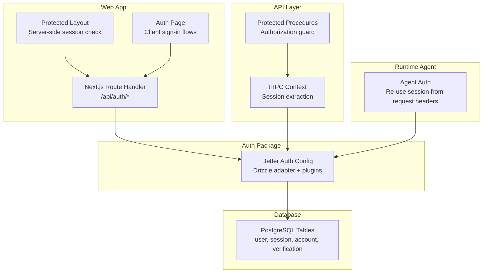
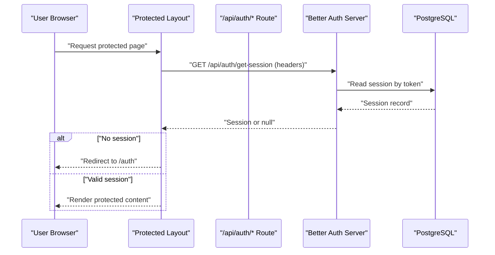
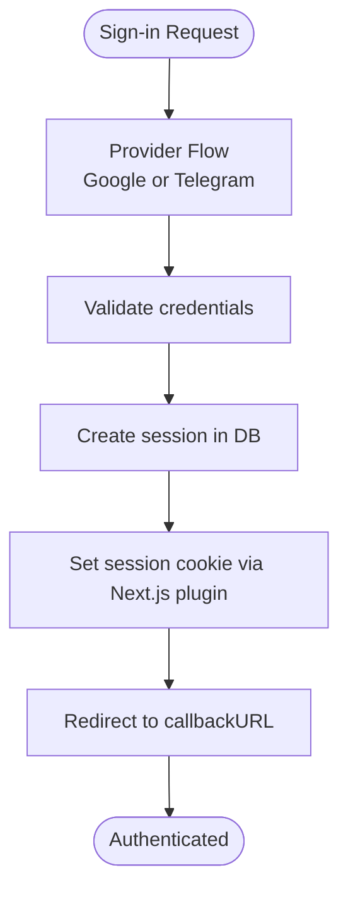
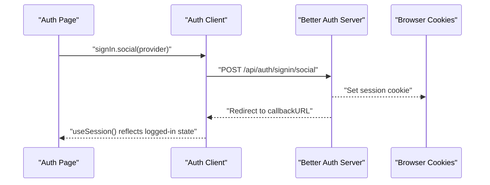
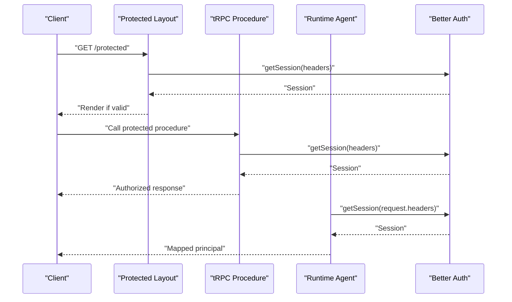
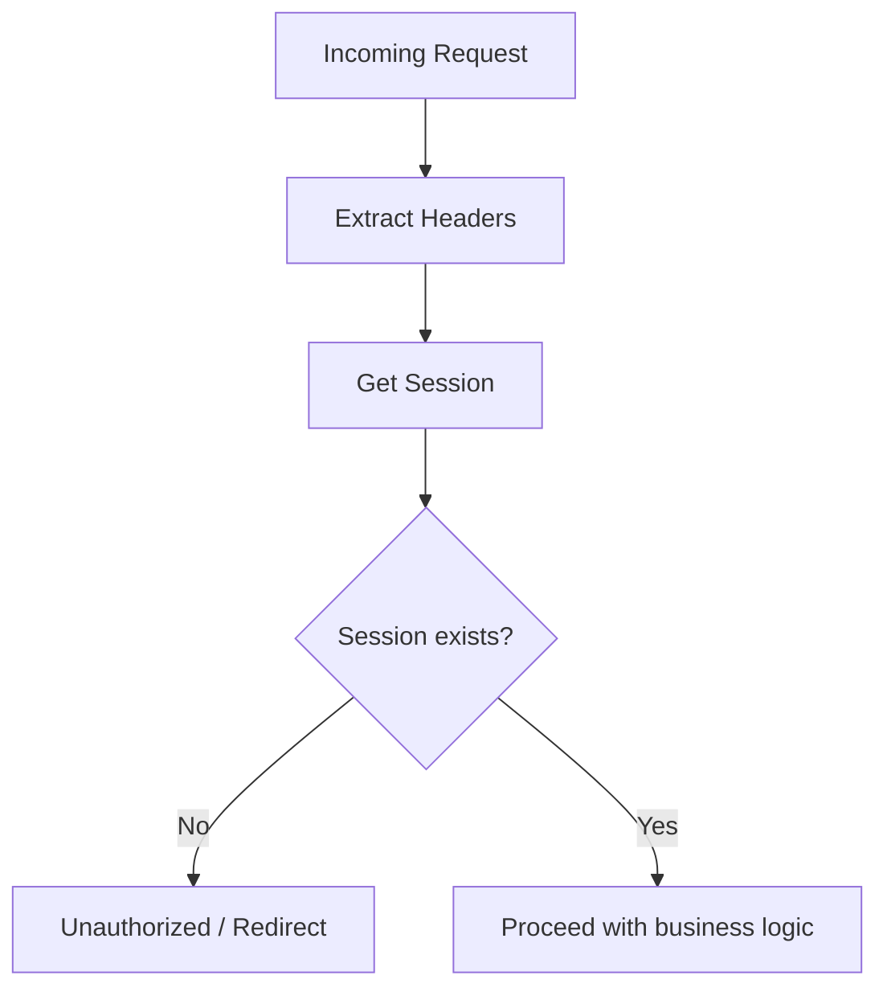
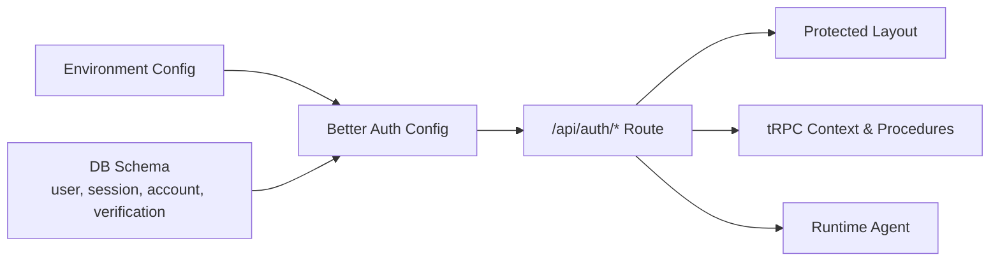

# Session Management

<cite>
**Referenced Files in This Document**
- [packages/auth/src/index.ts](file://packages/auth/src/index.ts)
- [apps/web/src/app/api/auth/[...all]/route.ts](file://apps/web/src/app/api/auth/[...all]/route.ts)
- [apps/web/src/lib/auth-client.ts](file://apps/web/src/lib/auth-client.ts)
- [apps/web/src/components/auth.tsx](file://apps/web/src/components/auth.tsx)
- [apps/web/src/app/(protected)/layout.tsx](file://apps/web/src/app/(protected)/layout.tsx)
- [packages/db/src/schema/auth.ts](file://packages/db/src/schema/auth.ts)
- [packages/env/src/server.ts](file://packages/env/src/server.ts)
- [packages/api/src/context.ts](file://packages/api/src/context.ts)
- [packages/api/src/index.ts](file://packages/api/src/index.ts)
- [apps/runtime/agent/lib/auth.ts](file://apps/runtime/agent/lib/auth.ts)
</cite>

## Table of Contents

1. Introduction
2. Project Structure
3. Core Components
4. Architecture Overview
5. Detailed Component Analysis
6. Dependency Analysis
7. Performance Considerations
8. Troubleshooting Guide
9. Conclusion

## Introduction

This document explains how the Atlas application manages sessions end-to-end using Better Auth with Drizzle ORM and Next.js. It covers server-side session creation, validation, and persistence; client-side session handling via cookies; synchronization across routes and services; lifecycle events (creation, refresh, termination); programmatic access; authorization checks; multi-device considerations; security best practices; and troubleshooting techniques.

## Project Structure

The session system spans several packages:

- Server configuration and API routing for authentication endpoints
- Client SDK for React-based session state and actions
- Database schema for users, sessions, accounts, and verifications
- Protected route guards and tRPC context that enforce authenticated access
- Runtime agent integration that reuses the same session to authenticate external requests

**Diagram sources**

- [apps/web/src/app/(protected)/layout.tsx:22-33](<file://apps/web/src/app/(protected)/layout.tsx#L22-L33>)
- [apps/web/src/components/auth.tsx:9-20](file://apps/web/src/components/auth.tsx#L9-L20)
- [apps/web/src/app/api/auth/[...all]/route.ts:1-5](file://apps/web/src/app/api/auth/[...all]/route.ts#L1-L5)
- [packages/auth/src/index.ts:10-40](file://packages/auth/src/index.ts#L10-L40)
- [packages/db/src/schema/auth.ts:21-39](file://packages/db/src/schema/auth.ts#L21-L39)
- [packages/api/src/context.ts:4-11](file://packages/api/src/context.ts#L4-L11)
- [packages/api/src/index.ts:11-25](file://packages/api/src/index.ts#L11-L25)
- [apps/runtime/agent/lib/auth.ts:4-24](file://apps/runtime/agent/lib/auth.ts#L4-L24)

**Section sources**

- [packages/auth/src/index.ts:10-40](file://packages/auth/src/index.ts#L10-L40)
- [apps/web/src/app/api/auth/[...all]/route.ts:1-5](file://apps/web/src/app/api/auth/[...all]/route.ts#L1-L5)
- [apps/web/src/lib/auth-client.ts:5-7](file://apps/web/src/lib/auth-client.ts#L5-L7)
- [apps/web/src/components/auth.tsx:9-20](file://apps/web/src/components/auth.tsx#L9-L20)
- [apps/web/src/app/(protected)/layout.tsx:22-33](<file://apps/web/src/app/(protected)/layout.tsx#L22-L33>)
- [packages/db/src/schema/auth.ts:21-39](file://packages/db/src/schema/auth.ts#L21-L39)
- [packages/api/src/context.ts:4-11](file://packages/api/src/context.ts#L4-L11)
- [packages/api/src/index.ts:11-25](file://packages/api/src/index.ts#L11-L25)
- [apps/runtime/agent/lib/auth.ts:4-24](file://apps/runtime/agent/lib/auth.ts#L4-L24)

## Core Components

- Server-side auth configuration and database integration:
  - Better Auth is configured with a Drizzle adapter pointing to PostgreSQL tables for user, session, account, and verification. Plugins include Telegram OAuth, last login method tracking, and Next.js cookie support.
- Next.js API route handler:
  - All /api/auth/* endpoints are proxied through a catch-all route that delegates to Better Auth’s Next.js handler.
- Client SDK:
  - The React client is created with matching plugins to enable social sign-in and last-used login method features.
- Protected layout:
  - Server component reads the current session from incoming headers and redirects unauthenticated users to the login page.
- tRPC context and protected procedures:
  - Extracts the session from the request and enforces authentication on protected procedures.
- Runtime agent:
  - Reuses the same session by reading request headers and mapping the session to an agent principal.

**Section sources**

- [packages/auth/src/index.ts:10-40](file://packages/auth/src/index.ts#L10-L40)
- [apps/web/src/app/api/auth/[...all]/route.ts:1-5](file://apps/web/src/app/api/auth/[...all]/route.ts#L1-L5)
- [apps/web/src/lib/auth-client.ts:5-7](file://apps/web/src/lib/auth-client.ts#L5-L7)
- [apps/web/src/app/(protected)/layout.tsx:22-33](<file://apps/web/src/app/(protected)/layout.tsx#L22-L33>)
- [packages/api/src/context.ts:4-11](file://packages/api/src/context.ts#L4-L11)
- [packages/api/src/index.ts:11-25](file://packages/api/src/index.ts#L11-L25)
- [apps/runtime/agent/lib/auth.ts:4-24](file://apps/runtime/agent/lib/auth.ts#L4-L24)

## Architecture Overview

The session flow integrates client UI, Next.js routes, Better Auth, and the database.

**Diagram sources**

- [apps/web/src/app/(protected)/layout.tsx:22-33](<file://apps/web/src/app/(protected)/layout.tsx#L22-L33>)
- [apps/web/src/app/api/auth/[...all]/route.ts:1-5](file://apps/web/src/app/api/auth/[...all]/route.ts#L1-L5)
- [packages/auth/src/index.ts:10-40](file://packages/auth/src/index.ts#L10-L40)
- [packages/db/src/schema/auth.ts:21-39](file://packages/db/src/schema/auth.ts#L21-L39)

## Detailed Component Analysis

### Server-Side Session Creation and Persistence

- Configuration:
  - Better Auth is initialized with a Drizzle adapter and PostgreSQL schema. Plugins add Telegram OAuth, last login method tracking, and Next.js cookie integration.
- Endpoints:
  - The Next.js catch-all route forwards all /api/auth/* calls to Better Auth, which handles sign-in, sign-out, session retrieval, and updates.
- Persistence:
  - Sessions are stored in PostgreSQL with fields including token, expiresAt, ipAddress, userAgent, and userId. Indexes optimize lookups by user.

**Diagram sources**

- [apps/web/src/components/auth.tsx:9-20](file://apps/web/src/components/auth.tsx#L9-L20)
- [packages/auth/src/index.ts:10-40](file://packages/auth/src/index.ts#L10-L40)
- [packages/db/src/schema/auth.ts:21-39](file://packages/db/src/schema/auth.ts#L21-L39)

**Section sources**

- [packages/auth/src/index.ts:10-40](file://packages/auth/src/index.ts#L10-L40)
- [apps/web/src/app/api/auth/[...all]/route.ts:1-5](file://apps/web/src/app/api/auth/[...all]/route.ts#L1-L5)
- [packages/db/src/schema/auth.ts:21-39](file://packages/db/src/schema/auth.ts#L21-L39)

### Client-Side Session Handling and Cookie Management

- Client SDK:
  - The React client is created with matching plugins to enable social sign-in and last-used login method features.
- Sign-in flows:
  - The auth page triggers Google or Telegram sign-in with a callback URL. After successful authentication, Better Auth sets a secure session cookie and redirects to the target route.
- Session state:
  - Components can read session state via hooks provided by the client SDK.

**Diagram sources**

- [apps/web/src/components/auth.tsx:9-20](file://apps/web/src/components/auth.tsx#L9-L20)
- [apps/web/src/lib/auth-client.ts:5-7](file://apps/web/src/lib/auth-client.ts#L5-L7)
- [apps/web/src/app/api/auth/[...all]/route.ts:1-5](file://apps/web/src/app/api/auth/[...all]/route.ts#L1-L5)

**Section sources**

- [apps/web/src/lib/auth-client.ts:5-7](file://apps/web/src/lib/auth-client.ts#L5-L7)
- [apps/web/src/components/auth.tsx:9-20](file://apps/web/src/components/auth.tsx#L9-L20)
- [apps/web/src/app/api/auth/[...all]/route.ts:1-5](file://apps/web/src/app/api/auth/[...all]/route.ts#L1-L5)

### Session Synchronization Across Application Parts

- Protected layout:
  - On each request to protected routes, the server reads the session from request headers and either renders protected content or redirects to the login page.
- tRPC context:
  - Each tRPC request extracts the session from headers and attaches it to the context. Protected procedures enforce authentication before executing logic.
- Runtime agent:
  - External runtime requests reuse the session by passing headers; the agent authenticates by calling the same session endpoint.

**Diagram sources**

- [apps/web/src/app/(protected)/layout.tsx:22-33](<file://apps/web/src/app/(protected)/layout.tsx#L22-L33>)
- [packages/api/src/context.ts:4-11](file://packages/api/src/context.ts#L4-L11)
- [packages/api/src/index.ts:11-25](file://packages/api/src/index.ts#L11-L25)
- [apps/runtime/agent/lib/auth.ts:4-24](file://apps/runtime/agent/lib/auth.ts#L4-L24)

**Section sources**

- [apps/web/src/app/(protected)/layout.tsx:22-33](<file://apps/web/src/app/(protected)/layout.tsx#L22-L33>)
- [packages/api/src/context.ts:4-11](file://packages/api/src/context.ts#L4-L11)
- [packages/api/src/index.ts:11-25](file://packages/api/src/index.ts#L11-L25)
- [apps/runtime/agent/lib/auth.ts:4-24](file://apps/runtime/agent/lib/auth.ts#L4-L24)

### Programmatic Session Access and Authorization Checks

- Server components:
  - Use the session API with request headers to determine access and redirect accordingly.
- tRPC procedures:
  - Use a protected procedure middleware that throws an unauthorized error when no session is present.
- Runtime agent:
  - Reads session from headers and maps it to an agent principal for downstream operations.

**Diagram sources**

- [apps/web/src/app/(protected)/layout.tsx:22-33](<file://apps/web/src/app/(protected)/layout.tsx#L22-L33>)
- [packages/api/src/index.ts:11-25](file://packages/api/src/index.ts#L11-L25)
- [apps/runtime/agent/lib/auth.ts:4-24](file://apps/runtime/agent/lib/auth.ts#L4-L24)

**Section sources**

- [apps/web/src/app/(protected)/layout.tsx:22-33](<file://apps/web/src/app/(protected)/layout.tsx#L22-L33>)
- [packages/api/src/index.ts:11-25](file://packages/api/src/index.ts#L11-L25)
- [apps/runtime/agent/lib/auth.ts:4-24](file://apps/runtime/agent/lib/auth.ts#L4-L24)

### Multi-Device Session Handling

- Sessions are tied to a unique token stored in the database and referenced by cookies. Multiple devices can hold different session tokens for the same user.
- Revocation strategies:
  - To terminate a session on one device, revoke the specific session token. To terminate all sessions for a user, revoke all sessions associated with that user.
- Best practice:
  - Always pass request headers when fetching sessions to ensure the correct device context is used.

[No sources needed since this section provides general guidance based on existing session model]

### Security Considerations

- CSRF protection:
  - Origin checking is enforced via trusted origins configuration. Avoid disabling CSRF checks unless you fully understand the risks.
- Secure cookies:
  - Ensure HTTPS is enforced and configure secure cookie settings appropriately.
- Rate limiting:
  - Enable rate limiting to mitigate brute-force attacks on authentication endpoints.
- Environment variables:
  - Validate required secrets and URLs at startup to prevent misconfiguration.

**Section sources**

- [packages/auth/src/index.ts:10-40](file://packages/auth/src/index.ts#L10-L40)
- [packages/env/src/server.ts:5-28](file://packages/env/src/server.ts#L5-L28)

## Dependency Analysis

The session system depends on environment configuration, database schema, and multiple layers of the application.

**Diagram sources**

- [packages/env/src/server.ts:5-28](file://packages/env/src/server.ts#L5-L28)
- [packages/auth/src/index.ts:10-40](file://packages/auth/src/index.ts#L10-L40)
- [packages/db/src/schema/auth.ts:21-39](file://packages/db/src/schema/auth.ts#L21-L39)
- [apps/web/src/app/api/auth/[...all]/route.ts:1-5](file://apps/web/src/app/api/auth/[...all]/route.ts#L1-L5)
- [apps/web/src/app/(protected)/layout.tsx:22-33](<file://apps/web/src/app/(protected)/layout.tsx#L22-L33>)
- [packages/api/src/context.ts:4-11](file://packages/api/src/context.ts#L4-L11)
- [packages/api/src/index.ts:11-25](file://packages/api/src/index.ts#L11-L25)
- [apps/runtime/agent/lib/auth.ts:4-24](file://apps/runtime/agent/lib/auth.ts#L4-L24)

**Section sources**

- [packages/env/src/server.ts:5-28](file://packages/env/src/server.ts#L5-L28)
- [packages/auth/src/index.ts:10-40](file://packages/auth/src/index.ts#L10-L40)
- [packages/db/src/schema/auth.ts:21-39](file://packages/db/src/schema/auth.ts#L21-L39)
- [apps/web/src/app/api/auth/[...all]/route.ts:1-5](file://apps/web/src/app/api/auth/[...all]/route.ts#L1-L5)
- [apps/web/src/app/(protected)/layout.tsx:22-33](<file://apps/web/src/app/(protected)/layout.tsx#L22-L33>)
- [packages/api/src/context.ts:4-11](file://packages/api/src/context.ts#L4-L11)
- [packages/api/src/index.ts:11-25](file://packages/api/src/index.ts#L11-L25)
- [apps/runtime/agent/lib/auth.ts:4-24](file://apps/runtime/agent/lib/auth.ts#L4-L24)

## Performance Considerations

- Prefer server-side session checks in layouts and API contexts to avoid unnecessary client round-trips.
- Use tRPC protected procedures to centralize authorization logic and reduce duplication.
- Keep session payloads minimal; rely on server-side lookups for sensitive details.
- Ensure database indexes on frequently queried fields (e.g., userId) to speed up session retrieval.

[No sources needed since this section provides general guidance]

## Troubleshooting Guide

Common issues and debugging steps:

- Missing session on protected routes:
  - Verify that request headers are passed when calling getSession. Check that cookies are set and not blocked by browser policies.
- CORS and CSRF errors:
  - Confirm trusted origins are correctly configured and match the client’s origin.
- Environment misconfiguration:
  - Validate required environment variables such as secrets and URLs at startup.
- tRPC unauthorized errors:
  - Ensure the tRPC context extracts the session from headers and that protected procedures are used for sensitive operations.
- Runtime agent authentication failures:
  - Confirm that the agent passes the full request headers to getSession so the correct session can be resolved.

**Section sources**

- [apps/web/src/app/(protected)/layout.tsx:22-33](<file://apps/web/src/app/(protected)/layout.tsx#L22-L33>)
- [packages/api/src/context.ts:4-11](file://packages/api/src/context.ts#L4-L11)
- [packages/api/src/index.ts:11-25](file://packages/api/src/index.ts#L11-L25)
- [apps/runtime/agent/lib/auth.ts:4-24](file://apps/runtime/agent/lib/auth.ts#L4-L24)
- [packages/env/src/server.ts:5-28](file://packages/env/src/server.ts#L5-L28)

## Conclusion

Atlas uses Better Auth with Drizzle ORM to provide robust, secure session management across the web app, API layer, and runtime agent. Sessions are persisted in PostgreSQL, synchronized via cookies, and validated server-side in layouts, tRPC procedures, and external integrations. Following the outlined security practices and troubleshooting steps will help maintain a reliable and safe authentication experience.
