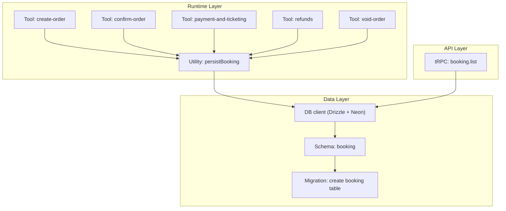
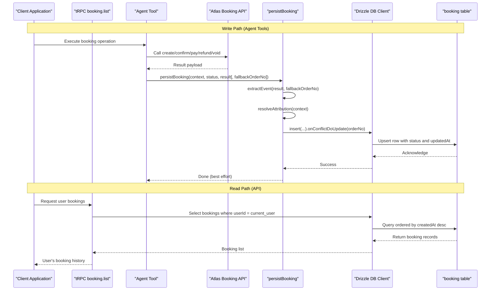
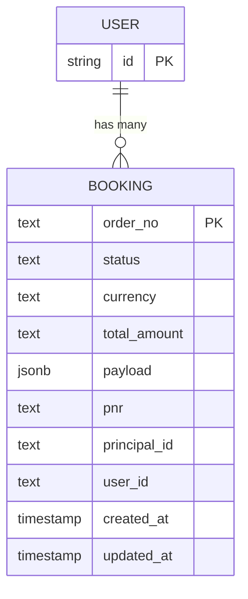
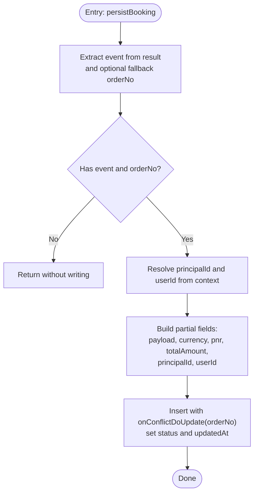
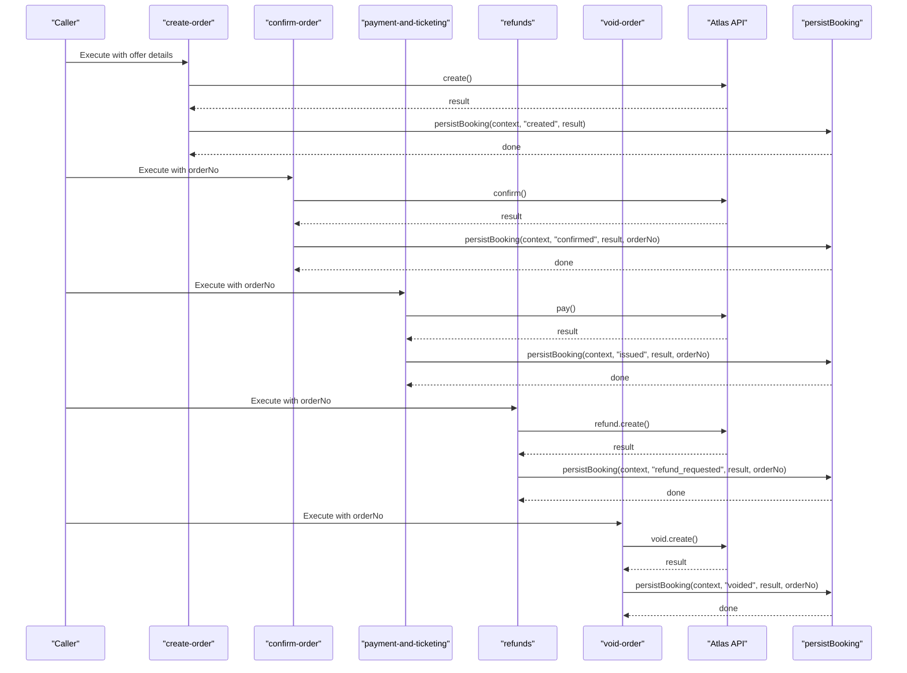
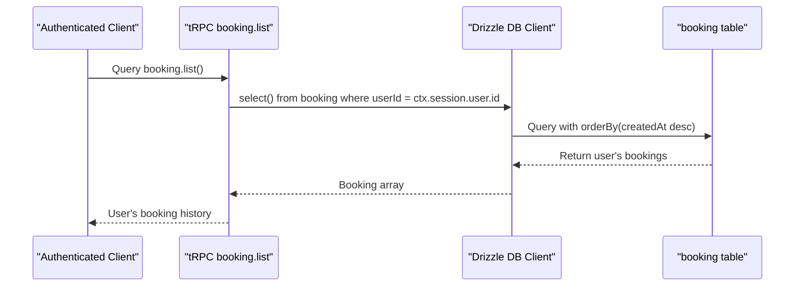
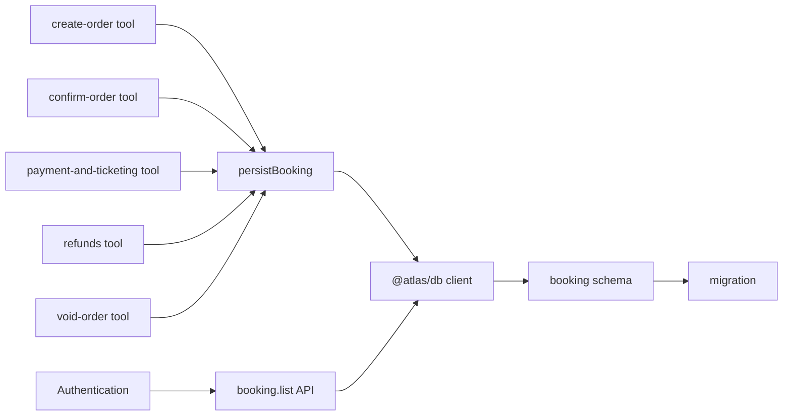

# Booking Database Persistence

<cite>
**Referenced Files in This Document**
- [packages/db/src/schema/booking.ts](file://packages/db/src/schema/booking.ts)
- [packages/db/src/migrations/0001_lumpy_chronomancer.sql](file://packages/db/src/migrations/0001_lumpy_chronomancer.sql)
- [packages/db/src/index.ts](file://packages/db/src/index.ts)
- [apps/runtime/agent/lib/bookings.ts](file://apps/runtime/agent/lib/bookings.ts)
- [apps/runtime/agent/tools/create-order.ts](file://apps/runtime/agent/tools/create-order.ts)
- [apps/runtime/agent/tools/confirm-order.ts](file://apps/runtime/agent/tools/confirm-order.ts)
- [apps/runtime/agent/tools/payment-and-ticketing.ts](file://apps/runtime/agent/tools/payment-and-ticketing.ts)
- [apps/runtime/agent/tools/refunds.ts](file://apps/runtime/agent/tools/refunds.ts)
- [apps/runtime/agent/tools/void-order.ts](file://apps/runtime/agent/tools/void-order.ts)
- [packages/api/src/routers/booking.ts](file://packages/api/src/routers/booking.ts)
</cite>

## Update Summary

**Changes Made**

- Added comprehensive API endpoints for retrieving user bookings via tRPC
- Expanded agent tool integration to cover complete booking lifecycle (payment, refunds, voids)
- Enhanced documentation to reflect full booking persistence system with read capabilities
- Updated architecture diagrams to include new API layer and additional lifecycle events

## Table of Contents

1. Introduction
2. Project Structure
3. Core Components
4. Architecture Overview
5. Detailed Component Analysis
6. Dependency Analysis
7. Performance Considerations
8. Troubleshooting Guide
9. Conclusion

## Introduction

This document explains how flight bookings are persisted in the system with a complete end-to-end solution including database schema, migrations, API endpoints for retrieving user bookings, and comprehensive integration with agent tools throughout the entire booking lifecycle. The design prioritizes resilience: persistence is best-effort and must never block or fail the money path, while providing full auditability through persistent records.

## Project Structure

The booking persistence spans three main areas:

- Data layer: Drizzle ORM schema and migrations under packages/db
- Runtime layer: Agent tools and shared persistence helper under apps/runtime/agent
- API layer: tRPC endpoints for reading user bookings under packages/api

**Diagram sources**

- [packages/db/src/schema/booking.ts:11-36](file://packages/db/src/schema/booking.ts#L11-L36)
- [packages/db/src/migrations/0001_lumpy_chronomancer.sql:1-15](file://packages/db/src/migrations/0001_lumpy_chronomancer.sql#L1-L15)
- [packages/db/src/index.ts:7-12](file://packages/db/src/index.ts#L7-L12)
- [apps/runtime/agent/lib/bookings.ts:100-143](file://apps/runtime/agent/lib/bookings.ts#L100-L143)
- [apps/runtime/agent/tools/create-order.ts:14-17](file://apps/runtime/agent/tools/create-order.ts#L14-L17)
- [apps/runtime/agent/tools/confirm-order.ts:14-17](file://apps/runtime/agent/tools/confirm-order.ts#L14-L17)
- [apps/runtime/agent/tools/payment-and-ticketing.ts:14-17](file://apps/runtime/agent/tools/payment-and-ticketing.ts#L14-L17)
- [apps/runtime/agent/tools/refunds.ts:14-17](file://apps/runtime/agent/tools/refunds.ts#L14-L17)
- [apps/runtime/agent/tools/void-order.ts:14-17](file://apps/runtime/agent/tools/void-order.ts#L14-L17)
- [packages/api/src/routers/booking.ts:7-15](file://packages/api/src/routers/booking.ts#L7-L15)

**Section sources**

- [packages/db/src/schema/booking.ts:11-36](file://packages/db/src/schema/booking.ts#L11-L36)
- [packages/db/src/migrations/0001_lumpy_chronomancer.sql:1-15](file://packages/db/src/migrations/0001_lumpy_chronomancer.sql#L1-L15)
- [packages/db/src/index.ts:7-12](file://packages/db/src/index.ts#L7-L12)
- [apps/runtime/agent/lib/bookings.ts:100-143](file://apps/runtime/agent/lib/bookings.ts#L100-L143)
- [apps/runtime/agent/tools/create-order.ts:14-17](file://apps/runtime/agent/tools/create-order.ts#L14-L17)
- [apps/runtime/agent/tools/confirm-order.ts:14-17](file://apps/runtime/agent/tools/confirm-order.ts#L14-L17)
- [apps/runtime/agent/tools/payment-and-ticketing.ts:14-17](file://apps/runtime/agent/tools/payment-and-ticketing.ts#L14-L17)
- [apps/runtime/agent/tools/refunds.ts:14-17](file://apps/runtime/agent/tools/refunds.ts#L14-L17)
- [apps/runtime/agent/tools/void-order.ts:14-17](file://apps/runtime/agent/tools/void-order.ts#L14-L17)
- [packages/api/src/routers/booking.ts:7-15](file://packages/api/src/routers/booking.ts#L7-L15)

## Core Components

- **Booking schema**: Defines the booking table with fields for lifecycle tracking, currency, total amount, PNR, payload snapshot, attribution to user/channel principal, and timestamps. Includes an index on user_id for efficient queries by user.
- **DB client**: Creates a Drizzle instance backed by Neon serverless SQL and exposes a shared db instance used by runtime code.
- **Persistence utility**: Extracts relevant fields from loosely-typed API results, resolves attribution (user vs channel principal), and upserts a single row per orderNo with status updates.
- **Agent tools**: Comprehensive set of tools covering the entire booking lifecycle - create-order, confirm-order, payment-and-ticketing, refunds, and void-order - all calling the Atlas booking API and then invoking the persistence utility to record each lifecycle event.
- **API endpoints**: tRPC router providing secure access to retrieve user bookings with proper authentication and authorization.

Key responsibilities:

- Schema ensures consistent structure and relationships to users.
- Migration materializes the schema in the database.
- Persistence utility isolates data extraction and upsert logic from business tools.
- Tools orchestrate external API calls and delegate persistence to the utility.
- API layer provides controlled read access to booking history for authenticated users.

**Section sources**

- [packages/db/src/schema/booking.ts:11-36](file://packages/db/src/schema/booking.ts#L11-L36)
- [packages/db/src/index.ts:7-12](file://packages/db/src/index.ts#L7-L12)
- [apps/runtime/agent/lib/bookings.ts:51-76](file://apps/runtime/agent/lib/bookings.ts#L51-L76)
- [apps/runtime/agent/lib/bookings.ts:81-93](file://apps/runtime/agent/lib/bookings.ts#L81-93)
- [apps/runtime/agent/lib/bookings.ts:100-143](file://apps/runtime/agent/lib/bookings.ts#L100-L143)
- [apps/runtime/agent/tools/create-order.ts:14-17](file://apps/runtime/agent/tools/create-order.ts#L14-L17)
- [apps/runtime/agent/tools/confirm-order.ts:14-17](file://apps/runtime/agent/tools/confirm-order.ts#L14-L17)
- [apps/runtime/agent/tools/payment-and-ticketing.ts:14-17](file://apps/runtime/agent/tools/payment-and-ticketing.ts#L14-L17)
- [apps/runtime/agent/tools/refunds.ts:14-17](file://apps/runtime/agent/tools/refunds.ts#L14-L17)
- [apps/runtime/agent/tools/void-order.ts:14-17](file://apps/runtime/agent/tools/void-order.ts#L14-L17)
- [packages/api/src/routers/booking.ts:7-15](file://packages/api/src/routers/booking.ts#L7-L15)

## Architecture Overview

The booking persistence flow is event-driven around order lifecycle changes with comprehensive coverage from creation to completion or cancellation. Each tool performs an Atlas API call and then persists the outcome as a new state for the same orderNo, while the API layer provides read access to the complete booking history.

**Diagram sources**

- [apps/runtime/agent/tools/create-order.ts:14-17](file://apps/runtime/agent/tools/create-order.ts#L14-L17)
- [apps/runtime/agent/tools/confirm-order.ts:14-17](file://apps/runtime/agent/tools/confirm-order.ts#L14-L17)
- [apps/runtime/agent/tools/payment-and-ticketing.ts:14-17](file://apps/runtime/agent/tools/payment-and-ticketing.ts#L14-L17)
- [apps/runtime/agent/tools/refunds.ts:14-17](file://apps/runtime/agent/tools/refunds.ts#L14-L17)
- [apps/runtime/agent/tools/void-order.ts:14-17](file://apps/runtime/agent/tools/void-order.ts#L14-L17)
- [apps/runtime/agent/lib/bookings.ts:51-76](file://apps/runtime/agent/lib/bookings.ts#L51-L76)
- [apps/runtime/agent/lib/bookings.ts:81-93](file://apps/runtime/agent/lib/bookings.ts#L81-L93)
- [apps/runtime/agent/lib/bookings.ts:100-143](file://apps/runtime/agent/lib/bookings.ts#L100-L143)
- [packages/api/src/routers/booking.ts:7-15](file://packages/api/src/routers/booking.ts#L7-L15)
- [packages/db/src/index.ts:7-12](file://packages/db/src/index.ts#L7-L12)

## Detailed Component Analysis

### Booking Schema and Migrations

- Primary key: orderNo (natural key from Atlas orders)
- Status: tracks lifecycle transitions (created, confirmed, issued, refund_requested, voided)
- Amounts and currency: stored as text to preserve precision and formatting
- Payload: JSONB snapshot of the latest API response for auditability
- Attribution: userId (nullable FK to user) and principalId (channel identity when not mapped to a user)
- Timestamps: createdAt and updatedAt; updatedAt auto-updates on row change
- Index: booking_userId_idx for fast lookups by user

**Diagram sources**

- [packages/db/src/schema/booking.ts:11-36](file://packages/db/src/schema/booking.ts#L11-L36)
- [packages/db/src/migrations/0001_lumpy_chronomancer.sql:1-15](file://packages/db/src/migrations/0001_lumpy_chronomancer.sql#L1-L15)

**Section sources**

- [packages/db/src/schema/booking.ts:11-36](file://packages/db/src/schema/booking.ts#L11-L36)
- [packages/db/src/migrations/0001_lumpy_chronomancer.sql:1-15](file://packages/db/src/migrations/0001_lumpy_chronomancer.sql#L1-L15)

### Persistence Utility: persistBooking

Responsibilities:

- Extract a normalized BookingEvent from loosely typed API results
- Resolve attribution to either a Better Auth user or a channel principal
- Upsert a single row per orderNo with current status and updatedAt
- Ensure failures do not propagate to callers (best-effort)

**Diagram sources**

- [apps/runtime/agent/lib/bookings.ts:51-76](file://apps/runtime/agent/lib/bookings.ts#L51-L76)
- [apps/runtime/agent/lib/bookings.ts:81-93](file://apps/runtime/agent/lib/bookings.ts#L81-L93)
- [apps/runtime/agent/lib/bookings.ts:100-143](file://apps/runtime/agent/lib/bookings.ts#L100-L143)

**Section sources**

- [apps/runtime/agent/lib/bookings.ts:51-76](file://apps/runtime/agent/lib/bookings.ts#L51-L76)
- [apps/runtime/agent/lib/bookings.ts:81-93](file://apps/runtime/agent/lib/bookings.ts#L81-L93)
- [apps/runtime/agent/lib/bookings.ts:100-143](file://apps/runtime/agent/lib/bookings.ts#L100-L143)

### Complete Agent Tool Integration

The system now supports the complete booking lifecycle through dedicated agent tools:

- **create-order**: Calls Atlas to create an order, then persists with status "created"
- **confirm-order**: Calls Atlas to confirm an order, then persists with status "confirmed", using the provided orderNo
- **payment-and-ticketing**: Processes payment and issues tickets, persisting status "issued"
- **refunds**: Creates refund requests, persisting status "refund_requested"
- **void-order**: Voids orders before ticketing, persisting status "voided"

**Diagram sources**

- [apps/runtime/agent/tools/create-order.ts:14-17](file://apps/runtime/agent/tools/create-order.ts#L14-L17)
- [apps/runtime/agent/tools/confirm-order.ts:14-17](file://apps/runtime/agent/tools/confirm-order.ts#L14-L17)
- [apps/runtime/agent/tools/payment-and-ticketing.ts:14-17](file://apps/runtime/agent/tools/payment-and-ticketing.ts#L14-L17)
- [apps/runtime/agent/tools/refunds.ts:14-17](file://apps/runtime/agent/tools/refunds.ts#L14-L17)
- [apps/runtime/agent/tools/void-order.ts:14-17](file://apps/runtime/agent/tools/void-order.ts#L14-L17)
- [apps/runtime/agent/lib/bookings.ts:100-143](file://apps/runtime/agent/lib/bookings.ts#L100-L143)

**Section sources**

- [apps/runtime/agent/tools/create-order.ts:14-17](file://apps/runtime/agent/tools/create-order.ts#L14-L17)
- [apps/runtime/agent/tools/confirm-order.ts:14-17](file://apps/runtime/agent/tools/confirm-order.ts#L14-L17)
- [apps/runtime/agent/tools/payment-and-ticketing.ts:14-17](file://apps/runtime/agent/tools/payment-and-ticketing.ts#L14-L17)
- [apps/runtime/agent/tools/refunds.ts:14-17](file://apps/runtime/agent/tools/refunds.ts#L14-L17)
- [apps/runtime/agent/tools/void-order.ts:14-17](file://apps/runtime/agent/tools/void-order.ts#L14-L17)
- [apps/runtime/agent/lib/bookings.ts:100-143](file://apps/runtime/agent/lib/bookings.ts#L100-L143)

### API Endpoints for User Bookings

The system includes a secure tRPC endpoint for retrieving user bookings:

- **booking.list**: Protected procedure that returns all bookings for the authenticated user, ordered by creation date (newest first)
- Uses proper authentication context to ensure users can only access their own bookings
- Leverages the user_id index for efficient querying

**Diagram sources**

- [packages/api/src/routers/booking.ts:7-15](file://packages/api/src/routers/booking.ts#L7-L15)
- [packages/db/src/index.ts:7-12](file://packages/db/src/index.ts#L7-L12)

**Section sources**

- [packages/api/src/routers/booking.ts:7-15](file://packages/api/src/routers/booking.ts#L7-L15)

## Dependency Analysis

- Runtime tools depend on the persistence utility to ensure consistent recording of order lifecycle events
- The persistence utility depends on:
  - DB client exported from the data package
  - Booking schema for type-safe upserts
- The DB client depends on environment configuration for the database URL and uses Neon HTTP driver with Drizzle
- API layer depends on the booking schema and DB client for read operations
- Authentication middleware protects API endpoints to ensure users can only access their own bookings

**Diagram sources**

- [apps/runtime/agent/tools/create-order.ts:14-17](file://apps/runtime/agent/tools/create-order.ts#L14-L17)
- [apps/runtime/agent/tools/confirm-order.ts:14-17](file://apps/runtime/agent/tools/confirm-order.ts#L14-L17)
- [apps/runtime/agent/tools/payment-and-ticketing.ts:14-17](file://apps/runtime/agent/tools/payment-and-ticketing.ts#L14-L17)
- [apps/runtime/agent/tools/refunds.ts:14-17](file://apps/runtime/agent/tools/refunds.ts#L14-L17)
- [apps/runtime/agent/tools/void-order.ts:14-17](file://apps/runtime/agent/tools/void-order.ts#L14-L17)
- [apps/runtime/agent/lib/bookings.ts:100-143](file://apps/runtime/agent/lib/bookings.ts#L100-L143)
- [packages/api/src/routers/booking.ts:7-15](file://packages/api/src/routers/booking.ts#L7-L15)
- [packages/db/src/index.ts:7-12](file://packages/db/src/index.ts#L7-L12)
- [packages/db/src/schema/booking.ts:11-36](file://packages/db/src/schema/booking.ts#L11-L36)
- [packages/db/src/migrations/0001_lumpy_chronomancer.sql:1-15](file://packages/db/src/migrations/0001_lumpy_chronomancer.sql#L1-L15)

**Section sources**

- [apps/runtime/agent/lib/bookings.ts:100-143](file://apps/runtime/agent/lib/bookings.ts#L100-L143)
- [packages/api/src/routers/booking.ts:7-15](file://packages/api/src/routers/booking.ts#L7-L15)
- [packages/db/src/index.ts:7-12](file://packages/db/src/index.ts#L7-L12)
- [packages/db/src/schema/booking.ts:11-36](file://packages/db/src/schema/booking.ts#L11-L36)
- [packages/db/src/migrations/0001_lumpy_chronomancer.sql:1-15](file://packages/db/src/migrations/0001_lumpy_chronomancer.sql#L1-L15)

## Performance Considerations

- Upsert strategy: Using orderNo as primary key avoids duplicate rows and supports incremental updates with minimal writes
- Indexing: An index on user_id enables efficient per-user queries for dashboards and support workflows
- Best-effort persistence: Errors are swallowed to prevent blocking the money path; this improves throughput at the cost of potential transient data loss, which is acceptable given the design goal
- Payload storage: Storing full API responses as JSONB provides rich audit trails but increases row size; consider pruning or archiving large payloads if storage becomes constrained
- Query optimization: The booking.list API leverages the user_id index and orders by createdAt for optimal performance

## Troubleshooting Guide

Common issues and mitigations:

- Missing orderNo in API result: The utility falls back to a provided orderNo when available; ensure tools pass the correct orderNo for confirmation flows
- Empty or malformed payload: Extraction helpers safely handle varied shapes; if no valid event is detected, no write occurs—verify upstream API contracts
- Attribution not resolved: If session/auth context lacks a user, principalId may be set instead; check channel-specific authentication paths
- Database connectivity errors: Since persistence is best-effort, transient DB failures will not fail the booking; monitor logs separately for observability
- API access issues: Ensure proper authentication is configured for tRPC endpoints and users have appropriate permissions

Operational checks:

- Verify migration has been applied to create the booking table and indexes
- Confirm environment variables provide a valid DATABASE_URL for the DB client
- Validate that tools call persistBooking after successful API responses
- Test API endpoints with authenticated users to ensure proper authorization

**Section sources**

- [apps/runtime/agent/lib/bookings.ts:51-76](file://apps/runtime/agent/lib/bookings.ts#L51-L76)
- [apps/runtime/agent/lib/bookings.ts:81-93](file://apps/runtime/agent/lib/bookings.ts#L81-L93)
- [apps/runtime/agent/lib/bookings.ts:100-143](file://apps/runtime/agent/lib/bookings.ts#L100-L143)
- [packages/api/src/routers/booking.ts:7-15](file://packages/api/src/routers/booking.ts#L7-L15)
- [packages/db/src/index.ts:7-12](file://packages/db/src/index.ts#L7-L12)
- [packages/db/src/migrations/0001_lumpy_chronomancer.sql:1-15](file://packages/db/src/migrations/0001_lumpy_chronomancer.sql#L1-L15)

## Conclusion

The booking persistence system is now a complete end-to-end solution that covers the entire booking lifecycle from creation to completion or cancellation. The intentionally resilient and decoupled design ensures that order lifecycle events are recorded reliably without impacting core booking operations. With comprehensive agent tool integration covering all major booking states, a robust schema with targeted indexing, best-effort upsert strategies, and secure API endpoints for reading user bookings, the system provides both operational reliability and comprehensive auditability. Tools integrate cleanly by delegating persistence to a shared utility, keeping business logic focused on orchestrating external services while maintaining a clear audit trail in the database.
