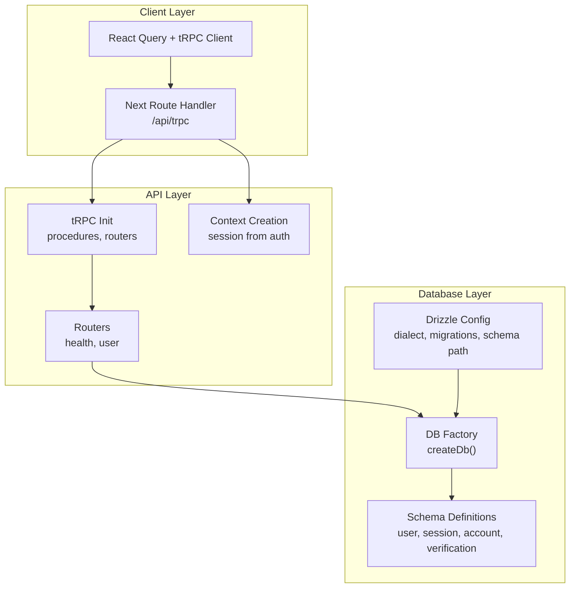
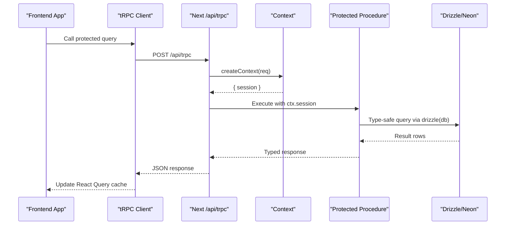
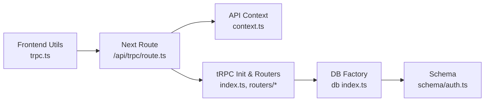

# Data Access Patterns

<cite>
**Referenced Files in This Document**
- [packages/db/src/index.ts](file://packages/db/src/index.ts)
- [packages/db/src/schema/auth.ts](file://packages/db/src/schema/auth.ts)
- [packages/db/drizzle.config.ts](file://packages/db/drizzle.config.ts)
- [packages/api/src/index.ts](file://packages/api/src/index.ts)
- [packages/api/src/context.ts](file://packages/api/src/context.ts)
- [packages/api/src/routers/user.ts](file://packages/api/src/routers/user.ts)
- [packages/api/src/routers/index.ts](file://packages/api/src/routers/index.ts)
- [apps/web/src/app/api/trpc/[trpc]/route.ts](file://apps/web/src/app/api/trpc/[trpc]/route.ts)
- [apps/web/src/utils/trpc.ts](file://apps/web/src/utils/trpc.ts)
</cite>

## Table of Contents

1. Introduction
2. Project Structure
3. Core Components
4. Architecture Overview
5. Detailed Component Analysis
6. Dependency Analysis
7. Performance Considerations
8. Troubleshooting Guide
9. Conclusion

## Introduction

This document explains the data access patterns and repository-style abstractions used across the application. It focuses on how the database layer is configured, how schemas are defined with Drizzle ORM, how the API layer exposes typed procedures via tRPC, and how the Next.js app consumes these APIs. It also covers query composition, filtering/sorting/pagination strategies, transaction handling, concurrency, error recovery, caching, performance monitoring, security considerations (SQL injection prevention, access control, sanitization), and testing strategies for the data access layer.

## Project Structure

The data access stack spans three main layers:

- Database layer: Drizzle ORM configuration, schema definitions, and a Neon HTTP client factory.
- API layer: tRPC router setup, context creation for authentication, and procedure definitions.
- Client layer: Next.js route handler that wires tRPC to the server, and a React Query-backed client for the frontend.

**Diagram sources**

- [packages/db/src/index.ts:1-12](file://packages/db/src/index.ts#L1-L12)
- [packages/db/src/schema/auth.ts:1-101](file://packages/db/src/schema/auth.ts#L1-L101)
- [packages/db/drizzle.config.ts:1-15](file://packages/db/drizzle.config.ts#L1-L15)
- [packages/api/src/index.ts:1-25](file://packages/api/src/index.ts#L1-L25)
- [packages/api/src/context.ts:1-15](file://packages/api/src/context.ts#L1-L15)
- [packages/api/src/routers/user.ts:1-8](file://packages/api/src/routers/user.ts#L1-L8)
- [packages/api/src/routers/index.ts:1-11](file://packages/api/src/routers/index.ts#L1-L11)
- [apps/web/src/app/api/trpc/[trpc]/route.ts:1-13](file://apps/web/src/app/api/trpc/[trpc]/route.ts#L1-L13)
- [apps/web/src/utils/trpc.ts:1-39](file://apps/web/src/utils/trpc.ts#L1-L39)

**Section sources**

- [packages/db/src/index.ts:1-12](file://packages/db/src/index.ts#L1-L12)
- [packages/db/src/schema/auth.ts:1-101](file://packages/db/src/schema/auth.ts#L1-L101)
- [packages/db/drizzle.config.ts:1-15](file://packages/db/drizzle.config.ts#L1-L15)
- [packages/api/src/index.ts:1-25](file://packages/api/src/index.ts#L1-L25)
- [packages/api/src/context.ts:1-15](file://packages/api/src/context.ts#L1-L15)
- [packages/api/src/routers/user.ts:1-8](file://packages/api/src/routers/user.ts#L1-L8)
- [packages/api/src/routers/index.ts:1-11](file://packages/api/src/routers/index.ts#L1-L11)
- [apps/web/src/app/api/trpc/[trpc]/route.ts:1-13](file://apps/web/src/app/api/trpc/[trpc]/route.ts#L1-L13)
- [apps/web/src/utils/trpc.ts:1-39](file://apps/web/src/utils/trpc.ts#L1-L39)

## Core Components

- Database factory: Creates a Neon HTTP SQL client and initializes Drizzle with schema types.
- Schema models: Defines tables for user, session, account, and verification with relations and indexes.
- tRPC initialization: Provides public and protected procedures with middleware for session validation.
- Context: Resolves the current session per request using an auth API.
- Routers: Expose typed endpoints; example includes a protected query returning session-scoped data.
- Next.js route handler: Wires tRPC into Next.js fetch handlers.
- Client: Sets up React Query and tRPC client with batched HTTP links and error handling.

Key responsibilities:

- Encapsulate database connection and type-safe queries behind a single factory.
- Centralize schema definitions and relationships for consistent modeling.
- Enforce authentication at the API boundary via protected procedures.
- Provide a strongly-typed client for the frontend with caching and error UX.

**Section sources**

- [packages/db/src/index.ts:1-12](file://packages/db/src/index.ts#L1-L12)
- [packages/db/src/schema/auth.ts:1-101](file://packages/db/src/schema/auth.ts#L1-L101)
- [packages/api/src/index.ts:1-25](file://packages/api/src/index.ts#L1-L25)
- [packages/api/src/context.ts:1-15](file://packages/api/src/context.ts#L1-L15)
- [packages/api/src/routers/user.ts:1-8](file://packages/api/src/routers/user.ts#L1-L8)
- [apps/web/src/app/api/trpc/[trpc]/route.ts:1-13](file://apps/web/src/app/api/trpc/[trpc]/route.ts#L1-L13)
- [apps/web/src/utils/trpc.ts:1-39](file://apps/web/src/utils/trpc.ts#L1-L39)

## Architecture Overview

End-to-end flow from client to database:

**Diagram sources**

- [apps/web/src/utils/trpc.ts:1-39](file://apps/web/src/utils/trpc.ts#L1-L39)
- [apps/web/src/app/api/trpc/[trpc]/route.ts:1-13](file://apps/web/src/app/api/trpc/[trpc]/route.ts#L1-L13)
- [packages/api/src/context.ts:1-15](file://packages/api/src/context.ts#L1-L15)
- [packages/api/src/index.ts:1-25](file://packages/api/src/index.ts#L1-L25)
- [packages/db/src/index.ts:1-12](file://packages/db/src/index.ts#L1-L12)

## Detailed Component Analysis

### Database Layer: Drizzle ORM and Neon HTTP

- Connection factory: Initializes a Neon HTTP client from environment and returns a Drizzle instance bound to the schema.
- Schema: Defines entities and relations; includes timestamps, unique constraints, foreign keys, and indexes for performance.
- Configuration: Specifies dialect, migration output directory, and schema path.

Patterns:

- Use schema-defined columns and relations to compose queries safely.
- Leverage indexes on frequently filtered fields (e.g., userId, identifier).
- Keep schema changes versioned via migrations.

Security:

- Parameterized queries via Drizzle prevent SQL injection by design.
- Unique constraints and foreign keys enforce referential integrity.

Performance:

- Indexes on lookup columns reduce query latency.
- Select only needed fields to minimize payload size.

Testing:

- Use an isolated test database and apply migrations before tests.
- Mock external services if any; keep DB interactions real for integration tests.

**Section sources**

- [packages/db/src/index.ts:1-12](file://packages/db/src/index.ts#L1-L12)
- [packages/db/src/schema/auth.ts:1-101](file://packages/db/src/schema/auth.ts#L1-L101)
- [packages/db/drizzle.config.ts:1-15](file://packages/db/drizzle.config.ts#L1-L15)

### API Layer: tRPC Procedures and Context

- Public vs protected procedures: Middleware enforces session presence; unauthorized requests receive a standardized error.
- Context: Extracts session from incoming request headers using an auth API.
- Router composition: Aggregates feature routers under a single app router.

Patterns:

- Validate inputs at the procedure boundary.
- Return typed responses to ensure end-to-end type safety.
- Centralize error handling via tRPC errors.

Security:

- Authentication enforced via protected procedures prevents unauthorized data access.
- Avoid leaking sensitive fields in responses.

Performance:

- Batch network calls where possible at the client side; keep procedures focused.

Testing:

- Unit-test procedures with mocked context and DB.
- Integration-test routes against a test DB.

**Section sources**

- [packages/api/src/index.ts:1-25](file://packages/api/src/index.ts#L1-L25)
- [packages/api/src/context.ts:1-15](file://packages/api/src/context.ts#L1-L15)
- [packages/api/src/routers/index.ts:1-11](file://packages/api/src/routers/index.ts#L1-L11)
- [packages/api/src/routers/user.ts:1-8](file://packages/api/src/routers/user.ts#L1-L8)

### Client Layer: Next.js Route Handler and React Query Client

- Route handler: Uses tRPC’s fetch adapter to handle GET/POST to /api/trpc, creating context per request.
- Client: Configures React Query with error handling and retries; uses httpBatchLink for efficient batching.

Patterns:

- Co-locate client utilities to encapsulate endpoint calls.
- Use React Query for caching, deduplication, and background refetching.

Security:

- Include credentials with requests to maintain session state.

Performance:

- Batching reduces round trips.
- Configure retry policies and stale times appropriately.

Testing:

- Mock fetch or use MSW to simulate API responses.
- Test React Query behavior with test utilities.

**Section sources**

- [apps/web/src/app/api/trpc/[trpc]/route.ts:1-13](file://apps/web/src/app/api/trpc/[trpc]/route.ts#L1-L13)
- [apps/web/src/utils/trpc.ts:1-39](file://apps/web/src/utils/trpc.ts#L1-L39)

## Dependency Analysis

High-level dependencies between components:

**Diagram sources**

- [apps/web/src/utils/trpc.ts:1-39](file://apps/web/src/utils/trpc.ts#L1-L39)
- [apps/web/src/app/api/trpc/[trpc]/route.ts:1-13](file://apps/web/src/app/api/trpc/[trpc]/route.ts#L1-L13)
- [packages/api/src/context.ts:1-15](file://packages/api/src/context.ts#L1-L15)
- [packages/api/src/index.ts:1-25](file://packages/api/src/index.ts#L1-L25)
- [packages/api/src/routers/user.ts:1-8](file://packages/api/src/routers/user.ts#L1-L8)
- [packages/db/src/index.ts:1-12](file://packages/db/src/index.ts#L1-L12)
- [packages/db/src/schema/auth.ts:1-101](file://packages/db/src/schema/auth.ts#L1-L101)

**Section sources**

- [apps/web/src/utils/trpc.ts:1-39](file://apps/web/src/utils/trpc.ts#L1-L39)
- [apps/web/src/app/api/trpc/[trpc]/route.ts:1-13](file://apps/web/src/app/api/trpc/[trpc]/route.ts#L1-L13)
- [packages/api/src/index.ts:1-25](file://packages/api/src/index.ts#L1-L25)
- [packages/api/src/context.ts:1-15](file://packages/api/src/context.ts#L1-L15)
- [packages/db/src/index.ts:1-12](file://packages/db/src/index.ts#L1-L12)
- [packages/db/src/schema/auth.ts:1-101](file://packages/db/src/schema/auth.ts#L1-L101)

## Performance Considerations

- Query optimization:
  - Use selective field projection to reduce payload sizes.
  - Add indexes on frequently filtered columns (e.g., userId, identifier).
  - Prefer joins over multiple round-trips when fetching related data.
- Pagination:
  - Implement cursor-based pagination for large datasets to avoid offset costs.
  - Combine with stable sort keys to ensure deterministic ordering.
- Concurrency:
  - Use parallel execution for independent reads to reduce latency.
  - Defer awaits until values are needed to avoid blocking unnecessary paths.
- Caching:
  - Leverage React Query for client-side caching and deduplication.
  - For server-side cross-request caching, consider LRU caches where appropriate.
- Monitoring:
  - Instrument slow queries and log metrics for critical paths.
  - Track error rates and latencies per procedure.

[No sources needed since this section provides general guidance]

## Troubleshooting Guide

Common issues and resolutions:

- Unauthorized access:
  - Ensure session exists in context; protected procedures will reject missing sessions.
- Network errors:
  - The client configures error handling with retry actions; verify connectivity and credentials.
- Database connectivity:
  - Validate DATABASE_URL and Neon configuration; check migrations are applied.
- Schema mismatches:
  - Align schema changes with migrations; regenerate types if necessary.

Operational tips:

- Use structured logging around procedures to capture inputs and outcomes.
- Add timeouts and circuit breakers for downstream dependencies.
- Normalize upstream errors into consistent tRPC errors for uniform handling.

**Section sources**

- [packages/api/src/index.ts:11-25](file://packages/api/src/index.ts#L11-L25)
- [apps/web/src/utils/trpc.ts:7-20](file://apps/web/src/utils/trpc.ts#L7-L20)

## Conclusion

The application employs a layered data access architecture:

- Drizzle ORM with a Neon HTTP client provides type-safe, parameterized queries and schema-driven modeling.
- tRPC enforces secure, typed APIs with session-based authorization and centralized error handling.
- The Next.js client integrates React Query for efficient caching and robust error UX.

Adopting the recommended patterns—selective projections, indexed queries, cursor pagination, parallel reads, and clear error normalization—will improve performance, reliability, and maintainability. Security is strengthened through parameterized queries, strict access controls, and minimal exposure of sensitive data. Testing should combine unit tests for logic with integration tests against a real database to validate end-to-end behavior.
