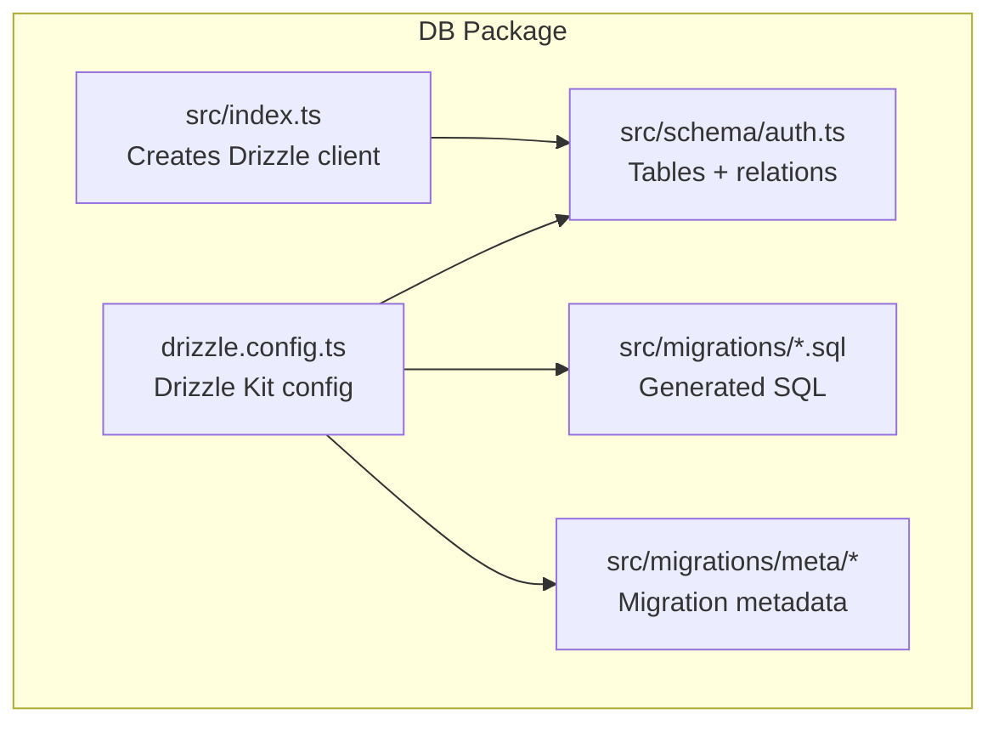
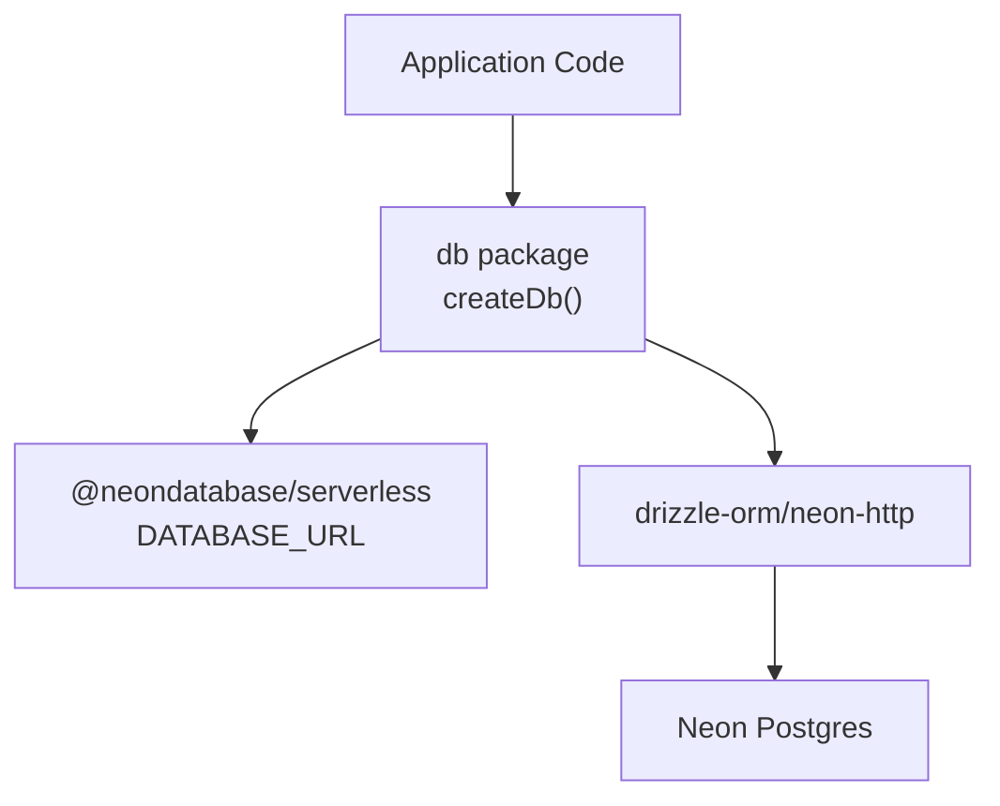
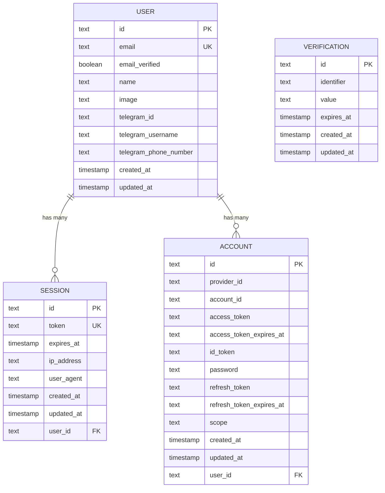
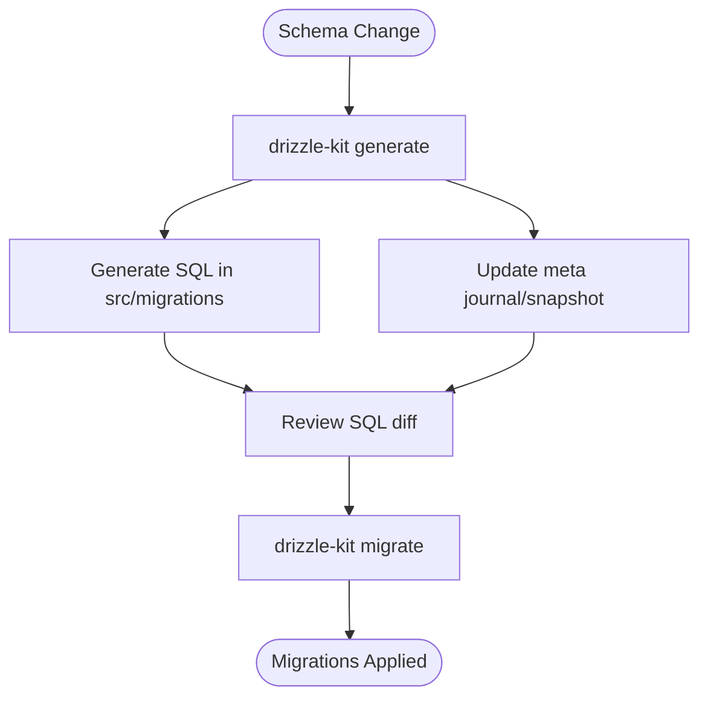
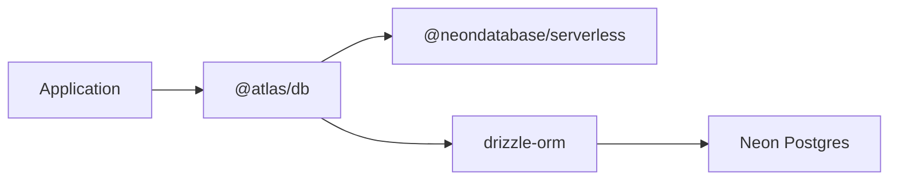

# Database Layer

<cite>
**Referenced Files in This Document**
- [packages/db/src/index.ts](file://packages/db/src/index.ts)
- [packages/db/drizzle.config.ts](file://packages/db/drizzle.config.ts)
- [packages/db/package.json](file://packages/db/package.json)
- [packages/db/src/schema/auth.ts](file://packages/db/src/schema/auth.ts)
- [packages/db/src/migrations/0000_breezy_la_nuit.sql](file://packages/db/src/migrations/0000_breezy_la_nuit.sql)
- [packages/db/src/migrations/meta/_journal.json](file://packages/db/src/migrations/meta/_journal.json)
- [packages/db/src/migrations/meta/0000_snapshot.json](file://packages/db/src/migrations/meta/0000_snapshot.json)
</cite>

## Table of Contents

1. Introduction
2. Project Structure
3. Core Components
4. Architecture Overview
5. Detailed Component Analysis
6. Dependency Analysis
7. Performance Considerations
8. Troubleshooting Guide
9. Conclusion
10. Appendices

## Introduction

This document describes the PostgreSQL database layer implemented with Drizzle ORM. It covers entity relationships, field definitions, data types, constraints, indexes, schema design patterns, migration and versioning strategies, connection configuration, environment-specific settings, administration tasks, common CRUD operations, transaction handling, performance considerations, security, backups, and disaster recovery. The current schema implements authentication-related entities (user, session, account, verification). Domain entities such as flights, bookings, trips, and activity logs are not present in the codebase at this time; guidance is provided for extending the schema when needed.

## Project Structure

The database layer is encapsulated in a dedicated package that exports a typed Drizzle client and defines the schema and migrations:

- Schema definitions live under packages/db/src/schema.
- Migrations are generated into packages/db/src/migrations.
- A Drizzle configuration file points to the schema directory and migration output path.
- A runtime module creates a Neon HTTP Drizzle client using an environment variable for the database URL.

**Diagram sources**

- [packages/db/src/index.ts:1-12](file://packages/db/src/index.ts#L1-L12)
- [packages/db/drizzle.config.ts:1-16](file://packages/db/drizzle.config.ts#L1-L16)
- [packages/db/src/schema/auth.ts:1-101](file://packages/db/src/schema/auth.ts#L1-L101)
- [packages/db/src/migrations/0000_breezy_la_nuit.sql:1-56](file://packages/db/src/migrations/0000_breezy_la_nuit.sql#L1-L56)
- [packages/db/src/migrations/meta/0000_snapshot.json:1-54](file://packages/db/src/migrations/meta/0000_snapshot.json#L1-L54)

**Section sources**

- [packages/db/src/index.ts:1-12](file://packages/db/src/index.ts#L1-L12)
- [packages/db/drizzle.config.ts:1-16](file://packages/db/drizzle.config.ts#L1-L16)
- [packages/db/package.json:1-30](file://packages/db/package.json#L1-L30)

## Core Components

- Drizzle client factory: Creates a Neon HTTP client and returns a typed Drizzle instance bound to the schema.
- Schema tables: user, session, account, verification with columns, defaults, and constraints.
- Relations: One-to-many from user to sessions and accounts; one-to-one back-references via relations.
- Migrations: Generated SQL and metadata files managed by Drizzle Kit.

Key responsibilities:

- Provide a single source of truth for the database schema.
- Generate and apply migrations consistently across environments.
- Expose a type-safe query interface to the rest of the application.

**Section sources**

- [packages/db/src/index.ts:1-12](file://packages/db/src/index.ts#L1-L12)
- [packages/db/src/schema/auth.ts:1-101](file://packages/db/src/schema/auth.ts#L1-L101)
- [packages/db/src/migrations/0000_breezy_la_nuit.sql:1-56](file://packages/db/src/migrations/0000_breezy_la_nuit.sql#L1-L56)

## Architecture Overview

The database architecture uses Neon Postgres with the serverless driver and Drizzle ORM for schema management and queries.

**Diagram sources**

- [packages/db/src/index.ts:1-12](file://packages/db/src/index.ts#L1-L12)
- [packages/db/drizzle.config.ts:1-16](file://packages/db/drizzle.config.ts#L1-L16)

## Detailed Component Analysis

### Data Model: Entities and Relationships

Current entities:

- user: Primary identity record with unique email, timestamps, optional profile fields, and Telegram integration fields.
- session: Active user sessions with token uniqueness, expiration, device info, and cascade deletion on user removal.
- account: OAuth/account provider linkage with tokens, scopes, and cascade deletion on user removal.
- verification: Time-bound verification records with identifier indexing.

Relationships:

- user 1..* session
- user 1..* account
- session -> user (foreign key with cascade delete)
- account -> user (foreign key with cascade delete)

Indexes and constraints:

- Unique constraints: user.email, session.token
- Foreign keys: session.user_id -> user.id, account.user_id -> user.id (ON DELETE CASCADE)
- Indexes: session_userId_idx, account_userId_idx, verification_identifier_idx

**Diagram sources**

- [packages/db/src/schema/auth.ts:4-81](file://packages/db/src/schema/auth.ts#L4-L81)
- [packages/db/src/migrations/0000_breezy_la_nuit.sql:1-56](file://packages/db/src/migrations/0000_breezy_la_nuit.sql#L1-L56)

**Section sources**

- [packages/db/src/schema/auth.ts:4-81](file://packages/db/src/schema/auth.ts#L4-L81)
- [packages/db/src/migrations/0000_breezy_la_nuit.sql:1-56](file://packages/db/src/migrations/0000_breezy_la_nuit.sql#L1-L56)

### Schema Design Patterns

- Column naming: snake_case in the database mapped from camelCase properties in TypeScript.
- Defaults and lifecycle hooks: created_at defaults to now(); updated_at auto-updates via $onUpdate.
- Referential integrity: foreign keys with ON DELETE CASCADE to keep related sessions/accounts consistent.
- Indexing strategy: targeted indexes on frequently filtered or joined columns (user_id, identifier).
- Uniqueness: enforced at the database level for email and session token to prevent duplicates.

**Section sources**

- [packages/db/src/schema/auth.ts:4-81](file://packages/db/src/schema/auth.ts#L4-L81)
- [packages/db/src/migrations/0000_breezy_la_nuit.sql:1-56](file://packages/db/src/migrations/0000_breezy_la_nuit.sql#L1-L56)

### Migration Strategy and Versioning

- Tooling: Drizzle Kit generates SQL migrations and maintains metadata.
- Output: migrations directory contains versioned SQL and JSON snapshots/journal.
- Configuration: drizzle.config.ts sets dialect, schema path, and migration output path.
- Environment: DATABASE_URL is loaded via dotenv for Drizzle Kit commands.

Operational flow:

- Generate migrations from schema changes.
- Review generated SQL.
- Apply migrations to target databases using Drizzle Kit.
- Track versions via migration metadata.

**Diagram sources**

- [packages/db/drizzle.config.ts:1-16](file://packages/db/drizzle.config.ts#L1-L16)
- [packages/db/package.json:12-17](file://packages/db/package.json#L12-L17)
- [packages/db/src/migrations/meta/_journal.json](file://packages/db/src/migrations/meta/_journal.json)
- [packages/db/src/migrations/meta/0000_snapshot.json:1-54](file://packages/db/src/migrations/meta/0000_snapshot.json#L1-L54)

**Section sources**

- [packages/db/drizzle.config.ts:1-16](file://packages/db/drizzle.config.ts#L1-L16)
- [packages/db/package.json:12-17](file://packages/db/package.json#L12-L17)
- [packages/db/src/migrations/meta/0000_snapshot.json:1-54](file://packages/db/src/migrations/meta/0000_snapshot.json#L1-L54)

### Connection Configuration and Environment Settings

- Driver: @neondatabase/serverless for serverless Postgres connections.
- Client creation: createDb initializes Neon with DATABASE_URL and binds schema to Drizzle.
- Drizzle Kit config: reads DATABASE_URL from environment to connect during migrations.

Environment variables:

- DATABASE_URL: Required for both runtime and migrations.

Best practices:

- Use pooled connection for application traffic; use direct (unpooled) connection for migrations and admin tasks.
- Keep credentials secure in environment stores; never commit secrets.

**Section sources**

- [packages/db/src/index.ts:1-12](file://packages/db/src/index.ts#L1-L12)
- [packages/db/drizzle.config.ts:1-16](file://packages/db/drizzle.config.ts#L1-L16)

### Data Access Patterns and Query Examples

- Read users: select from user table with optional filters (e.g., by email).
- Create session: insert session with token, expiry, and userId; ensure uniqueness on token.
- Update user: update name or profile fields; updated_at will be set automatically.
- Delete user: cascades to sessions and accounts due to foreign key constraints.

Note: Replace placeholders with actual Drizzle queries in your application code.

**Section sources**

- [packages/db/src/schema/auth.ts:4-81](file://packages/db/src/schema/auth.ts#L4-L81)

### Transaction Handling

- Use Drizzle transactions to group multiple writes atomically (e.g., creating a user and initial session).
- In Neon serverless, prefer pooled connections for normal queries; transactions are supported but ensure you use the appropriate driver mode per environment.

Guidelines:

- Wrap multi-step writes in a transaction block.
- Handle errors and rollbacks explicitly.
- Avoid long-running transactions to reduce lock contention.

[No sources needed since this section provides general guidance]

### Security Considerations

- Secrets: Store DATABASE_URL securely; avoid committing .env files.
- Constraints: Enforce uniqueness and referential integrity at the database level.
- Least privilege: Grant minimal permissions to service accounts used by migrations and runtime.
- Audit: Log sensitive operations at the application layer; consider audit tables if required.

[No sources needed since this section provides general guidance]

### Backups and Disaster Recovery

- Use Neon’s built-in capabilities: instant restore, point-in-time recovery, and branching for safe testing.
- For external tooling, use direct (unpooled) connections for pg_dump/pg_restore and logical replication.
- Maintain regular backup schedules aligned with RPO/RTO requirements.

[No sources needed since this section provides general guidance]

## Dependency Analysis

Internal dependencies:

- db package depends on @neondatabase/serverless and drizzle-orm.
- Schema defines tables and relations consumed by the Drizzle client.

External dependencies:

- Neon Postgres as the database engine.
- Drizzle Kit for migrations and schema introspection.

**Diagram sources**

- [packages/db/package.json:18-24](file://packages/db/package.json#L18-L24)
- [packages/db/src/index.ts:1-12](file://packages/db/src/index.ts#L1-L12)

**Section sources**

- [packages/db/package.json:18-24](file://packages/db/package.json#L18-L24)
- [packages/db/src/index.ts:1-12](file://packages/db/src/index.ts#L1-L12)

## Performance Considerations

- Indexing: Ensure indexes exist on foreign keys and frequently filtered columns (already defined for user_id and identifier).
- Query shape: Prefer selective filters and projections to minimize payload size.
- Connection pooling: Use pooled connections for high-concurrency workloads; use direct connections for migrations and admin tasks.
- Transactions: Keep transactions short to reduce lock duration and contention.
- Neon specifics: Be aware of scale-to-zero cold starts; warm endpoints or use pooling where appropriate.

[No sources needed since this section provides general guidance]

## Troubleshooting Guide

Common issues and resolutions:

- Missing DATABASE_URL: Ensure it is set in the environment used by both runtime and Drizzle Kit.
- Migration failures over pooled connections: Use the direct (unpooled) connection string for migrations and administrative tasks.
- Relation not found after migration: Confirm the migration was applied successfully and the schema matches expectations.
- Unique constraint violations: Validate inputs before inserts to avoid duplicate emails or tokens.

**Section sources**

- [packages/db/drizzle.config.ts:1-16](file://packages/db/drizzle.config.ts#L1-L16)
- [packages/db/src/migrations/0000_breezy_la_nuit.sql:1-56](file://packages/db/src/migrations/0000_breezy_la_nuit.sql#L1-L56)

## Conclusion

The database layer provides a robust, type-safe foundation for authentication-related data using Drizzle ORM and Neon Postgres. The schema enforces integrity through constraints and indexes, while migrations ensure reproducible deployments. Extending the model to include domain entities like flights, bookings, trips, and activity logs should follow the same patterns: define tables, add relations, index strategically, and manage changes via Drizzle migrations.

[No sources needed since this section summarizes without analyzing specific files]

## Appendices

### Appendix A: Entity Field Reference

- user
  - id: text primary key
  - email: text unique
  - email_verified: boolean default false
  - name: text
  - image: text nullable
  - telegram_id: text nullable
  - telegram_username: text nullable
  - telegram_phone_number: text nullable
  - created_at: timestamp default now()
  - updated_at: timestamp default now(), auto-update hook
- session
  - id: text primary key
  - token: text unique
  - expires_at: timestamp
  - ip_address: text nullable
  - user_agent: text nullable
  - created_at: timestamp default now()
  - updated_at: timestamp default now(), auto-update hook
  - user_id: text references user(id) on delete cascade
- account
  - id: text primary key
  - provider_id: text
  - account_id: text
  - access_token: text nullable
  - access_token_expires_at: timestamp nullable
  - id_token: text nullable
  - password: text nullable
  - refresh_token: text nullable
  - refresh_token_expires_at: timestamp nullable
  - scope: text nullable
  - created_at: timestamp default now()
  - updated_at: timestamp default now(), auto-update hook
  - user_id: text references user(id) on delete cascade
- verification
  - id: text primary key
  - identifier: text
  - value: text
  - expires_at: timestamp
  - created_at: timestamp default now()
  - updated_at: timestamp default now(), auto-update hook

**Section sources**

- [packages/db/src/schema/auth.ts:4-81](file://packages/db/src/schema/auth.ts#L4-L81)
- [packages/db/src/migrations/0000_breezy_la_nuit.sql:1-56](file://packages/db/src/migrations/0000_breezy_la_nuit.sql#L1-L56)

### Appendix B: Indexes and Constraints Summary

- Unique constraints:
  - user.email
  - session.token
- Foreign keys:
  - session.user_id -> user.id (ON DELETE CASCADE)
  - account.user_id -> user.id (ON DELETE CASCADE)
- Indexes:
  - session_userId_idx on session(user_id)
  - account_userId_idx on account(user_id)
  - verification_identifier_idx on verification(identifier)

**Section sources**

- [packages/db/src/migrations/0000_breezy_la_nuit.sql:1-56](file://packages/db/src/migrations/0000_breezy_la_nuit.sql#L1-L56)

### Appendix C: Migration Commands

- Generate migrations: drizzle-kit generate
- Push schema to dev: drizzle-kit push
- Apply migrations: drizzle-kit migrate
- Open studio: drizzle-kit studio

Ensure DATABASE_URL is configured for these commands.

**Section sources**

- [packages/db/package.json:12-17](file://packages/db/package.json#L12-L17)
- [packages/db/drizzle.config.ts:1-16](file://packages/db/drizzle.config.ts#L1-L16)
