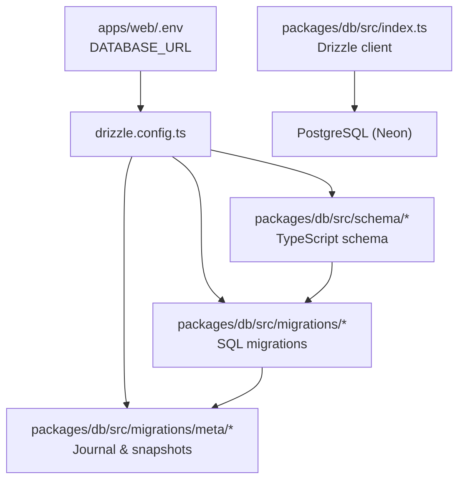
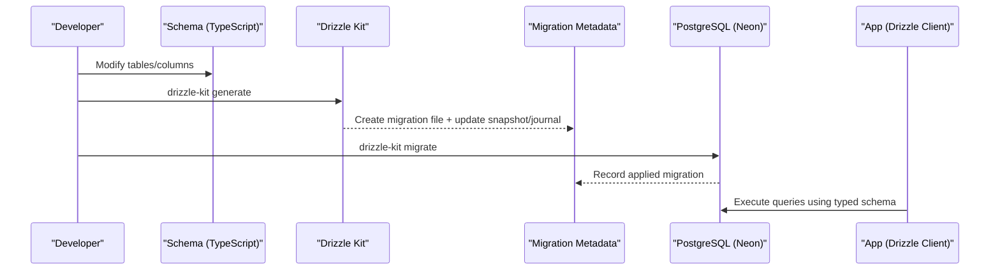
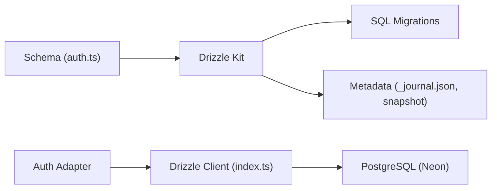
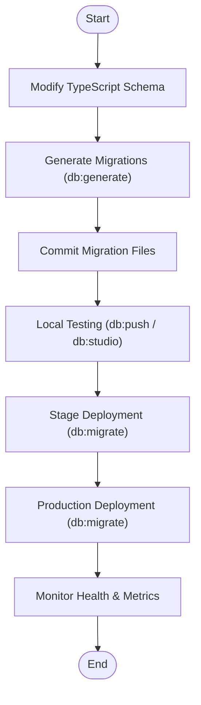

# Database Migrations

<cite>
**Referenced Files in This Document**
- [drizzle.config.ts](file://packages/db/drizzle.config.ts)
- [package.json](file://packages/db/package.json)
- [index.ts](file://packages/db/src/index.ts)
- [auth.ts](file://packages/db/src/schema/auth.ts)
- [0000_breezy_la_nuit.sql](file://packages/db/src/migrations/0000_breezy_la_nuit.sql)
- [_journal.json](file://packages/db/src/migrations/meta/_journal.json)
- [0000_snapshot.json](file://packages/db/src/migrations/meta/0000_snapshot.json)
- [README.md](file://README.md)
- [package.json](file://package.json)
</cite>

## Table of Contents

1. Introduction
2. Project Structure
3. Core Components
4. Architecture Overview
5. Detailed Component Analysis
6. Dependency Analysis
7. Performance Considerations
8. Troubleshooting Guide
9. Conclusion
10. Appendices

## Introduction

This document explains the database versioning and migration system used in the project. It covers the Drizzle-based workflow, how migrations are generated and applied, the structure of migration files and metadata, and strategies for controlling schema evolution from development to production. It also includes guidance on creating new migrations, rolling back changes, testing approaches, disaster recovery, and best practices for safe schema changes that preserve data integrity.

## Project Structure

The database layer is encapsulated in a dedicated package with clear separation between schema definitions, migrations, and configuration:

- Schema definitions live under packages/db/src/schema and define tables, relations, and indexes using Drizzle ORM.
- Generated SQL migrations are stored under packages/db/src/migrations.
- Migration metadata (journal and snapshots) is stored under packages/db/src/migrations/meta.
- Drizzle configuration points to the PostgreSQL dialect, schema location, and output directory for migrations.
- The application initializes a Drizzle client connected to Neon PostgreSQL via environment variables.

**Diagram sources**

- [drizzle.config.ts:1-15](file://packages/db/drizzle.config.ts#L1-L15)
- [index.ts:1-12](file://packages/db/src/index.ts#L1-L12)

**Section sources**

- [drizzle.config.ts:1-15](file://packages/db/drizzle.config.ts#L1-L15)
- [index.ts:1-12](file://packages/db/src/index.ts#L1-L12)
- [README.md:27-44](file://README.md#L27-L44)

## Core Components

- Drizzle configuration: Defines dialect, credentials source, schema path, and migration output directory.
- Schema module: Exports table definitions and relations used by Drizzle to generate migrations and type-safe queries.
- Migration files: Versioned SQL statements created by Drizzle Kit based on schema changes.
- Migration metadata: Journal tracks applied migrations; snapshots capture the schema state at each migration.
- Package scripts: Provide commands to push schema locally, generate migrations, run migrations, and open the studio.

Key responsibilities:

- Schema as source of truth for tables, columns, constraints, and relations.
- Drizzle Kit generates deterministic SQL migrations from schema diffs.
- Migration journal ensures idempotent application and rollback tracking.
- Environment-driven connection to PostgreSQL via Neon serverless driver.

**Section sources**

- [drizzle.config.ts:1-15](file://packages/db/drizzle.config.ts#L1-L15)
- [auth.ts:1-101](file://packages/db/src/schema/auth.ts#L1-L101)
- [package.json:12-17](file://packages/db/package.json#L12-L17)
- [_journal.json:1-14](file://packages/db/src/migrations/meta/_journal.json#L1-L14)
- [0000_snapshot.json:1-381](file://packages/db/src/migrations/meta/0000_snapshot.json#L1-L381)

## Architecture Overview

The migration architecture centers around Drizzle Kit and Drizzle ORM:

- Developers modify TypeScript schema definitions.
- Drizzle Kit compares current schema against the last snapshot and generates incremental SQL migrations.
- Migrations are committed to version control and applied to target databases using Drizzle Kit migrate.
- The application uses a Drizzle client configured with the same schema to execute type-safe queries.

**Diagram sources**

- [drizzle.config.ts:1-15](file://packages/db/drizzle.config.ts#L1-L15)
- [package.json:12-17](file://packages/db/package.json#L12-L17)
- [_journal.json:1-14](file://packages/db/src/migrations/meta/_journal.json#L1-L14)
- [0000_snapshot.json:1-381](file://packages/db/src/migrations/meta/0000_snapshot.json#L1-L381)
- [index.ts:1-12](file://packages/db/src/index.ts#L1-L12)

## Detailed Component Analysis

### Drizzle Configuration

- Dialect: PostgreSQL.
- Credentials: URL sourced from environment variable loaded via dotenv.
- Schema path: Points to the TypeScript schema directory.
- Output path: Migrations are written into the migrations folder.

Operational notes:

- Ensure DATABASE_URL is set before running any Drizzle commands.
- The configuration centralizes where migrations are generated and which schema is used for diffing.

**Section sources**

- [drizzle.config.ts:1-15](file://packages/db/drizzle.config.ts#L1-L15)

### Schema Definitions

- Tables: user, session, account, verification.
- Columns include timestamps, identifiers, and optional fields.
- Constraints: primary keys, unique constraints, foreign keys with cascade deletes.
- Indexes: btree indexes on frequently queried columns (e.g., user_id, identifier).
- Relations: one-to-many relationships defined for type-safe querying.

Impact on migrations:

- Any change to these definitions will be reflected in generated SQL migrations.
- Adding or removing indexes, changing column types, or altering constraints requires a new migration.

**Section sources**

- [auth.ts:1-101](file://packages/db/src/schema/auth.ts#L1-L101)

### Migration Files and Metadata

- Migration file: A single SQL file per versioned change, containing CREATE TABLE, ALTER TABLE, and index statements.
- Journal: Tracks applied migrations with indices, timestamps, tags, and breakpoint flags.
- Snapshot: Captures the full schema state after applying a migration, including tables, columns, constraints, and indexes.

Lifecycle:

- Generation: Drizzle Kit creates a new SQL file and updates the snapshot when schema changes.
- Application: Drizzle Kit applies pending migrations in order and records them in the journal.
- Rollback: Reverting involves reversing the SQL operations and updating metadata accordingly.

**Section sources**

- [0000_breezy_la_nuit.sql:1-56](file://packages/db/src/migrations/0000_breezy_la_nuit.sql#L1-L56)
- [_journal.json:1-14](file://packages/db/src/migrations/meta/_journal.json#L1-L14)
- [0000_snapshot.json:1-381](file://packages/db/src/migrations/meta/0000_snapshot.json#L1-L381)

### Drizzle Client Initialization

- Creates a Neon HTTP client using DATABASE_URL.
- Initializes Drizzle with the exported schema for type safety.
- Provides a reusable db instance for queries across the application.

Best practices:

- Keep DATABASE_URL secure and environment-specific.
- Use the shared db instance to ensure consistent schema usage across services.

**Section sources**

- [index.ts:1-12](file://packages/db/src/index.ts#L1-L12)

### Package Scripts and Commands

Available scripts:

- db:push: Push schema changes directly to the database (development convenience).
- db:generate: Generate migration files from schema changes.
- db:migrate: Apply pending migrations to the database.
- db:studio: Open Drizzle Studio UI for browsing and editing data.

Root-level orchestration:

- The root package.json provides workspace commands that delegate to the db package via Turborepo.

Usage flow:

- Development: Use db:push to quickly sync local schema.
- Version control: Use db:generate to create migrations, commit them, then apply with db:migrate in CI/CD or staging/prod.

**Section sources**

- [package.json:12-17](file://packages/db/package.json#L12-L17)
- [package.json:34-37](file://package.json#L34-L37)
- [README.md:96-105](file://README.md#L96-L105)

## Dependency Analysis

- Drizzle ORM depends on the Neon serverless driver for PostgreSQL connectivity.
- Drizzle Kit reads the schema and writes migrations and metadata.
- The application’s auth integration uses the Drizzle adapter to persist sessions and accounts via the same schema.

**Diagram sources**

- [auth.ts:1-101](file://packages/db/src/schema/auth.ts#L1-L101)
- [index.ts:1-12](file://packages/db/src/index.ts#L1-L12)
- [_journal.json:1-14](file://packages/db/src/migrations/meta/_journal.json#L1-L14)
- [0000_snapshot.json:1-381](file://packages/db/src/migrations/meta/0000_snapshot.json#L1-L381)

**Section sources**

- [package.json:18-29](file://packages/db/package.json#L18-L29)
- [index.ts:1-12](file://packages/db/src/index.ts#L1-L12)

## Performance Considerations

- Indexes: Existing btree indexes on user_id and identifier improve query performance for lookups and joins.
- Large schema changes: When altering large tables or adding indexes, consider non-blocking operations in production environments to minimize downtime.
- Connection pooling: Ensure Neon connection settings are tuned for expected load.
- Migration batching: Group related schema changes into a single migration to reduce round-trips and simplify rollbacks.

[No sources needed since this section provides general guidance]

## Troubleshooting Guide

Common issues and resolutions:

- Missing DATABASE_URL: Ensure apps/web/.env contains a valid PostgreSQL connection string before running Drizzle commands.
- Migration conflicts: If multiple developers generate migrations concurrently, resolve conflicts by rebasing schema changes and regenerating migrations.
- Stale snapshots: After resolving conflicts, regenerate migrations to align snapshots and journal entries.
- Failed migrations: Review error logs, revert problematic changes, and re-run migrations after fixing schema definitions.

Rollback procedures:

- Reverse SQL operations in a new migration file to undo changes.
- Update metadata if necessary to reflect the reverted state.
- Test rollback in a staging environment before applying to production.

Disaster recovery:

- Maintain regular backups of the database prior to major schema changes.
- Validate restore procedures periodically.
- In case of corruption, restore from backup and replay only the necessary migrations to reach the desired state.

Testing approaches:

- Use db:studio to inspect data and schema during development.
- Run migrations against isolated test databases to validate behavior.
- Integrate migration checks into CI to prevent drift between schema and migrations.

**Section sources**

- [drizzle.config.ts:1-15](file://packages/db/drizzle.config.ts#L1-L15)
- [README.md:27-44](file://README.md#L27-L44)
- [package.json:12-17](file://packages/db/package.json#L12-L17)

## Conclusion

The project uses a robust, Drizzle-based migration system that treats the TypeScript schema as the source of truth and generates deterministic SQL migrations. With clear separation of concerns, metadata tracking, and standardized scripts, teams can evolve the schema safely across environments. Following the outlined workflows and best practices helps maintain data integrity, streamline collaboration, and reduce risk during deployments.

[No sources needed since this section summarizes without analyzing specific files]

## Appendices

### Migration Lifecycle: Development to Production

[No sources needed since this diagram shows conceptual workflow, not actual code structure]

### Best Practices for Safe Migrations

- Prefer additive changes first (add columns, add indexes) before removing or altering existing structures.
- Use transactions where supported to ensure atomicity of multi-statement migrations.
- Back up data before destructive changes.
- Test migrations against realistic datasets in staging.
- Avoid long-running locks on large tables during peak hours.
- Document intent and rationale in migration comments or PR descriptions.

[No sources needed since this section provides general guidance]
