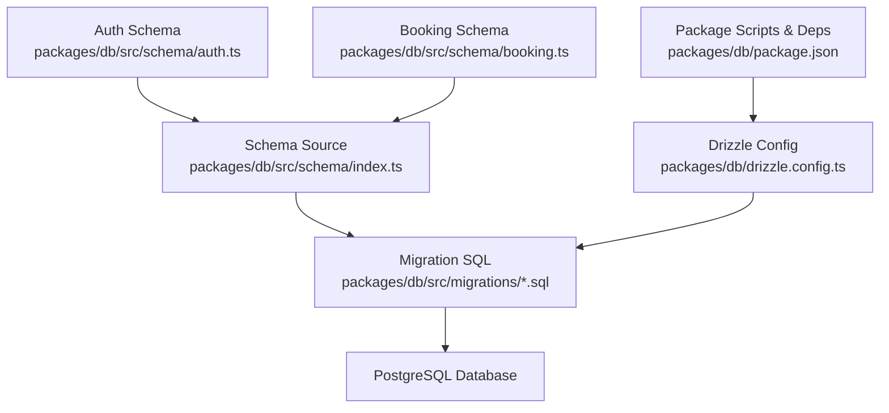
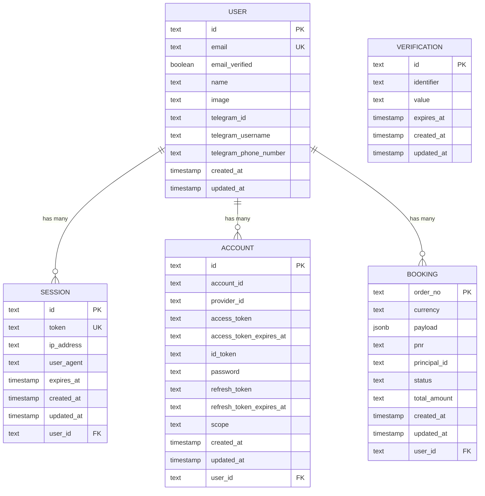
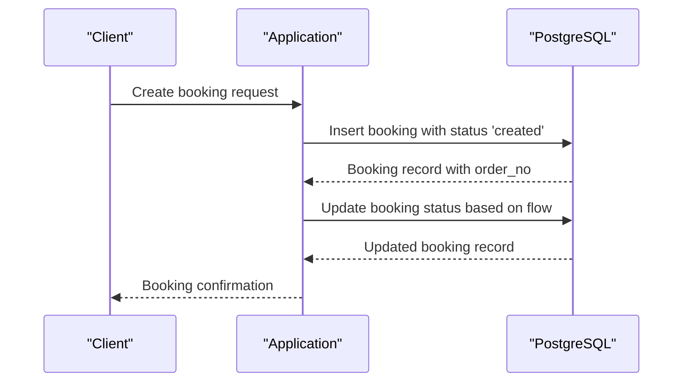
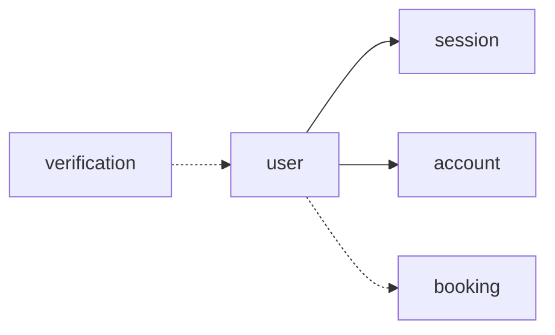

# Database Schema Design

<cite>
**Referenced Files in This Document**
- [index.ts](file://packages/db/src/schema/index.ts)
- [auth.ts](file://packages/db/src/schema/auth.ts)
- [booking.ts](file://packages/db/src/schema/booking.ts)
- [0000_breezy_la_nuit.sql](file://packages/db/src/migrations/0000_breezy_la_nuit.sql)
- [0001_lumpy_chronomancer.sql](file://packages/db/src/migrations/0001_lumpy_chronomancer.sql)
- [drizzle.config.ts](file://packages/db/drizzle.config.ts)
- [package.json](file://packages/db/package.json)
</cite>

## Update Summary

**Changes Made**

- Updated schema overview to include the new booking entity for flight bookings
- Enhanced relationship diagrams to show booking-to-user associations
- Added comprehensive documentation for the booking table structure and constraints
- Updated migration references to include both initial and booking migrations
- Improved code quality notes reflecting ESLint cleanup improvements in schema module

## Table of Contents

1. Introduction
2. Project Structure
3. Core Components
4. Architecture Overview
5. Detailed Component Analysis
6. Dependency Analysis
7. Performance Considerations
8. Troubleshooting Guide
9. Conclusion

## Introduction

This document describes the PostgreSQL database schema implemented for the application's data layer using Drizzle ORM. The schema provides robust authentication and session management through user accounts, sessions, and verification tokens, along with comprehensive flight booking persistence capabilities. The current schema includes five core tables: user, session, account, verification, and booking entities that support the complete flight booking workflow from creation to completion.

## Project Structure

The database schema is defined using Drizzle ORM with a PostgreSQL dialect. The schema source files define tables, relations, and indexes, while migrations generate the actual SQL to create and evolve the database structure. Configuration points to the PostgreSQL connection and migration output directory.

**Diagram sources**

- [index.ts:1-4](file://packages/db/src/schema/index.ts#L1-L4)
- [auth.ts:1-101](file://packages/db/src/schema/auth.ts#L1-L101)
- [booking.ts:1-44](file://packages/db/src/schema/booking.ts#L1-L44)
- [drizzle.config.ts:1-16](file://packages/db/drizzle.config.ts#L1-L16)
- [package.json:1-31](file://packages/db/package.json#L1-L31)

**Section sources**

- [drizzle.config.ts:1-16](file://packages/db/drizzle.config.ts#L1-L16)
- [package.json:1-31](file://packages/db/package.json#L1-L31)

## Core Components

The database contains five core tables:

- **user**: Represents authenticated users with identity and profile fields.
- **session**: Tracks active user sessions with token-based identification and expiration.
- **account**: Stores provider-specific credentials and tokens linked to a user.
- **verification**: Holds one-time verification tokens with identifiers and expiry.
- **booking**: Manages flight booking lifecycle with order tracking and status management.

Key design highlights:

- Primary keys use text identifiers for each table, with booking using natural key (order_no).
- Foreign keys from session, account, and booking reference user with appropriate cascade behaviors.
- Unique constraints ensure uniqueness of email and session token.
- Indexes optimize lookups by user_id, identifier, and booking status.
- JSONB payload field supports flexible booking data storage.

**Section sources**

- [auth.ts:4-81](file://packages/db/src/schema/auth.ts#L4-L81)
- [booking.ts:11-36](file://packages/db/src/schema/booking.ts#L11-L36)
- [0000_breezy_la_nuit.sql:1-56](file://packages/db/src/migrations/0000_breezy_la_nuit.sql#L1-L56)
- [0001_lumpy_chronomancer.sql:1-15](file://packages/db/src/migrations/0001_lumpy_chronomancer.sql#L1-L15)

## Architecture Overview

The schema follows a normalized approach centered around the user entity. Sessions, accounts, and bookings are child entities referencing the user, ensuring clean separation of concerns and minimizing redundancy. Verification tokens are independent and indexed for fast lookup during validation flows. The booking entity extends the authentication foundation to support the complete flight booking workflow.

**Diagram sources**

- [auth.ts:4-81](file://packages/db/src/schema/auth.ts#L4-L81)
- [booking.ts:11-36](file://packages/db/src/schema/booking.ts#L11-L36)
- [0000_breezy_la_nuit.sql:1-56](file://packages/db/src/migrations/0000_breezy_la_nuit.sql#L1-L56)
- [0001_lumpy_chronomancer.sql:1-15](file://packages/db/src/migrations/0001_lumpy_chronomancer.sql#L1-L15)

## Detailed Component Analysis

### User Entity

- **Purpose**: Central identity record for all users.
- **Primary key**: id (text).
- **Notable fields**:
  - email (text, unique): Ensures a single account per email.
  - email_verified (boolean, default false): Indicates verification status.
  - name (text, not null): Display name.
  - image (text, nullable): Optional avatar URL or path.
  - telegram_* fields (text, nullable): Optional integrations with Telegram identity.
  - timestamps: created_at and updated_at with defaults and update hooks.
- **Constraints**:
  - Unique constraint on email prevents duplicate accounts.
- **Indexes**: None explicitly defined at the table level.

**Rationale**:

- Using text for identifiers allows compatibility with external auth providers and flexible ID strategies.
- Email uniqueness enforces a canonical login handle.
- Nullable Telegram fields support optional integrations without forcing data.

**Section sources**

- [auth.ts:4-19](file://packages/db/src/schema/auth.ts#L4-L19)
- [0000_breezy_la_nuit.sql:29-41](file://packages/db/src/migrations/0000_breezy_la_nuit.sql#L29-L41)

### Session Entity

- **Purpose**: Tracks active user sessions with token-based identification and lifecycle management.
- **Primary key**: id (text).
- **Notable fields**:
  - token (text, unique): Unique session token used for authentication.
  - user_id (text, not null): Foreign key to user.id with cascade delete.
  - expires_at (timestamp, not null): Enforces session lifetime.
  - ip_address, user_agent (text, nullable): Contextual metadata for security and analytics.
  - timestamps: created_at and updated_at with defaults and update hooks.
- **Constraints**:
  - Unique constraint on token ensures no two sessions share the same token.
  - Foreign key to user with cascade delete maintains referential integrity.
- **Indexes**:
  - session_userId_idx on user_id improves queries filtering sessions by user.

**Rationale**:

- Token uniqueness prevents collisions and simplifies session lookup.
- Cascade delete ensures orphaned sessions are removed when a user is deleted.
- Index on user_id optimizes common queries like "list all sessions for a user."

**Section sources**

- [auth.ts:21-39](file://packages/db/src/schema/auth.ts#L21-L39)
- [0000_breezy_la_nuit.sql:17-27](file://packages/db/src/migrations/0000_breezy_la_nuit.sql#L17-L27)
- [0000_breezy_la_nuit.sql:52-55](file://packages/db/src/migrations/0000_breezy_la_nuit.sql#L52-L55)

### Account Entity

- **Purpose**: Stores provider-specific credentials and tokens associated with a user.
- **Primary key**: id (text).
- **Notable fields**:
  - account_id (text, not null): Provider-assigned identifier.
  - provider_id (text, not null): Identifies the OAuth/social provider.
  - access_token, refresh_token, id_token (text, nullable): Tokens for API access.
  - access_token_expires_at, refresh_token_expires_at (timestamp, nullable): Token lifetimes.
  - password (text, nullable): For local password-based accounts.
  - scope (text, nullable): Permissions granted by the provider.
  - user_id (text, not null): Foreign key to user.id with cascade delete.
  - timestamps: created_at and updated_at with defaults and update hooks.
- **Indexes**:
  - account_userId_idx on user_id improves queries filtering accounts by user.

**Rationale**:

- Separating provider credentials into a dedicated table supports multiple logins per user.
- Nullable tokens accommodate providers that do not issue certain tokens.
- Index on user_id enables efficient retrieval of all accounts for a user.

**Section sources**

- [auth.ts:41-64](file://packages/db/src/schema/auth.ts#L41-L64)
- [0000_breezy_la_nuit.sql:1-15](file://packages/db/src/migrations/0000_breezy_la_nuit.sql#L1-L15)
- [0000_breezy_la_nuit.sql:52-55](file://packages/db/src/migrations/0000_breezy_la_nuit.sql#L52-L55)

### Verification Entity

- **Purpose**: Holds one-time verification tokens used in email or other verification flows.
- **Primary key**: id (text).
- **Notable fields**:
  - identifier (text, not null): Logical identifier for the verification target (e.g., email).
  - value (text, not null): The secret token value.
  - expires_at (timestamp, not null): Enforces short-lived validity.
  - timestamps: created_at and updated_at with defaults and update hooks.
- **Indexes**:
  - verification_identifier_idx on identifier speeds up lookups by verification target.

**Rationale**:

- Storing verification tokens separately isolates transient data from persistent identities.
- Expiry enforcement reduces risk of long-lived secrets.
- Index on identifier optimizes frequent checks during verification workflows.

**Section sources**

- [auth.ts:66-81](file://packages/db/src/schema/auth.ts#L66-L81)
- [0000_breezy_la_nuit.sql:43-50](file://packages/db/src/migrations/0000_breezy_la_nuit.sql#L43-L50)
- [0000_breezy_la_nuit.sql:55-56](file://packages/db/src/migrations/0000_breezy_la_nuit.sql#L55-L56)

### Booking Entity

- **Purpose**: Manages flight booking lifecycle with order tracking, status management, and payload storage.
- **Primary key**: order_no (text, natural key representing Atlas order number).
- **Notable fields**:
  - order_no (text, primary key): Natural key identifying the Atlas order.
  - status (text, not null): Current booking status (created, confirmed, issued, refunded, voided).
  - payload (jsonb): Best-effort snapshot of raw API response at latest lifecycle event.
  - pnr (text, nullable): Passenger Name Record for ticketed bookings.
  - principal_id (text, nullable): Identity of channel principal driving the latest event.
  - user_id (text, nullable): Foreign key to user.id with set null behavior.
  - currency, total_amount (text, nullable): Financial details of the booking.
  - timestamps: created_at and updated_at with defaults and update hooks.
- **Constraints**:
  - Foreign key to user with set null behavior preserves booking history even if user is deleted.
- **Indexes**:
  - booking_userId_idx on user_id improves queries filtering bookings by user.

**Rationale**:

- Natural key (order_no) aligns with external Atlas system identifiers.
- JSONB payload provides flexibility for varying API responses across booking lifecycle events.
- Set null foreign key behavior ensures booking history preservation for audit purposes.
- Status field tracks complete booking lifecycle from creation to completion/refund.

**Section sources**

- [booking.ts:11-36](file://packages/db/src/schema/booking.ts#L11-L36)
- [0001_lumpy_chronomancer.sql:1-15](file://packages/db/src/migrations/0001_lumpy_chronomancer.sql#L1-L15)

### Relationships and Data Flow

- **One-to-many relationships**:
  - user -> sessions: Each user can have multiple sessions.
  - user -> accounts: Each user can link multiple provider accounts.
  - user -> bookings: Each user can have multiple bookings.
- **Referential integrity**:
  - Deleting a user cascades to related sessions and accounts, but sets booking user_id to null to preserve history.
- **Query optimization**:
  - Indexes on user_id and identifier improve performance for common operations such as listing sessions, accounts, or bookings.

**Diagram sources**

- [booking.ts:11-36](file://packages/db/src/schema/booking.ts#L11-L36)
- [0001_lumpy_chronomancer.sql:1-15](file://packages/db/src/migrations/0001_lumpy_chronomancer.sql#L1-L15)

## Dependency Analysis

The schema defines clear dependencies:

- session depends on user via foreign key with cascade delete.
- account depends on user via foreign key with cascade delete.
- booking depends on user via foreign key with set null behavior.
- verification is independent but commonly queried alongside user flows.

**Diagram sources**

- [auth.ts:83-100](file://packages/db/src/schema/auth.ts#L83-L100)
- [booking.ts:38-43](file://packages/db/src/schema/booking.ts#L38-L43)
- [0000_breezy_la_nuit.sql:52-56](file://packages/db/src/migrations/0000_breezy_la_nuit.sql#L52-L56)
- [0001_lumpy_chronomancer.sql:14-15](file://packages/db/src/migrations/0001_lumpy_chronomancer.sql#L14-L15)

**Section sources**

- [auth.ts:83-100](file://packages/db/src/schema/auth.ts#L83-L100)
- [booking.ts:38-43](file://packages/db/src/schema/booking.ts#L38-L43)
- [0000_breezy_la_nuit.sql:52-56](file://packages/db/src/migrations/0000_breezy_la_nuit.sql#L52-L56)
- [0001_lumpy_chronomancer.sql:14-15](file://packages/db/src/migrations/0001_lumpy_chronomancer.sql#L14-L15)

## Performance Considerations

- **Use existing indexes**:
  - session_userId_idx for queries filtering sessions by user.
  - account_userId_idx for queries filtering accounts by user.
  - booking_userId_idx for queries filtering bookings by user.
  - verification_identifier_idx for rapid verification lookups.
- **Avoid unnecessary joins**:
  - Fetch only required columns and leverage indexes to minimize full table scans.
- **Monitor data growth**:
  - Implement periodic cleanup of expired sessions and verification tokens.
  - Archive old booking records to maintain query performance.
- **JSONB optimization**:
  - Use appropriate JSONB operators and indexing strategies for payload queries.

## Code Quality Improvements

The schema module has undergone ESLint cleanup improvements that enhance code readability and maintainability:

- **Removed redundant directives**: Eliminated unnecessary eslint-disable-next-line directives in the schema index file.
- **Improved structure**: Cleaner barrel file exports with minimal linting overhead.
- **Enhanced maintainability**: Reduced noise in schema definitions makes code easier to review and modify.

**Section sources**

- [index.ts:1-4](file://packages/db/src/schema/index.ts#L1-L4)

## Troubleshooting Guide

Common issues and resolutions:

- **Duplicate email errors**:
  - Caused by violating the unique constraint on user.email. Ensure email normalization and pre-insert checks.
- **Session token conflicts**:
  - Violation of unique constraint on session.token. Generate cryptographically secure tokens and handle collisions.
- **Orphaned records after user deletion**:
  - Foreign keys with cascade delete should remove related sessions and accounts automatically. Bookings preserve history with set null behavior.
- **Slow verification lookups**:
  - Ensure verification_identifier_idx exists and is used by queries. Check query plans for index usage.
- **Booking data inconsistencies**:
  - Verify status transitions follow expected workflow patterns. Check payload structure for required fields.

**Section sources**

- [0000_breezy_la_nuit.sql:29-41](file://packages/db/src/migrations/0000_breezy_la_nuit.sql#L29-L41)
- [0000_breezy_la_nuit.sql:17-27](file://packages/db/src/migrations/0000_breezy_la_nuit.sql#L17-L27)
- [0000_breezy_la_nuit.sql:52-56](file://packages/db/src/migrations/0000_breezy_la_nuit.sql#L52-L56)
- [0001_lumpy_chronomancer.sql:14-15](file://packages/db/src/migrations/0001_lumpy_chronomancer.sql#L14-L15)

## Conclusion

The current PostgreSQL schema provides a solid foundation for authentication, session management, and comprehensive flight booking operations with well-defined relationships, constraints, and indexes. It adheres to normalization principles and uses appropriate data types to balance flexibility and integrity. The addition of the booking entity extends the schema to support the complete flight booking workflow, while maintaining data integrity through careful foreign key design and indexing strategies. Future enhancements may include additional business entities if persistence requirements emerge; however, the current schema provides comprehensive coverage of core application functionality.
