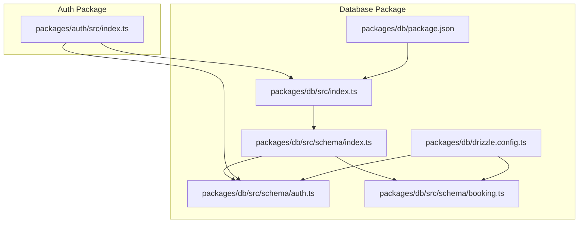
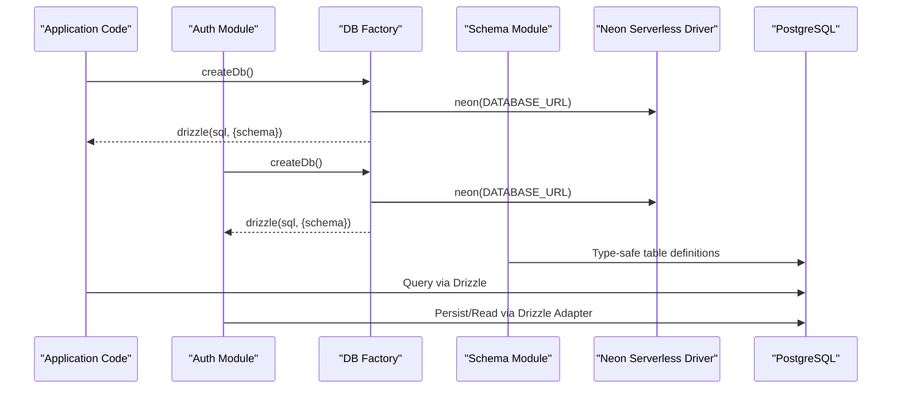
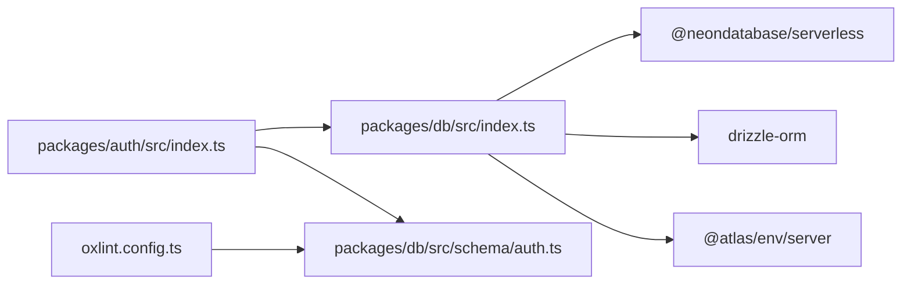

# Drizzle ORM Implementation

<cite>
**Referenced Files in This Document**
- [packages/db/src/index.ts](file://packages/db/src/index.ts)
- [packages/db/drizzle.config.ts](file://packages/db/drizzle.config.ts)
- [packages/db/package.json](file://packages/db/package.json)
- [packages/db/src/schema/auth.ts](file://packages/db/src/schema/auth.ts)
- [packages/db/src/schema/booking.ts](file://packages/db/src/schema/booking.ts)
- [packages/db/src/schema/index.ts](file://packages/db/src/schema/index.ts)
- [packages/auth/src/index.ts](file://packages/auth/src/index.ts)
- [.agents/skills/neon-postgres/SKILL.md](file://.agents/skills/neon-postgres/SKILL.md)
- [oxlint.config.ts](file://oxlint.config.ts)
</cite>

## Update Summary

**Changes Made**

- Updated Code Quality section to reflect ESLint cleanup improvements in database schema module
- Enhanced documentation of barrel file organization and export patterns
- Added information about modern linting tools (oxlint) replacing traditional ESLint
- Updated best practices for maintaining clean, maintainable database schemas

## Table of Contents

1. [Introduction](#introduction)
2. [Project Structure](#project-structure)
3. [Core Components](#core-components)
4. [Architecture Overview](#architecture-overview)
5. [Detailed Component Analysis](#detailed-component-analysis)
6. [Dependency Analysis](#dependency-analysis)
7. [Performance Considerations](#performance-considerations)
8. [Code Quality and Maintainability](#code-quality-and-maintainability)
9. [Troubleshooting Guide](#troubleshooting-guide)
10. [Conclusion](#conclusion)
11. [Appendices](#appendices)

## Introduction

This document explains the Drizzle ORM implementation used in the project, focusing on configuration, connection management, and query patterns. It covers client initialization using Neon's serverless driver, environment-specific setup, schema definitions, and how the database client is integrated with authentication. The implementation emphasizes type-safe queries, efficient connection management, and maintainable code structure through modern linting practices.

## Project Structure

The database layer is encapsulated in a dedicated package that exports a typed Drizzle client and schema definitions. The authentication package integrates Drizzle via Better Auth's Drizzle adapter to persist auth entities. The schema module follows a modular approach with barrel files for clean exports.

**Diagram sources**

- [packages/db/src/index.ts:1-13](file://packages/db/src/index.ts#L1-L13)
- [packages/db/src/schema/index.ts:1-4](file://packages/db/src/schema/index.ts#L1-L4)
- [packages/db/src/schema/auth.ts:1-101](file://packages/db/src/schema/auth.ts#L1-L101)
- [packages/db/src/schema/booking.ts:1-44](file://packages/db/src/schema/booking.ts#L1-L44)
- [packages/db/drizzle.config.ts:1-15](file://packages/db/drizzle.config.ts#L1-L15)
- [packages/db/package.json:1-31](file://packages/db/package.json#L1-L31)
- [packages/auth/src/index.ts:1-43](file://packages/auth/src/index.ts#L1-L43)

**Section sources**

- [packages/db/src/index.ts:1-13](file://packages/db/src/index.ts#L1-L13)
- [packages/db/src/schema/index.ts:1-4](file://packages/db/src/schema/index.ts#L1-L4)
- [packages/db/src/schema/auth.ts:1-101](file://packages/db/src/schema/auth.ts#L1-L101)
- [packages/db/src/schema/booking.ts:1-44](file://packages/db/src/schema/booking.ts#L1-L44)
- [packages/db/drizzle.config.ts:1-15](file://packages/db/drizzle.config.ts#L1-L15)
- [packages/db/package.json:1-31](file://packages/db/package.json#L1-L31)
- [packages/auth/src/index.ts:1-43](file://packages/auth/src/index.ts#L1-L43)

## Core Components

- Database client factory: Creates a Neon HTTP client and wraps it with Drizzle, exposing a typed db instance and a reusable factory function.
- Schema definitions: Declares tables and relations for authentication-related entities (user, session, account, verification) and booking entities.
- Drizzle Kit configuration: Defines dialect, schema location, migration output directory, and credentials source.
- Authentication integration: Uses Better Auth with Drizzle adapter to persist auth data using the shared db client and schema.
- Modern linting: Utilizes oxlint for fast, reliable code quality checks with specific rules for barrel files and code organization.

Key responsibilities:

- Centralize DB client creation to ensure consistent configuration across the app.
- Provide strongly-typed access to tables and relations for safe queries.
- Configure migrations and development tooling via Drizzle Kit.
- Integrate auth persistence through a standardized adapter.
- Maintain clean, maintainable code structure through modern linting practices.

**Section sources**

- [packages/db/src/index.ts:1-13](file://packages/db/src/index.ts#L1-L13)
- [packages/db/src/schema/auth.ts:1-101](file://packages/db/src/schema/auth.ts#L1-L101)
- [packages/db/src/schema/booking.ts:1-44](file://packages/db/src/schema/booking.ts#L1-L44)
- [packages/db/drizzle.config.ts:1-15](file://packages/db/drizzle.config.ts#L1-L15)
- [packages/auth/src/index.ts:1-43](file://packages/auth/src/index.ts#L1-L43)
- [oxlint.config.ts:1-10](file://oxlint.config.ts#L1-L10)

## Architecture Overview

The runtime uses Neon's serverless driver over HTTP to connect to Postgres. Drizzle wraps this driver to provide a type-safe query API. The same db client is consumed by both application code and the authentication module. The schema module follows a modular architecture with barrel files for clean exports.

**Diagram sources**

- [packages/db/src/index.ts:1-13](file://packages/db/src/index.ts#L1-L13)
- [packages/auth/src/index.ts:1-43](file://packages/auth/src/index.ts#L1-L43)
- [packages/db/src/schema/index.ts:1-4](file://packages/db/src/schema/index.ts#L1-L4)

## Detailed Component Analysis

### Client Initialization and Connection Management

- The database client is created by calling a factory that instantiates a Neon HTTP client from an environment variable and passes it to Drizzle along with the schema.
- A singleton instance is exported for convenience, while the factory supports per-request or scoped instances if needed.
- Environment variables are sourced from a shared environment module; ensure DATABASE_URL is set appropriately for each environment.

Best practices:

- Use the factory when you need isolated connections (e.g., tests or background jobs).
- Keep the singleton for typical request-scoped usage in serverless functions where modules are reused.

**Section sources**

- [packages/db/src/index.ts:1-13](file://packages/db/src/index.ts#L1-L13)
- [packages/db/package.json:18-23](file://packages/db/package.json#L18-L23)

### Schema and Relations

- Tables defined include user, session, account, verification, and booking entities with timestamps, constraints, and indexes.
- Relations are declared to enable type-safe joins and nested reads/writes through Drizzle's relation API.
- Indexes are added on frequently queried columns to improve lookup performance.
- The schema module uses barrel files for clean exports while maintaining proper linting standards.

Typical patterns:

- Use relations to fetch related records without manual joins.
- Leverage indexes on foreign keys and high-cardinality filters.
- Organize schema files by domain (auth, booking) for better maintainability.

**Section sources**

- [packages/db/src/schema/auth.ts:1-101](file://packages/db/src/schema/auth.ts#L1-L101)
- [packages/db/src/schema/booking.ts:1-44](file://packages/db/src/schema/booking.ts#L1-L44)
- [packages/db/src/schema/index.ts:1-4](file://packages/db/src/schema/index.ts#L1-L4)

### Drizzle Kit Configuration and Migrations

- Drizzle Kit is configured to use PostgreSQL dialect, read schema from the schema directory, and write migrations to a dedicated folder.
- Credentials are loaded from environment variables at runtime for CLI commands.

Operational notes:

- Use db:migrate to apply migrations in CI/CD or deployment pipelines.
- Use db:generate to generate SQL diffs from schema changes.
- Use db:push for local development to sync schema quickly.
- Use db:studio to inspect and edit data during development.

**Section sources**

- [packages/db/drizzle.config.ts:1-15](file://packages/db/drizzle.config.ts#L1-L15)
- [packages/db/package.json:12-17](file://packages/db/package.json#L12-L17)

### Authentication Integration

- The auth module creates a Drizzle client and configures Better Auth with the Drizzle adapter, pointing to the Postgres provider and the shared schema.
- This ensures auth entities are persisted consistently with the rest of the application's data model.

**Section sources**

- [packages/auth/src/index.ts:1-43](file://packages/auth/src/index.ts#L1-L43)

### Type-Safe Query Patterns

- Because the db client is initialized with the schema, all table references and column types are inferred, enabling compile-time checks for queries.
- Use relations to express joins declaratively and benefit from full type safety.

Guidelines:

- Prefer selecting only required fields to reduce payload size.
- Use relations to avoid manual join logic and reduce errors.
- Leverage TypeScript's type inference for safer database operations.

### CRUD Operations Examples

- Create: Insert into user/session/account/verification/booking using Drizzle's insert API with typed inputs derived from schema.
- Read: Select rows with optional filters; use relations to include related data.
- Update: Modify records with partial updates; leverage $onUpdate hooks for timestamps.
- Delete: Remove records with conditions; cascade behavior is enforced by foreign key constraints.

### Complex Queries with Joins

- Use relations to fetch nested structures (e.g., user with sessions, accounts, and bookings).
- Combine filters and ordering to build efficient queries.
- Ensure appropriate indexes exist for filtered columns.

### Transactions

- Wrap multiple writes in a transaction to maintain consistency.
- In Neon serverless, prefer pooled connections for transactions when supported by your runtime; otherwise, use direct connections for operations requiring session state.

### Batch Operations

- Use batch inserts/updates to minimize round trips when processing large datasets.
- Consider chunking very large batches to avoid timeouts or memory pressure.

### Result Mapping and Error Handling

- Map results to domain models as needed; Drizzle returns plain objects that can be transformed safely.
- Handle errors by catching exceptions around DB calls and returning appropriate responses.
- Validate inputs before issuing queries to prevent invalid states.

### Performance Optimization Techniques

- Add indexes on frequently filtered or joined columns (already present on userId, identifier, and orderNo).
- Limit selected columns and avoid N+1 queries by using relations and eager loading.
- Parallelize independent queries using concurrency primitives where applicable.
- Choose between pooled and direct connections based on workload characteristics.

### Query Planning and Debugging

- Inspect generated SQL via Drizzle logs to understand query plans.
- Use EXPLAIN ANALYZE on complex queries to identify bottlenecks.
- Monitor slow queries and adjust indexes or query structure accordingly.

### Best Practices for Production

- Use environment variables for all secrets and connection strings.
- Pin dependency versions and run migrations in CI/CD.
- Monitor connection metrics and tune pool sizes if necessary.
- Follow Neon recommendations for connection pooling vs direct connections depending on workload.

## Dependency Analysis

The database package depends on Neon's serverless driver and Drizzle ORM. The auth package consumes the database package to persist authentication data. Modern linting tools (oxlint) replace traditional ESLint for faster, more reliable code quality checks.

**Diagram sources**

- [packages/auth/src/index.ts:1-43](file://packages/auth/src/index.ts#L1-L43)
- [packages/db/src/index.ts:1-13](file://packages/db/src/index.ts#L1-L13)
- [packages/db/src/schema/auth.ts:1-101](file://packages/db/src/schema/auth.ts#L1-L101)
- [packages/db/package.json:18-23](file://packages/db/package.json#L18-L23)
- [oxlint.config.ts:1-10](file://oxlint.config.ts#L1-L10)

**Section sources**

- [packages/auth/src/index.ts:1-43](file://packages/auth/src/index.ts#L1-L43)
- [packages/db/src/index.ts:1-13](file://packages/db/src/index.ts#L1-L13)
- [packages/db/package.json:18-23](file://packages/db/package.json#L18-L23)

## Performance Considerations

- Prefer pooled connections for web applications and serverless functions; use direct connections for migrations and tasks requiring session-level operations.
- Ensure indexes exist on foreign keys and high-selectivity columns.
- Avoid selecting unnecessary columns and reduce payload sizes.
- Use relations to perform efficient joins and prevent N+1 query patterns.
- Parallelize independent operations to reduce latency.

**Section sources**

- [.agents/skills/neon-postgres/SKILL.md:33-55](file://.agents/skills/neon-postgres/SKILL.md#L33-L55)

## Code Quality and Maintainability

The project has implemented modern linting practices to enhance code quality and maintainability:

### Modern Linting with Oxlint

- Replaced traditional ESLint with oxlint for faster, more reliable code quality checks
- Configured with Ultracite presets for consistent coding standards
- Specific rules for barrel files and code organization

### Barrel File Organization

- Clean exports through barrel files with minimal eslint-disable directives
- Modular schema organization by domain (auth, booking)
- Single eslint-disable-next-line directive for barrel file pattern in schema index

### Code Cleanup Improvements

- Removed duplicate eslint-disable-next-line directives from barrel file exports
- Enhanced maintainability through cleaner, more readable code structure
- Improved developer experience with faster linting and clearer error messages

### Best Practices for Schema Maintenance

- Use barrel files strategically to organize exports without cluttering individual files
- Apply linting rules consistently across the codebase
- Regularly review and clean up unused directives and imports
- Follow domain-driven design principles for schema organization

**Section sources**

- [packages/db/src/schema/index.ts:1-4](file://packages/db/src/schema/index.ts#L1-L4)
- [oxlint.config.ts:1-10](file://oxlint.config.ts#L1-L10)

## Troubleshooting Guide

Common issues and resolutions:

- Missing DATABASE_URL: Ensure the environment variable is set in the runtime and accessible to the DB factory.
- Migration failures: Use direct (non-pooled) connection strings for migrations and admin tasks; verify hostnames do not include the pooler suffix when running migrations.
- Session state loss: Pooled connections may not support session-level operations; switch to direct connections for such tasks.
- Prepared statement conflicts: Often caused by pooling; ensure migrations and long-running tasks use direct connections.
- Linting issues: Run `npm run check` to identify code quality issues; use `npm run fix` for automatic fixes where possible.

Operational tips:

- Use Drizzle Studio to validate schema and data integrity.
- Log generated SQL to diagnose unexpected query plans.
- Monitor connection pools and error rates in production.
- Regularly run linting checks to maintain code quality.

**Section sources**

- [.agents/skills/neon-postgres/SKILL.md:85-167](file://.agents/skills/neon-postgres/SKILL.md#L85-L167)

## Conclusion

The project implements a clean, type-safe Drizzle ORM layer backed by Neon's serverless driver with modern linting practices. The centralized client factory, well-defined schema organization, and enhanced code quality measures enable consistent, maintainable data access across the application and authentication modules. By following best practices for connection selection, indexing, query design, operational hygiene, and code quality, teams can achieve reliable and performant database interactions in production environments.

## Appendices

### Environment Variables Reference

- DATABASE_URL: Required for connecting to the database.
- BETTER_AUTH_URL, BETTER_AUTH_SECRET: Used by the authentication module.
- TELEGRAM_BOT_TOKEN, TELEGRAM_BOT_USERNAME: Used by Telegram plugin in authentication.
- GOOGLE_CLIENT_ID, GOOGLE_CLIENT_SECRET: Social provider configuration.
- CORS_ORIGIN: Trusted origins for authentication.

### Drizzle Kit Commands

- db:migrate: Apply pending migrations.
- db:generate: Generate migration files from schema changes.
- db:push: Push schema changes directly to the database (development).
- db:studio: Launch interactive UI for browsing and editing data.

### Linting and Code Quality Commands

- npm run check: Run all quality checks including linting and type checking.
- npm run fix: Automatically fix linting issues where possible.
- npx oxlint: Run oxlint directly for detailed linting output.

**Section sources**

- [packages/db/package.json:12-17](file://packages/db/package.json#L12-L17)
- [package.json:38-39](file://package.json#L38-L39)
