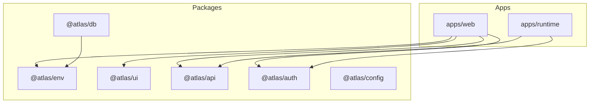
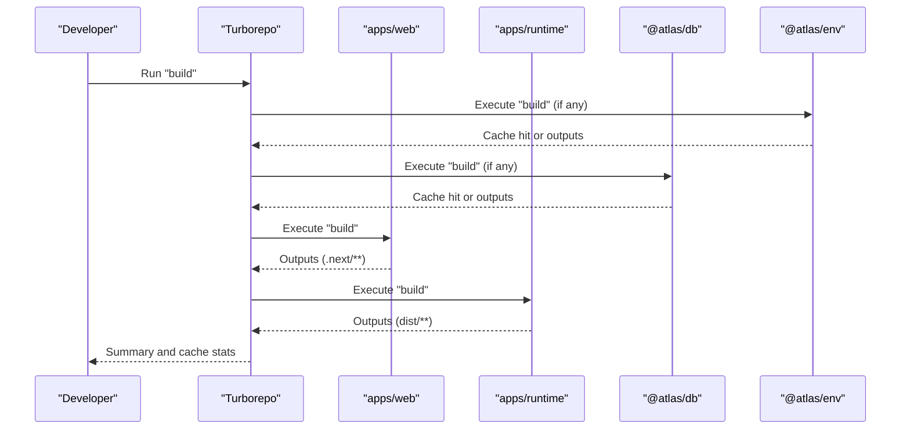
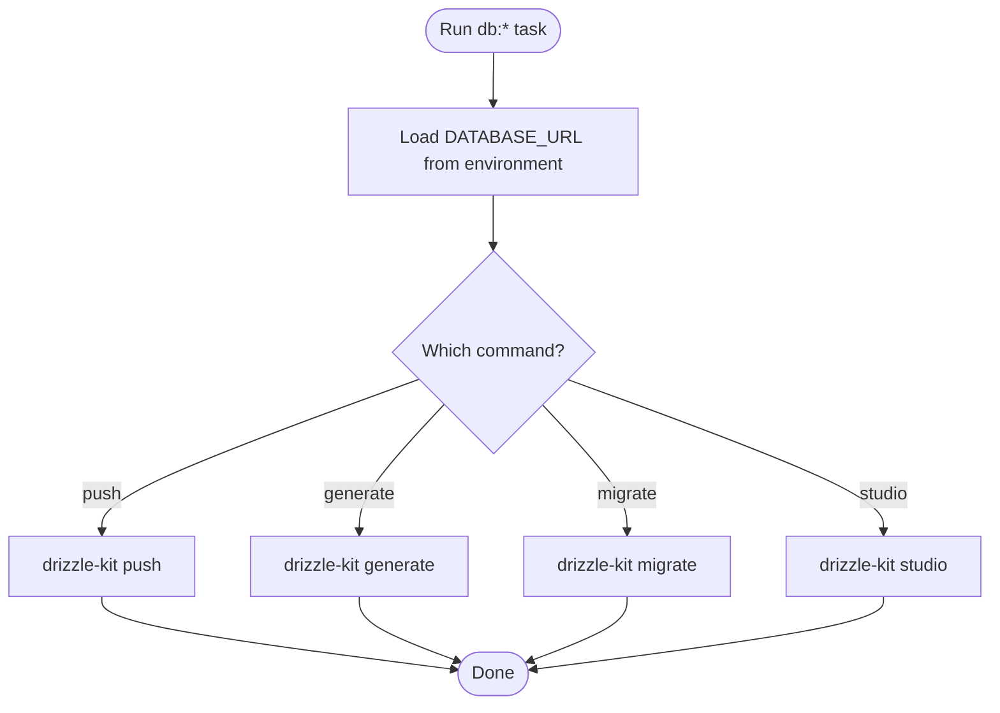
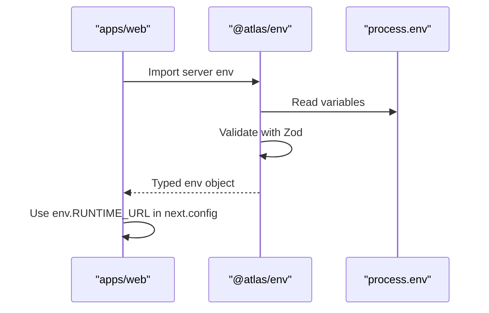
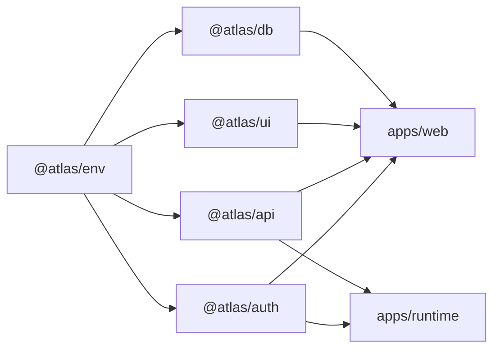

# Build System and Task Orchestration

<cite>
**Referenced Files in This Document**
- [turbo.json](file://turbo.json)
- [package.json](file://package.json)
- [apps/web/package.json](file://apps/web/package.json)
- [apps/runtime/package.json](file://apps/runtime/package.json)
- [packages/db/package.json](file://packages/db/package.json)
- [packages/env/package.json](file://packages/env/package.json)
- [packages/ui/package.json](file://packages/ui/package.json)
- [packages/db/drizzle.config.ts](file://packages/db/drizzle.config.ts)
- [apps/web/next.config.ts](file://apps/web/next.config.ts)
- [packages/env/src/server.ts](file://packages/env/src/server.ts)
- [packages/env/src/web.ts](file://packages/env/src/web.ts)
</cite>

## Table of Contents

1. Introduction
2. Project Structure
3. Core Components
4. Architecture Overview
5. Detailed Component Analysis
6. Dependency Analysis
7. Performance Considerations
8. Troubleshooting Guide
9. Conclusion

## Introduction

This document explains the monorepo build system and task orchestration powered by Turborepo. It covers how tasks are defined, how dependencies between packages are resolved, caching strategies, environment variable handling, and how to run development builds, production builds, and individual package builds. It also documents database operations, linting/type-checking integration, and optimization techniques for faster builds.

## Project Structure

The repository is a Bun workspaces monorepo with:

- apps: runtime services and Next.js web application
- packages: shared libraries (API client, auth, UI, env, db)
- Root-level Turborepo configuration that defines global tasks and caching behavior

**Diagram sources**

- [apps/web/package.json:11-15](file://apps/web/package.json#L11-L15)
- [apps/runtime/package.json:15-18](file://apps/runtime/package.json#L15-L18)
- [packages/db/package.json:18-23](file://packages/db/package.json#L18-L23)

**Section sources**

- [package.json:4-8](file://package.json#L4-L8)
- [turbo.json:1-52](file://turbo.json#L1-L52)

## Core Components

- Turborepo root configuration defines tasks: build, lint, check-types, dev, and database tasks (db:push, db:generate, db:migrate, db:studio).
- Root scripts delegate to Turborepo for running tasks across the workspace.
- Each app and package defines its own scripts; Turborepo orchestrates execution based on dependency graphs and caching rules.

Key responsibilities:

- Build pipeline: dependsOn transitive build of dependencies, output caching for dist and .next artifacts.
- Type checking: parallelizable type checks across packages via check-types.
- Linting: parallelizable linting across packages.
- Development: persistent dev servers with caching disabled for live iteration.
- Database: non-cached Drizzle Kit commands for schema push/generate/migrate/studio.

**Section sources**

- [turbo.json:20-49](file://turbo.json#L20-L49)
- [package.json:29-40](file://package.json#L29-L40)
- [apps/web/package.json:5-9](file://apps/web/package.json#L5-L9)
- [apps/runtime/package.json:9-14](file://apps/runtime/package.json#L9-L14)
- [packages/db/package.json:12-17](file://packages/db/package.json#L12-L17)

## Architecture Overview

Turborepo coordinates tasks across the monorepo using:

- Task definitions in turbo.json
- Workspace dependency graph from package.json workspaces
- Per-package scripts that implement actual work
- Caching based on inputs, outputs, environment variables, and dependency hashes

**Diagram sources**

- [turbo.json:21-25](file://turbo.json#L21-L25)
- [apps/web/package.json:5-9](file://apps/web/package.json#L5-L9)
- [apps/runtime/package.json:9-14](file://apps/runtime/package.json#L9-L14)
- [packages/db/package.json:12-17](file://packages/db/package.json#L12-L17)

## Detailed Component Analysis

### Turborepo Tasks and Caching

- build:
  - Depends on upstream packages’ build tasks (^build).
  - Inputs include default source files and .env* files.
  - Outputs cached: dist/** and .next/** (excluding .next/cache).
- lint and check-types:
  - Depend on upstream tasks (^lint, ^check-types) enabling parallel execution with correct dependency-aware caching.
- dev:
  - Disabled caching and marked persistent for long-running dev servers.
- Database tasks:
  - db:push, db:generate, db:migrate, db:studio are not cached; db:migrate and db:studio are persistent for interactive use.

Environment variables:

- globalEnv lists variables that affect all tasks’ hashes and availability at runtime.

**Section sources**

- [turbo.json:4-19](file://turbo.json#L4-L19)
- [turbo.json:21-49](file://turbo.json#L21-L49)

### Application Builds

- Web (Next.js):
  - Scripts: dev, build, start, check-types.
  - Build outputs cached under .next/** per Turborepo config.
  - Uses typed environment via @atlas/env server module.
  - Rewrites route /api/eve/* to runtime service using RUNTIME_URL.
- Runtime:
  - Scripts: build, dev, start, typecheck.
  - Build uses framework toolchain; outputs cached under dist/**.

**Section sources**

- [apps/web/package.json:5-9](file://apps/web/package.json#L5-L9)
- [apps/web/next.config.ts:1-31](file://apps/web/next.config.ts#L1-L31)
- [apps/runtime/package.json:9-14](file://apps/runtime/package.json#L9-L14)

### Shared Packages

- @atlas/env:
  - Provides typed environment access for server and web contexts.
  - Server env validates required keys; web env exposes client-safe variables.
- @atlas/db:
  - Drizzle Kit scripts for push, generate, migrate, studio.
  - Configuration loads DATABASE_URL from environment.
- @atlas/ui:
  - Exposes components/hooks/styles; includes type checking script.

**Section sources**

- [packages/env/package.json:6-14](file://packages/env/package.json#L6-L14)
- [packages/env/src/server.ts:5-28](file://packages/env/src/server.ts#L5-L28)
- [packages/env/src/web.ts:4-13](file://packages/env/src/web.ts#L4-L13)
- [packages/db/package.json:12-17](file://packages/db/package.json#L12-L17)
- [packages/db/drizzle.config.ts:1-16](file://packages/db/drizzle.config.ts#L1-L16)
- [packages/ui/package.json:13-15](file://packages/ui/package.json#L13-L15)

### Database Operations

- Commands:
  - db:push: Push schema to database.
  - db:generate: Generate migration files.
  - db:migrate: Apply migrations (persistent).
  - db:studio: Open database GUI (persistent).
- Environment:
  - DATABASE_URL is loaded by Drizzle configuration and validated by server env.

**Diagram sources**

- [packages/db/package.json:12-17](file://packages/db/package.json#L12-L17)
- [packages/db/drizzle.config.ts:1-16](file://packages/db/drizzle.config.ts#L1-L16)
- [packages/env/src/server.ts:17-23](file://packages/env/src/server.ts#L17-L23)

**Section sources**

- [packages/db/package.json:12-17](file://packages/db/package.json#L12-L17)
- [packages/db/drizzle.config.ts:1-16](file://packages/db/drizzle.config.ts#L1-L16)
- [packages/env/src/server.ts:5-28](file://packages/env/src/server.ts#L5-L28)

### Linting and Type Checking

- Lint:
  - Orchestrated by Turborepo; depends on upstream lint tasks for dependency-aware caching while allowing parallel execution.
- Type checking:
  - Web and UI packages define check-types scripts using TypeScript.
  - Turborepo’s check-types task ensures consistent execution across packages.

**Section sources**

- [turbo.json:26-31](file://turbo.json#L26-L31)
- [apps/web/package.json:5-9](file://apps/web/package.json#L5-L9)
- [packages/ui/package.json:13-15](file://packages/ui/package.json#L13-L15)

### Environment Variables Handling

- Global environment variables:
  - Listed in turbo.json globalEnv; these are available to tasks and included in hash computation.
- Package-level validation:
  - Server-side env is validated using Zod schemas; missing or invalid values cause runtime errors unless skipped.
- Web-only variables:
  - Client-safe variables exposed through web env module.
- Next.js integration:
  - next.config.ts reads RUNTIME_URL from typed env to configure rewrites.

**Diagram sources**

- [turbo.json:4-19](file://turbo.json#L4-L19)
- [packages/env/src/server.ts:5-28](file://packages/env/src/server.ts#L5-L28)
- [packages/env/src/web.ts:4-13](file://packages/env/src/web.ts#L4-L13)
- [apps/web/next.config.ts:1-31](file://apps/web/next.config.ts#L1-L31)

**Section sources**

- [turbo.json:4-19](file://turbo.json#L4-L19)
- [packages/env/src/server.ts:5-28](file://packages/env/src/server.ts#L5-L28)
- [packages/env/src/web.ts:4-13](file://packages/env/src/web.ts#L4-L13)
- [apps/web/next.config.ts:1-31](file://apps/web/next.config.ts#L1-L31)

## Dependency Analysis

Task dependency graph for build:

- Each package’s build depends on upstream packages’ build tasks (^build).
- Outputs are cached per package, enabling incremental rebuilds when only leaf packages change.

**Diagram sources**

- [turbo.json:21-25](file://turbo.json#L21-L25)
- [apps/web/package.json:11-15](file://apps/web/package.json#L11-L15)
- [apps/runtime/package.json:15-18](file://apps/runtime/package.json#L15-L18)

**Section sources**

- [turbo.json:21-25](file://turbo.json#L21-L25)
- [apps/web/package.json:11-15](file://apps/web/package.json#L11-L15)
- [apps/runtime/package.json:15-18](file://apps/runtime/package.json#L15-L18)

## Performance Considerations

- Parallel execution:
  - lint and check-types depend on upstream tasks but can run in parallel across packages due to Turborepo’s DAG scheduling.
- Caching:
  - build caches dist/** and .next/**; ensure outputs match what your scripts produce.
  - .env* files are included as inputs for build; changes will invalidate relevant caches.
- Persistent tasks:
  - dev and db:migrate/db:studio are marked persistent to support long-running processes.
- Optimization tips:
  - Keep inputs focused to avoid unnecessary cache invalidation.
  - Exclude noisy outputs (e.g., .next/cache) from caching where appropriate.
  - Use workspace dependencies to minimize redundant builds.

[No sources needed since this section provides general guidance]

## Troubleshooting Guide

Common issues and resolutions:

- Environment variables not affecting cache:
  - Ensure variables are listed in globalEnv or task-specific env so they participate in hashing.
- .env file changes not triggering rebuilds:
  - Include .env* in task inputs for build; verify globalEnv includes necessary keys.
- Dev tasks hanging or not completing:
  - Mark dev tasks as persistent to prevent Turborepo from waiting for completion.
- Database tasks failing:
  - Verify DATABASE_URL is set and accessible; confirm Drizzle configuration points to the correct environment file.
- Unexpected cache misses:
  - Inspect task inputs and outputs; compare hashes using diagnostic flags if needed.

**Section sources**

- [turbo.json:4-19](file://turbo.json#L4-L19)
- [turbo.json:21-49](file://turbo.json#L21-L49)
- [packages/db/drizzle.config.ts:1-16](file://packages/db/drizzle.config.ts#L1-L16)

## Conclusion

This monorepo leverages Turborepo to orchestrate builds, type checks, linting, and database operations with robust caching and dependency management. By defining clear tasks, precise inputs/outputs, and typed environment variables, the pipeline supports fast local development and reliable CI builds. Follow the guidelines above to extend tasks, optimize performance, and troubleshoot common issues effectively.
