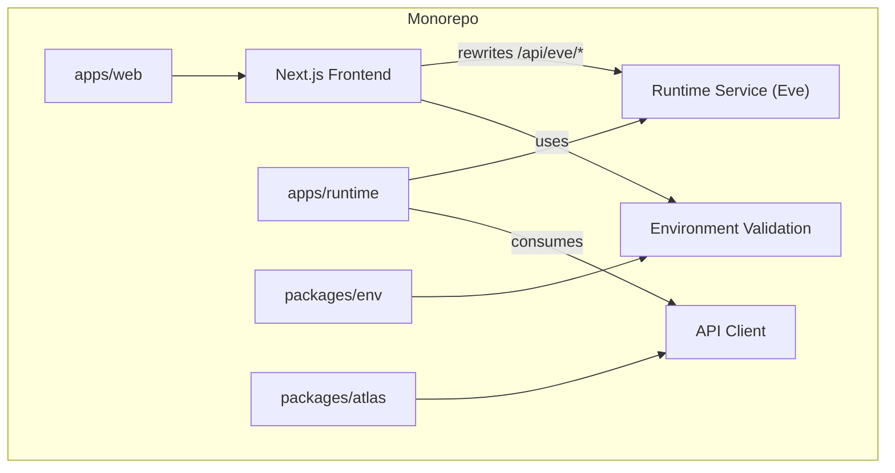
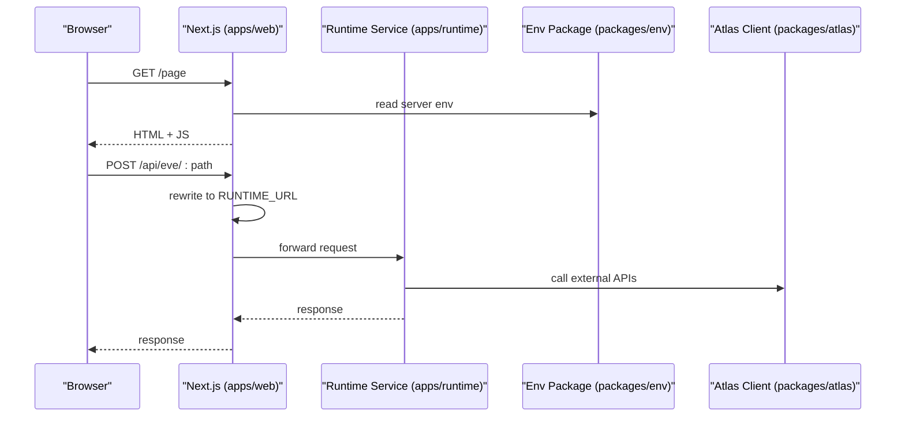
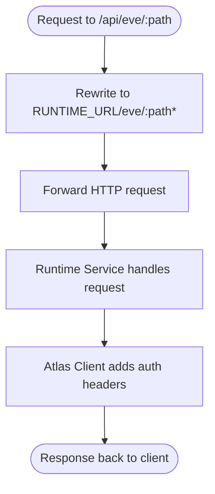
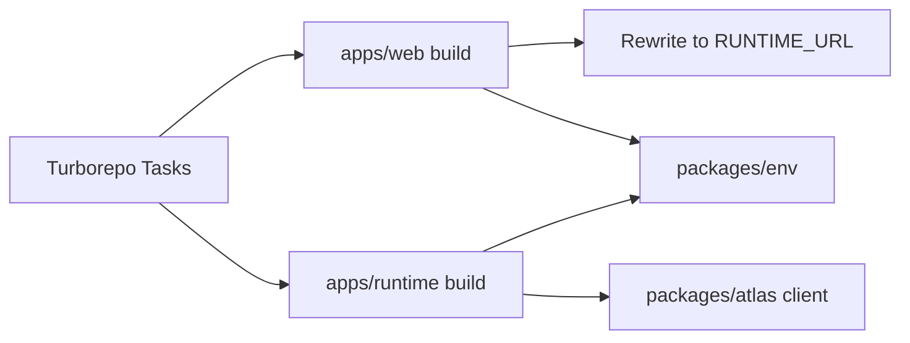

# Deployment Strategies and Environments

<cite>
**Referenced Files in This Document**
- [package.json](file://package.json)
- [turbo.json](file://turbo.json)
- [apps/web/package.json](file://apps/web/package.json)
- [apps/web/next.config.ts](file://apps/web/next.config.ts)
- [apps/runtime/package.json](file://apps/runtime/package.json)
- [packages/env/package.json](file://packages/env/package.json)
- [packages/atlas/src/client.ts](file://packages/atlas/src/client.ts)
- [.agents/skills/turborepo/references/ci/vercel.md](file://.agents/skills/turborepo/references/ci/vercel.md)
- [.agents/skills/turborepo/references/environment/RULE.md](file://.agents/skills/turborepo/references/environment/RULE.md)
- [.agents/skills/turborepo/references/environment/gotchas.md](file://.agents/skills/turborepo/references/environment/gotchas.md)
- [.agents/skills/turborepo/references/ci/github-actions.md](file://.agents/skills/turborepo/references/ci/github-actions.md)
- [.agents/skills/turborepo/references/ci/patterns.md](file://.agents/skills/turborepo/references/ci/patterns.md)
</cite>

## Table of Contents

1. Introduction
2. Project Structure
3. Core Components
4. Architecture Overview
5. Detailed Component Analysis
6. Dependency Analysis
7. Performance Considerations
8. Troubleshooting Guide
9. Conclusion
10. Appendices

## Introduction

This document provides deployment strategies for the Atlas application, focusing on:

- Vercel deployment configuration for the Next.js frontend (environment variables, build settings, preview deployments)
- Containerization approaches for runtime services using Docker
- Multi-environment setup (development, staging, production) with robust configuration management
- CI/CD automation, rollback strategies, and zero-downtime deployments
- Scaling considerations, load balancing, and performance optimization for production

The guidance is grounded in the repository’s monorepo structure, Turborepo task graph, environment variable handling, and Vercel integration patterns documented in this project.

## Project Structure

Atlas is a Turborepo monorepo with:

- apps/web: Next.js frontend
- apps/runtime: Runtime service built with Eve
- packages/*: Shared libraries including environment validation and client utilities

Turborepo orchestrates builds across packages and defines global environment variables that affect caching and task execution. The Next.js app rewrites API routes to the runtime service via an environment variable.

**Diagram sources**

- [turbo.json:4-19](file://turbo.json#L4-L19)
- [apps/web/next.config.ts:20-27](file://apps/web/next.config.ts#L20-L27)
- [packages/env/package.json:6-9](file://packages/env/package.json#L6-L9)
- [packages/atlas/src/client.ts:1-20](file://packages/atlas/src/client.ts#L1-L20)

**Section sources**

- [package.json:29-40](file://package.json#L29-L40)
- [turbo.json:20-49](file://turbo.json#L20-L49)
- [apps/web/package.json:5-10](file://apps/web/package.json#L5-L10)
- [apps/runtime/package.json:9-14](file://apps/runtime/package.json#L9-L14)

## Core Components

- Turborepo tasks define build inputs, outputs, and environment propagation. Global env includes keys required by both web and runtime services.
- Next.js config rewrites /api/eve/* to the runtime service URL configured at build time via RUNTIME_URL.
- Environment package exposes typed accessors for server and web contexts, ensuring consistent env consumption.
- Runtime service uses Eve tooling for building and starting the agent runtime.

Key responsibilities:

- Build orchestration and caching via Turborepo
- Secure and typed environment handling
- Routing between frontend and runtime
- Runtime service lifecycle

**Section sources**

- [turbo.json:4-19](file://turbo.json#L4-L19)
- [turbo.json:20-49](file://turbo.json#L20-L49)
- [apps/web/next.config.ts:1-31](file://apps/web/next.config.ts#L1-L31)
- [packages/env/package.json:6-15](file://packages/env/package.json#L6-L15)
- [apps/runtime/package.json:9-14](file://apps/runtime/package.json#L9-L14)

## Architecture Overview

The runtime architecture connects the Next.js frontend to the runtime service through a rewrite rule, while shared packages provide environment validation and API clients.

**Diagram sources**

- [apps/web/next.config.ts:20-27](file://apps/web/next.config.ts#L20-L27)
- [packages/env/package.json:6-9](file://packages/env/package.json#L6-L9)
- [packages/atlas/src/client.ts:14-20](file://packages/atlas/src/client.ts#L14-L20)

## Detailed Component Analysis

### Vercel Deployment Configuration for Next.js Frontend

- Root directory: Set to apps/web so Vercel builds the Next.js app within the monorepo context.
- Build command: Vercel auto-detects Turborepo; you can override to target the web app explicitly if needed.
- Preview deployments: Enabled automatically per branch/PR; remote cache is enabled by default for Turborepo on Vercel.
- Environment variables: Configure per environment (Production, Preview, Development) in Vercel Dashboard. Ensure all keys listed in Turborepo’s globalEnv are set where applicable.

Operational notes:

- Use turbo-ignore to skip unnecessary builds when only unrelated packages change.
- For strict environment checks in production builds, use the recommended env mode flag.

**Section sources**

- [.agents/skills/turborepo/references/ci/vercel.md:73-112](file://.agents/skills/turborepo/references/ci/vercel.md#L73-L112)
- [turbo.json:4-19](file://turbo.json#L4-L19)

### Environment Variables and Multi-Environment Setup

- Global environment keys are declared in Turborepo to influence hashing and availability across tasks. These include database URLs, auth secrets, gateway keys, and runtime endpoints.
- The environment package exports typed accessors for server and web contexts, ensuring type safety and consistent usage.
- Best practices:
  - Keep sensitive values out of source control; store them in your platform’s secret manager (e.g., Vercel Environment Variables).
  - Use environment-specific files or platform-scoped variables for dev/staging/prod.
  - Avoid leaking non-secret variables into hashes unless they affect behavior.

Recommended variable categories:

- Database connectivity (e.g., DATABASE_URL)
- Authentication and OAuth (e.g., BETTER_AUTH_SECRET, GOOGLE_CLIENT_ID/SECRET)
- External integrations (e.g., AI_GATEWAY_API_KEY, COMPOSIO_API_KEY)
- Runtime routing (e.g., RUNTIME_URL)
- CORS and origin policies (e.g., CORS_ORIGIN)

**Section sources**

- [turbo.json:4-19](file://turbo.json#L4-L19)
- [packages/env/package.json:6-15](file://packages/env/package.json#L6-L15)
- [.agents/skills/turborepo/references/environment/RULE.md:1-53](file://.agents/skills/turborepo/references/environment/RULE.md#L1-L53)
- [.agents/skills/turborepo/references/environment/gotchas.md:143-176](file://.agents/skills/turborepo/references/environment/gotchas.md#L143-L176)

### Runtime Services and Containerization with Docker

- The runtime service uses Eve for building and running agents. Its scripts expose build/dev/start commands suitable for containerized execution.
- To containerize:
  - Use a Node-compatible base image aligned with the engines field in the root package manifest.
  - Install dependencies at the monorepo root, then build the runtime package.
  - Expose the runtime port defined by the Eve process and ensure RUNTIME_URL and other required env vars are injected at runtime.
  - Prefer multi-stage builds to minimize image size: one stage for dependency installation/build, another for runtime.

Considerations:

- Ensure the runtime service is reachable from the Next.js app via RUNTIME_URL.
- If deploying alongside the frontend, consider reverse proxying the runtime under a path or domain segment.

**Section sources**

- [apps/runtime/package.json:9-14](file://apps/runtime/package.json#L9-L14)
- [package.json:61-64](file://package.json#L61-L64)

### API Rewriting and Integration Points

- The Next.js app rewrites /api/eve/* requests to the runtime service endpoint specified by RUNTIME_URL. This decouples frontend routing from runtime hosting details.
- The runtime consumes the Atlas client which injects authentication headers for downstream calls.

**Diagram sources**

- [apps/web/next.config.ts:20-27](file://apps/web/next.config.ts#L20-L27)
- [packages/atlas/src/client.ts:14-20](file://packages/atlas/src/client.ts#L14-L20)

**Section sources**

- [apps/web/next.config.ts:20-27](file://apps/web/next.config.ts#L20-L27)
- [packages/atlas/src/client.ts:1-20](file://packages/atlas/src/client.ts#L1-L20)

### CI/CD Automation, Rollback, and Zero-Downtime Deployments

- GitHub Actions:
  - Use OpenID Connect or Personal Access Token to authenticate with Turborepo remote cache.
  - Parallelize lint/test/build jobs and leverage affected builds to speed up pipelines.
- Vercel:
  - Remote cache is automatically enabled for Turborepo projects.
  - Use turbo-ignore to avoid rebuilding unchanged packages.
  - Configure environment variables per environment (Production, Preview, Development).
- Rollback strategies:
  - Vercel supports instant rollbacks to previous deployments from the dashboard.
  - For custom containers, maintain immutable tags and promote versions through environments.
- Zero-downtime deployments:
  - Vercel deploys new versions behind a load balancer and switches traffic atomically.
  - For self-hosted runtimes, use rolling updates or blue/green deployments with health checks.

**Section sources**

- [.agents/skills/turborepo/references/ci/github-actions.md:82-130](file://.agents/skills/turborepo/references/ci/github-actions.md#L82-L130)
- [.agents/skills/turborepo/references/ci/patterns.md:91-146](file://.agents/skills/turborepo/references/ci/patterns.md#L91-L146)
- [.agents/skills/turborepo/references/ci/vercel.md:73-112](file://.agents/skills/turborepo/references/ci/vercel.md#L73-L112)

## Dependency Analysis

Turborepo coordinates builds across packages and enforces environment scoping. The Next.js app depends on the runtime via a rewrite rule, and both consume shared packages for environment and client logic.

**Diagram sources**

- [turbo.json:20-49](file://turbo.json#L20-L49)
- [apps/web/next.config.ts:20-27](file://apps/web/next.config.ts#L20-L27)
- [packages/env/package.json:6-9](file://packages/env/package.json#L6-L9)
- [packages/atlas/src/client.ts:14-20](file://packages/atlas/src/client.ts#L14-L20)

**Section sources**

- [turbo.json:20-49](file://turbo.json#L20-L49)
- [apps/web/next.config.ts:20-27](file://apps/web/next.config.ts#L20-L27)
- [packages/env/package.json:6-9](file://packages/env/package.json#L6-L9)
- [packages/atlas/src/client.ts:14-20](file://packages/atlas/src/client.ts#L14-L20)

## Performance Considerations

- Turborepo remote cache on Vercel accelerates builds across preview and production.
- Use turbo-ignore to skip redundant builds when only unrelated code changes.
- Optimize Next.js builds with framework defaults and minimal external dependencies.
- For runtime services, prefer efficient packaging and cold-start mitigation strategies (e.g., keep dependencies small, avoid heavy initialization).

[No sources needed since this section provides general guidance]

## Troubleshooting Guide

Common issues and resolutions:

- Missing environment variables:
  - Ensure all keys listed in Turborepo’s globalEnv are present in your deployment platform’s environment configuration.
  - Validate that Next.js rewrites resolve correctly by checking RUNTIME_URL.
- Build failures due to env hashing:
  - Review Turborepo environment rules to avoid unintended rebuilds or missing variables.
- Runtime connectivity errors:
  - Confirm the runtime service is reachable from the Next.js app and that CORS and origins are configured appropriately.

**Section sources**

- [turbo.json:4-19](file://turbo.json#L4-L19)
- [apps/web/next.config.ts:20-27](file://apps/web/next.config.ts#L20-L27)
- [.agents/skills/turborepo/references/environment/RULE.md:1-53](file://.agents/skills/turborepo/references/environment/RULE.md#L1-L53)

## Conclusion

Atlas leverages Turborepo for efficient monorepo builds and integrates seamlessly with Vercel for frontend deployments. Environment variables are centrally managed and validated, while the Next.js app delegates runtime work to a separate service via rewrites. With CI/CD automation, remote caching, and platform-native zero-downtime deployments, Atlas can scale reliably across development, staging, and production.

[No sources needed since this section summarizes without analyzing specific files]

## Appendices

### Recommended Vercel Settings Checklist

- Root Directory: apps/web
- Build Command: Auto-detected or overridden to target web
- Environment Variables: Set per environment for all keys in globalEnv
- Ignored Build Step: turbo-ignore to optimize PR previews

**Section sources**

- [.agents/skills/turborepo/references/ci/vercel.md:73-112](file://.agents/skills/turborepo/references/ci/vercel.md#L73-L112)

### Docker Image Outline for Runtime

- Base image aligned with Node version in root package manifest
- Multi-stage build: install deps and build runtime package
- Inject runtime env vars (RUNTIME_URL and others) at container start
- Expose runtime port and configure health checks

**Section sources**

- [apps/runtime/package.json:9-14](file://apps/runtime/package.json#L9-L14)
- [package.json:61-64](file://package.json#L61-L64)
