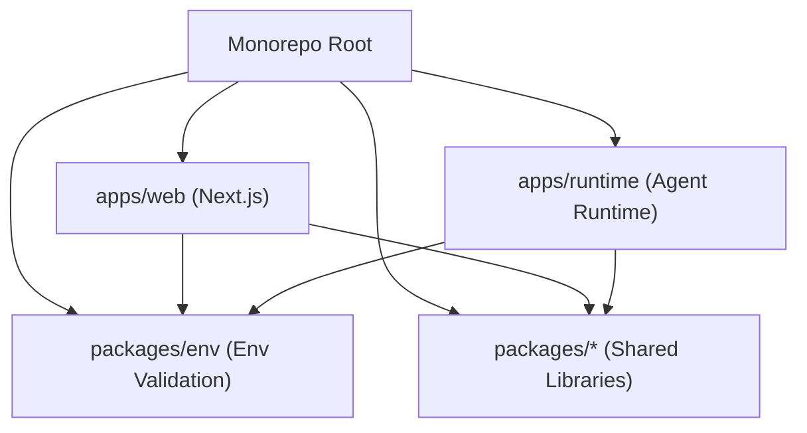
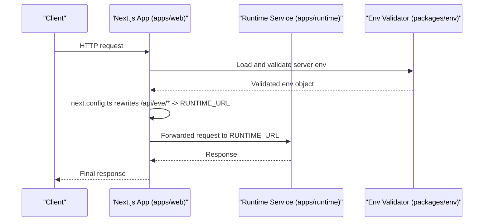
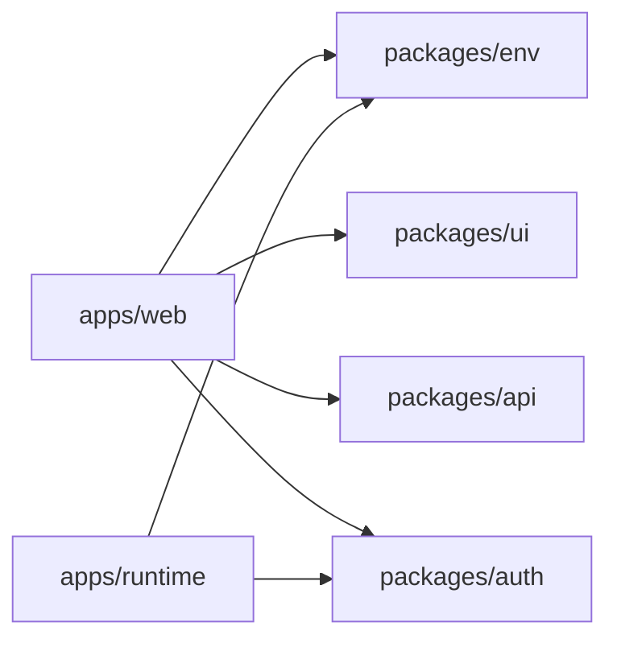

# Deployment and DevOps

<cite>
**Referenced Files in This Document**
- [package.json](file://package.json)
- [turbo.json](file://turbo.json)
- [apps/web/package.json](file://apps/web/package.json)
- [apps/runtime/package.json](file://apps/runtime/package.json)
- [apps/web/next.config.ts](file://apps/web/next.config.ts)
- [packages/env/package.json](file://packages/env/package.json)
- [packages/env/src/server.ts](file://packages/env/src/server.ts)
- [.agents/skills/turborepo/references/environment/RULE.md](file://.agents/skills/turborepo/references/environment/RULE.md)
- [.agents/skills/turborepo/references/ci/vercel.md](file://.agents/skills/turborepo/references/ci/vercel.md)
- [.agents/skills/turborepo/references/ci/github-actions.md](file://.agents/skills/turborepo/references/ci/github-actions.md)
- [.agents/skills/turborepo/references/ci/patterns.md](file://.agents/skills/turborepo/references/ci/patterns.md)
</cite>

## Table of Contents

1. Introduction
2. Project Structure
3. Core Components
4. Architecture Overview
5. Detailed Component Analysis
6. Dependency Analysis
7. Performance Considerations
8. Troubleshooting Guide
9. Conclusion
10. Appendices

## Introduction

This document provides production-focused deployment and DevOps guidance for the Atlas application. It covers building with Turborepo, caching strategies, environment and secret management, CI/CD automation, containerization, cloud deployment (Vercel), monitoring and logging, performance tuning, backup and recovery, and operational maintenance. The goal is to enable reliable, fast, and secure deployments across development, staging, and production environments.

## Project Structure

Atlas is a monorepo managed by Turborepo with:

- apps/web: Next.js frontend application
- apps/runtime: Agent runtime service
- packages/*: Shared libraries including typed environment validation and utilities

Turborepo orchestrates builds, type checks, and database tasks across packages and apps. Environment variables are centrally validated via a shared package.

**Diagram sources**

- [package.json:1-66](file://package.json#L1-L66)
- [turbo.json:1-52](file://turbo.json#L1-L52)

**Section sources**

- [package.json:1-66](file://package.json#L1-L66)
- [turbo.json:1-52](file://turbo.json#L1-L52)

## Core Components

- Build orchestration: Turborepo defines tasks, dependencies, inputs, outputs, and environment handling for reproducible builds and caching.
- Web app: Next.js build pipeline with rewrites to the runtime service and image remote patterns.
- Runtime: Agent runtime with its own build/start scripts.
- Environment: Centralized, validated environment configuration for server-side usage.

Key responsibilities:

- turbo.json: Task definitions, env scoping, cache keys, and outputs.
- apps/web: Next.js config and build scripts.
- apps/runtime: Runtime build and start commands.
- packages/env: Server-side environment schema and validation.

**Section sources**

- [turbo.json:1-52](file://turbo.json#L1-L52)
- [apps/web/package.json:1-47](file://apps/web/package.json#L1-L47)
- [apps/runtime/package.json:1-29](file://apps/runtime/package.json#L1-L29)
- [packages/env/package.json:1-22](file://packages/env/package.json#L1-L22)
- [packages/env/src/server.ts:1-28](file://packages/env/src/server.ts#L1-L28)

## Architecture Overview

The system consists of a Next.js web app that proxies agent requests to a separate runtime service. Environment variables are validated at startup to ensure correct configuration. Turborepo coordinates builds and tasks across the monorepo.

**Diagram sources**

- [apps/web/next.config.ts:1-31](file://apps/web/next.config.ts#L1-L31)
- [packages/env/src/server.ts:1-28](file://packages/env/src/server.ts#L1-L28)

## Detailed Component Analysis

### Turborepo Build Pipeline and Caching

- Tasks: build, lint, check-types, dev, db:* tasks are defined with explicit dependencies and caching behavior.
- Inputs and outputs: Build task includes default inputs plus .env files; outputs include dist and Next.js build artifacts while excluding caches.
- Environment scoping: globalEnv lists variables that affect all tasks’ hashes; this ensures consistent builds when critical secrets or URLs change.
- Parallel execution: dependsOn with ^build enables parallelized dependency-aware builds across packages/apps.

Operational notes:

- Use strict env mode in CI where appropriate to fail fast on missing variables.
- Keep .env files out of version control; rely on platform-provided secrets.
- For local dev, keep .env* minimal and avoid committing sensitive values.

**Section sources**

- [turbo.json:1-52](file://turbo.json#L1-L52)
- [.agents/skills/turborepo/references/environment/RULE.md:1-124](file://.agents/skills/turborepo/references/environment/RULE.md#L1-L124)

### Environment Variables and Secrets Management

- Centralized validation: Server-side env is validated using a schema that enforces presence and format for required keys such as API keys, URLs, and tokens.
- Global env list: Turborepo’s globalEnv ensures changes to critical variables trigger rebuilds across tasks.
- Best practices:
  - Store secrets in your CI/CD platform’s secret store (e.g., Vercel Environment Variables).
  - Never commit .env files containing secrets.
  - Validate env at build time to catch misconfigurations early.
  - Separate per-environment variables (development, staging, production) using platform features.

Environment categories:

- Required server-side secrets: API keys, client IDs/secrets, database URL, auth secrets, bot tokens.
- URLs and origins: Base URLs for APIs, runtime, and CORS settings.
- Feature toggles: Controlled via environment flags where applicable.

**Section sources**

- [packages/env/src/server.ts:1-28](file://packages/env/src/server.ts#L1-L28)
- [turbo.json:1-52](file://turbo.json#L1-L52)
- [.agents/skills/turborepo/references/environment/RULE.md:1-124](file://.agents/skills/turborepo/references/environment/RULE.md#L1-L124)

### Next.js Web App Configuration

- Rewrites: Requests to /api/eve/* are proxied to the runtime service based on RUNTIME_URL.
- Image optimization: Remote image domains are explicitly allowed.
- Performance features: Component caching, partial prefetching, React compiler enabled.

Deployment considerations:

- Ensure RUNTIME_URL is correctly set per environment.
- Configure CORS_ORIGIN appropriately for cross-origin requests if needed.
- Keep Next.js build outputs cached by Turborepo to speed up CI.

**Section sources**

- [apps/web/next.config.ts:1-31](file://apps/web/next.config.ts#L1-L31)
- [apps/web/package.json:1-47](file://apps/web/package.json#L1-L47)

### Runtime Service

- Scripts: build, dev, start, and typecheck are provided for the agent runtime.
- Integration: Exposed via RUNTIME_URL and proxied from the web app.

Operational guidance:

- Run the runtime as a separate service/container in production.
- Monitor health endpoints and logs for the runtime.
- Scale horizontally behind a load balancer if needed.

**Section sources**

- [apps/runtime/package.json:1-29](file://apps/runtime/package.json#L1-L29)

### Database Tasks

- Commands: push, generate, migrate, studio are exposed through Turborepo tasks scoped to the database package.
- Caching: Disabled for DB tasks to ensure they always run when invoked.

Best practices:

- Run migrations in CI before deploying code changes that depend on schema updates.
- Use a dedicated migration strategy (e.g., backward-compatible changes first).
- Back up databases before major migrations.

**Section sources**

- [turbo.json:1-52](file://turbo.json#L1-L52)
- [package.json:1-66](file://package.json#L1-L66)

## Dependency Analysis

Turborepo coordinates inter-package dependencies during builds. The web app depends on shared packages and the runtime is accessed via HTTP rewrites.

**Diagram sources**

- [apps/web/package.json:1-47](file://apps/web/package.json#L1-L47)
- [apps/runtime/package.json:1-29](file://apps/runtime/package.json#L1-L29)
- [packages/env/package.json:1-22](file://packages/env/package.json#L1-L22)

**Section sources**

- [apps/web/package.json:1-47](file://apps/web/package.json#L1-L47)
- [apps/runtime/package.json:1-29](file://apps/runtime/package.json#L1-L29)
- [packages/env/package.json:1-22](file://packages/env/package.json#L1-L22)

## Performance Considerations

- Turborepo caching:
  - Leverage remote cache for faster CI builds and shared cache across branches.
  - Use strict env mode in CI to prevent accidental inclusion of non-deterministic values.
- Next.js optimizations:
  - Component caching and partial prefetching reduce render times.
  - React compiler improves runtime performance.
- Parallel tasks:
  - Turborepo’s dependency graph runs independent tasks in parallel.
- Network:
  - Proxy only necessary paths to the runtime to minimize latency.
- Images:
  - Restrict remote image domains to trusted sources.

[No sources needed since this section provides general guidance]

## Troubleshooting Guide

Common issues and resolutions:

- Missing environment variables:
  - Ensure all required server-side variables are present in the deployment platform’s environment settings.
  - Turborepo’s globalEnv will cause rebuilds when these change; verify variable names match exactly.
- Build failures due to env validation:
  - Check the env schema for required fields and formats; fix invalid values.
- Runtime proxy errors:
  - Verify RUNTIME_URL is correct and reachable from the web app.
- Cache invalidation surprises:
  - Review inputs and outputs in turbo.json; avoid overly broad .env matching that can invalidate caches unnecessarily.

**Section sources**

- [packages/env/src/server.ts:1-28](file://packages/env/src/server.ts#L1-L28)
- [turbo.json:1-52](file://turbo.json#L1-L52)

## Conclusion

Atlas’s monorepo architecture, powered by Turborepo and validated environment configuration, supports efficient builds, robust deployments, and scalable operations. By following the outlined CI/CD, environment management, and operational practices, teams can deploy confidently across development, staging, and production environments with strong reliability and performance.

[No sources needed since this section summarizes without analyzing specific files]

## Appendices

### CI/CD and Automated Testing

- GitHub Actions:
  - Use remote cache setup actions to authenticate with Vercel and share cache across jobs.
  - Parallelize lint, test, and build jobs; use affected builds to optimize pipelines.
- Vercel:
  - Automatic detection of Turborepo; configure root directory for monorepos.
  - Set environment variables per environment (Production, Preview, Development).
  - Use turbo-ignore to skip unnecessary builds when no relevant changes occur.

**Section sources**

- [.agents/skills/turborepo/references/ci/github-actions.md:82-130](file://.agents/skills/turborepo/references/ci/github-actions.md#L82-L130)
- [.agents/skills/turborepo/references/ci/vercel.md:1-113](file://.agents/skills/turborepo/references/ci/vercel.md#L1-L113)
- [.agents/skills/turborepo/references/ci/patterns.md:91-146](file://.agents/skills/turborepo/references/ci/patterns.md#L91-L146)

### Containerization and Cloud Deployment

- Docker:
  - Create multi-stage Dockerfiles for Next.js and runtime services.
  - Inject secrets via runtime environment variables rather than baking into images.
- Vercel:
  - Set project root directory to apps/web for Next.js builds.
  - Configure environment variables in the dashboard per environment.
  - Enable remote caching automatically when deploying monorepos with Turborepo.

**Section sources**

- [.agents/skills/turborepo/references/ci/vercel.md:72-113](file://.agents/skills/turborepo/references/ci/vercel.md#L72-L113)

### Monitoring, Logging, and Error Tracking

- Logging:
  - Centralize logs from both web and runtime services.
  - Correlate requests using unique IDs propagated through proxies.
- Error tracking:
  - Integrate error reporting tools in both Next.js and runtime services.
  - Surface actionable stack traces and context in production.
- Metrics:
  - Track request latency, error rates, and resource utilization.
  - Alert on anomalies and degradation thresholds.

[No sources needed since this section provides general guidance]

### Backup and Recovery

- Database backups:
  - Schedule automated backups for production databases.
  - Test restore procedures regularly.
- Disaster recovery:
  - Define RTO/RPO targets and document recovery steps.
  - Maintain runbooks for common failure scenarios.

[No sources needed since this section provides general guidance]

### Operational Maintenance

- Migrations:
  - Run migrations in CI prior to deployment; rollback plans should be documented.
- Secrets rotation:
  - Rotate credentials periodically and update environment configurations accordingly.
- Health checks:
  - Implement health endpoints for web and runtime services.
  - Use platform health checks to manage traffic routing.

[No sources needed since this section provides general guidance]
