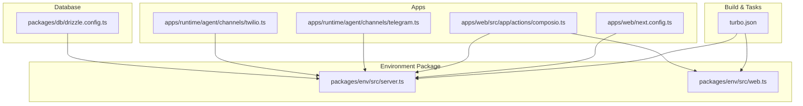
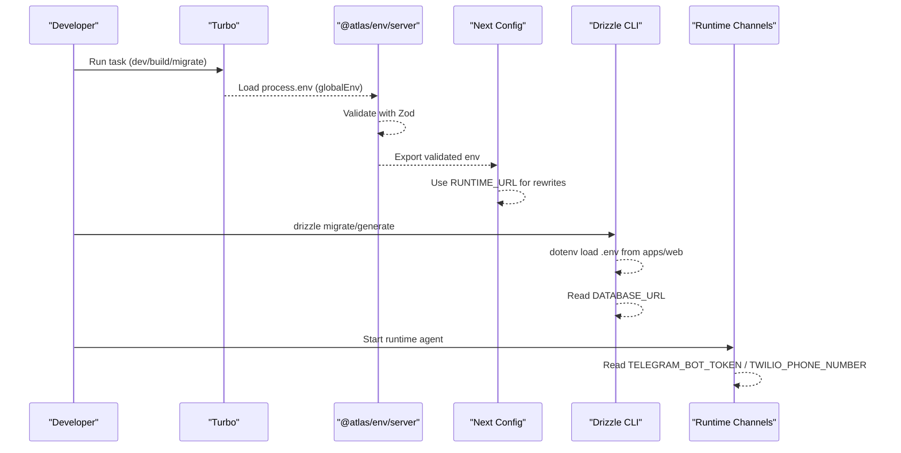
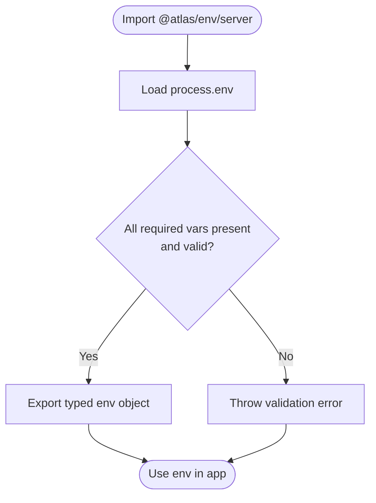
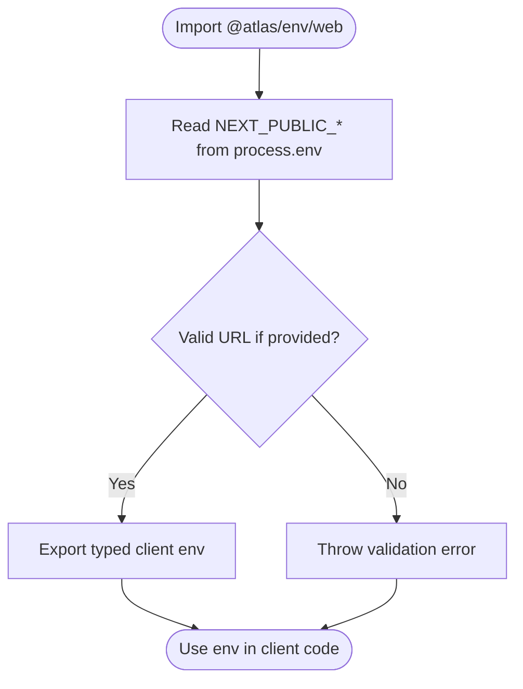
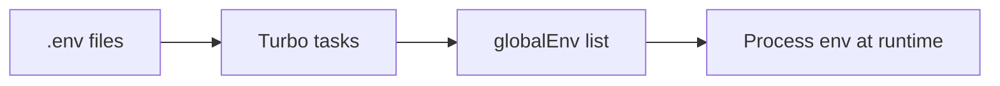
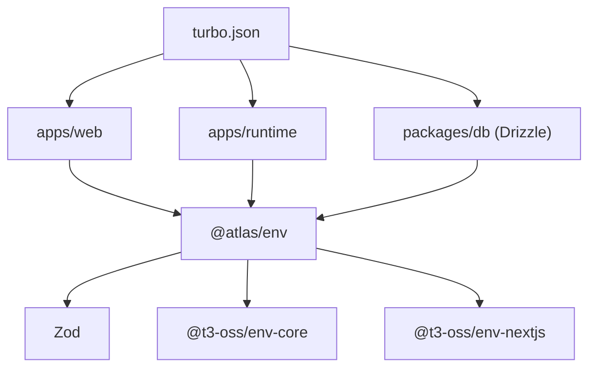

# Environment Configuration and Secrets Management

<cite>
**Referenced Files in This Document**
- [turbo.json](file://turbo.json)
- [package.json](file://package.json)
- [server.ts](file://packages/env/src/server.ts)
- [web.ts](file://packages/env/src/web.ts)
- [next.config.ts](file://apps/web/next.config.ts)
- [drizzle.config.ts](file://packages/db/drizzle.config.ts)
- [telegram.ts](file://apps/runtime/agent/channels/telegram.ts)
- [twilio.ts](file://apps/runtime/agent/channels/twilio.ts)
- [composio.ts](file://apps/web/src/app/actions/composio.ts)
</cite>

## Table of Contents

1. Introduction
2. Project Structure
3. Core Components
4. Architecture Overview
5. Detailed Component Analysis
6. Dependency Analysis
7. Performance Considerations
8. Troubleshooting Guide
9. Conclusion

## Introduction

This document explains how the Atlas application manages environment configuration and secrets across development, staging, and production. It covers variable organization, naming conventions, validation strategies, secret handling best practices, environment-specific configurations, third-party credentials, migration strategies, secure patterns, and troubleshooting.

## Project Structure

Atlas uses a monorepo with a shared environment package that centralizes validation and exposure of environment variables to server and client code. The build system (Turborepo) declares global environment variables and tracks .env files for caching. Database tooling loads environment variables at runtime for migrations.

**Diagram sources**

- [turbo.json:4-19](file://turbo.json#L4-L19)
- [server.ts:5-28](file://packages/env/src/server.ts#L5-L28)
- [web.ts:4-13](file://packages/env/src/web.ts#L4-L13)
- [next.config.ts:1-31](file://apps/web/next.config.ts#L1-L31)
- [drizzle.config.ts:1-16](file://packages/db/drizzle.config.ts#L1-L16)
- [telegram.ts:1-10](file://apps/runtime/agent/channels/telegram.ts#L1-L10)
- [twilio.ts:1-10](file://apps/runtime/agent/channels/twilio.ts#L1-L10)
- [composio.ts:1-10](file://apps/web/src/app/actions/composio.ts#L1-L10)

**Section sources**

- [turbo.json:4-19](file://turbo.json#L4-L19)
- [package.json:42-46](file://package.json#L42-L46)

## Core Components

- Server environment schema: Centralized validation for all server-side variables using Zod via @t3-oss/env-core. Includes API keys, URLs, database URL, auth secrets, and runtime endpoints. Supports skipping validation when needed.
- Web environment schema: Exposes only safe client variables via @t3-oss/env-nextjs. Currently exposes NEXT_PUBLIC_APP_URL as an optional URL.
- Turborepo global env: Declares which environment variables are available globally during builds and tasks, ensuring consistent access across packages.
- Database config loader: Loads .env for Drizzle CLI from the web app directory and reads DATABASE_URL for connection.

Key responsibilities:

- Validate required variables at startup or import time to fail fast on misconfiguration.
- Restrict client exposure to non-sensitive variables.
- Provide defaults where appropriate (e.g., NODE_ENV).
- Enable controlled bypass of validation for local debugging.

**Section sources**

- [server.ts:5-28](file://packages/env/src/server.ts#L5-L28)
- [web.ts:4-13](file://packages/env/src/web.ts#L4-L13)
- [turbo.json:4-19](file://turbo.json#L4-L19)
- [drizzle.config.ts:1-16](file://packages/db/drizzle.config.ts#L1-L16)

## Architecture Overview

The environment layer is consumed by multiple parts of the application:

- Next.js configuration uses server env to rewrite routes to the runtime service.
- Runtime channels read bot tokens and phone numbers from environment.
- Actions use both server and web env to coordinate client-visible settings and server-only secrets.
- Database tooling reads DATABASE_URL for migrations.

**Diagram sources**

- [turbo.json:4-19](file://turbo.json#L4-L19)
- [server.ts:5-28](file://packages/env/src/server.ts#L5-L28)
- [next.config.ts:1-31](file://apps/web/next.config.ts#L1-L31)
- [drizzle.config.ts:1-16](file://packages/db/drizzle.config.ts#L1-L16)
- [telegram.ts:1-10](file://apps/runtime/agent/channels/telegram.ts#L1-L10)
- [twilio.ts:1-10](file://apps/runtime/agent/channels/twilio.ts#L1-L10)

## Detailed Component Analysis

### Server Environment Schema (@atlas/env/server)

- Loads environment via dotenv and validates with Zod.
- Enforces presence and format for critical secrets and URLs.
- Provides a default for NODE_ENV and supports skipping validation via SKIP_ENV_VALIDATION.

**Diagram sources**

- [server.ts:1-28](file://packages/env/src/server.ts#L1-L28)

**Section sources**

- [server.ts:5-28](file://packages/env/src/server.ts#L5-L28)

### Web Environment Schema (@atlas/env/web)

- Exposes only safe client variables through @t3-oss/env-nextjs.
- Currently exposes NEXT_PUBLIC_APP_URL as an optional URL.
- Honors SKIP_ENV_VALIDATION for local workflows.

**Diagram sources**

- [web.ts:1-13](file://packages/env/src/web.ts#L1-L13)

**Section sources**

- [web.ts:4-13](file://packages/env/src/web.ts#L4-L13)

### Turborepo Global Environment

- Declares global environment variables available to all tasks.
- Ensures consistent access to secrets and URLs during build and dev.
- Tracks .env files as inputs to invalidate caches when they change.

**Diagram sources**

- [turbo.json:4-19](file://turbo.json#L4-L19)

**Section sources**

- [turbo.json:4-19](file://turbo.json#L4-L19)

### Next.js Configuration Usage

- Imports server env to configure runtime rewrites pointing to the runtime service URL.
- Demonstrates consuming validated server variables in framework configuration.

**Section sources**

- [next.config.ts:1-31](file://apps/web/next.config.ts#L1-L31)

### Database Tooling Configuration

- Loads .env from the web app directory for Drizzle CLI.
- Reads DATABASE_URL to connect to the database for migrations and generation.

**Section sources**

- [drizzle.config.ts:1-16](file://packages/db/drizzle.config.ts#L1-L16)

### Runtime Channel Credentials

- Telegram channel reads TELEGRAM_BOT_TOKEN from environment.
- Twilio channel reads TWILIO_PHONE_NUMBER from environment.

**Section sources**

- [telegram.ts:1-10](file://apps/runtime/agent/channels/telegram.ts#L1-L10)
- [twilio.ts:1-10](file://apps/runtime/agent/channels/twilio.ts#L1-L10)

### Action Consuming Both Server and Web Env

- Uses server env for secrets and web env for client-visible values.
- Illustrates separation of concerns between server-only and client-safe variables.

**Section sources**

- [composio.ts:1-10](file://apps/web/src/app/actions/composio.ts#L1-L10)

## Dependency Analysis

- The environment package depends on Zod and @t3-oss/env libraries for validation and type safety.
- Apps consume the environment package rather than reading process.env directly, improving consistency and security.
- Turborepo coordinates environment availability across tasks and ensures .env changes trigger cache invalidation.

**Diagram sources**

- [package.json:42-46](file://package.json#L42-L46)
- [turbo.json:4-19](file://turbo.json#L4-L19)

**Section sources**

- [package.json:42-46](file://package.json#L42-L46)
- [turbo.json:4-19](file://turbo.json#L4-L19)

## Performance Considerations

- Validation occurs at import/startup; keep schemas minimal to avoid cold-start overhead.
- Avoid exposing unnecessary variables to the client to reduce bundle size and risk.
- Use Turborepo’s globalEnv and inputs to ensure efficient caching while keeping sensitive variables scoped appropriately.

[No sources needed since this section provides general guidance]

## Troubleshooting Guide

Common issues and resolutions:

- Missing required variables: The server env schema will throw validation errors on import. Ensure all required variables listed in the server schema are set in your environment.
- Invalid URL formats: Variables like ATLAS_API_URL, BETTER_AUTH_URL, CORS_ORIGIN, RUNTIME_URL must be valid URLs.
- Skipping validation: Set SKIP_ENV_VALIDATION to bypass validation locally when necessary; do not enable in CI or production.
- Database connectivity: Ensure DATABASE_URL is set and accessible; Drizzle CLI loads .env from apps/web for local runs.
- Client variables: Only NEXT_PUBLIC_* variables are exposed to the client; other variables remain server-only.
- Build caching: If environment changes do not trigger rebuilds, verify .env files are included in task inputs and globalEnv is correctly configured.

**Section sources**

- [server.ts:5-28](file://packages/env/src/server.ts#L5-L28)
- [web.ts:4-13](file://packages/env/src/web.ts#L4-L13)
- [turbo.json:4-19](file://turbo.json#L4-L19)
- [drizzle.config.ts:1-16](file://packages/db/drizzle.config.ts#L1-L16)

## Conclusion

Atlas centralizes environment configuration and secrets management through a dedicated environment package with strict validation, clear separation between server and client variables, and Turborepo integration for consistent task execution. By following the established patterns—using the env package, adhering to naming conventions, validating inputs, and scoping secrets—you can maintain secure, reliable configurations across development, staging, and production environments.

[No sources needed since this section summarizes without analyzing specific files]
