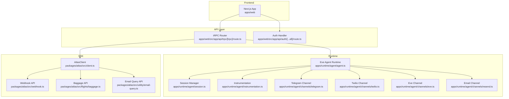
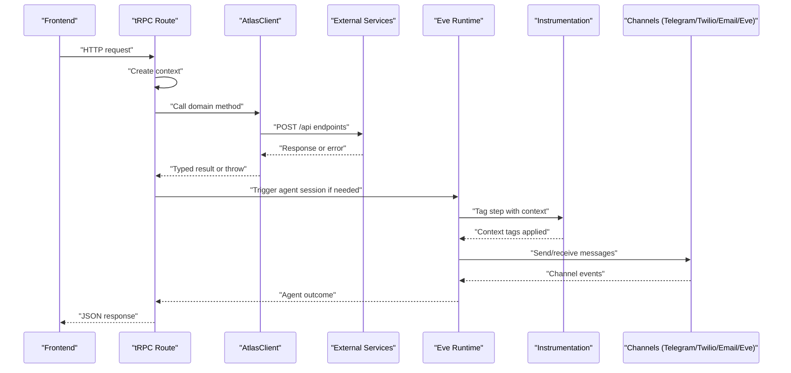
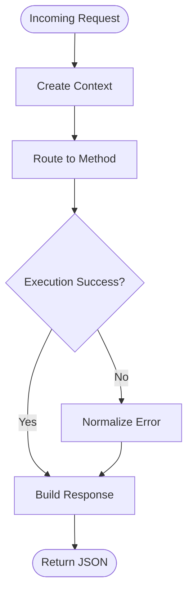
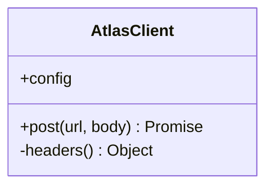
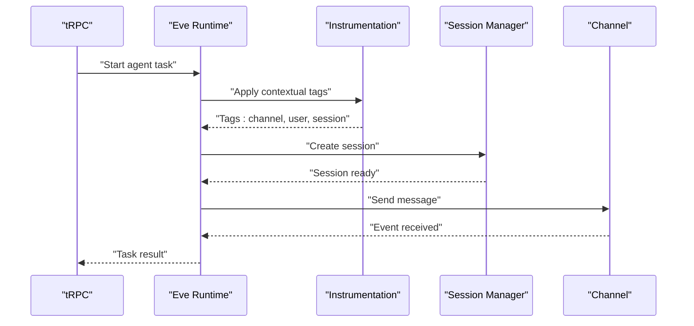
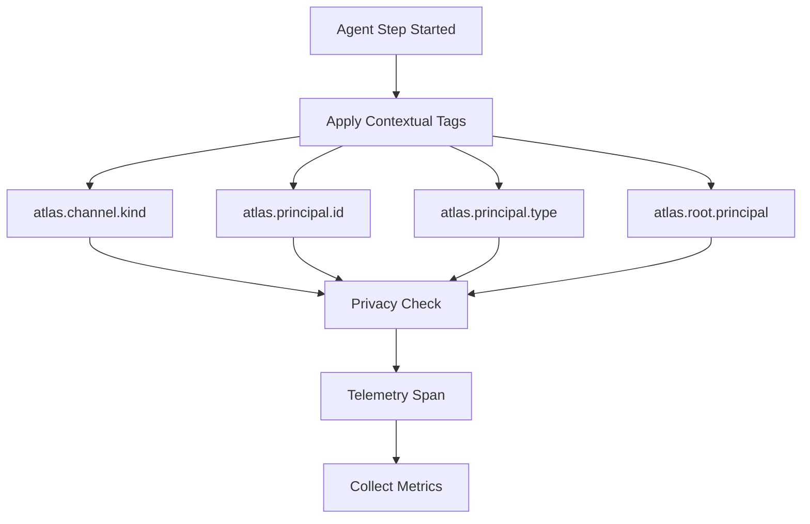
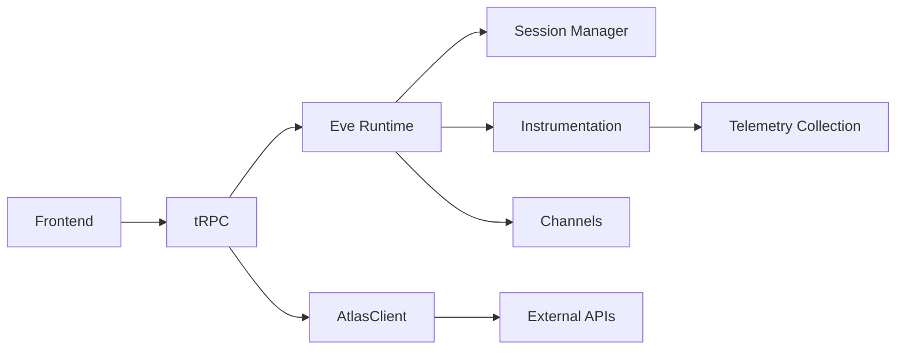
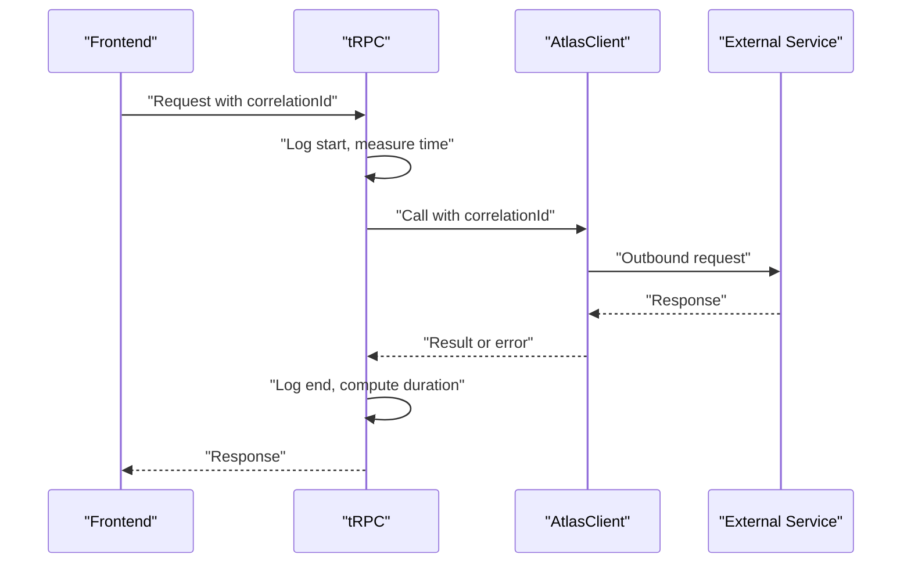
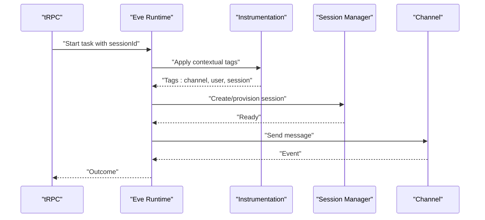

# Monitoring, Logging, and Observability

<cite>
**Referenced Files in This Document**
- [README.md](file://README.md)
- [route.ts (TRPC)](file://apps/web/src/app/api/trpc/[trpc]/route.ts)
- [route.ts (Auth)](file://apps/web/src/app/api/auth/[...all]/route.ts)
- [agent.ts](file://apps/runtime/agent/agent.ts)
- [session.ts](file://apps/runtime/agent/session.ts)
- [instrumentation.ts](file://apps/runtime/agent/instrumentation.ts)
- [telegram.ts](file://apps/runtime/agent/channels/telegram.ts)
- [twilio.ts](file://apps/runtime/agent/channels/twilio.ts)
- [eve.ts](file://apps/runtime/agent/channels/eve.ts)
- [resend.ts](file://apps/runtime/agent/channels/resend.ts)
- [client.ts](file://packages/atlas/src/client.ts)
- [webhook.ts](file://packages/atlas/src/webhook.ts)
- [baggage.ts](file://packages/atlas/src/flights/baggage.ts)
- [email-query.ts](file://packages/atlas/src/utility/email-query.ts)
</cite>

## Update Summary

**Changes Made**

- Added comprehensive instrumentation capabilities with detailed telemetry for debugging and monitoring
- Implemented contextual tags for channel type, user principal IDs, and session initiation details
- Configured privacy-preserving telemetry by excluding sensitive prompts and completions from spans
- Enhanced observability across all channels (Telegram, Twilio, Email, Eve) with consistent tagging
- Updated agent runtime configuration for model selection and session management

## Table of Contents

1. Introduction
2. Project Structure
3. Core Components
4. Architecture Overview
5. Detailed Component Analysis
6. Dependency Analysis
7. Performance Considerations
8. Troubleshooting Guide
9. Conclusion
10. Appendices

## Introduction

This document defines the monitoring, logging, and observability strategy for the Atlas application across its frontend (Next.js), backend API (tRPC), and AI agent runtime (Eve). It covers error tracking and reporting, structured logging patterns for API requests, AI agent operations, and user activities, as well as performance monitoring, metrics collection, alerting, distributed tracing, log aggregation, retention policies, dashboards, and incident response procedures. The guidance is grounded in the current codebase structure and integration points identified in the repository.

**Updated** Added comprehensive instrumentation capabilities with detailed telemetry for debugging and monitoring, including contextual tags for channel type, user principal IDs, and session initiation details while maintaining privacy by excluding sensitive prompts and completions from telemetry spans.

## Project Structure

Atlas is a monorepo with:

- apps/web: Next.js frontend exposing tRPC routes and auth endpoints.
- apps/runtime: AI agent runtime using Eve, with channels for Telegram, Twilio, Email, and Eve, and session management via Composio.
- packages/atlas: Client SDK that wraps external APIs (e.g., flights, email queries, webhooks).

**Diagram sources**

- [route.ts (TRPC):1-14](file://apps/web/src/app/api/trpc/[trpc]/route.ts#L1-L14)
- [route.ts (Auth):1-5](file://apps/web/src/app/api/auth/[...all]/route.ts#L1-L5)
- [agent.ts:1-35](file://apps/runtime/agent/agent.ts#L1-L35)
- [session.ts:1-19](file://apps/runtime/agent/session.ts#L1-L19)
- [instrumentation.ts:1-23](file://apps/runtime/agent/instrumentation.ts#L1-L23)
- [telegram.ts:1-6](file://apps/runtime/agent/channels/telegram.ts#L1-L6)
- [twilio.ts:1-7](file://apps/runtime/agent/channels/twilio.ts#L1-L7)
- [eve.ts:1-10](file://apps/runtime/agent/channels/eve.ts#L1-L10)
- [resend.ts:1-166](file://apps/runtime/agent/channels/resend.ts#L1-L166)
- [client.ts:1-40](file://packages/atlas/src/client.ts#L1-L40)
- [webhook.ts:1-65](file://packages/atlas/src/webhook.ts#L1-L65)
- [baggage.ts:1-14](file://packages/atlas/src/flights/baggage.ts#L1-L14)
- [email-query.ts:1-15](file://packages/atlas/src/utility/email-query.ts#L1-L15)

**Section sources**

- [README.md:1-107](file://README.md#L1-L107)

## Core Components

- tRPC endpoint: Central request entry point for typed API calls from the frontend to backend logic.
- Auth handler: Delegates authentication flows to Better-Auth.
- AtlasClient: HTTP client wrapper that sends authenticated requests to external services and surfaces errors.
- Webhook, Baggage, Email Query modules: Domain-specific clients built on AtlasClient.
- Eve agent runtime: Orchestrates AI agent sessions and integrates with toolkits via Composio; exposes channels for messaging.
- **New**: Comprehensive instrumentation system providing detailed telemetry with privacy-preserving context tags.

Key responsibilities:

- Request routing and context creation at the API layer.
- Structured error propagation from external APIs into application responses.
- Session lifecycle and toolkit provisioning in the runtime.
- Channel-based communication for inbound/outbound messages.
- **New**: Contextual telemetry collection with user attribution and channel identification while protecting sensitive data.

**Section sources**

- [route.ts (TRPC):1-14](file://apps/web/src/app/api/trpc/[trpc]/route.ts#L1-L14)
- [route.ts (Auth):1-5](file://apps/web/src/app/api/auth/[...all]/route.ts#L1-L5)
- [client.ts:1-40](file://packages/atlas/src/client.ts#L1-L40)
- [webhook.ts:1-65](file://packages/atlas/src/webhook.ts#L1-L65)
- [baggage.ts:1-14](file://packages/atlas/src/flights/baggage.ts#L1-L14)
- [email-query.ts:1-15](file://packages/atlas/src/utility/email-query.ts#L1-L15)
- [agent.ts:1-35](file://apps/runtime/agent/agent.ts#L1-L35)
- [session.ts:1-19](file://apps/runtime/agent/session.ts#L1-L19)
- [instrumentation.ts:1-23](file://apps/runtime/agent/instrumentation.ts#L1-L23)
- [telegram.ts:1-6](file://apps/runtime/agent/channels/telegram.ts#L1-L6)
- [twilio.ts:1-7](file://apps/runtime/agent/channels/twilio.ts#L1-L7)
- [eve.ts:1-10](file://apps/runtime/agent/channels/eve.ts#L1-L10)
- [resend.ts:1-166](file://apps/runtime/agent/channels/resend.ts#L1-L166)

## Architecture Overview

The request flow spans multiple layers with enhanced telemetry collection:

- Frontend invokes tRPC endpoints.
- tRPC creates context and executes business logic.
- Business logic may call AtlasClient to interact with external services or trigger AI agent sessions.
- The runtime manages sessions and communicates through channels with comprehensive instrumentation.
- **New**: All agent steps are tagged with contextual information for user attribution and channel identification while preserving privacy.

**Diagram sources**

- [route.ts (TRPC):1-14](file://apps/web/src/app/api/trpc/[trpc]/route.ts#L1-L14)
- [client.ts:1-40](file://packages/atlas/src/client.ts#L1-L40)
- [agent.ts:1-35](file://apps/runtime/agent/agent.ts#L1-L35)
- [instrumentation.ts:1-23](file://apps/runtime/agent/instrumentation.ts#L1-L23)
- [telegram.ts:1-6](file://apps/runtime/agent/channels/telegram.ts#L1-L6)
- [twilio.ts:1-7](file://apps/runtime/agent/channels/twilio.ts#L1-L7)
- [eve.ts:1-10](file://apps/runtime/agent/channels/eve.ts#L1-L10)
- [resend.ts:1-166](file://apps/runtime/agent/channels/resend.ts#L1-L166)

## Detailed Component Analysis

### tRPC Endpoint (Request Entry Point)

- Purpose: Exposes typed API methods to the frontend and builds request context.
- Observability hooks:
  - Log incoming requests with method, path, timestamp, and correlation ID.
  - Measure latency per request and tag by router/method.
  - Capture and correlate errors thrown by routers or downstream calls.
- Error handling:
  - Normalize errors to stable codes and messages suitable for frontend consumption.
  - Avoid leaking internal stack traces to clients.

**Diagram sources**

- [route.ts (TRPC):1-14](file://apps/web/src/app/api/trpc/[trpc]/route.ts#L1-L14)

**Section sources**

- [route.ts (TRPC):1-14](file://apps/web/src/app/api/trpc/[trpc]/route.ts#L1-L14)

### Auth Handler

- Purpose: Proxies authentication requests to Better-Auth.
- Observability hooks:
  - Log auth events (login attempts, failures, token issuance).
  - Track failed attempts and suspicious activity.
  - Correlate auth events with user IDs and IPs where appropriate.

**Section sources**

- [route.ts (Auth):1-5](file://apps/web/src/app/api/auth/[...all]/route.ts#L1-L5)

### AtlasClient (HTTP Wrapper)

- Purpose: Encapsulates outbound HTTP calls with headers and error handling.
- Observability hooks:
  - Add correlation IDs to outgoing requests for cross-service tracing.
  - Record request/response metadata (method, URL, status, duration).
  - Convert non-OK responses into typed errors with stable codes.
- Error handling:
  - Throw consistent errors with status and payload for upstream consumers.

**Diagram sources**

- [client.ts:1-40](file://packages/atlas/src/client.ts#L1-L40)

**Section sources**

- [client.ts:1-40](file://packages/atlas/src/client.ts#L1-L40)

### Webhook, Baggage, Email Query Clients

- Purpose: Domain-specific wrappers over AtlasClient for external integrations.
- Observability hooks:
  - Tag logs with domain names (webhook, baggage, email).
  - Include request payloads (sanitized) and response shapes for debugging.
  - Surface stable error codes and messages to callers.

**Section sources**

- [webhook.ts:1-65](file://packages/atlas/src/webhook.ts#L1-L65)
- [baggage.ts:1-14](file://packages/atlas/src/flights/baggage.ts#L1-L14)
- [email-query.ts:1-15](file://packages/atlas/src/utility/email-query.ts#L1-L15)

### Eve Agent Runtime and Channels

- Purpose: Runs AI agents, manages sessions, and integrates with toolkits and messaging channels.
- Observability hooks:
  - Log session creation, toolkit provisioning, and channel events.
  - Emit metrics for model usage, token counts, and latency.
  - Correlate agent actions with user sessions and request IDs.
- Channels:
  - Telegram, Twilio, Email, and Eve channels send/receive messages; log inbound/outbound events and errors.
- **New**: Comprehensive instrumentation with privacy-preserving telemetry collection.

**Diagram sources**

- [agent.ts:1-35](file://apps/runtime/agent/agent.ts#L1-L35)
- [session.ts:1-19](file://apps/runtime/agent/session.ts#L1-L19)
- [instrumentation.ts:1-23](file://apps/runtime/agent/instrumentation.ts#L1-L23)
- [telegram.ts:1-6](file://apps/runtime/agent/channels/telegram.ts#L1-L6)
- [twilio.ts:1-7](file://apps/runtime/agent/channels/twilio.ts#L1-L7)
- [eve.ts:1-10](file://apps/runtime/agent/channels/eve.ts#L1-L10)
- [resend.ts:1-166](file://apps/runtime/agent/channels/resend.ts#L1-L166)

**Section sources**

- [agent.ts:1-35](file://apps/runtime/agent/agent.ts#L1-L35)
- [session.ts:1-19](file://apps/runtime/agent/session.ts#L1-L19)
- [instrumentation.ts:1-23](file://apps/runtime/agent/instrumentation.ts#L1-L23)
- [telegram.ts:1-6](file://apps/runtime/agent/channels/telegram.ts#L1-L6)
- [twilio.ts:1-7](file://apps/runtime/agent/channels/twilio.ts#L1-L7)
- [eve.ts:1-10](file://apps/runtime/agent/channels/eve.ts#L1-L10)
- [resend.ts:1-166](file://apps/runtime/agent/channels/resend.ts#L1-L166)

### Comprehensive Instrumentation System

- **New Feature**: Advanced telemetry collection with privacy-preserving design.
- Purpose: Provides detailed debugging and monitoring capabilities while protecting sensitive user data.
- Key features:
  - Contextual tagging of all agent steps with channel type, user principal IDs, and session initiation details.
  - Privacy protection by disabling recording of prompts and completions in telemetry spans.
  - Consistent attribution across all channels (Telegram, Twilio, Email, Eve).
  - Support for both authenticated users (Better Auth) and anonymous channels.

**Diagram sources**

- [instrumentation.ts:1-23](file://apps/runtime/agent/instrumentation.ts#L1-L23)

**Section sources**

- [instrumentation.ts:1-23](file://apps/runtime/agent/instrumentation.ts#L1-L23)

## Dependency Analysis

- Frontend depends on tRPC endpoints for data access and authentication.
- tRPC depends on shared API package and may invoke AtlasClient for external services.
- AtlasClient depends on environment configuration and network connectivity.
- Runtime depends on Eve framework and external toolkits via Composio; channels depend on provider credentials.
- **New**: Instrumentation system depends on Eve's instrumentation framework and provides consistent telemetry across all channels.

**Diagram sources**

- [route.ts (TRPC):1-14](file://apps/web/src/app/api/trpc/[trpc]/route.ts#L1-L14)
- [client.ts:1-40](file://packages/atlas/src/client.ts#L1-L40)
- [agent.ts:1-35](file://apps/runtime/agent/agent.ts#L1-L35)
- [session.ts:1-19](file://apps/runtime/agent/session.ts#L1-L19)
- [instrumentation.ts:1-23](file://apps/runtime/agent/instrumentation.ts#L1-L23)
- [telegram.ts:1-6](file://apps/runtime/agent/channels/telegram.ts#L1-L6)
- [twilio.ts:1-7](file://apps/runtime/agent/channels/twilio.ts#L1-L7)
- [eve.ts:1-10](file://apps/runtime/agent/channels/eve.ts#L1-L10)
- [resend.ts:1-166](file://apps/runtime/agent/channels/resend.ts#L1-L166)

**Section sources**

- [README.md:1-107](file://README.md#L1-L107)

## Performance Considerations

- Request latency:
  - Instrument tRPC handlers to measure end-to-end latency and breakdown per step.
  - Use histograms for P50/P95/P99 latencies and track regressions.
- External calls:
  - Time AtlasClient requests and set timeouts; record failure rates and retry counts.
  - Cache frequently accessed data where possible to reduce load.
- AI agent operations:
  - Track model invocation latency, token usage, and queue wait times.
  - Monitor channel throughput and message delivery success rates.
  - **New**: Leverage comprehensive instrumentation to monitor agent performance with minimal overhead.
- Database and ORM:
  - If used, add query-level metrics and slow query detection.
- Resource utilization:
  - Monitor CPU/memory usage and scale horizontally under load.
- **New**: Privacy-preserving telemetry ensures performance monitoring without compromising user data security.

## Troubleshooting Guide

- Distributed tracing:
  - Propagate correlation IDs from frontend through tRPC, AtlasClient, and runtime to external services and channels.
  - Use trace IDs to join logs across services and identify bottlenecks.
  - **New**: Utilize contextual tags to trace requests across different channels and user contexts.
- Error tracking:
  - Centralize error normalization at AtlasClient and tRPC boundaries.
  - Capture stack traces server-side only; expose stable codes to clients.
- Log aggregation:
  - Ship structured logs (JSON) to a centralized system.
  - Include fields: timestamp, level, service, correlationId, userId, method, path, statusCode, durationMs, errorMessage, errorCode.
  - **New**: Include instrumentation tags for channel type, user attribution, and session context.
- Retention policies:
  - Define tiered retention: hot (short-term) for recent high-volume logs; warm/cool (longer-term) for compliance and audits.
  - Apply sampling for high-cardinality debug logs in production.
- Dashboards:
  - Build SLOs around latency, error rate, and availability.
  - Visualize request volumes, error breakdowns, and channel health.
  - **New**: Create dashboards showing agent performance by channel and user segment.
- Incident response:
  - Alert on SLO breaches and critical error spikes.
  - Provide runbooks linking to relevant logs and traces for rapid triage.
  - **New**: Use contextual telemetry to quickly identify affected users and channels during incidents.

## Conclusion

Atlas's observability should be implemented consistently across the frontend, API, and runtime. By instrumenting request flows, standardizing structured logs, propagating correlation IDs, and building dashboards and alerts around key SLOs, teams can quickly detect and resolve issues. The current architecture provides clear integration points for adding these capabilities without disrupting existing functionality.

**Updated** The addition of comprehensive instrumentation capabilities significantly enhances debugging and monitoring capabilities while maintaining strict privacy protections. The system now provides detailed telemetry with contextual tags for channel type, user principal IDs, and session initiation details, enabling precise troubleshooting and performance analysis without exposing sensitive user data.

## Appendices

### Structured Logging Schema

Recommended fields for all services:

- timestamp: ISO 8601
- level: info|warn|error|debug
- service: web|runtime|sdk
- correlationId: unique per request
- userId: when available
- method: HTTP method or action name
- path: endpoint or operation
- statusCode: numeric status
- durationMs: total time
- errorMessage: normalized message
- errorCode: stable code
- tags: feature flags or domains (e.g., webhook, baggage, email)
- **New**: atlas.channel.kind: channel type identifier
- **New**: atlas.principal.id: user principal ID for attribution
- **New**: atlas.principal.type: principal type classification
- **New**: atlas.root.principal: root session initiator ID

### Metrics and Alerts

- Latency: p50/p95/p99 per endpoint and per external call.
- Errors: error rate by service and error code.
- Throughput: requests/sec, messages/sec per channel.
- AI usage: tokens/sec, model latency, session duration.
- **New**: Agent step metrics with contextual breakdown by channel and user.
- Alerts:
  - Error rate > threshold for 5 minutes.
  - Latency p95 > target for 10 minutes.
  - Channel delivery failures spike.
  - **New**: Anomalous agent behavior patterns detected through telemetry analysis.

### Example Flows

#### API Request Flow with Observability

**Diagram sources**

- [route.ts (TRPC):1-14](file://apps/web/src/app/api/trpc/[trpc]/route.ts#L1-L14)
- [client.ts:1-40](file://packages/atlas/src/client.ts#L1-L40)

#### AI Agent Session Flow with Instrumentation

**Diagram sources**

- [agent.ts:1-35](file://apps/runtime/agent/agent.ts#L1-L35)
- [session.ts:1-19](file://apps/runtime/agent/session.ts#L1-L19)
- [instrumentation.ts:1-23](file://apps/runtime/agent/instrumentation.ts#L1-L23)
- [telegram.ts:1-6](file://apps/runtime/agent/channels/telegram.ts#L1-L6)
- [twilio.ts:1-7](file://apps/runtime/agent/channels/twilio.ts#L1-L7)
- [eve.ts:1-10](file://apps/runtime/agent/channels/eve.ts#L1-L10)
- [resend.ts:1-166](file://apps/runtime/agent/channels/resend.ts#L1-L166)

### Privacy-Preserving Telemetry Configuration

The instrumentation system is configured to protect sensitive user data while providing comprehensive monitoring capabilities:

- **Disabled Data Recording**: Both `recordInputs` and `recordOutputs` are set to false to prevent capturing prompts and completions.
- **Contextual Attribution**: Only non-sensitive contextual information is collected, including channel types, user principal IDs, and session initiation details.
- **Privacy Boundaries**: The system maintains clear boundaries between operational telemetry and sensitive user data.

**Section sources**

- [instrumentation.ts:18-22](file://apps/runtime/agent/instrumentation.ts#L18-L22)
