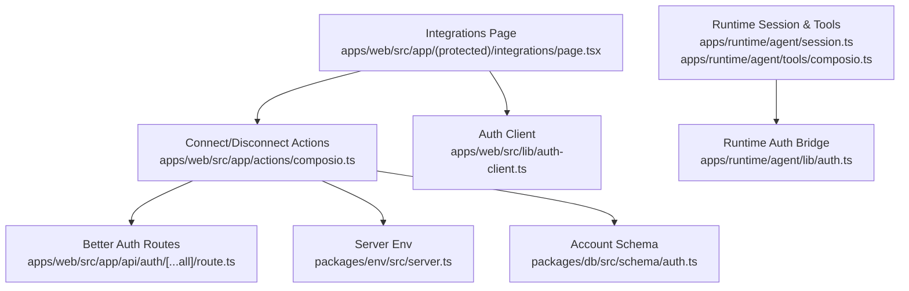
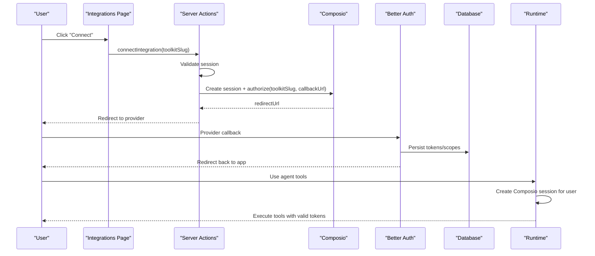
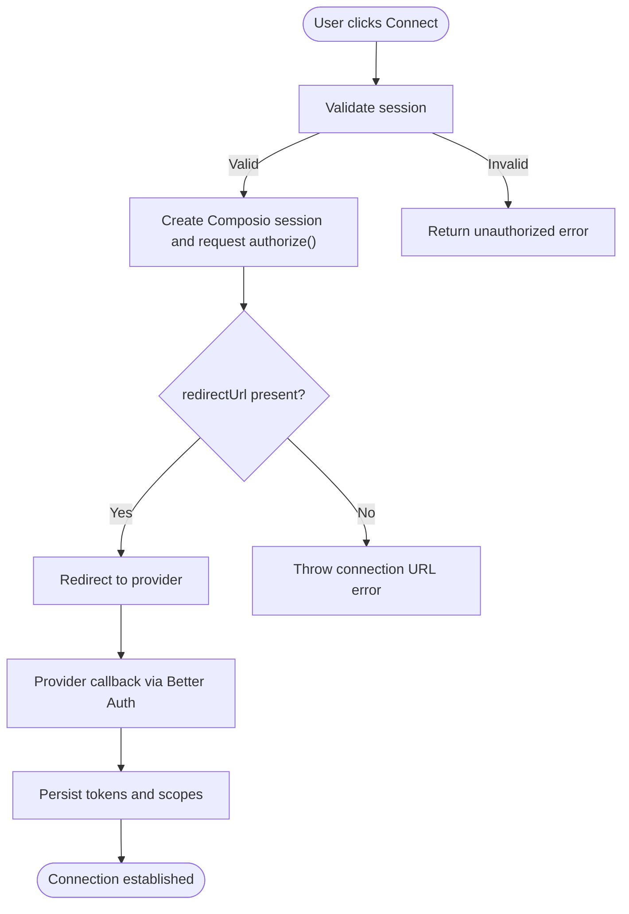
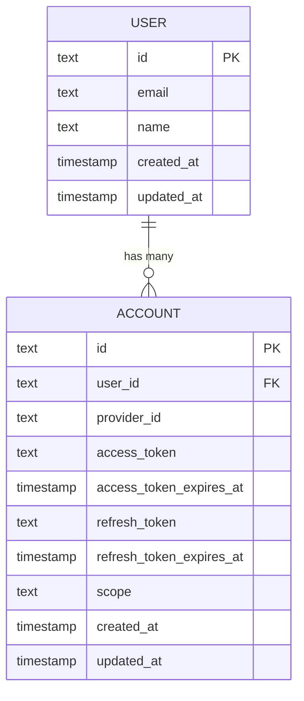
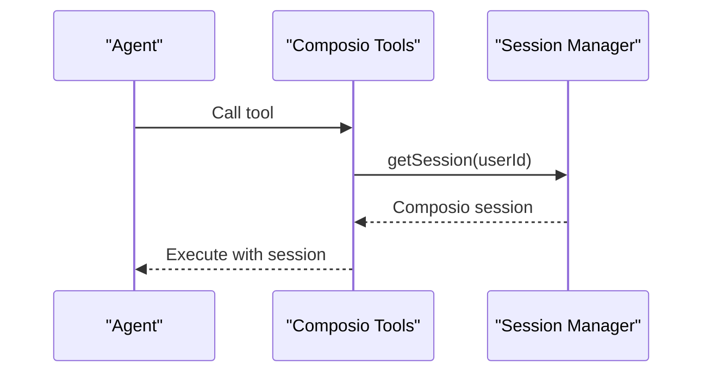
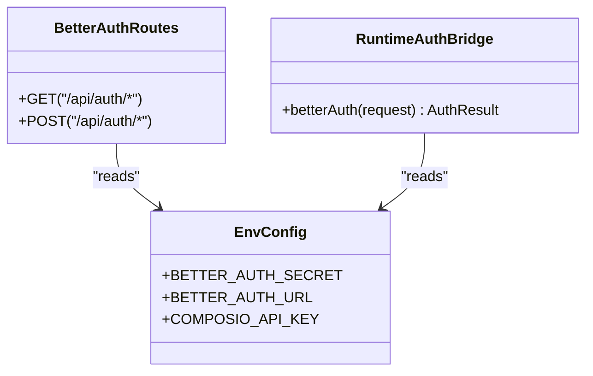
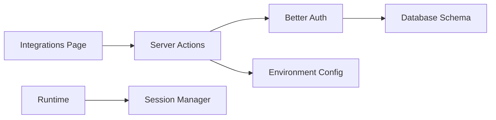

# Authentication Flows

<cite>
**Referenced Files in This Document**
- [composio.ts](file://apps/web/src/app/actions/composio.ts)
- [integrations/page.tsx](file://apps/web/src/app/(protected)/integrations/page.tsx)
- [route.ts](file://apps/web/src/app/api/auth/[...all]/route.ts)
- [auth-client.ts](file://apps/web/src/lib/auth-client.ts)
- [auth.ts](file://packages/db/src/schema/auth.ts)
- [server.ts](file://packages/env/src/server.ts)
- [web.ts](file://packages/env/src/web.ts)
- [session.ts](file://apps/runtime/agent/session.ts)
- [composio-tools.ts](file://apps/runtime/agent/tools/composio.ts)
- [runtime-auth.ts](file://apps/runtime/agent/lib/auth.ts)
- [errors.md](file://.agents/skills/composio/references/errors.md)
</cite>

## Table of Contents

1. Introduction
2. Project Structure
3. Core Components
4. Architecture Overview
5. Detailed Component Analysis
6. Dependency Analysis
7. Performance Considerations
8. Troubleshooting Guide
9. Conclusion
10. Appendices

## Introduction

This document explains the OAuth-based authentication flows for external integrations in this project, focusing on how users connect third-party services (via Composio), how tokens are managed and refreshed, and how errors are handled across the lifecycle. It covers initiating OAuth flows from the UI, server-side action handlers, session bridging into the runtime, token storage schema, and strategies for debugging and testing.

## Project Structure

The OAuth integration spans several layers:

- Web UI initiates connections and displays connected integrations.
- Server actions validate sessions and start OAuth authorization via Composio.
- Better Auth routes handle user sessions and provider OAuth callbacks.
- Runtime bridges authenticated sessions to tool execution with scoped toolkits.
- Database schema defines where tokens and scopes are stored.
- Environment configuration provides required secrets and URLs.

**Diagram sources**

- [integrations/page.tsx:74-151](<file://apps/web/src/app/(protected)/integrations/page.tsx#L74-L151>)
- [composio.ts:13-85](file://apps/web/src/app/actions/composio.ts#L13-L85)
- [route.ts:1-5](file://apps/web/src/app/api/auth/[...all]/route.ts#L1-L5)
- [auth-client.ts:1-7](file://apps/web/src/lib/auth-client.ts#L1-L7)
- [auth.ts:41-64](file://packages/db/src/schema/auth.ts#L41-L64)
- [server.ts:5-28](file://packages/env/src/server.ts#L5-L28)
- [session.ts:1-19](file://apps/runtime/agent/session.ts#L1-L19)
- [composio-tools.ts:1-12](file://apps/runtime/agent/tools/composio.ts#L1-L12)
- [runtime-auth.ts:1-26](file://apps/runtime/agent/lib/auth.ts#L1-L26)

**Section sources**

- [integrations/page.tsx:74-151](<file://apps/web/src/app/(protected)/integrations/page.tsx#L74-L151>)
- [composio.ts:13-85](file://apps/web/src/app/actions/composio.ts#L13-L85)
- [route.ts:1-5](file://apps/web/src/app/api/auth/[...all]/route.ts#L1-L5)
- [auth-client.ts:1-7](file://apps/web/src/lib/auth-client.ts#L1-L7)
- [auth.ts:41-64](file://packages/db/src/schema/auth.ts#L41-L64)
- [server.ts:5-28](file://packages/env/src/server.ts#L5-L28)
- [session.ts:1-19](file://apps/runtime/agent/session.ts#L1-L19)
- [composio-tools.ts:1-12](file://apps/runtime/agent/tools/composio.ts#L1-L12)
- [runtime-auth.ts:1-26](file://apps/runtime/agent/lib/auth.ts#L1-L26)

## Core Components

- Integrations page: Lists available integrations, shows connection status, and triggers connect/disconnect actions.
- Server actions: Validate user session, create a Composio session, initiate OAuth authorization, redirect to provider, and manage disconnections.
- Better Auth routes: Expose standard auth endpoints for session management and provider OAuth callbacks.
- Runtime session bridge: Creates a Composio session bound to the current user and exposes toolkits for agent tools.
- Token storage schema: Defines fields for access tokens, refresh tokens, expiration times, and scopes per account.
- Environment config: Provides API keys, OAuth client credentials, and base URLs used by both web and runtime.

**Section sources**

- [integrations/page.tsx:74-151](<file://apps/web/src/app/(protected)/integrations/page.tsx#L74-L151>)
- [composio.ts:13-85](file://apps/web/src/app/actions/composio.ts#L13-L85)
- [route.ts:1-5](file://apps/web/src/app/api/auth/[...all]/route.ts#L1-L5)
- [session.ts:1-19](file://apps/runtime/agent/session.ts#L1-L19)
- [auth.ts:41-64](file://packages/db/src/schema/auth.ts#L41-L64)
- [server.ts:5-28](file://packages/env/src/server.ts#L5-L28)

## Architecture Overview

The OAuth flow is orchestrated as follows:

- User clicks Connect on an integration card.
- The server action validates the session and calls Composio to generate an authorization URL.
- The browser redirects to the provider’s consent screen.
- After consent, the provider redirects back; Better Auth handles the callback and persists tokens according to its adapter and schema.
- The runtime creates a Composio session using the authenticated user context and exposes toolkits for agent operations.

**Diagram sources**

- [composio.ts:13-33](file://apps/web/src/app/actions/composio.ts#L13-L33)
- [route.ts:1-5](file://apps/web/src/app/api/auth/[...all]/route.ts#L1-L5)
- [auth.ts:41-64](file://packages/db/src/schema/auth.ts#L41-L64)
- [session.ts:1-19](file://apps/runtime/agent/session.ts#L1-L19)

## Detailed Component Analysis

### OAuth Initiation and Callback Handling

- The Integrations Page renders cards for each supported integration and calls server actions to connect or disconnect.
- The server action validates the current session, creates a Composio session, and requests an authorization URL for the selected toolkit. If successful, it redirects the user to the provider.
- Better Auth routes expose standard endpoints that handle provider callbacks and persist tokens and scopes.

**Diagram sources**

- [composio.ts:13-33](file://apps/web/src/app/actions/composio.ts#L13-L33)
- [route.ts:1-5](file://apps/web/src/app/api/auth/[...all]/route.ts#L1-L5)
- [auth.ts:41-64](file://packages/db/src/schema/auth.ts#L41-L64)

**Section sources**

- [integrations/page.tsx:74-151](<file://apps/web/src/app/(protected)/integrations/page.tsx#L74-L151>)
- [composio.ts:13-33](file://apps/web/src/app/actions/composio.ts#L13-L33)
- [route.ts:1-5](file://apps/web/src/app/api/auth/[...all]/route.ts#L1-L5)

### Token Storage and Refresh Strategy

- Tokens and scopes are stored in the database schema under the account table, including access tokens, refresh tokens, and their expiration timestamps.
- The application relies on Better Auth’s adapter to persist tokens during OAuth callbacks. When tokens expire, the provider may require reauthorization; the system should detect expired tokens and prompt reconnect.

**Diagram sources**

- [auth.ts:4-19](file://packages/db/src/schema/auth.ts#L4-L19)
- [auth.ts:41-64](file://packages/db/src/schema/auth.ts#L41-L64)

**Section sources**

- [auth.ts:41-64](file://packages/db/src/schema/auth.ts#L41-L64)

### Runtime Integration and Tool Execution

- The runtime creates a Composio session for the authenticated user and exposes a curated set of toolkits.
- Tools are defined via a factory that binds the current session to the user context, ensuring only authorized users can execute tools.

**Diagram sources**

- [composio-tools.ts:1-12](file://apps/runtime/agent/tools/composio.ts#L1-L12)
- [session.ts:1-19](file://apps/runtime/agent/session.ts#L1-L19)

**Section sources**

- [composio-tools.ts:1-12](file://apps/runtime/agent/tools/composio.ts#L1-L12)
- [session.ts:1-19](file://apps/runtime/agent/session.ts#L1-L19)

### Security and Session Management

- Better Auth routes are exposed through Next.js handlers to manage sessions and provider OAuth callbacks.
- The runtime authenticates requests by validating sessions and mapping them to principal identifiers for tool execution.
- Environment variables provide secure configuration for secrets and URLs.

**Diagram sources**

- [route.ts:1-5](file://apps/web/src/app/api/auth/[...all]/route.ts#L1-L5)
- [runtime-auth.ts:1-26](file://apps/runtime/agent/lib/auth.ts#L1-L26)
- [server.ts:5-28](file://packages/env/src/server.ts#L5-L28)

**Section sources**

- [route.ts:1-5](file://apps/web/src/app/api/auth/[...all]/route.ts#L1-L5)
- [runtime-auth.ts:1-26](file://apps/runtime/agent/lib/auth.ts#L1-L26)
- [server.ts:5-28](file://packages/env/src/server.ts#L5-L28)

## Dependency Analysis

- The Integrations Page depends on server actions for connection state and operations.
- Server actions depend on Better Auth for session validation and on environment configuration for API keys and URLs.
- The runtime depends on the session manager to create a Composio session with specific toolkits.
- Token persistence depends on the database schema and Better Auth’s adapter behavior.

**Diagram sources**

- [integrations/page.tsx:74-151](<file://apps/web/src/app/(protected)/integrations/page.tsx#L74-L151>)
- [composio.ts:13-85](file://apps/web/src/app/actions/composio.ts#L13-L85)
- [route.ts:1-5](file://apps/web/src/app/api/auth/[...all]/route.ts#L1-L5)
- [server.ts:5-28](file://packages/env/src/server.ts#L5-L28)
- [session.ts:1-19](file://apps/runtime/agent/session.ts#L1-L19)
- [auth.ts:41-64](file://packages/db/src/schema/auth.ts#L41-L64)

**Section sources**

- [integrations/page.tsx:74-151](<file://apps/web/src/app/(protected)/integrations/page.tsx#L74-L151>)
- [composio.ts:13-85](file://apps/web/src/app/actions/composio.ts#L13-L85)
- [route.ts:1-5](file://apps/web/src/app/api/auth/[...all]/route.ts#L1-L5)
- [server.ts:5-28](file://packages/env/src/server.ts#L5-L28)
- [session.ts:1-19](file://apps/runtime/agent/session.ts#L1-L19)
- [auth.ts:41-64](file://packages/db/src/schema/auth.ts#L41-L64)

## Performance Considerations

- Avoid unnecessary re-fetches of connected integrations by leveraging query caching and invalidation after connect/disconnect actions.
- Keep server actions minimal and focused on session validation and redirection to reduce overhead.
- Prefer listing and filtering accounts on the server side to minimize payload size.

[No sources needed since this section provides general guidance]

## Troubleshooting Guide

Common issues and recovery steps:

- Provider returns 401 after reaching the provider: Indicates revoked, expired, or invalidated tokens. Reconnect the integration by generating a fresh authorization link and retrying safe calls.
- For You client authentication failures: Verify consumer endpoint, OAuth session, and header paths; do not substitute platform keys.
- Provider constraints: Google apps blocked due to excessive scopes; enable required APIs; Slack rate limits; Microsoft tenant admin consent; GitHub App separate installation steps.

Recommended debugging steps:

- Confirm environment variables are correctly set for secrets and URLs.
- Ensure the callback URL matches the configured value.
- Check database records for tokens and scopes after callbacks.
- Validate session existence before initiating OAuth flows.

**Section sources**

- [errors.md:33-54](file://.agents/skills/composio/references/errors.md#L33-L54)
- [server.ts:5-28](file://packages/env/src/server.ts#L5-L28)
- [composio.ts:13-33](file://apps/web/src/app/actions/composio.ts#L13-L33)

## Conclusion

This project implements a robust OAuth-based integration flow using Better Auth for session management and Composio for provider authorization. Tokens and scopes are persisted securely in the database, and the runtime bridges authenticated sessions to tool execution. Proper error handling, environment configuration, and debugging practices ensure reliable operation across different providers and scenarios.

[No sources needed since this section summarizes without analyzing specific files]

## Appendices

### Implementing a New OAuth Integration

- Add the new integration to the UI list and map its slug to the corresponding toolkit.
- Update the server action to include the new toolkit slug when authorizing.
- Ensure environment variables and provider credentials are configured.
- Test the full flow: connect, callback, token persistence, and runtime tool usage.

**Section sources**

- [integrations/page.tsx:36-72](<file://apps/web/src/app/(protected)/integrations/page.tsx#L36-L72>)
- [composio.ts:13-33](file://apps/web/src/app/actions/composio.ts#L13-L33)
- [server.ts:5-28](file://packages/env/src/server.ts#L5-L28)

### Configuring Client Credentials and Scopes

- Set provider-specific client IDs and secrets in environment configuration.
- Configure scopes based on required permissions; adjust if provider constraints block access.
- Validate callback URLs match the configured values.

**Section sources**

- [server.ts:5-28](file://packages/env/src/server.ts#L5-L28)
- [auth.ts:41-64](file://packages/db/src/schema/auth.ts#L41-L64)

### Testing Strategies for OAuth Flows

- Use development environments to simulate provider callbacks and verify token persistence.
- Exercise disconnect flows to ensure cleanup of active or initiated accounts.
- Validate runtime tool execution with the created session to confirm end-to-end functionality.

**Section sources**

- [composio.ts:35-85](file://apps/web/src/app/actions/composio.ts#L35-L85)
- [session.ts:1-19](file://apps/runtime/agent/session.ts#L1-L19)
