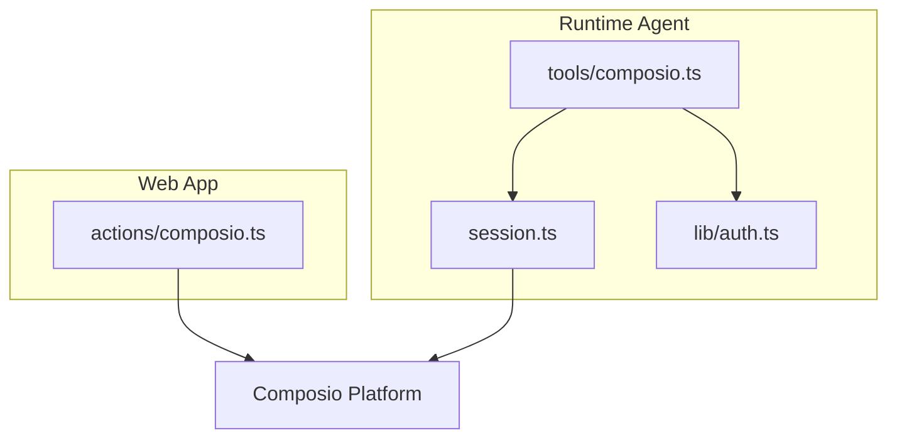
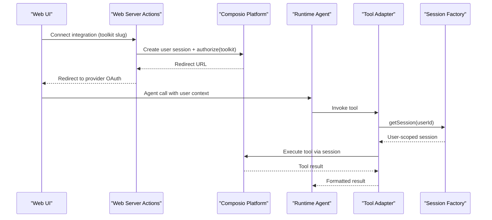
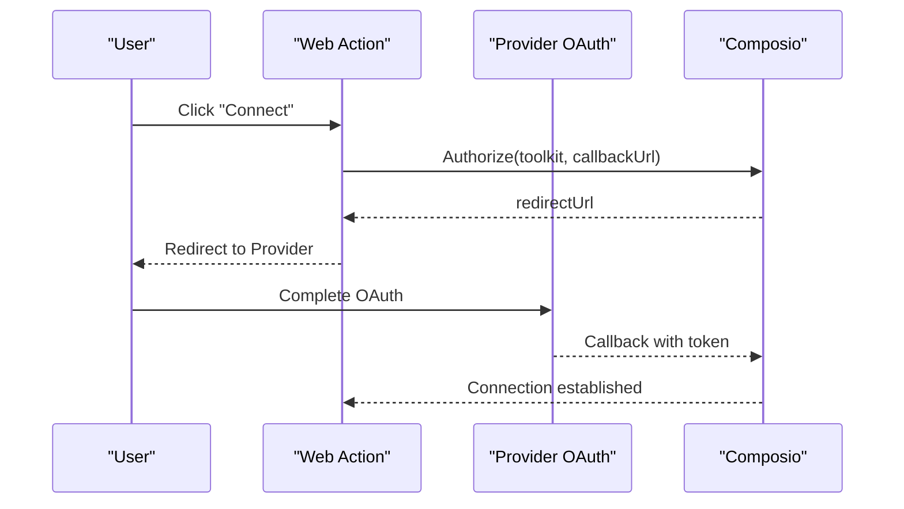
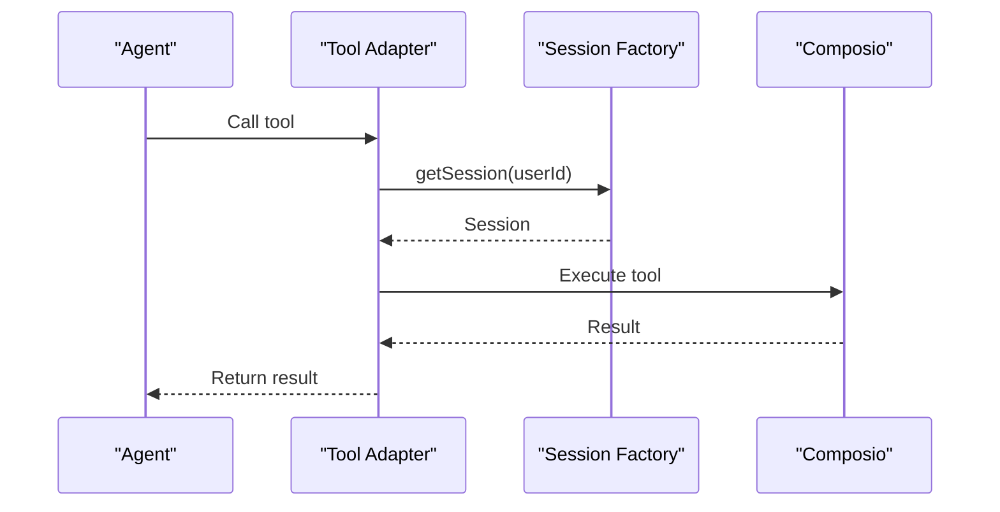
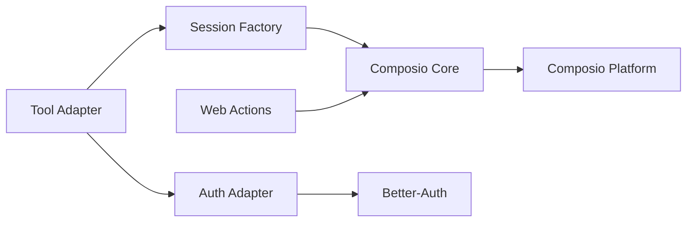

# Composio Integration Framework

<cite>
**Referenced Files in This Document**
- [composio.ts](file://apps/runtime/agent/tools/composio.ts)
- [session.ts](file://apps/runtime/agent/session.ts)
- [auth.ts](file://apps/runtime/agent/lib/auth.ts)
- [composio.ts](file://apps/web/src/app/actions/composio.ts)
- [SKILL.md](file://.agents/skills/composio/SKILL.md)
- [platform.md](file://.agents/skills/composio/references/platform.md)
- [errors.md](file://.agents/skills/composio/references/errors.md)
</cite>

## Table of Contents

1. Introduction
2. Project Structure
3. Core Components
4. Architecture Overview
5. Detailed Component Analysis
6. Dependency Analysis
7. Performance Considerations
8. Troubleshooting Guide
9. Conclusion
10. Appendices

## Introduction

This document explains the Composio integration framework used to connect AI agents to third-party services within this repository. It focuses on:

- The defineComposioTools function and how it wires user sessions into tool execution
- Session management for per-user context and credentials
- Dynamic generation of tools from external service capabilities via Composio sessions
- Tool registration, parameter validation, and response formatting patterns
- Security model for handling user sessions and service credentials
- Guidance for extending with custom integrations and troubleshooting common issues

The runtime agent uses the Eve framework and exposes tools through a Composio session bound to an authenticated application user. The web app provides server actions to initiate and manage user connections to external services using the Composio SDK.

## Project Structure

The integration spans two main areas:

- Runtime agent tools that expose dynamic tools to the AI agent
- Web server actions that handle user connection flows and list/disconnect integrations

**Diagram sources**

- [composio.ts:1-12](file://apps/runtime/agent/tools/composio.ts#L1-L12)
- [session.ts:1-19](file://apps/runtime/agent/session.ts#L1-L19)
- [auth.ts:1-26](file://apps/runtime/agent/lib/auth.ts#L1-L26)
- [composio.ts:1-85](file://apps/web/src/app/actions/composio.ts#L1-L85)

**Section sources**

- [composio.ts:1-12](file://apps/runtime/agent/tools/composio.ts#L1-L12)
- [session.ts:1-19](file://apps/runtime/agent/session.ts#L1-L19)
- [auth.ts:1-26](file://apps/runtime/agent/lib/auth.ts#L1-L26)
- [composio.ts:1-85](file://apps/web/src/app/actions/composio.ts#L1-L85)

## Core Components

- defineComposioTools adapter: Bridges the agent’s runtime context (including the authenticated user) into a Composio session so tools can be executed on behalf of that user.
- Session factory: Creates a user-scoped Composio session with a curated set of toolkits enabled.
- Web server actions: Manage OAuth-based connections to external services and query connected accounts for the current user.
- Auth adapter: Extracts the application’s authenticated user identity and maps it into the agent’s principal identity.

Key responsibilities:

- User identity resolution and scoping
- Per-user session creation and toolkit configuration
- Connection lifecycle (authorize, disconnect, list)
- Secure credential handling via environment variables

**Section sources**

- [composio.ts:1-12](file://apps/runtime/agent/tools/composio.ts#L1-L12)
- [session.ts:1-19](file://apps/runtime/agent/session.ts#L1-L19)
- [auth.ts:1-26](file://apps/runtime/agent/lib/auth.ts#L1-L26)
- [composio.ts:1-85](file://apps/web/src/app/actions/composio.ts#L1-L85)

## Architecture Overview

At runtime, the agent receives a request with an authenticated user context. The tool adapter extracts the user ID and creates a Composio session scoped to that user. Tools are dynamically generated by the session based on enabled toolkits. In the web layer, users authorize external services via a redirect flow managed by the Composio SDK.

**Diagram sources**

- [composio.ts:13-33](file://apps/web/src/app/actions/composio.ts#L13-L33)
- [composio.ts:5-11](file://apps/runtime/agent/tools/composio.ts#L5-L11)
- [session.ts:6-18](file://apps/runtime/agent/session.ts#L6-L18)

## Detailed Component Analysis

### Tool Adapter: defineComposioTools

Purpose:

- Wraps the agent’s runtime context to extract the authenticated user ID
- Validates presence of user identity before creating a session
- Returns a user-scoped Composio session for tool execution

Behavior:

- Reads the principal ID from the session context
- Throws if no user is present
- Delegates session creation to a centralized factory

Security:

- Enforces user identity at the boundary between agent and tools
- Prevents unauthenticated tool execution

Parameter validation:

- Fails fast when required user identity is missing

Response formatting:

- Delegates to the underlying session/tool execution; results are returned as-is to the agent

**Section sources**

- [composio.ts:1-12](file://apps/runtime/agent/tools/composio.ts#L1-L12)

### Session Factory: getSession

Purpose:

- Creates a Composio session for a given user ID
- Enables a predefined set of toolkits for the session

Toolkit scope:

- Calendar, email, messaging, search, notes, spreadsheets, maps, and chat integrations are enabled

Extensibility:

- Add or remove toolkits by editing the toolkit list

Performance:

- Session creation is per-request; consider caching strategies if appropriate for your agent architecture

**Section sources**

- [session.ts:1-19](file://apps/runtime/agent/session.ts#L1-L19)

### Web Server Actions: Connection Management

Functions:

- connectIntegration: Initiates OAuth authorization for a specified toolkit and redirects the user
- disconnectIntegration: Lists and removes active or initiated connections for the current user
- getConnectedIntegrations: Lists currently connected toolkits for the current user

Security:

- Requires an authenticated session before any operation
- Uses server-side environment variables for API keys
- Avoids exposing sensitive data in responses

Flow highlights:

- Creates a user-scoped session via the SDK
- Requests authorization with a callback URL
- Handles redirect to the provider’s OAuth page
- Filters and lists only active or initiated connections

**Section sources**

- [composio.ts:1-85](file://apps/web/src/app/actions/composio.ts#L1-L85)

### Authentication Adapter: betterAuth

Purpose:

- Maps the application’s authenticated session into the agent’s principal identity
- Provides attributes such as email, name, and optional picture

Identity mapping:

- Principal ID is derived from the application’s user record
- Authenticator and issuer metadata are included for tracing

Error handling:

- Returns null when no session is found, preventing unauthorized access

**Section sources**

- [auth.ts:1-26](file://apps/runtime/agent/lib/auth.ts#L1-L26)

### Tool Registration and Dynamic Generation

How tools appear to the agent:

- The tool adapter returns a user-scoped session
- The session exposes tools dynamically based on enabled toolkits
- No manual tool registration is needed beyond enabling toolkits in the session factory

Parameter validation:

- Parameter schemas are provided by the underlying tool definitions exposed by the session
- Invalid parameters will fail during tool execution

Response formatting:

- Responses are returned from the underlying service via the session
- Errors are surfaced through the session’s error handling

**Section sources**

- [session.ts:6-18](file://apps/runtime/agent/session.ts#L6-L18)
- [composio.ts:5-11](file://apps/runtime/agent/tools/composio.ts#L5-L11)

### Example Workflows

#### Connecting a Third-Party Service

- User clicks “Connect” in the UI
- Web server action validates session and requests authorization from the service
- User completes OAuth on the provider site
- Future agent calls use the established connection under the user’s session

**Diagram sources**

- [composio.ts:13-33](file://apps/web/src/app/actions/composio.ts#L13-L33)

#### Executing a Tool as the Current User

- Agent receives a request with an authenticated user context
- Tool adapter extracts user ID and creates a session
- Session executes the requested tool against the connected service
- Result is returned to the agent

**Diagram sources**

- [composio.ts:5-11](file://apps/runtime/agent/tools/composio.ts#L5-L11)
- [session.ts:6-18](file://apps/runtime/agent/session.ts#L6-L18)

## Dependency Analysis

Key dependencies and relationships:

- Runtime tool adapter depends on the session factory and auth adapter
- Session factory depends on the Composio core SDK and an Eve provider
- Web actions depend on the authentication system and environment variables
- All components rely on the Composio Platform for tool discovery and execution

**Diagram sources**

- [composio.ts:1-12](file://apps/runtime/agent/tools/composio.ts#L1-L12)
- [session.ts:1-19](file://apps/runtime/agent/session.ts#L1-L19)
- [auth.ts:1-26](file://apps/runtime/agent/lib/auth.ts#L1-L26)
- [composio.ts:1-85](file://apps/web/src/app/actions/composio.ts#L1-L85)

**Section sources**

- [composio.ts:1-12](file://apps/runtime/agent/tools/composio.ts#L1-L12)
- [session.ts:1-19](file://apps/runtime/agent/session.ts#L1-L19)
- [auth.ts:1-26](file://apps/runtime/agent/lib/auth.ts#L1-L26)
- [composio.ts:1-85](file://apps/web/src/app/actions/composio.ts#L1-L85)

## Performance Considerations

- Session creation occurs per tool invocation path; ensure the agent’s request lifecycle aligns with efficient reuse where possible.
- Toolkit enablement is static in the session factory; keep the list minimal to reduce overhead.
- Use server-side caching for listing connected integrations if called frequently.
- Avoid logging sensitive tokens or payloads; rely on platform logs for diagnostics.

[No sources needed since this section provides general guidance]

## Troubleshooting Guide

Common issues and resolutions:

- Missing user identity in session: Ensure the auth adapter correctly resolves the principal ID and that the tool adapter validates its presence.
- Unauthorized errors: Verify the web actions check for an authenticated session before initiating connections.
- Failed connection URL generation: Confirm environment variables for the app URL and API key are set and valid.
- Tool not found or invalid parameters: Discover available tools via the session’s meta tools rather than hardcoding slugs; validate inputs according to the tool schema.
- Credential problems: Check project-level API key configuration and ensure it matches the intended project.

Operational tips:

- Capture log or request IDs from the platform before changing credentials or code.
- Use CLI commands to inspect connections and logs when diagnosing issues.

**Section sources**

- [errors.md:1-31](file://.agents/skills/composio/references/errors.md#L1-L31)
- [platform.md:74-104](file://.agents/skills/composio/references/platform.md#L74-L104)
- [composio.ts:13-33](file://apps/web/src/app/actions/composio.ts#L13-L33)
- [composio.ts:5-11](file://apps/runtime/agent/tools/composio.ts#L5-L11)

## Conclusion

The Composio integration framework in this repository provides a secure, user-scoped pathway for AI agents to execute tools across multiple third-party services. By centralizing session creation and toolkit configuration, and by leveraging the platform’s connection management, the system abstracts complex OAuth and API interactions into simple tool calls. Extending the framework involves adding toolkits to the session factory and ensuring proper user identity resolution in the tool adapter.

[No sources needed since this section summarizes without analyzing specific files]

## Appendices

### Security Model Summary

- User identity is resolved from the application’s authenticated session and mapped into the agent’s principal context.
- Tool execution is always scoped to the current user via a per-user Composio session.
- Credentials are loaded from environment variables and never exposed in client responses.
- Connection flows are handled server-side with redirects to provider OAuth pages.

**Section sources**

- [auth.ts:1-26](file://apps/runtime/agent/lib/auth.ts#L1-L26)
- [composio.ts:1-85](file://apps/web/src/app/actions/composio.ts#L1-L85)
- [platform.md:74-104](file://.agents/skills/composio/references/platform.md#L74-L104)

### Extending With Custom Integrations

Steps:

- Add new toolkits to the session factory’s toolkit list to make them available to the agent.
- Ensure the web actions support connecting and disconnecting the new toolkit via the same authorization flow.
- Validate that the tool adapter continues to resolve the user identity correctly.
- Test end-to-end by connecting the service and executing a representative tool.

**Section sources**

- [session.ts:6-18](file://apps/runtime/agent/session.ts#L6-L18)
- [composio.ts:35-85](file://apps/web/src/app/actions/composio.ts#L35-L85)

### Environment Configuration

Required:

- COMPOSIO_API_KEY must be configured in the server environment for the web actions.
- NEXT_PUBLIC_APP_URL should point to the deployed app for callback URLs.

Guidance:

- Keep secrets out of source control.
- Use the project’s existing secret mechanism to load environment variables.

**Section sources**

- [composio.ts:1-12](file://apps/web/src/app/actions/composio.ts#L1-L12)
- [platform.md:27-55](file://.agents/skills/composio/references/platform.md#L27-L55)
