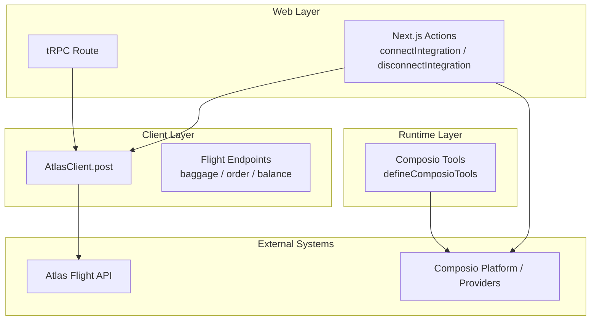
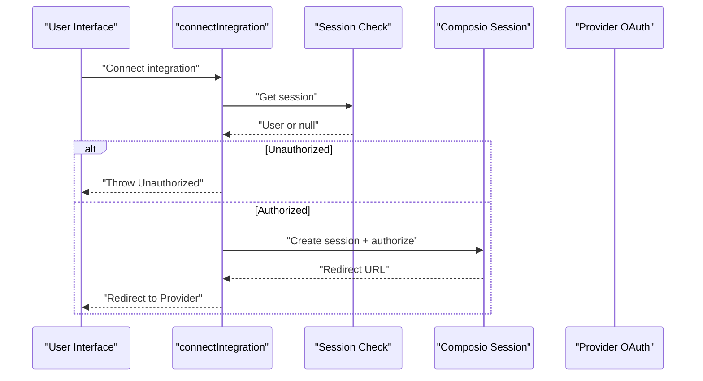
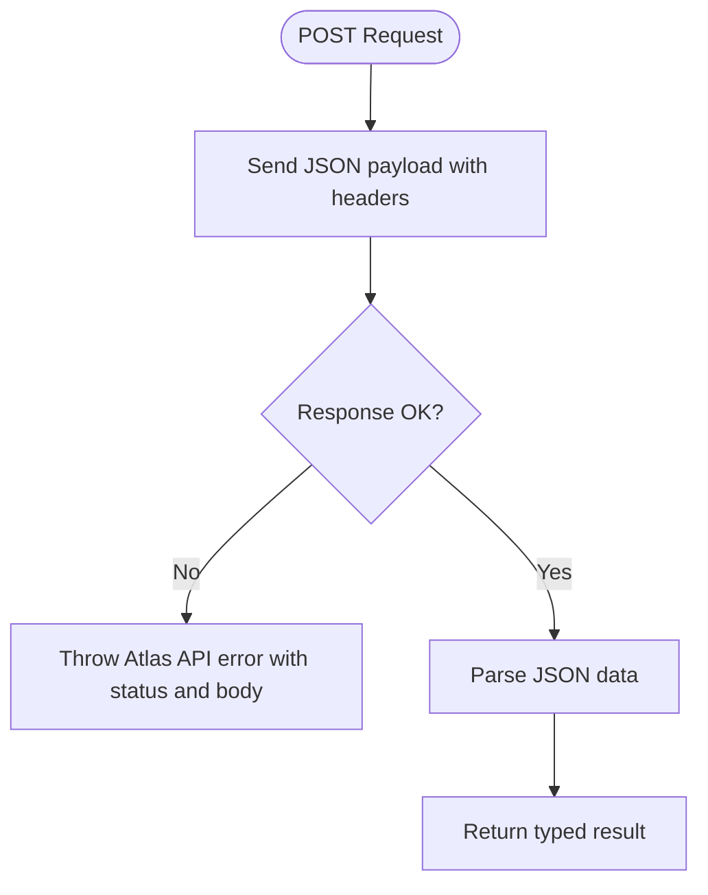
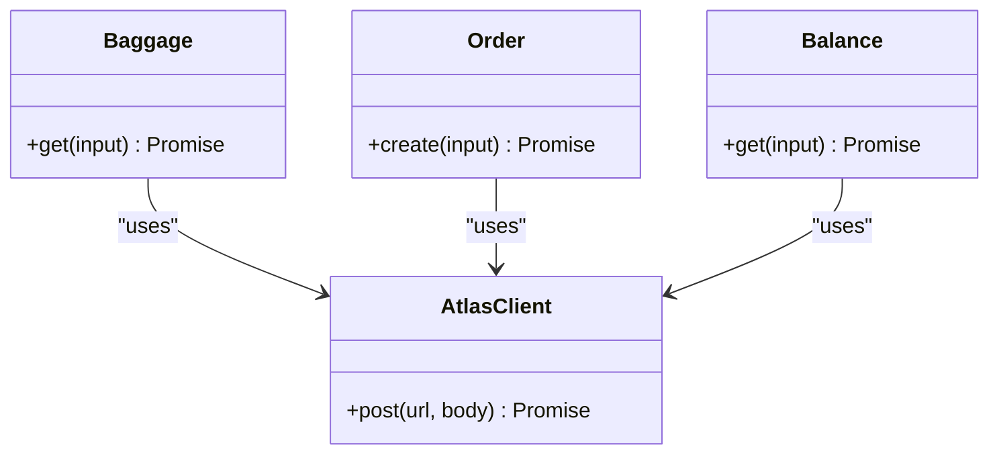
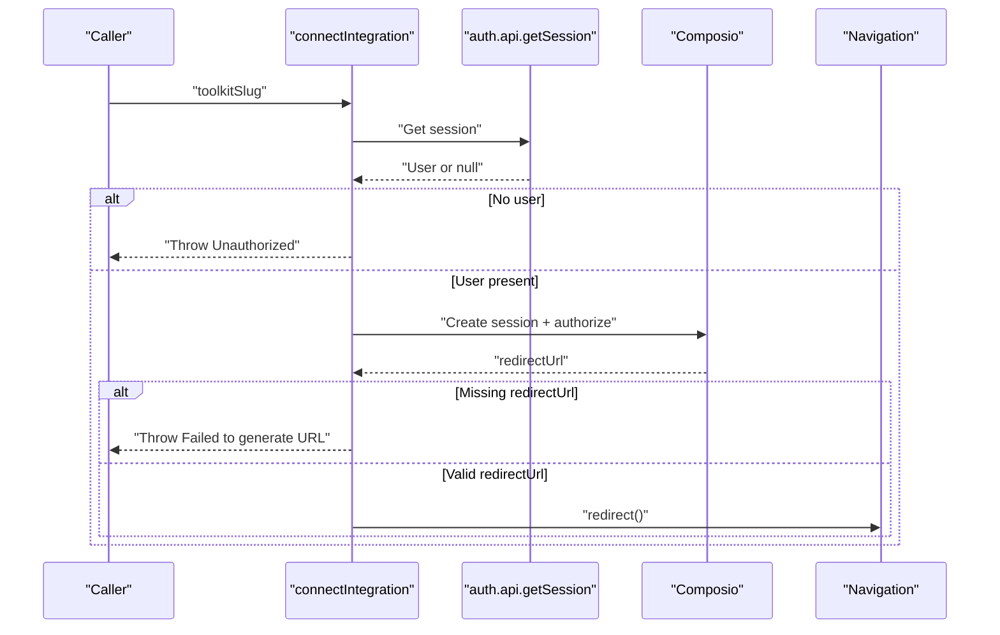
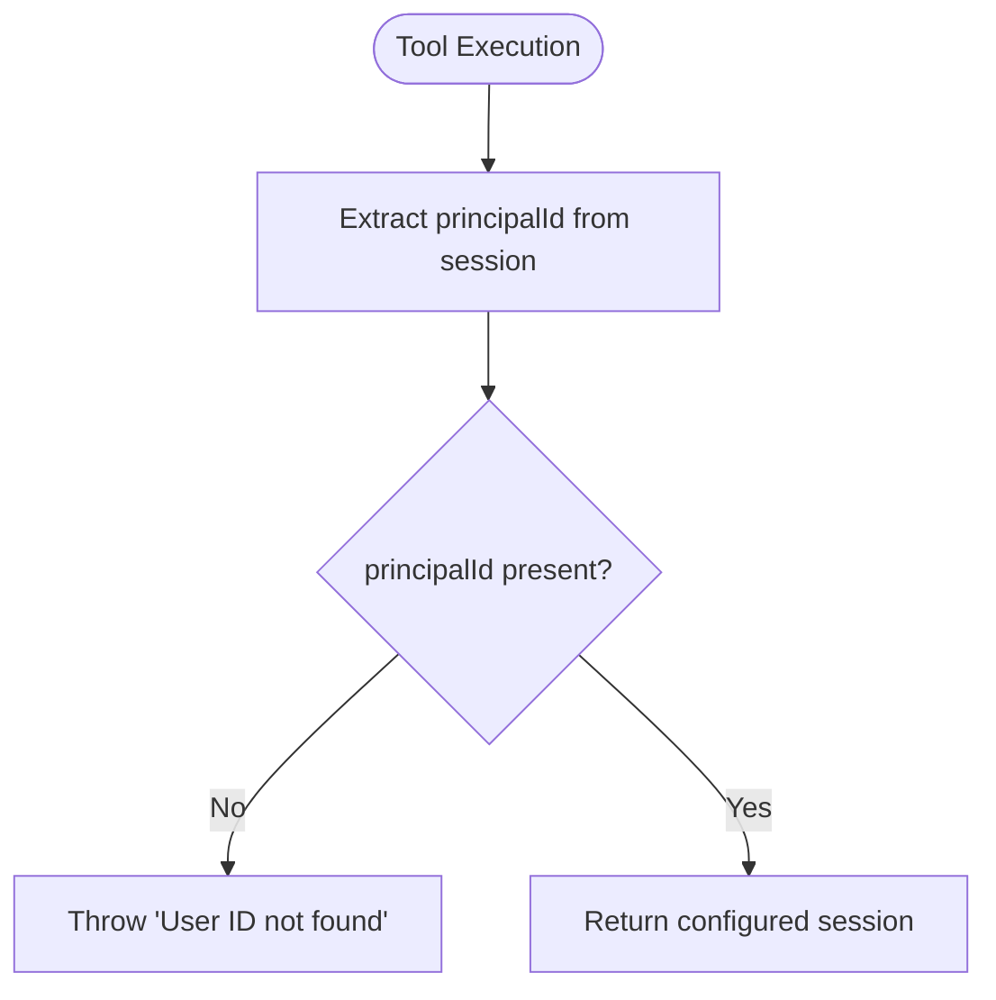
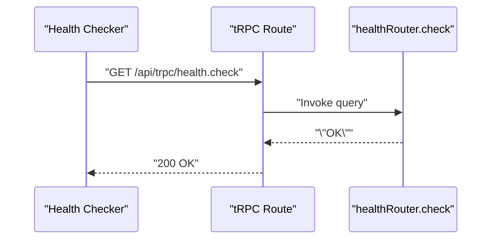
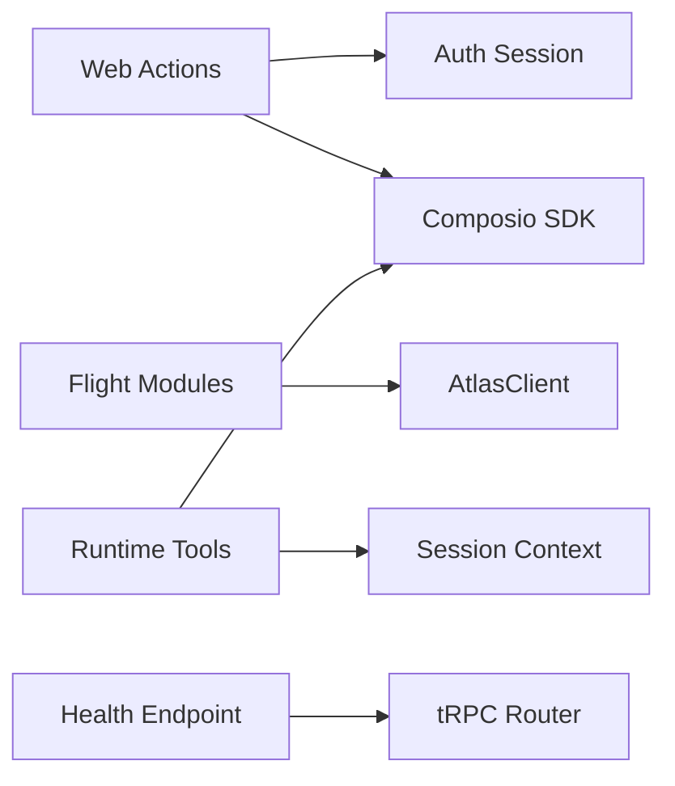

# Error Handling and Recovery

<cite>
**Referenced Files in This Document**
- [error-handling.md](file://.agents/skills/atlas-flight-booking/references/error-handling.md)
- [errors.md](file://.agents/skills/composio/references/errors.md)
- [client.ts](file://packages/atlas/src/client.ts)
- [baggage.ts](file://packages/atlas/src/flights/baggage.ts)
- [create-order.ts](file://packages/atlas/src/flights/create-order.ts)
- [balance.ts](file://packages/atlas/src/utility/balance.ts)
- [composio.ts (web actions)](file://apps/web/src/app/actions/composio.ts)
- [composio.ts (runtime tools)](file://apps/runtime/agent/tools/composio.ts)
- [health.ts](file://packages/api/src/routers/health.ts)
- [trpc route.ts](file://apps/web/src/app/api/trpc/[trpc]/route.ts)
</cite>

## Table of Contents

1. Introduction
2. Project Structure
3. Core Components
4. Architecture Overview
5. Detailed Component Analysis
6. Dependency Analysis
7. Performance Considerations
8. Troubleshooting Guide
9. Conclusion

## Introduction

This document explains how the project handles errors and recovers from failures when interacting with external integrations, particularly flight services via an Atlas client and third-party platforms through Composio. It covers error classification, retry strategies, circuit breaker patterns, graceful degradation, logging and monitoring, custom error handlers, user-friendly error translation, fallback mechanisms, debugging techniques, and production troubleshooting.

## Project Structure

The error handling strategy spans several layers:

- Integration clients that call external APIs and translate network responses into typed results or errors.
- Web server actions that orchestrate integration flows such as connecting and disconnecting accounts.
- Runtime agent tools that execute tasks using sessions and provider tool calls.
- API health endpoints for service readiness checks.
- Reference guides that define normalized error codes and provider-specific gotchas.

**Diagram sources**

- [client.ts:23-39](file://packages/atlas/src/client.ts#L23-L39)
- [baggage.ts:10-13](file://packages/atlas/src/flights/baggage.ts#L10-L13)
- [create-order.ts:11-14](file://packages/atlas/src/flights/create-order.ts#L11-L14)
- [balance.ts:11-14](file://packages/atlas/src/utility/balance.ts#L11-L14)
- [composio.ts (web actions):13-33](file://apps/web/src/app/actions/composio.ts#L13-L33)
- [composio.ts (runtime tools):5-11](file://apps/runtime/agent/tools/composio.ts#L5-L11)

**Section sources**

- [client.ts:1-40](file://packages/atlas/src/client.ts#L1-L40)
- [baggage.ts:1-14](file://packages/atlas/src/flights/baggage.ts#L1-L14)
- [create-order.ts:1-15](file://packages/atlas/src/flights/create-order.ts#L1-L15)
- [balance.ts:1-15](file://packages/atlas/src/utility/balance.ts#L1-L15)
- [composio.ts (web actions):1-85](file://apps/web/src/app/actions/composio.ts#L1-L85)
- [composio.ts (runtime tools):1-12](file://apps/runtime/agent/tools/composio.ts#L1-L12)

## Core Components

- AtlasClient: Central HTTP client that posts JSON payloads to the Atlas API and throws a standardized error when responses are not successful.
- Flight modules: Thin wrappers around Atlas endpoints for baggage, orders, and balance, returning typed promises.
- Web actions: Server-side functions to connect/disconnect third-party integrations via Composio, including session validation and redirects.
- Runtime tools: Agent tool definitions that obtain a session and return a configured Composio session for execution.
- Health endpoint: Simple tRPC procedure to verify API availability.

Key responsibilities:

- Normalize external errors at the client boundary.
- Enforce authentication boundaries before calling external services.
- Provide minimal, stable interfaces for higher-level workflows.

**Section sources**

- [client.ts:23-39](file://packages/atlas/src/client.ts#L23-L39)
- [baggage.ts:10-13](file://packages/atlas/src/flights/baggage.ts#L10-L13)
- [create-order.ts:11-14](file://packages/atlas/src/flights/create-order.ts#L11-L14)
- [balance.ts:11-14](file://packages/atlas/src/utility/balance.ts#L11-L14)
- [composio.ts (web actions):13-33](file://apps/web/src/app/actions/composio.ts#L13-L33)
- [composio.ts (runtime tools):5-11](file://apps/runtime/agent/tools/composio.ts#L5-L11)
- [health.ts:3-5](file://packages/api/src/routers/health.ts#L3-L5)

## Architecture Overview

The system integrates with two primary external systems:

- Atlas Flight API via a typed client that throws on non-OK responses.
- Composio Platform and providers for account connections and tool execution.

Error handling is layered:

- Authentication and authorization checks occur early in server actions and runtime tools.
- Network and service errors are raised by the client layer.
- Normalized error codes guide behavior in complex workflows (e.g., retries, user prompts).

**Diagram sources**

- [composio.ts (web actions):13-33](file://apps/web/src/app/actions/composio.ts#L13-L33)

**Section sources**

- [composio.ts (web actions):13-33](file://apps/web/src/app/actions/composio.ts#L13-L33)

## Detailed Component Analysis

### Atlas Client Error Handling

The Atlas client performs POST requests and throws a generic error when the response status indicates failure. This centralizes error signaling so callers can handle failures consistently.

**Diagram sources**

- [client.ts:23-39](file://packages/atlas/src/client.ts#L23-L39)

**Section sources**

- [client.ts:23-39](file://packages/atlas/src/client.ts#L23-L39)

### Flight Modules: Baggage, Orders, Balance

These modules wrap specific Atlas endpoints. They rely on the client’s error semantics and return typed promises for downstream processing.

- Baggage: Retrieves baggage details for a session and routing identifier.
- Order: Creates an order given a session and routing identifier.
- Balance: Checks balance information for a session.

**Diagram sources**

- [baggage.ts:10-13](file://packages/atlas/src/flights/baggage.ts#L10-L13)
- [create-order.ts:11-14](file://packages/atlas/src/flights/create-order.ts#L11-L14)
- [balance.ts:11-14](file://packages/atlas/src/utility/balance.ts#L11-L14)
- [client.ts:23-39](file://packages/atlas/src/client.ts#L23-L39)

**Section sources**

- [baggage.ts:1-14](file://packages/atlas/src/flights/baggage.ts#L1-L14)
- [create-order.ts:1-15](file://packages/atlas/src/flights/create-order.ts#L1-L15)
- [balance.ts:1-15](file://packages/atlas/src/utility/balance.ts#L1-L15)

### Composio Integration: Connect and Disconnect

Server actions validate the session, create a Composio session, and initiate authorization. Errors include missing sessions and failed connection URL generation.

**Diagram sources**

- [composio.ts (web actions):13-33](file://apps/web/src/app/actions/composio.ts#L13-L33)

**Section sources**

- [composio.ts (web actions):13-33](file://apps/web/src/app/actions/composio.ts#L13-L33)

### Runtime Tool Session Validation

Runtime tools ensure a valid user ID exists in the session before proceeding. If missing, they throw an error to prevent unauthorized execution.

**Diagram sources**

- [composio.ts (runtime tools):5-11](file://apps/runtime/agent/tools/composio.ts#L5-L11)

**Section sources**

- [composio.ts (runtime tools):5-11](file://apps/runtime/agent/tools/composio.ts#L5-L11)

### Health Endpoint

A simple tRPC query returns a success string to indicate the API is reachable.

**Diagram sources**

- [health.ts:3-5](file://packages/api/src/routers/health.ts#L3-L5)
- [trpc route.ts:6-12](file://apps/web/src/app/api/trpc/[trpc]/route.ts#L6-L12)

**Section sources**

- [health.ts:3-5](file://packages/api/src/routers/health.ts#L3-L5)
- [trpc route.ts:6-12](file://apps/web/src/app/api/trpc/[trpc]/route.ts#L6-L12)

## Dependency Analysis

- The web actions depend on authentication and environment variables to configure the Composio client.
- Flight modules depend on the Atlas client for HTTP transport and error signaling.
- Runtime tools depend on session context to obtain a user identity and configure the Composio session.
- The health endpoint depends on tRPC infrastructure to expose a readiness check.

**Diagram sources**

- [composio.ts (web actions):1-11](file://apps/web/src/app/actions/composio.ts#L1-L11)
- [baggage.ts:10-13](file://packages/atlas/src/flights/baggage.ts#L10-L13)
- [create-order.ts:11-14](file://packages/atlas/src/flights/create-order.ts#L11-L14)
- [balance.ts:11-14](file://packages/atlas/src/utility/balance.ts#L11-L14)
- [client.ts:23-39](file://packages/atlas/src/client.ts#L23-L39)
- [composio.ts (runtime tools):5-11](file://apps/runtime/agent/tools/composio.ts#L5-L11)
- [health.ts:3-5](file://packages/api/src/routers/health.ts#L3-L5)
- [trpc route.ts:6-12](file://apps/web/src/app/api/trpc/[trpc]/route.ts#L6-L12)

**Section sources**

- [composio.ts (web actions):1-85](file://apps/web/src/app/actions/composio.ts#L1-L85)
- [client.ts:1-40](file://packages/atlas/src/client.ts#L1-L40)
- [baggage.ts:1-14](file://packages/atlas/src/flights/baggage.ts#L1-L14)
- [create-order.ts:1-15](file://packages/atlas/src/flights/create-order.ts#L1-L15)
- [balance.ts:1-15](file://packages/atlas/src/utility/balance.ts#L1-L15)
- [composio.ts (runtime tools):1-12](file://apps/runtime/agent/tools/composio.ts#L1-L12)
- [health.ts:3-5](file://packages/api/src/routers/health.ts#L3-L5)
- [trpc route.ts:6-12](file://apps/web/src/app/api/trpc/[trpc]/route.ts#L6-L12)

## Performance Considerations

- Avoid unnecessary async work by checking cheap conditions first; this reduces network calls when local guards fail.
- Keep integration calls idempotent where possible to simplify retries and avoid duplicate side effects.
- Use health checks to gate operations and reduce load during outages.

[No sources needed since this section provides general guidance]

## Troubleshooting Guide

- Classification and routing:
  - Branch on normalized error codes rather than parsing messages. This ensures consistent behavior across different upstreams.
  - For authorization-related errors, follow the documented flow: prompt for login, wait for completion, then resume with bounded polling.
  - For temporary unavailability, repeat read-only commands at most once when marked retryable; never repeat order creation or payment.

- Provider diagnostics:
  - Start with evidence: capture logs or request IDs and inspect dashboard logs before changing credentials or code.
  - Identify whether the failure occurs at the platform/session level or at the provider connected-account level.
  - Respect provider constraints such as rate limits, scopes, tenant policies, and app enablement.

- Operational steps:
  - Re-run credential checks and re-establish connections when tokens expire or are revoked.
  - Use canonical documentation links for provider-specific behavior and migrations.
  - Include log IDs when escalating issues to support.

**Section sources**

- [error-handling.md:3-74](file://.agents/skills/atlas-flight-booking/references/error-handling.md#L3-L74)
- [errors.md:5-71](file://.agents/skills/composio/references/errors.md#L5-L71)

## Conclusion

The project implements a layered approach to error handling and recovery:

- Centralized client errors for external API calls.
- Explicit authentication boundaries in server actions and runtime tools.
- Normalized error codes guiding retries, user prompts, and safe resumption.
- Practical diagnostics and provider-specific guidance to streamline troubleshooting.

To strengthen resilience further, consider adding:

- Exponential backoff with jitter for transient failures.
- Circuit breaker logic around failing dependencies to prevent cascade failures.
- Graceful degradation paths that continue partial workflows when optional services are unavailable.
- Structured logging and metrics collection for integration health and performance tracking.

[No sources needed since this section summarizes without analyzing specific files]
