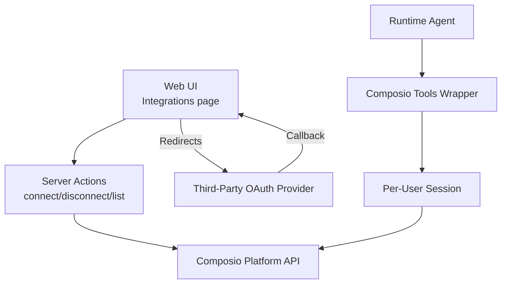
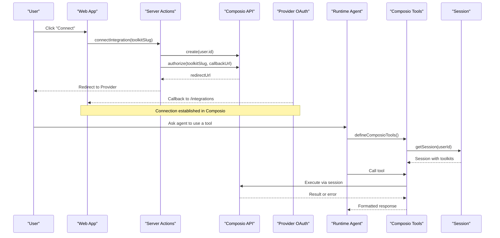
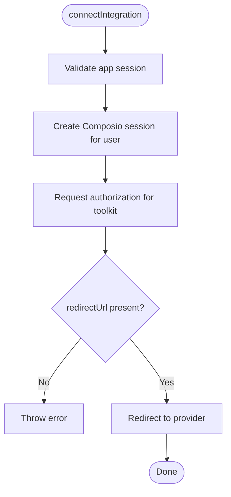
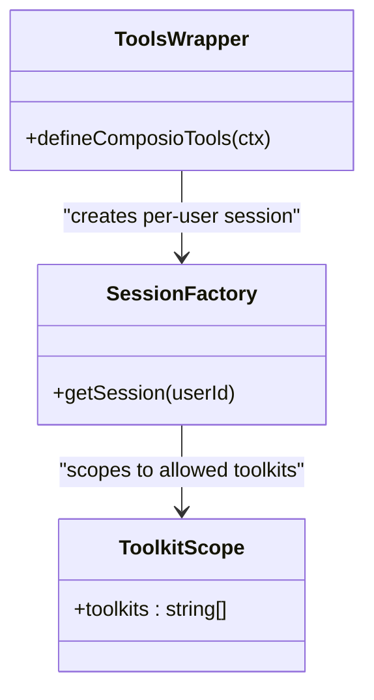
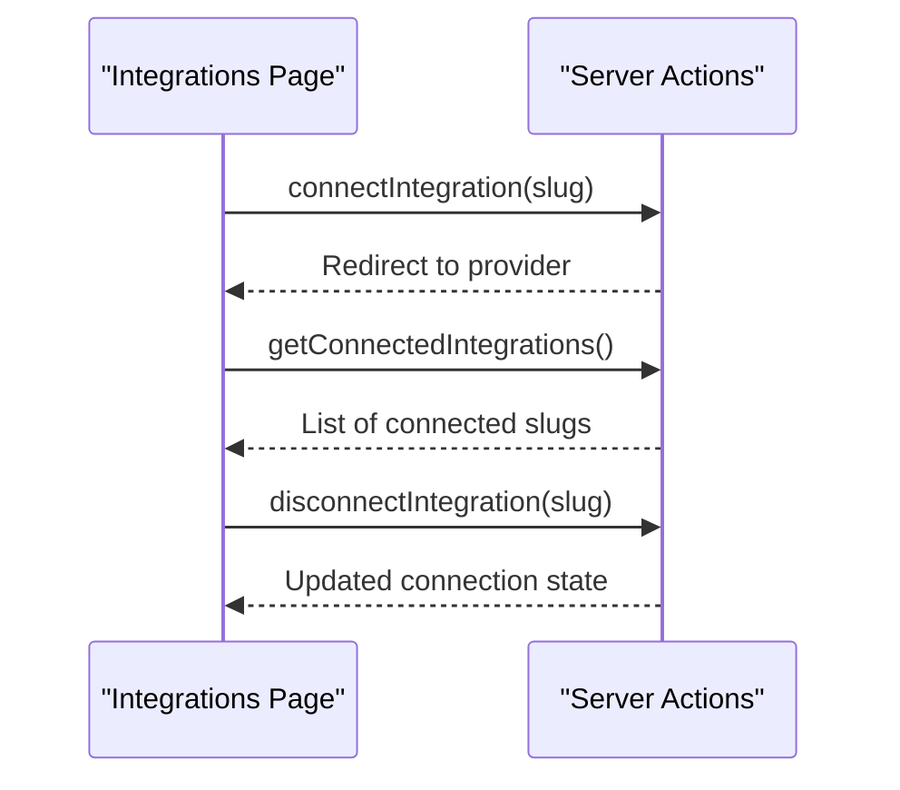
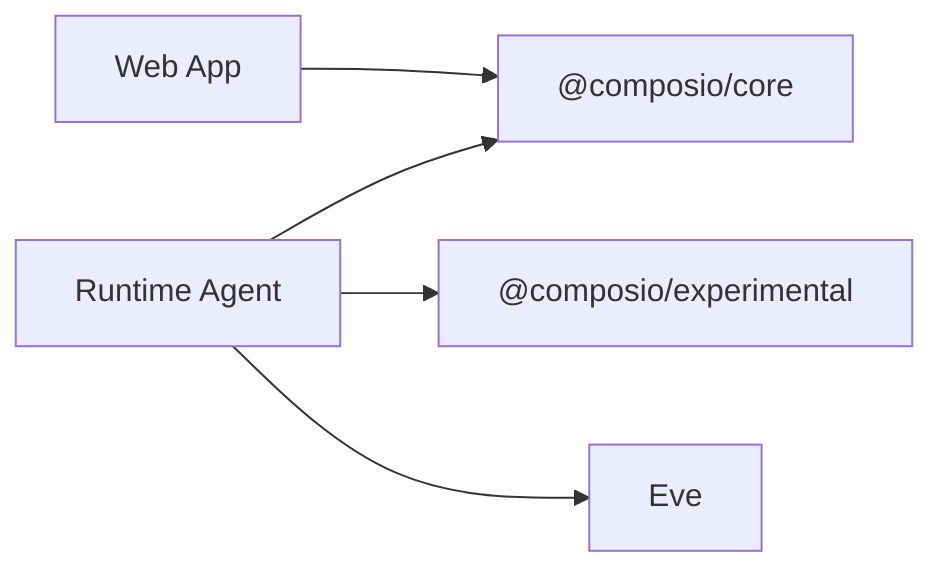

# External Integrations

<cite>
**Referenced Files in This Document**
- [composio.ts](file://apps/runtime/agent/tools/composio.ts)
- [session.ts](file://apps/runtime/agent/session.ts)
- [auth.ts](file://apps/runtime/agent/lib/auth.ts)
- [composio.ts](file://apps/web/src/app/actions/composio.ts)
- [page.tsx](file://apps/web/src/app/(protected)/integrations/page.tsx)
- [SKILL.md](file://.agents/skills/composio/SKILL.md)
- [platform.md](file://.agents/skills/composio/references/platform.md)
- [errors.md](file://.agents/skills/composio/references/errors.md)
- [package.json (runtime)](file://apps/runtime/package.json)
- [package.json (web)](file://apps/web/package.json)
</cite>

## Table of Contents

1. Introduction
2. Project Structure
3. Core Components
4. Architecture Overview
5. Detailed Component Analysis
6. Dependency Analysis
7. Performance Considerations
8. Troubleshooting Guide
9. Conclusion

## Introduction

This document explains the external service integration framework built on top of Composio. It covers how the application connects to third-party services such as Google Calendar, Gmail, Slack, Notion, and Google Maps; how OAuth-based authentication flows are initiated and managed; how tools are exposed to AI agents; and how to set up new integrations, configure credentials, and implement custom tooling. It also addresses security considerations, rate limiting, retry strategies, and troubleshooting techniques for complex workflows.

## Project Structure

The integration spans two main areas:

- Web app server actions that manage user-initiated connections and disconnections with third-party services via Composio.
- Runtime agent tools that expose Composio-powered capabilities to an AI agent using per-user sessions scoped to specific toolkits.

**Diagram sources**

- [composio.ts:13-33](file://apps/web/src/app/actions/composio.ts#L13-L33)
- [composio.ts:35-61](file://apps/web/src/app/actions/composio.ts#L35-L61)
- [composio.ts:63-84](file://apps/web/src/app/actions/composio.ts#L63-L84)
- [composio.ts:5-11](file://apps/runtime/agent/tools/composio.ts#L5-L11)
- [session.ts:6-18](file://apps/runtime/agent/session.ts#L6-L18)

**Section sources**

- [composio.ts:13-84](file://apps/web/src/app/actions/composio.ts#L13-L84)
- [composio.ts:5-11](file://apps/runtime/agent/tools/composio.ts#L5-L11)
- [session.ts:6-18](file://apps/runtime/agent/session.ts#L6-L18)

## Core Components

- Server-side connection management: Creates a Composio session for the current user, initiates OAuth authorization for a selected toolkit, redirects to the provider, and lists or disconnects accounts.
- Runtime tool exposure: Wraps Composio tools for the runtime agent, binds them to a per-user session, and restricts available toolkits to a curated list.
- Integration UI: Presents connected services and allows users to connect or disconnect at any time.

Key responsibilities:

- Authentication boundary: Validate application session before interacting with Composio.
- Token lifecycle: Delegated to Composio; the app manages Connect Links and account states.
- Tool discovery and execution: Handled by Composio sessions and meta tools.

**Section sources**

- [composio.ts:13-84](file://apps/web/src/app/actions/composio.ts#L13-L84)
- [composio.ts:5-11](file://apps/runtime/agent/tools/composio.ts#L5-L11)
- [session.ts:6-18](file://apps/runtime/agent/session.ts#L6-L18)
- [page.tsx:74-149](<file://apps/web/src/app/(protected)/integrations/page.tsx#L74-L149>)

## Architecture Overview

The system uses a session-per-user model. The web layer initiates OAuth via a Connect Link returned by Composio. After successful authorization, the runtime agent creates a session scoped to the user and a predefined set of toolkits. The agent then calls tools through the Composio session, which handles provider communication, token refresh, and error mapping.

**Diagram sources**

- [composio.ts:13-33](file://apps/web/src/app/actions/composio.ts#L13-L33)
- [composio.ts:63-84](file://apps/web/src/app/actions/composio.ts#L63-L84)
- [composio.ts:5-11](file://apps/runtime/agent/tools/composio.ts#L5-L11)
- [session.ts:6-18](file://apps/runtime/agent/session.ts#L6-L18)

## Detailed Component Analysis

### Web Server Actions: OAuth Initiation and Account Management

- Authorization flow: Validates the application session, creates a Composio session for the user, requests authorization for a specific toolkit, and redirects to the provider’s Connect Link.
- Disconnection: Lists connected accounts for the user, filters by toolkit slug and status, and deletes matching accounts.
- Listing connections: Returns active or initiated connections for the current user.

**Diagram sources**

- [composio.ts:13-33](file://apps/web/src/app/actions/composio.ts#L13-L33)

**Section sources**

- [composio.ts:13-33](file://apps/web/src/app/actions/composio.ts#L13-L33)
- [composio.ts:35-61](file://apps/web/src/app/actions/composio.ts#L35-L61)
- [composio.ts:63-84](file://apps/web/src/app/actions/composio.ts#L63-L84)

### Runtime Tools: Exposing Capabilities to AI Agents

- Tool wrapper: Binds a per-user session to the agent’s tool interface.
- Session creation: Builds a session with a curated list of toolkits including Google Calendar, Gmail, Slack, Notion, Google Sheets, Google Maps, Firecrawl, and Telegram.
- Identity binding: Extracts the principal ID from the runtime session to scope tools to the correct user.

**Diagram sources**

- [composio.ts:5-11](file://apps/runtime/agent/tools/composio.ts#L5-L11)
- [session.ts:6-18](file://apps/runtime/agent/session.ts#L6-L18)

**Section sources**

- [composio.ts:5-11](file://apps/runtime/agent/tools/composio.ts#L5-L11)
- [session.ts:6-18](file://apps/runtime/agent/session.ts#L6-L18)

### Integration UI: Connecting and Disconnecting Services

- Displays available integrations with icons and titles.
- Shows “Connect” or “Disconnect” based on current connection state.
- Calls server actions to initiate OAuth or remove connections and refreshes the UI.

**Diagram sources**

- [page.tsx:74-149](<file://apps/web/src/app/(protected)/integrations/page.tsx#L74-L149>)
- [composio.ts:13-84](file://apps/web/src/app/actions/composio.ts#L13-L84)

**Section sources**

- [page.tsx:74-149](<file://apps/web/src/app/(protected)/integrations/page.tsx#L74-L149>)
- [composio.ts:13-84](file://apps/web/src/app/actions/composio.ts#L13-L84)

### Authentication Flows and Token Management

- Application-level auth: The web app validates the user session before initiating any Composio operation.
- Provider OAuth: Managed entirely by Composio. The app requests a Connect Link and redirects the user; no custom OAuth code is implemented.
- Token lifecycle: Tokens are stored and refreshed by Composio. The app interacts via sessions and does not handle raw tokens directly.
- Multi-turn sessions: For long-running conversations, persist and resume the session ID rather than creating a new session per message.

**Section sources**

- [composio.ts:13-33](file://apps/web/src/app/actions/composio.ts#L13-L33)
- [platform.md:74-104](file://.agents/skills/composio/references/platform.md#L74-L104)

### Tool System: Parameter Validation, Response Formatting, Error Handling

- Meta tools: Sessions expose meta tools for searching, schema retrieval, multi-execution, and connection management. These enable dynamic discovery and orchestration without hardcoding tool slugs.
- Parameter validation: Tool schemas are provided by Composio; the agent can retrieve schemas to validate inputs before execution.
- Response formatting: Responses are returned by the underlying provider through Composio; format depends on the specific tool and toolkit.
- Error handling: Errors originate from providers or Composio and should be surfaced with log IDs for diagnosis.

**Section sources**

- [platform.md:106-120](file://.agents/skills/composio/references/platform.md#L106-L120)
- [errors.md:5-23](file://.agents/skills/composio/references/errors.md#L5-L23)

### Setting Up New Integrations

Steps to add a new service:

1. Ensure the environment has a valid project key configured for the platform.
2. Add the new toolkit slug to the runtime session’s toolkit list if you want it available to the agent.
3. Update the integration UI to include the new service icon and slug.
4. Test by connecting the service via the UI and executing a safe read-only tool call.

Notes:

- Do not build provider OAuth flows; rely on Connect Links.
- Discover tool slugs at runtime or via CLI; avoid hardcoding unknown slugs.
- Keep credentials out of source control and logs.

**Section sources**

- [session.ts:6-18](file://apps/runtime/agent/session.ts#L6-L18)
- [page.tsx:36-72](<file://apps/web/src/app/(protected)/integrations/page.tsx#L36-L72>)
- [platform.md:27-43](file://.agents/skills/composio/references/platform.md#L27-L43)
- [platform.md:106-120](file://.agents/skills/composio/references/platform.md#L106-L120)

### Security Considerations

- Credentials: Use environment variables for the project key; never print or log secrets.
- Session scoping: Always bind tools to the authenticated user’s principal ID to prevent cross-user access.
- Callback URLs: Configure callback URLs to your trusted domain.
- Least privilege: Only enable toolkits required for the feature; consider sandbox controls for advanced scenarios.
- Branding and production auth: For production, move to custom OAuth apps when branding, scopes, or dedicated quotas are needed.

**Section sources**

- [platform.md:27-43](file://.agents/skills/composio/references/platform.md#L27-L43)
- [platform.md:124-135](file://.agents/skills/composio/references/platform.md#L124-L135)
- [errors.md:52-57](file://.agents/skills/composio/references/errors.md#L52-L57)

### Rate Limiting and Retry Mechanisms

- Provider constraints: Some providers enforce strict quotas or require custom apps for dedicated buckets.
- Retries: Implement retries at the agent/tool level for transient errors; respect provider backoff headers and limits.
- Monitoring: Capture log IDs and request IDs to correlate failures and adjust retry policies.

[No sources needed since this section provides general guidance]

### Custom Tools for Business Logic

- Use meta tools to discover available tools and schemas dynamically.
- Compose multiple tool calls using multi-execute capabilities where appropriate.
- Wrap business logic around tool results to produce domain-specific responses while preserving provider data integrity.

**Section sources**

- [platform.md:106-120](file://.agents/skills/composio/references/platform.md#L106-L120)

## Dependency Analysis

The integration relies on the following core dependencies:

- @composio/core: SDK for session management, authorization, and tool execution.
- @composio/experimental: Experimental features used by the runtime agent tool wrapper.
- Eve: Runtime agent framework used to host tools and sessions.

**Diagram sources**

- [package.json (web):11-17](file://apps/web/package.json#L11-L17)
- [package.json (runtime):15-22](file://apps/runtime/package.json#L15-L22)

**Section sources**

- [package.json (web):11-17](file://apps/web/package.json#L11-L17)
- [package.json (runtime):15-22](file://apps/runtime/package.json#L15-L22)

## Performance Considerations

- Minimize session churn: Persist and reuse session IDs across turns to avoid repeated setup overhead.
- Prefer read-only operations during testing and debugging to reduce side effects.
- Batch tool calls where supported to reduce network round-trips.
- Cache connection state on the client to avoid unnecessary server calls.

[No sources needed since this section provides general guidance]

## Troubleshooting Guide

Common issues and steps:

- Tool not found: Discover tools at runtime; do not guess slugs. Inspect session meta tools and schemas.
- 401 errors:
  - Project/session 401: Verify the project key and ensure it belongs to the correct project.
  - Provider 401: Reconnect the provider account; tokens may be revoked or expired.
- Provider constraints:
  - Google blocked app: Remove unnecessary scopes or use a verified custom OAuth app.
  - Slack 429: Use a custom Slack app for dedicated quota.
  - Microsoft 403: Tenant may require admin consent.
- Triggers and webhooks: Check status pages and trigger logs; verify webhook signature verification.

Debugging workflow:

1. Capture the log ID or request ID from the failure.
2. Inspect dashboard logs and connection state.
3. Identify whether the failure occurs at the project/session boundary or at the provider boundary.
4. Reconnect or reauthorize as needed and retry with safe operations.

**Section sources**

- [errors.md:5-50](file://.agents/skills/composio/references/errors.md#L5-L50)
- [errors.md:58-70](file://.agents/skills/composio/references/errors.md#L58-L70)

## Conclusion

This integration leverages Composio to provide secure, session-scoped access to third-party services. The web layer manages OAuth via Connect Links, while the runtime exposes tools to AI agents through per-user sessions with a curated toolkit set. By following the recommended practices for credential management, session reuse, and error handling, teams can extend integrations safely and efficiently. For advanced needs such as custom OAuth branding, dedicated quotas, or sandbox controls, consult the platform references and canonical documentation.
