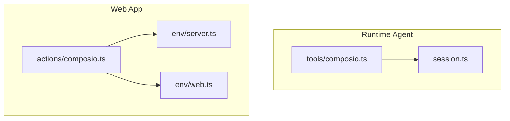
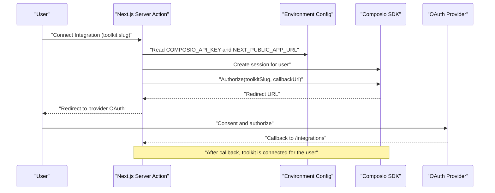
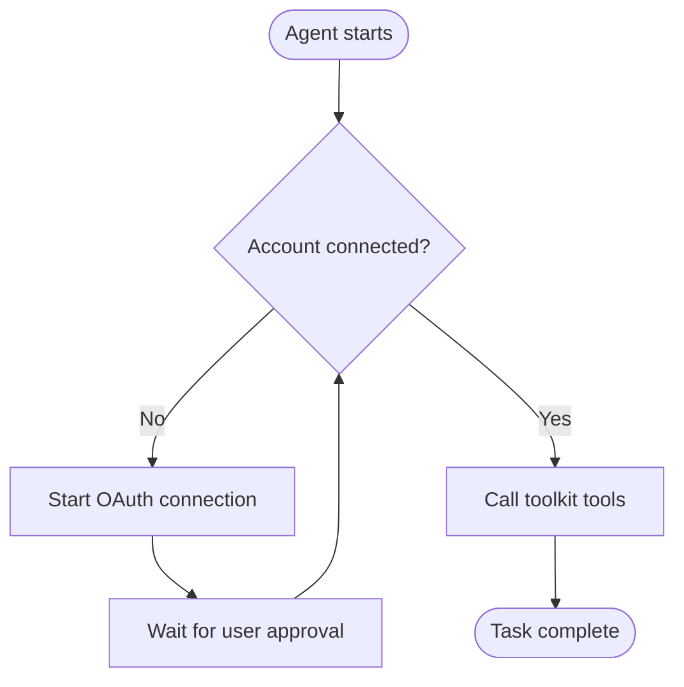
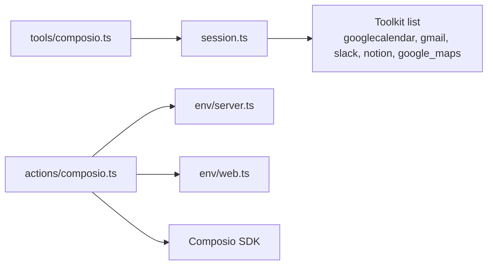

# Service-Specific Integrations

<cite>
**Referenced Files in This Document**
- [apps/runtime/agent/tools/composio.ts](file://apps/runtime/agent/tools/composio.ts)
- [apps/runtime/agent/session.ts](file://apps/runtime/agent/session.ts)
- [apps/web/src/app/actions/composio.ts](file://apps/web/src/app/actions/composio.ts)
- [packages/env/src/server.ts](file://packages/env/src/server.ts)
- [packages/env/src/web.ts](file://packages/env/src/web.ts)
- [.agents/skills/composio/SKILL.md](file://.agents/skills/composio/SKILL.md)
- [.agents/skills/composio/references/platform.md](file://.agents/skills/composio/references/platform.md)
</cite>

## Table of Contents

1. Introduction
2. Project Structure
3. Core Components
4. Architecture Overview
5. Detailed Component Analysis
6. Dependency Analysis
7. Performance Considerations
8. Troubleshooting Guide
9. Conclusion

## Introduction

This document explains how the application integrates with Google Calendar, Gmail, Slack, Notion, and Google Maps through Composio. It covers available tools exposed to AI agents, required permissions and scopes, configuration options, authentication flows, rate limiting considerations, data access patterns, common workflows, error scenarios, and performance optimization strategies. The integration is built on a session-based model where each user connects their accounts via OAuth and then uses toolkits provided by Composio.

## Project Structure

The integrations are implemented across three main areas:

- Runtime agent tool exposure that binds a user session to Composio toolkits
- Web server actions that initiate and manage user account connections
- Environment configuration for project credentials and public URLs

**Diagram sources**

- [apps/runtime/agent/tools/composio.ts:1-11](file://apps/runtime/agent/tools/composio.ts#L1-L11)
- [apps/runtime/agent/session.ts:1-19](file://apps/runtime/agent/session.ts#L1-L19)
- [apps/web/src/app/actions/composio.ts:1-46](file://apps/web/src/app/actions/composio.ts#L1-L46)
- [packages/env/src/server.ts:1-29](file://packages/env/src/server.ts#L1-L29)
- [packages/env/src/web.ts:1-14](file://packages/env/src/web.ts#L1-L14)

**Section sources**

- [apps/runtime/agent/tools/composio.ts:1-11](file://apps/runtime/agent/tools/composio.ts#L1-L11)
- [apps/runtime/agent/session.ts:1-19](file://apps/runtime/agent/session.ts#L1-L19)
- [apps/web/src/app/actions/composio.ts:1-46](file://apps/web/src/app/actions/composio.ts#L1-L46)
- [packages/env/src/server.ts:1-29](file://packages/env/src/server.ts#L1-L29)
- [packages/env/src/web.ts:1-14](file://packages/env/src/web.ts#L1-L14)

## Core Components

- Runtime tool binding: Exposes Composio tools to the agent per authenticated user. It validates the user identity and returns a session configured with specific toolkits.
- Session creation: Creates a user-scoped session with enabled toolkits for Google Calendar, Gmail, Slack, Notion, Google Sheets, Google Maps, and others.
- Connection management: Server action initiates OAuth authorization for a selected toolkit and redirects the user to complete consent; it also supports disconnecting accounts.
- Environment configuration: Defines required environment variables such as the Composio API key and public app URL used during connection callbacks.

Key capabilities exposed to AI agents include discovery and execution of tools from the connected toolkits, plus meta tools for managing connections and waiting for authorization completion.

**Section sources**

- [apps/runtime/agent/tools/composio.ts:1-11](file://apps/runtime/agent/tools/composio.ts#L1-L11)
- [apps/runtime/agent/session.ts:1-19](file://apps/runtime/agent/session.ts#L1-L19)
- [apps/web/src/app/actions/composio.ts:1-46](file://apps/web/src/app/actions/composio.ts#L1-L46)
- [.agents/skills/composio/references/platform.md:106-118](file://.agents/skills/composio/references/platform.md#L106-L118)

## Architecture Overview

The system follows a clear separation between runtime tool execution and user-driven connection setup:

**Diagram sources**

- [apps/web/src/app/actions/composio.ts:13-33](file://apps/web/src/app/actions/composio.ts#L13-L33)
- [packages/env/src/server.ts:15-15](file://packages/env/src/server.ts#L15-L15)
- [packages/env/src/web.ts:6-6](file://packages/env/src/web.ts#L6-L6)

## Detailed Component Analysis

### Google Calendar

- Tools and capabilities: Create events, read calendars, update or delete events, search events, and manage attendees through the Google Calendar toolkit.
- Permissions and scopes: Handled by the provider OAuth flow initiated by the connection step; the application does not hardcode scopes.
- Configuration: Enabled via the “googlecalendar” toolkit in the runtime session.
- Authentication: Per-user OAuth connection initiated from the web action; after approval, the session can call Calendar tools.
- Rate limiting: Respect provider limits; batch operations should be minimized and errors retried with backoff when appropriate.
- Data access pattern: Read-only queries first when possible; write operations only when explicitly requested.
- Common workflow example: Creating a calendar event involves invoking the corresponding tool from the agent using the active session.

**Section sources**

- [apps/runtime/agent/session.ts:8-17](file://apps/runtime/agent/session.ts#L8-L17)
- [apps/web/src/app/actions/composio.ts:13-33](file://apps/web/src/app/actions/composio.ts#L13-L33)

### Gmail

- Tools and capabilities: Send emails, list messages, search emails, and manage labels via the Gmail toolkit.
- Permissions and scopes: Managed by the OAuth connection process; no explicit scope configuration in this codebase.
- Configuration: Enabled via the “gmail” toolkit in the runtime session.
- Authentication: Same per-user OAuth flow as other toolkits.
- Rate limiting: Avoid sending large batches; implement retries for transient failures.
- Data access pattern: Prefer targeted searches and filters to reduce payload size.
- Common workflow example: Sending an email uses the Gmail send tool bound to the current user session.

**Section sources**

- [apps/runtime/agent/session.ts:8-17](file://apps/runtime/agent/session.ts#L8-L17)
- [apps/web/src/app/actions/composio.ts:13-33](file://apps/web/src/app/actions/composio.ts#L13-L33)

### Slack

- Tools and capabilities: Post messages to channels, list conversations, and manage workspace resources via the Slack toolkit.
- Permissions and scopes: Set during OAuth connection; the application delegates scope selection to the provider flow.
- Configuration: Enabled via the “slack” toolkit in the runtime session.
- Authentication: Per-user OAuth connection.
- Rate limiting: Use idempotent posting where possible; handle throttling responses gracefully.
- Data access pattern: Query channel IDs before posting to ensure correct targets.
- Common workflow example: Posting to a channel uses the Slack message tool bound to the active session.

**Section sources**

- [apps/runtime/agent/session.ts:8-17](file://apps/runtime/agent/session.ts#L8-L17)
- [apps/web/src/app/actions/composio.ts:13-33](file://apps/web/src/app/actions/composio.ts#L13-L33)

### Notion

- Tools and capabilities: Update pages, create databases, append content, and query blocks via the Notion toolkit.
- Permissions and scopes: Managed by the OAuth connection process.
- Configuration: Enabled via the “notion” toolkit in the runtime session.
- Authentication: Per-user OAuth connection.
- Rate limiting: Batch updates carefully; avoid excessive page mutations in tight loops.
- Data access pattern: Fetch minimal necessary content; cache identifiers like page IDs locally when reused.
- Common workflow example: Updating a page uses the Notion page update tool bound to the current session.

**Section sources**

- [apps/runtime/agent/session.ts:8-17](file://apps/runtime/agent/session.ts#L8-L17)
- [apps/web/src/app/actions/composio.ts:13-33](file://apps/web/src/app/actions/composio.ts#L13-L33)

### Google Maps

- Tools and capabilities: Retrieve place details, geocode addresses, and search places via the Google Maps toolkit.
- Permissions and scopes: Handled by the OAuth connection; some Map features may require separate API keys depending on provider configuration.
- Configuration: Enabled via the “google_maps” toolkit in the runtime session.
- Authentication: Per-user OAuth connection.
- Rate limiting: Cache frequent lookups; avoid repeated identical queries.
- Data access pattern: Prefer precise queries (e.g., place ID) to minimize bandwidth and cost.
- Common workflow example: Retrieving map data uses the Maps tool bound to the active session.

**Section sources**

- [apps/runtime/agent/session.ts:8-17](file://apps/runtime/agent/session.ts#L8-L17)
- [apps/web/src/app/actions/composio.ts:13-33](file://apps/web/src/app/actions/composio.ts#L13-L33)

### Conceptual Overview

The following conceptual diagram shows how an agent uses tools after a user has connected their accounts:

[No sources needed since this diagram shows conceptual workflow, not actual code structure]

## Dependency Analysis

The runtime agent depends on the session module to obtain a user-scoped Composio session with specific toolkits. The web layer depends on environment configuration to initialize the SDK and construct redirect URLs.

**Diagram sources**

- [apps/runtime/agent/tools/composio.ts:1-11](file://apps/runtime/agent/tools/composio.ts#L1-L11)
- [apps/runtime/agent/session.ts:1-19](file://apps/runtime/agent/session.ts#L1-L19)
- [apps/web/src/app/actions/composio.ts:1-46](file://apps/web/src/app/actions/composio.ts#L1-L46)
- [packages/env/src/server.ts:1-29](file://packages/env/src/server.ts#L1-L29)
- [packages/env/src/web.ts:1-14](file://packages/env/src/web.ts#L1-L14)

**Section sources**

- [apps/runtime/agent/tools/composio.ts:1-11](file://apps/runtime/agent/tools/composio.ts#L1-L11)
- [apps/runtime/agent/session.ts:1-19](file://apps/runtime/agent/session.ts#L1-L19)
- [apps/web/src/app/actions/composio.ts:1-46](file://apps/web/src/app/actions/composio.ts#L1-L46)
- [packages/env/src/server.ts:1-29](file://packages/env/src/server.ts#L1-L29)
- [packages/env/src/web.ts:1-14](file://packages/env/src/web.ts#L1-L14)

## Performance Considerations

- Reuse sessions: For multi-turn interactions, persist and resume the session instead of creating new ones per request.
- Minimize tool calls: Combine operations where possible and avoid redundant reads.
- Cache stable identifiers: Store IDs like calendar event IDs, page IDs, or place IDs locally to reduce repeated lookups.
- Backoff and retries: Implement exponential backoff for transient network or rate-limit errors.
- Prefer read-first patterns: Validate existence and constraints before writes to reduce failed mutations.
- Limit payloads: Use filters and selective fields to reduce response sizes.

[No sources needed since this section provides general guidance]

## Troubleshooting Guide

Common issues and resolutions:

- Missing user identity in runtime: If the agent cannot find a user ID in the session context, tool execution will fail. Ensure the runtime context includes a valid principal identifier before calling tools.
- Unauthorized server action: If the web action cannot retrieve a session, it will reject the request. Verify authentication headers and session state.
- Failed connection URL generation: If the authorization step does not return a redirect URL, check environment variables and provider configuration.
- Meta tools for connection management: Use connection management tools to discover available integrations and wait for connections to complete.

Operational tips:

- Always capture log or request IDs when diagnosing failed tool calls.
- Keep credentials out of logs and source control.
- Use the smallest configuration that completes the task; avoid enabling unnecessary toolkits.

**Section sources**

- [apps/runtime/agent/tools/composio.ts:5-10](file://apps/runtime/agent/tools/composio.ts#L5-L10)
- [apps/web/src/app/actions/composio.ts:13-33](file://apps/web/src/app/actions/composio.ts#L13-L33)
- [.agents/skills/composio/references/platform.md:106-118](file://.agents/skills/composio/references/platform.md#L106-L118)

## Conclusion

The application integrates Google Calendar, Gmail, Slack, Notion, and Google Maps through Composio’s session-based toolkit model. Users connect their accounts via OAuth, after which AI agents can invoke service-specific tools within the bounds of the enabled toolkits. Proper environment configuration, careful session handling, and thoughtful error and performance strategies ensure reliable and efficient operations across these services.
