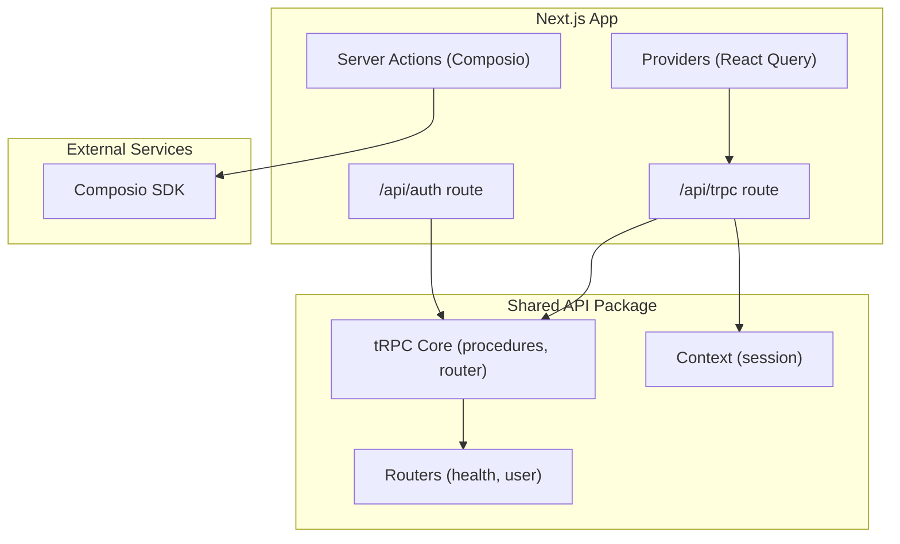
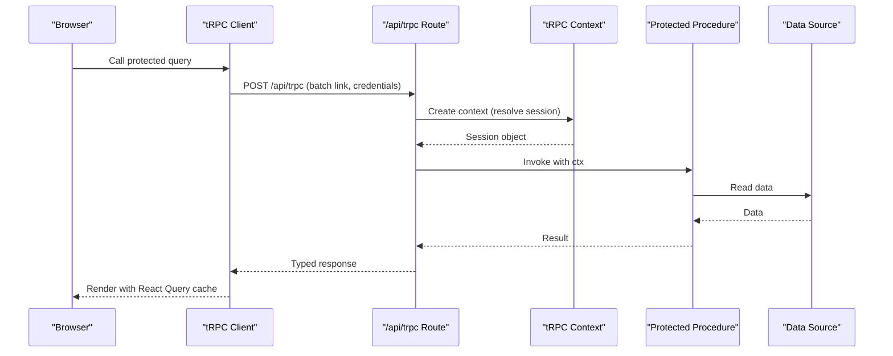
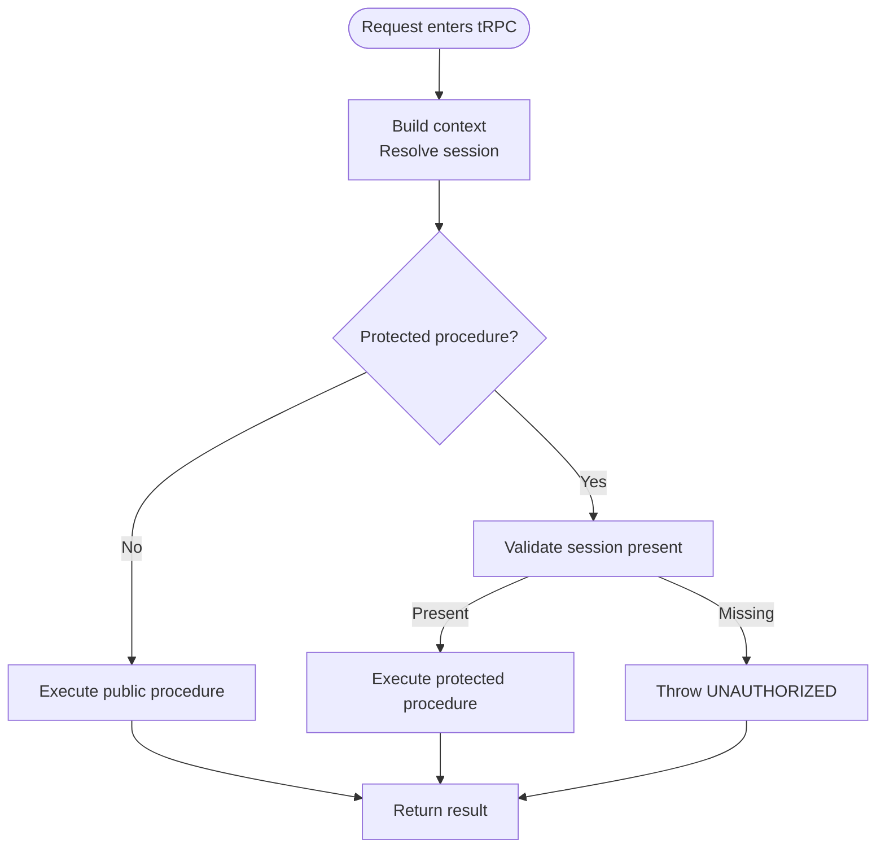
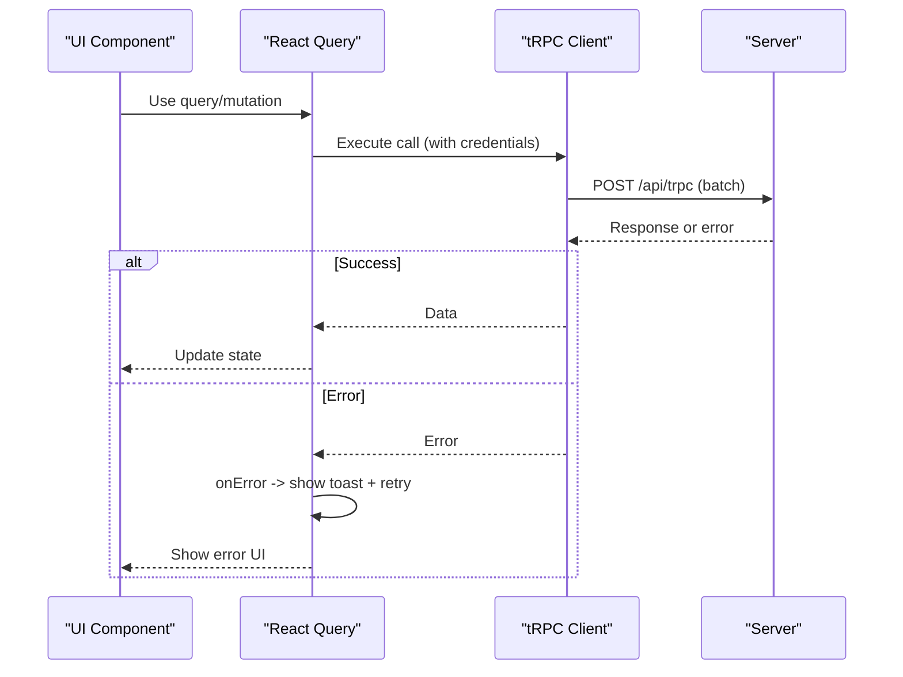
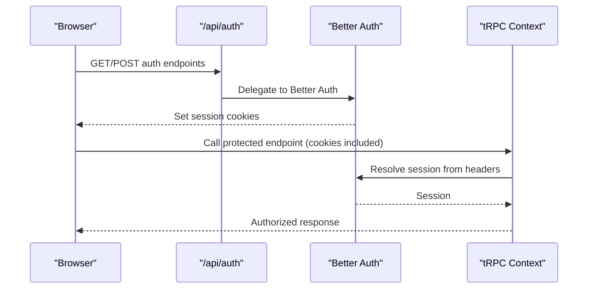
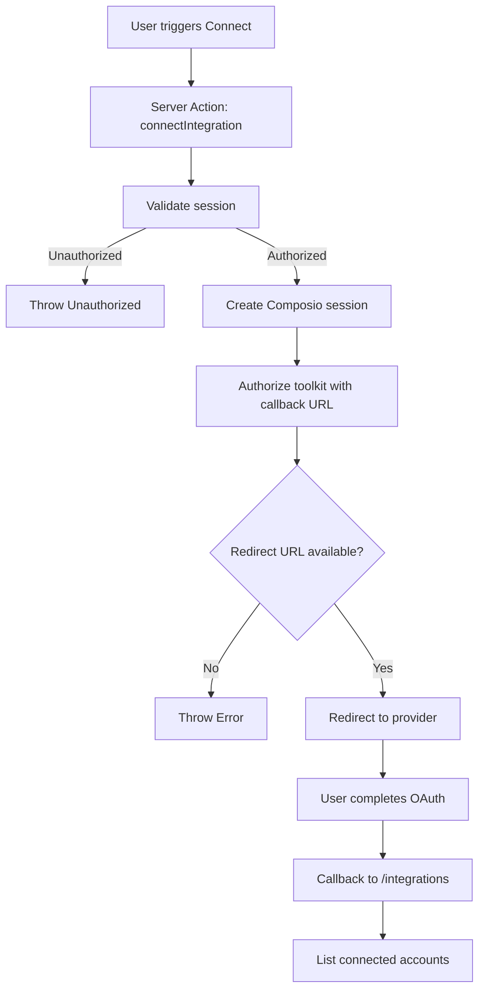
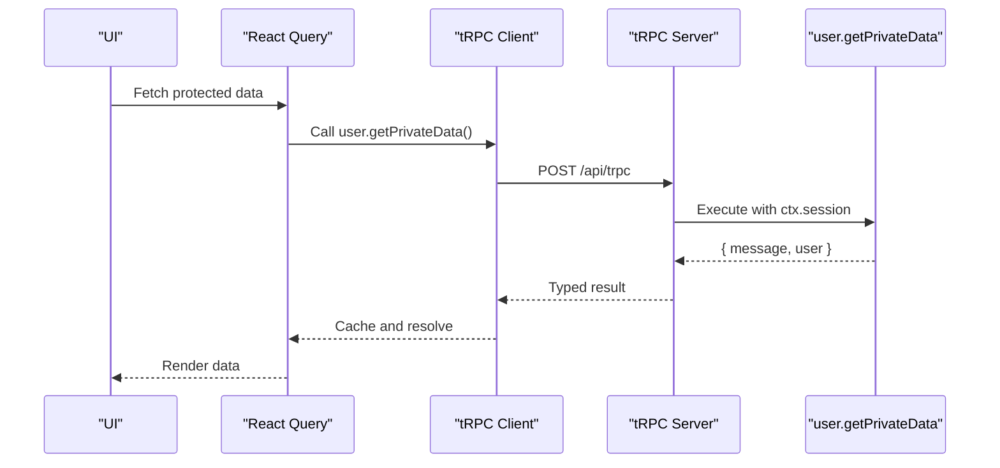
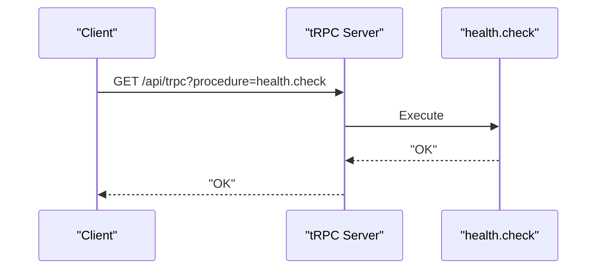
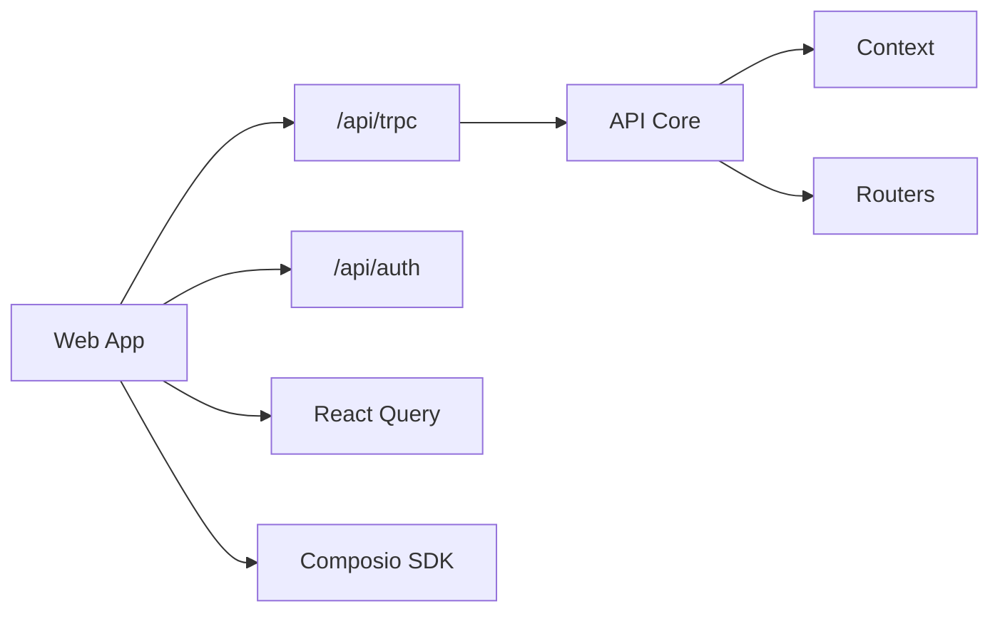

# API Integration

<cite>
**Referenced Files in This Document**
- [route.ts](file://apps/web/src/app/api/trpc/[trpc]/route.ts)
- [trpc.ts](file://apps/web/src/utils/trpc.ts)
- [index.ts (API core)](file://packages/api/src/index.ts)
- [context.ts](file://packages/api/src/context.ts)
- [index.ts (routers)](file://packages/api/src/routers/index.ts)
- [health.ts](file://packages/api/src/routers/health.ts)
- [user.ts](file://packages/api/src/routers/user.ts)
- [route.ts (auth)](file://apps/web/src/app/api/auth/[...all]/route.ts)
- [auth-client.ts](file://apps/web/src/lib/auth-client.ts)
- [composio.ts (server actions)](file://apps/web/src/app/actions/composio.ts)
- [providers.tsx](file://apps/web/src/components/providers.tsx)
</cite>

## Table of Contents

1. Introduction
2. Project Structure
3. Core Components
4. Architecture Overview
5. Detailed Component Analysis
6. Dependency Analysis
7. Performance Considerations
8. Troubleshooting Guide
9. Conclusion
10. Appendices

## Introduction

This document explains the API integration patterns used in the project, focusing on:

- tRPC client-server communication with strong typing and error handling
- Authentication flows via Better Auth
- External service integrations using Composio for third-party tool access
- Mutation handling, query optimization, caching strategies, and real-time update patterns at the API layer

The goal is to provide a clear mental model and practical guidance for building robust, type-safe APIs and integrating external services safely and efficiently.

## Project Structure

The API surface is split between Next.js routes and shared packages:

- tRPC endpoint route exposes a single handler that wires up context and routers
- Shared API package defines procedures, routers, and context
- Authentication is handled by Better Auth with a Next.js adapter
- Client-side tRPC configuration uses React Query for caching and error UX
- Server actions integrate with Composio for third-party tool connections

**Diagram sources**

- [route.ts:1-14](file://apps/web/src/app/api/trpc/[trpc]/route.ts#L1-L14)
- [index.ts (API core):1-26](file://packages/api/src/index.ts#L1-L26)
- [context.ts:1-15](file://packages/api/src/context.ts#L1-L15)
- [index.ts (routers):1-11](file://packages/api/src/routers/index.ts#L1-L11)
- [route.ts (auth):1-5](file://apps/web/src/app/api/auth/[...all]/route.ts#L1-L5)
- [composio.ts (server actions):1-85](file://apps/web/src/app/actions/composio.ts#L1-L85)

**Section sources**

- [route.ts:1-14](file://apps/web/src/app/api/trpc/[trpc]/route.ts#L1-L14)
- [index.ts (API core):1-26](file://packages/api/src/index.ts#L1-L26)
- [context.ts:1-15](file://packages/api/src/context.ts#L1-L15)
- [index.ts (routers):1-11](file://packages/api/src/routers/index.ts#L1-L11)
- [route.ts (auth):1-5](file://apps/web/src/app/api/auth/[...all]/route.ts#L1-L5)
- [composio.ts (server actions):1-85](file://apps/web/src/app/actions/composio.ts#L1-L85)

## Core Components

- tRPC server setup:
  - Centralized procedure definitions and middleware for authorization
  - Context creation that resolves the current session from requests
  - Router composition exposing typed endpoints
- tRPC client:
  - Batched HTTP link with credentials included
  - React Query integration for caching, retries, and error UI
- Authentication:
  - Better Auth Next.js adapter for /api/auth
  - Client plugin setup for auth state and last login method
- External integrations:
  - Server actions to connect/disconnect and list third-party accounts via Composio

Key responsibilities:

- Type safety across client and server via shared AppRouter types
- Secure session resolution in tRPC context
- Consistent error handling and user feedback through React Query and toast notifications
- Isolated integration logic for third-party tools

**Section sources**

- [index.ts (API core):1-26](file://packages/api/src/index.ts#L1-L26)
- [context.ts:1-15](file://packages/api/src/context.ts#L1-L15)
- [index.ts (routers):1-11](file://packages/api/src/routers/index.ts#L1-L11)
- [trpc.ts:1-40](file://apps/web/src/utils/trpc.ts#L1-L40)
- [route.ts (auth):1-5](file://apps/web/src/app/api/auth/[...all]/route.ts#L1-L5)
- [auth-client.ts:1-8](file://apps/web/src/lib/auth-client.ts#L1-L8)
- [composio.ts (server actions):1-85](file://apps/web/src/app/actions/composio.ts#L1-L85)

## Architecture Overview

End-to-end flow for a protected tRPC query and an authentication request:

**Diagram sources**

- [route.ts:1-14](file://apps/web/src/app/api/trpc/[trpc]/route.ts#L1-L14)
- [context.ts:1-15](file://packages/api/src/context.ts#L1-L15)
- [index.ts (API core):1-26](file://packages/api/src/index.ts#L1-L26)
- [trpc.ts:1-40](file://apps/web/src/utils/trpc.ts#L1-L40)

## Detailed Component Analysis

### tRPC Server Setup and Procedures

- The tRPC core initializes procedures and provides public and protected procedure builders.
- Protected procedure enforces session presence and enriches context with session data.
- Routers are composed into a single app router, exporting both the router and its inferred TypeScript type for full-stack typing.

**Diagram sources**

- [index.ts (API core):1-26](file://packages/api/src/index.ts#L1-L26)
- [context.ts:1-15](file://packages/api/src/context.ts#L1-L15)

**Section sources**

- [index.ts (API core):1-26](file://packages/api/src/index.ts#L1-L26)
- [index.ts (routers):1-11](file://packages/api/src/routers/index.ts#L1-L11)
- [health.ts:1-6](file://packages/api/src/routers/health.ts#L1-L6)
- [user.ts:1-9](file://packages/api/src/routers/user.ts#L1-L9)

### tRPC Client Configuration and Error Handling

- The client uses httpBatchLink to reduce network overhead and includes cookies for authenticated requests.
- React Query is configured with a global error handler that shows a toast with a retry action, improving UX on failures.
- The client is wrapped with a TanStack React Query options proxy to simplify hooks usage and ensure consistent caching behavior.

**Diagram sources**

- [trpc.ts:1-40](file://apps/web/src/utils/trpc.ts#L1-L40)
- [providers.tsx:1-27](file://apps/web/src/components/providers.tsx#L1-L27)

**Section sources**

- [trpc.ts:1-40](file://apps/web/src/utils/trpc.ts#L1-L40)
- [providers.tsx:1-27](file://apps/web/src/components/providers.tsx#L1-L27)

### Authentication Flow

- Better Auth exposes a Next.js handler for all auth-related routes under /api/auth.
- The client is initialized with plugins for Telegram and last login method tracking.
- tRPC context resolves the session from incoming headers, enabling protected procedures to rely on it.

**Diagram sources**

- [route.ts (auth):1-5](file://apps/web/src/app/api/auth/[...all]/route.ts#L1-L5)
- [auth-client.ts:1-8](file://apps/web/src/lib/auth-client.ts#L1-L8)
- [context.ts:1-15](file://packages/api/src/context.ts#L1-L15)

**Section sources**

- [route.ts (auth):1-5](file://apps/web/src/app/api/auth/[...all]/route.ts#L1-L5)
- [auth-client.ts:1-8](file://apps/web/src/lib/auth-client.ts#L1-L8)
- [context.ts:1-15](file://packages/api/src/context.ts#L1-L15)

### External Service Integration with Composio

- Server actions handle connecting, disconnecting, and listing third-party integrations.
- They validate the session, create or manage a Composio session per user, and redirect users to authorize access when needed.
- Listing connected accounts filters active or initiated states and returns toolkit slugs for UI display.

**Diagram sources**

- [composio.ts (server actions):1-85](file://apps/web/src/app/actions/composio.ts#L1-L85)

**Section sources**

- [composio.ts (server actions):1-85](file://apps/web/src/app/actions/composio.ts#L1-L85)

### Example Workflows

#### Protected Query Workflow

- A protected query reads private data and returns the current user from the session.
- The client receives strongly-typed data and updates the UI via React Query.

**Diagram sources**

- [user.ts:1-9](file://packages/api/src/routers/user.ts#L1-L9)
- [trpc.ts:1-40](file://apps/web/src/utils/trpc.ts#L1-L40)

**Section sources**

- [user.ts:1-9](file://packages/api/src/routers/user.ts#L1-L9)
- [trpc.ts:1-40](file://apps/web/src/utils/trpc.ts#L1-L40)

#### Health Check Workflow

- A public health check returns a simple status string for readiness probes or diagnostics.

**Diagram sources**

- [health.ts:1-6](file://packages/api/src/routers/health.ts#L1-L6)

**Section sources**

- [health.ts:1-6](file://packages/api/src/routers/health.ts#L1-L6)

## Dependency Analysis

- The tRPC route depends on the shared API package for context and routers.
- The client depends on React Query and tRPC client utilities for batching and caching.
- Authentication integrates via Better Auth’s Next.js adapter and is consumed by both tRPC context and server actions.
- Composio integration is encapsulated in server actions to keep client code free of secrets and complex flows.

**Diagram sources**

- [route.ts:1-14](file://apps/web/src/app/api/trpc/[trpc]/route.ts#L1-L14)
- [index.ts (API core):1-26](file://packages/api/src/index.ts#L1-L26)
- [context.ts:1-15](file://packages/api/src/context.ts#L1-L15)
- [index.ts (routers):1-11](file://packages/api/src/routers/index.ts#L1-L11)
- [route.ts (auth):1-5](file://apps/web/src/app/api/auth/[...all]/route.ts#L1-L5)
- [composio.ts (server actions):1-85](file://apps/web/src/app/actions/composio.ts#L1-L85)

**Section sources**

- [route.ts:1-14](file://apps/web/src/app/api/trpc/[trpc]/route.ts#L1-L14)
- [index.ts (API core):1-26](file://packages/api/src/index.ts#L1-L26)
- [context.ts:1-15](file://packages/api/src/context.ts#L1-L15)
- [index.ts (routers):1-11](file://packages/api/src/routers/index.ts#L1-L11)
- [route.ts (auth):1-5](file://apps/web/src/app/api/auth/[...all]/route.ts#L1-L5)
- [composio.ts (server actions):1-85](file://apps/web/src/app/actions/composio.ts#L1-L85)

## Performance Considerations

- Use batched requests via httpBatchLink to minimize round trips and improve throughput.
- Leverage React Query caching to avoid redundant network calls; configure stale times and refetch policies appropriate to your data freshness needs.
- For read-heavy endpoints, consider server-side caching strategies (e.g., Next.js cache controls) where applicable.
- Keep mutations idempotent and use optimistic updates judiciously to maintain UI responsiveness while preserving correctness.
- Avoid unnecessary re-renders by memoizing derived data and minimizing prop drilling.

[No sources needed since this section provides general guidance]

## Troubleshooting Guide

Common issues and resolutions:

- Unauthorized errors on protected procedures:
  - Ensure cookies are included in client requests and that the session exists in the request headers.
  - Verify that the tRPC context correctly resolves the session and that protected procedures enforce session checks.
- Network or CORS errors:
  - Confirm that the client points to the correct endpoint and that credentials are enabled for cross-origin requests if necessary.
- Toast not appearing on errors:
  - Ensure React Query is provided in the component tree and that the global error handler is configured.
- Composio connection failures:
  - Validate environment variables for API keys and app URLs.
  - Check that the callback URL matches the expected domain and path.

**Section sources**

- [index.ts (API core):1-26](file://packages/api/src/index.ts#L1-L26)
- [context.ts:1-15](file://packages/api/src/context.ts#L1-L15)
- [trpc.ts:1-40](file://apps/web/src/utils/trpc.ts#L1-L40)
- [composio.ts (server actions):1-85](file://apps/web/src/app/actions/composio.ts#L1-L85)

## Conclusion

This project implements a clean, type-safe API layer using tRPC with robust authentication and external service integration patterns. The combination of centralized procedures, secure context, and React Query-powered client caching delivers a responsive and reliable user experience. Integrating third-party tools via server actions keeps sensitive operations server-side and simplifies client logic. Following the patterns outlined here will help you extend the API with new features while maintaining consistency, security, and performance.

[No sources needed since this section summarizes without analyzing specific files]

## Appendices

### Best Practices Summary

- Always define procedures with explicit input/output types and reuse shared types across client and server.
- Enforce authorization in protected procedures and centralize error responses.
- Use React Query for caching, background refetching, and error UX.
- Encapsulate external service interactions in server actions or tRPC procedures to protect secrets and standardize error handling.
- Prefer batched requests and efficient data fetching patterns to optimize performance.

[No sources needed since this section provides general guidance]
