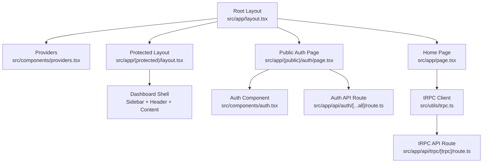
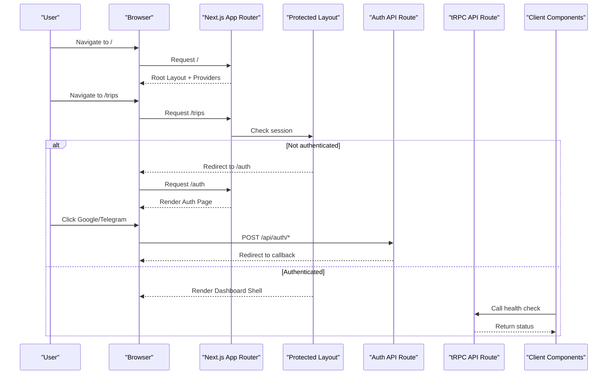
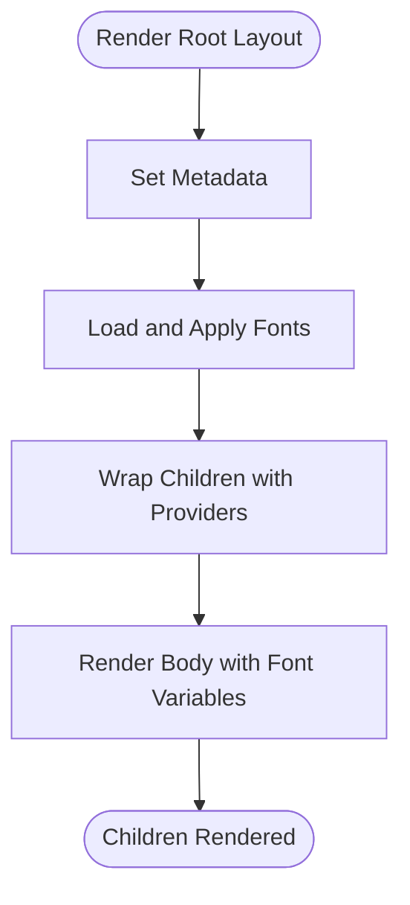
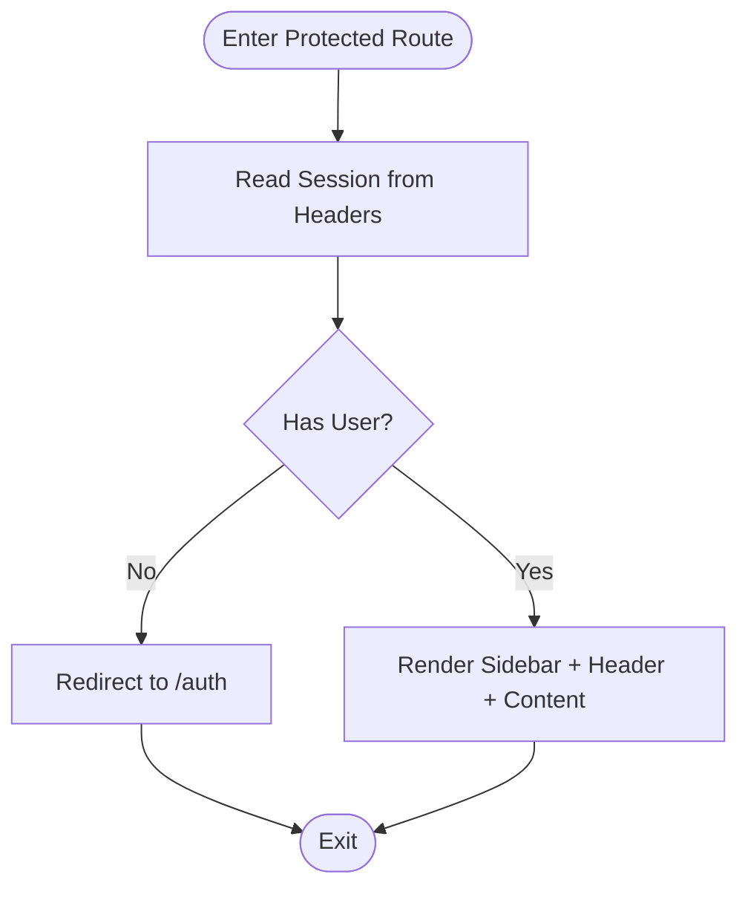
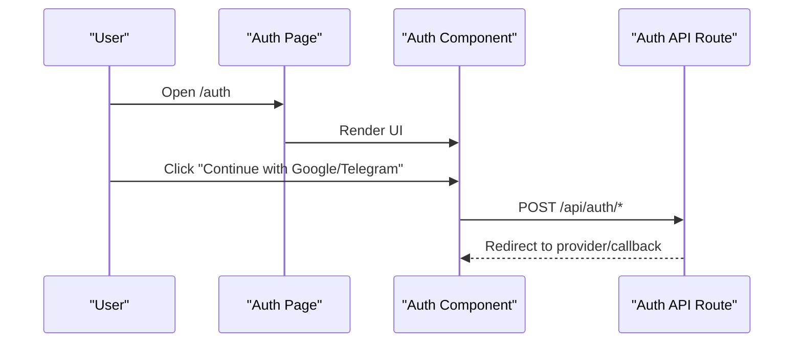
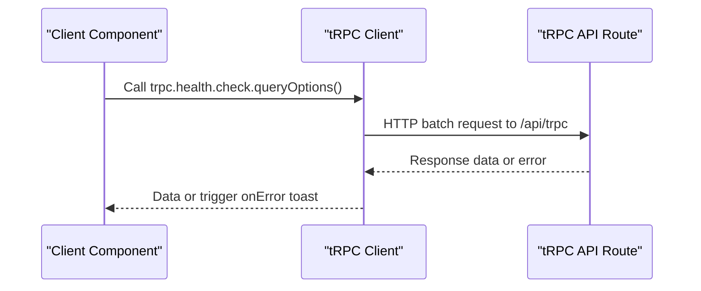
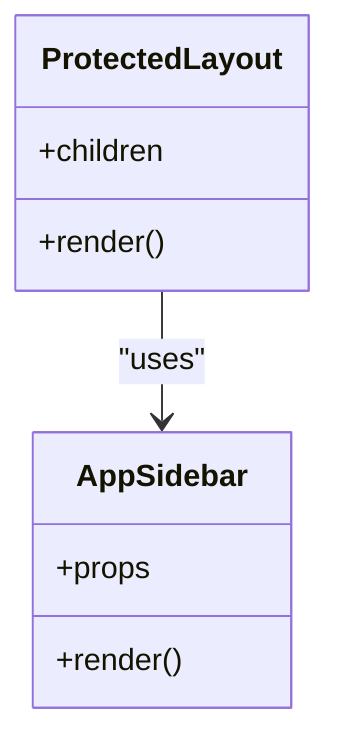

# Application Structure

<cite>
**Referenced Files in This Document**
- [layout.tsx](file://apps/web/src/app/layout.tsx)
- [next.config.ts](file://apps/web/next.config.ts)
- [package.json](file://apps/web/package.json)
- [protected layout.tsx](file://apps/web/src/app/(protected)/layout.tsx)
- [providers.tsx](file://apps/web/src/components/providers.tsx)
- [page.tsx](file://apps/web/src/app/page.tsx)
- [auth page.tsx](file://apps/web/src/app/(public)/auth/page.tsx)
- [theme-provider.tsx](file://apps/web/src/components/theme-provider.tsx)
- [trpc.ts](file://apps/web/src/utils/trpc.ts)
- [auth route.ts](file://apps/web/src/app/api/auth/[...all]/route.ts)
- [trpc route.ts](file://apps/web/src/app/api/trpc/[trpc]/route.ts)
- [auth component.tsx](file://apps/web/src/components/auth.tsx)
- [app-sidebar.tsx](file://apps/web/src/components/app-sidebar.tsx)
</cite>

## Table of Contents

1. [Introduction](#introduction)
2. [Project Structure](#project-structure)
3. [Core Components](#core-components)
4. [Architecture Overview](#architecture-overview)
5. [Detailed Component Analysis](#detailed-component-analysis)
6. [Dependency Analysis](#dependency-analysis)
7. [Performance Considerations](#performance-considerations)
8. [Troubleshooting Guide](#troubleshooting-guide)
9. [Conclusion](#conclusion)
10. [Appendices](#appendices)

## Introduction

This document explains the Next.js App Router architecture for the web application, focusing on root layout configuration with Providers, font optimization via next/font, metadata setup, protected and public route groups, API routes, component organization patterns, build configuration, dependencies, and development workflow. It also includes examples of page composition, layout nesting, and asset management strategies.

## Project Structure

The application is organized under apps/web using the Next.js App Router:

- Root layout at src/app/layout.tsx sets global HTML structure, fonts, metadata, and wraps all pages with Providers.
- Route groups:
  - (protected): Server-side protected layout that enforces authentication and provides a sidebar-based dashboard shell.
  - (public)/auth: Public authentication entry point.
- API routes:
  - /api/auth/[...all]: Better-Auth handler for authentication endpoints.
  - /api/trpc/[trpc]: tRPC server adapter for type-safe client-server communication.
- Components:
  - providers.tsx: Client-side context provider for theme and data fetching.
  - theme-provider.tsx: Theme abstraction over next-themes.
  - app-sidebar.tsx: Collapsible sidebar with navigation and user menu.
  - auth.tsx: Sign-in UI with social providers.
- Utilities:
  - utils/trpc.ts: tRPC client setup with React Query integration and error handling.

**Diagram sources**

- [layout.tsx:21-46](file://apps/web/src/app/layout.tsx#L21-L46)
- [protected layout.tsx:22-65](<file://apps/web/src/app/(protected)/layout.tsx#L22-L65>)
- [providers.tsx:11-25](file://apps/web/src/components/providers.tsx#L11-L25)
- [auth page.tsx:5-7](<file://apps/web/src/app/(public)/auth/page.tsx#L5-L7>)
- [auth component.tsx:22-68](file://apps/web/src/components/auth.tsx#L22-L68)
- [page.tsx:8-38](file://apps/web/src/app/page.tsx#L8-L38)
- [trpc.ts:22-39](file://apps/web/src/utils/trpc.ts#L22-L39)
- [trpc route.ts:6-13](file://apps/web/src/app/api/trpc/[trpc]/route.ts#L6-L13)
- [auth route.ts:1-5](file://apps/web/src/app/api/auth/[...all]/route.ts#L1-L5)

**Section sources**

- [layout.tsx:1-46](file://apps/web/src/app/layout.tsx#L1-L46)
- [protected layout.tsx:1-66](<file://apps/web/src/app/(protected)/layout.tsx#L1-L66>)
- [providers.tsx:1-27](file://apps/web/src/components/providers.tsx#L1-L27)
- [auth page.tsx:1-8](<file://apps/web/src/app/(public)/auth/page.tsx#L1-L8>)
- [auth component.tsx:1-69](file://apps/web/src/components/auth.tsx#L1-L69)
- [page.tsx:1-39](file://apps/web/src/app/page.tsx#L1-L39)
- [trpc.ts:1-40](file://apps/web/src/utils/trpc.ts#L1-L40)
- [auth route.ts:1-5](file://apps/web/src/app/api/auth/[...all]/route.ts#L1-L5)
- [trpc route.ts:1-14](file://apps/web/src/app/api/trpc/[trpc]/route.ts#L1-L14)

## Core Components

- Root layout:
  - Defines global metadata (title, description).
  - Optimizes fonts using next/font (Inter, Geist Sans, Geist Mono) and applies CSS variables to <html> and <body>.
  - Wraps children with Providers to inject theme and query client contexts.
- Providers:
  - Client-only wrapper combining ThemeProvider and QueryClientProvider.
  - Renders Toaster for notifications.
- Protected layout:
  - Server component that checks session via Better-Auth and redirects unauthenticated users to /auth.
  - Provides a consistent dashboard shell with SidebarProvider, header, and content area.
- Public auth page:
  - Minimal client page rendering the Auth component for sign-in flows.
- Home page:
  - Client component demonstrating tRPC usage and React Query integration for status display.

**Section sources**

- [layout.tsx:21-46](file://apps/web/src/app/layout.tsx#L21-L46)
- [providers.tsx:11-25](file://apps/web/src/components/providers.tsx#L11-L25)
- [protected layout.tsx:22-65](<file://apps/web/src/app/(protected)/layout.tsx#L22-L65>)
- [auth page.tsx:5-7](<file://apps/web/src/app/(public)/auth/page.tsx#L5-L7>)
- [page.tsx:8-38](file://apps/web/src/app/page.tsx#L8-L38)

## Architecture Overview

The application uses Next.js App Router with:

- Global root layout for shared HTML, fonts, metadata, and Providers.
- Route groups to separate protected and public areas.
- tRPC for type-safe client-server calls through a dedicated API route.
- Better-Auth for authentication endpoints exposed under /api/auth.

**Diagram sources**

- [protected layout.tsx:27-33](<file://apps/web/src/app/(protected)/layout.tsx#L27-L33>)
- [auth route.ts:1-5](file://apps/web/src/app/api/auth/[...all]/route.ts#L1-L5)
- [trpc route.ts:6-13](file://apps/web/src/app/api/trpc/[trpc]/route.ts#L6-L13)
- [page.tsx:8-38](file://apps/web/src/app/page.tsx#L8-L38)

## Detailed Component Analysis

### Root Layout and Metadata

- Metadata:
  - Sets title and description globally for SEO and browser tabs.
- Fonts:
  - Uses next/font to optimize loading of Inter and Geist fonts, exposing CSS variables for Tailwind integration.
- Providers:
  - Ensures theme and query client are available throughout the app.

**Diagram sources**

- [layout.tsx:21-46](file://apps/web/src/app/layout.tsx#L21-L46)

**Section sources**

- [layout.tsx:1-46](file://apps/web/src/app/layout.tsx#L1-L46)

### Protected Route Group

- Authentication enforcement:
  - Server component reads session from Better-Auth headers and redirects if missing.
- Dashboard shell:
  - Provides SidebarProvider, header with mode toggle and agent button, and scrollable content area.

**Diagram sources**

- [protected layout.tsx:27-33](<file://apps/web/src/app/(protected)/layout.tsx#L27-L33>)
- [protected layout.tsx:35-65](<file://apps/web/src/app/(protected)/layout.tsx#L35-L65>)

**Section sources**

- [protected layout.tsx:1-66](<file://apps/web/src/app/(protected)/layout.tsx#L1-L66>)

### Public Auth Flow

- Auth page renders a client component that initiates social sign-in flows.
- Backend exposes Better-Auth handlers under /api/auth.

**Diagram sources**

- [auth page.tsx:5-7](<file://apps/web/src/app/(public)/auth/page.tsx#L5-L7>)
- [auth component.tsx:9-20](file://apps/web/src/components/auth.tsx#L9-L20)
- [auth route.ts:1-5](file://apps/web/src/app/api/auth/[...all]/route.ts#L1-L5)

**Section sources**

- [auth page.tsx:1-8](<file://apps/web/src/app/(public)/auth/page.tsx#L1-L8>)
- [auth component.tsx:1-69](file://apps/web/src/components/auth.tsx#L1-L69)
- [auth route.ts:1-5](file://apps/web/src/app/api/auth/[...all]/route.ts#L1-L5)

### tRPC Integration

- Client:
  - Creates a QueryClient with error handling that shows toast notifications and retry actions.
  - Configures httpBatchLink to /api/trpc with credentials included.
- Server:
  - Exposes fetchRequestHandler for GET/POST to process tRPC requests with context creation.

**Diagram sources**

- [trpc.ts:7-39](file://apps/web/src/utils/trpc.ts#L7-L39)
- [trpc route.ts:6-13](file://apps/web/src/app/api/trpc/[trpc]/route.ts#L6-L13)
- [page.tsx:8-38](file://apps/web/src/app/page.tsx#L8-L38)

**Section sources**

- [trpc.ts:1-40](file://apps/web/src/utils/trpc.ts#L1-L40)
- [trpc route.ts:1-14](file://apps/web/src/app/api/trpc/[trpc]/route.ts#L1-L14)
- [page.tsx:1-39](file://apps/web/src/app/page.tsx#L1-L39)

### Sidebar and Navigation

- AppSidebar:
  - Collapsible sidebar with main navigation and user menu sections.
- Protected layout:
  - Integrates SidebarProvider and SidebarInset to manage responsive behavior and layout constraints.

**Diagram sources**

- [app-sidebar.tsx:13-24](file://apps/web/src/components/app-sidebar.tsx#L13-L24)
- [protected layout.tsx:35-65](<file://apps/web/src/app/(protected)/layout.tsx#L35-L65>)

**Section sources**

- [app-sidebar.tsx:1-25](file://apps/web/src/components/app-sidebar.tsx#L1-L25)
- [protected layout.tsx:1-66](<file://apps/web/src/app/(protected)/layout.tsx#L1-L66>)

## Dependency Analysis

Key runtime and dev dependencies relevant to structure and performance:

- Runtime:
  - next, react, react-dom for framework and UI.
  - @tanstack/react-query and @trpc/* for data fetching and type-safe APIs.
  - better-auth and better-auth-telegram for authentication.
  - lucide-react for icons; optimized via experimental.optimizePackageImports.
  - next-themes for theme switching.
- Dev:
  - tailwindcss, @tailwindcss/postcss for styling.
  - typescript for type safety.

Build and runtime features:

- cacheComponents enabled for improved performance.
- partialPrefetching enabled for faster navigation.
- reactCompiler enabled for compile-time optimizations.
- images.remotePatterns configured for external image domains.
- rewrites proxy /api/eve/* to runtime service.

**Section sources**

- [package.json:1-47](file://apps/web/package.json#L1-L47)
- [next.config.ts:1-31](file://apps/web/next.config.ts#L1-L31)

## Performance Considerations

- Font optimization:
  - next/font reduces layout shifts and improves load times by serving optimized font files and applying CSS variables.
- Component caching:
  - cacheComponents speeds up repeated renders across routes.
- Partial prefetching:
  - partialPrefetching preloads likely resources during navigation.
- React Compiler:
  - Enables compile-time optimizations to reduce unnecessary re-renders.
- Package import optimization:
  - optimizePackageImports targets large icon libraries to minimize bundle size.
- Image remote patterns:
  - Restricts allowed remote image hosts to improve security and enable optimization.

[No sources needed since this section provides general guidance]

## Troubleshooting Guide

- Authentication redirects:
  - If protected routes redirect unexpectedly, verify session retrieval and headers propagation in the protected layout.
- tRPC errors:
  - Errors surface via React Query’s onError hook, showing a toast with a retry action. Inspect network requests to /api/trpc and ensure credentials are included.
- Theme issues:
  - Ensure ThemeProvider is mounted and attribute="class" is set for proper Tailwind theme toggling.
- Build warnings:
  - Review experimental flags in next.config.ts if encountering compatibility issues with Turbopack or React Compiler.

**Section sources**

- [protected layout.tsx:27-33](<file://apps/web/src/app/(protected)/layout.tsx#L27-L33>)
- [trpc.ts:7-20](file://apps/web/src/utils/trpc.ts#L7-L20)
- [theme-provider.tsx:6-11](file://apps/web/src/components/theme-provider.tsx#L6-L11)
- [next.config.ts:4-19](file://apps/web/next.config.ts#L4-L19)

## Conclusion

The application leverages Next.js App Router to provide a robust, scalable structure:

- Root layout centralizes metadata, fonts, and global providers.
- Route groups cleanly separate protected and public experiences.
- tRPC and Better-Auth integrate seamlessly for type-safe APIs and authentication.
- Build configuration optimizes performance while maintaining developer ergonomics. This architecture supports efficient development workflows, clear separation of concerns, and strong performance characteristics.

[No sources needed since this section summarizes without analyzing specific files]

## Appendices

### Directory Organization Summary

- src/app:
  - layout.tsx: Root layout with Providers and fonts.
  - (protected)/layout.tsx: Server-side auth guard and dashboard shell.
  - (public)/auth/page.tsx: Public authentication entry.
  - api:
    - auth/[...all]/route.ts: Better-Auth endpoints.
    - trpc/[trpc]/route.ts: tRPC server adapter.
- src/components:
  - providers.tsx: Client-side context providers.
  - theme-provider.tsx: Theme abstraction.
  - app-sidebar.tsx: Sidebar navigation.
  - auth.tsx: Sign-in UI.
- src/utils:
  - trpc.ts: tRPC client configuration.

**Section sources**

- [layout.tsx:1-46](file://apps/web/src/app/layout.tsx#L1-L46)
- [protected layout.tsx:1-66](<file://apps/web/src/app/(protected)/layout.tsx#L1-L66>)
- [auth page.tsx:1-8](<file://apps/web/src/app/(public)/auth/page.tsx#L1-L8>)
- [auth route.ts:1-5](file://apps/web/src/app/api/auth/[...all]/route.ts#L1-L5)
- [trpc route.ts:1-14](file://apps/web/src/app/api/trpc/[trpc]/route.ts#L1-L14)
- [providers.tsx:1-27](file://apps/web/src/components/providers.tsx#L1-L27)
- [theme-provider.tsx:1-12](file://apps/web/src/components/theme-provider.tsx#L1-L12)
- [app-sidebar.tsx:1-25](file://apps/web/src/components/app-sidebar.tsx#L1-L25)
- [auth component.tsx:1-69](file://apps/web/src/components/auth.tsx#L1-L69)
- [trpc.ts:1-40](file://apps/web/src/utils/trpc.ts#L1-L40)
