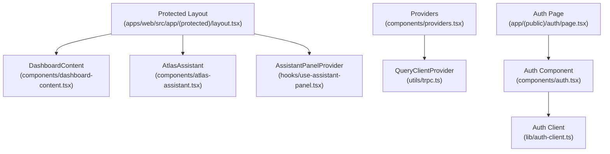
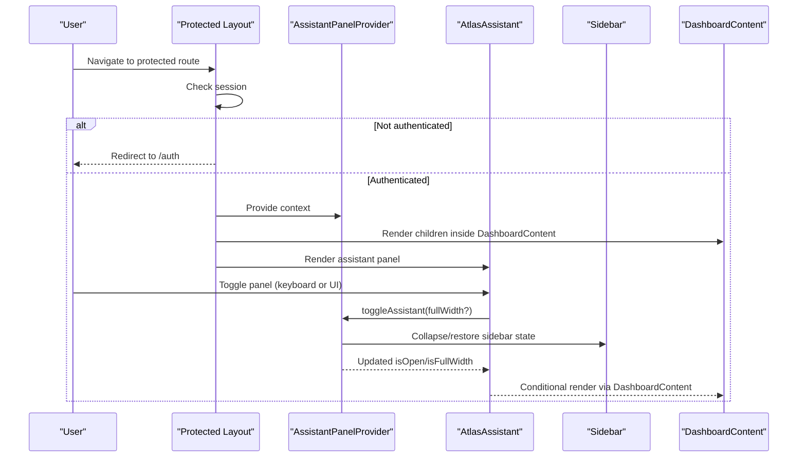
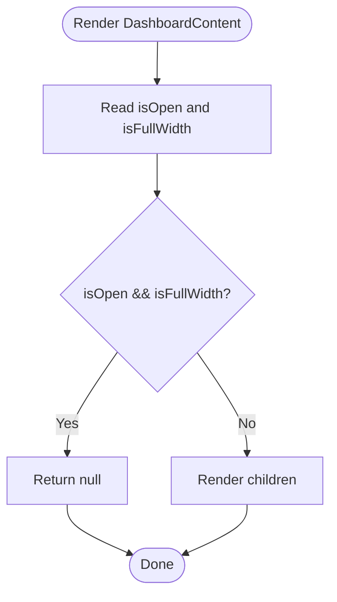
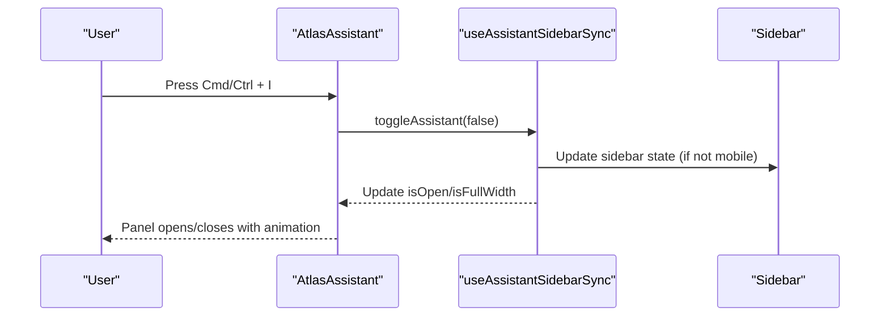
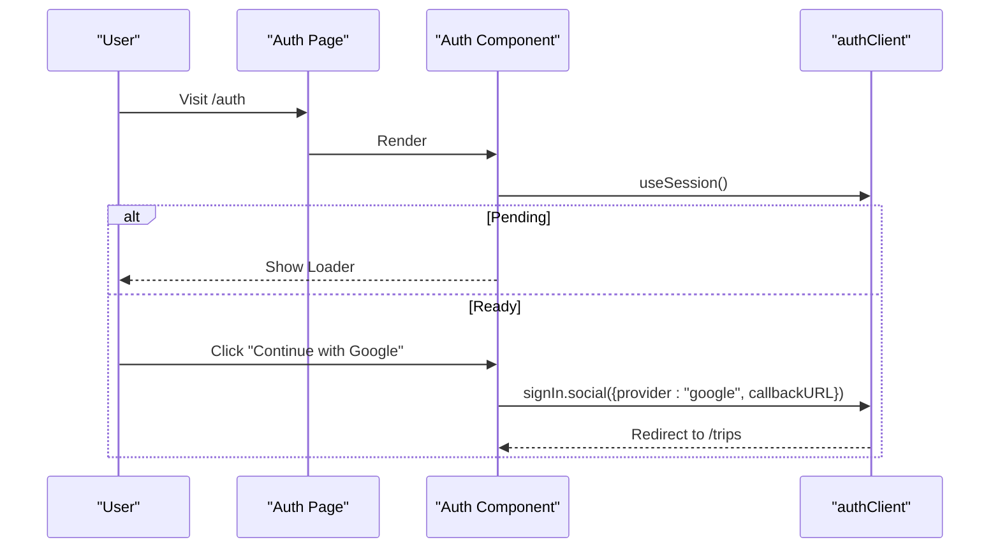
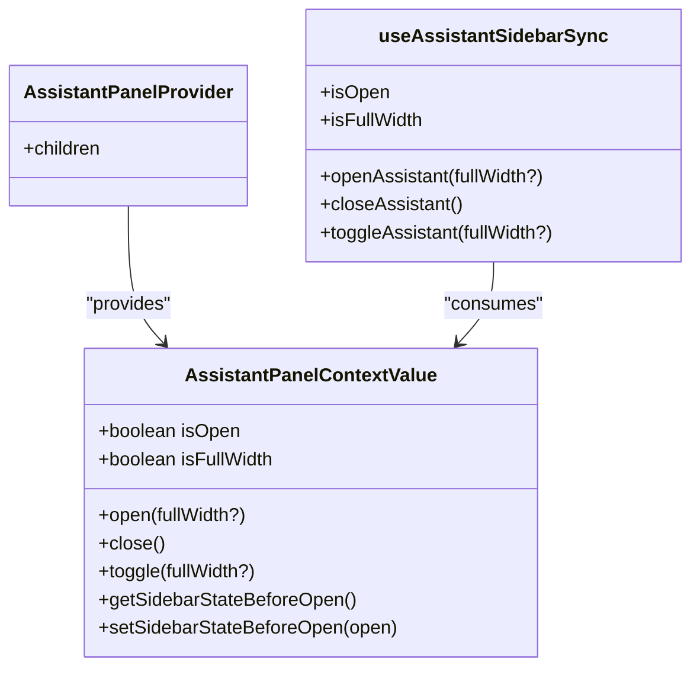
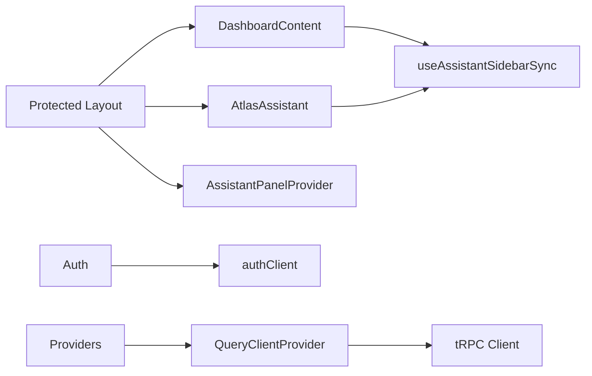

# Business Logic Components

<cite>
**Referenced Files in This Document**
- [dashboard-content.tsx](file://apps/web/src/components/dashboard-content.tsx)
- [atlas-assistant.tsx](file://apps/web/src/components/atlas-assistant.tsx)
- [auth.tsx](file://apps/web/src/components/auth.tsx)
- [use-assistant-panel.tsx](file://apps/web/src/hooks/use-assistant-panel.tsx)
- [providers.tsx](file://apps/web/src/components/providers.tsx)
- [layout.tsx](file://apps/web/src/app/(protected)/layout.tsx)
- [page.tsx](file://apps/web/src/app/(public)/auth/page.tsx)
- [auth-client.ts](file://apps/web/src/lib/auth-client.ts)
- [trpc.ts](file://apps/web/src/utils/trpc.ts)
- [package.json](file://apps/web/package.json)
</cite>

## Table of Contents

1. [Introduction](#introduction)
2. [Project Structure](#project-structure)
3. [Core Components](#core-components)
4. [Architecture Overview](#architecture-overview)
5. [Detailed Component Analysis](#detailed-component-analysis)
6. [Dependency Analysis](#dependency-analysis)
7. [Performance Considerations](#performance-considerations)
8. [Troubleshooting Guide](#troubleshooting-guide)
9. [Conclusion](#conclusion)
10. [Appendices](#appendices)

## Introduction

This document explains the business logic components that power the application’s main content layout, AI assistant panel, and authentication flow. It focuses on:

- DashboardContent for conditional rendering based on assistant state
- AtlasAssistant for the AI chat interface and user interactions
- Auth for sign-in flows with Google and Telegram
- State management patterns via React Context and hooks
- API integration strategies using Better-Auth and tRPC
- Error handling approaches and user interaction flows
- Lifecycle management, performance optimizations, and testing strategies

## Project Structure

The web app is a Next.js application organized into pages, shared components, hooks, utilities, and providers. Key areas relevant to this documentation:

- Protected routes wrap content with sidebar, dashboard content, and assistant panel
- Public routes host the authentication page
- Providers configure global context (theme, query client)
- Utilities define tRPC client configuration and error handling

**Diagram sources**

- [layout.tsx:22-65](<file://apps/web/src/app/(protected)/layout.tsx#L22-L65>)
- [dashboard-content.tsx:5-17](file://apps/web/src/components/dashboard-content.tsx#L5-L17)
- [atlas-assistant.tsx:122-174](file://apps/web/src/components/atlas-assistant.tsx#L122-L174)
- [use-assistant-panel.tsx:67-151](file://apps/web/src/hooks/use-assistant-panel.tsx#L67-L151)
- [providers.tsx:11-26](file://apps/web/src/components/providers.tsx#L11-L26)
- [trpc.ts:7-39](file://apps/web/src/utils/trpc.ts#L7-L39)
- [page.tsx:5-7](<file://apps/web/src/app/(public)/auth/page.tsx#L5-L7>)
- [auth.tsx:22-68](file://apps/web/src/components/auth.tsx#L22-L68)
- [auth-client.ts:5-7](file://apps/web/src/lib/auth-client.ts#L5-L7)

**Section sources**

- [layout.tsx:22-65](<file://apps/web/src/app/(protected)/layout.tsx#L22-L65>)
- [providers.tsx:11-26](file://apps/web/src/components/providers.tsx#L11-L26)
- [trpc.ts:7-39](file://apps/web/src/utils/trpc.ts#L7-L39)

## Core Components

- DashboardContent: Renders children unless the assistant panel is open and set to full width; used to hide main content when the assistant occupies the entire viewport.
- AtlasAssistant: Side panel UI for the AI assistant with header controls, empty state suggestions, and a disabled composer placeholder; integrates keyboard shortcuts and syncs with the app sidebar.
- Auth: Sign-in page offering Google and Telegram login; shows loading state while session is being checked and highlights the last used method.

Key responsibilities:

- State synchronization between assistant panel and sidebar
- Persistent panel state across navigation
- Keyboard accessibility for toggling the assistant
- Authentication flow orchestration with Better-Auth

**Section sources**

- [dashboard-content.tsx:5-17](file://apps/web/src/components/dashboard-content.tsx#L5-L17)
- [atlas-assistant.tsx:122-174](file://apps/web/src/components/atlas-assistant.tsx#L122-L174)
- [auth.tsx:22-68](file://apps/web/src/components/auth.tsx#L22-L68)
- [use-assistant-panel.tsx:67-151](file://apps/web/src/hooks/use-assistant-panel.tsx#L67-L151)

## Architecture Overview

The protected layout orchestrates authentication checks, provides global contexts, and composes the dashboard and assistant panels. The assistant panel state is managed by a custom hook backed by React Context and persisted to localStorage. The auth component uses Better-Auth client plugins to handle social sign-ins and track the last used method.

**Diagram sources**

- [layout.tsx:22-65](<file://apps/web/src/app/(protected)/layout.tsx#L22-L65>)
- [use-assistant-panel.tsx:169-234](file://apps/web/src/hooks/use-assistant-panel.tsx#L169-L234)
- [atlas-assistant.tsx:122-174](file://apps/web/src/components/atlas-assistant.tsx#L122-L174)
- [dashboard-content.tsx:5-17](file://apps/web/src/components/dashboard-content.tsx#L5-L17)

## Detailed Component Analysis

### DashboardContent

Purpose:

- Conditionally hides main content when the assistant panel is open and set to full width.
- Acts as a lightweight wrapper around page content to coordinate visibility with the assistant panel.

State and behavior:

- Reads assistant panel state from useAssistantSidebarSync.
- Returns null if the assistant is open and full width; otherwise renders children.

Lifecycle considerations:

- No side effects; purely presentational based on context state.

Performance:

- Minimal re-renders since it only reads boolean flags.

Testing strategy:

- Verify rendering behavior under different assistant states (open/closed, fullWidth true/false).
- Mock useAssistantSidebarSync to assert conditional rendering.

**Diagram sources**

- [dashboard-content.tsx:5-17](file://apps/web/src/components/dashboard-content.tsx#L5-L17)
- [use-assistant-panel.tsx:169-234](file://apps/web/src/hooks/use-assistant-panel.tsx#L169-L234)

**Section sources**

- [dashboard-content.tsx:5-17](file://apps/web/src/components/dashboard-content.tsx#L5-L17)

### AtlasAssistant

Purpose:

- Provides an AI assistant side panel with header controls, empty state suggestions, and a placeholder composer.
- Integrates keyboard shortcuts (Cmd/Ctrl + I) to toggle the panel.
- Syncs with the app sidebar to manage space and restore previous state.

State and behavior:

- Uses useAssistantSidebarSync for open/fullWidth state and actions.
- Subscribes to keydown events to toggle the panel.
- Renders header buttons to close or expand/collapse the panel.

User interaction flows:

- Keyboard shortcut toggles the panel.
- Header buttons control panel visibility and width.
- Suggestion buttons are placeholders until AI backend integration.

Accessibility:

- aria-hidden toggled based on open state.
- aria-labels for interactive elements.

Performance:

- Lightweight UI; disabled inputs avoid unnecessary event handling.
- Uses CSS transitions for smooth animations.

Testing strategy:

- Simulate keyboard events to verify toggle behavior.
- Assert header button handlers call correct context methods.
- Validate aria attributes reflect panel state.

**Diagram sources**

- [atlas-assistant.tsx:122-174](file://apps/web/src/components/atlas-assistant.tsx#L122-L174)
- [use-assistant-panel.tsx:169-234](file://apps/web/src/hooks/use-assistant-panel.tsx#L169-L234)

**Section sources**

- [atlas-assistant.tsx:122-174](file://apps/web/src/components/atlas-assistant.tsx#L122-L174)
- [use-assistant-panel.tsx:169-234](file://apps/web/src/hooks/use-assistant-panel.tsx#L169-L234)

### Auth

Purpose:

- Presents sign-in options (Google, Telegram) and manages session loading state.
- Highlights the last used login method for convenience.

State and behavior:

- Uses authClient.useSession() to detect pending authentication.
- Calls authClient.signIn.social for Google and authClient.signInWithTelegramOIDC for Telegram.
- Displays a loader while session status is being determined.

API integration:

- Relies on Better-Auth client configured with Telegram plugin and last login method tracking.

Error handling:

- Session pending state prevents premature rendering of UI.
- Errors during sign-in should be surfaced via provider-level toast mechanisms (see tRPC error handling pattern).

Testing strategy:

- Mock authClient methods to simulate successful and failed sign-ins.
- Assert redirect behavior after successful sign-in (callbackURL).
- Verify loader display during session check.

**Diagram sources**

- [page.tsx:5-7](<file://apps/web/src/app/(public)/auth/page.tsx#L5-L7>)
- [auth.tsx:22-68](file://apps/web/src/components/auth.tsx#L22-L68)
- [auth-client.ts:5-7](file://apps/web/src/lib/auth-client.ts#L5-L7)

**Section sources**

- [auth.tsx:22-68](file://apps/web/src/components/auth.tsx#L22-L68)
- [auth-client.ts:5-7](file://apps/web/src/lib/auth-client.ts#L5-L7)
- [page.tsx:5-7](<file://apps/web/src/app/(public)/auth/page.tsx#L5-L7>)

### Assistant Panel State Management (use-assistant-panel.tsx)

Purpose:

- Manages assistant panel open/fullWidth state and persists it to localStorage.
- Coordinates with the app sidebar to collapse/restore its state when opening/closing the panel.
- Exposes a unified hook for components to interact with the panel.

Key features:

- Context-based state sharing across components.
- Persistence via localStorage with safe fallbacks.
- Mobile-aware behavior (no sidebar changes on overlay mode).
- Snapshotting sidebar state before opening to restore later.

Complexity:

- O(1) operations for open/close/toggle.
- Minimal re-renders due to memoized callbacks and values.

Testing strategy:

- Test persistence keys and values in localStorage.
- Verify sidebar state restoration on close.
- Ensure no sidebar mutation on mobile.

**Diagram sources**

- [use-assistant-panel.tsx:20-28](file://apps/web/src/hooks/use-assistant-panel.tsx#L20-L28)
- [use-assistant-panel.tsx:67-151](file://apps/web/src/hooks/use-assistant-panel.tsx#L67-L151)
- [use-assistant-panel.tsx:169-234](file://apps/web/src/hooks/use-assistant-panel.tsx#L169-L234)

**Section sources**

- [use-assistant-panel.tsx:67-151](file://apps/web/src/hooks/use-assistant-panel.tsx#L67-L151)
- [use-assistant-panel.tsx:169-234](file://apps/web/src/hooks/use-assistant-panel.tsx#L169-L234)

## Dependency Analysis

- DashboardContent depends on useAssistantSidebarSync for visibility logic.
- AtlasAssistant depends on useAssistantSidebarSync for state and actions.
- Protected layout composes AssistantPanelProvider, DashboardContent, and AtlasAssistant.
- Auth depends on authClient configured with Better-Auth plugins.
- Providers wrap the app with theme and query client contexts.
- tRPC client configures error handling via toast notifications.

**Diagram sources**

- [dashboard-content.tsx:5-17](file://apps/web/src/components/dashboard-content.tsx#L5-L17)
- [atlas-assistant.tsx:122-174](file://apps/web/src/components/atlas-assistant.tsx#L122-L174)
- [use-assistant-panel.tsx:67-151](file://apps/web/src/hooks/use-assistant-panel.tsx#L67-L151)
- [layout.tsx:22-65](<file://apps/web/src/app/(protected)/layout.tsx#L22-L65>)
- [auth.tsx:22-68](file://apps/web/src/components/auth.tsx#L22-L68)
- [auth-client.ts:5-7](file://apps/web/src/lib/auth-client.ts#L5-L7)
- [providers.tsx:11-26](file://apps/web/src/components/providers.tsx#L11-L26)
- [trpc.ts:7-39](file://apps/web/src/utils/trpc.ts#L7-L39)

**Section sources**

- [layout.tsx:22-65](<file://apps/web/src/app/(protected)/layout.tsx#L22-L65>)
- [providers.tsx:11-26](file://apps/web/src/components/providers.tsx#L11-L26)
- [trpc.ts:7-39](file://apps/web/src/utils/trpc.ts#L7-L39)

## Performance Considerations

- Avoid unnecessary re-renders:
  - DashboardContent is minimal and only reads booleans.
  - AtlasAssistant disables input fields to prevent event overhead.
- Use memoization where appropriate:
  - Context values and callbacks are memoized in the panel provider.
- Persisted state:
  - localStorage usage is wrapped with try/catch to avoid blocking on storage errors.
- Network requests:
  - tRPC client includes credentials for cookies and centralizes error handling with retry actions via toast.

[No sources needed since this section provides general guidance]

## Troubleshooting Guide

Common issues and resolutions:

- Assistant panel not persisting:
  - Check localStorage availability and permissions; the provider handles failures gracefully.
- Sidebar state not restored:
  - Ensure the snapshot is saved before opening and restored on close; verify mobile vs desktop behavior.
- Authentication redirects not working:
  - Confirm callbackURL is set correctly and session is established server-side in protected layout.
- tRPC errors not displayed:
  - Verify QueryCache onError is configured and toast library is available.

**Section sources**

- [use-assistant-panel.tsx:46-61](file://apps/web/src/hooks/use-assistant-panel.tsx#L46-L61)
- [use-assistant-panel.tsx:169-234](file://apps/web/src/hooks/use-assistant-panel.tsx#L169-L234)
- [layout.tsx:27-33](<file://apps/web/src/app/(protected)/layout.tsx#L27-L33>)
- [trpc.ts:7-20](file://apps/web/src/utils/trpc.ts#L7-L20)

## Conclusion

The business logic components form a cohesive system:

- DashboardContent ensures content visibility aligns with assistant panel state.
- AtlasAssistant delivers a responsive, accessible AI panel integrated with the app’s sidebar.
- Auth streamlines sign-in flows with social providers and tracks last-used methods.
- State management leverages React Context with persistence and robust error handling.
- API integration uses Better-Auth and tRPC with centralized error feedback.

These patterns provide a scalable foundation for adding AI capabilities, managing user sessions, and maintaining a consistent user experience across the application.

[No sources needed since this section summarizes without analyzing specific files]

## Appendices

### Testing Strategies Summary

- Unit tests for components:
  - Render conditions for DashboardContent based on assistant state.
  - Keyboard event handling in AtlasAssistant.
  - Auth button handlers and session pending state.
- Integration tests:
  - Verify sidebar state changes when toggling the assistant.
  - Confirm localStorage updates for panel state.
- API tests:
  - Mock Better-Auth client methods to validate sign-in flows.
  - Assert tRPC error handling triggers retries via toast.

[No sources needed since this section provides general guidance]
