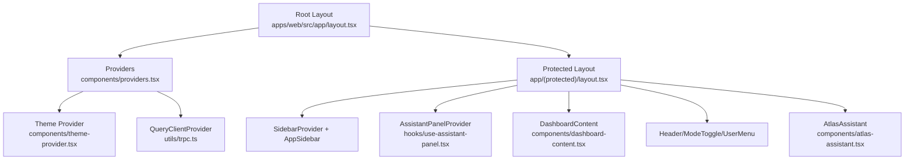
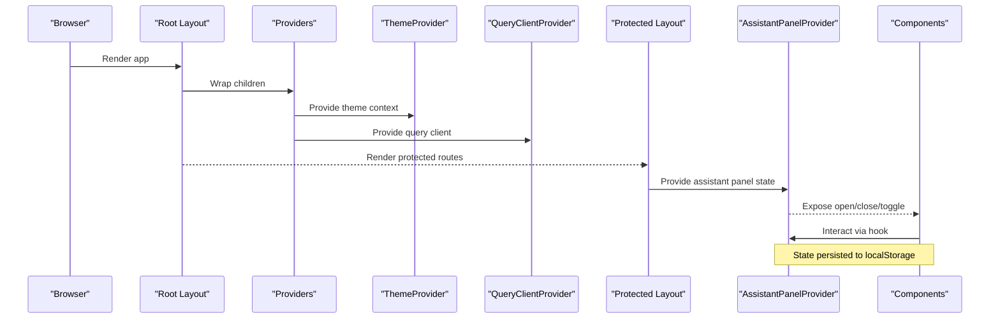
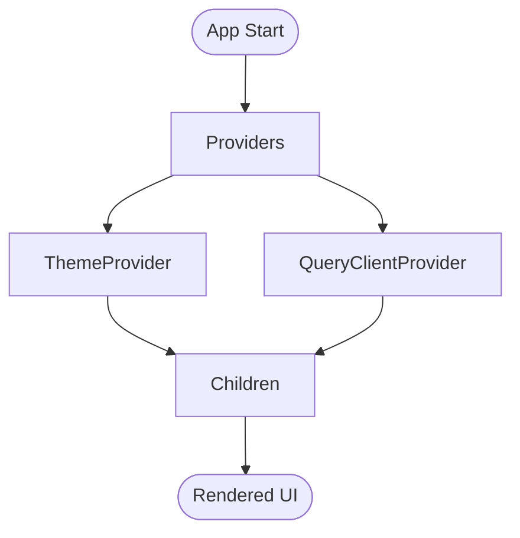
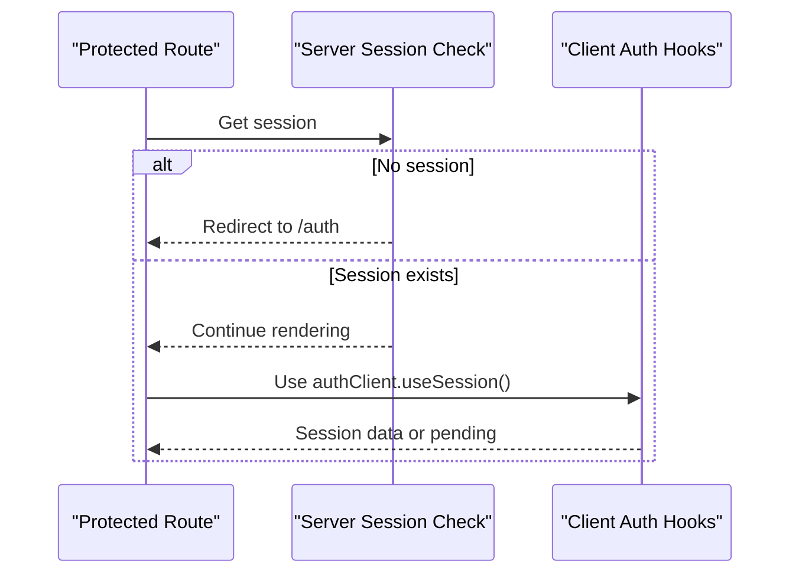
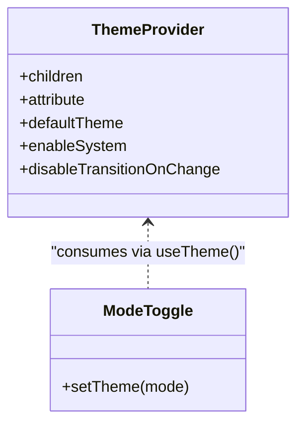
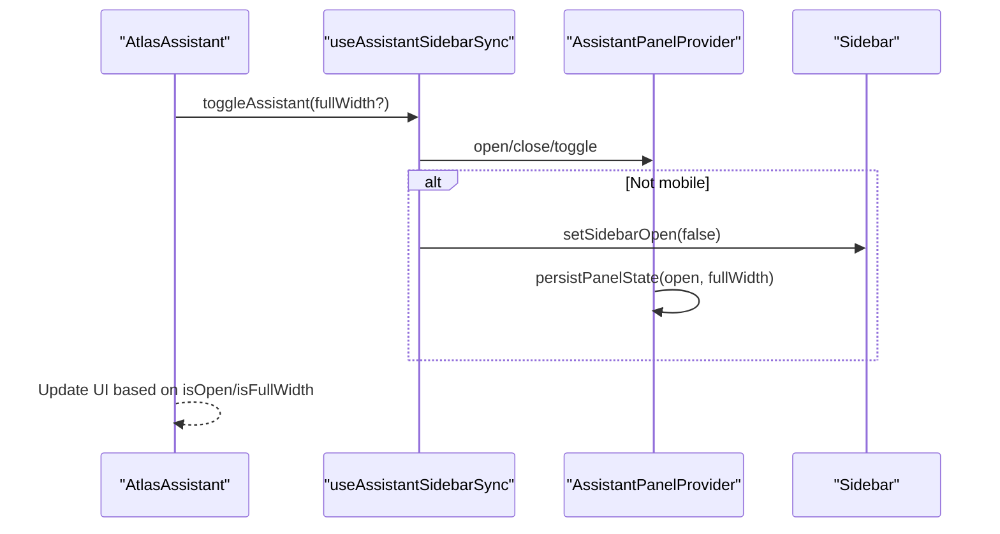
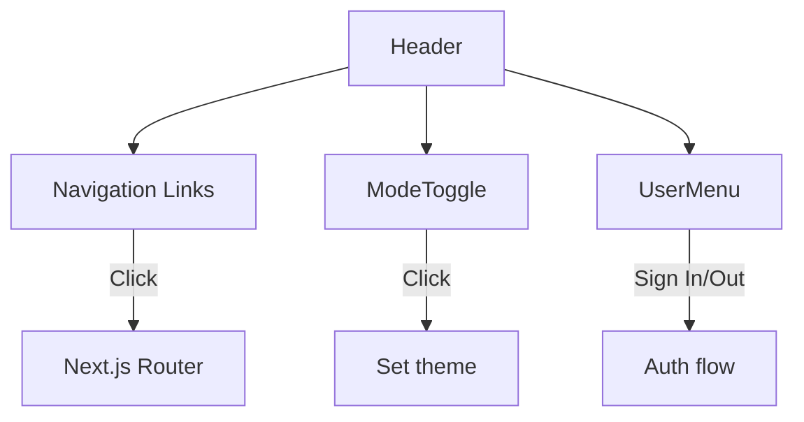
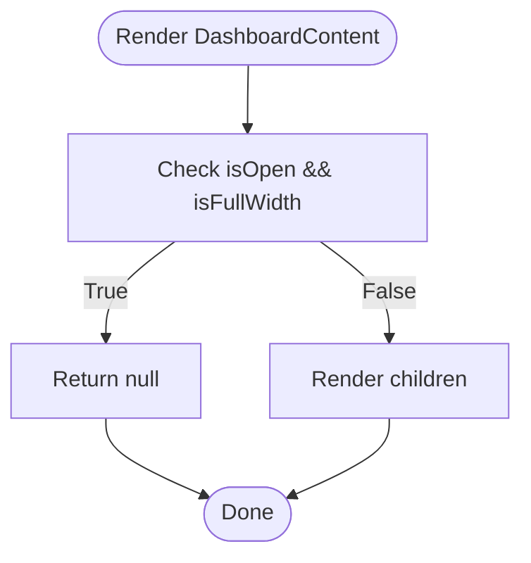
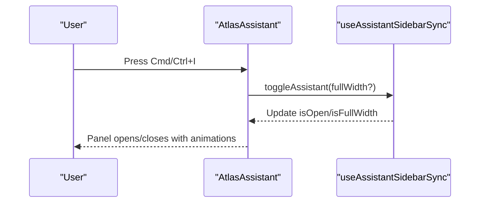
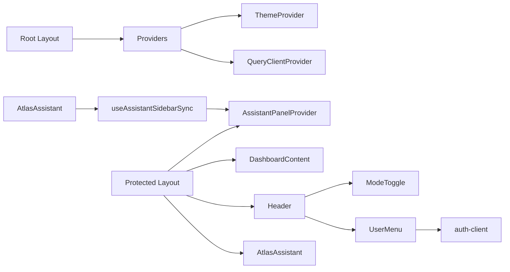

# Component Architecture

<cite>
**Referenced Files in This Document**
- [providers.tsx](file://apps/web/src/components/providers.tsx)
- [theme-provider.tsx](file://apps/web/src/components/theme-provider.tsx)
- [trpc.ts](file://apps/web/src/utils/trpc.ts)
- [layout.tsx](file://apps/web/src/app/layout.tsx)
- [protected layout.tsx](file://apps/web/src/app/(protected)/layout.tsx)
- [use-assistant-panel.tsx](file://apps/web/src/hooks/use-assistant-panel.tsx)
- [atlas-assistant.tsx](file://apps/web/src/components/atlas-assistant.tsx)
- [dashboard-content.tsx](file://apps/web/src/components/dashboard-content.tsx)
- [header.tsx](file://apps/web/src/components/header.tsx)
- [mode-toggle.tsx](file://apps/web/src/components/mode-toggle.tsx)
- [user-menu.tsx](file://apps/web/src/components/user-menu.tsx)
- [auth-client.ts](file://apps/web/src/lib/auth-client.ts)
</cite>

## Table of Contents

1. Introduction
2. Project Structure
3. Core Components
4. Architecture Overview
5. Detailed Component Analysis
6. Dependency Analysis
7. Performance Considerations
8. Troubleshooting Guide
9. Conclusion

## Introduction

This document explains the React component architecture with a focus on modular design and composition patterns. It covers the provider pattern for global state management, authentication context integration, theme handling, and the implementation of custom components such as header navigation, dashboard content layout, and the AI assistant interface. It also documents reusability patterns, prop interfaces, event handling strategies, examples of composition and state lifting, and performance optimization techniques used throughout the application.

## Project Structure

The application is organized under apps/web/src with:

- app/: Next.js App Router layouts and pages
- components/: Reusable UI components and providers
- hooks/: Custom hooks encapsulating shared logic (e.g., assistant panel state)
- lib/: Client libraries (e.g., auth client)
- utils/: Utilities (e.g., tRPC client configuration)

**Diagram sources**

- [layout.tsx:26-46](file://apps/web/src/app/layout.tsx#L26-L46)
- [providers.tsx:11-26](file://apps/web/src/components/providers.tsx#L11-L26)
- [protected layout.tsx:22-65](<file://apps/web/src/app/(protected)/layout.tsx#L22-L65>)

**Section sources**

- [layout.tsx:26-46](file://apps/web/src/app/layout.tsx#L26-L46)
- [providers.tsx:11-26](file://apps/web/src/components/providers.tsx#L11-L26)
- [protected layout.tsx:22-65](<file://apps/web/src/app/(protected)/layout.tsx#L22-L65>)

## Core Components

- Providers: Wraps the app with ThemeProvider and QueryClientProvider to deliver theme and data fetching contexts globally.
- Theme Provider: A thin wrapper around next-themes to enable system-aware theming with class-based attribute toggling.
- Data Layer: tRPC client configured with TanStack Query for caching, error handling, and retry actions via toast notifications.
- Protected Layout: Enforces authentication, sets up sidebar and assistant panel providers, and composes header and content areas.
- Assistant Panel Hook: Centralizes open/close/full-width state, persists it to localStorage, and coordinates with the app sidebar.
- Atlas Assistant: Renders the assistant panel with keyboard shortcuts, header controls, empty state suggestions, and composer UI.
- Dashboard Content: Conditionally hides content when the assistant is full-screen to avoid overlapping UI.
- Header Navigation: Provides top-level links, mode toggle, and user menu for quick access and account actions.
- Mode Toggle: Allows switching between light, dark, and system themes using next-themes.
- User Menu: Displays session status, sign-in/sign-out flows, and navigates after sign-out.

**Section sources**

- [providers.tsx:11-26](file://apps/web/src/components/providers.tsx#L11-L26)
- [theme-provider.tsx:6-11](file://apps/web/src/components/theme-provider.tsx#L6-L11)
- [trpc.ts:7-40](file://apps/web/src/utils/trpc.ts#L7-L40)
- [protected layout.tsx:22-65](<file://apps/web/src/app/(protected)/layout.tsx#L22-L65>)
- [use-assistant-panel.tsx:20-235](file://apps/web/src/hooks/use-assistant-panel.tsx#L20-L235)
- [atlas-assistant.tsx:122-174](file://apps/web/src/components/atlas-assistant.tsx#L122-L174)
- [dashboard-content.tsx:5-17](file://apps/web/src/components/dashboard-content.tsx#L5-L17)
- [header.tsx:7-31](file://apps/web/src/components/header.tsx#L7-L31)
- [mode-toggle.tsx:13-36](file://apps/web/src/components/mode-toggle.tsx#L13-L36)
- [user-menu.tsx:17-62](file://apps/web/src/components/user-menu.tsx#L17-L62)

## Architecture Overview

The application uses a layered provider model:

- Root layout wraps all children with Providers to establish theme and query contexts.
- Protected layout enforces authentication and composes:
  - SidebarProvider for layout and responsive behavior
  - AssistantPanelProvider for assistant panel state and persistence
  - DashboardContent to coordinate visibility with the assistant panel
  - Header area with ModeToggle and UserMenu
  - AtlasAssistant as a side panel integrated with the sidebar

**Diagram sources**

- [layout.tsx:26-46](file://apps/web/src/app/layout.tsx#L26-L46)
- [providers.tsx:11-26](file://apps/web/src/components/providers.tsx#L11-L26)
- [protected layout.tsx:22-65](<file://apps/web/src/app/(protected)/layout.tsx#L22-L65>)
- [use-assistant-panel.tsx:67-151](file://apps/web/src/hooks/use-assistant-panel.tsx#L67-L151)

## Detailed Component Analysis

### Providers and Global Contexts

- Providers composes ThemeProvider and QueryClientProvider, enabling global theme and data caching.
- ThemeProvider configures class-based attribute toggling and system theme detection.
- QueryClientProvider integrates with tRPC and displays toast notifications for errors with retry actions.

**Diagram sources**

- [providers.tsx:11-26](file://apps/web/src/components/providers.tsx#L11-L26)
- [theme-provider.tsx:6-11](file://apps/web/src/components/theme-provider.tsx#L6-L11)
- [trpc.ts:7-40](file://apps/web/src/utils/trpc.ts#L7-L40)

**Section sources**

- [providers.tsx:11-26](file://apps/web/src/components/providers.tsx#L11-L26)
- [theme-provider.tsx:6-11](file://apps/web/src/components/theme-provider.tsx#L6-L11)
- [trpc.ts:7-40](file://apps/web/src/utils/trpc.ts#L7-L40)

### Authentication Context Integration

- The protected layout checks the server-side session and redirects unauthenticated users to /auth.
- Client-side auth state is consumed via authClient.useSession() in UserMenu and NavUser.
- Sign-in flows use social providers and redirect to appropriate callback URLs.

**Diagram sources**

- [protected layout.tsx:22-33](<file://apps/web/src/app/(protected)/layout.tsx#L22-L33>)
- [user-menu.tsx:17-62](file://apps/web/src/components/user-menu.tsx#L17-L62)
- [auth-client.ts:5-7](file://apps/web/src/lib/auth-client.ts#L5-L7)

**Section sources**

- [protected layout.tsx:22-33](<file://apps/web/src/app/(protected)/layout.tsx#L22-L33>)
- [user-menu.tsx:17-62](file://apps/web/src/components/user-menu.tsx#L17-L62)
- [auth-client.ts:5-7](file://apps/web/src/lib/auth-client.ts#L5-L7)

### Theme Handling

- ThemeProvider enables system-aware theming with class attribute toggling.
- ModeToggle provides UI to switch between light, dark, and system modes.
- Theme changes are applied globally through the provider context.

**Diagram sources**

- [theme-provider.tsx:6-11](file://apps/web/src/components/theme-provider.tsx#L6-L11)
- [mode-toggle.tsx:13-36](file://apps/web/src/components/mode-toggle.tsx#L13-L36)

**Section sources**

- [theme-provider.tsx:6-11](file://apps/web/src/components/theme-provider.tsx#L6-L11)
- [mode-toggle.tsx:13-36](file://apps/web/src/components/mode-toggle.tsx#L13-L36)

### Assistant Panel State Management

- AssistantPanelProvider manages isOpen, isFullWidth, and sidebar snapshot state.
- State is persisted to localStorage keys for panel open/full-width and sidebar state before opening.
- useAssistantSidebarSync coordinates assistant panel with the app sidebar, collapsing/expanding as needed and restoring previous sidebar state.

**Diagram sources**

- [use-assistant-panel.tsx:67-151](file://apps/web/src/hooks/use-assistant-panel.tsx#L67-L151)
- [use-assistant-panel.tsx:169-235](file://apps/web/src/hooks/use-assistant-panel.tsx#L169-L235)
- [atlas-assistant.tsx:122-174](file://apps/web/src/components/atlas-assistant.tsx#L122-L174)

**Section sources**

- [use-assistant-panel.tsx:67-151](file://apps/web/src/hooks/use-assistant-panel.tsx#L67-L151)
- [use-assistant-panel.tsx:169-235](file://apps/web/src/hooks/use-assistant-panel.tsx#L169-L235)
- [atlas-assistant.tsx:122-174](file://apps/web/src/components/atlas-assistant.tsx#L122-L174)

### Custom Components: Header Navigation

- Header renders top-level navigation links and includes ModeToggle and UserMenu for quick actions.
- Links are defined as a constant array and mapped to Next.js Link components.
- Event handling is minimal; interactions rely on built-in navigation and dropdown behaviors.

**Diagram sources**

- [header.tsx:7-31](file://apps/web/src/components/header.tsx#L7-L31)
- [mode-toggle.tsx:13-36](file://apps/web/src/components/mode-toggle.tsx#L13-L36)
- [user-menu.tsx:17-62](file://apps/web/src/components/user-menu.tsx#L17-L62)

**Section sources**

- [header.tsx:7-31](file://apps/web/src/components/header.tsx#L7-L31)

### Custom Components: Dashboard Content Layout

- DashboardContent conditionally renders children based on assistant panel state.
- When the assistant is open and full-width, it returns null to prevent overlapping content.

**Diagram sources**

- [dashboard-content.tsx:5-17](file://apps/web/src/components/dashboard-content.tsx#L5-L17)

**Section sources**

- [dashboard-content.tsx:5-17](file://apps/web/src/components/dashboard-content.tsx#L5-L17)

### Custom Components: AI Assistant Interface

- AtlasAssistant integrates with useAssistantSidebarSync to control panel visibility and width.
- Keyboard shortcut (Cmd/Ctrl + I) toggles the panel.
- Sub-components include AssistantHeader (close/toggle), AssistantEmptyState (suggestions), and AssistantComposer (input).

**Diagram sources**

- [atlas-assistant.tsx:122-174](file://apps/web/src/components/atlas-assistant.tsx#L122-L174)
- [use-assistant-panel.tsx:169-235](file://apps/web/src/hooks/use-assistant-panel.tsx#L169-L235)

**Section sources**

- [atlas-assistant.tsx:122-174](file://apps/web/src/components/atlas-assistant.tsx#L122-L174)

### Prop Interfaces and Reusability Patterns

- Props are explicitly typed using TypeScript interfaces or inline types for clarity and safety.
- Composition is used extensively:
  - Providers wrap children to inject global contexts.
  - DashboardContent composes page content while coordinating with assistant panel state.
  - AtlasAssistant composes smaller sub-components (header, empty state, composer).
- Event handling strategies:
  - Keyboard events are attached via useEffect with cleanup to avoid leaks.
  - Dropdown menus handle clicks to trigger actions like sign out or theme changes.
  - Navigation uses Next.js Link and router.push for programmatic navigation.

**Section sources**

- [atlas-assistant.tsx:27-120](file://apps/web/src/components/atlas-assistant.tsx#L27-L120)
- [dashboard-content.tsx:5-17](file://apps/web/src/components/dashboard-content.tsx#L5-L17)
- [mode-toggle.tsx:13-36](file://apps/web/src/components/mode-toggle.tsx#L13-L36)
- [user-menu.tsx:17-62](file://apps/web/src/components/user-menu.tsx#L17-L62)

### State Lifting Examples

- Assistant panel state is lifted into AssistantPanelProvider and accessed via useAssistantSidebarSync across components (AtlasAssistant and DashboardContent).
- Sidebar state is coordinated with assistant panel state to ensure consistent UX across devices.

**Section sources**

- [use-assistant-panel.tsx:67-151](file://apps/web/src/hooks/use-assistant-panel.tsx#L67-L151)
- [use-assistant-panel.tsx:169-235](file://apps/web/src/hooks/use-assistant-panel.tsx#L169-L235)
- [atlas-assistant.tsx:122-174](file://apps/web/src/components/atlas-assistant.tsx#L122-L174)
- [dashboard-content.tsx:5-17](file://apps/web/src/components/dashboard-content.tsx#L5-L17)

### Performance Optimization Techniques

- Memoization:
  - Context value is memoized to minimize re-renders in AssistantPanelProvider.
- LocalStorage Persistence:
  - Panel state is persisted to avoid unnecessary re-initialization and improve perceived performance.
- Conditional Rendering:
  - DashboardContent avoids rendering when assistant is full-screen to reduce DOM overhead.
- Efficient Event Listeners:
  - Keyboard listeners are added and removed in useEffect to prevent memory leaks.
- Query Error Handling:
  - tRPC errors trigger toast notifications with retry actions, improving user experience without blocking UI.

**Section sources**

- [use-assistant-panel.tsx:127-146](file://apps/web/src/hooks/use-assistant-panel.tsx#L127-L146)
- [use-assistant-panel.tsx:34-61](file://apps/web/src/hooks/use-assistant-panel.tsx#L34-L61)
- [dashboard-content.tsx:5-17](file://apps/web/src/components/dashboard-content.tsx#L5-L17)
- [atlas-assistant.tsx:126-136](file://apps/web/src/components/atlas-assistant.tsx#L126-L136)
- [trpc.ts:7-20](file://apps/web/src/utils/trpc.ts#L7-L20)

## Dependency Analysis

The following diagram shows key dependencies among components and providers:

**Diagram sources**

- [layout.tsx:26-46](file://apps/web/src/app/layout.tsx#L26-L46)
- [providers.tsx:11-26](file://apps/web/src/components/providers.tsx#L11-L26)
- [protected layout.tsx:22-65](<file://apps/web/src/app/(protected)/layout.tsx#L22-L65>)
- [use-assistant-panel.tsx:67-151](file://apps/web/src/hooks/use-assistant-panel.tsx#L67-L151)
- [atlas-assistant.tsx:122-174](file://apps/web/src/components/atlas-assistant.tsx#L122-L174)
- [user-menu.tsx:17-62](file://apps/web/src/components/user-menu.tsx#L17-L62)
- [auth-client.ts:5-7](file://apps/web/src/lib/auth-client.ts#L5-L7)

**Section sources**

- [layout.tsx:26-46](file://apps/web/src/app/layout.tsx#L26-L46)
- [providers.tsx:11-26](file://apps/web/src/components/providers.tsx#L11-L26)
- [protected layout.tsx:22-65](<file://apps/web/src/app/(protected)/layout.tsx#L22-L65>)
- [use-assistant-panel.tsx:67-151](file://apps/web/src/hooks/use-assistant-panel.tsx#L67-L151)
- [atlas-assistant.tsx:122-174](file://apps/web/src/components/atlas-assistant.tsx#L122-L174)
- [user-menu.tsx:17-62](file://apps/web/src/components/user-menu.tsx#L17-L62)
- [auth-client.ts:5-7](file://apps/web/src/lib/auth-client.ts#L5-L7)

## Performance Considerations

- Prefer memoizing context values to avoid unnecessary re-renders.
- Persist critical UI state to localStorage to maintain user preferences across sessions.
- Use conditional rendering to hide non-essential content when overlays are active.
- Attach event listeners within effects with proper cleanup to prevent memory leaks.
- Leverage TanStack Query for efficient data caching and error handling with user-friendly retries.

[No sources needed since this section provides general guidance]

## Troubleshooting Guide

- If the assistant panel does not persist its state, verify localStorage availability and error handling in readStoredBoolean/persistPanelState.
- If the sidebar does not restore correctly after closing the assistant, check getSidebarStateBeforeOpen/setSidebarStateBeforeOpen usage in useAssistantSidebarSync.
- If theme changes do not apply, ensure ThemeProvider is wrapping the app and ModeToggle calls setTheme from useTheme.
- If authentication flows fail, confirm server-side session checks in protected layout and client-side authClient usage in components.

**Section sources**

- [use-assistant-panel.tsx:34-61](file://apps/web/src/hooks/use-assistant-panel.tsx#L34-L61)
- [use-assistant-panel.tsx:169-235](file://apps/web/src/hooks/use-assistant-panel.tsx#L169-L235)
- [theme-provider.tsx:6-11](file://apps/web/src/components/theme-provider.tsx#L6-L11)
- [mode-toggle.tsx:13-36](file://apps/web/src/components/mode-toggle.tsx#L13-L36)
- [protected layout.tsx:22-33](<file://apps/web/src/app/(protected)/layout.tsx#L22-L33>)
- [user-menu.tsx:17-62](file://apps/web/src/components/user-menu.tsx#L17-L62)

## Conclusion

The application employs a robust provider-based architecture to manage global state, authentication, and theming. Modular components are composed to create flexible layouts, while custom hooks centralize complex interactions like assistant panel coordination. State lifting and memoization enhance performance, and thoughtful error handling improves user experience. This structure supports scalability and maintainability as the application evolves.

[No sources needed since this section summarizes without analyzing specific files]
